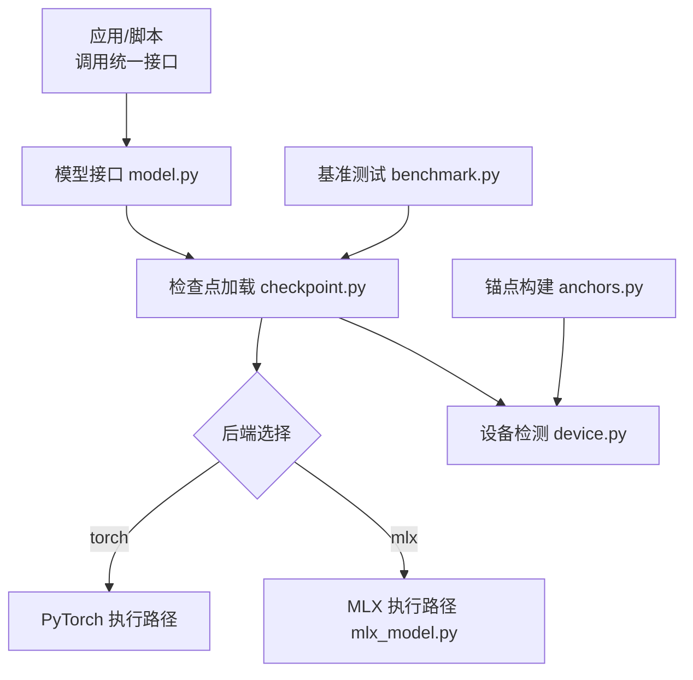
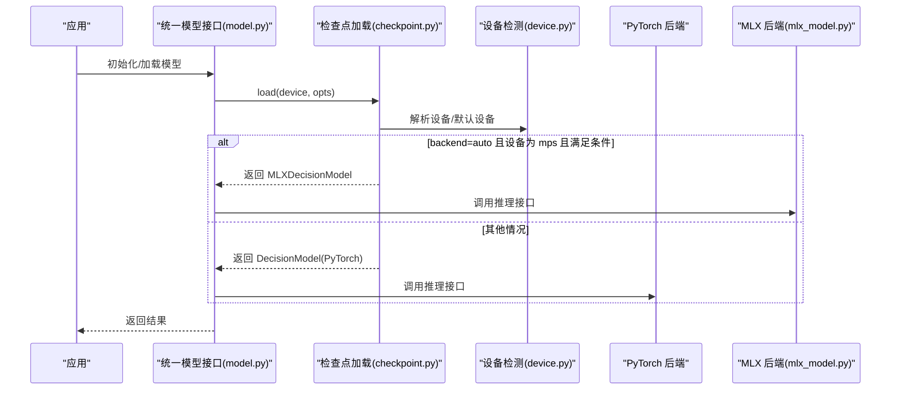
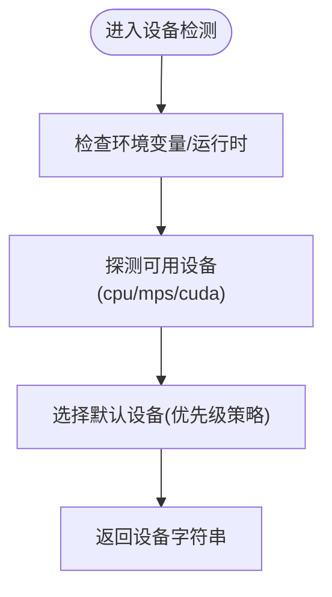
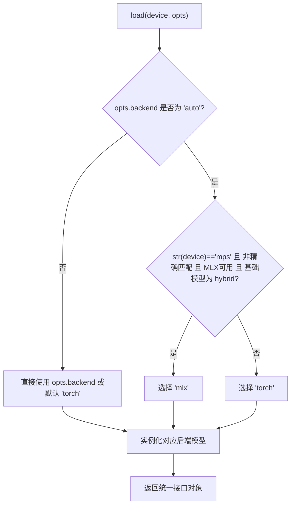
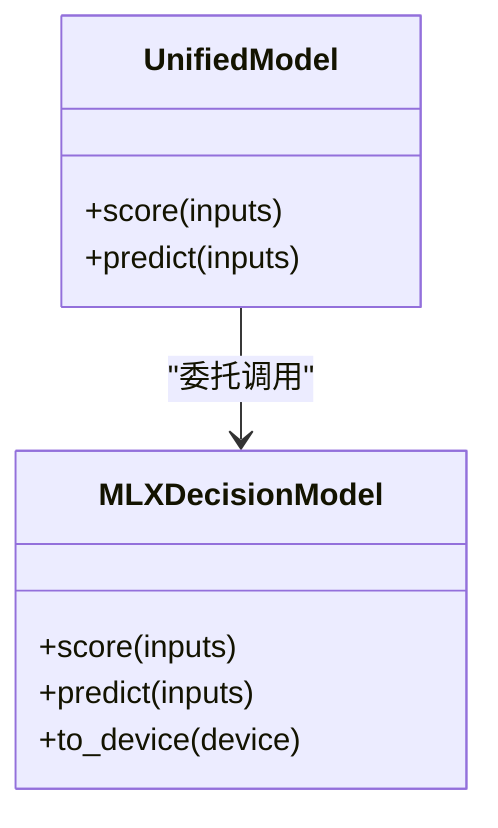
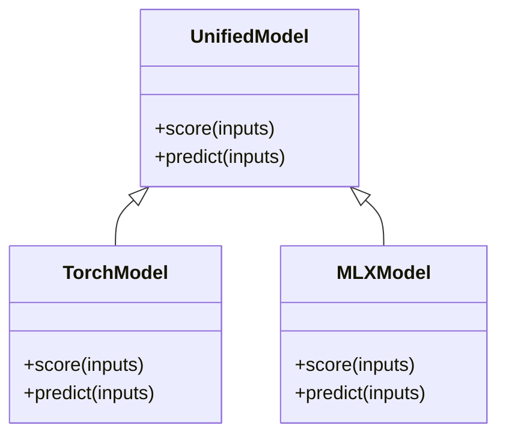
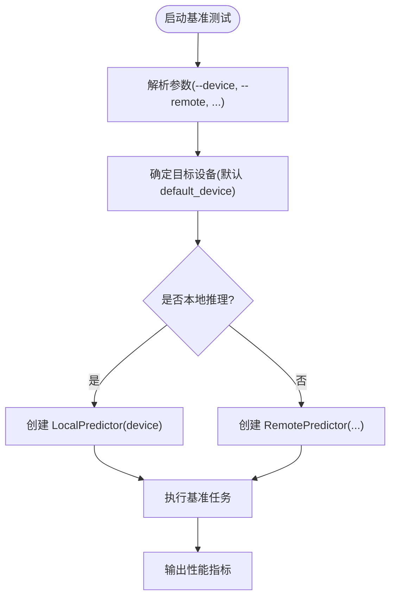
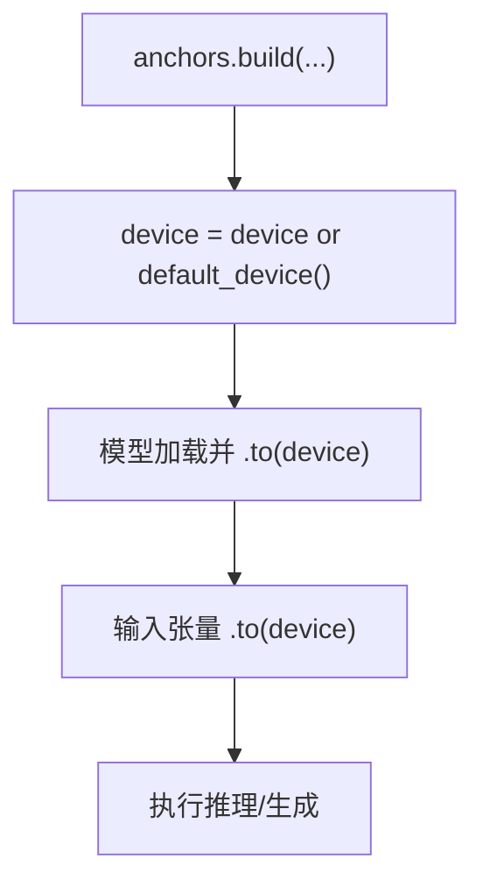
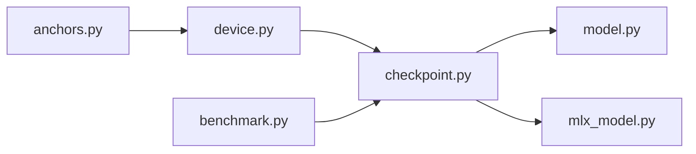

<cite>
**本文引用的文件**   
- [device.py](file://kev/device.py)
- [checkpoint.py](file://kev/checkpoint.py)
- [mlx_model.py](file://kev/mlx_model.py)
- [model.py](file://kev/model.py)
- [benchmark.py](file://kev/benchmark.py)
- [anchors.py](file://kev/anchors.py)
</cite>

## 目录
1. [简介](#简介)
2. [项目结构](#项目结构)
3. [核心组件](#核心组件)
4. [架构总览](#架构总览)
5. [详细组件分析](#详细组件分析)
6. [依赖关系分析](#依赖关系分析)
7. [性能考量](#性能考量)
8. [故障排查指南](#故障排查指南)
9. [结论](#结论)
10. [附录](#附录)

## 简介
本技术文档聚焦于“设备抽象层”，旨在为开发者提供统一设备接口的实现原理与跨后端（PyTorch、MLX）适配机制的深入说明。文档覆盖 CPU、GPU 与 Apple Silicon（MPS）的性能差异与优化策略，系统阐述设备检测算法、内存管理与计算资源分配机制，并给出跨设备兼容性处理方案（数据类型转换、内存拷贝优化、并行调度）。同时包含在不同硬件平台上的部署指南与环境调优建议，以及常见设备相关问题的诊断与解决方案。

## 项目结构
围绕设备抽象层的关键代码集中在以下模块：
- kev/device.py：设备检测与默认设备选择逻辑
- kev/checkpoint.py：加载选项、后端选择（torch/MLX/auto）、设备到后端的映射
- kev/mlx_model.py：MLX 后端模型封装与推理接口
- kev/model.py：统一模型接口（供上层业务使用）
- kev/benchmark.py：基准测试入口，支持 cpu/mps/cuda 设备参数
- kev/anchors.py：示例构建流程中对 default_device 的使用

**图示来源**
- [checkpoint.py:219-228](file://kev/checkpoint.py#L219-L228)
- [device.py:1-200](file://kev/device.py#L1-L200)
- [mlx_model.py:1-200](file://kev/mlx_model.py#L1-L200)
- [model.py:1-200](file://kev/model.py#L1-L200)
- [benchmark.py:170-210](file://kev/benchmark.py#L170-L210)
- [anchors.py:30-40](file://kev/anchors.py#L30-L40)

**章节来源**
- [checkpoint.py:219-228](file://kev/checkpoint.py#L219-L228)
- [device.py:1-200](file://kev/device.py#L1-L200)
- [mlx_model.py:1-200](file://kev/mlx_model.py#L1-L200)
- [model.py:1-200](file://kev/model.py#L1-L200)
- [benchmark.py:170-210](file://kev/benchmark.py#L170-L210)
- [anchors.py:30-40](file://kev/anchors.py#L30-L40)

## 核心组件
- 设备检测与默认设备选择：提供统一的设备字符串（cpu/mps/cuda）与默认设备获取能力，供上层模块一致使用。
- 后端选择与加载：根据 LoadOptions.backend 与环境变量 KEV_BACKEND 决定使用 torch 或 mlx；当设置为 auto 时，结合设备类型与基础模型特性进行智能选择。
- MLX 后端适配：通过 MLXDecisionModel 暴露与 PyTorch 一致的评分接口，屏蔽底层差异。
- 统一模型接口：对外暴露一致的预测/评分 API，内部路由至具体后端实现。
- 基准测试工具：支持指定设备运行基准，便于横向对比不同硬件平台的吞吐与时延。

**章节来源**
- [device.py:1-200](file://kev/device.py#L1-L200)
- [checkpoint.py:219-228](file://kev/checkpoint.py#L219-L228)
- [mlx_model.py:1-200](file://kev/mlx_model.py#L1-L200)
- [model.py:1-200](file://kev/model.py#L1-L200)
- [benchmark.py:170-210](file://kev/benchmark.py#L170-L210)

## 架构总览
设备抽象层在“统一模型接口”之上，通过“检查点加载器”完成后端选择与实例化，最终将计算调度交给具体后端（PyTorch 或 MLX）。设备检测模块贯穿整个生命周期，确保数据与模型始终位于合适的设备上。

**图示来源**
- [checkpoint.py:219-228](file://kev/checkpoint.py#L219-L228)
- [device.py:1-200](file://kev/device.py#L1-L200)
- [mlx_model.py:1-200](file://kev/mlx_model.py#L1-L200)
- [model.py:1-200](file://kev/model.py#L1-L200)

## 详细组件分析

### 设备检测与默认设备选择（device.py）
- 功能要点
  - 提供默认设备字符串（如 cpu/mps/cuda），供各模块统一使用。
  - 作为设备选择的权威来源，避免分散的设备判断逻辑。
- 设计模式
  - 单例式配置：集中管理设备信息，降低耦合。
- 典型用法
  - 在锚点构建、基准测试等入口处直接调用默认设备，保证一致性。

**图示来源**
- [device.py:1-200](file://kev/device.py#L1-L200)

**章节来源**
- [device.py:1-200](file://kev/device.py#L1-L200)
- [anchors.py:30-40](file://kev/anchors.py#L30-L40)
- [benchmark.py:170-210](file://kev/benchmark.py#L170-L210)

### 后端选择与加载（checkpoint.py）
- 功能要点
  - LoadOptions.backend 支持 torch、mlx、auto 三种模式。
  - 当 backend=auto 时，若设备为 mps 且基础模型为 hybrid 且 MLX 可用，则选择 MLX 后端，否则回退到 torch。
  - 支持通过环境变量 KEV_BACKEND 强制指定后端。
- 关键流程
  - 校验 backend 值合法性。
  - 根据设备与基础模型特性自动决策。
  - 返回对应后端的具体模型类（DecisionModel 或 MLXDecisionModel）。

**图示来源**
- [checkpoint.py:219-228](file://kev/checkpoint.py#L219-L228)

**章节来源**
- [checkpoint.py:219-228](file://kev/checkpoint.py#L219-L228)

### MLX 后端适配（mlx_model.py）
- 功能要点
  - 封装 MLX 推理路径，暴露与 PyTorch 一致的评分接口。
  - 负责 MLX 侧的数据类型与内存布局适配。
- 集成方式
  - 由检查点加载器在 auto 模式下按需返回 MLXDecisionModel。
  - 上层无需感知后端差异，统一通过 model.py 的接口调用。

**图示来源**
- [mlx_model.py:1-200](file://kev/mlx_model.py#L1-L200)
- [model.py:1-200](file://kev/model.py#L1-L200)

**章节来源**
- [mlx_model.py:1-200](file://kev/mlx_model.py#L1-L200)
- [model.py:1-200](file://kev/model.py#L1-L200)

### 统一模型接口（model.py）
- 功能要点
  - 对外暴露一致的 score/predict 接口，屏蔽后端差异。
  - 内部根据加载阶段已选定的后端进行转发。
- 设计原则
  - 高内聚低耦合：上层仅依赖统一接口，不关心具体后端实现。

**图示来源**
- [model.py:1-200](file://kev/model.py#L1-L200)

**章节来源**
- [model.py:1-200](file://kev/model.py#L1-L200)

### 基准测试工具（benchmark.py）
- 功能要点
  - 支持 --device 参数选择 cpu/mps/cuda，默认使用 default_device()。
  - 可切换 LocalPredictor/RemotePredictor，便于在不同硬件上评估吞吐与时延。
- 使用场景
  - 快速验证不同设备的推理性能，辅助硬件选型与参数调优。

**图示来源**
- [benchmark.py:170-210](file://kev/benchmark.py#L170-L210)

**章节来源**
- [benchmark.py:170-210](file://kev/benchmark.py#L170-L210)

### 锚点构建中的设备使用（anchors.py）
- 功能要点
  - 在构建锚点数据时，优先使用 default_device()，并在需要时将张量移动到目标设备。
  - 对 dtype 的选择依据设备类型（例如非 CPU 使用 bfloat16，CPU 使用 float32）。

**图示来源**
- [anchors.py:30-40](file://kev/anchors.py#L30-L40)

**章节来源**
- [anchors.py:30-40](file://kev/anchors.py#L30-L40)

## 依赖关系分析
- 组件耦合
  - model.py 依赖 checkpoint.py 完成后端选择与实例化。
  - checkpoint.py 依赖 device.py 获取设备信息。
  - mlx_model.py 作为后端实现被 checkpoint.py 按需返回。
- 外部依赖
  - PyTorch（CUDA/MPS）与 MLX 库。
  - 环境变量 KEV_BACKEND 控制后端行为。

**图示来源**
- [device.py:1-200](file://kev/device.py#L1-L200)
- [checkpoint.py:219-228](file://kev/checkpoint.py#L219-L228)
- [mlx_model.py:1-200](file://kev/mlx_model.py#L1-L200)
- [model.py:1-200](file://kev/model.py#L1-L200)
- [benchmark.py:170-210](file://kev/benchmark.py#L170-L210)
- [anchors.py:30-40](file://kev/anchors.py#L30-L40)

**章节来源**
- [device.py:1-200](file://kev/device.py#L1-L200)
- [checkpoint.py:219-228](file://kev/checkpoint.py#L219-L228)
- [mlx_model.py:1-200](file://kev/mlx_model.py#L1-L200)
- [model.py:1-200](file://kev/model.py#L1-L200)
- [benchmark.py:170-210](file://kev/benchmark.py#L170-L210)
- [anchors.py:30-40](file://kev/anchors.py#L30-L40)

## 性能考量
- CPU
  - 适合轻量推理与调试；注意 dtype 使用 float32 以保证数值稳定性。
  - 可通过批大小与序列长度调优吞吐。
- GPU（CUDA）
  - 推荐 bfloat16 以提升吞吐与显存效率；启用 CUDA Graphs（如有）以减少内核启动开销。
  - 关注显存碎片与并发请求数，合理设置 batch size 与上下文长度。
- Apple Silicon（MPS）
  - 在 auto 模式下，若基础模型为 hybrid 且 MLX 可用，将优先走 MLX 后端以获得更好性能。
  - 注意 MPS 的注意力后端选择（SDPA/eager）对性能的影响。

[本节为通用性能指导，不涉及具体文件分析]

## 故障排查指南
- 后端选择异常
  - 现象：期望使用 MLX 但实际使用 torch。
  - 排查：确认设备是否为 mps；检查 KEV_BACKEND 环境变量；确认 MLX 是否安装且基础模型为 hybrid。
  - 参考：后端选择逻辑与 auto 判定规则。
- 设备不匹配导致 OOM
  - 现象：在 MPS/CUDA 上出现显存不足。
  - 排查：检查 dtype 设置（非 CPU 使用 bfloat16）；减少 batch size 或序列长度；确认模型与输入均位于同一设备。
  - 参考：锚点构建中对 dtype 与 to(device) 的处理。
- 基准测试结果不稳定
  - 现象：多次运行吞吐波动大。
  - 排查：关闭无关进程；固定随机种子；预热模型；避免频繁设备切换。
  - 参考：基准测试入口与设备参数传递。

**章节来源**
- [checkpoint.py:219-228](file://kev/checkpoint.py#L219-L228)
- [anchors.py:30-40](file://kev/anchors.py#L30-L40)
- [benchmark.py:170-210](file://kev/benchmark.py#L170-L210)

## 结论
设备抽象层通过统一的设备检测与后端选择机制，将 PyTorch 与 MLX 两种执行路径无缝整合到一致的模型接口中。该设计既保证了跨平台兼容性，又为性能优化提供了清晰的扩展点。开发者可在不改动上层业务代码的前提下，灵活切换硬件后端并获得稳定一致的推理体验。

[本节为总结性内容，不涉及具体文件分析]

## 附录
- 部署与环境配置建议
  - 安装 PyTorch（含 CUDA 或 MPS 支持）与 MLX 库。
  - 通过环境变量 KEV_BACKEND 强制指定后端，或在代码中使用 LoadOptions.backend="auto" 让系统自动选择。
  - 在 Apple Silicon 上优先使用 MLX 后端（hybrid 基础模型）以获得更佳性能。
- 常用命令与参数
  - 基准测试：指定 --device 为 cpu/mps/cuda，观察吞吐与时延变化。
  - 锚点构建：传入 --device 或使用默认设备，确保 dtype 与设备匹配。

[本节为补充信息，不涉及具体文件分析]