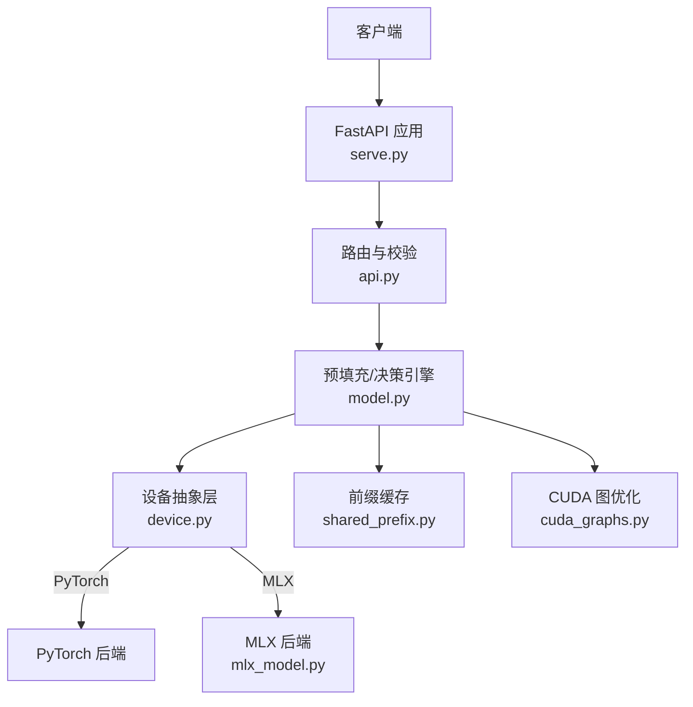
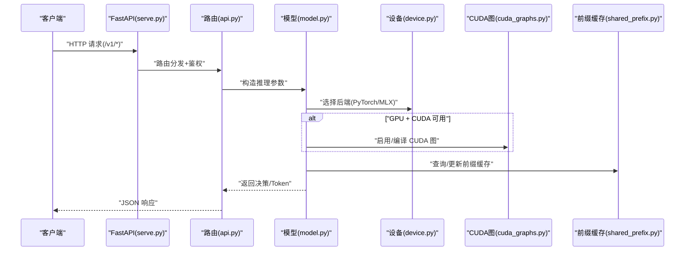
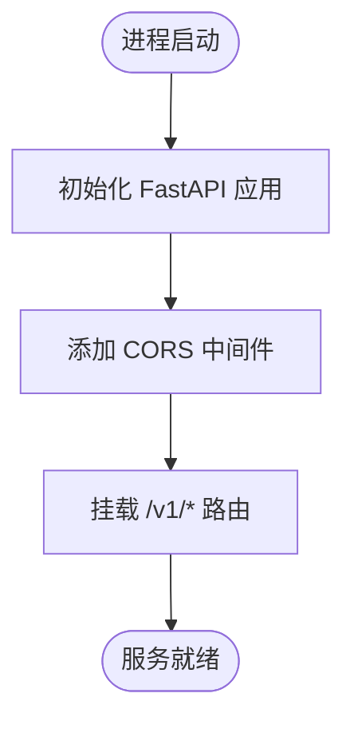
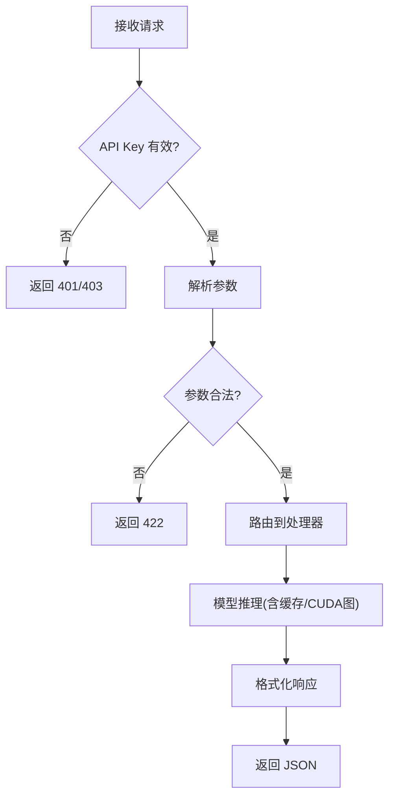
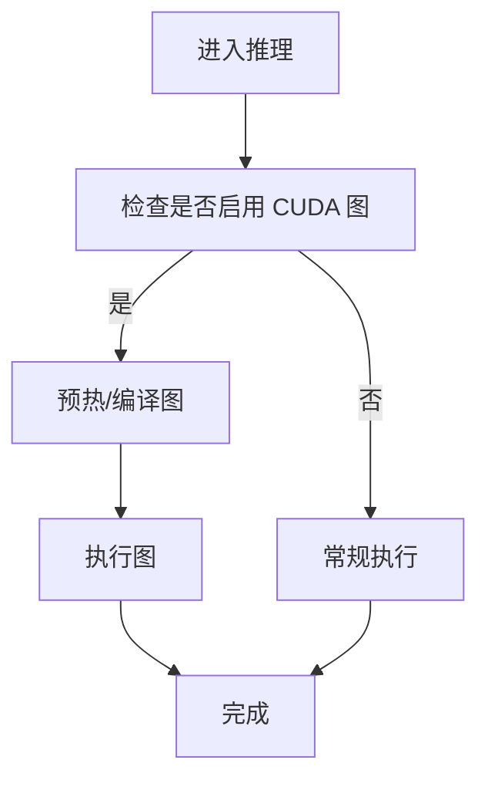
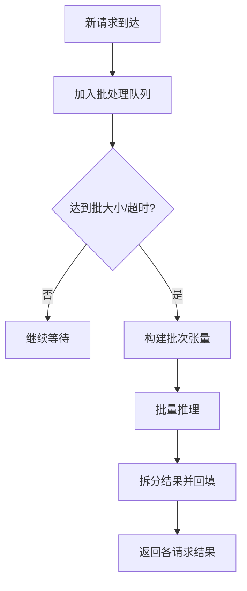
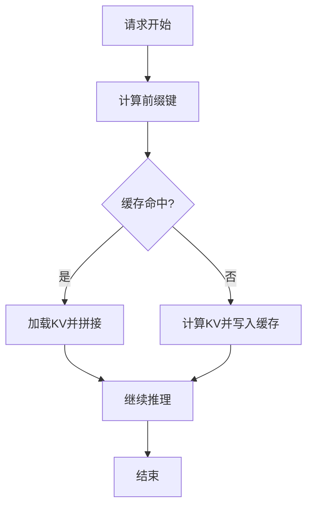
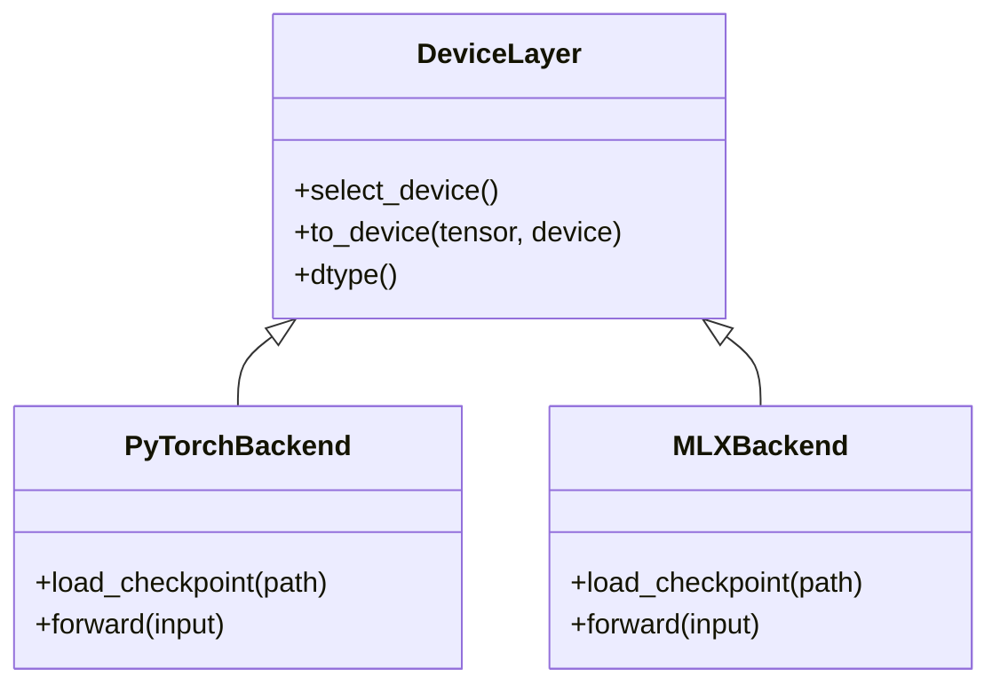
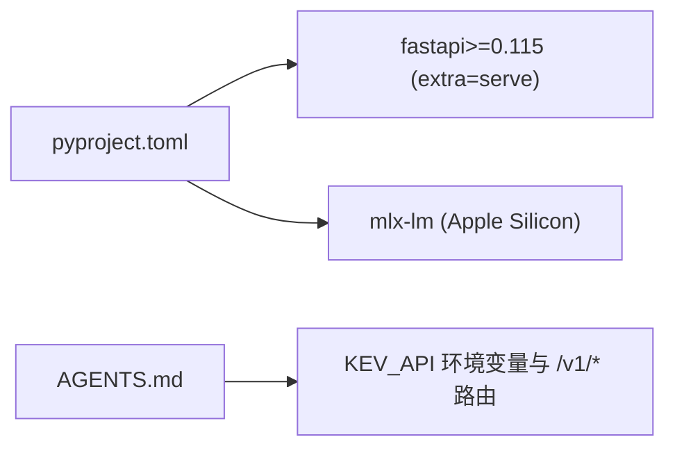

<cite>
**本文引用的文件**   
- [serve.py](file://kev/serve.py)
- [api.py](file://kev/api.py)
- [device.py](file://kev/device.py)
- [cuda_graphs.py](file://kev/cuda_graphs.py)
- [mlx_model.py](file://kev/mlx_model.py)
- [model.py](file://kev/model.py)
- [shared_prefix.py](file://kev/shared_prefix.py)
- [pyproject.toml](file://pyproject.toml)
- [AGENTS.md](file://AGENTS.md)
</cite>

## 目录
1. [简介](#简介)
2. [项目结构](#项目结构)
3. [核心组件](#核心组件)
4. [架构总览](#架构总览)
5. [详细组件分析](#详细组件分析)
6. [依赖关系分析](#依赖关系分析)
7. [性能考虑](#性能考虑)
8. [故障排除指南](#故障排除指南)
9. [结论](#结论)
10. [附录](#附录)

## 简介
本文件面向 Kev 推理服务的部署与使用，聚焦 FastAPI 侧的启动配置、请求处理流程与响应格式化；解释 CUDA 图优化、批量处理与前缀缓存如何提升推理吞吐与延迟；文档化设备抽象层对 PyTorch 与 MLX 后端以及 CPU/GPU/Apple Silicon 的统一接口；给出端口绑定、API 密钥校验、数据类型选择等配置项；并提供批大小调优、内存优化、并发处理、监控日志最佳实践与常见问题排查。

## 项目结构
Kev 推理服务以 FastAPI 作为 HTTP 入口，核心逻辑位于 kev 包内：
- 服务入口与路由：serve.py、api.py
- 模型与设备抽象：model.py、device.py、mlx_model.py
- 性能优化：cuda_graphs.py（CUDA Graph）、shared_prefix.py（前缀缓存）
- 依赖与可选特性：pyproject.toml（FastAPI 与 serve 额外依赖）
- 使用说明与环境变量：AGENTS.md（FastAPI 地址、Playground 代理说明）

图表来源
- [serve.py:227-230](file://kev/serve.py#L227-L230)
- [api.py:1-50](file://kev/api.py#L1-L50)
- [model.py:1-50](file://kev/model.py#L1-L50)
- [device.py:1-50](file://kev/device.py#L1-L50)
- [mlx_model.py:1-50](file://kev/mlx_model.py#L1-L50)
- [cuda_graphs.py:1-50](file://kev/cuda_graphs.py#L1-L50)
- [shared_prefix.py:1-50](file://kev/shared_prefix.py#L1-L50)

章节来源
- [serve.py:1-30](file://kev/serve.py#L1-L30)
- [AGENTS.md:336-340](file://AGENTS.md#L336-L340)

## 核心组件
- FastAPI 应用与中间件：创建 FastAPI 实例、注册 CORS、挂载路由、统一错误响应。
- 路由与认证：提供 /v1/systemone 与 /v1/models 等端点，支持 API Key 校验。
- 模型加载与推理：封装预填充与决策过程，对接设备抽象层。
- 设备抽象层：统一 PyTorch 与 MLX 后端，屏蔽 CPU/GPU/Apple Silicon 差异。
- 性能优化：
  - CUDA 图：减少内核启动开销，稳定小批次推理时延。
  - 批量处理：合并相似请求，提高 GPU 利用率。
  - 前缀缓存：复用历史 KV 状态，降低重复上下文计算成本。

章节来源
- [serve.py:17-20](file://kev/serve.py#L17-L20)
- [serve.py:206-230](file://kev/serve.py#L206-L230)
- [api.py:1-50](file://kev/api.py#L1-L50)
- [model.py:1-50](file://kev/model.py#L1-L50)
- [device.py:1-50](file://kev/device.py#L1-L50)
- [cuda_graphs.py:1-50](file://kev/cuda_graphs.py#L1-L50)
- [shared_prefix.py:1-50](file://kev/shared_prefix.py#L1-L50)

## 架构总览
下图展示从 HTTP 请求到模型推理的关键路径，包括认证、路由分发、设备选择、CUDA 图执行、前缀缓存命中与结果返回。

图表来源
- [serve.py:227-230](file://kev/serve.py#L227-L230)
- [api.py:1-50](file://kev/api.py#L1-L50)
- [model.py:1-50](file://kev/model.py#L1-L50)
- [device.py:1-50](file://kev/device.py#L1-L50)
- [cuda_graphs.py:1-50](file://kev/cuda_graphs.py#L1-L50)
- [shared_prefix.py:1-50](file://kev/shared_prefix.py#L1-L50)

## 详细组件分析

### FastAPI 服务启动与配置
- 应用初始化：创建 FastAPI 实例并设置标题。
- 中间件：启用 CORS 以支持 Playground 跨域访问。
- 路由挂载：注册 /v1/systemone 与 /v1/models 等端点。
- 进程与并发：同步端点在线程池中运行，受批大小与队列限制。
- 环境变量与端口：默认通过环境变量暴露服务地址，Playground 在浏览器侧通过反向代理访问。

图表来源
- [serve.py:227-230](file://kev/serve.py#L227-L230)
- [serve.py:17-20](file://kev/serve.py#L17-L20)
- [AGENTS.md:336-340](file://AGENTS.md#L336-L340)

章节来源
- [serve.py:17-20](file://kev/serve.py#L17-L20)
- [serve.py:206-230](file://kev/serve.py#L206-L230)
- [AGENTS.md:336-340](file://AGENTS.md#L336-L340)

### 请求处理流程与响应格式化
- 鉴权：基于 API Key 的请求头或参数进行校验，失败返回标准错误体。
- 参数解析：将输入消息、系统提示、采样参数等转换为内部数据结构。
- 推理调度：调用模型预填充与决策逻辑，必要时触发批量合并。
- 响应封装：统一 JSON 格式，包含决策结果、元数据与耗时统计。

图表来源
- [api.py:1-50](file://kev/api.py#L1-L50)
- [serve.py:206-230](file://kev/serve.py#L206-L230)

章节来源
- [api.py:1-50](file://kev/api.py#L1-L50)
- [serve.py:206-230](file://kev/serve.py#L206-L230)

### CUDA 图优化
- 目标：减少内核启动与同步开销，稳定短序列推理时延。
- 适用条件：固定形状或可归一化的输入批次，GPU 驱动与 CUDA 版本满足要求。
- 生命周期：首次预热编译图，后续复用执行；异常回退至普通执行路径。

图表来源
- [cuda_graphs.py:1-50](file://kev/cuda_graphs.py#L1-L50)
- [model.py:1-50](file://kev/model.py#L1-L50)

章节来源
- [cuda_graphs.py:1-50](file://kev/cuda_graphs.py#L1-L50)
- [model.py:1-50](file://kev/model.py#L1-L50)

### 批量处理机制
- 目的：聚合多个相似请求，最大化 GPU 并行度。
- 策略：按时间窗口或阈值触发合并；对共享前缀的请求优先合并。
- 风险：尾延迟可能上升，需结合超时与优先级控制。

图表来源
- [model.py:1-50](file://kev/model.py#L1-L50)
- [serve.py:206-230](file://kev/serve.py#L206-L230)

章节来源
- [model.py:1-50](file://kev/model.py#L1-L50)
- [serve.py:206-230](file://kev/serve.py#L206-L230)

### 前缀缓存机制
- 原理：缓存历史上下文的 KV 状态，命中时跳过重复计算。
- 键设计：基于系统提示、用户消息哈希与长度等特征。
- 淘汰策略：LRU/TTL 与显存上限控制。

图表来源
- [shared_prefix.py:1-50](file://kev/shared_prefix.py#L1-L50)
- [model.py:1-50](file://kev/model.py#L1-L50)

章节来源
- [shared_prefix.py:1-50](file://kev/shared_prefix.py#L1-L50)
- [model.py:1-50](file://kev/model.py#L1-L50)

### 设备抽象层（PyTorch 与 MLX）
- 抽象目标：统一 CPU/GPU/Apple Silicon 的设备选择与张量操作。
- 后端实现：
  - PyTorch：适用于 NVIDIA GPU 与 CPU。
  - MLX：适用于 Apple Silicon。
- 运行时切换：根据环境自动检测或显式配置后端。

图表来源
- [device.py:1-50](file://kev/device.py#L1-L50)
- [mlx_model.py:1-50](file://kev/mlx_model.py#L1-L50)
- [model.py:1-50](file://kev/model.py#L1-L50)

章节来源
- [device.py:1-50](file://kev/device.py#L1-L50)
- [mlx_model.py:1-50](file://kev/mlx_model.py#L1-L50)
- [model.py:1-50](file://kev/model.py#L1-L50)

## 依赖关系分析
- FastAPI 为可选依赖，通过 extra=serve 安装；playground 通过反向代理访问 /kev 路径，避免浏览器 CORS 问题。
- MLX 后端在 Apple Silicon 上通过额外依赖引入。

图表来源
- [pyproject.toml:38-40](file://pyproject.toml#L38-L40)
- [AGENTS.md:336-340](file://AGENTS.md#L336-L340)

章节来源
- [pyproject.toml:38-40](file://pyproject.toml#L38-L40)
- [AGENTS.md:336-340](file://AGENTS.md#L336-L340)

## 性能考虑
- 批大小设置
  - 依据显存容量与延迟目标调整；长上下文场景建议较小批大小以降低峰值显存。
  - 结合前缀缓存命中率评估实际收益。
- 内存优化
  - 启用前缀缓存并设置合理 TTL/LRU 上限。
  - 使用半精度或更低精度类型（如 float16/bfloat16），注意数值稳定性。
  - 关闭不必要的调试输出与中间态保存。
- 并发处理
  - FastAPI 同步端点默认线程池并发；可通过反向代理或容器编排水平扩展。
  - 针对高并发场景，建议开启请求限流与队列深度保护。
- CUDA 图
  - 仅在形状稳定的场景启用；频繁形状变化会导致频繁重编译。
  - 预热阶段应覆盖典型输入分布。
- 监控与日志
  - 记录每请求耗时、批大小、缓存命中率、设备利用率与显存占用。
  - 使用结构化日志便于聚合与分析；对慢请求与异常路径打点。

[本节为通用指导，不直接分析具体文件]

## 故障排除指南
- 无法连接服务
  - 检查 KEV_API 环境变量与端口是否正确；确认 Playground 代理路径 /kev 已配置。
- 鉴权失败
  - 核对 API Key 是否传递正确；服务端是否启用密钥校验。
- 显存不足
  - 减小批大小、启用前缀缓存、降低精度或缩短上下文长度。
- CUDA 图异常
  - 检查驱动与 CUDA 版本；禁用 CUDA 图回退到常规路径。
- MLX 后端不可用
  - 确认在 Apple Silicon 上安装了 MLX 相关依赖；环境变量未强制指定 PyTorch。

章节来源
- [AGENTS.md:336-340](file://AGENTS.md#L336-L340)
- [serve.py:206-230](file://kev/serve.py#L206-L230)
- [cuda_graphs.py:1-50](file://kev/cuda_graphs.py#L1-L50)
- [mlx_model.py:1-50](file://kev/mlx_model.py#L1-L50)

## 结论
Kev 推理服务通过 FastAPI 提供简洁的 HTTP 接口，结合设备抽象层兼容 PyTorch 与 MLX 后端，并在 GPU 环境下利用 CUDA 图、批量处理与前缀缓存显著提升性能。合理的批大小、精度与缓存策略，配合完善的监控与日志，可在不同硬件平台上获得稳定且高效的推理体验。

[本节为总结性内容，不直接分析具体文件]

## 附录
- 常用配置项
  - 端口绑定：通过环境变量或反向代理配置；默认服务地址由 KEV_API 指定。
  - API 密钥验证：在服务端启用并在客户端携带密钥。
  - 数据类型选择：根据设备能力与精度需求选择 float32/float16/bfloat16。
- 参考文件
  - FastAPI 应用与路由：serve.py、api.py
  - 设备与后端：device.py、mlx_model.py、model.py
  - 性能优化：cuda_graphs.py、shared_prefix.py
  - 依赖与环境：pyproject.toml、AGENTS.md

[本节为补充信息，不直接分析具体文件]