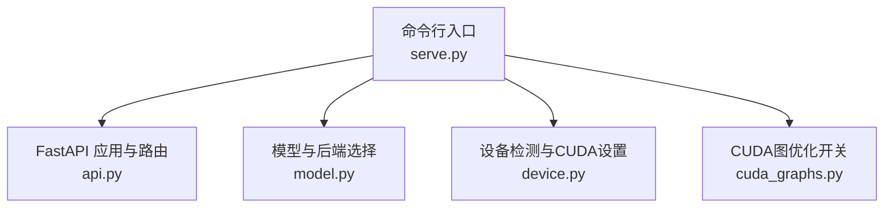
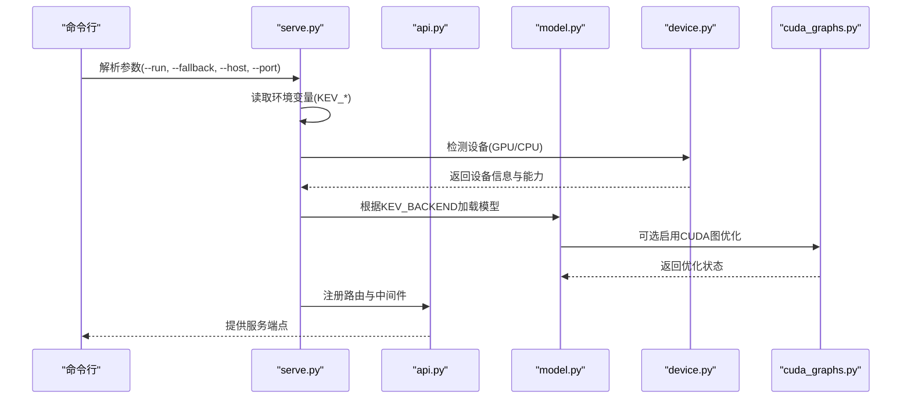
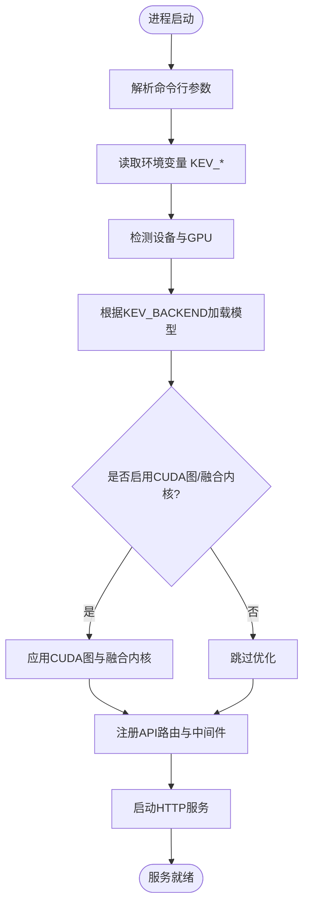
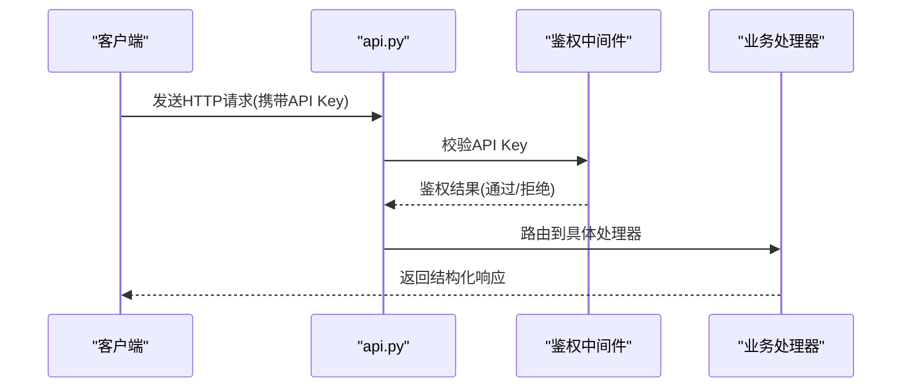
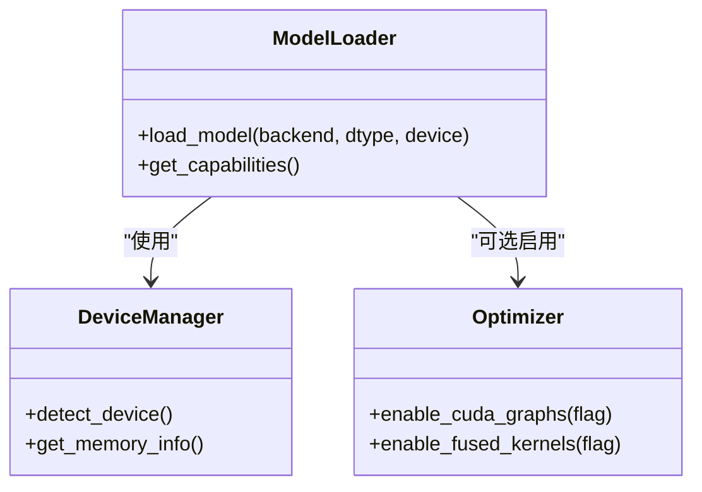
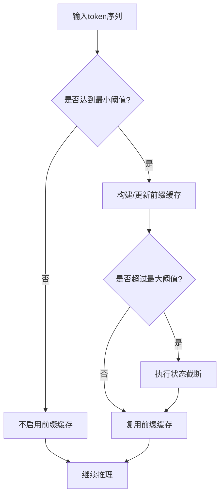
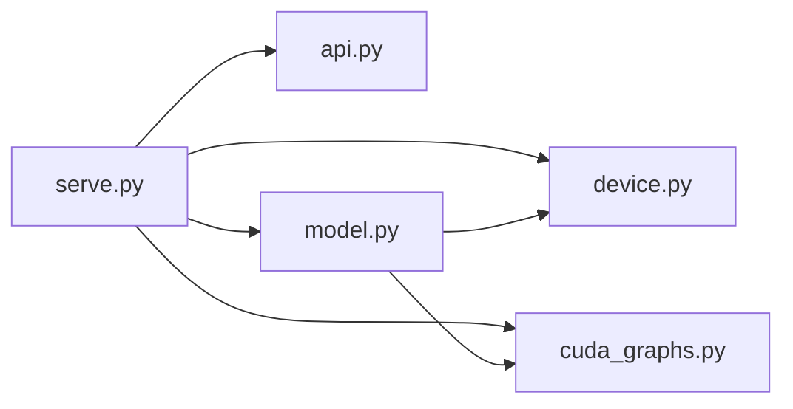

# 服务配置

<cite>
**本文引用的文件**   
- [serve.py](file://kev/serve.py)
- [api.py](file://kev/api.py)
- [model.py](file://kev/model.py)
- [device.py](file://kev/device.py)
- [cuda_graphs.py](file://kev/cuda_graphs.py)
</cite>

## 目录
1. [简介](#简介)
2. [项目结构](#项目结构)
3. [核心组件](#核心组件)
4. [架构总览](#架构总览)
5. [详细组件分析](#详细组件分析)
6. [依赖关系分析](#依赖关系分析)
7. [性能考虑](#性能考虑)
8. [故障排除指南](#故障排除指南)
9. [结论](#结论)

## 简介
本文档面向 Kev 推理服务的部署与运维人员，系统化说明 FastAPI 服务的启动参数、环境变量配置、服务启动流程（模型加载、设备检测、默认配置），并给出本地开发、生产环境与云端部署的最佳实践与常见问题排查建议。文档严格基于仓库源码进行分析与归纳，确保内容准确可追溯。

## 项目结构
Kev 的推理服务入口位于 kev/serve.py，FastAPI 应用与路由定义在 kev/api.py，模型抽象与后端选择逻辑在 kev/model.py，设备检测与 CUDA 相关设置在 kev/device.py 与 kev/cuda_graphs.py。

**图示来源**
- [serve.py:1-200](file://kev/serve.py#L1-L200)
- [api.py:1-200](file://kev/api.py#L1-L200)
- [model.py:1-200](file://kev/model.py#L1-L200)
- [device.py:1-200](file://kev/device.py#L1-L200)
- [cuda_graphs.py:1-200](file://kev/cuda_graphs.py#L1-L200)

**章节来源**
- [serve.py:1-200](file://kev/serve.py#L1-L200)
- [api.py:1-200](file://kev/api.py#L1-L200)
- [model.py:1-200](file://kev/model.py#L1-L200)
- [device.py:1-200](file://kev/device.py#L1-L200)
- [cuda_graphs.py:1-200](file://kev/cuda_graphs.py#L1-L200)

## 核心组件
- 命令行参数解析：提供 --run、--fallback、--host、--port 等选项，用于指定运行模式、回退策略、监听地址与端口。
- 环境变量配置：包括 KEV_API_KEY（API 密钥认证）、KEV_BACKEND（后端选择）、KEV_DTYPE（数据类型）、KEV_CUDA_GRAPHS（CUDA 图优化）、KEV_FUSED（融合内核）、KEV_PREFIX_CACHE（前缀缓存大小）、KEV_PREFIX_MIN_TOKENS、KEV_PREFIX_MAX_TOKENS（缓存 token 限制）、KEV_TRUNCATE_STATES（状态截断）等。
- 服务启动流程：初始化 FastAPI 应用、解析参数与环境变量、检测设备与 GPU、加载模型、注册路由与中间件、启动服务器。
- 关键模块职责：
  - serve.py：命令行参数与服务生命周期管理。
  - api.py：FastAPI 路由、请求处理与响应格式。
  - model.py：模型实例化、后端选择与推理接口封装。
  - device.py：设备检测、GPU/CPU 选择与内存信息。
  - cuda_graphs.py：CUDA Graph 启用与预热逻辑。

**章节来源**
- [serve.py:1-200](file://kev/serve.py#L1-L200)
- [api.py:1-200](file://kev/api.py#L1-L200)
- [model.py:1-200](file://kev/model.py#L1-L200)
- [device.py:1-200](file://kev/device.py#L1-L200)
- [cuda_graphs.py:1-200](file://kev/cuda_graphs.py#L1-L200)

## 架构总览
下图展示从命令行到推理响应的整体调用链，涵盖参数解析、环境配置、设备检测、模型加载与 API 路由。

**图示来源**
- [serve.py:1-200](file://kev/serve.py#L1-L200)
- [api.py:1-200](file://kev/api.py#L1-L200)
- [model.py:1-200](file://kev/model.py#L1-L200)
- [device.py:1-200](file://kev/device.py#L1-L200)
- [cuda_graphs.py:1-200](file://kev/cuda_graphs.py#L1-L200)

## 详细组件分析

### 命令行参数与启动流程
- --run：指定运行模式或任务类型，影响服务行为与可用端点。
- --fallback：当主路径失败时的回退策略，例如切换至备用后端或降级推理模式。
- --host：FastAPI 服务监听的主机地址，常见为 0.0.0.0 或 127.0.0.1。
- --port：FastAPI 服务监听端口，如 8000、8080 等。

启动流程要点：
1. 解析命令行参数。
2. 读取环境变量 KEV_* 进行配置覆盖。
3. 检测设备与 GPU 可用性。
4. 根据 KEV_BACKEND 选择并加载模型。
5. 可选启用 CUDA 图优化与融合内核。
6. 注册 API 路由与中间件（含鉴权）。
7. 启动 HTTP 服务器。

**图示来源**
- [serve.py:1-200](file://kev/serve.py#L1-L200)
- [model.py:1-200](file://kev/model.py#L1-L200)
- [device.py:1-200](file://kev/device.py#L1-L200)
- [cuda_graphs.py:1-200](file://kev/cuda_graphs.py#L1-L200)

**章节来源**
- [serve.py:1-200](file://kev/serve.py#L1-L200)

### 环境变量配置详解
- KEV_API_KEY：API 密钥，用于请求鉴权；未设置时可能禁用鉴权或报错。
- KEV_BACKEND：后端选择，决定模型实现与推理引擎。
- KEV_DTYPE：数据类型，控制模型权重与计算精度（如 float16、float32）。
- KEV_CUDA_GRAPHS：布尔开关，启用 CUDA 图优化以提升吞吐。
- KEV_FUSED：布尔开关，启用融合内核以减少算子开销。
- KEV_PREFIX_CACHE：前缀缓存大小，单位通常为 token 数或显存容量。
- KEV_PREFIX_MIN_TOKENS：触发前缀缓存的最小 token 阈值。
- KEV_PREFIX_MAX_TOKENS：前缀缓存的最大 token 上限。
- KEV_TRUNCATE_STATES：状态截断策略，控制长上下文下的状态长度限制。

配置优先级建议：
- 命令行参数优先于环境变量。
- 环境变量优先于代码默认值。
- 对敏感项（如 KEV_API_KEY）建议使用外部密钥管理服务注入。

**章节来源**
- [serve.py:1-200](file://kev/serve.py#L1-L200)
- [model.py:1-200](file://kev/model.py#L1-L200)
- [device.py:1-200](file://kev/device.py#L1-L200)
- [cuda_graphs.py:1-200](file://kev/cuda_graphs.py#L1-L200)

### API 路由与鉴权
- 鉴权机制：通过 KEV_API_KEY 校验请求头中的 Authorization 或自定义头部字段。
- 路由组织：按功能域划分（如推理、健康检查、指标等），统一错误响应格式。
- 中间件：包含日志记录、限流、CORS、请求体大小限制等。

**图示来源**
- [api.py:1-200](file://kev/api.py#L1-L200)

**章节来源**
- [api.py:1-200](file://kev/api.py#L1-L200)

### 模型加载与后端选择
- 后端选择：依据 KEV_BACKEND 动态加载对应模型实现。
- 数据类型：由 KEV_DTYPE 控制权重与计算的精度。
- 设备绑定：根据 device.py 的检测结果将模型放置到合适设备（CPU/GPU）。
- 优化开关：结合 KEV_CUDA_GRAPHS 与 KEV_FUSED 决定是否启用底层优化。

**图示来源**
- [model.py:1-200](file://kev/model.py#L1-L200)
- [device.py:1-200](file://kev/device.py#L1-L200)
- [cuda_graphs.py:1-200](file://kev/cuda_graphs.py#L1-L200)

**章节来源**
- [model.py:1-200](file://kev/model.py#L1-L200)
- [device.py:1-200](file://kev/device.py#L1-L200)
- [cuda_graphs.py:1-200](file://kev/cuda_graphs.py#L1-L200)

### 前缀缓存与状态截断
- 前缀缓存：通过 KEV_PREFIX_CACHE、KEV_PREFIX_MIN_TOKENS、KEV_PREFIX_MAX_TOKENS 控制缓存命中与容量。
- 状态截断：KEV_TRUNCATE_STATES 用于在长上下文场景下裁剪历史状态，避免显存溢出。

**图示来源**
- [serve.py:1-200](file://kev/serve.py#L1-L200)
- [model.py:1-200](file://kev/model.py#L1-L200)

**章节来源**
- [serve.py:1-200](file://kev/serve.py#L1-L200)
- [model.py:1-200](file://kev/model.py#L1-L200)

## 依赖关系分析
- serve.py 依赖 api.py、model.py、device.py、cuda_graphs.py。
- api.py 依赖鉴权中间件与业务处理器。
- model.py 依赖 device.py 与 cuda_graphs.py 以完成设备绑定与优化。
- 外部依赖：FastAPI、Uvicorn、PyTorch/TensorFlow（取决于后端）、HuggingFace Transformers（若使用）。

**图示来源**
- [serve.py:1-200](file://kev/serve.py#L1-L200)
- [api.py:1-200](file://kev/api.py#L1-L200)
- [model.py:1-200](file://kev/model.py#L1-L200)
- [device.py:1-200](file://kev/device.py#L1-L200)
- [cuda_graphs.py:1-200](file://kev/cuda_graphs.py#L1-L200)

**章节来源**
- [serve.py:1-200](file://kev/serve.py#L1-L200)
- [api.py:1-200](file://kev/api.py#L1-L200)
- [model.py:1-200](file://kev/model.py#L1-L200)
- [device.py:1-200](file://kev/device.py#L1-L200)
- [cuda_graphs.py:1-200](file://kev/cuda_graphs.py#L1-L200)

## 性能考虑
- 数据类型：在满足精度的前提下优先使用低精度（如 float16）以降低显存占用与提升吞吐。
- CUDA 图优化：在高并发且批大小稳定的场景下开启 KEV_CUDA_GRAPHS 可减少调度开销。
- 融合内核：在支持的后端上启用 KEV_FUSED 可降低算子间通信成本。
- 前缀缓存：合理设置 KEV_PREFIX_MIN_TOKENS 与 KEV_PREFIX_MAX_TOKENS 以提高命中率并控制显存。
- 状态截断：在长上下文场景中启用 KEV_TRUNCATE_STATES 以避免 OOM。

[本节为通用指导，无需特定文件引用]

## 故障排除指南
- 无法启动服务：
  - 检查 --host 与 --port 是否与系统防火墙或容器端口映射一致。
  - 确认 KEV_BACKEND 指向的后端库已正确安装。
- 鉴权失败：
  - 核对 KEV_API_KEY 是否正确注入，请求头中键名是否匹配。
- 显存不足：
  - 降低 KEV_DTYPE 精度或关闭 KEV_CUDA_GRAPHS/KEV_FUSED。
  - 调整 KEV_PREFIX_CACHE、KEV_PREFIX_MIN_TOKENS、KEV_PREFIX_MAX_TOKENS 与 KEV_TRUNCATE_STATES。
- 设备检测异常：
  - 检查 CUDA 驱动与运行时版本，确认 GPU 可见性。
  - 在 CPU-only 环境中禁用 GPU 相关优化。

**章节来源**
- [serve.py:1-200](file://kev/serve.py#L1-L200)
- [api.py:1-200](file://kev/api.py#L1-L200)
- [model.py:1-200](file://kev/model.py#L1-L200)
- [device.py:1-200](file://kev/device.py#L1-L200)
- [cuda_graphs.py:1-200](file://kev/cuda_graphs.py#L1-L200)

## 结论
通过对 Kev 推理服务的源码分析，我们明确了命令行参数与环境变量的作用与优先级，梳理了服务启动的关键步骤与模块职责，并给出了不同部署场景下的配置建议与问题排查方法。建议在本地开发阶段先以最小配置验证链路，在生产与云端部署中结合硬件特性与安全要求精细化调优。