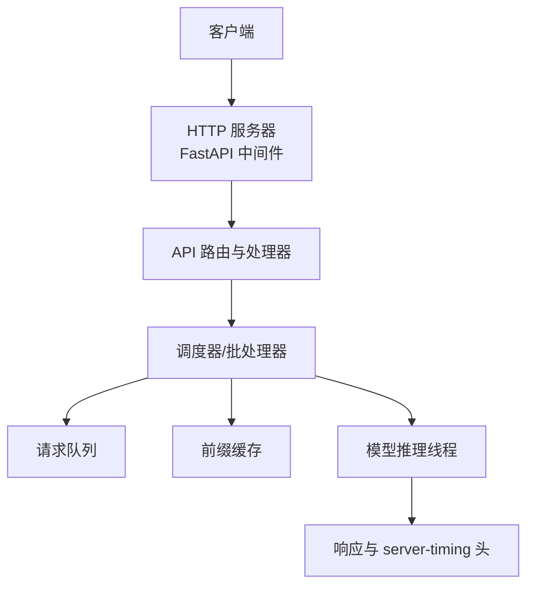
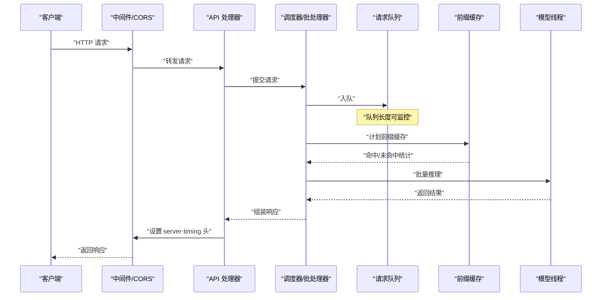
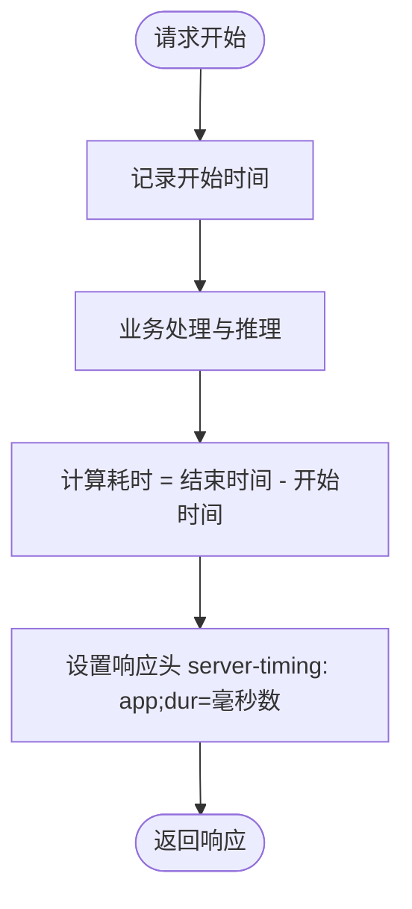
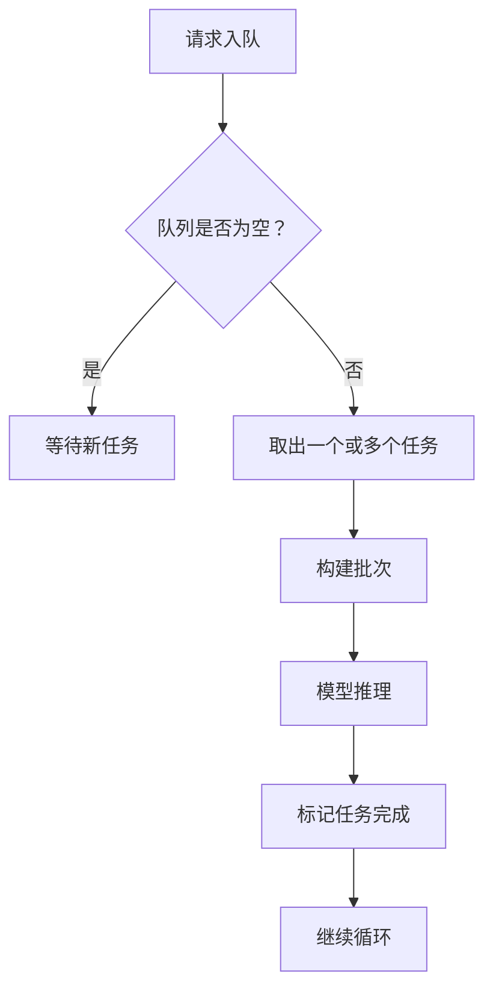
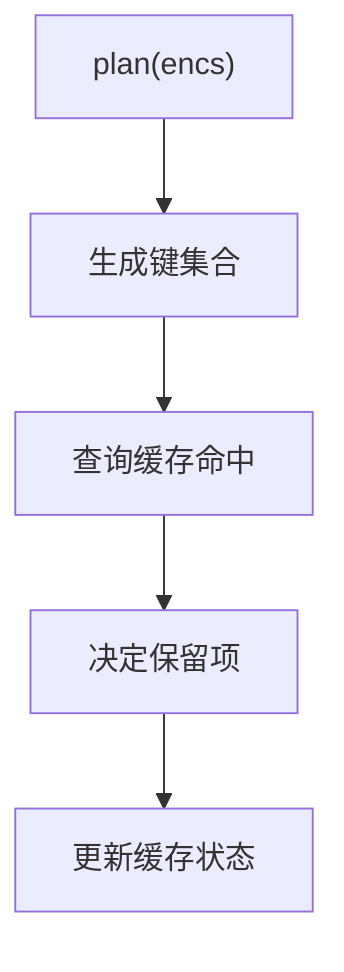
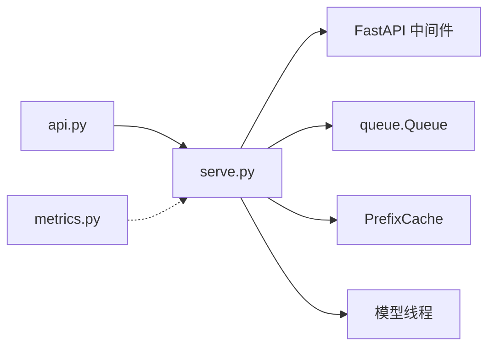

<cite>
**本文引用的文件**   
- [serve.py](file://kev/serve.py)
- [api.py](file://kev/api.py)
- [metrics.py](file://kev/metrics.py)
- [AGENTS.md](file://AGENTS.md)
</cite>

## 目录
1. [简介](#简介)
2. [项目结构](#项目结构)
3. [核心组件](#核心组件)
4. [架构总览](#架构总览)
5. [详细组件分析](#详细组件分析)
6. [依赖关系分析](#依赖关系分析)
7. [性能考量](#性能考量)
8. [故障诊断指南](#故障诊断指南)
9. [结论](#结论)
10. [附录](#附录)

## 简介
本文件面向 Kev 推理服务的生产运行与可观测性，聚焦以下目标：
- 内置监控指标：批次计数、请求计数、队列长度、前缀缓存命中率、OOM 重试次数等。
- 服务器计时头 server-timing 的使用方式与应用内耗时、网络传输时间的区分。
- 日志记录策略：请求日志、错误日志、性能日志的记录格式与内容。
- 外部监控系统集成：Prometheus、Grafana 等工具的接入建议。
- 健康检查端点的配置与使用。
- 故障诊断：内存泄漏检测、性能瓶颈识别、错误模式分析。
- 生产环境最佳实践与告警规则示例。

## 项目结构
Kev 的推理服务入口位于 serve.py，负责启动 HTTP 服务、注册中间件、处理请求、维护模型线程与队列、管理前缀缓存、设置响应头等。API 层 api.py 提供对外接口定义；metrics.py 提供评估与度量工具；AGENTS.md 包含关于 server-timing 的说明。

**图示来源**
- [serve.py:228-240](file://kev/serve.py#L228-L240)
- [serve.py:112-177](file://kev/serve.py#L112-L177)
- [serve.py:143-167](file://kev/serve.py#L143-L167)

**章节来源**
- [serve.py:112-177](file://kev/serve.py#L112-L177)
- [serve.py:228-240](file://kev/serve.py#L228-L240)

## 核心组件
- HTTP 服务与中间件：启用 CORS、暴露必要的响应头（包括 server-timing）。
- 请求调度与批处理：将请求放入队列，按批取回并执行推理。
- 前缀缓存：对共享前缀进行缓存以提升吞吐与降低重复计算。
- 模型线程：独立线程执行批量推理，避免阻塞请求线程。
- 响应头与计时：在响应中附加 server-timing，标注应用内耗时。

关键职责映射：
- 队列长度：由 queue.Queue 的长度体现，可用于监控排队积压。
- 批次计数：每次从队列取出一个或多个任务构成一批，批次大小可通过统计获取。
- 请求计数：每个进入 API 的请求应被计数（可在中间件或处理器处实现）。
- 前缀缓存命中率：通过 PrefixCache 的命中/未命中统计得出。
- OOM 重试次数：当发生内存不足时，可记录重试次数用于告警。

**章节来源**
- [serve.py:112-177](file://kev/serve.py#L112-L177)
- [serve.py:228-240](file://kev/serve.py#L228-L240)

## 架构总览
下图展示一次典型请求的处理流程，包括中间件、API 处理器、调度器、队列、前缀缓存与模型线程之间的交互，以及 server-timing 头的写入位置。

**图示来源**
- [serve.py:228-240](file://kev/serve.py#L228-L240)
- [serve.py:143-177](file://kev/serve.py#L143-L177)

## 详细组件分析

### 服务器计时头 server-timing
- 用途：在响应头中附加 server-timing，标注“应用内耗时”，以便与网络传输时间区分。
- 字段含义：app;dur=... 表示当前进程内的处理耗时（毫秒），便于前端或网关进行可视化与对比。
- 暴露头：中间件需将 server-timing 加入 expose_headers，使客户端能够读取。

**图示来源**
- [serve.py:228-240](file://kev/serve.py#L228-L240)

**章节来源**
- [serve.py:228-240](file://kev/serve.py#L228-L240)
- [AGENTS.md:327](file://AGENTS.md#L327)

### 队列与批处理
- 队列：使用 queue.Queue 承载待处理的请求，支持并发访问。
- 批处理：模型线程周期性从队列取任务，尽可能聚合成批以提高吞吐。
- 停止逻辑：在服务停止时清空队列并通知等待者失败。

**图示来源**
- [serve.py:143-167](file://kev/serve.py#L143-L167)
- [serve.py:124-128](file://kev/serve.py#L124-L128)

**章节来源**
- [serve.py:143-167](file://kev/serve.py#L143-L167)
- [serve.py:124-128](file://kev/serve.py#L124-L128)

### 前缀缓存
- 目的：对共享前缀进行缓存，减少重复计算，提升整体吞吐。
- 关键操作：plan(encs) 用于规划哪些前缀需要缓存、哪些命中、哪些保留。
- 指标：命中率 = 命中次数 / (命中次数 + 未命中次数)。

**图示来源**
- [serve.py:177-180](file://kev/serve.py#L177-L180)

**章节来源**
- [serve.py:177-180](file://kev/serve.py#L177-L180)

### 指标与度量
- metrics.py 提供评估与度量工具，如校准、选择预测、温度拟合等。
- 在生产环境中，可将这些度量作为离线评估或在线采样指标，结合 Prometheus 导出。

**章节来源**
- [metrics.py:1-200](file://kev/metrics.py#L1-L200)

## 依赖关系分析
- serve.py 依赖 FastAPI 中间件以暴露 server-timing 头。
- serve.py 内部耦合了队列、前缀缓存与模型线程，形成高内聚的服务核心。
- api.py 提供对外接口，与 serve.py 的调度器协作。
- metrics.py 为评估与校准工具，通常不直接参与在线路径，但可作为离线或采样指标的来源。

**图示来源**
- [serve.py:228-240](file://kev/serve.py#L228-L240)
- [serve.py:112-177](file://kev/serve.py#L112-L177)

**章节来源**
- [serve.py:112-177](file://kev/serve.py#L112-L177)
- [serve.py:228-240](file://kev/serve.py#L228-L240)

## 性能考量
- 批大小调优：根据 GPU/CPU 资源与延迟目标调整批次大小，平衡吞吐与延迟。
- 队列长度监控：当队列长度持续增长，可能表明后端处理能力不足或存在阻塞。
- 前缀缓存命中率：低命中率可能导致重复计算，需优化输入分布或缓存策略。
- server-timing 分析：比较 app 耗时与端到端耗时，识别网络传输与后端处理的比例。

[本节为通用指导，无需具体文件引用]

## 故障诊断指南

### 内存泄漏检测
- 观察进程内存增长趋势，结合 GC 日志与堆快照定位泄漏点。
- 关注前缀缓存是否无限增长，必要时限制缓存大小或清理策略。
- 监控 OOM 重试次数，若频繁触发，需检查批次大小与显存占用。

**章节来源**
- [serve.py:112-177](file://kev/serve.py#L112-L177)

### 性能瓶颈识别
- 使用 server-timing 分析应用内耗时占比，识别热点路径。
- 监控队列长度与批处理周期，判断是否存在背压或阻塞。
- 分析前缀缓存命中率，优化输入特征以减少未命中。

**章节来源**
- [serve.py:228-240](file://kev/serve.py#L228-L240)
- [serve.py:143-177](file://kev/serve.py#L143-L177)

### 错误模式分析
- 捕获并记录异常类型、堆栈与上下文信息，便于分类与归因。
- 针对队列停止时的异常（如“服务已停止”）进行专门处理与提示。
- 对 OOM 重试进行计数与告警，避免雪崩效应。

**章节来源**
- [serve.py:124-128](file://kev/serve.py#L124-L128)

## 结论
Kev 推理服务通过中间件暴露 server-timing 头，清晰区分应用内耗时与网络传输时间；通过队列与前缀缓存提升吞吐与效率；通过 metrics.py 提供评估与校准能力。生产环境中建议结合 Prometheus 与 Grafana 建立完整的监控与告警体系，重点关注队列长度、批次计数、前缀缓存命中率与 OOM 重试次数，并结合 server-timing 进行性能剖析与问题定位。

[本节为总结性内容，无需具体文件引用]

## 附录

### 内置监控指标清单
- 批次计数：每批处理的请求数量。
- 请求计数：进入 API 的请求总数。
- 队列长度：当前等待处理的请求数量。
- 前缀缓存命中率：命中次数占总请求比例。
- OOM 重试次数：因内存不足触发的重试次数。

[本节为概念性清单，无需具体文件引用]

### 外部监控系统集成建议
- Prometheus：通过自定义指标收集器暴露上述指标，或使用现有库（如 prometheus-client）进行埋点。
- Grafana：创建仪表盘展示队列长度、批次计数、命中率、OOM 重试与 server-timing 分布。
- 日志聚合：将请求日志、错误日志与性能日志统一采集至 ELK/Loki 等平台，便于检索与分析。

[本节为通用建议，无需具体文件引用]

### 健康检查端点
- 建议提供 /health 或 /ready 端点，返回服务状态、GPU 可用性、队列长度、缓存命中率等摘要信息。
- 在负载均衡器或编排平台中使用该端点进行存活与就绪探针。

[本节为通用建议，无需具体文件引用]

### 生产环境最佳实践与告警规则示例
- 队列长度持续上升超过阈值：触发扩容或限流。
- 前缀缓存命中率低于阈值：检查输入分布与缓存策略。
- OOM 重试次数突增：立即告警并自动降级或扩容。
- server-timing 应用内耗时 P95 升高：排查热点路径与资源竞争。

[本节为通用建议，无需具体文件引用]