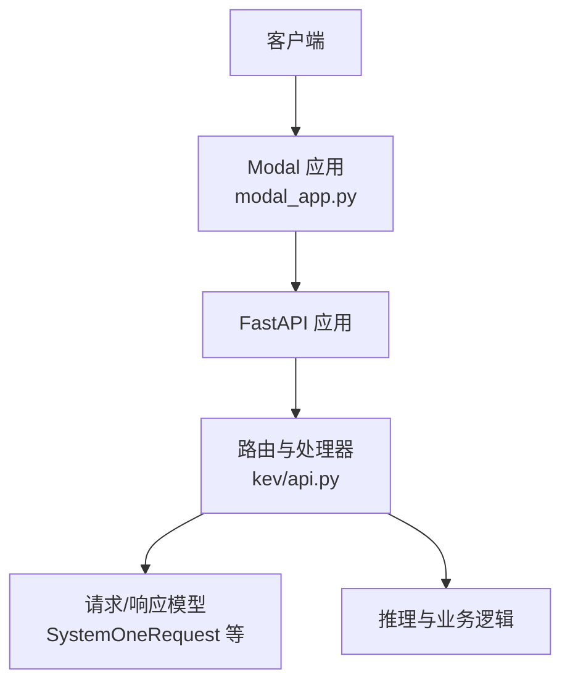
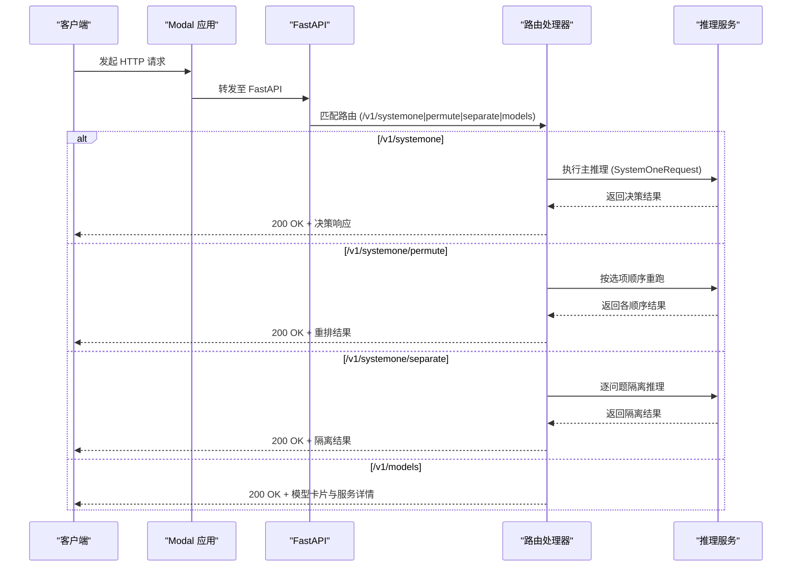
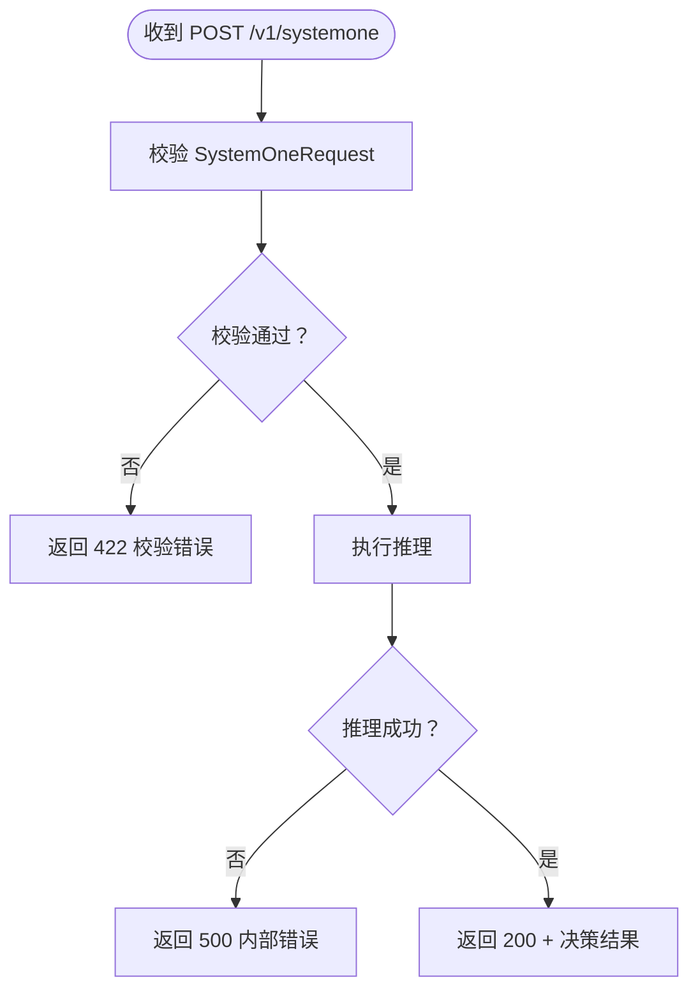
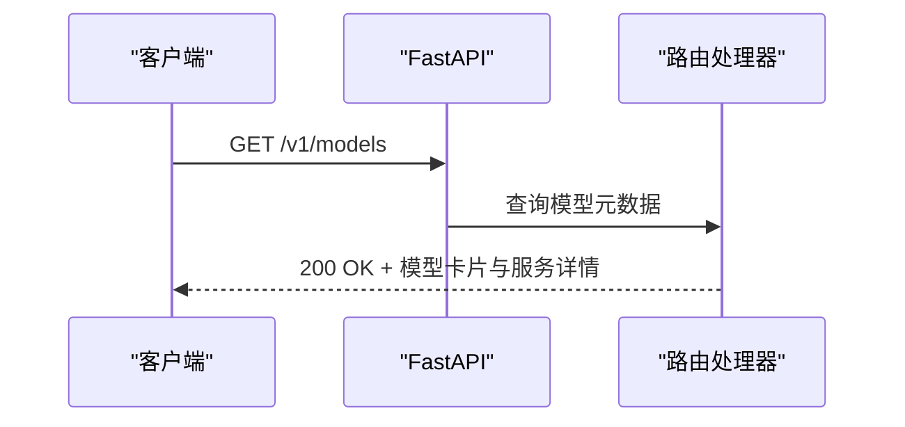
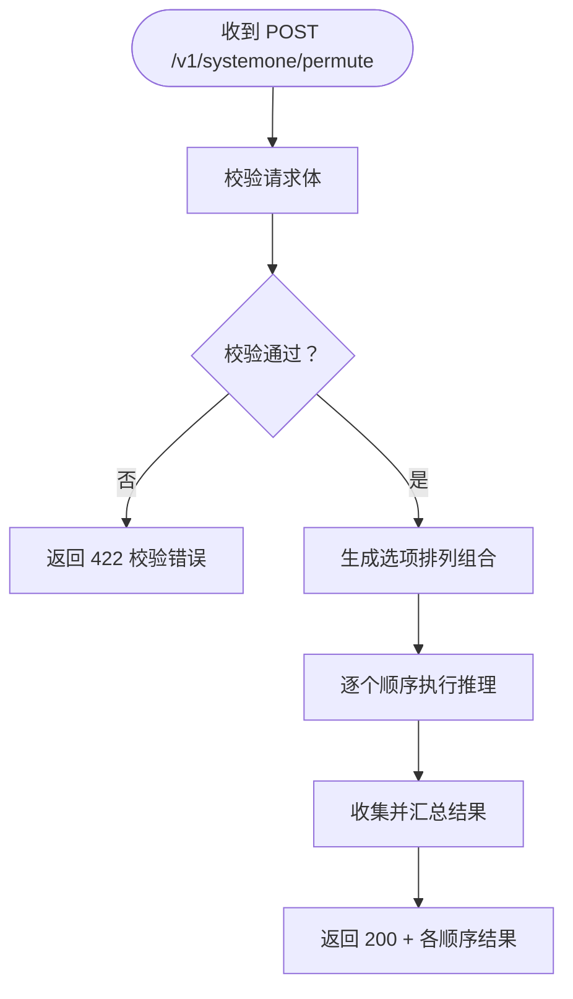
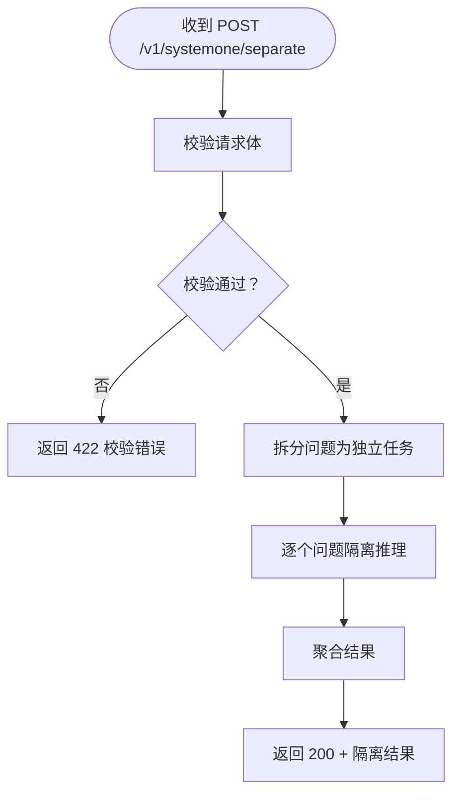
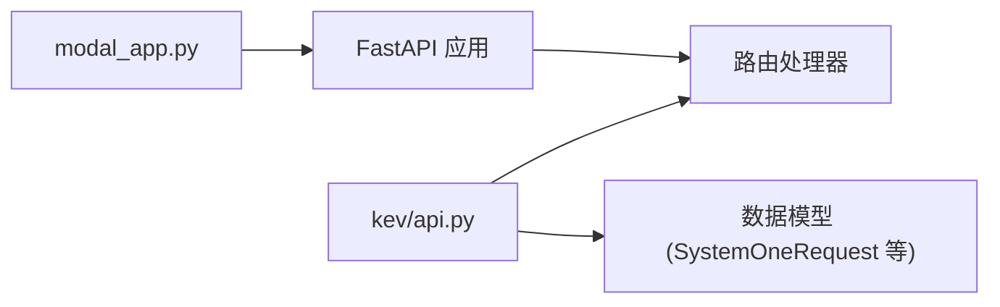

# API 端点

<cite>
**本文引用的文件**   
- [README.md](file://README.md)
- [modal_app.py](file://modal_app.py)
- [kev/api.py](file://kev/api.py)
</cite>

## 目录
1. [简介](#简介)
2. [项目结构](#项目结构)
3. [核心组件](#核心组件)
4. [架构总览](#架构总览)
5. [详细端点说明](#详细端点说明)
6. [依赖关系分析](#依赖关系分析)
7. [性能与速率限制](#性能与速率限制)
8. [故障排查指南](#故障排查指南)
9. [结论](#结论)

## 简介
本文件面向 Kev 的 TypeSafe RESTful API，聚焦以下四个端点：
- POST /v1/systemone：主要决策推理端点，接收 SystemOneRequest 并返回决策结果。
- GET /v1/models：模型信息查询，返回模型卡片与服务详情。
- POST /v1/systemone/permute：选项顺序测试，对单个 Choice 问题在不同选项顺序下重新运行。
- POST /v1/systemone/separate：问题隔离测试，将每个问题单独处理。

文档提供每个端点的 HTTP 方法、URL 模式、请求体结构、响应格式、状态码与错误处理示例，以及认证要求、速率限制与最佳实践建议。

## 项目结构
Kev 的 API 服务通过 Modal 应用启动，路由定义在 kev/api.py 中。整体结构如下：
- modal_app.py：Modal 应用入口，负责挂载 FastAPI 应用与配置运行时环境。
- kev/api.py：FastAPI 路由与请求/响应数据模型（包括 SystemOneRequest 等）的定义与实现。
- README.md：项目概述与使用说明，包含部署与基本调用指引。

图表来源
- [modal_app.py:1-200](file://modal_app.py#L1-L200)
- [kev/api.py:1-200](file://kev/api.py#L1-L200)

章节来源
- [README.md:1-200](file://README.md#L1-L200)
- [modal_app.py:1-200](file://modal_app.py#L1-L200)
- [kev/api.py:1-200](file://kev/api.py#L1-L200)

## 核心组件
- FastAPI 路由层：定义 /v1/systemone、/v1/systemone/permute、/v1/systemone/separate、/v1/models 等端点。
- 数据模型：SystemOneRequest 等 Pydantic 模型用于校验请求体与构造响应体。
- 业务逻辑：封装推理流程、选项重排与问题隔离策略。
- 错误处理：统一异常映射为 HTTP 状态码与结构化错误信息。

章节来源
- [kev/api.py:1-200](file://kev/api.py#L1-L200)

## 架构总览
下图展示从客户端到后端处理的端到端流程，重点标注了四个端点的职责与交互。

图表来源
- [modal_app.py:1-200](file://modal_app.py#L1-L200)
- [kev/api.py:1-200](file://kev/api.py#L1-L200)

## 详细端点说明

### POST /v1/systemone（主要决策推理）
- 方法：POST
- URL：/v1/systemone
- 认证：根据部署配置可能要求鉴权头；若未启用鉴权则无需额外头。
- 请求体：SystemOneRequest（字段以实际模型定义为准），典型字段包括：
  - 问题描述或上下文
  - 选项列表（Choice 相关）
  - 可选参数（如温度、最大生成长度等）
- 响应体：决策结果对象，包含最终选择、置信度、推理摘要等。
- 成功状态码：200
- 常见错误：
  - 400 请求体校验失败（字段缺失或类型错误）
  - 422 模型校验失败（Pydantic 验证错误）
  - 500 内部错误（推理异常）

图表来源
- [kev/api.py:1-200](file://kev/api.py#L1-L200)

章节来源
- [kev/api.py:1-200](file://kev/api.py#L1-L200)

### GET /v1/models（模型信息查询）
- 方法：GET
- URL：/v1/models
- 认证：同系统默认策略（可能无需鉴权）。
- 请求体：无
- 响应体：模型卡片与服务详情数组，包含：
  - 模型名称/版本
  - 能力标签（如 Choice、推理、长上下文等）
  - 服务可用性、延迟指标、配额信息等
- 成功状态码：200
- 常见错误：
  - 500 内部错误（元数据加载失败）

图表来源
- [kev/api.py:1-200](file://kev/api.py#L1-L200)

章节来源
- [kev/api.py:1-200](file://kev/api.py#L1-L200)

### POST /v1/systemone/permute（选项顺序测试）
- 方法：POST
- URL：/v1/systemone/permute
- 认证：同系统默认策略。
- 请求体：针对单个 Choice 问题的输入（可复用 SystemOneRequest 的部分字段），指定需要重排的选项集合与顺序策略。
- 响应体：不同选项顺序下的推理结果对比，便于评估顺序敏感性。
- 成功状态码：200
- 常见错误：
  - 400 请求体不完整或缺少必要字段
  - 422 模型校验失败
  - 500 内部错误（重排或多次推理失败）

图表来源
- [kev/api.py:1-200](file://kev/api.py#L1-L200)

章节来源
- [kev/api.py:1-200](file://kev/api.py#L1-L200)

### POST /v1/systemone/separate（问题隔离测试）
- 方法：POST
- URL：/v1/systemone/separate
- 认证：同系统默认策略。
- 请求体：包含多个问题的批量输入，服务端将每个问题独立处理，避免相互影响。
- 响应体：每个问题的独立推理结果，便于诊断多问题场景下的干扰效应。
- 成功状态码：200
- 常见错误：
  - 400 请求体结构不正确
  - 422 模型校验失败
  - 500 内部错误（单个或多个问题推理失败）

图表来源
- [kev/api.py:1-200](file://kev/api.py#L1-L200)

章节来源
- [kev/api.py:1-200](file://kev/api.py#L1-L200)

## 依赖关系分析
- 路由与模型：所有端点的路由与请求/响应模型均定义在 kev/api.py。
- 应用入口：modal_app.py 负责挂载 FastAPI 应用与运行时配置。
- 外部依赖：推理服务与底层模型加载逻辑由后端模块提供，API 层仅做协议与校验。

图表来源
- [modal_app.py:1-200](file://modal_app.py#L1-L200)
- [kev/api.py:1-200](file://kev/api.py#L1-L200)

章节来源
- [modal_app.py:1-200](file://modal_app.py#L1-L200)
- [kev/api.py:1-200](file://kev/api.py#L1-L200)

## 性能与速率限制
- 并发与批处理：/v1/systemone/permute 与 /v1/systemone/separate 可能触发多次推理，建议在客户端进行限流与重试退避。
- 缓存与预热：/v1/models 应缓存模型元数据以减少重复查询开销。
- 速率限制：若部署侧启用了速率限制（例如基于 IP 或用户令牌），请遵循响应头中的限制提示（如 Retry-After）。
- 超时与重试：对长耗时推理建议使用指数退避重试，避免雪崩效应。

[本节为通用指导，不直接分析具体文件]

## 故障排查指南
- 422 校验错误：检查请求体字段是否符合 SystemOneRequest 定义，确保必填字段存在且类型正确。
- 500 内部错误：查看服务端日志定位推理异常；对于 permute/separate，确认问题数量与选项规模是否过大。
- 鉴权失败：确认已携带正确的鉴权头（若启用），并检查令牌有效期与权限范围。
- 速率限制：当出现 429 时，依据响应头中的限制信息进行退避重试。

章节来源
- [kev/api.py:1-200](file://kev/api.py#L1-L200)

## 结论
Kev 的 TypeSafe API 通过 FastAPI 提供了清晰的决策推理与诊断能力。/v1/systemone 作为主推理端点，配合 /v1/systemone/permute 与 /v1/systemone/separate 可用于评估选项顺序敏感性与问题间干扰。/v1/models 提供模型能力与服务元数据，便于集成方选择合适的模型与服务。建议在生产环境中结合鉴权、速率限制与监控告警，确保稳定与可控的服务质量。