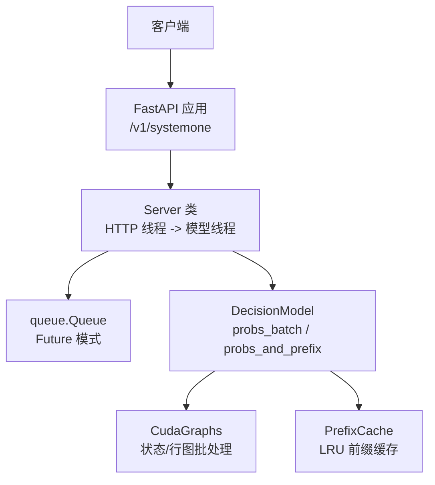
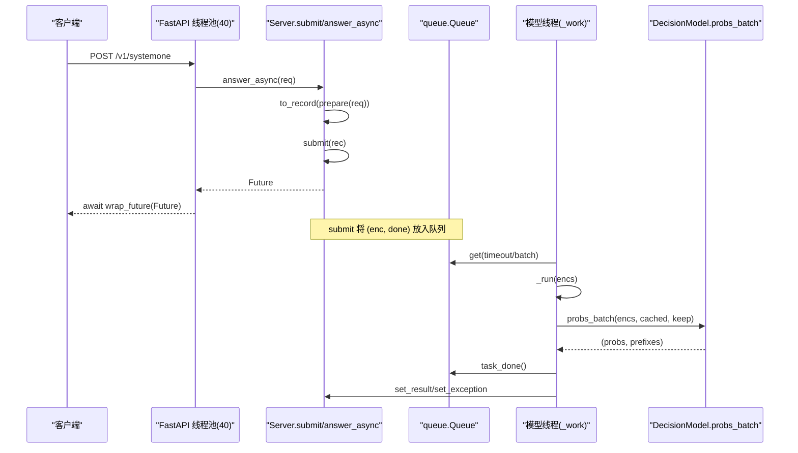
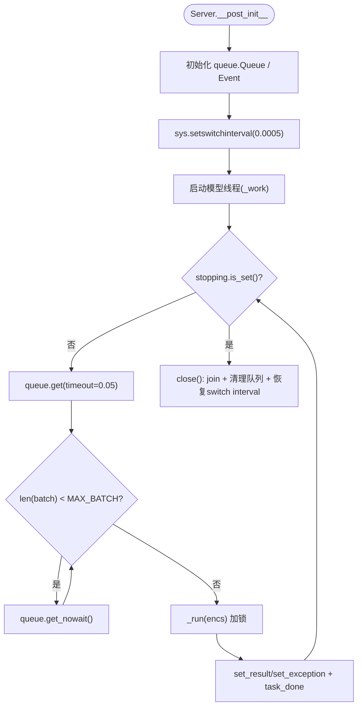
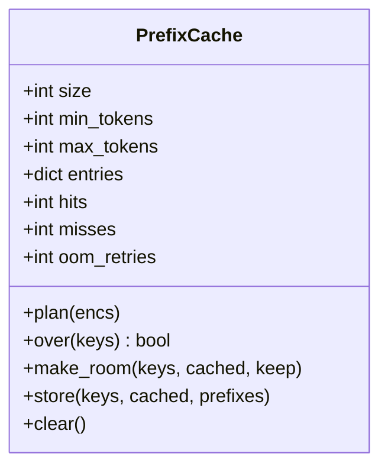
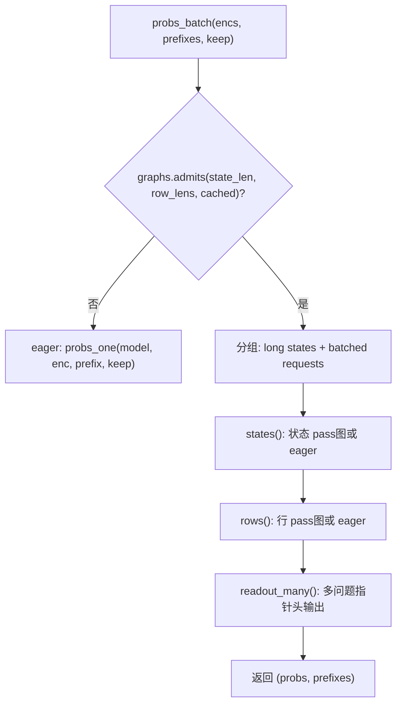
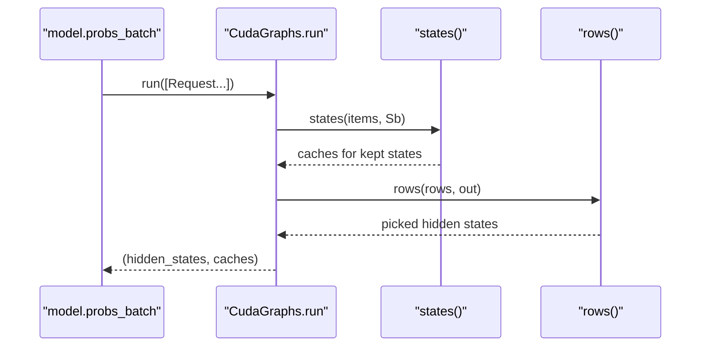
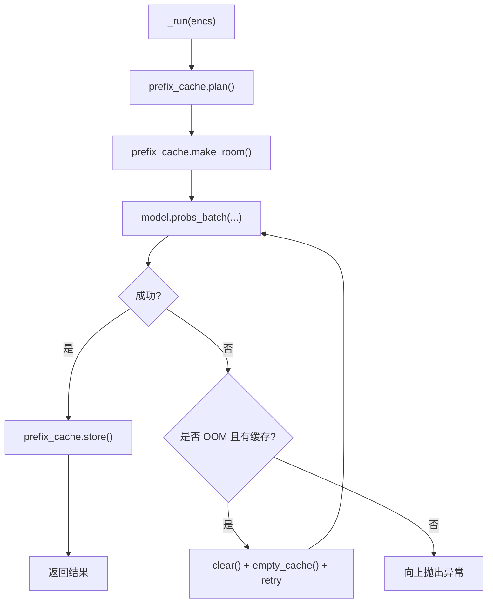
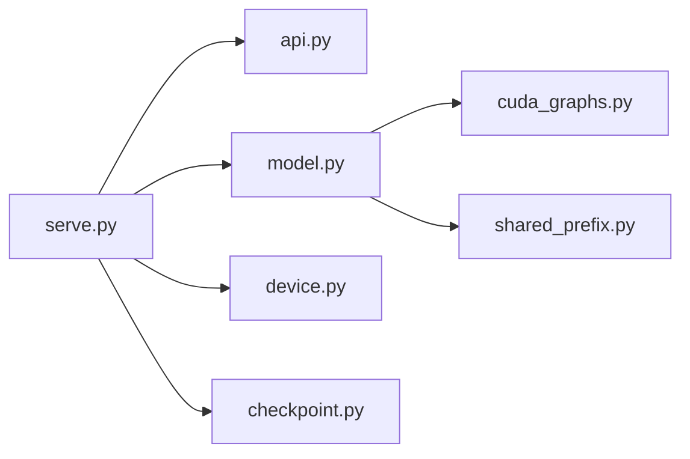

# 并发处理

<cite>
**本文引用的文件**   
- [serve.py](file://kev/serve.py)
- [model.py](file://kev/model.py)
- [api.py](file://kev/api.py)
- [cuda_graphs.py](file://kev/cuda_graphs.py)
- [shared_prefix.py](file://kev/shared_prefix.py)
</cite>

## 目录
1. [简介](#简介)
2. [项目结构](#项目结构)
3. [核心组件](#核心组件)
4. [架构总览](#架构总览)
5. [详细组件分析](#详细组件分析)
6. [依赖关系分析](#依赖关系分析)
7. [性能考量](#性能考量)
8. [故障排除指南](#故障排除指南)
9. [结论](#结论)

## 简介
本文聚焦 Kev 推理服务的并发处理机制，重点说明：
- Server 类的线程架构：主线程处理 HTTP 请求，模型线程执行推理任务。
- queue.Queue 工作队列与 Future 模式：submit() 提交任务、_work() 批量消费。
- MAX_BATCH 批大小控制、threading.Lock 同步、sys.setswitchinterval() GIL 优化。
- 异步处理流程：answer_async() 通过 asyncio.wrap_future() 包装 Future，FastAPI 默认 40 线程池。
- 内存管理策略：PrefixCache LRU 淘汰、OOM 重试、CUDA Graph 捕获优化。
- 性能调优建议与常见问题排查。

## 项目结构
本项目的推理服务入口在 kev.serve，核心推理接口在 kev.model，TypeSafe 请求/响应映射在 kev.api，CUDA Graph 批处理在 kev.cuda_graphs，训练期共享前缀在 kev.shared_prefix。

图表来源
- [serve.py:93-220](file://kev/serve.py#L93-L220)
- [model.py:243-509](file://kev/model.py#L243-L509)
- [cuda_graphs.py:165-376](file://kev/cuda_graphs.py#L165-L376)

章节来源
- [serve.py:1-344](file://kev/serve.py#L1-L344)
- [model.py:1-509](file://kev/model.py#L1-L509)
- [api.py:1-166](file://kev/api.py#L1-L166)
- [cuda_graphs.py:1-376](file://kev/cuda_graphs.py#L1-L376)
- [shared_prefix.py:1-142](file://kev/shared_prefix.py#L1-L142)

## 核心组件
- Server：封装 Checkpoint、Tokenizer、模型实例、PrefixCache、Queue、Lock、后台模型线程；提供 submit/probs/answer/answer_async/_body 等接口。
- PrefixCache：按 (state token ids, option_isolation) 为键维护 KV/状态前缀，支持 size/min_tokens/max_tokens 约束与 LRU 淘汰。
- DecisionModel：统一推理接口（encode/forward/probs/probs_and_prefix/probs_with_prefix/probs_batch），支持 packed 与 row 两种形式，以及 CUDA Graph 批处理。
- CudaGraphs：针对混合 Qwen3.5 后端的 CUDA Graph 批处理，包含状态 pass 和行 pass，共享 bank/row 缓冲区，延迟捕获。
- api：TypeSafe 请求/响应数据模型与序列化逻辑。

章节来源
- [serve.py:38-220](file://kev/serve.py#L38-L220)
- [model.py:243-509](file://kev/model.py#L243-L509)
- [cuda_graphs.py:165-376](file://kev/cuda_graphs.py#L165-L376)
- [api.py:17-166](file://kev/api.py#L17-L166)

## 架构总览
Kev 采用“HTTP 线程 + 单模型线程”的解耦设计：
- HTTP 线程负责解析请求、编码、入队、返回 Future。
- 模型线程从队列中批量拉取任务，加锁后调用 model.probs_batch 执行推理，再将结果写回 Future。
- 通过 sys.setswitchinterval(0.0005) 缩短 Python 解释器切换间隔，减少模型线程等待事件循环的时间。
- FastAPI 将同步端点放在 40 线程池中运行，但 answer_async 使用 wrap_future 让请求不占用工作线程，仅持有 Future。

图表来源
- [serve.py:132-209](file://kev/serve.py#L132-L209)
- [model.py:464-492](file://kev/model.py#L464-L492)

## 详细组件分析

### Server 线程架构与队列机制
- 线程职责分离
  - HTTP 线程：解析请求、admit 校验、编码、提交到队列、返回 Future。
  - 模型线程：循环从队列取任务，批量消费，加锁执行推理，写回结果。
- 队列与 Future
  - submit() 创建 Future，将 (enc, done) 入队，并返回 Future。
  - _work() 先阻塞取一个任务，再非阻塞拉取至 MAX_BATCH，然后加锁调用 _run。
  - 每个请求的结果通过 done.set_result/set_exception 写入 Future。
- 同步与开关
  - threading.Lock 保护每次批次的模型访问与 CUDA Graph 捕获。
  - sys.setswitchinterval(0.0005) 降低 GIL 切换周期，缓解模型线程长时间持有 GIL 导致的事件循环阻塞。
- 关闭流程
  - close() 设置 stopping 事件，join 模型线程，清空队列中的 Future 并抛出异常，恢复 switch interval。

图表来源
- [serve.py:111-170](file://kev/serve.py#L111-L170)

章节来源
- [serve.py:93-209](file://kev/serve.py#L93-L209)

### 批处理与 MAX_BATCH
- MAX_BATCH = 64：模型线程一次最多拉取 64 个请求进行批处理。
- _work() 先阻塞获取一个任务，随后尽可能多地非阻塞拉取，直到达到 MAX_BATCH 或队列为空。
- 批内错误处理：任一请求失败，整个批次对应 Future 均收到异常；同时清除 traceback frames 以释放张量引用。

章节来源
- [serve.py:34-35](file://kev/serve.py#L34-L35)
- [serve.py:150-170](file://kev/serve.py#L150-L170)

### 异步处理与 FastAPI 线程池
- answer_async()
  - 将 submit() 返回的 Future 用 asyncio.wrap_future() 包装，使事件循环可 await。
  - 注释指出 FastAPI 对同步端点使用 40 线程池；由于 answer_async 不阻塞工作线程，容器可同时处理多个请求，受限于队列吞吐与模型线程批处理能力。
- prepare()/to_record()
  - 预处理 state（可选日期事实注入），并将 SystemOneRequest 转为内部 record。

章节来源
- [serve.py:205-209](file://kev/serve.py#L205-L209)
- [serve.py:223-225](file://kev/serve.py#L223-L225)
- [api.py:102-117](file://kev/api.py#L102-L117)

### 前缀缓存 PrefixCache（LRU）
- 键设计：(tuple(state_ids[:n]), bool(option_isolation))，其中 n 为 state token 数。
- 容量限制：size（状态数量）、max_tokens（所有状态的 token 总数上限）、min_tokens（短于该阈值不缓存）。
- plan()：为每个请求计算 key、命中前缀、是否保留新前缀。
- make_room()：在批次运行前主动丢弃将被 evict 的条目，避免新旧状态竞争显存。
- store()：记录 hits/misses，并按 LRU 顺序插入；超过 max_tokens 时弹出最旧项。
- oom_retries：统计因 OOM 清缓存重试次数。

图表来源
- [serve.py:38-90](file://kev/serve.py#L38-L90)

章节来源
- [serve.py:38-90](file://kev/serve.py#L38-L90)

### 模型推理与批处理（DecisionModel）
- 接口契约：encode/forward/probs/probs_and_prefix/probs_with_prefix/probs_batch 等。
- 两种推理形式
  - packed：块因果掩码一次性处理整条序列。
  - rows：每条问题作为独立因果行，适合长序列或混合后端。
- probs_batch
  - 根据 CUDA Graph 能力拆分请求：需要 eager 先行计算前缀的请求单独处理，其余走 graphed 路径。
  - 返回 per-request 概率与前缀（可能为 None）。
- prefix/probs_and_prefix/probs_with_prefix
  - 精确复用状态前缀（KV 与必要隐藏态），避免重复计算。
  - 对 hybrid 后端保持行形式，attention-only 后端可使用 packed。

图表来源
- [model.py:464-505](file://kev/model.py#L464-L505)
- [cuda_graphs.py:273-376](file://kev/cuda_graphs.py#L273-L376)

章节来源
- [model.py:243-509](file://kev/model.py#L243-L509)

### CUDA Graph 批处理（CudaGraphs）
- 目标：对混合 Qwen3.5 后端，将状态 pass 与行 pass 分别图化，减少内核启动开销。
- 缓冲设计
  - 状态银行（bank）：每层注意力 KV 与 DeltaNet 状态，固定布局，右对齐存放状态。
  - 行缓冲（rowbuf）：每层注意力与 DeltaNet 状态，用于行 pass。
- 分桶与分组
  - bucket()/count_bucket()：对长度与计数进行分桶，减少形状爆炸。
  - length_groups()：动态规划分组，最小化 padded tokens。
- 捕获策略
  - capture_pending()：在空闲或热桶达到 HOT_BUCKET 次 eager 运行后捕获。
  - 捕获失败降级为 eager，不影响服务。
- 运行流程
  - run(requests)：按状态长度分组，先 states() 生成/复用状态，再 rows() 计算行 hidden，最后聚合 picks。

图表来源
- [cuda_graphs.py:273-376](file://kev/cuda_graphs.py#L273-L376)
- [model.py:464-492](file://kev/model.py#L464-L492)

章节来源
- [cuda_graphs.py:1-376](file://kev/cuda_graphs.py#L1-L376)

### 内存管理与 OOM 重试
- PrefixCache OOM 重试
  - _run() 在 model.probs_batch 抛异常时判断是否为 OOM 且存在缓存状态，若是则清空缓存并重试一次。
  - 清空后调用 empty_cache(device) 释放显存碎片。
- PrefixCache 主动腾挪
  - make_room() 在批次开始前主动删除即将被 evict 的状态，避免新旧状态竞争显存。
- CUDA Graph 捕获失败
  - capture_pending() 捕获失败时记录 failed 桶，后续仍按 eager 执行，不中断服务。

图表来源
- [serve.py:172-191](file://kev/serve.py#L172-L191)
- [cuda_graphs.py:223-254](file://kev/cuda_graphs.py#L223-L254)

章节来源
- [serve.py:172-191](file://kev/serve.py#L172-L191)
- [cuda_graphs.py:223-254](file://kev/cuda_graphs.py#L223-L254)

### 共享前缀（训练期）
- shared_prefix.py 为混合后端提供训练期的共享状态前缀，避免每条分支重复计算状态。
- Prefix 对象模拟 cache 行为，支持 update/update_conv_state/update_recurrent_state，并在 branch(owner) 中按分支 owner 索引提取状态。
- branch_hidden() 将状态左填充、分支右填充，逐层执行状态 pass 与分支 pass，保证梯度回传正确性。

章节来源
- [shared_prefix.py:1-142](file://kev/shared_prefix.py#L1-L142)

## 依赖关系分析
- serve.py 依赖
  - api：SystemOneRequest、to_record、to_answers、with_date_facts。
  - checkpoint：Checkpoint、LoadOptions。
  - device：default_device、empty_cache、out_of_memory、sync。
  - model：SERVE_MAX_STATE、ContextOverflow、admit。
- model.py 依赖
  - cuda_graphs：Request（仅在 probs_batch 中导入，避免空间打包问题）。
- cuda_graphs.py 依赖
  - transformers：DynamicCache、LinearAttentionLayer。
- shared_prefix.py 依赖
  - torch.distributed.fsdp：FSDPModule、register_fsdp_forward_method。

图表来源
- [serve.py:14-25](file://kev/serve.py#L14-L25)
- [model.py:482-482](file://kev/model.py#L482-L482)
- [cuda_graphs.py:40-42](file://kev/cuda_graphs.py#L40-L42)
- [shared_prefix.py:26-27](file://kev/shared_prefix.py#L26-L27)

章节来源
- [serve.py:14-25](file://kev/serve.py#L14-L25)
- [model.py:482-482](file://kev/model.py#L482-L482)
- [cuda_graphs.py:40-42](file://kev/cuda_graphs.py#L40-L42)
- [shared_prefix.py:26-27](file://kev/shared_prefix.py#L26-L27)

## 性能考量
- 批大小 MAX_BATCH
  - 增大可提高吞吐，但会增加队列延迟与峰值显存；建议结合负载压测调整。
- GIL 切换间隔
  - sys.setswitchinterval(0.0005) 显著降低模型线程与事件循环之间的争用；生产环境应保持此配置。
- CUDA Graph 捕获
  - 首次捕获有 ~0.4s 开销；建议在空闲时段预热或按需捕获（capture_due）。
  - 捕获失败自动降级为 eager，不影响服务可用性。
- 前缀缓存命中率
  - 合理设置 PREFIX_CACHE_SIZE、PREFIX_MIN_TOKENS、PREFIX_MAX_TOKENS，平衡命中率与显存占用。
- 数据类型与后端
  - 默认 bf16 提升速度；必要时 KEV_DTYPE=fp32 保证数值一致性。
  - fused Qwen3.5 kernels 可减少 GPU 时间；未安装 FLA 时会提示。

[本节为通用性能建议，无需具体文件分析]

## 故障排除指南
- 上下文溢出（422）
  - 现象：state 过长或 question row 超长，触发 ContextOverflow。
  - 解决：缩短文档、拆分请求，或启用 KEV_TRUNCATE_STATES=1 截断首段。
- 服务器停止（503）
  - 现象：close() 后继续 submit 抛出 503。
  - 解决：确保进程正常退出，避免在 CUDA 调用中被强杀。
- OOM 重试
  - 现象：batch 运行 OOM，PrefixCache 清空并重试。
  - 解决：检查 PREFIX_MAX_TOKENS、MAX_BATCH、GRAPH_STATE/ROW 限制；必要时降低并发。
- CUDA Graph 捕获失败
  - 现象：日志打印捕获失败，桶回退 eager。
  - 解决：关注 failed 统计；若频繁失败，考虑禁用 cuda_graphs 或调整形状桶。
- 高延迟
  - 现象：latency_ms 升高。
  - 排查：观察 /v1/models 的 batches、queued、prefix_cache、cuda_graphs 指标；确认是否处于 warm-up 阶段。

章节来源
- [serve.py:138-145](file://kev/serve.py#L138-L145)
- [serve.py:124-130](file://kev/serve.py#L124-L130)
- [serve.py:172-191](file://kev/serve.py#L172-L191)
- [cuda_graphs.py:223-254](file://kev/cuda_graphs.py#L223-L254)
- [serve.py:298-312](file://kev/serve.py#L298-L312)

## 结论
Kev 的并发处理通过“HTTP 线程 + 单模型线程”的清晰分工，结合 queue.Queue 与 Future 模式实现高吞吐与低阻塞；MAX_BATCH、threading.Lock 与 GIL 切换优化共同保障稳定性与性能；PrefixCache 的 LRU 与 OOM 重试、CUDA Graph 的延迟捕获与降级策略，进一步提升了资源利用率与服务韧性。在生产环境中，建议结合负载特征调优批大小、缓存参数与图形捕获策略，并持续监控 /v1/models 暴露的运行指标。