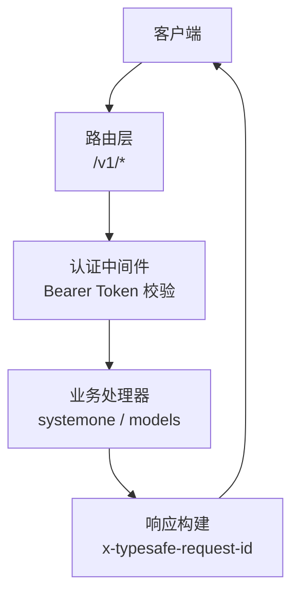
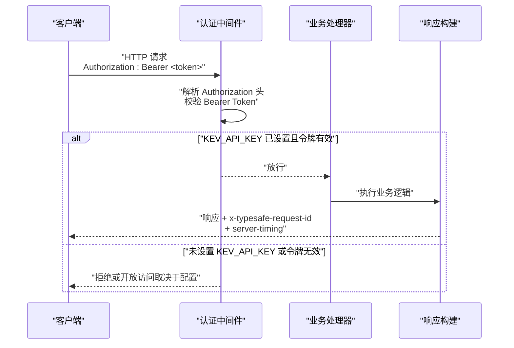
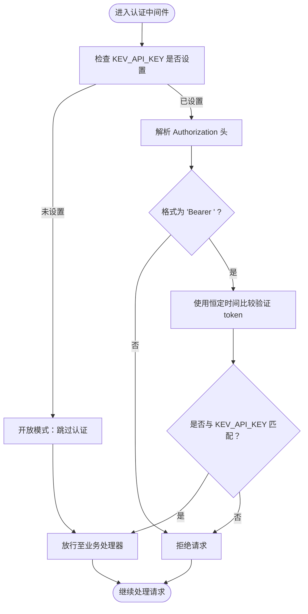
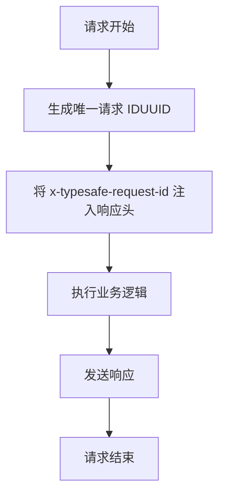
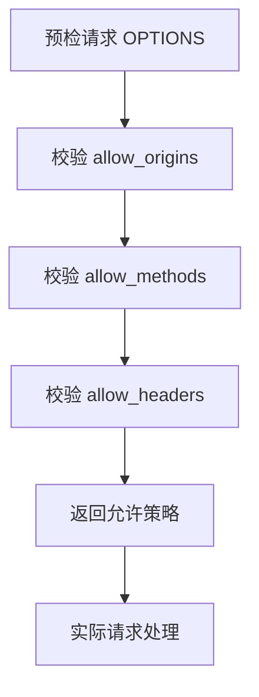
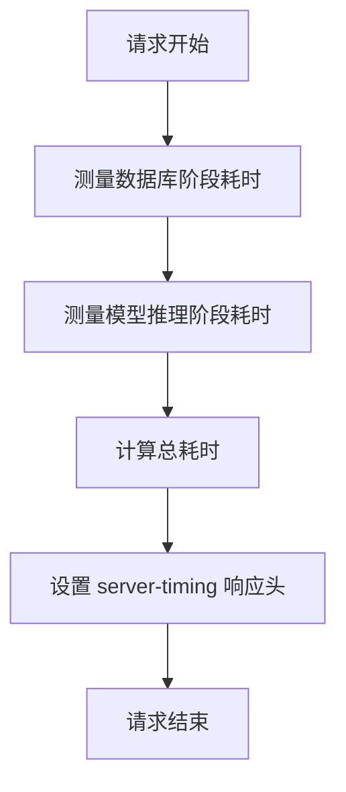
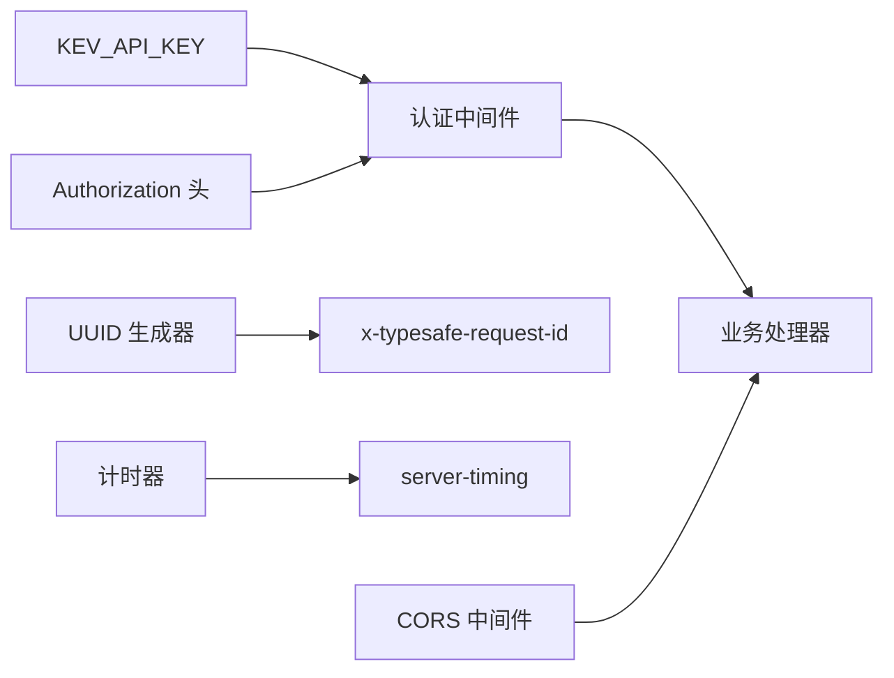

<cite>
**本文引用的文件**   
- [README.md](file://README.md)
- [AGENTS.md](file://AGENTS.md)
</cite>

## 目录
1. [简介](#简介)
2. [项目结构](#项目结构)
3. [核心组件](#核心组件)
4. [架构总览](#架构总览)
5. [详细组件分析](#详细组件分析)
6. [依赖关系分析](#依赖关系分析)
7. [性能考虑](#性能考虑)
8. [故障排查指南](#故障排查指南)
9. [结论](#结论)
10. [附录](#附录)

## 简介
本文件聚焦 Kev 的 TypeSafe 兼容 API 认证与可观测性相关机制，围绕以下主题展开：
- Bearer Token 认证模式与 Authorization 头解析
- KEV_API_KEY 环境变量控制开放/强制认证两种运行模式
- x-typesafe-request-id 响应头的生成与请求追踪
- CORS 中间件的 allow_origins、allow_methods、allow_headers 配置要点
- server-timing 响应头的性能监控能力
- 安全最佳实践（密钥管理、HTTPS、日志脱敏等）

说明：仓库文档指出 TypeSafe 兼容接口在 /v1/* 路径上支持 Bearer 认证；当未设置 KEV_API_KEY 时为开放服务模式，设置后为强制认证模式。同时，每个响应都会携带 x-typesafe-request-id 以便客户端进行请求追踪。

章节来源
- [README.md:249-257](file://README.md#L249-L257)
- [AGENTS.md:309-327](file://AGENTS.md#L309-L327)

## 项目结构
Kev 的 TypeSafe 兼容服务以 FastAPI 风格的路由组织，认证与可观测性逻辑主要位于 API 层与中间件层。根据仓库文档，TypeSafe 兼容端点包括：
- POST /v1/systemone
- GET /v1/models
- 其他 /v1/* 路由

这些端点在启用认证时要求 Authorization: Bearer <key>，并在所有响应中返回 x-typesafe-request-id。

图示来源
- [README.md:249-257](file://README.md#L249-L257)
- [AGENTS.md:309-327](file://AGENTS.md#L309-L327)

章节来源
- [README.md:249-257](file://README.md#L249-L257)
- [AGENTS.md:309-327](file://AGENTS.md#L309-L327)

## 核心组件
- 认证中间件（TypeSafe 兼容）
  - 支持 Bearer Token 认证
  - 通过 Authorization 头解析令牌
  - 依据 KEV_API_KEY 决定是否开启强制认证
- 请求 ID 中间件
  - 为每个响应注入 x-typesafe-request-id
  - 用于跨链路请求追踪
- CORS 中间件
  - 允许自定义 allow_origins、allow_methods、allow_headers
- 性能监控
  - 通过 server-timing 响应头暴露关键阶段耗时

章节来源
- [README.md:249-257](file://README.md#L249-L257)
- [AGENTS.md:309-327](file://AGENTS.md#L309-L327)

## 架构总览
下图展示一次典型 TypeSafe 兼容请求的生命周期：从接收请求、解析认证、执行业务到返回响应并附加可观测性头。

图示来源
- [README.md:249-257](file://README.md#L249-L257)
- [AGENTS.md:309-327](file://AGENTS.md#L309-L327)

## 详细组件分析

### Bearer Token 认证与 Authorization 头解析
- 认证触发条件
  - 当 KEV_API_KEY 环境变量存在时，/v1/* 路由强制要求 Authorization: Bearer <key>
  - 未设置 KEV_API_KEY 时，服务处于开放模式，无需认证即可访问
- Authorization 头解析
  - 标准格式：Authorization: Bearer <token>
  - 服务端需正确提取 token 并与 KEV_API_KEY 进行比较
- 安全比较
  - 建议使用恒定时间比较函数（如 hmac.compare_digest）以避免时序攻击
  - 该实现细节未在仓库文档中直接出现，但属于安全最佳实践

图示来源
- [README.md:249-257](file://README.md#L249-L257)
- [AGENTS.md:309-327](file://AGENTS.md#L309-L327)

章节来源
- [README.md:249-257](file://README.md#L249-L257)
- [AGENTS.md:309-327](file://AGENTS.md#L309-L327)

### x-typesafe-request-id 响应头
- 功能说明
  - 每个响应均包含 x-typesafe-request-id，便于客户端关联请求与响应
  - 可用于分布式追踪、问题定位与审计
- 生成与管理
  - 通常基于 UUID 生成唯一标识
  - 建议在中间件中统一注入，避免遗漏

图示来源
- [README.md:249-257](file://README.md#L249-L257)
- [AGENTS.md:309-327](file://AGENTS.md#L309-L327)

章节来源
- [README.md:249-257](file://README.md#L249-L257)
- [AGENTS.md:309-327](file://AGENTS.md#L309-L327)

### CORS 中间件配置
- 目标
  - 允许跨域请求，适配前端或第三方调用方
- 关键参数
  - allow_origins：允许的源列表（例如特定域名或通配符）
  - allow_methods：允许的 HTTP 方法（GET、POST、PUT、DELETE、OPTIONS 等）
  - allow_headers：允许的请求头（Content-Type、Authorization、X-Requested-With 等）
- 建议
  - 生产环境避免使用 * 作为 allow_origins
  - 仅暴露必要的方法与头部，减少攻击面

图示来源
- [README.md:249-257](file://README.md#L249-L257)
- [AGENTS.md:309-327](file://AGENTS.md#L309-L327)

章节来源
- [README.md:249-257](file://README.md#L249-L257)
- [AGENTS.md:309-327](file://AGENTS.md#L309-L327)

### server-timing 性能监控
- 功能说明
  - 通过 server-timing 响应头暴露关键阶段的耗时信息
  - 有助于客户端与服务端共同分析性能瓶颈
- 常见指标
  - db：数据库查询耗时
  - model：模型推理耗时
  - total：总处理耗时
- 使用建议
  - 仅在必要时记录高精度计时，避免影响性能
  - 结合 x-typesafe-request-id 进行端到端追踪

图示来源
- [README.md:249-257](file://README.md#L249-L257)
- [AGENTS.md:309-327](file://AGENTS.md#L309-L327)

章节来源
- [README.md:249-257](file://README.md#L249-L257)
- [AGENTS.md:309-327](file://AGENTS.md#L309-L327)

## 依赖关系分析
- 认证中间件依赖
  - 环境变量 KEV_API_KEY
  - Authorization 头解析逻辑
  - 恒定时间比较函数（推荐）
- 可观测性依赖
  - UUID 生成器（用于 x-typesafe-request-id）
  - 计时器（用于 server-timing）
- CORS 依赖
  - 框架内置或第三方 CORS 中间件

图示来源
- [README.md:249-257](file://README.md#L249-L257)
- [AGENTS.md:309-327](file://AGENTS.md#L309-L327)

章节来源
- [README.md:249-257](file://README.md#L249-L257)
- [AGENTS.md:309-327](file://AGENTS.md#L309-L327)

## 性能考虑
- 认证开销
  - 恒定时间比较对长密钥的开销较小，但仍应避免在高频路径中进行昂贵操作
- 可观测性开销
  - server-timing 与 x-typesafe-request-id 的生成与注入应轻量高效
- CORS 预检
  - 合理配置 allow_* 以减少不必要的预检请求

[本节为通用指导，不直接分析具体文件]

## 故障排查指南
- 认证失败
  - 检查 KEV_API_KEY 是否正确设置
  - 确认 Authorization 头格式为 Bearer <token>
  - 核对 token 与 KEV_API_KEY 是否一致
- 缺少 x-typesafe-request-id
  - 检查响应构建中间件是否被绕过
  - 确认中间件链顺序正确
- CORS 错误
  - 检查 allow_origins、allow_methods、allow_headers 是否包含请求所需值
- server-timing 缺失
  - 检查计时逻辑是否被异常中断
  - 确认响应头注入未被后续中间件覆盖

章节来源
- [README.md:249-257](file://README.md#L249-L257)
- [AGENTS.md:309-327](file://AGENTS.md#L309-L327)

## 结论
Kev 的 TypeSafe 兼容 API 提供了灵活的认证与可观测性能力：在未设置 KEV_API_KEY 时为开放模式，设置后为强制 Bearer Token 认证；每个响应附带 x-typesafe-request-id 便于追踪；可选的 server-timing 帮助性能分析；CORS 中间件允许精细控制跨域行为。生产部署时应遵循安全最佳实践，确保密钥安全、启用 HTTPS、并对敏感信息进行日志脱敏。

[本节为总结性内容，不直接分析具体文件]

## 附录
- 环境变量
  - KEV_API_KEY：若设置则启用强制 Bearer Token 认证；未设置则为开放模式
- 响应头
  - x-typesafe-request-id：每请求唯一标识
  - server-timing：性能阶段耗时
- 安全建议
  - 使用恒定时间比较函数（如 hmac.compare_digest）
  - 在生产环境限制 CORS 范围
  - 启用 HTTPS 并最小化日志中的敏感信息

章节来源
- [README.md:249-257](file://README.md#L249-L257)
- [AGENTS.md:309-327](file://AGENTS.md#L309-L327)