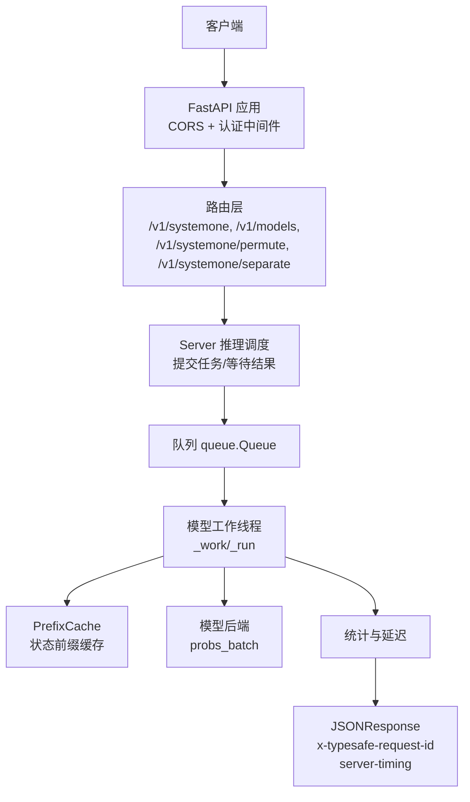
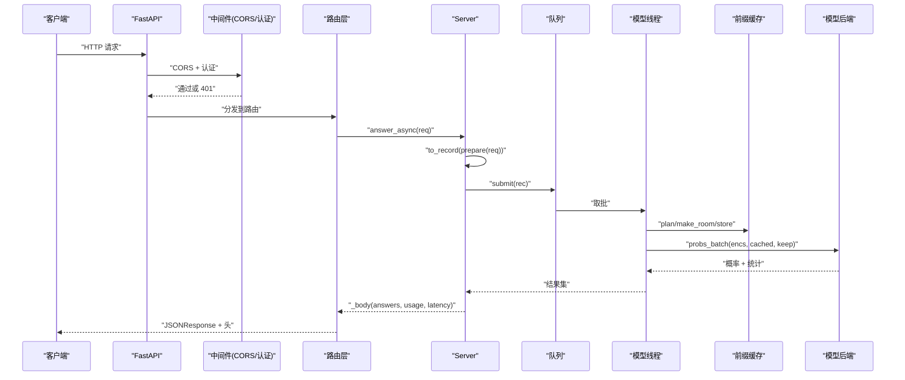
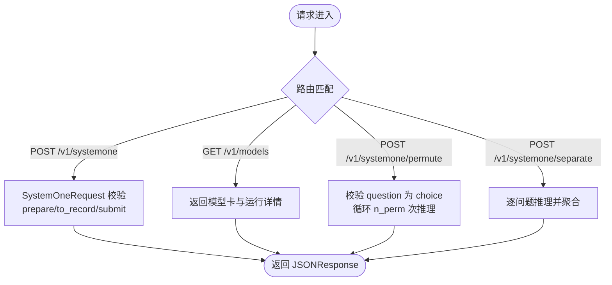
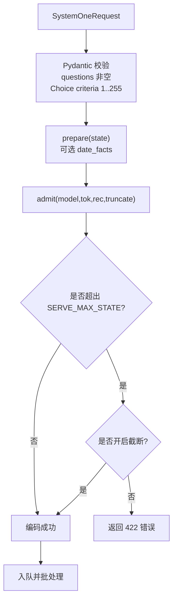
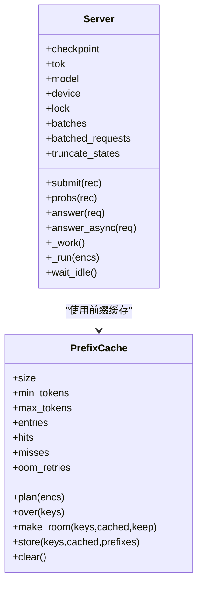
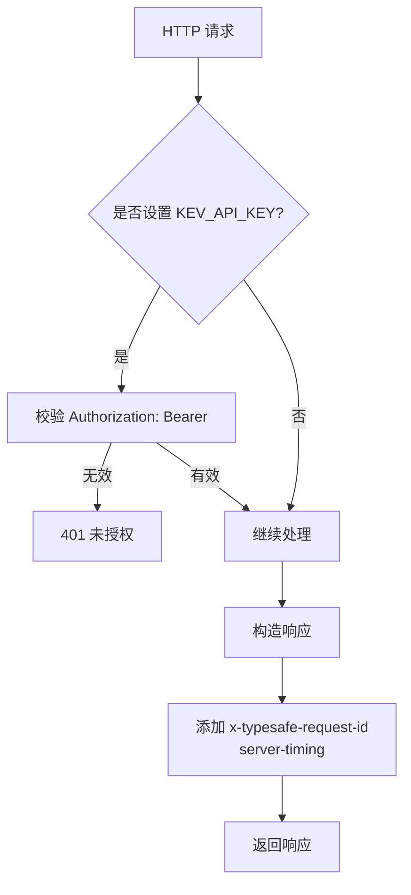
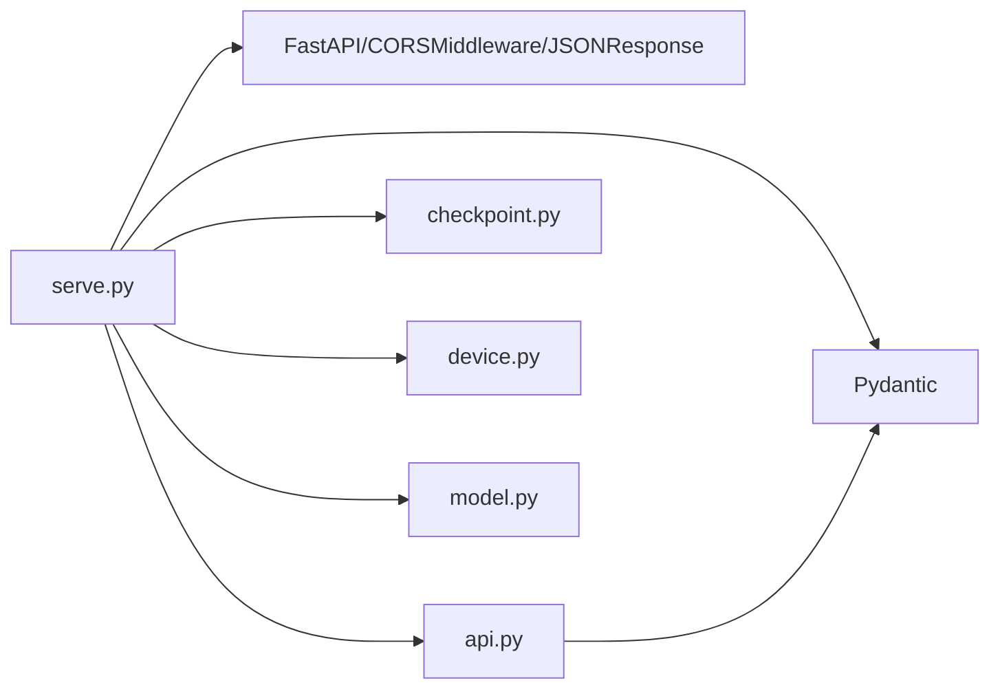

<cite>
**本文引用的文件**   
- [serve.py](file://kev/serve.py)
- [api.py](file://kev/api.py)
</cite>

## 目录
1. [简介](#简介)
2. [项目结构](#项目结构)
3. [核心组件](#核心组件)
4. [架构总览](#架构总览)
5. [详细组件分析](#详细组件分析)
6. [依赖关系分析](#依赖关系分析)
7. [性能与并发特性](#性能与并发特性)
8. [故障排查指南](#故障排查指南)
9. [结论](#结论)

## 简介
本文面向 Kev 推理服务的 HTTP 请求处理，聚焦 TypeSafe 兼容的 API 端点与完整请求生命周期：从 FastAPI 接收请求、认证与跨域中间件、Pydantic 数据校验、上下文长度检查与溢出处理、线程池与队列驱动的异步推理，到最终返回结构化答案。文档还覆盖以下端点：
- POST /v1/systemone：主要决策推理端点
- GET /v1/models：模型信息查询
- POST /v1/systemone/permute：选项顺序测试
- POST /v1/systemone/separate：问题隔离测试

## 项目结构
Kev 推理服务由两个核心模块组成：
- kev/serve.py：FastAPI 应用、路由、中间件、Server 推理调度、前缀缓存、环境变量配置、启动逻辑
- kev/api.py：TypeSafe 兼容的请求/响应数据结构、问题类型定义、概率与置信度计算、输出 token 统计

图表来源
- [serve.py:228-242](file://kev/serve.py#L228-L242)
- [serve.py:249-312](file://kev/serve.py#L249-L312)
- [serve.py:93-220](file://kev/serve.py#L93-L220)

章节来源
- [serve.py:1-13](file://kev/serve.py#L1-L13)
- [serve.py:228-344](file://kev/serve.py#L228-L344)
- [api.py:1-166](file://kev/api.py#L1-L166)

## 核心组件
- SystemOneRequest：TypeSafe 兼容的请求体，包含 state、model、questions（至少一个）
- Question 联合类型：Noul、Choice、Score，分别对应布尔、多选、有序评分
- Server：封装 Checkpoint、Tokenizer、Model、设备信息；管理前缀缓存、队列、工作线程、批处理
- PrefixCache：LRU 风格的状态前缀缓存，按 size 与 max_tokens 限制，支持 OOM 恢复
- 中间件：CORS 与 Bearer Token 认证，注入 x-typesafe-request-id 与 server-timing

章节来源
- [api.py:17-46](file://kev/api.py#L17-L46)
- [serve.py:38-90](file://kev/serve.py#L38-L90)
- [serve.py:93-220](file://kev/serve.py#L93-L220)
- [serve.py:228-242](file://kev/serve.py#L228-L242)

## 架构总览
下图展示一次典型请求的生命周期：客户端发送请求，经过 CORS 与认证中间件，进入路由层，调用 Server.answer_async，内部将请求编码并放入队列，模型线程批量执行推理，最后组装响应并返回。

图表来源
- [serve.py:228-242](file://kev/serve.py#L228-L242)
- [serve.py:249-252](file://kev/serve.py#L249-L252)
- [serve.py:200-220](file://kev/serve.py#L200-L220)
- [serve.py:132-191](file://kev/serve.py#L132-L191)

## 详细组件分析

### TypeSafe 兼容的 API 端点
- POST /v1/systemone
  - 功能：接收 SystemOneRequest，返回 answers、usage、latency_ms
  - 流程：prepare -> to_record -> submit -> 模型线程批处理 -> _body
  - 关键行为：可选日期事实预处理、上下文长度检查、截断标记
- GET /v1/models
  - 功能：返回 models 列表，每个模型包含 name、description、release_date 以及运行细节（backend、dtype、temperature、prefix_cache、batches 等）
- POST /v1/systemone/permute
  - 功能：对单个 Choice 问题在 n_perm 种选项顺序下重跑，返回 runs、argmax_stable、spread
  - 约束：question 必须存在且类型为 choice；n_perm 范围 1..64
- POST /v1/systemone/separate
  - 功能：对同一 state 逐问题单独推理 N 次，聚合 answers 与 usage、latency_ms

图表来源
- [serve.py:249-312](file://kev/serve.py#L249-L312)

章节来源
- [serve.py:249-312](file://kev/serve.py#L249-L312)

### 请求验证机制
- Pydantic 模型校验
  - SystemOneRequest：state 任意 JSONContent，model 默认 "kev-latest"，questions 字典至少一项
  - Question 联合类型：
    - Noul：type="noul"，instructions 可选，criteria 可为空
    - Choice：type="choice"，criteria 字典，数量 1..MAX_OPTIONS（255）
    - Score：type="score"，criteria 列表，长度 1..MAX_OPTIONS
- 输入长度与上下文溢出
  - SERVE_MAX_STATE：超过该长度的 state 会被拒绝（422），或在开启 KEV_TRUNCATE_STATES=1 时只读取前若干 token，并在响应中标记 truncated 与 usage.state_tokens/state_tokens_used
  - admit 函数负责编码前的上下文检查，抛出 ContextOverflow 或 ValueError
- 可选预处理
  - prepare：当启用 KEV_DATE_FACTS=1 时，向 state 追加 date_facts 字段或段落

图表来源
- [api.py:17-46](file://kev/api.py#L17-L46)
- [serve.py:132-145](file://kev/serve.py#L132-L145)
- [serve.py:223-226](file://kev/serve.py#L223-L226)

章节来源
- [api.py:17-46](file://kev/api.py#L17-L46)
- [serve.py:132-145](file://kev/serve.py#L132-L145)
- [serve.py:223-226](file://kev/serve.py#L223-L226)

### 并发处理机制
- 线程模型
  - 单模型线程：Server._work 持续从 queue.Queue 取任务，最多累积 MAX_BATCH（默认 64）个请求后统一执行
  - 事件循环与线程解耦：answer_async 使用 asyncio.wrap_future，避免阻塞 FastAPI 的工作线程
- 队列与 Future
  - submit 将 (enc, done) 放入队列，返回 Future；模型线程完成后设置结果或异常
- 锁与同步
  - threading.Lock 保护模型访问与 CUDA graph capture
  - sys.setswitchinterval 调小切换间隔以减少 GIL 等待导致的批处理时间膨胀
- 批处理与图捕获
  - model.probs_batch 支持共享状态与行级 pass；CUDA graphs 在空闲或需要时捕获 pending 图

图表来源
- [serve.py:38-90](file://kev/serve.py#L38-L90)
- [serve.py:93-220](file://kev/serve.py#L93-L220)

章节来源
- [serve.py:93-220](file://kev/serve.py#L93-L220)

### 认证中间件与追踪
- Bearer Token 认证
  - 当设置 KEV_API_KEY 时，所有 /v1 路径需携带 Authorization: Bearer <key>，否则返回 401
  - 未设置 KEV_API_KEY 时为开放服务器（本地默认）
- CORS 配置
  - allow_origins=["*"], allow_methods=["*"], allow_headers=["*"]
  - expose_headers 暴露 x-typesafe-request-id 与 server-timing
- 请求 ID 追踪
  - 响应头 x-typesafe-request-id：优先复用请求头中的值，否则生成 UUID hex
  - server-timing：记录应用内耗时（毫秒）

图表来源
- [serve.py:228-242](file://kev/serve.py#L228-L242)

章节来源
- [serve.py:228-242](file://kev/serve.py#L228-L242)

### 请求格式示例与错误响应最佳实践
- 请求体示例（POST /v1/systemone）
  - state：任意 JSONContent（字符串、对象、数组、标量、null）
  - model：字符串，默认 "kev-latest"
  - questions：键为问题 ID，值为 Question（Noul/Choice/Score）
- 响应体结构
  - model：请求中使用的模型名
  - answers：按问题 ID 映射的答案，包含 type、choice/score/noul、probabilities、confidence
  - usage：input_tokens、output_tokens；若开启截断则包含 state_tokens、state_tokens_used
  - latency_ms：模型推理耗时（毫秒）
  - truncated：仅在截断模式下出现，表示是否截断了 state
- 常见错误
  - 401：缺少或无效的 API Key
  - 422：上下文溢出或非法输入（例如 Choice criteria 数量越界）
  - 503：服务器正在停止

章节来源
- [serve.py:249-312](file://kev/serve.py#L249-L312)
- [api.py:149-166](file://kev/api.py#L149-L166)

## 依赖关系分析
- serve.py 依赖
  - FastAPI、CORSMiddleware、JSONResponse
  - Pydantic BaseModel、Field
  - api.SystemOneRequest、to_record、to_answers、output_tokens、with_date_facts
  - checkpoint.Checkpoint、LoadOptions、fused_available、is_hub_id
  - device.default_device、empty_cache、out_of_memory、sync
  - model.SERVE_MAX_STATE、ContextOverflow、admit
- api.py 依赖
  - Pydantic BaseModel、Field、model_validator
  - datetime、re、json

图表来源
- [serve.py:14-25](file://kev/serve.py#L14-L25)
- [serve.py:228-344](file://kev/serve.py#L228-L344)
- [api.py:1-166](file://kev/api.py#L1-L166)

章节来源
- [serve.py:14-25](file://kev/serve.py#L14-L25)
- [serve.py:228-344](file://kev/serve.py#L228-L344)
- [api.py:1-166](file://kev/api.py#L1-L166)

## 性能与并发特性
- 批处理上限：MAX_BATCH=64，减少内核启动开销
- CUDA Graphs：在 CUDA 设备上默认启用，预热阶段捕获图以显著降低首包延迟
- 融合内核：在可用情况下启用 fused Qwen3.5 内核，减少 GPU 时间
- 前缀缓存：按 LRU 策略缓存状态前缀，命中可跳过重复 state 的前向计算
- 内存安全：OOM 时自动清空前缀缓存并重试一次；若仍失败则向上抛出异常
- 线程切换优化：缩短 Python 切换间隔以降低 GIL 等待对批处理的影响

章节来源
- [serve.py:27-35](file://kev/serve.py#L27-L35)
- [serve.py:150-191](file://kev/serve.py#L150-L191)
- [serve.py:315-339](file://kev/serve.py#L315-L339)

## 故障排查指南
- 401 未授权
  - 现象：返回 {"detail": "missing or invalid API key; send Authorization: Bearer <KEV_API_KEY>"}
  - 排查：确认已设置 KEV_API_KEY 并在请求头携带 Authorization: Bearer <key>
- 422 上下文溢出
  - 现象：state 超过 SERVE_MAX_STATE 被拒绝
  - 解决：开启 KEV_TRUNCATE_STATES=1，或在客户端裁剪 state
- 503 服务停止
  - 现象：Server.stopping 已设置，submit 抛出 503
  - 排查：检查进程退出信号或优雅关闭逻辑
- OOM 恢复
  - 现象：模型线程捕获 out_of_memory 异常，清空前缀缓存并重试一次
  - 排查：监控 prefix_cache.oom_retries 与 memory reserved/allocated
- 前缀缓存命中率低
  - 现象：hits/misses 比例异常
  - 排查：调整 PREFIX_CACHE_SIZE、PREFIX_MIN_TOKENS、PREFIX_MAX_TOKENS

章节来源
- [serve.py:232-242](file://kev/serve.py#L232-L242)
- [serve.py:132-145](file://kev/serve.py#L132-L145)
- [serve.py:172-191](file://kev/serve.py#L172-L191)

## 结论
Kev 推理服务通过 FastAPI 提供 TypeSafe 兼容的 API 端点，结合 Pydantic 严格的数据校验、上下文长度检查与前缀缓存，实现了高吞吐、低延迟的决策推理。认证中间件与 CORS 配置确保安全性与跨域可用性，线程池与队列驱动异步推理提升资源利用率。运维侧可通过环境变量精细控制行为，并通过响应头进行请求追踪与性能观测。