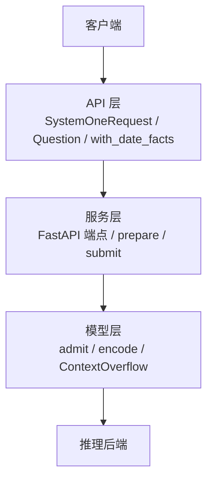
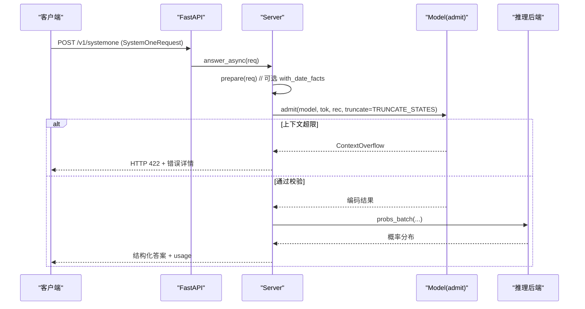
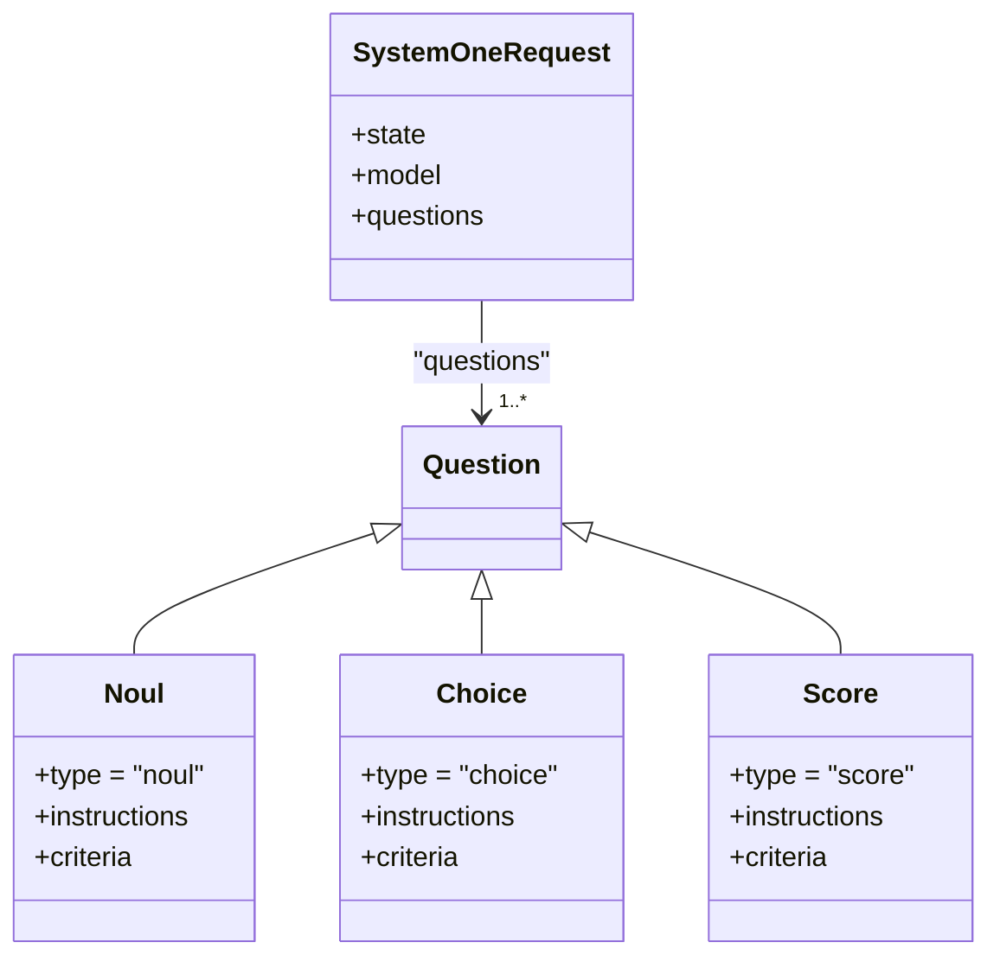
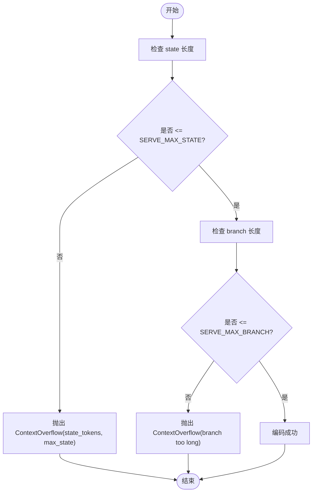
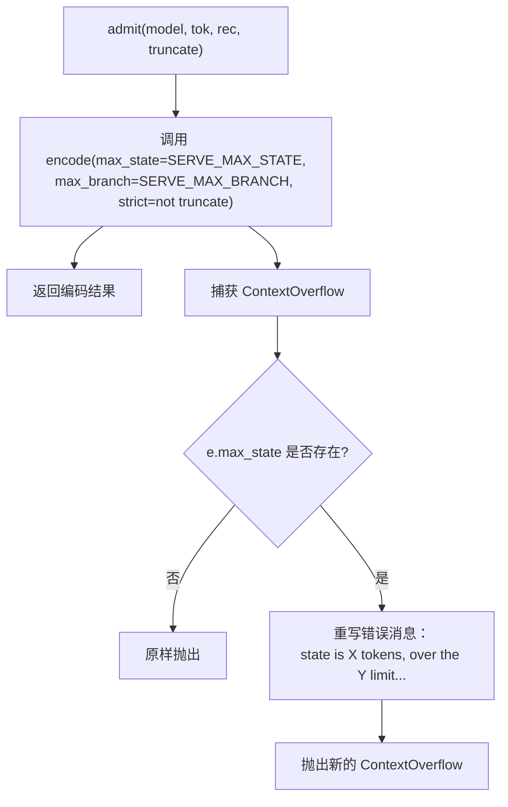
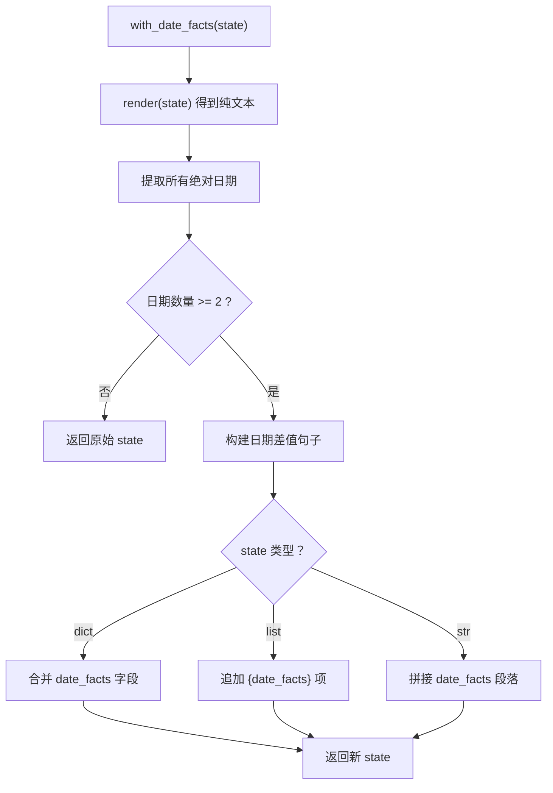
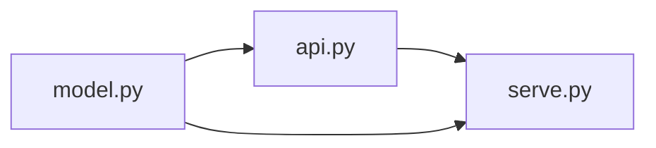

<cite>
**本文引用的文件**   
- [api.py](file://kev/api.py)
- [model.py](file://kev/model.py)
- [serve.py](file://kev/serve.py)
</cite>

## 目录
1. [简介](#简介)
2. [项目结构](#项目结构)
3. [核心组件](#核心组件)
4. [架构总览](#架构总览)
5. [详细组件分析](#详细组件分析)
6. [依赖关系分析](#依赖关系分析)
7. [性能与限制](#性能与限制)
8. [故障排查指南](#故障排查指南)
9. [结论](#结论)

## 简介
本文面向 Kev 的请求验证机制，聚焦以下目标：
- SystemOneRequest 数据模型的字段校验规则，尤其是 questions 字典的结构、question.type 类型检查、criteria 字段的约束。
- 输入长度检查机制：SERVE_MAX_STATE 上下文长度限制、SERVE_MAX_BRANCH 分支数量限制。
- ContextOverflow 异常处理与 admit() 的验证逻辑。
- with_date_facts() 预处理函数的工作原理及 DATE_FACTS 环境变量配置。
- 常见验证错误的示例与解决方案（无效问题类型、过长的上下文、缺失必要字段等）。

## 项目结构
本主题涉及三个关键模块：
- API 层：定义 TypeSafe 兼容的请求模型与问题结构，并提供日期事实预处理。
- 模型层：定义编码、上下文限制、异常类型与“准入”校验。
- 服务层：FastAPI 接口、请求预处理、错误映射与响应包装。

**图表来源**
- [api.py:43-46](file://kev/api.py#L43-L46)
- [serve.py:249-252](file://kev/serve.py#L249-L252)
- [model.py:130-142](file://kev/model.py#L130-L142)

**章节来源**
- [api.py:17-46](file://kev/api.py#L17-L46)
- [serve.py:249-252](file://kev/serve.py#L249-L252)
- [model.py:130-142](file://kev/model.py#L130-L142)

## 核心组件
- SystemOneRequest：包含 state、model、questions 三个字段；questions 必须是非空字典。
- Question 联合类型：支持 noul、choice、score 三种类型，每种对 criteria 有不同约束。
- SERVE_MAX_STATE/SERVE_MAX_BRANCH：服务端的上下文与分支长度上限。
- ContextOverflow：上下文超限异常，携带 state_tokens 与 max_state 信息。
- admit()：统一的服务端“准入”校验入口，封装 encode 的严格模式与截断策略。
- with_date_facts()：可选预处理，为状态注入日期差值事实。

**章节来源**
- [api.py:43-46](file://kev/api.py#L43-L46)
- [api.py:17-40](file://kev/api.py#L17-L40)
- [model.py:18-20](file://kev/model.py#L18-L20)
- [model.py:50-58](file://kev/model.py#L50-L58)
- [model.py:130-142](file://kev/model.py#L130-L142)
- [api.py:84-91](file://kev/api.py#L84-L91)

## 架构总览
请求进入 FastAPI 后，先进行类型解析与基础校验，再执行可选的日期事实预处理，随后通过 admit() 进行严格的上下文长度校验，最终交由模型线程批处理并返回答案。

**图表来源**
- [serve.py:249-252](file://kev/serve.py#L249-L252)
- [serve.py:223-225](file://kev/serve.py#L223-L225)
- [serve.py:132-145](file://kev/serve.py#L132-L145)
- [model.py:130-142](file://kev/model.py#L130-L142)

## 详细组件分析

### SystemOneRequest 与 Question 校验规则
- SystemOneRequest
  - state: JSONContent（字符串、对象、数组、标量或 null）。
  - model: 字符串，默认 "kev-latest"。
  - questions: dict[str, Question]，且至少包含一个键值对（min_length=1）。
- Question 联合类型
  - Noul
    - type: Literal["noul"]
    - instructions: 可选
    - criteria: 可选字典，用于提供 false/true 的描述文本。
  - Choice
    - type: Literal["choice"]
    - instructions: 可选
    - criteria: 必填字典，选项数必须在 1..MAX_OPTIONS（255）之间。
  - Score
    - type: Literal["score"]
    - instructions: 可选
    - criteria: 必填列表，元素个数在 1..MAX_OPTIONS（255）之间。

**图表来源**
- [api.py:43-46](file://kev/api.py#L43-L46)
- [api.py:17-40](file://kev/api.py#L17-L40)

**章节来源**
- [api.py:43-46](file://kev/api.py#L43-L46)
- [api.py:17-40](file://kev/api.py#L17-L40)

### 输入长度检查：SERVE_MAX_STATE 与 SERVE_MAX_BRANCH
- SERVE_MAX_STATE：服务端允许的最大状态长度（含 <state> 分隔符），默认 65536 个 token。
- SERVE_MAX_BRANCH：每个问题的“行”（state + 该问题的分支）最大长度，默认 SERVE_MAX_STATE + 8192。
- 校验位置
  - encode(): 当 strict=True 时，若 state 超过 max_state 则抛出 ContextOverflow；若某问题的 branch 过长也会抛出 ContextOverflow。
  - admit(): 调用 encode(max_state=SERVE_MAX_STATE, max_branch=SERVE_MAX_BRANCH, strict=not truncate)。若发生 state 超限异常，会改写消息以提示如何修复（缩短文档或拆分请求）。

**图表来源**
- [model.py:18-20](file://kev/model.py#L18-L20)
- [model.py:87-127](file://kev/model.py#L87-L127)
- [model.py:130-142](file://kev/model.py#L130-L142)

**章节来源**
- [model.py:18-20](file://kev/model.py#L18-L20)
- [model.py:87-127](file://kev/model.py#L87-L127)
- [model.py:130-142](file://kev/model.py#L130-L142)

### ContextOverflow 异常处理与 admit() 逻辑
- ContextOverflow
  - 继承自 ValueError，额外携带 state_tokens 与 max_state 字段，便于上层区分“状态超长”与“分支超长”。
- admit()
  - 使用 SERVE_MAX_STATE 与 SERVE_MAX_BRANCH 作为上限。
  - 当 truncate=False（默认）时，strict=True，任何超限都会抛错。
  - 当 truncate=True（由 KEV_TRUNCATE_STATES 控制）时，state 超长会被截断至前 SERVE_MAX_STATE 个 token，并在编码结果中记录 state_truncated 与 state_tokens。
  - 若捕获到 state 超限异常，会重写错误消息，明确告知用户如何修复（缩短文档或拆分请求）。

**图表来源**
- [model.py:50-58](file://kev/model.py#L50-L58)
- [model.py:130-142](file://kev/model.py#L130-L142)

**章节来源**
- [model.py:50-58](file://kev/model.py#L50-L58)
- [model.py:130-142](file://kev/model.py#L130-L142)

### with_date_facts() 预处理与 DATE_FACTS 配置
- with_date_facts(state)
  - 从渲染后的状态中提取绝对日期（如 “Month day, year” 或 “YYYY-MM-DD”）。
  - 若存在两个及以上不同日期，会为每对日期生成一句描述（例如“X 是 Y 之后 Z 天”）。
  - 对于 dict 类型的 state，返回新增 date_facts 字段的副本；对于 list 追加一条带 date_facts 的对象；对于字符串则在末尾附加一段说明。
- 环境变量
  - KEV_DATE_FACTS=1：在服务端启用日期事实预处理（serve.py 中的 DATE_FACTS 标志位）。
  - 预处理发生在 prepare(req) 中，对所有请求生效。

**图表来源**
- [api.py:66-91](file://kev/api.py#L66-L91)
- [serve.py:30-32](file://kev/serve.py#L30-L32)
- [serve.py:223-225](file://kev/serve.py#L223-L225)

**章节来源**
- [api.py:66-91](file://kev/api.py#L66-L91)
- [serve.py:30-32](file://kev/serve.py#L30-L32)
- [serve.py:223-225](file://kev/serve.py#L223-L225)

## 依赖关系分析
- api.py 定义的数据模型被 serve.py 导入并使用（SystemOneRequest、to_record、to_answers、output_tokens、with_date_facts）。
- serve.py 通过 model.admit 进行上下文校验，并将 ContextOverflow 转换为 HTTP 422。
- model.py 暴露常量（SERVE_MAX_STATE、SERVE_MAX_BRANCH）、异常（ContextOverflow）与核心编码逻辑（encode、admit）。

**图表来源**
- [serve.py:21-25](file://kev/serve.py#L21-L25)
- [api.py:102-117](file://kev/api.py#L102-L117)
- [model.py:130-142](file://kev/model.py#L130-L142)

**章节来源**
- [serve.py:21-25](file://kev/serve.py#L21-L25)
- [api.py:102-117](file://kev/api.py#L102-L117)
- [model.py:130-142](file://kev/model.py#L130-L142)

## 性能与限制
- 上下文长度
  - SERVE_MAX_STATE=65536：单条请求的状态 token 上限（含 <state>）。
  - SERVE_MAX_BRANCH=SERVE_MAX_STATE+8192：每条问题的“行”上限。
- 截断策略
  - 默认拒绝超长状态（HTTP 422）。
  - 设置 KEV_TRUNCATE_STATES=1 可读取前 SERVE_MAX_STATE 个 token，并在响应中标记 truncated 与 usage.state_tokens/state_tokens_used。
- 日期事实预处理
  - KEV_DATE_FACTS=1 会增加少量文本，可能影响 token 计数与上下文占用。

**章节来源**
- [model.py:18-20](file://kev/model.py#L18-L20)
- [serve.py:30-32](file://kev/serve.py#L30-L32)
- [serve.py:211-220](file://kev/serve.py#L211-L220)

## 故障排查指南

### 常见错误与原因
- 无效的问题类型
  - 现象：Pydantic 校验失败。
  - 原因：question.type 不是 "noul"/"choice"/"score" 之一。
  - 解决：确保 question.type 为上述三者之一。
- 缺失或非法的 criteria
  - Choice：criteria 必须为非空字典，且选项数在 1..255。
  - Score：criteria 必须为非空列表，且元素数在 1..255。
  - Noul：criteria 可为空，但若提供需为字典。
  - 解决：按类型补齐 criteria，并保证选项数量合法。
- 过长的上下文
  - 现象：HTTP 422，错误消息包含 state exceeds ... 或 branch too long。
  - 原因：state 超过 SERVE_MAX_STATE 或某问题的 branch 超过 SERVE_MAX_BRANCH。
  - 解决：
    - 缩短文档或将长文档拆分为多个请求。
    - 如需截断，启动服务时设置 KEV_TRUNCATE_STATES=1，并在响应中关注 truncated 与 usage.state_tokens/state_tokens_used。
- 缺失必要字段
  - 现象：Pydantic 校验失败（如 questions 为空）。
  - 原因：SystemOneRequest.questions 至少需要一个键值对。
  - 解决：确保 questions 非空，且每个 question 的类型与 criteria 符合规范。

### 定位步骤
1. 确认 question.type 是否为 "noul"/"choice"/"score"。
2. 检查 criteria 是否符合对应类型的约束（Choice 字典 1..255；Score 列表 1..255；Noul 可选字典）。
3. 若出现 422 且包含 state exceeds 或 branch too long：
   - 优先缩短 state 或拆分请求。
   - 如需截断，启用 KEV_TRUNCATE_STATES=1 并检查响应中的 truncated 标记。
4. 若启用了 KEV_DATE_FACTS=1，注意日期事实会增加少量文本，可能影响 token 计数。

**章节来源**
- [api.py:17-40](file://kev/api.py#L17-L40)
- [api.py:43-46](file://kev/api.py#L43-L46)
- [model.py:18-20](file://kev/model.py#L18-L20)
- [model.py:87-127](file://kev/model.py#L87-L127)
- [serve.py:132-145](file://kev/serve.py#L132-L145)
- [serve.py:211-220](file://kev/serve.py#L211-L220)

## 结论
Kev 的请求验证围绕三层展开：API 层的类型与结构校验、模型层的上下文长度与分支限制、服务层的错误映射与可选预处理。理解 SystemOneRequest 与 Question 的约束、SERVE_MAX_STATE/SERVE_MAX_BRANCH 的限制、ContextOverflow 的处理以及 with_date_facts() 的行为，有助于在生产环境中稳定地构造与调试请求。遇到超限时，优先缩短或拆分上下文；必要时启用截断策略并关注响应中的 truncation 标记。