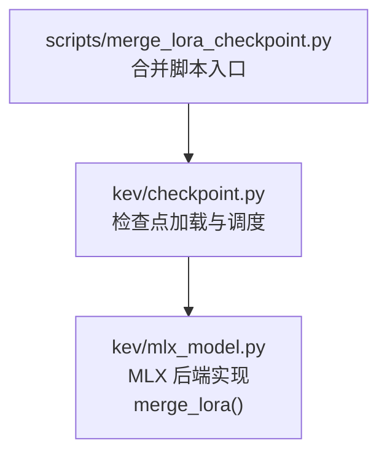
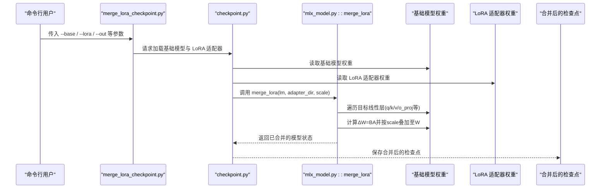
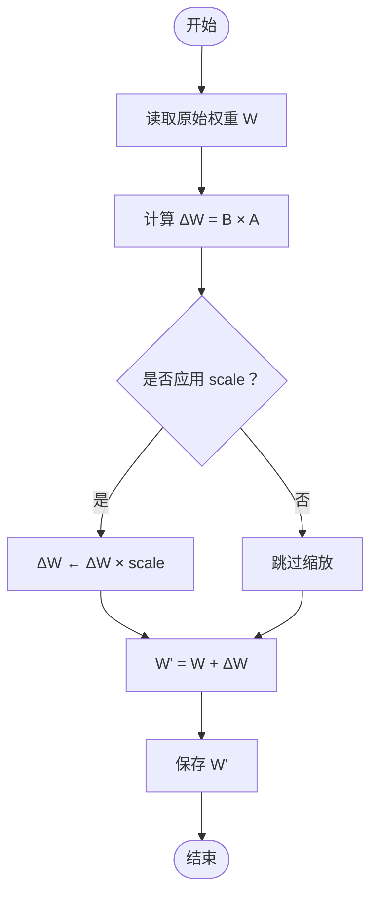
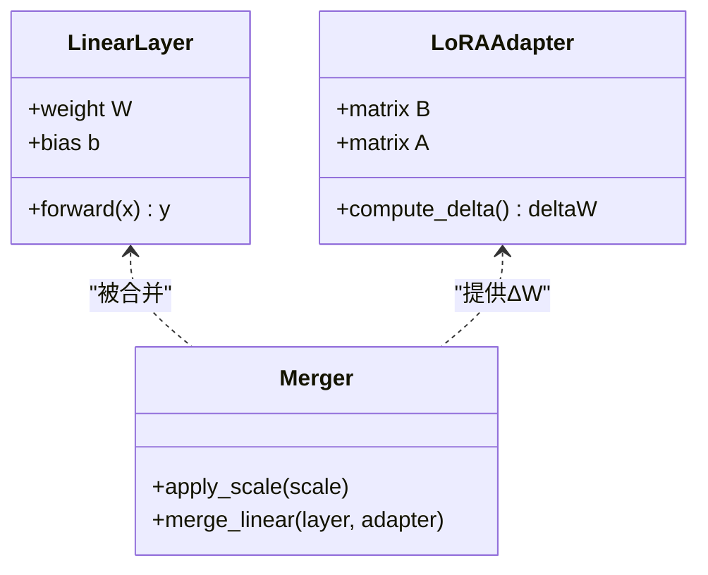
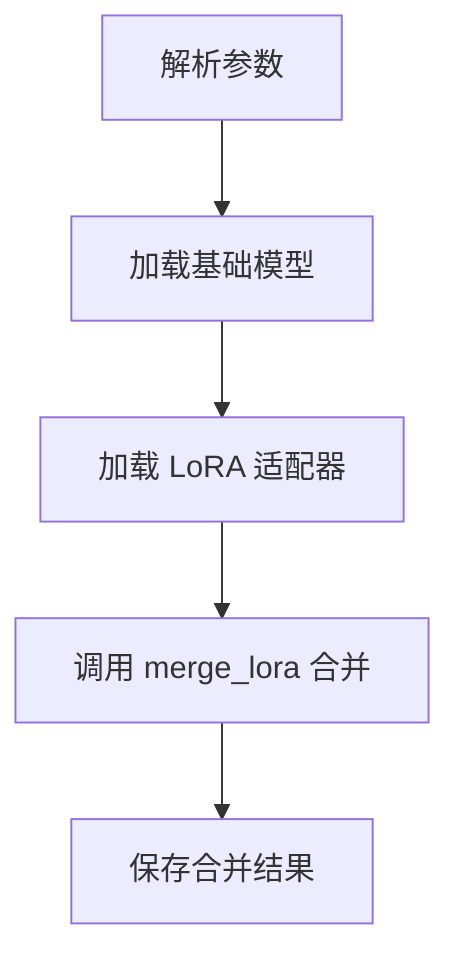
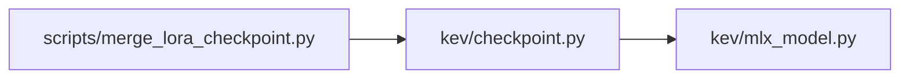

<cite>
**本文引用的文件**   
- [merge_lora_checkpoint.py](file://scripts/merge_lora_checkpoint.py)
- [checkpoint.py](file://kev/checkpoint.py)
- [mlx_model.py](file://kev/mlx_model.py)
</cite>

## 目录
1. [简介](#简介)
2. [项目结构](#项目结构)
3. [核心组件](#核心组件)
4. [架构总览](#架构总览)
5. [详细组件分析](#详细组件分析)
6. [依赖关系分析](#依赖关系分析)
7. [性能与精度考量](#性能与精度考量)
8. [故障排查指南](#故障排查指南)
9. [结论](#结论)
10. [附录：命令行使用与验证流程](#附录命令行使用与验证流程)

## 简介
本文件面向“将训练好的 LoRA 适配器权重合并回基础模型”的完整技术文档，聚焦仓库中的合并脚本与 MLX 后端实现。内容涵盖：
- 数学原理：如何将低秩增量 ΔW = BA 加回到原始权重 W，得到 W' = W + ΔW。
- 目标模块策略：对 q_proj、k_proj、v_proj、o_proj 等线性层的合并方式。
- 合并流程：从加载基础模型与 LoRA 适配器到生成最终检查点的步骤。
- 一致性验证：如何确保合并后模型与原 LoRA 模型的输出一致（数值精度与性能）。
- 格式与兼容性：合并前后模型格式差异与部署兼容性注意事项。
- 使用指南：为初学者提供命令行用法，为专家提供扩展自定义合并逻辑的指导。

## 项目结构
本次文档涉及的关键路径与职责：
- scripts/merge_lora_checkpoint.py：LoRA 权重合并的主入口脚本。
- kev/checkpoint.py：统一检查点加载与调度逻辑，负责在合适时机调用 merge_lora。
- kev/mlx_model.py：MLX 后端的具体实现，包含 merge_lora 函数与相关说明。

**图示来源**
- [merge_lora_checkpoint.py](file://scripts/merge_lora_checkpoint.py)
- [checkpoint.py:247-252](file://kev/checkpoint.py#L247-L252)
- [mlx_model.py:14,96:14-14](file://kev/mlx_model.py#L14-L14)
- [mlx_model.py:96-96](file://kev/mlx_model.py#L96-L96)

**章节来源**
- [merge_lora_checkpoint.py](file://scripts/merge_lora_checkpoint.py)
- [checkpoint.py:247-252](file://kev/checkpoint.py#L247-L252)
- [mlx_model.py:14,96:14-14](file://kev/mlx_model.py#L14-L14)

## 核心组件
- 合并脚本入口（scripts/merge_lora_checkpoint.py）
  - 作用：提供命令行接口，接收基础模型路径、LoRA 适配器路径、输出路径等参数，触发合并流程。
- 检查点调度（kev/checkpoint.py）
  - 作用：统一加载检查点，并在需要时调用 MLX 后端的 merge_lora 完成权重合并；同时处理 full_ft 与 lora 模式的分发。
- MLX 后端实现（kev/mlx_model.py）
  - 作用：提供 merge_lora(lm, adapter_dir, scale=1.0) 的具体实现，按 LoRA 命名约定遍历并合并目标线性层；文档注释说明全量权重检查点由该脚本构建。

**章节来源**
- [checkpoint.py:247-252](file://kev/checkpoint.py#L247-L252)
- [mlx_model.py:14,96:14-14](file://kev/mlx_model.py#L14-L14)

## 架构总览
下图展示 LoRA 权重合并的整体数据流与控制流：

**图示来源**
- [merge_lora_checkpoint.py](file://scripts/merge_lora_checkpoint.py)
- [checkpoint.py:247-252](file://kev/checkpoint.py#L247-L252)
- [mlx_model.py:96](file://kev/mlx_model.py#L96-L96)

## 详细组件分析

### 数学原理：ΔW = BA 的叠加
- LoRA 将更新分解为两个低秩矩阵 B、A，使得 ΔW = BA。
- 合并过程对每个目标线性层执行 W' = W + ΔW（可带缩放系数 scale）。
- 该操作是逐元素加法，保持维度一致；通常以 fp32 计算以保证数值稳定性。

[无图示来源，因为该图为概念性流程图]

**章节来源**
- [mlx_model.py:14](file://kev/mlx_model.py#L14-L14)

### 目标模块合并策略：q_proj、k_proj、v_proj、o_proj
- 合并脚本与 MLX 后端通过 LoRA 命名约定识别目标模块，常见包括：
  - q_proj、k_proj、v_proj、o_proj（注意力头投影）
  - 其他可能的线性层（如 MLP 的 gate/up/down 等，取决于具体模型）
- 合并规则：
  - 若某层存在对应的 LoRA 适配器（B、A），则计算 ΔW = BA 并叠加到原权重。
  - 若无对应适配器，则保留原权重不变。
- 缩放因子：
  - 可通过参数控制 scale（默认通常为 1.0），用于调节 LoRA 贡献强度。

**图示来源**
- [mlx_model.py:96](file://kev/mlx_model.py#L96-L96)

**章节来源**
- [mlx_model.py:96](file://kev/mlx_model.py#L96-L96)

### 合并流程：从加载到保存
- 步骤概览：
  1. 解析命令行参数（基础模型路径、LoRA 适配器路径、输出路径、scale 等）。
  2. 加载基础模型权重。
  3. 加载 LoRA 适配器权重。
  4. 调用 merge_lora 进行逐层合并。
  5. 保存合并后的检查点到指定路径。

[无图示来源，因为该图为概念性流程图]

**章节来源**
- [checkpoint.py:247-252](file://kev/checkpoint.py#L247-L252)
- [mlx_model.py:14](file://kev/mlx_model.py#L14-L14)

### 合并前后的模型格式与兼容性
- 合并前：
  - 基础模型权重与 LoRA 适配器分离存储，推理时需动态组合。
- 合并后：
  - 生成“全量权重”检查点，可直接作为标准模型加载，无需额外 LoRA 适配。
- 兼容性：
  - 合并后的检查点应与下游推理/服务框架兼容（例如 MLX 或 Torch 后端）。
  - 注意 dtype 与设备布局的一致性（建议 fp32 合并，再按需转换）。

**章节来源**
- [mlx_model.py:14](file://kev/mlx_model.py#L14-L14)

## 依赖关系分析
- 脚本入口依赖 checkpoint 调度，checkpoint 依赖 mlx_model 的具体实现。
- 关键依赖链：
  - scripts/merge_lora_checkpoint.py → kev/checkpoint.py → kev/mlx_model.py

**图示来源**
- [checkpoint.py:247-252](file://kev/checkpoint.py#L247-L252)
- [mlx_model.py:96](file://kev/mlx_model.py#L96-L96)

**章节来源**
- [checkpoint.py:247-252](file://kev/checkpoint.py#L247-L252)
- [mlx_model.py:96](file://kev/mlx_model.py#L96-L96)

## 性能与精度考量
- 精度：
  - 建议在 fp32 下执行合并，避免累积误差；必要时再进行量化或半精度转换。
- 性能：
  - 合并是一次性离线操作，主要成本在于矩阵乘法 BA 与逐层叠加。
  - 对于大模型，建议使用高效 BLAS/GEMM 实现（MLX/Torch 底层优化）。
- 内存：
  - 合并过程中需同时持有 W、B、A，注意峰值内存占用。

[本节为通用指导，不直接分析具体文件]

## 故障排查指南
- 常见问题：
  - 找不到 LoRA 适配器：确认适配器目录结构与命名约定匹配。
  - 维度不匹配：检查 B、A 与目标线性层权重维度是否一致。
  - 输出不一致：核对 scale 参数是否与训练时一致；确认 dtype 与设备一致。
- 诊断建议：
  - 打印各层 ΔW 范数与相对误差，定位异常层。
  - 对比合并前后模型在相同输入下的 logits 差异。

[本节为通用指导，不直接分析具体文件]

## 结论
通过将 LoRA 的低秩增量 ΔW = BA 以适当缩放叠加到基础模型权重 W，可以得到可直接部署的全量权重检查点。本仓库通过脚本入口与 MLX 后端实现提供了稳定、可复现的合并流程，便于在研究与生产环境中快速集成与验证。

[本节为总结性内容，不直接分析具体文件]

## 附录：命令行使用与验证流程

### 命令行使用（初学者）
- 基本命令：
  - python scripts/merge_lora_checkpoint.py --base <基础模型路径> --lora <LoRA 适配器路径> --out <输出路径> [--scale 缩放系数]
- 参数说明：
  - --base：基础模型权重路径
  - --lora：LoRA 适配器路径
  - --out：合并后检查点输出路径
  - --scale：LoRA 贡献缩放系数（可选，默认通常为 1.0）

[本节为通用指导，不直接分析具体文件]

### 验证流程（专家）
- 数值一致性验证：
  - 使用同一份输入分别运行“LoRA 动态组合”和“合并后全量模型”，比较 logits 或损失值。
  - 设置合理容差（如 atol=1e-5, rtol=1e-5），统计最大绝对误差与相对误差。
- 性能测试：
  - 对比合并前后推理延迟与吞吐，评估合并带来的收益。
- 回归测试：
  - 在多个任务集上评估合并后模型，确保指标不下降。

[本节为通用指导，不直接分析具体文件]