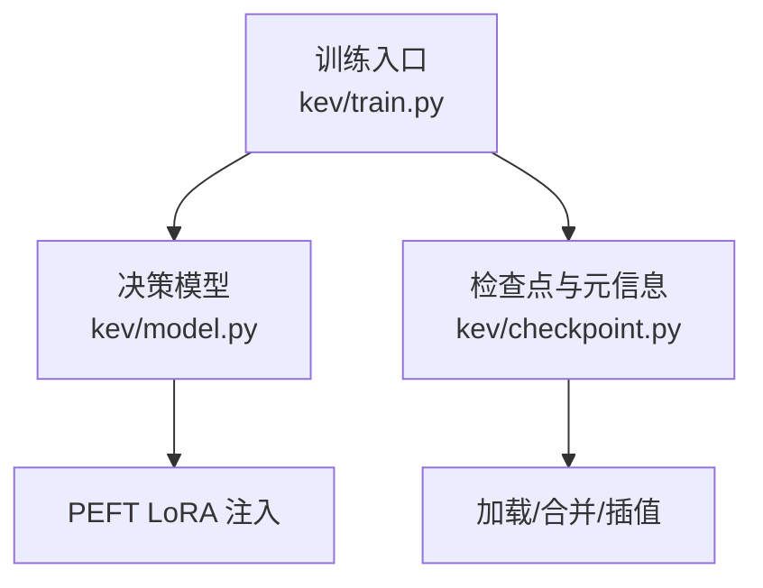
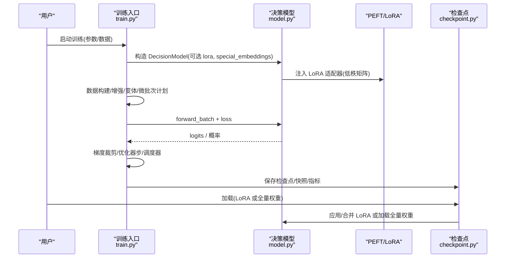
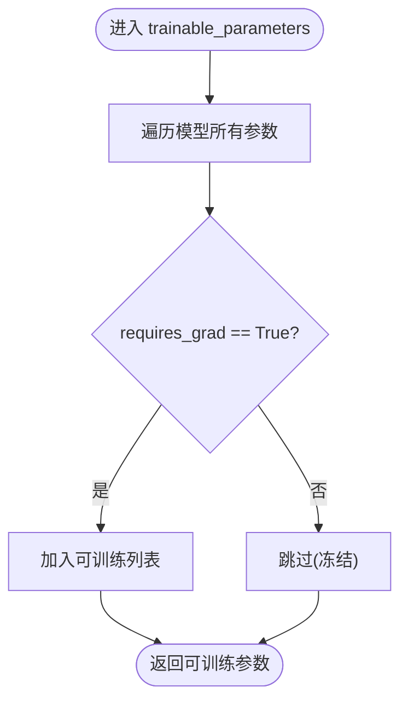
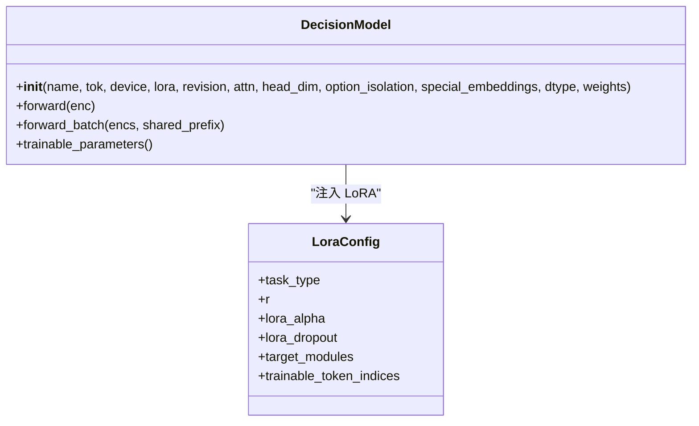
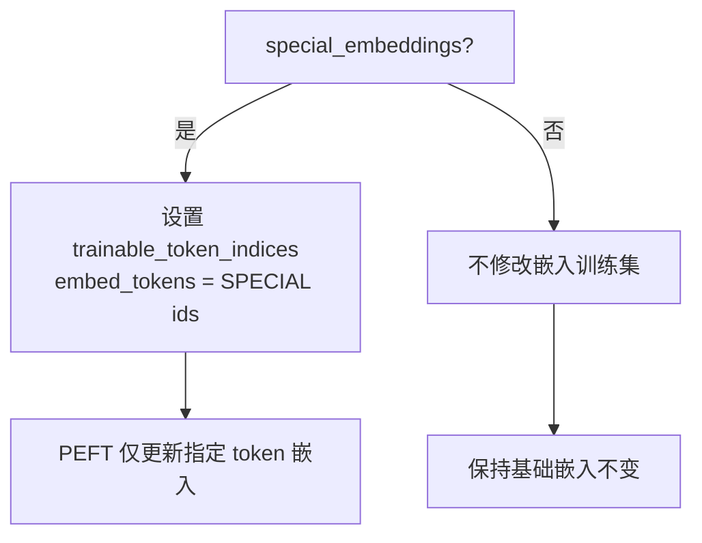
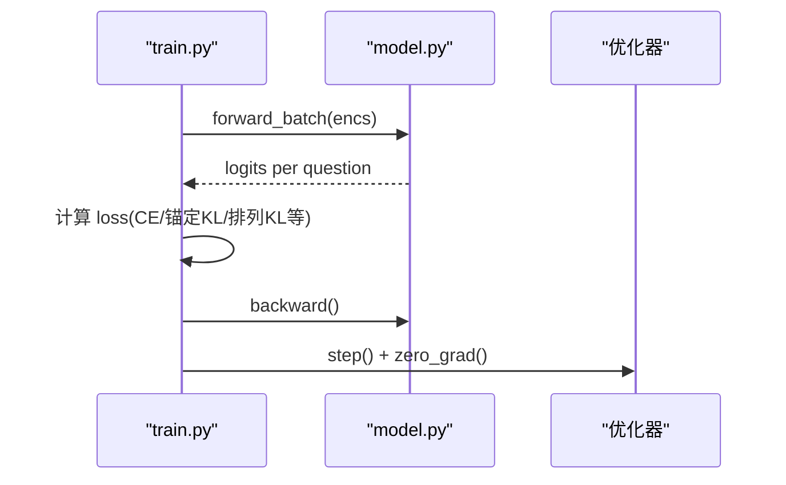
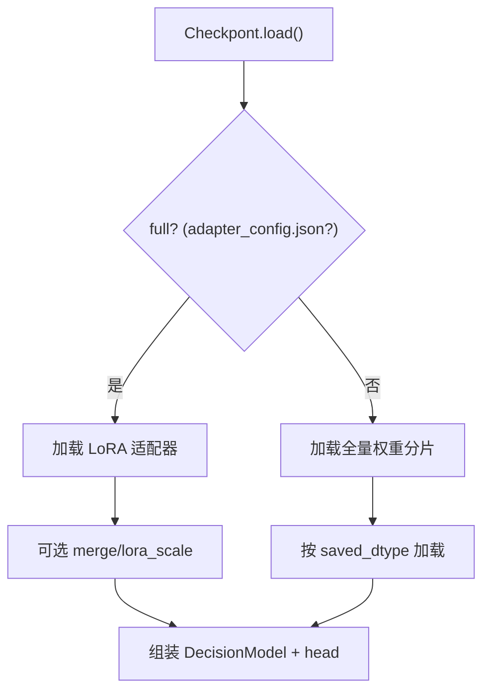
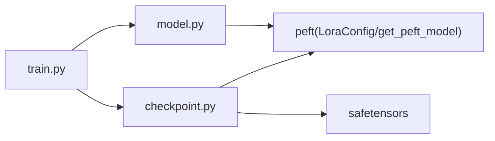

<cite>
**本文引用的文件**   
- [model.py](file://kev/model.py)
- [train.py](file://kev/train.py)
- [checkpoint.py](file://kev/checkpoint.py)
</cite>

## 目录
1. [简介](#简介)
2. [项目结构](#项目结构)
3. [核心组件](#核心组件)
4. [架构总览](#架构总览)
5. [详细组件分析](#详细组件分析)
6. [依赖关系分析](#依赖关系分析)
7. [性能与优化](#性能与优化)
8. [故障排查](#故障排查)
9. [结论](#结论)
10. [附录：完整训练示例](#附录完整训练示例)

## 简介
本文面向 Kev 中的 LoRA 微调，系统梳理从数据准备到权重训练的完整流程，重点解释：
- 可训练参数识别机制：`trainable_parameters()` 如何筛选需要更新的参数，以及如何冻结预训练主干。
- 特殊 token 嵌入训练策略：`special_embeddings` 如何控制分隔符嵌入是否参与训练，以及对模型行为的影响。
- 训练过程中的梯度流：LoRA 适配器与主干网络协同方式，以及梯度如何在低秩矩阵中传播。
- 监控与检查点保存机制。
- 为初学者提供环境搭建指导，为专家提供分布式训练与性能优化技巧。

## 项目结构
Kev 的训练入口、模型定义与检查点加载分别位于以下模块：
- `kev/train.py`：训练主循环、数据组织、损失计算、优化器调度、检查点与快照写入。
- `kev/model.py`：决策模型封装、LoRA 注入、编码/掩码、前向与推理接口、可训练参数暴露。
- `kev/checkpoint.py`：检查点元信息、LoRA/全量权重加载规则、合并与插值、warm start。

**图示来源**
- [train.py:1-12](file://kev/train.py#L1-L12)
- [model.py:243-276](file://kev/model.py#L243-L276)
- [checkpoint.py:168-308](file://kev/checkpoint.py#L168-L308)

**章节来源**
- [train.py:1-12](file://kev/train.py#L1-L12)
- [model.py:243-276](file://kev/model.py#L243-L276)
- [checkpoint.py:168-308](file://kev/checkpoint.py#L168-L308)

## 核心组件
- 决策模型 `DecisionModel`：封装 Transformer 主干、LoRA 注入、指针头（PointerHead）、编码与注意力掩码、前向与推理接口。
- 训练管线：数据构建/增强、变体生成、微批次计划、损失计算、梯度裁剪、优化器与调度器、检查点与快照。
- 检查点系统：LoRA 适配器或全量权重的加载、合并、插值、温度校准、warm start。

**章节来源**
- [model.py:205-276](file://kev/model.py#L205-L276)
- [train.py:370-485](file://kev/train.py#L370-L485)
- [checkpoint.py:47-80](file://kev/checkpoint.py#L47-L80)

## 架构总览
下图展示 LoRA 微调在 Kev 中的端到端流程：数据准备 → 模型装配（含 LoRA）→ 训练循环 → 检查点/快照 → 推理加载。

**图示来源**
- [train.py:523-675](file://kev/train.py#L523-L675)
- [model.py:243-276](file://kev/model.py#L243-L276)
- [checkpoint.py:227-308](file://kev/checkpoint.py#L227-L308)

## 详细组件分析

### 可训练参数识别与冻结机制
- `DecisionModel.trainable_parameters()` 返回所有 `requires_grad=True` 的参数。默认情况下，Transformer 主干通过 PEFT 的 LoRA 注入后仅 LoRA 模块可训练；其余主干参数保持冻结。
- 指针头 `PointerHead` 始终可训练，并在训练时单独分组以支持独立学习率。
- 训练入口将“非 head 的可训练参数”和“head 参数”分为两个组，分别传入 AdamW（或全量微调时的 MasterAdamW）。

**图示来源**
- [model.py:507-508](file://kev/model.py#L507-L508)

**章节来源**
- [model.py:507-508](file://kev/model.py#L507-L508)
- [train.py:575-579](file://kev/train.py#L575-L579)

### LoRA 注入与目标模块选择
- 当 `lora > 0` 时，使用 `peft.LoraConfig` 注入 LoRA。
- `lora_targets` 控制目标模块集合：
  - `"all"`：包含注意力与 MLP 投影，以及在混合骨干（Qwen3.5）上的 DeltaNet 相关投影。
  - `"dense"`：排除 DeltaNet 投影（用于消融）。
  - `"attn"`：仅注意力投影。
  - `"qv"`：仅 q_proj/v_proj。
- LoRA 的 rank 由 `--lora` 指定，alpha 固定为 `2 * r`，dropout 为 0.05。

**图示来源**
- [model.py:243-276](file://kev/model.py#L243-L276)

**章节来源**
- [model.py:243-276](file://kev/model.py#L243-L276)

### 特殊 token 嵌入训练策略
- 分隔符 token 集合 `SPECIAL` 包括 `<state>`、`<q>`、`<opt>`、`</opt>`、`<decide>`。
- 当 `special_embeddings=True` 时，通过 `LoraConfig.trainable_token_indices` 允许这些分隔符的嵌入向量参与训练。
- 对 LoRA 路径：仅在 PEFT 中标记这些 token 索引为可训练；对全量微调路径：不允许同时开启 `special_embeddings`（因为全量微调会训练全部嵌入）。
- 影响：启用后可让分隔符的语义表示随任务微调而漂移，从而改变模型对指令/选项边界/决策标记的理解与响应。

**图示来源**
- [model.py:9-11](file://kev/model.py#L9-L11)
- [model.py:265-275](file://kev/model.py#L265-L275)
- [train.py:395-396](file://kev/train.py#L395-L396)
- [train.py:459-461](file://kev/train.py#L459-L461)

**章节来源**
- [model.py:9-11](file://kev/model.py#L9-L11)
- [model.py:265-275](file://kev/model.py#L265-L275)
- [train.py:395-396](file://kev/train.py#L395-L396)
- [train.py:459-461](file://kev/train.py#L459-L461)

### 训练过程中的梯度流
- 前向：`forward_batch` 根据骨干类型（注意力型 vs 混合 DeltaNet）选择 packed 块因果掩码或行形式（row form），得到每问的 logits。
- 反向：loss 对每个变体的问题取平均并累加，随后 `.backward()` 累积梯度。
- 优化：LoRA 路径使用标准 AdamW，并对 `trainable_parameters()` 执行全局梯度范数裁剪；全量微调路径使用 `MasterAdamW`（bf16 权重 + fp32 主权重）。
- 梯度在 LoRA 低秩矩阵中传播：由于主干被冻结，只有 LoRA 模块（及 head）接收梯度并更新，从而实现高效微调。

**图示来源**
- [train.py:342-365](file://kev/train.py#L342-L365)
- [train.py:624-635](file://kev/train.py#L624-L635)
- [model.py:385-394](file://kev/model.py#L385-L394)

**章节来源**
- [train.py:342-365](file://kev/train.py#L342-L365)
- [train.py:624-635](file://kev/train.py#L624-L635)
- [model.py:385-394](file://kev/model.py#L385-L394)

### 检查点与快照保存机制
- LoRA 检查点：保存 adapter 配置、adapter 权重、tokenizer 与 `head.pt`（含 Meta 元信息）。
- 全量权重检查点：保存 backbone 分片、config.json、`head.pt`。
- 加载规则：存在 `adapter_config.json` 视为 LoRA 适配器；否则若存在 config 与分片则视为全量权重。
- 合并与插值：
  - `merge`：将 LoRA delta 以 fp32 精度折叠进基座权重（一次舍入），避免中间 fp32 副本。
  - `lora_scale`：WiSE-FT 风格插值，推理时可调节 base/fine-tuned 权重比例。
- Warm start：可从已有 LoRA 或全量权重检查点继续训练，校验架构字段一致性后再载入。

**图示来源**
- [checkpoint.py:180-188](file://kev/checkpoint.py#L180-L188)
- [checkpoint.py:227-308](file://kev/checkpoint.py#L227-L308)
- [checkpoint.py:312-351](file://kev/checkpoint.py#L312-L351)

**章节来源**
- [checkpoint.py:180-188](file://kev/checkpoint.py#L180-L188)
- [checkpoint.py:227-308](file://kev/checkpoint.py#L227-L308)
- [checkpoint.py:312-351](file://kev/checkpoint.py#L312-L351)

## 依赖关系分析
- `train.py` 依赖 `model.py` 的 `DecisionModel`、`fits`、`rows_of`、`training_context`、`load_tokenizer`。
- `train.py` 依赖 `checkpoint.py` 的 `Checkpoint`、`Meta`、`write_meta`。
- `model.py` 依赖 `peft` 进行 LoRA 注入。
- `checkpoint.py` 依赖 `peft` 与 `safetensors` 进行适配器/分片加载。

**图示来源**
- [train.py:17-24](file://kev/train.py#L17-L24)
- [model.py:265-275](file://kev/model.py#L265-L275)
- [checkpoint.py:287-308](file://kev/checkpoint.py#L287-L308)

**章节来源**
- [train.py:17-24](file://kev/train.py#L17-L24)
- [model.py:265-275](file://kev/model.py#L265-L275)
- [checkpoint.py:287-308](file://kev/checkpoint.py#L287-L308)

## 性能与优化
- 数据类型：
  - 训练：主干权重可使用 bf16（`--weights_dtype bf16`），LoRA 与 head 保持 fp32（PEFT 自动上转换）。
  - 推理：可选择 bf16 以降低延迟与显存占用（`LoadOptions.dtype`）。
- 梯度裁剪：全局范数上限 `MAX_GRAD_NORM=1.0`，防止梯度爆炸。
- 内存优化：
  - `--checkpointing` 启用激活重计算。
  - MPS 设备每步释放缓存。
  - `--row_budget` 将微批次切分为多 pass，限制单次前/反向的 padded tokens。
  - `--length_sort` 与 `--pass_tokens_max` 平衡各 rank 负载，减少 padding 浪费。
- 分布式训练：
  - 全量微调使用 `torchrun` + FSDP2（`full_ft.init_distributed`、`shard`、`MasterAdamW`）。
  - LoRA 微调单卡即可，也可在多卡下运行但无需 FSDP。
- 服务加速：
  - CUDA Graphs（混合骨干）与融合内核（`fused_qwen35`）可降低推理延迟。

**章节来源**
- [train.py:391-393](file://kev/train.py#L391-L393)
- [train.py:503-509](file://kev/train.py#L503-L509)
- [train.py:545-547](file://kev/train.py#L545-L547)
- [train.py:630-637](file://kev/train.py#L630-L637)
- [train.py:418-428](file://kev/train.py#L418-L428)
- [train.py:526-562](file://kev/train.py#L526-L562)
- [checkpoint.py:83-145](file://kev/checkpoint.py#L83-L145)

## 故障排查
- 训练上下文溢出：记录超过 `max_state`/`max_branch`/`max_packed` 会被丢弃或报错。
- 评估专用源混入训练：若数据包含 `eval_only_sources`，训练直接报错。
- 参数冲突：
  - `--full_ft 1` 必须搭配 `--weights_dtype bf16`，且不能开启 `--special_embeddings`。
  - `--pass_tokens_max` 需配合混合骨干（Gated DeltaNet），注意力型骨干不支持。
  - `--row_budget` 与 `--perm_kl`、`--anchor_w`、分布式训练互斥。
- 检查点不一致：
  - `head.pt` 的 `weights` 与目录内容（adapter 或 full）不一致时报错。
  - warm start 时架构字段（base、lora、head_dim、option_isolation、special_embeddings、weights）必须一致。

**章节来源**
- [train.py:101-133](file://kev/train.py#L101-L133)
- [train.py:458-477](file://kev/train.py#L458-L477)
- [checkpoint.py:180-188](file://kev/checkpoint.py#L180-L188)
- [checkpoint.py:312-351](file://kev/checkpoint.py#L312-L351)

## 结论
Kev 的 LoRA 微调通过 PEFT 精确注入低秩适配器，冻结主干参数，仅更新 LoRA 与指针头，实现高效、可控的微调。`special_embeddings` 提供了对关键分隔符嵌入的细粒度控制，便于调整模型对指令/选项边界的理解。训练管线内置丰富的内存与并行优化，检查点系统统一了 LoRA 与全量权重的加载、合并与插值，便于实验迭代与服务部署。

## 附录：完整训练示例
以下为从零开始完成 LoRA 微调的步骤说明（不包含具体代码内容）：
1. 安装依赖与环境准备：
   - 安装 PyTorch、transformers、peft、huggingface_hub 等。
   - 确认 GPU/CPU/MPS 可用性与驱动版本。
2. 准备数据：
   - 使用自有 JSONL 数据，或基于套件（suite）构建训练集。
   - 确保数据符合训练上下文限制（`max_state`/`max_branch`/`max_packed`）。
3. 启动训练：
   - 选择基础模型（如 Qwen 系列）。
   - 设置 LoRA 超参：rank、目标模块、学习率、batch、accumulation。
   - 可选开启 `special_embeddings` 以训练分隔符嵌入。
   - 输出目录与日志查看。
4. 监控与检查点：
   - 观察 loss、梯度范数、步数与时间统计。
   - LoRA 检查点保存在输出目录，包含 adapter 与 tokenizer。
5. 推理与部署：
   - 使用 `Checkpoint.load` 加载 LoRA 适配器或全量权重。
   - 可选择合并 LoRA 或进行 `lora_scale` 插值。
   - 服务时可切换 bf16 推理以提升吞吐。

参考实现位置：
- 训练入口与参数解析：[train.py:370-485](file://kev/train.py#L370-L485)、[train.py:523-675](file://kev/train.py#L523-L675)
- 模型装配与 LoRA 注入：[model.py:243-276](file://kev/model.py#L243-L276)
- 检查点加载与合并：[checkpoint.py:227-308](file://kev/checkpoint.py#L227-L308)