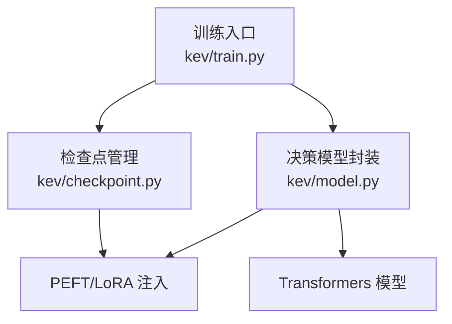
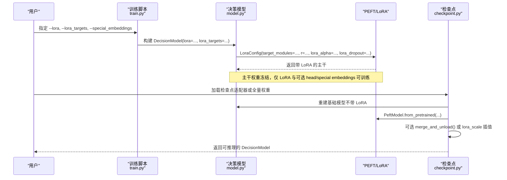
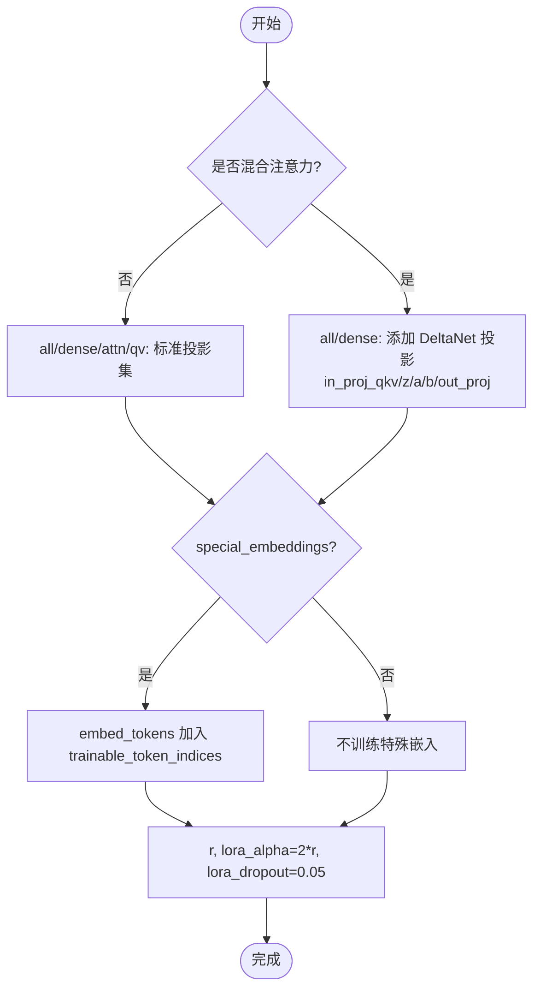
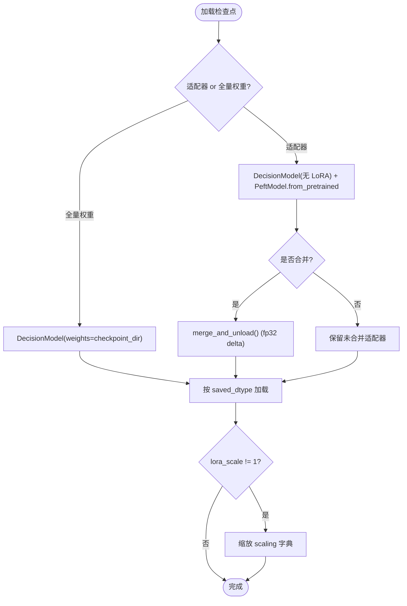
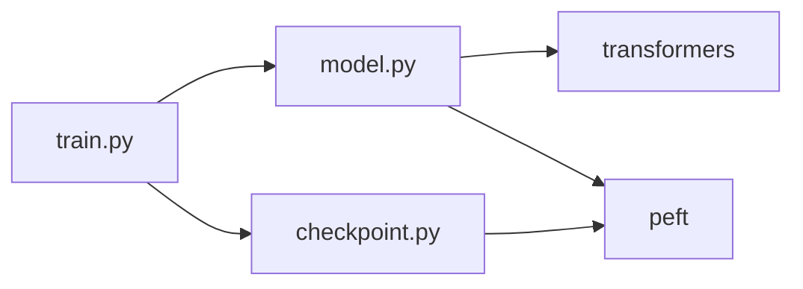

# LoRA 适配器

<cite>
**本文引用的文件**   
- [train.py](file://kev/train.py)
- [model.py](file://kev/model.py)
- [checkpoint.py](file://kev/checkpoint.py)
</cite>

## 目录
1. [引言](#引言)
2. [项目结构](#项目结构)
3. [核心组件](#核心组件)
4. [架构总览](#架构总览)
5. [详细组件分析](#详细组件分析)
6. [依赖关系分析](#依赖关系分析)
7. [性能与内存特性](#性能与内存特性)
8. [微调流程示例](#微调流程示例)
9. [故障排除指南](#故障排除指南)
10. [结论](#结论)

## 引言
本文件系统化梳理 Kev 中低秩适应（LoRA）适配器的实现与使用方式。Kev 通过 PEFT 库在预训练语言模型上注入可训练的低秩矩阵，保持主干权重冻结；同时支持多种目标模块策略（dense、attn、qv 等），并对混合注意力模型（Gated DeltaNet）进行特殊处理。文档还覆盖特殊 token 嵌入的可训练性、LoRA 参数初始化策略及其对性能的影响，并提供从数据准备到权重合并的完整微调流程，以及面向初学者的原理说明和面向专家的超参调优与排错建议。

## 项目结构
围绕 LoRA 的关键代码集中在以下三个文件：
- kev/train.py：训练入口、命令行参数、训练循环、LoRA 相关选项（如 lora_targets、special_embeddings）。
- kev/model.py：决策模型封装、PEFT/LoRA 注入逻辑、混合注意力识别、特殊 token 嵌入可训练配置。
- kev/checkpoint.py：检查点加载、LoRA 适配器与全量权重的判别、权重合并、lora_scale 插值、warm start。

图表来源
- [train.py:370-485](file://kev/train.py#L370-L485)
- [model.py:243-276](file://kev/model.py#L243-L276)
- [checkpoint.py:168-308](file://kev/checkpoint.py#L168-L308)

章节来源
- [train.py:370-485](file://kev/train.py#L370-L485)
- [model.py:243-276](file://kev/model.py#L243-L276)
- [checkpoint.py:168-308](file://kev/checkpoint.py#L168-L308)

## 核心组件
- 训练脚本与参数
  - 提供 --lora、--lora_targets、--special_embeddings、--weights_dtype 等关键参数，控制 LoRA 秩、目标模块集合、是否训练特殊分隔符嵌入、主干权重精度。
- 决策模型封装
  - 在构造时根据 lora_targets 选择要注入 LoRA 的目标模块；若为混合注意力模型，额外包含 Gated DeltaNet 投影名称；当 special_embeddings 开启时，将特殊分隔符 token 的索引加入 trainable_token_indices。
- 检查点与推理加载
  - 自动判断是 LoRA 适配器还是全量权重检查点；支持合并 LoRA、按 lora_scale 插值、在 bf16 主干上的兼容加载与合并策略。

章节来源
- [train.py:370-485](file://kev/train.py#L370-L485)
- [model.py:243-276](file://kev/model.py#L243-L276)
- [checkpoint.py:168-308](file://kev/checkpoint.py#L168-L308)

## 架构总览
下图展示 LoRA 在 Kev 中的整体工作流：训练阶段通过 DecisionModel 注入 LoRA，推理阶段通过 Checkpoint 加载并可选择合并适配器。

图表来源
- [train.py:523-563](file://kev/train.py#L523-L563)
- [model.py:243-276](file://kev/model.py#L243-L276)
- [checkpoint.py:287-308](file://kev/checkpoint.py#L287-L308)

## 详细组件分析

### LoRA 注入与目标模块策略
- 目标模块映射
  - all/dense：默认包含 q_proj/k_proj/v_proj/o_proj/gate_proj/up_proj/down_proj。
  - attn：仅注意力层 q_proj/k_proj/v_proj/o_proj。
  - qv：仅 q_proj/v_proj。
- 混合注意力模型（Gated DeltaNet）的特殊处理
  - 当检测到混合注意力（is_hybrid）且 lora_targets 为 all 或 attn 时，额外追加 in_proj_qkv/in_proj_z/in_proj_a/in_proj_b/out_proj，确保 DeltaNet 层的特定投影也被 LoRA 适配。
- 特殊 token 嵌入可训练性
  - 当 special_embeddings=True，将特殊分隔符 token 的索引写入 trainable_token_indices，使这些嵌入参与训练。
- LoRA 参数初始化
  - r：LoRA 秩，由 --lora 传入。
  - lora_alpha：固定为 2 * r。
  - lora_dropout：固定为 0.05。
  - task_type：FEATURE_EXTRACTION（用于下游分类/指针头）。

图表来源
- [model.py:265-276](file://kev/model.py#L265-L276)

章节来源
- [model.py:243-276](file://kev/model.py#L243-L276)

### 混合注意力模型识别与行形式推理
- is_hybrid(config) 通过 layer_types 中包含 linear_attention 判定是否为混合注意力（Qwen3.5）。
- 混合注意力无法遵守块因果掩码，因此推理采用“行形式”（每问题作为独立因果行），保证与 packed 形式的数值一致性。
- 训练时可通过 shared_prefix 在混合基上共享一次状态前缀，减少重复计算。

章节来源
- [model.py:69-73](file://kev/model.py#L69-L73)
- [model.py:329-383](file://kev/model.py#L329-L383)

### 检查点加载、合并与插值
- 自动判别
  - 存在 adapter_config.json -> LoRA 适配器；否则存在 config.json + model*.safetensors -> 全量权重。
- 合并策略
  - Torch 路径：PeftModel.from_pretrained 加载适配器；若 opts.merge 为真且未训练特殊 token 嵌入，则调用 merge_and_unload() 将 delta 以 fp32 精度加回主干，再转回目标 dtype。
  - MLX 路径：始终合并适配器；全量权重直接加载，不做合并。
- lora_scale 插值
  - 推理时可对适配器 scaling 做 WiSE-FT 风格插值（base=0, fine-tuned=1），仅在适配器路径有效。
- bf16 主干兼容
  - 当 weights_dtype=bf16 时，Torch 路径按 bf16 加载主干；若要求 fused 服务路径，则合并适配器；否则保持未合并以保持精确路径一致。

图表来源
- [checkpoint.py:180-200](file://kev/checkpoint.py#L180-L200)
- [checkpoint.py:287-308](file://kev/checkpoint.py#L287-L308)

章节来源
- [checkpoint.py:168-308](file://kev/checkpoint.py#L168-L308)

### 训练循环与优化器分组
- 可训练参数分组
  - LoRA 参数与 pointer head 分开设置学习率（head_lr 可为 0 表示与 backbone 相同）。
- 梯度裁剪与调度
  - 统一全局梯度范数上限；OneCycleLR 调度。
- 数据与批计划
  - 支持 length_sort、pass_tokens_max、row_budget 等内存优化策略，避免长序列导致的显存溢出。

章节来源
- [train.py:575-635](file://kev/train.py#L575-L635)

## 依赖关系分析
- 外部依赖
  - transformers：AutoModel/AutoTokenizer 加载基础模型与分词器。
  - peft：LoraConfig/get_peft_model/PeftModel 注入与加载 LoRA。
- 内部耦合
  - train.py 依赖 model.py 的 DecisionModel 与工具函数（encode、rows_of、training_context）。
  - checkpoint.py 依赖 model.py 的 is_hybrid、load_tokenizer、pad_id 等。

图表来源
- [train.py:17-24](file://kev/train.py#L17-L24)
- [model.py:3-8](file://kev/model.py#L3-L8)
- [checkpoint.py:26-28](file://kev/checkpoint.py#L26-L28)

章节来源
- [train.py:17-24](file://kev/train.py#L17-L24)
- [model.py:3-8](file://kev/model.py#L3-L8)
- [checkpoint.py:26-28](file://kev/checkpoint.py#L26-L28)

## 性能与内存特性
- 主干权重精度
  - --weights_dtype bf16 可减少显存占用，但 LoRA 与 head 仍为 fp32（PEFT 会 upcast adapters）。
- 推理后端
  - Torch SDPA（CUDA）或 eager（MPS/CPU）；MLX 后端适用于混合注意力并在 MPS 上更快。
- 合并与插值
  - 合并 LoRA 可减少推理时的额外计算；lora_scale 可在 base 与微调权重之间插值，平衡泛化与过拟合。
- 行形式 vs 打包形式
  - 混合注意力必须使用行形式；注意力-only 模型在超过 ROW_PASS_TOKENS 时也切换至行形式以避免 O(L^2) 掩码开销。

章节来源
- [train.py:391-393](file://kev/train.py#L391-L393)
- [model.py:329-333](file://kev/model.py#L329-L333)
- [checkpoint.py:88-118](file://kev/checkpoint.py#L88-L118)

## 微调流程示例
以下为端到端 LoRA 微调步骤（不含具体命令内容，仅流程说明）：
1. 准备数据
   - 使用套件分区或自定义 JSONL 数据；必要时结合 replay 混入少量原配方数据以缓解遗忘。
2. 选择 LoRA 策略
   - 根据任务与基座类型选择 --lora_targets（all/dense/attn/qv）；混合注意力建议使用 dense 或 all（会自动包含 DeltaNet 投影）。
3. 决定是否训练特殊分隔符嵌入
   - 若需要让分隔符语义随任务变化，启用 --special_embeddings。
4. 设置 LoRA 超参
   - --lora 控制秩；lora_alpha 固定为 2*r；lora_dropout 固定为 0.05。
5. 运行训练
   - 指定 --out 输出目录；如需全量微调，使用 --full_ft 1 并配合 --weights_dtype bf16。
6. 保存与评估
   - 训练结束后保存适配器与 head.pt；可使用 Checkpoint.load 加载并进行推理或评估。
7. 权重合并（可选）
   - 推理时可选择合并 LoRA（KEV_MERGE=1）以获得更稳定、更快的推理；若训练了特殊 token 嵌入，则保持未合并。

章节来源
- [train.py:370-485](file://kev/train.py#L370-L485)
- [train.py:523-563](file://kev/train.py#L523-L563)
- [checkpoint.py:287-308](file://kev/checkpoint.py#L287-L308)

## 故障排除指南
- 适配器与全量权重混淆
  - 现象：加载时报 weights 不一致。
  - 排查：确认目录下是否存在 adapter_config.json 或 config.json + model*.safetensors；检查 head.pt 中 weights 字段。
- bf16 主干下的合并行为
  - 现象：推理结果与期望有微小差异。
  - 原因：bf16 主干下，若未启用 fused 服务路径，适配器保持未合并；启用 fused 才会合并。
- lora_scale 插值无效
  - 现象：设置 KEV_LORA_SCALE 后未见效果。
  - 原因：全量权重检查点不支持插值；仅适配器路径有效。
- 混合注意力与 option_isolation
  - 现象：报错提示 option_isolation 不可用。
  - 原因：混合注意力无法使用 packed mask，option_isolation 依赖 packed mask，故被拒绝。
- 特殊 token 嵌入导致无法合并
  - 现象：即使设置 merge，适配器仍未合并。
  - 原因：当适配器包含 trainable_token_indices 时，强制保持未合并以保证语义一致性。

章节来源
- [checkpoint.py:180-200](file://kev/checkpoint.py#L180-L200)
- [checkpoint.py:287-308](file://kev/checkpoint.py#L287-L308)
- [model.py:265-276](file://kev/model.py#L265-L276)

## 结论
Kev 的 LoRA 适配器实现以 PEFT 为核心，在保持预训练主干冻结的前提下，灵活注入低秩矩阵，并通过多种目标模块策略与混合注意力特殊处理，兼顾通用性与性能。训练侧提供丰富的内存优化选项，推理侧支持合并与插值，便于在不同部署场景下取得稳定表现。对于初学者，建议从 dense 策略与默认 LoRA 参数入手；对于专家，可结合任务特性调整 lora_targets、lora_scale 与后端选择，并利用 length_sort/pass_tokens_max 等策略优化资源利用。