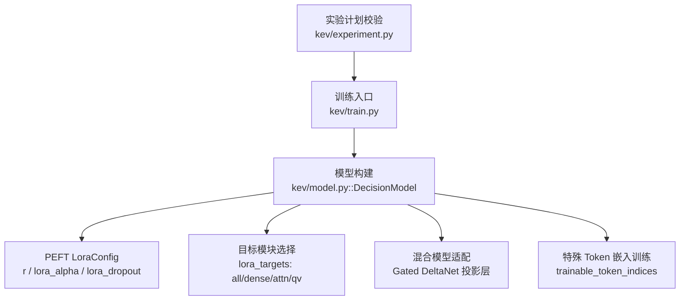
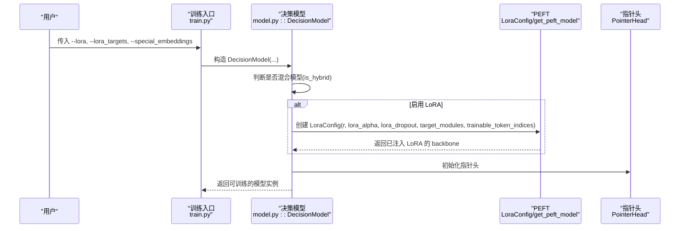
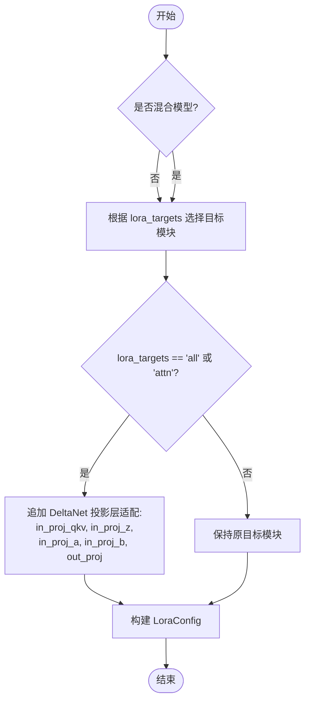
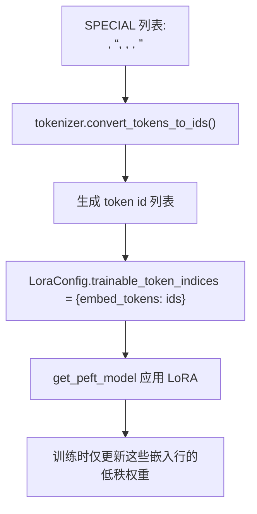
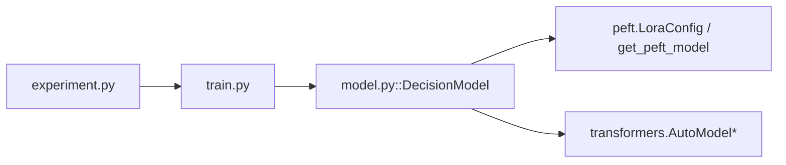

# LoRA 配置管理

<cite>
**本文引用的文件**   
- [model.py](file://kev/model.py)
- [train.py](file://kev/train.py)
- [experiment.py](file://kev/experiment.py)
</cite>

## 目录
1. [引言](#引言)
2. [项目结构](#项目结构)
3. [核心组件](#核心组件)
4. [架构总览](#架构总览)
5. [详细组件分析](#详细组件分析)
6. [依赖关系分析](#依赖关系分析)
7. [性能与调优建议](#性能与调优建议)
8. [故障排除指南](#故障排除指南)
9. [结论](#结论)
10. [附录：LoRA 基础概念](#附录lora-基础概念)

## 引言
本文面向 Kev 中的 LoRA 配置管理系统，系统性解释以下主题：
- lora_targets 参数如何决定适配策略（all、dense、attn、qv）及其对模型性能的影响。
- 混合注意力模型（Gated DeltaNet）的特殊处理逻辑：自动识别并追加投影层适配（in_proj_qkv、in_proj_z、in_proj_a、in_proj_b）。
- trainable_token_indices 机制：如何让特殊分隔符的嵌入向量参与训练，包括 SPECIAL token 列表与 ID 映射过程。
- PEFT LoraConfig 的关键超参数 r、lora_alpha、lora_dropout 的默认值与调优建议。
- 不同配置下的模型初始化流程说明，以及初学者入门与专家级优化/排错指南。

## 项目结构
Kev 中与 LoRA 配置直接相关的代码集中在三个文件中：
- kev/model.py：定义决策模型 DecisionModel，封装 LoRA 注入、混合模型检测、特殊 token 嵌入训练开关等。
- kev/train.py：训练入口与命令行参数，包含 lora、lora_targets、special_embeddings 等选项。
- kev/experiment.py：实验计划验证器，约束可调节的 LoRA 相关超参范围与取值集合。

图表来源
- [train.py:370-439](file://kev/train.py#L370-L439)
- [model.py:243-276](file://kev/model.py#L243-L276)
- [experiment.py:47-49](file://kev/experiment.py#L47-L49)

章节来源
- [train.py:370-439](file://kev/train.py#L370-L439)
- [model.py:243-276](file://kev/model.py#L243-L276)
- [experiment.py:47-49](file://kev/experiment.py#L47-L49)

## 核心组件
- DecisionModel：封装基座模型的加载、LoRA 注入、指针头、推理缓存等；是 LoRA 配置落地的关键位置。
- LoraConfig：来自 PEFT，用于声明 LoRA 秩、缩放因子、丢弃率、目标模块和可训练 token 索引等。
- 训练参数：--lora、--lora_targets、--special_embeddings 等通过 train.py 暴露给使用者。
- 实验计划：experiment.py 限定 lora_targets 的可选项为 all、dense、attn、qv，并提供默认值。

章节来源
- [model.py:243-276](file://kev/model.py#L243-L276)
- [train.py:370-439](file://kev/train.py#L370-L439)
- [experiment.py:47-49](file://kev/experiment.py#L47-L49)

## 架构总览
下图展示从训练入口到 LoRA 配置注入的整体流程：

图表来源
- [train.py:523-544](file://kev/train.py#L523-L544)
- [model.py:243-276](file://kev/model.py#L243-L276)

## 详细组件分析

### lora_targets 适配策略与影响
lora_targets 控制 LoRA 的目标模块集合，直接影响可训练参数规模、迁移能力与过拟合风险。

- all：对所有注意力与 MLP 投影层应用 LoRA，覆盖 q_proj、k_proj、v_proj、o_proj、gate_proj、up_proj、down_proj。
- dense：与 all 相同的目标集，但在混合模型上会排除 DeltaNet 投影层，避免对循环注意力进行 LoRA 适配。
- attn：仅对注意力投影层 q_proj、k_proj、v_proj、o_proj 应用 LoRA。
- qv：仅对 q_proj、v_proj 应用 LoRA，进一步减少参数。

在混合模型（Gated DeltaNet）场景下，若 lora_targets 为 all 或 attn，系统会自动追加 DeltaNet 投影层的适配：in_proj_qkv、in_proj_z、in_proj_a、in_proj_b，以及 out_proj。这样确保混合注意力的关键路径也能被 LoRA 微调。

图表来源
- [model.py:265-275](file://kev/model.py#L265-L275)

章节来源
- [model.py:265-275](file://kev/model.py#L265-L275)
- [train.py:398-398](file://kev/train.py#L398-L398)
- [experiment.py:47-49](file://kev/experiment.py#L47-L49)

### 混合注意力模型的特殊处理逻辑
混合模型由 is_hybrid(config) 判定，依据是配置中是否存在线性注意力类型（例如 Qwen3.5 的 Gated DeltaNet）。当检测到混合模型且 lora_targets 为 all 或 attn 时，系统自动追加以下投影层名称以纳入 LoRA 适配：
- in_proj_qkv
- in_proj_z
- in_proj_a
- in_proj_b
- out_proj

该逻辑保证混合注意力的关键变换路径同样具备低秩更新能力，从而在保留块因果掩码限制的同时，允许 DeltaNet 的循环状态得到更充分的微调。

章节来源
- [model.py:69-73](file://kev/model.py#L69-L73)
- [model.py:265-275](file://kev/model.py#L265-L275)

### trainable_token_indices 机制与 SPECIAL token
当 special_embeddings=True 时，系统将 5 个特殊分隔符 token 的嵌入向量加入 LoRA 的可训练集合。SPECIAL 列表定义为：
- "<state>"
- "<q>"
- "<opt>"
- "</opt>"
- "<decide>"

这些 token 在编码过程中作为结构化分隔符使用，用于区分状态、问题指令、选项边界与决策标记。通过将它们的 token id 映射到 trainable_token_indices.embed_tokens，LoRA 可以调整这些分隔符的嵌入表示，从而让模型更好地学习任务特定的分隔语义。

ID 映射过程：
- 使用 tokenizer.convert_tokens_to_ids(t) 将每个 SPECIAL token 转换为对应的整数 id。
- 将这些 id 放入 {"embed_tokens": [id_1, id_2, ...]} 结构中，作为 LoraConfig.trainable_token_indices 的值。
- 最终由 get_peft_model 应用 LoRA 时，仅对这些嵌入行进行低秩更新。

图表来源
- [model.py:9-11](file://kev/model.py#L9-L11)
- [model.py:265-275](file://kev/model.py#L265-L275)

章节来源
- [model.py:9-11](file://kev/model.py#L9-L11)
- [model.py:265-275](file://kev/model.py#L265-L275)

### PEFT LoraConfig 超参数与默认值
- r（秩）：通过 --lora 传入，默认值为 16。它控制低秩矩阵的维度，越大表达能力越强但参数越多。
- lora_alpha（缩放因子）：默认设置为 2 * lora，即 32（当 r=16）。它与 r 共同决定 LoRA 更新的尺度。
- lora_dropout（丢弃率）：固定为 0.05，用于正则化 LoRA 分支，防止过拟合。
- task_type：固定为 FEATURE_EXTRACTION，因为 Kev 不生成文本，而是提取隐藏表示用于决策头。
- target_modules：由 lora_targets 决定，见上文“适配策略”。
- trainable_token_indices：当 special_embeddings=True 时启用，见上文“SPECIAL token 机制”。

章节来源
- [model.py:265-275](file://kev/model.py#L265-L275)
- [train.py:377-378](file://kev/train.py#L377-L378)
- [train.py:396-398](file://kev/train.py#L396-L398)

### 模型初始化流程示例（按配置分类）
以下为不同配置下的初始化要点说明（不直接展示代码内容，仅提供路径参考）：

- 全量 LoRA（all）：
  - 设置 --lora 16 --lora_targets all
  - DecisionModel 将 q_proj/k_proj/v_proj/o_proj/gate_proj/up_proj/down_proj 注入 LoRA
  - 若为混合模型，自动追加 DeltaNet 投影层适配
  - 参考路径：[model.py:265-275](file://kev/model.py#L265-L275), [train.py:542-544](file://kev/train.py#L542-L544)

- 仅注意力 LoRA（attn）：
  - 设置 --lora 16 --lora_targets attn
  - 仅对 q_proj/k_proj/v_proj/o_proj 注入 LoRA
  - 若为混合模型，自动追加 DeltaNet 投影层适配
  - 参考路径：[model.py:265-275](file://kev/model.py#L265-L275), [train.py:542-544](file://kev/train.py#L542-L544)

- 仅 Q/V 投影 LoRA（qv）：
  - 设置 --lora 16 --lora_targets qv
  - 仅对 q_proj/v_proj 注入 LoRA
  - 混合模型不会追加 DeltaNet 投影层（因为 lora_targets 不是 all/attn）
  - 参考路径：[model.py:265-275](file://kev/model.py#L265-L275), [train.py:542-544](file://kev/train.py#L542-L544)

- 开启特殊 token 嵌入训练：
  - 设置 --special_embeddings 1
  - 将 5 个 SPECIAL token 的嵌入行加入 LoRA 可训练集合
  - 参考路径：[model.py:9-11](file://kev/model.py#L9-L11), [model.py:265-275](file://kev/model.py#L265-L275), [train.py:396-396](file://kev/train.py#L396-L396)

章节来源
- [model.py:265-275](file://kev/model.py#L265-L275)
- [train.py:396-398](file://kev/train.py#L396-L398)
- [train.py:542-544](file://kev/train.py#L542-L544)

## 依赖关系分析
- train.py 负责解析命令行参数并将 lora、lora_targets、special_embeddings 等传递给 DecisionModel。
- model.py 内部依赖 transformers.AutoModel/AutoModelForCausalLM 加载基座模型，并使用 peft.LoraConfig 与 get_peft_model 注入 LoRA。
- experiment.py 提供实验计划的白名单校验，确保 lora_targets 只能取 all、dense、attn、qv，并提供默认值。

图表来源
- [train.py:523-544](file://kev/train.py#L523-L544)
- [model.py:243-276](file://kev/model.py#L243-L276)
- [experiment.py:47-49](file://kev/experiment.py#L47-L49)

章节来源
- [train.py:523-544](file://kev/train.py#L523-L544)
- [model.py:243-276](file://kev/model.py#L243-L276)
- [experiment.py:47-49](file://kev/experiment.py#L47-L49)

## 性能与调优建议
- r（秩）：
  - 默认 16。较小 r（如 8）适合数据有限、易过拟合的场景；较大 r（如 32）适合需要更强表达能力的任务，但会增加显存与计算开销。
- lora_alpha（缩放因子）：
  - 默认 2 * r。增大 alpha 可放大 LoRA 更新幅度，有助于快速收敛，但也可能破坏预训练知识；建议与 lr 协同搜索。
- lora_dropout：
  - 固定 0.05。若出现明显过拟合，可在不影响 PEFT 接口的前提下考虑适度提高（需确认下游兼容性）。
- lora_targets：
  - all：参数最多，迁移能力强，但可能引入更多漂移。
  - dense：在混合模型上排除 DeltaNet 投影层，适合希望保留循环注意力稳定性的场景。
  - attn：聚焦注意力路径，通常能平衡性能与参数规模。
  - qv：最小参数集，适合快速探索或资源受限环境。
- special_embeddings：
  - 仅在需要让分隔符嵌入参与训练时开启。一般任务中关闭可减少参数与潜在噪声。

[本节为通用指导，不直接分析具体文件]

## 故障排除指南
- 混合模型报错 option_isolation：
  - 现象：在混合模型上启用 option_isolation 会抛出错误。
  - 原因：混合模型无法支持打包掩码所需的 option_isolation 模式。
  - 解决：关闭 option_isolation 或在非混合模型上使用。
  - 参考路径：[model.py:259-264](file://kev/model.py#L259-L264)

- pass_tokens_max 与注意力-only 基座冲突：
  - 现象：对注意力-only 基座启用 --pass_tokens_max 会退出。
  - 原因：pass_tokens_max 针对的是行形式或共享前缀的计算成本，而注意力-only 基座运行打包掩码，无法准确测量。
  - 解决：使用混合模型（Gated DeltaNet）或移除 --pass_tokens_max。
  - 参考路径：[train.py:557-561](file://kev/train.py#L557-L561)

- full_ft 与 special_embeddings 互斥：
  - 现象：full_ft=1 且 special_embeddings=1 时报错。
  - 原因：full_ft 训练 bf16 权重，所有嵌入已经参与训练，无需额外特殊嵌入训练。
  - 解决：关闭 special_embeddings 或改用 LoRA。
  - 参考路径：[train.py:460-461](file://kev/train.py#L460-L461)

- lora_targets 非法值：
  - 现象：实验计划中设置不在允许集合内的 lora_targets。
  - 原因：experiment.py 校验 CHOICES 白名单。
  - 解决：仅使用 all、dense、attn、qv。
  - 参考路径：[experiment.py:47-49](file://kev/experiment.py#L47-L49)

章节来源
- [model.py:259-264](file://kev/model.py#L259-L264)
- [train.py:460-461](file://kev/train.py#L460-L461)
- [train.py:557-561](file://kev/train.py#L557-L561)
- [experiment.py:47-49](file://kev/experiment.py#L47-L49)

## 结论
Kev 的 LoRA 配置系统在 DecisionModel 中集中实现，通过 lora_targets 灵活选择适配策略，并在混合模型上自动追加 DeltaNet 投影层适配，确保关键路径可被低秩更新。trainable_token_indices 机制允许特殊分隔符嵌入参与训练，增强结构化 token 的任务特定表示。PEFT LoraConfig 的 r、lora_alpha、lora_dropout 提供了可控的超参空间，配合 train.py 与 experiment.py 的参数校验，形成稳健的训练管线。对于初学者，可从 attn 或 qv 起步，逐步探索 all/dense；对于专家，可结合任务特性与资源约束精细调优 r、alpha、dropout 与目标模块集合。

[本节为总结性内容，不直接分析具体文件]

## 附录：LoRA 基础概念
- LoRA（Low-Rank Adaptation）通过在预训练模型权重旁路添加低秩矩阵，仅训练少量参数即可实现高效微调。
- r 控制低秩矩阵的秩，越大表达能力越强但参数越多。
- lora_alpha 控制 LoRA 更新的缩放比例，常与 r 一起调节。
- lora_dropout 对 LoRA 分支进行随机失活，提升泛化能力。
- target_modules 指定哪些层应用 LoRA，常见于注意力与 MLP 投影层。
- trainable_token_indices 允许对特定 token 的嵌入行进行低秩更新，常用于任务特定的分隔符或特殊标记。

[本节为概念性内容，不直接分析具体文件]