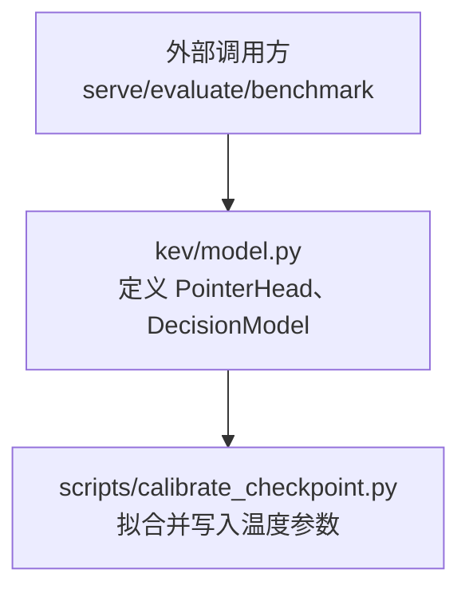
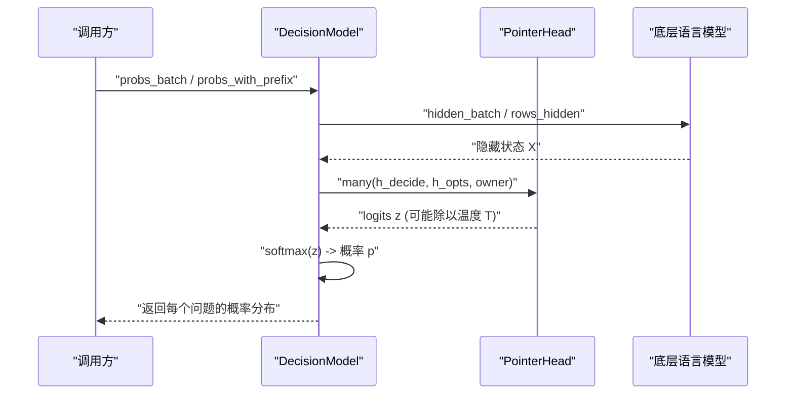
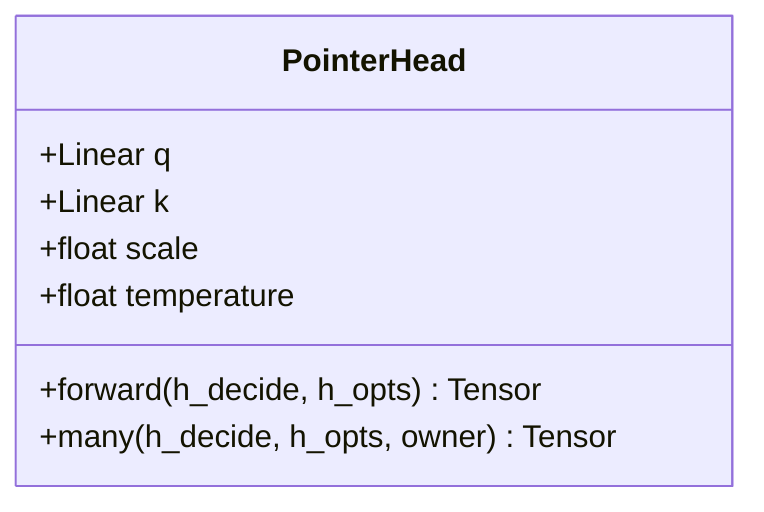
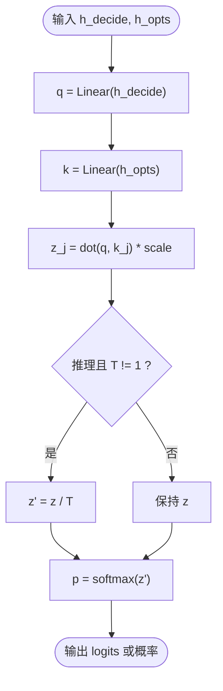
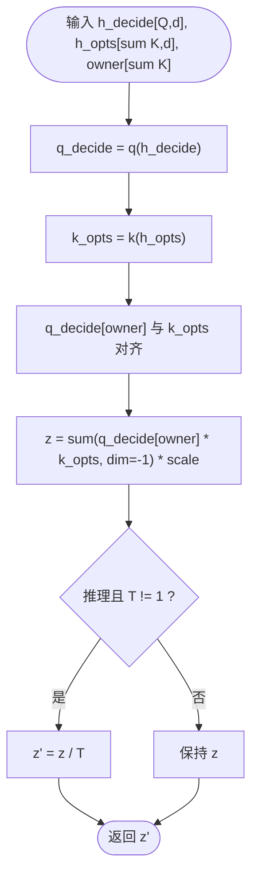
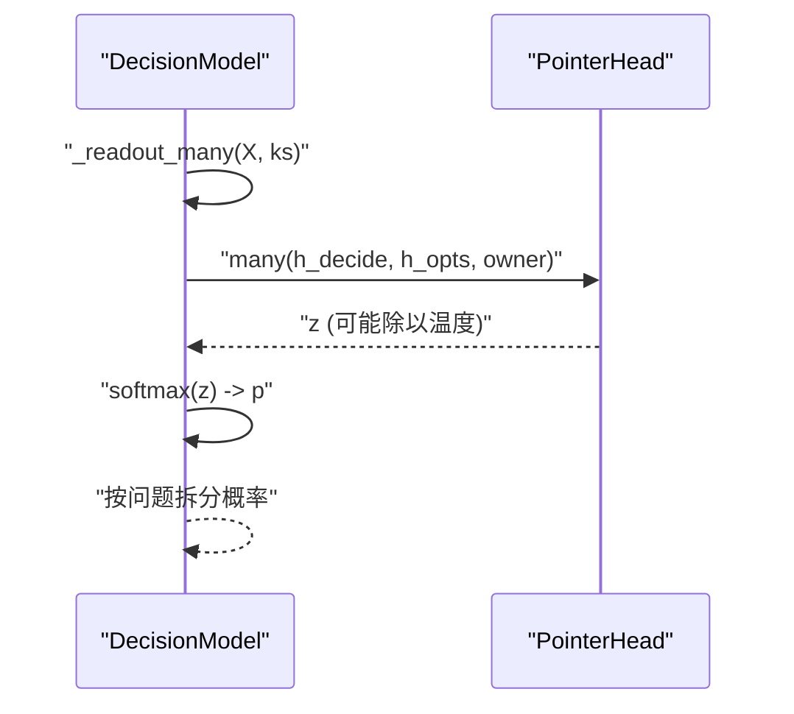
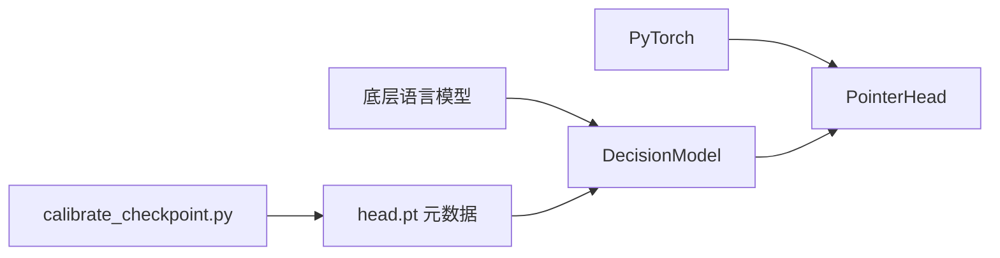
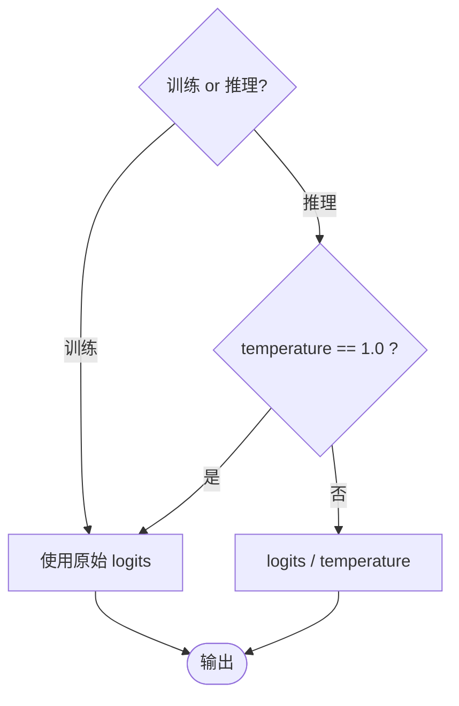

<cite>
**本文引用的文件**   
- [model.py](file://kev/model.py)
- [calibrate_checkpoint.py](file://scripts/calibrate_checkpoint.py)
</cite>

## 目录
1. [简介](#简介)
2. [项目结构](#项目结构)
3. [核心组件](#核心组件)
4. [架构总览](#架构总览)
5. [详细组件分析](#详细组件分析)
6. [依赖关系分析](#依赖关系分析)
7. [性能与批量优化](#性能与批量优化)
8. [训练与推理行为差异](#训练与推理行为差异)
9. [数学原理说明](#数学原理说明)
10. [使用示例与概率校准](#使用示例与概率校准)
11. [故障排查指南](#故障排查指南)
12. [结论](#结论)

## 简介
本文件面向“指针头解码器”（PointerHead）的技术文档，聚焦以下目标：
- 解释 PointerHead 如何通过查询向量 h_decide 与键向量 h_opts 的相似度计算选择最佳选项。
- 详细说明温度缩放（temperature scaling）机制：在推理时对 logits 进行校准，提高概率估计的准确性。
- 解释批量处理优化：many() 方法如何实现多问题的并行解码，避免循环开销。
- 文档化训练与推理模式下的不同行为：训练时使用原始 logits，推理时应用温度参数。
- 提供点积相似度的数学公式与 softmax 概率分布生成过程。
- 给出初学者友好的概念解释，并为专家提供调优建议与性能优化策略。

## 项目结构
与指针头解码器直接相关的代码位于模型模块中，温度校准脚本位于 scripts 目录。

图表来源
- [model.py:205-223](file://kev/model.py#L205-L223)
- [calibrate_checkpoint.py:1-32](file://scripts/calibrate_checkpoint.py#L1-L32)

章节来源
- [model.py:205-223](file://kev/model.py#L205-L223)
- [calibrate_checkpoint.py:1-32](file://scripts/calibrate_checkpoint.py#L1-L32)

## 核心组件
- PointerHead：实现基于查询-键相似度的选项评分，支持单问题 forward 与批量 many 两种接口；内置温度缩放开关。
- DecisionModel：封装底层语言模型与 PointerHead，负责编码、掩码、批处理与概率输出；内部通过 _readout_many 调用 head.many 完成高效解码。

章节来源
- [model.py:205-223](file://kev/model.py#L205-L223)
- [model.py:494-505](file://kev/model.py#L494-L505)

## 架构总览
下图展示从输入编码到选项概率输出的整体流程，以及温度缩放在推理路径中的位置。

图表来源
- [model.py:389-394](file://kev/model.py#L389-L394)
- [model.py:494-505](file://kev/model.py#L494-L505)
- [model.py:216-223](file://kev/model.py#L216-L223)

## 详细组件分析

### PointerHead 类设计
PointerHead 的核心思想是将“决策位置”的隐藏向量作为查询 q，将“候选选项”的隐藏向量集合作为键 k，通过线性投影后做点积相似度，得到每个选项的未归一化分数（logits）。

关键要点
- 维度控制：dp 为指针维度，决定 q/k 投影后的表示能力。
- 缩放因子：scale = 1/sqrt(dp)，用于稳定点积相似度。
- 温度参数：temperature 仅在推理（eval）且不为 1.0 时作用于 logits。
- 两个接口：
  - forward：单问题，形状 [d] 与 [K,d] 产生 [K] 的 logits。
  - many：批量问题，形状 [Q,d] 与 [sum K,d] 产生 [sum K] 的 logits，按 owner 映射回每个问题。

图表来源
- [model.py:205-223](file://kev/model.py#L205-L223)

章节来源
- [model.py:205-223](file://kev/model.py#L205-L223)

### 相似度计算与选项选择
- 查询向量：h_decide 是“决策位置”的隐藏表示。
- 键向量：h_opts 是“候选选项”的隐藏表示集合。
- 相似度：对每个选项 j，计算 q(h_decide) 与 k(h_opts[j]) 的点积，再乘以缩放因子 scale，得到第 j 个选项的 logits。
- 选择策略：argmax(logits) 即为最可能的选项；若需要概率，则对 logits 做 softmax。

图表来源
- [model.py:216-223](file://kev/model.py#L216-L223)

章节来源
- [model.py:216-223](file://kev/model.py#L216-L223)

### 批量处理优化 many()
many() 的设计目标是“一次前向覆盖多个问题”，避免逐问题循环带来的 Python 层开销与设备同步。其核心思路：
- 将多个问题的 h_decide 堆叠为 [Q,d]。
- 将所有问题的 h_opts 拼接为 [sum K,d]。
- 使用 owner 数组将每个选项映射回对应的问题索引。
- 通过广播与求和一次性计算所有选项的相似度，得到 [sum K] 的 logits。
- 上层再将 logits 重组并按问题拆分，最后做 softmax。

图表来源
- [model.py:219-223](file://kev/model.py#L219-L223)

章节来源
- [model.py:219-223](file://kev/model.py#L219-L223)

### 与 DecisionModel 的集成
DecisionModel 负责：
- 编码输入记录，生成隐藏状态。
- 根据是否混合架构或序列长度选择行式或打包掩码路径。
- 通过 _readout_many 调用 head.many，将 logits 转换为概率。

图表来源
- [model.py:494-505](file://kev/model.py#L494-L505)
- [model.py:219-223](file://kev/model.py#L219-L223)

章节来源
- [model.py:494-505](file://kev/model.py#L494-L505)
- [model.py:219-223](file://kev/model.py#L219-L223)

## 依赖关系分析
- PointerHead 依赖 PyTorch 的 Linear 与张量运算。
- DecisionModel 依赖底层语言模型（如 Qwen3.5 等），并根据架构特性选择行式或打包掩码路径。
- 温度校准脚本 calibrate_checkpoint.py 读取/写入 checkpoint 元数据中的 temperature，确保推理默认使用校准后的概率。

图表来源
- [model.py:205-223](file://kev/model.py#L205-L223)
- [model.py:494-505](file://kev/model.py#L494-L505)
- [calibrate_checkpoint.py:141-157](file://scripts/calibrate_checkpoint.py#L141-L157)

章节来源
- [model.py:205-223](file://kev/model.py#L205-L223)
- [model.py:494-505](file://kev/model.py#L494-L505)
- [calibrate_checkpoint.py:141-157](file://scripts/calibrate_checkpoint.py#L141-L157)

## 性能与批量优化
- many() 的优势：
  - 减少 Python 层循环开销。
  - 利用矩阵乘法与广播一次性计算相似度。
  - 降低设备同步次数，提升吞吐。
- 适用场景：
  - 服务批次（serving batches）中同时解码多个问题。
  - 评估脚本中对大量记录的批量打分。
- 注意事项：
  - owner 数组需正确映射每个选项到对应问题。
  - 当选项数量差异较大时，注意内存占用与 padding 的影响。

章节来源
- [model.py:219-223](file://kev/model.py#L219-L223)
- [model.py:494-505](file://kev/model.py#L494-L505)

## 训练与推理行为差异
- 训练模式（training=True）：
  - 不应用温度缩放，直接使用原始 logits。
  - 有利于梯度稳定与损失计算。
- 推理模式（eval 且 temperature != 1.0）：
  - 对 logits 除以温度 T，使概率分布更平滑或更尖锐。
  - argmax 不变，但概率估计更校准，有助于可靠性指标（如 ECE）。

图表来源
- [model.py:216-223](file://kev/model.py#L216-L223)

章节来源
- [model.py:216-223](file://kev/model.py#L216-L223)

## 数学原理说明
- 点积相似度：
  - 设 q = W_q · h_decide，k_j = W_k · h_opts[j]。
  - 相似度 s_j = q^T · k_j。
  - 缩放后 z_j = s_j / sqrt(dp)。
- 温度缩放：
  - 推理时 z'_j = z_j / T。
  - T > 1 使分布更平滑；T < 1 使分布更尖锐。
- 概率分布：
  - p_j = exp(z'_j) / sum_k(exp(z'_k))。

这些公式在 forward 与 many 中分别以标量与向量形式实现，最终由 softmax 生成概率。

章节来源
- [model.py:216-223](file://kev/model.py#L216-L223)

## 使用示例与概率校准
- 使用指针头进行选项选择：
  - 准备 h_decide 与 h_opts。
  - 调用 forward（单问题）或 many（批量）。
  - 对输出 logits 做 softmax 得到概率。
  - 取 argmax 得到最佳选项。
- 概率校准：
  - 使用 calibrate_checkpoint.py 在保留数据集上拟合温度 T。
  - 将 T 写入 checkpoint 的 head.pt 元数据。
  - 推理时自动应用 T，无需手动修改代码。

章节来源
- [model.py:216-223](file://kev/model.py#L216-L223)
- [calibrate_checkpoint.py:1-32](file://scripts/calibrate_checkpoint.py#L1-L32)
- [calibrate_checkpoint.py:141-157](file://scripts/calibrate_checkpoint.py#L141-L157)

## 故障排查指南
- 概率不准确或置信度偏高：
  - 检查是否已拟合温度 T，并确保推理模式启用温度缩放。
  - 确认 head.pt 中 temperature 值合理。
- 批量解码结果错位：
  - 检查 owner 数组是否正确映射每个选项到对应问题。
  - 确认 starts 与 slot 的计算逻辑一致。
- 训练不稳定：
  - 确认训练模式下未应用温度缩放。
  - 检查 dp 维度是否过大导致数值不稳定。

章节来源
- [model.py:216-223](file://kev/model.py#L216-L223)
- [model.py:494-505](file://kev/model.py#L494-L505)
- [calibrate_checkpoint.py:141-157](file://scripts/calibrate_checkpoint.py#L141-L157)

## 结论
PointerHead 通过简洁而高效的查询-键相似度机制实现选项选择，结合温度缩放提升推理时的概率校准质量。many() 方法显著优化了批量解码的性能，适用于服务与评估场景。建议在部署前使用保留数据集拟合温度，并在推理中启用温度缩放以获得更可靠的概率估计。对于大规模任务，应关注 owner 映射的正确性与内存占用，必要时调整 dp 与 batch size 以平衡精度与效率。