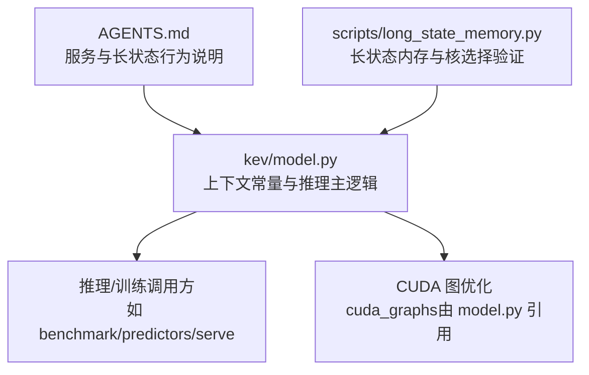
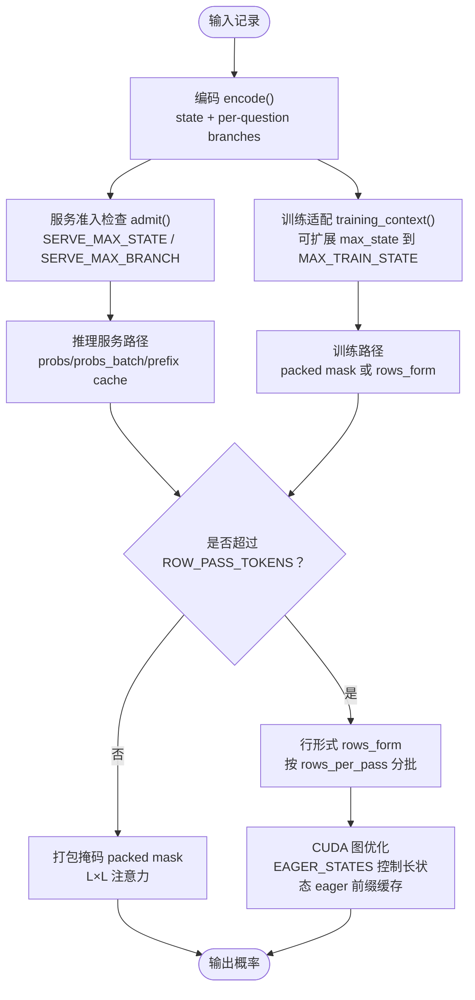
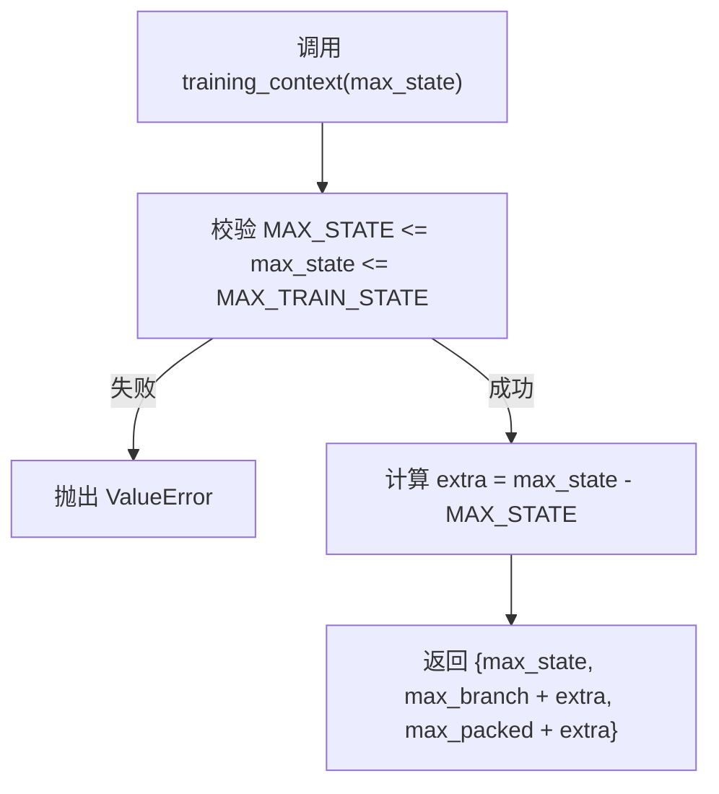
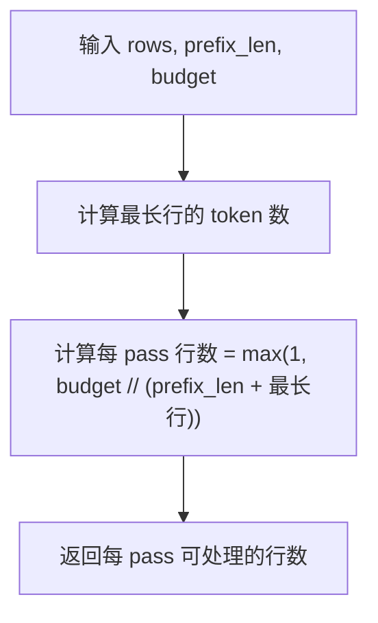
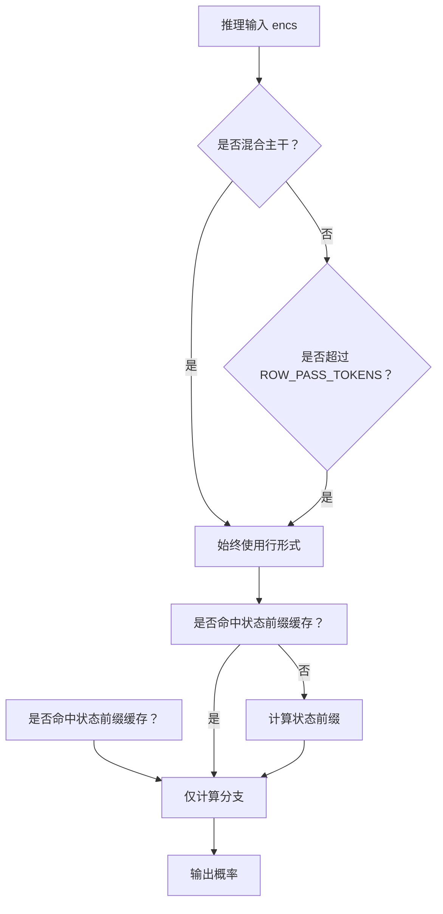
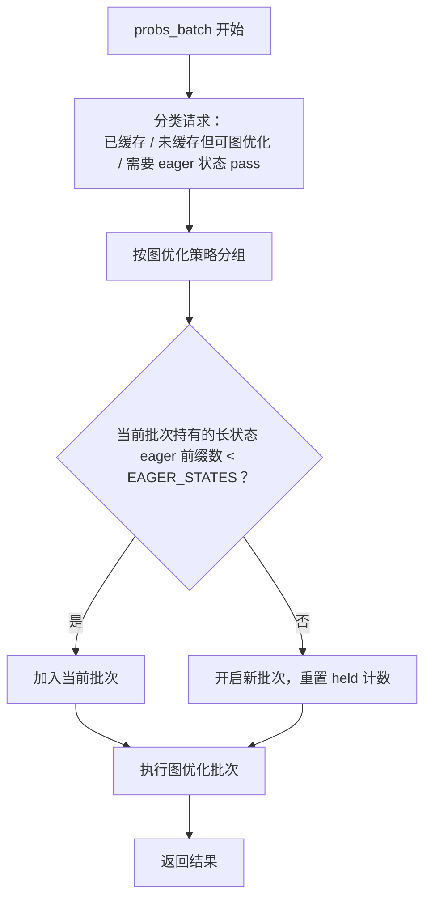
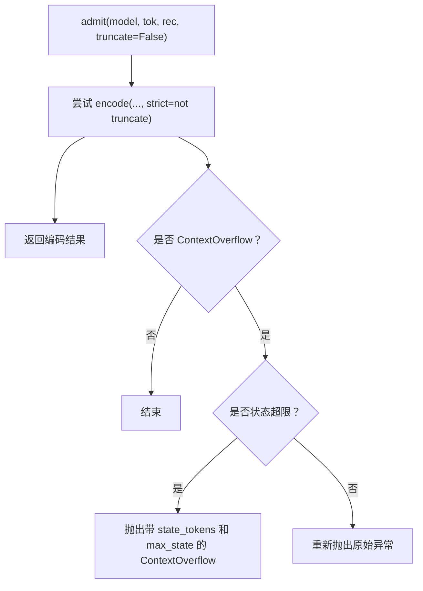
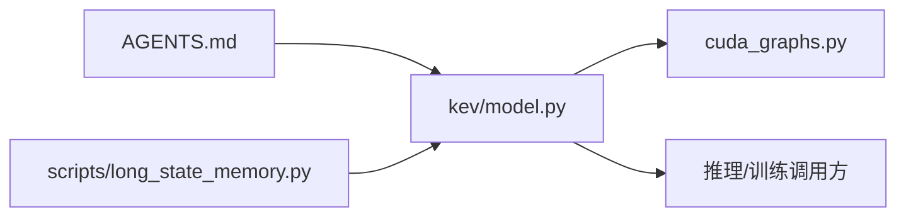

# 上下文管理与长度限制

<cite>
**本文引用的文件**   
- [kev/model.py](file://kev/model.py)
- [AGENTS.md](file://AGENTS.md)
- [scripts/long_state_memory.py](file://scripts/long_state_memory.py)
</cite>

## 目录
1. [引言](#引言)
2. [项目结构](#项目结构)
3. [核心组件](#核心组件)
4. [架构总览](#架构总览)
5. [详细组件分析](#详细组件分析)
6. [依赖关系分析](#依赖关系分析)
7. [性能与内存考量](#性能与内存考量)
8. [故障排查指南](#故障排查指南)
9. [结论](#结论)
10. [附录：配置示例与调优建议](#附录配置示例与调优建议)

## 引言
本文聚焦 Kev 决策模型中的“上下文管理”与“长度限制”，解释以下关键设计点：
- 训练上下文上限、推理服务上限、打包记录上限之间的关系。
- `training_context()` 如何动态扩展训练上下文，以支持更大状态长度。
- `rows_per_pass()` 的批处理策略：在固定 token 预算下，如何在内存限制内合理分配推理请求，平衡吞吐量和延迟。
- `ROW_PASS_TOKENS` 阈值的作用：何时从“打包掩码”路径切换到“行形式”路径。
- `EAGER_STATES` 在 CUDA 图优化中的作用：控制长状态的 eagerly 前缀缓存数量。
- 面向初学者的概念说明，以及面向专家的内存优化与性能调优建议。

## 项目结构
Kev 的上下文与长度限制主要定义在模型模块中，并在推理、训练与服务路径中被多处引用。与本文相关的核心文件包括：
- `kev/model.py`：定义所有上下文常量、编码与推理主逻辑。
- `AGENTS.md`：对服务上下文、CUDA 行为、长状态行为进行工程化说明。
- `scripts/long_state_memory.py`：用于验证长状态下的注意力内核选择、显存占用与数值一致性。

图表来源
- [kev/model.py:12-28](file://kev/model.py#L12-L28)
- [AGENTS.md:311-332](file://AGENTS.md#L311-L332)
- [scripts/long_state_memory.py:1-17](file://scripts/long_state_memory.py#L1-L17)

章节来源
- [kev/model.py:12-28](file://kev/model.py#L12-L28)
- [AGENTS.md:311-332](file://AGENTS.md#L311-L332)

## 核心组件
本节梳理与上下文管理直接相关的关键常量与函数：
- 训练上下文限制：`MAX_STATE`、`MAX_BRANCH`、`MAX_PACKED`
- 推理服务上下文限制：`SERVE_MAX_STATE`、`SERVE_MAX_BRANCH`、`SERVE_MAX_PACKED`
- 训练最大状态上限：`MAX_TRAIN_STATE`
- 行形式切换阈值：`ROW_PASS_TOKENS`
- 长状态 eager 前缀缓存上限：`EAGER_STATES`
- 动态训练上下文构造：`training_context(max_state)`
- 每 pass 行数计算：`rows_per_pass(rows, prefix_len=0, budget=ROW_PASS_TOKENS)`

这些常量共同构成“训练可接受范围”和“服务可接受范围”的两层约束，并通过 `training_context()` 将训练时的状态上限扩展到服务上限，同时保持每个问题的分支 token 预算不变。

章节来源
- [kev/model.py:12-28](file://kev/model.py#L12-L28)
- [kev/model.py:31-47](file://kev/model.py#L31-L47)

## 架构总览
下图展示 Kev 在“训练”和“推理服务”两条路径上如何使用上下文长度限制：

图表来源
- [kev/model.py:31-47](file://kev/model.py#L31-L47)
- [kev/model.py:130-143](file://kev/model.py#L130-L143)
- [kev/model.py:329-333](file://kev/model.py#L329-L333)
- [kev/model.py:464-492](file://kev/model.py#L464-L492)

## 详细组件分析

### 上下文长度限制常量与设计考虑
- `MAX_STATE = 384`：默认训练状态长度上限。
- `MAX_BRANCH = 1024`：默认训练时单个问题分支的长度上限。
- `MAX_PACKED = 2048`：默认训练时打包记录的总长度上限。
- `SERVE_MAX_STATE = 65536`：推理服务允许的最大状态长度。
- `SERVE_MAX_BRANCH = SERVE_MAX_STATE + 8192`：推理服务允许的状态加一个问题的分支总长度上限。
- `SERVE_MAX_PACKED = SERVE_MAX_STATE + SERVE_MAX_BRANCH`：推理服务允许的打包记录总长度上限。
- `MAX_TRAIN_STATE = SERVE_MAX_STATE`：训练允许的最大状态长度与服务一致，保证训练数据可以覆盖服务场景。
- `ROW_PASS_TOKENS = 16384`：决定推理时是否使用“行形式”路径；超过该阈值的记录使用更省内存的行形式。
- `EAGER_STATES = 4`：在 CUDA 图优化中，一次批量运行最多持有 4 个长状态的 eagerly 前缀缓存。

这些常量的相互关系如下：
- 训练侧通过 `training_context()` 把 `max_state` 从默认 384 提升到任意合法值，直到 `MAX_TRAIN_STATE`。
- 推理侧通过 `admit()` 强制使用 `SERVE_MAX_STATE` 与 `SERVE_MAX_BRANCH`，防止超长状态进入服务。
- 推理路径根据 `ROW_PASS_TOKENS` 自动切换为“行形式”，避免 L×L 掩码导致的显存爆炸。
- CUDA 图优化通过 `EAGER_STATES` 控制长状态 eager 前缀缓存的数量，避免一次性持有过多 KV 状态。

章节来源
- [kev/model.py:12-28](file://kev/model.py#L12-L28)
- [AGENTS.md:311-332](file://AGENTS.md#L311-L332)

### `training_context()`：动态调整训练上下文
`training_context(max_state)` 的核心作用是：
- 校验 `max_state` 是否在 `[MAX_STATE, MAX_TRAIN_STATE]` 范围内。
- 计算额外状态长度 `extra = max_state - MAX_STATE`。
- 返回新的训练上下文：
  - `max_state`：用户指定的状态上限。
  - `max_branch`：`MAX_BRANCH + extra`，保证每个问题的分支预算随状态增长而等量增长。
  - `max_packed`：`MAX_PACKED + extra`，保证打包记录总长度也随状态增长而等量增长。

这种设计的意义在于：
- 训练时可以支持更大的状态长度，从而适应包含更长文档的数据集。
- 同时保持“每个问题的分支 token 预算”不变，避免只扩大状态却破坏问题结构的语义预算。
- 训练上限被限制在服务上限 `MAX_TRAIN_STATE`，确保训练数据不会超出服务可接受的上下文范围。

图表来源
- [kev/model.py:31-38](file://kev/model.py#L31-L38)

章节来源
- [kev/model.py:31-38](file://kev/model.py#L31-L38)

### `rows_per_pass()`：批处理策略与内存控制
`rows_per_pass(rows, prefix_len=0, budget=ROW_PASS_TOKENS)` 的计算方式是：
- 每个行携带的 token 数近似为 `prefix_len + len(row)`。
- 每 pass 能容纳的行数为 `max(1, budget // (prefix_len + max(len(r) for r in rows)))`。
- 至少返回 1，保证即使预算不足也能处理一行。

该函数的设计目标：
- 在固定 token 预算 `budget` 下，控制单次前向传播的内存峰值。
- 因为各行独立，答案不依赖于具体分块方式，所以可以安全地分批处理大量问题。
- 当存在共享状态前缀时，`prefix_len` 会显著影响每 pass 的行数，从而在“吞吐量”和“延迟”之间取得平衡。

图表来源
- [kev/model.py:41-47](file://kev/model.py#L41-L47)

章节来源
- [kev/model.py:41-47](file://kev/model.py#L41-L47)

### `ROW_PASS_TOKENS`：行形式与打包形式的切换阈值
`ROW_PASS_TOKENS = 16384` 是推理路径的重要开关：
- 对于注意力-only 主干，如果打包序列长度超过该阈值，则使用“行形式”。
- 行形式会为每个问题构建独立的因果行，避免 L×L 掩码带来的无界显存增长。
- 混合主干（例如 Qwen3.5 的 Gated DeltaNet）始终走行形式，因为其循环层无法正确遵循打包掩码。

此外，服务路径还会根据是否命中状态前缀缓存，选择不同的执行方式：
- 未命中：先计算状态前缀，再计算问题分支。
- 已命中：只计算问题分支，复用 KV 缓存。

图表来源
- [kev/model.py:329-333](file://kev/model.py#L329-L333)
- [kev/model.py:416-462](file://kev/model.py#L416-L462)

章节来源
- [kev/model.py:329-333](file://kev/model.py#L329-L333)
- [kev/model.py:416-462](file://kev/model.py#L416-L462)

### `EAGER_STATES`：CUDA 图优化中的长状态前缀缓存
在 `DecisionModel.probs_batch()` 中，CUDA 图优化会将一批请求分组执行。对于长状态且未命中缓存的请求，系统会先执行 eager 状态 pass，然后继续执行图优化的行 pass。

`EAGER_STATES = 4` 表示：
- 在一次批量运行中，最多同时持有 4 个长状态的 eagerly 前缀缓存。
- 当达到上限时，系统会开启下一批，避免一次性持有过多 KV 状态导致显存溢出。
- 每个长状态的前缀缓存包含 keys、values 以及 DeltaNet 状态，因此其显存占用不可忽视。

图表来源
- [kev/model.py:232-233](file://kev/model.py#L232-L233)
- [kev/model.py:464-492](file://kev/model.py#L464-L492)

章节来源
- [kev/model.py:232-233](file://kev/model.py#L232-L233)
- [kev/model.py:464-492](file://kev/model.py#L464-L492)

### 服务准入与上下文溢出
服务入口通过 `admit()` 做统一准入检查：
- 使用 `SERVE_MAX_STATE` 和 `SERVE_MAX_BRANCH` 作为严格上限。
- 如果状态超过 `SERVE_MAX_STATE`，会抛出 `ContextOverflow`，并附带实际 token 数和限制值。
- 可通过 `truncate=True` 让服务截断状态，但评估路径通常保持严格模式。

图表来源
- [kev/model.py:130-143](file://kev/model.py#L130-L143)

章节来源
- [kev/model.py:130-143](file://kev/model.py#L130-L143)

## 依赖关系分析
上下文管理涉及的依赖关系如下：
- `model.py` 是核心实现，定义常量、编码、掩码、推理主流程。
- `AGENTS.md` 提供工程层面的行为说明，包括服务上下文、CUDA 行为、长状态行为。
- `scripts/long_state_memory.py` 用于验证长状态下的注意力内核选择和显存行为。
- `cuda_graphs.py` 由 `model.py` 在推理批处理中引用，负责 CUDA 图的捕获与回放。

图表来源
- [kev/model.py:464-492](file://kev/model.py#L464-L492)
- [AGENTS.md:311-332](file://AGENTS.md#L311-L332)
- [scripts/long_state_memory.py:1-17](file://scripts/long_state_memory.py#L1-L17)

章节来源
- [kev/model.py:464-492](file://kev/model.py#L464-L492)
- [AGENTS.md:311-332](file://AGENTS.md#L311-L332)
- [scripts/long_state_memory.py:1-17](file://scripts/long_state_memory.py#L1-L17)

## 性能与内存考量
- 短状态路径：使用打包掩码，适合较短上下文，计算效率高。
- 长状态路径：使用行形式，避免 L×L 掩码显存爆炸，适合 16k 以上状态。
- CUDA 图优化：通过 `EAGER_STATES` 控制长状态 eager 前缀缓存数量，降低峰值显存。
- 行批处理：通过 `rows_per_pass()` 控制每 pass 的行数，平衡吞吐量和延迟。
- 服务上下文：`SERVE_MAX_STATE` 和 `SERVE_MAX_BRANCH` 保证服务稳定性，避免超长请求进入后端。

章节来源
- [kev/model.py:41-47](file://kev/model.py#L41-L47)
- [kev/model.py:329-333](file://kev/model.py#L329-L333)
- [kev/model.py:464-492](file://kev/model.py#L464-L492)
- [AGENTS.md:311-332](file://AGENTS.md#L311-L332)

## 故障排查指南
常见问题与定位方法：
- 状态过长导致 422 错误：检查 `state_tokens` 是否超过 `SERVE_MAX_STATE`。
- 分支过长导致上下文溢出：检查单个问题的分支是否超过 `SERVE_MAX_BRANCH`。
- 训练时报错 `max_state must be in [...]`：确认传入 `training_context()` 的 `max_state` 是否在 `[MAX_STATE, MAX_TRAIN_STATE]` 范围内。
- 长状态显存溢出：检查是否触发行形式路径，并确认 `EAGER_STATES` 是否足够控制 eager 前缀缓存数量。
- CUDA 长状态行为不一致：参考 `scripts/long_state_memory.py` 的验证方式，对比 math、legacy、long、rows 四种模式的显存和时间。

章节来源
- [kev/model.py:31-38](file://kev/model.py#L31-L38)
- [kev/model.py:130-143](file://kev/model.py#L130-L143)
- [scripts/long_state_memory.py:1-17](file://scripts/long_state_memory.py#L1-L17)

## 结论
Kev 的上下文管理通过多层常量与函数协同工作：
- 训练侧通过 `training_context()` 支持更大状态长度，同时保持问题分支预算稳定。
- 推理侧通过 `SERVE_MAX_*` 保证服务稳定性，通过 `ROW_PASS_TOKENS` 自动切换行形式以避免显存爆炸。
- CUDA 图优化通过 `EAGER_STATES` 控制长状态 eager 前缀缓存数量，进一步降低峰值显存。
- `rows_per_pass()` 在固定 token 预算下合理分配推理请求，平衡吞吐量和延迟。

这套设计既照顾了初学者对“上下文长度”的基本理解，也为专家提供了内存优化和性能调优的具体切入点。

## 附录：配置示例与调优建议

### 基础概念
- 状态：模型需要记住的上下文，例如文档内容。
- 分支：每个问题的指令和选项。
- 打包：将状态和多个问题分支合并成一个序列。
- 行形式：将每个问题作为独立因果行处理，避免 L×L 掩码。

### 训练配置示例
- 默认训练上下文：`MAX_STATE=384`，适用于短文档。
- 长文档训练：调用 `training_context(max_state=...)`，将状态上限提升到 `MAX_TRAIN_STATE`，同时按比例增加 `max_branch` 和 `max_packed`。
- 注意事项：
  - `max_state` 不能超过 `MAX_TRAIN_STATE`。
  - 训练数据必须能通过 `admit()` 的服务上下文检查，否则部署后可能不稳定。

### 推理服务配置示例
- 默认服务上下文：`SERVE_MAX_STATE=65536`，`SERVE_MAX_BRANCH=SERVE_MAX_STATE+8192`。
- 超长状态处理：
  - 严格模式：拒绝超长状态，返回 422。
  - 截断模式：设置 `truncate_states=True`，只读取前 `SERVE_MAX_STATE` 个 token。
- 长状态优化：
  - 超过 `ROW_PASS_TOKENS=16384` 的记录自动走行形式。
  - CUDA 图优化通过 `EAGER_STATES=4` 控制长状态 eager 前缀缓存数量。

### 性能调优建议
- 短上下文场景：
  - 使用打包掩码路径，减少 kernel launch 开销。
  - 提高 batch size，提升吞吐量。
- 长上下文场景：
  - 启用行形式，避免 L×L 掩码显存爆炸。
  - 调整 `rows_per_pass()` 的预算，平衡每 pass 的行数和延迟。
  - 监控 `EAGER_STATES`，避免一次性持有过多长状态前缀缓存。
- CUDA 环境：
  - 使用 `scripts/long_state_memory.py` 验证长状态下的注意力内核选择和显存行为。
  - 对比 math、legacy、long、rows 四种模式，选择合适的执行路径。

章节来源
- [kev/model.py:12-28](file://kev/model.py#L12-L28)
- [kev/model.py:31-47](file://kev/model.py#L31-L47)
- [kev/model.py:130-143](file://kev/model.py#L130-L143)
- [kev/model.py:329-333](file://kev/model.py#L329-L333)
- [kev/model.py:464-492](file://kev/model.py#L464-L492)
- [AGENTS.md:311-332](file://AGENTS.md#L311-L332)
- [scripts/long_state_memory.py:1-17](file://scripts/long_state_memory.py#L1-L17)