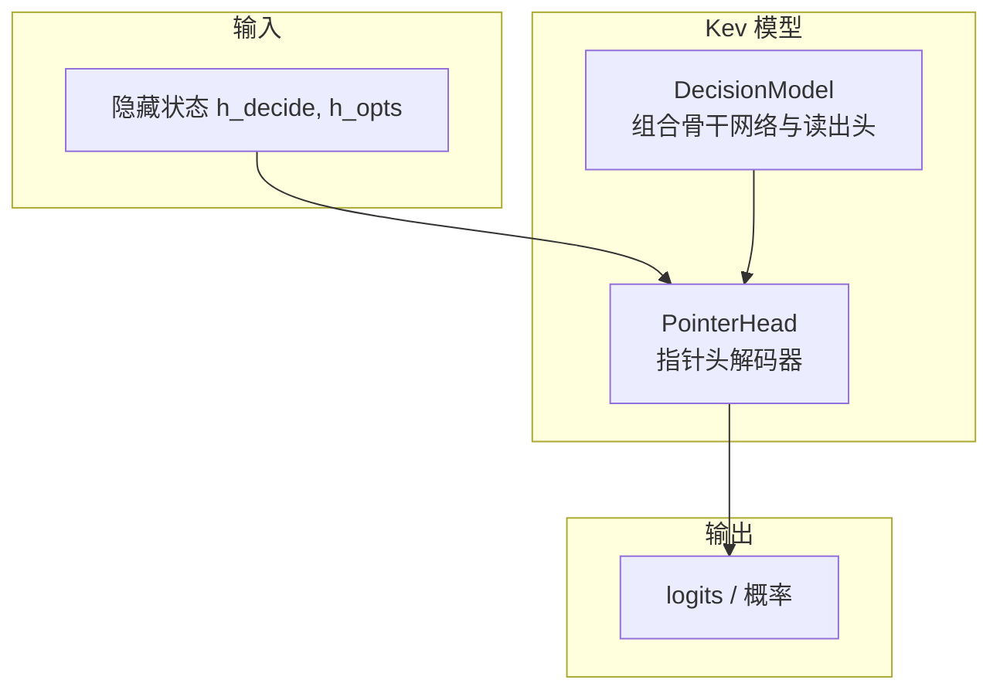
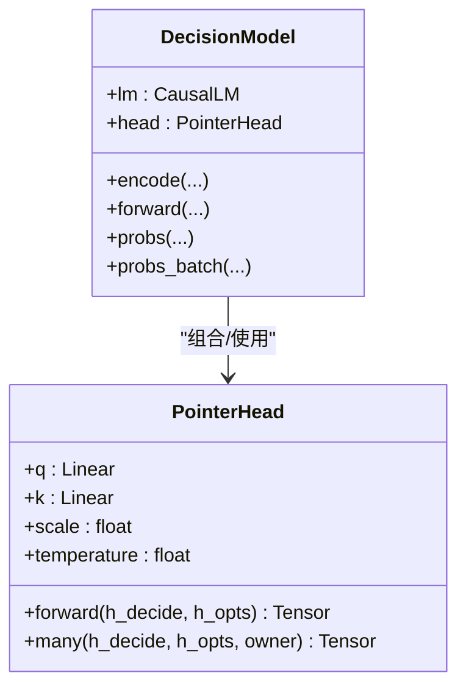
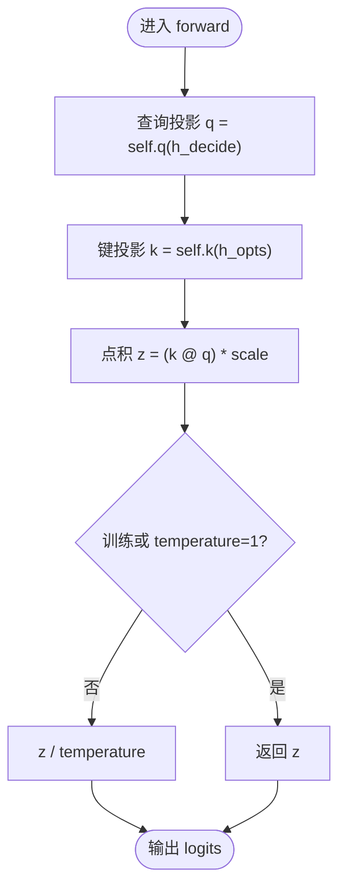
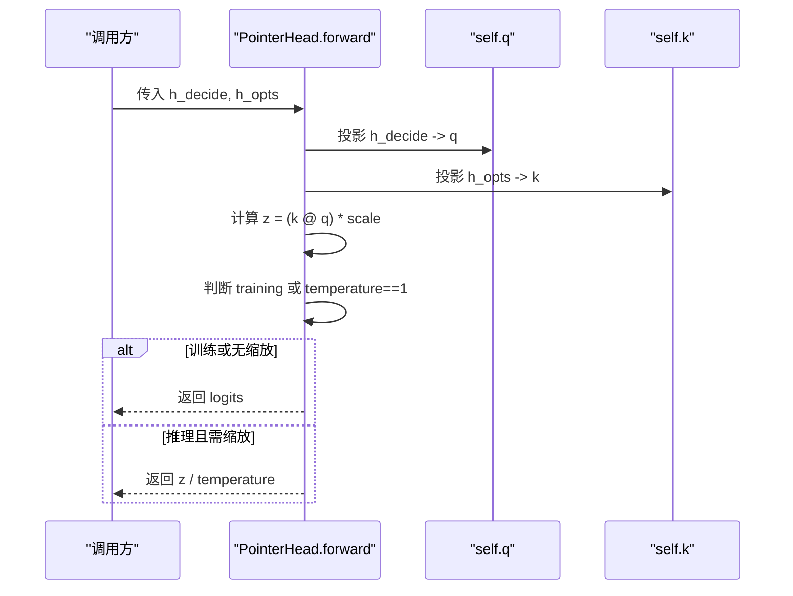
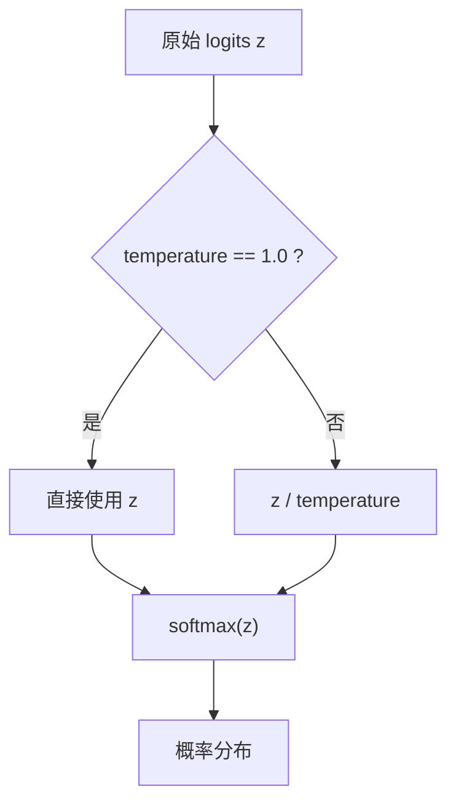
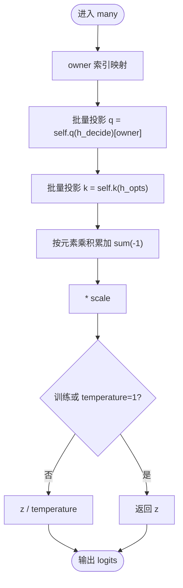
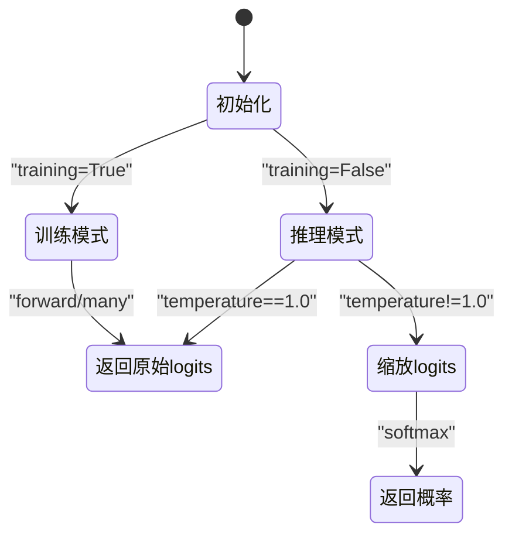
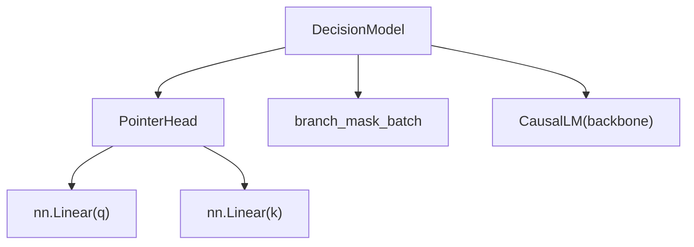

<cite>
**本文引用的文件**   
- [model.py](file://kev/model.py)
</cite>

## 目录
1. [引言](#引言)
2. [项目结构定位](#项目结构定位)
3. [核心组件](#核心组件)
4. [架构总览](#架构总览)
5. [详细组件分析](#详细组件分析)
6. [依赖关系分析](#依赖关系分析)
7. [性能与扩展建议](#性能与扩展建议)
8. [故障排查指南](#故障排查指南)
9. [结论](#结论)

## 引言
本文聚焦 Kev 决策模型中的“指针头解码器”（PointerHead），解释其如何通过查询-键点积在多个选项表示中选择最佳答案，并说明训练与推理模式下的行为差异、temperature 参数的作用，以及 many() 方法如何高效批量处理多问题的选项。文档同时提供从隐藏状态到最终概率的数值计算示例，帮助初学者理解解码器概念，并为专家提供扩展方法与性能调优建议。

## 项目结构定位
PointerHead 是 Kev 决策模型的核心读出头模块，位于模型定义文件中，被 DecisionModel 组合使用。它接收来自骨干网络的隐藏状态，对每个问题在若干候选选项之间进行注意力评分，输出 logits，并在推理时可选地进行温度缩放以校准置信度。

图表来源
- [model.py:205-223](file://kev/model.py#L205-L223)
- [model.py:243-278](file://kev/model.py#L243-L278)

章节来源
- [model.py:205-223](file://kev/model.py#L205-L223)
- [model.py:243-278](file://kev/model.py#L243-L278)

## 核心组件
- PointerHead：实现基于查询-键点积的选项选择逻辑，支持单问题 forward() 与多问题 many() 两种调用方式；包含 temperature 参数用于推理时的概率校准。
- DecisionModel：组合 Transformer 骨干与 PointerHead，负责编码、掩码构建、前向传播、概率计算与批处理服务接口。

章节来源
- [model.py:205-223](file://kev/model.py#L205-L223)
- [model.py:243-278](file://kev/model.py#L243-L278)

## 架构总览
PointerHead 的设计遵循“查询-键点积”的选择范式：
- 将 <decide> 位置的隐藏状态作为查询向量 q。
- 将所有选项的隐藏状态作为键向量 k。
- 通过线性投影后做点积，得到每个选项的原始得分（logits）。
- 训练模式下直接返回 logits；推理模式下按 temperature 缩放 logits，再进行 softmax 得到概率。

图表来源
- [model.py:205-223](file://kev/model.py#L205-L223)
- [model.py:243-278](file://kev/model.py#L243-L278)

## 详细组件分析

### PointerHead 设计原理
PointerHead 通过两个线性层分别将隐藏状态映射到指针维度 dp：
- q = self.q(h_decide)：将 <decide> 位置的隐藏状态投影为查询向量。
- k = self.k(h_opts)：将所有选项的隐藏状态投影为键向量集合。
- 点积 z = (k @ q) * scale：计算每个选项与查询的相关性得分，scale = 1/sqrt(dp) 用于稳定梯度。

图表来源
- [model.py:205-218](file://kev/model.py#L205-L218)

章节来源
- [model.py:205-218](file://kev/model.py#L205-L218)

### forward() 方法详解
forward(h_decide, h_opts) 的输入与输出：
- h_decide：形状 [d]，对应 <decide> 位置的隐藏状态。
- h_opts：形状 [K, d]，对应第 i 个问题的 K 个选项的隐藏状态。
- 输出：形状 [K] 的 logits，表示每个选项的未归一化分数。

内部步骤：
1. 将 h_decide 投影为 q。
2. 将 h_opts 投影为 k。
3. 计算点积并乘以缩放因子。
4. 若处于训练模式或 temperature=1.0，直接返回 logits；否则返回缩放后的 logits。

图表来源
- [model.py:216-218](file://kev/model.py#L216-L218)

章节来源
- [model.py:216-218](file://kev/model.py#L216-L218)

### temperature 参数的作用
temperature 用于推理时的概率校准：
- 当 temperature > 1.0 时，logits 被缩小，概率分布更平滑，降低极端置信度。
- 当 temperature < 1.0 时，logits 被放大，概率分布更尖锐，提高区分度。
- 训练模式下始终使用原始 logits（temperature 不参与），以保证损失计算的稳定性。
- 推理模式下，若 temperature != 1.0，则先缩放 logits 再 softmax。

图表来源
- [model.py:211-214](file://kev/model.py#L211-L214)
- [model.py:216-218](file://kev/model.py#L216-L218)

章节来源
- [model.py:211-214](file://kev/model.py#L211-L214)
- [model.py:216-218](file://kev/model.py#L216-L218)

### many() 方法的高效批量处理
many(h_decide, h_opts, owner) 用于一次性处理多个问题的选项，减少重复计算：
- h_decide：形状 [Q, d]，每个问题的 <decide> 位置隐藏状态。
- h_opts：形状 [sum(K), d]，所有问题的所有选项隐藏状态拼接。
- owner：形状 [sum(K)]，指示每个选项属于哪个问题。
- 输出：形状 [sum(K)] 的 logits，按问题顺序排列。

内部优化：
- 避免逐问题循环，使用矩阵乘法与索引聚合。
- 通过 owner 将不同问题的选项结果聚合回统一张量。
- 同样支持 temperature 缩放。

图表来源
- [model.py:220-223](file://kev/model.py#L220-L223)

章节来源
- [model.py:220-223](file://kev/model.py#L220-L223)

### 训练与推理模式的行为差异
- 训练模式：
  - forward() 和 many() 均返回原始 logits，不进行 temperature 缩放。
  - 便于交叉熵等损失函数直接优化。
- 推理模式：
  - 若 temperature != 1.0，先缩放 logits，再进行 softmax 得到概率。
  - 有助于改善置信度估计，使预测更可靠。

图表来源
- [model.py:211-214](file://kev/model.py#L211-L214)
- [model.py:216-223](file://kev/model.py#L216-L223)

章节来源
- [model.py:211-214](file://kev/model.py#L211-L214)
- [model.py:216-223](file://kev/model.py#L216-L223)

### 数值计算示例
假设以下简化数值（仅示意）：
- h_decide = [1.0, 2.0]
- h_opts = [[0.5, 1.0], [-0.5, 0.5], [1.0, -0.5]]
- dp = 2（为简化，实际 dp 通常更大）
- q = W_q @ h_decide
- k = W_k @ h_opts
- z = (k @ q) * scale

步骤：
1. 投影：q 为 [dp]，k 为 [K, dp]。
2. 点积：z_i = k_i · q，i=1..K。
3. 缩放：z *= 1/sqrt(dp)。
4. 推理时缩放：若 temperature=0.8，则 z' = z / 0.8。
5. 概率：p_i = exp(z'_i) / sum(exp(z'_j))。

注意：以上仅为概念演示，实际维度与权重由模型初始化决定。

章节来源
- [model.py:205-218](file://kev/model.py#L205-L218)

## 依赖关系分析
PointerHead 依赖 torch.nn.Linear 进行线性投影，并使用 PyTorch 的张量运算完成点积与求和。DecisionModel 负责：
- 构建块因果掩码，确保选项间注意力正确。
- 管理 hidden 状态提取与 readout。
- 提供 probs/probs_batch 等服务接口，集成 PointerHead 的输出。

图表来源
- [model.py:205-223](file://kev/model.py#L205-L223)
- [model.py:243-278](file://kev/model.py#L243-L278)
- [model.py:154-185](file://kev/model.py#L154-L185)

章节来源
- [model.py:205-223](file://kev/model.py#L205-L223)
- [model.py:243-278](file://kev/model.py#L243-L278)
- [model.py:154-185](file://kev/model.py#L154-L185)

## 性能与扩展建议
- 批量优化：
  - 优先使用 many() 进行多问题选项处理，减少 Python 层循环开销。
  - 在推理服务中结合 probs_batch 与 CUDA Graphs（如适用）进一步提升吞吐。
- 温度校准：
  - 根据验证集表现调整 temperature，平衡置信度与准确性。
  - 保持训练时使用 temperature=1.0，避免影响梯度更新。
- 扩展方向：
  - 可引入可学习的 temperature 参数，但需注意训练与推理的一致性。
  - 考虑对 h_decide 或 h_opts 增加门控或残差连接，增强表达能力。
  - 针对长上下文场景，优化 h_opts 的内存布局与索引策略。

[本节为通用指导，不直接分析具体代码文件]

## 故障排查指南
- 维度不匹配：
  - 检查 h_decide 与 h_opts 的维度是否符合 [d] 与 [K, d]。
  - 在 many() 中确认 owner 长度与 h_opts 行数一致。
- 温度异常：
  - 若推理概率过于平坦或尖锐，检查 temperature 设置是否合理。
  - 确认推理模式下 temperature 参与缩放。
- 掩码错误：
  - 确保 block-causal 掩码正确构建，避免跨问题或跨选项的错误注意力。

章节来源
- [model.py:205-223](file://kev/model.py#L205-L223)
- [model.py:154-185](file://kev/model.py#L154-L185)

## 结论
PointerHead 作为 Kev 决策模型的指针头解码器，通过简洁高效的查询-键点积机制，在多选项场景中实现精准的答案选择。其 forward() 与 many() 方法分别满足单问题与批量处理需求，temperature 参数为推理阶段的概率校准提供了灵活控制。结合 DecisionModel 的完整流水线，该解码器在训练与推理模式下表现出稳定且可扩展的性能，适合进一步扩展与优化以满足多样化应用场景。

[本节为总结性内容，不直接分析具体代码文件]