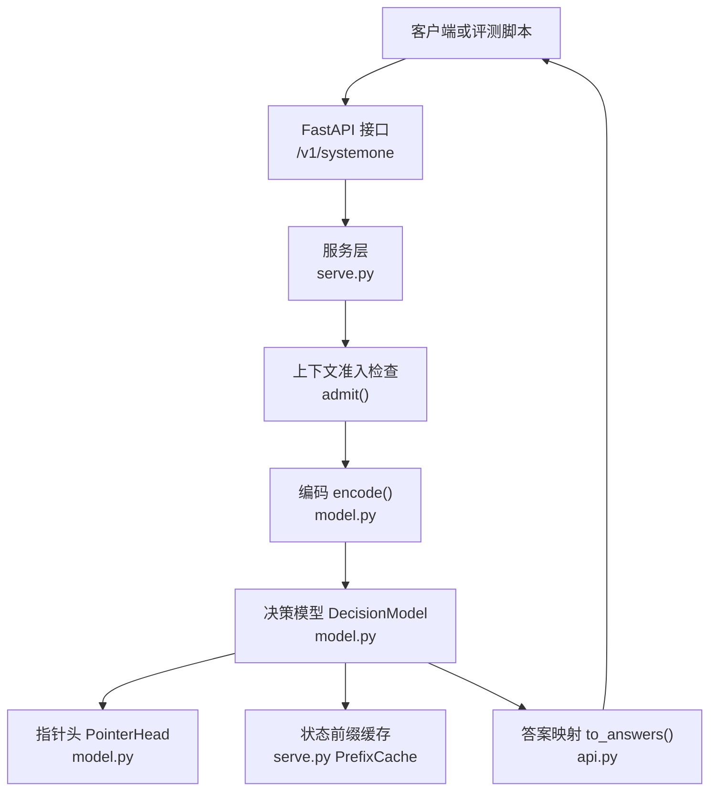
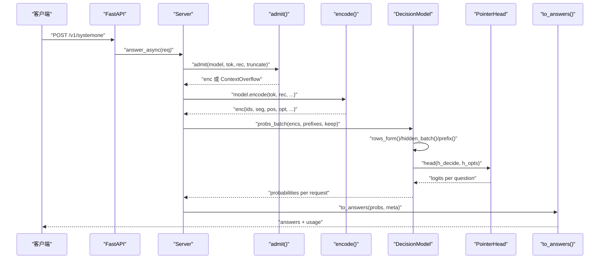
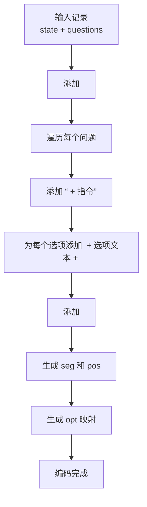
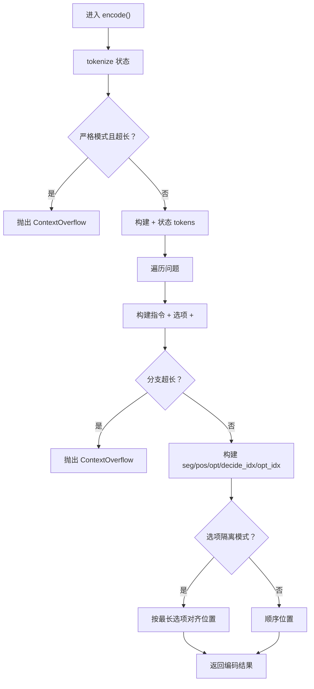
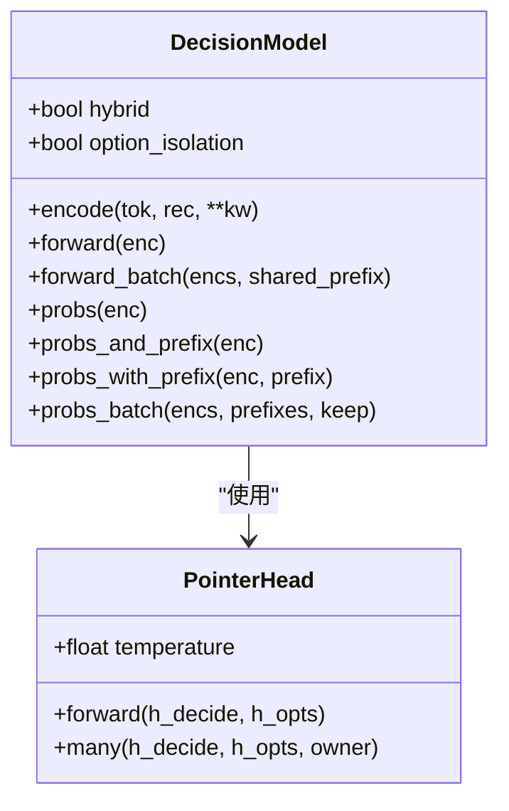
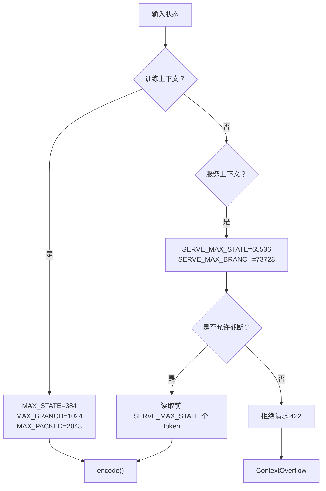
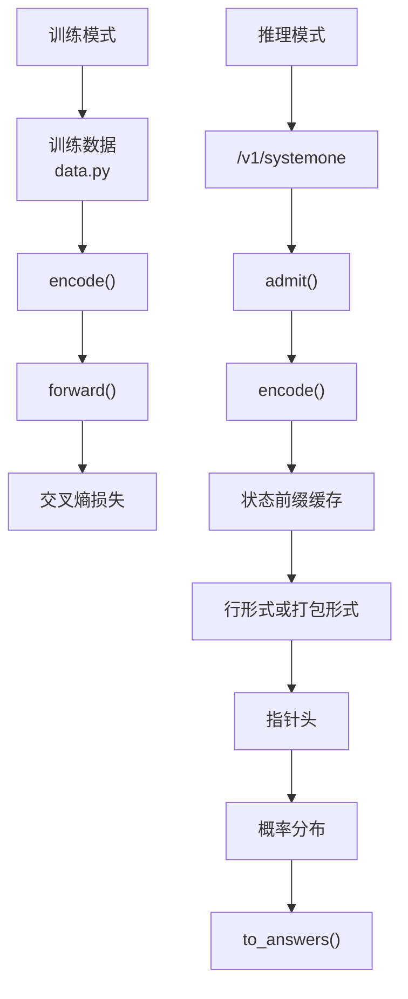
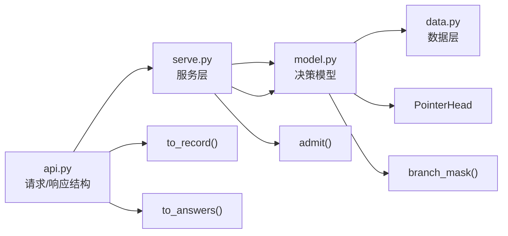

<cite>
**本文引用的文件**   
- [README.md](file://README.md)
- [model.py](file://kev/model.py)
- [serve.py](file://kev/serve.py)
- [api.py](file://kev/api.py)
- [data.py](file://kev/data.py)
</cite>

## 目录
1. [引言](#引言)
2. [项目结构](#项目结构)
3. [核心组件](#核心组件)
4. [架构总览](#架构总览)
5. [详细组件分析](#详细组件分析)
6. [依赖关系分析](#依赖关系分析)
7. [性能与上下文长度](#性能与上下文长度)
8. [故障排查指南](#故障排查指南)
9. [结论](#结论)

## 引言
Kev 是一族基于 Qwen 基座的小型决策模型，目标是在同一份状态文本上，并行回答多种类型的问题：是否判断、多选和有序评分。其核心思想是把“状态文本 + 问题”编码成一段 token 序列，通过特殊分隔符和注意力掩码，让模型在一次前向中读取状态，并独立回答每个问题；最终用指针头把每个问题的结束标记与选项结束标记对齐，得到概率分布。

对初学者而言，可以把 Kev 理解为：
- 输入：一段待判断的“状态”，以及若干个问题。
- 处理：把状态和问题拼成一条 token 流，并用掩码保证“问题之间互不干扰”。
- 输出：每个问题的概率分布，再映射回人类可读的答案。

对专家而言，关键实现点包括：
- 特殊 token 系统 `<state>`、`<q>`、`<opt>`、`</opt>`、`<decide>`。
- `encode()` 的状态截断、分支构建和选项隔离模式。
- 纯注意力基座（Qwen3）与混合注意力/DeltaNet 基座（Qwen3.5/Qwen3.8）的不同推理路径。
- 训练上下文与服务上下文的长度限制及其实际影响。

## 项目结构
本项目的核心代码集中在 `kev/` 目录，其中与决策模型架构直接相关的文件包括：
- `model.py`：定义特殊 token、编码函数、注意力掩码、指针头、决策模型类、缓存与批处理。
- `serve.py`：FastAPI 服务层，负责请求校验、状态前缀缓存、批调度、错误处理和指标返回。
- `api.py`：TypeSafe 兼容的请求/响应结构、问题到内部记录的转换、置信度计算。
- `data.py`：公开数据集到 Kev 训练格式的转换、数据增强、材料化逻辑。
- `README.md`：用户文档，说明模型家族、训练、部署、性能、限制等。

**图表来源**
- [serve.py:249-252](file://kev/serve.py#L249-L252)
- [serve.py:132-145](file://kev/serve.py#L132-L145)
- [model.py:87-127](file://kev/model.py#L87-L127)
- [model.py:205-224](file://kev/model.py#L205-L224)
- [api.py:102-117](file://kev/api.py#L102-L117)
- [api.py:149-160](file://kev/api.py#L149-L160)

**章节来源**
- [README.md:13-23](file://README.md#L13-L23)
- [README.md:260-280](file://README.md#L260-L280)

## 核心组件
Kev 的核心由以下部分组成：

| 组件 | 职责 | 关键位置 |
|---|---|---|
| 特殊 token 系统 | 用现有 Qwen 特殊 token 作为状态、问题、选项、决策边界，避免扩展词表 | [model.py:9-11](file://kev/model.py#L9-L11) |
| 编码器 `encode()` | 将状态和问题打包为 ids、seg、pos、opt 等元信息 | [model.py:87-127](file://kev/model.py#L87-L127) |
| 分支掩码 | 块因果掩码，允许状态和同问题内的 token 互相注意，禁止跨问题注意 | [model.py:154-185](file://kev/model.py#L154-L185) |
| 指针头 | 比较 `<decide>` 隐藏状态与各选项 `</opt>` 隐藏状态，输出选项 logits | [model.py:205-224](file://kev/model.py#L205-L224) |
| 决策模型 | 封装基座模型、LoRA、行形式与打包形式的推理、前缀缓存、批处理 | [model.py:243-509](file://kev/model.py#L243-L509) |
| 服务层 | 请求解析、上下文校验、状态前缀缓存、批调度、错误与指标 | [serve.py:27-34](file://kev/serve.py#L27-L34), [serve.py:93-220](file://kev/serve.py#L93-L220) |
| API 适配层 | TypeSafe 兼容结构、问题渲染、置信度、答案映射 | [api.py:17-47](file://kev/api.py#L17-L47), [api.py:102-160](file://kev/api.py#L102-L160) |
| 数据层 | 公开数据集转 Kev 格式、增强、材料化 | [data.py:1-7](file://kev/data.py#L1-L7), [data.py:298-343](file://kev/data.py#L298-L343) |

**章节来源**
- [model.py:9-11](file://kev/model.py#L9-L11)
- [model.py:87-127](file://kev/model.py#L87-L127)
- [model.py:154-185](file://kev/model.py#L154-L185)
- [model.py:205-224](file://kev/model.py#L205-L224)
- [model.py:243-509](file://kev/model.py#L243-L509)
- [serve.py:27-34](file://kev/serve.py#L27-L34)
- [serve.py:93-220](file://kev/serve.py#L93-L220)
- [api.py:17-47](file://kev/api.py#L17-L47)
- [api.py:102-160](file://kev/api.py#L102-L160)
- [data.py:1-7](file://kev/data.py#L1-L7)
- [data.py:298-343](file://kev/data.py#L298-L343)

## 架构总览
从输入到输出的完整数据流如下：

**图表来源**
- [serve.py:249-252](file://kev/serve.py#L249-L252)
- [serve.py:132-145](file://kev/serve.py#L132-L145)
- [model.py:130-143](file://kev/model.py#L130-L143)
- [model.py:294-296](file://kev/model.py#L294-L296)
- [model.py:464-492](file://kev/model.py#L464-L492)
- [model.py:216-224](file://kev/model.py#L216-L224)
- [api.py:149-160](file://kev/api.py#L149-L160)

## 详细组件分析

### 特殊 token 系统与问题表示
Kev 复用 Qwen 的特殊 token 作为分隔符，而不是扩展词表：
- `<state>`：状态开始。
- `<q>`：问题指令开始。
- `<opt>`：选项开始。
- `</opt>`：选项结束。
- `<decide>`：问题决策结束。

这种设计的优点是：
- 不需要新增 embedding 行。
- LoRA 可以学习这些 token 在决策任务中的新含义。
- 训练和推理使用完全相同的文本格式。

**图表来源**
- [model.py:9-11](file://kev/model.py#L9-L11)
- [model.py:87-127](file://kev/model.py#L87-L127)

**章节来源**
- [README.md:260-276](file://README.md#L260-L276)
- [model.py:9-11](file://kev/model.py#L9-L11)
- [model.py:87-127](file://kev/model.py#L87-L127)

### 编码函数 `encode()` 的工作原理
`encode()` 是 Kev 的核心数据处理函数，它负责：
1. 将用户状态文本转换为 token。
2. 在严格模式下检查状态是否超过 `max_state`。
3. 拼接 `<state>` 和状态 token。
4. 为每个问题拼接 `<q>`、指令、`<opt>`、选项、`</opt>`、`<decide>`。
5. 检查分支长度是否超过 `max_branch`。
6. 生成段索引 `seg`、位置索引 `pos`、选项索引 `opt`。
7. 支持选项隔离模式：每个选项只看到状态、指令和自身。

**图表来源**
- [model.py:87-127](file://kev/model.py#L87-L127)

**章节来源**
- [model.py:87-127](file://kev/model.py#L87-L127)

### 不同基座模型的差异处理
Kev 根据基座模型配置决定推理路径：

| 基座类型 | 特点 | 推理方式 | 原因 |
|---|---|---|---|
| Qwen3 纯注意力模型 | 只有注意力层 | 打包形式：所有问题和状态放在一个序列中，使用块因果掩码 | 注意力可以正确遵循掩码 |
| Qwen3.5/Qwen3.8 混合模型 | 注意力层与 Gated DeltaNet 层混合 | 行形式：每个问题单独作为一行，继续状态的前缀缓存 | DeltaNet 是递归层，不能尊重注意力掩码 |

**图表来源**
- [model.py:205-224](file://kev/model.py#L205-L224)
- [model.py:243-509](file://kev/model.py#L243-L509)

**章节来源**
- [README.md:260-276](file://README.md#L260-L276)
- [model.py:69-73](file://kev/model.py#L69-L73)
- [model.py:259-264](file://kev/model.py#L259-L264)
- [model.py:329-333](file://kev/model.py#L329-L333)

### 上下文长度限制的设计与实际影响
Kev 定义了多组上下文长度限制，分别用于训练和服务：

| 常量 | 值 | 用途 | 说明 |
|---|---:|---|---|
| `MAX_STATE` | 384 | 默认训练状态长度 | 小模型主要在此长度下训练 |
| `MAX_BRANCH` | 1024 | 默认训练分支长度 | 状态 + 一个问题的最大长度 |
| `MAX_PACKED` | 2048 | 默认训练打包长度 | 整个打包记录的最大长度 |
| `SERVE_MAX_STATE` | 65536 | 服务状态长度上限 | 服务端接受的最长状态 |
| `SERVE_MAX_BRANCH` | 73728 | 服务分支长度上限 | 状态 + 一个问题行的最大长度 |
| `SERVE_MAX_PACKED` | 131072 | 服务打包长度上限 | 服务端的打包记录上限 |
| `ROW_PASS_TOKENS` | 16384 | 单次推理 pass 的 token 预算 | 超过此长度的打包序列会退化为行形式 |

**图表来源**
- [model.py:13-28](file://kev/model.py#L13-L28)
- [model.py:87-127](file://kev/model.py#L87-L127)
- [model.py:130-143](file://kev/model.py#L130-L143)
- [serve.py:27-32](file://kev/serve.py#L27-L32)

**章节来源**
- [model.py:13-28](file://kev/model.py#L13-L28)
- [model.py:31-38](file://kev/model.py#L31-L38)
- [model.py:130-143](file://kev/model.py#L130-L143)
- [serve.py:27-32](file://kev/serve.py#L27-L32)

### 训练与推理模式下的不同处理路径
训练模式：
- 使用交叉熵损失。
- 适配器或全量权重参与训练。
- 基座模型通常冻结（Kev-27B 除外）。
- 训练数据与 API 请求使用相同文本格式。

推理模式：
- 服务层先做上下文准入检查。
- 状态前缀被缓存，重复状态只需计算问题分支。
- 混合基座使用行形式，纯注意力基座可使用打包形式。
- 指针头输出选项 logits，再 softmax 得到概率。

**图表来源**
- [data.py:298-343](file://kev/data.py#L298-L343)
- [model.py:87-127](file://kev/model.py#L87-L127)
- [model.py:385-394](file://kev/model.py#L385-L394)
- [model.py:416-462](file://kev/model.py#L416-L462)
- [serve.py:132-145](file://kev/serve.py#L132-L145)
- [api.py:149-160](file://kev/api.py#L149-L160)

**章节来源**
- [README.md:278-286](file://README.md#L278-L286)
- [data.py:298-343](file://kev/data.py#L298-L343)
- [model.py:385-394](file://kev/model.py#L385-L394)
- [model.py:416-462](file://kev/model.py#L416-L462)
- [serve.py:132-145](file://kev/serve.py#L132-L145)
- [api.py:149-160](file://kev/api.py#L149-L160)

## 依赖关系分析
Kev 的核心依赖关系如下：

**图表来源**
- [api.py:102-117](file://kev/api.py#L102-L117)
- [api.py:149-160](file://kev/api.py#L149-L160)
- [serve.py:223-225](file://kev/serve.py#L223-L225)
- [serve.py:249-252](file://kev/serve.py#L249-L252)
- [model.py:87-127](file://kev/model.py#L87-L127)
- [model.py:154-185](file://kev/model.py#L154-L185)
- [model.py:205-224](file://kev/model.py#L205-L224)

**章节来源**
- [api.py:102-117](file://kev/api.py#L102-L117)
- [api.py:149-160](file://kev/api.py#L149-L160)
- [serve.py:223-225](file://kev/serve.py#L223-L225)
- [serve.py:249-252](file://kev/serve.py#L249-L252)
- [model.py:87-127](file://kev/model.py#L87-L127)
- [model.py:154-185](file://kev/model.py#L154-L185)
- [model.py:205-224](file://kev/model.py#L205-L224)

## 性能与上下文长度
### 上下文长度限制的影响
- 训练时，小模型主要在 384 个状态 token 内训练，但可以通过 `training_context()` 提升状态长度，同时按比例增加分支和打包预算。
- 服务时，状态最多 65536 个 token，每个问题行最多额外 8192 个 token。
- 如果状态过长且未启用截断，服务会返回 422 错误。
- 如果启用 `KEV_TRUNCATE_STATES=1`，服务会读取前 65536 个 token，并在响应中标记 `truncated`。

### 推理性能优化建议
- 对于重复状态，利用状态前缀缓存，避免重复计算状态。
- 对于混合基座，行形式天然保证问题隔离，但需要缓存状态前缀。
- 对于纯注意力基座，打包形式可以减少重复计算，但要注意 L×L 掩码内存增长。
- 使用 bf16 推理可显著提升大模型速度，但评估时应使用 fp32 以保证数值一致性。
- 在 CUDA 上启用 CUDA Graphs 可减少内核启动开销。

**章节来源**
- [model.py:31-38](file://kev/model.py#L31-L38)
- [model.py:130-143](file://kev/model.py#L130-L143)
- [serve.py:27-32](file://kev/serve.py#L27-L32)
- [serve.py:132-145](file://kev/serve.py#L132-L145)
- [README.md:355-383](file://README.md#L355-L383)

## 故障排查指南
### 常见问题
1. **状态过长导致 422 错误**
   - 现象：服务端拒绝状态超过 `SERVE_MAX_STATE` 的请求。
   - 解决：缩短状态、拆分请求，或启用 `KEV_TRUNCATE_STATES=1`。
   - 相关代码：[serve.py:132-145](file://kev/serve.py#L132-L145), [model.py:130-143](file://kev/model.py#L130-L143)

2. **分支过长导致 ContextOverflow**
   - 现象：某个问题的指令 + 选项 + 结束标记超过 `max_branch`。
   - 解决：减少选项数量或缩短指令。
   - 相关代码：[model.py:112-113](file://kev/model.py#L112-L113)

3. **混合基座无法使用选项隔离**
   - 现象：设置 `option_isolation=True` 时报错。
   - 原因：混合基座的 DeltaNet 层无法尊重打包掩码。
   - 相关代码：[model.py:263](file://kev/model.py#L263)

4. **Mac 上内存不足**
   - 现象：训练或推理时 MPS/CPU 路径内存溢出。
   - 解决：避免启用 `output_hidden_states`，避免添加特殊 token 索引。
   - 相关代码：[README.md:421-428](file://README.md#L421-L428)

**章节来源**
- [serve.py:132-145](file://kev/serve.py#L132-L145)
- [model.py:112-113](file://kev/model.py#L112-L113)
- [model.py:263](file://kev/model.py#L263)
- [README.md:421-428](file://README.md#L421-L428)

## 结论
Kev 的核心架构围绕“状态 + 问题”的 token 序列展开，通过特殊分隔符和注意力掩码实现多问题并行推理。其设计兼顾了简洁性与可扩展性：
- 特殊 token 系统避免了词表扩展。
- `encode()` 提供了灵活的状态截断、分支构建和选项隔离能力。
- 纯注意力与混合注意力基座有不同的推理路径，确保在不同模型架构下都能正确工作。
- 训练和服务上下文长度分离，既保证了训练稳定性，又提升了服务灵活性。

对于初学者，建议从 README 和 API 文档入手，理解输入输出格式和基本用法；对于专家，建议深入阅读 `model.py` 中的 `encode()`、`branch_mask()`、`DecisionModel` 和 `PointerHead`，并结合 `serve.py` 的服务层逻辑，理解完整的推理流水线。