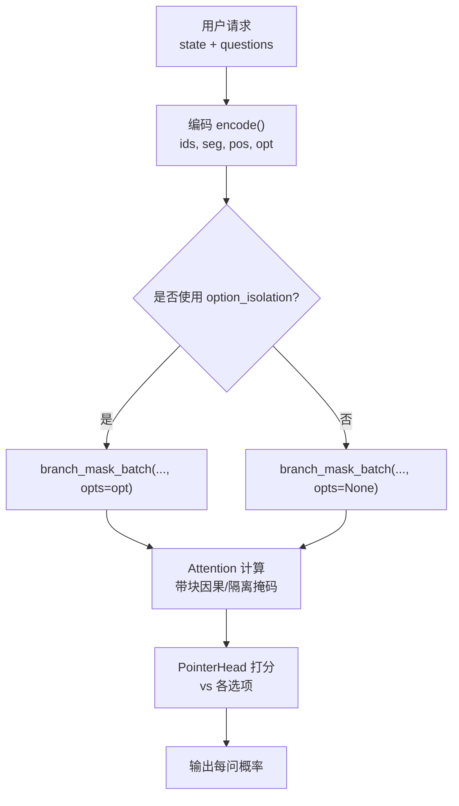
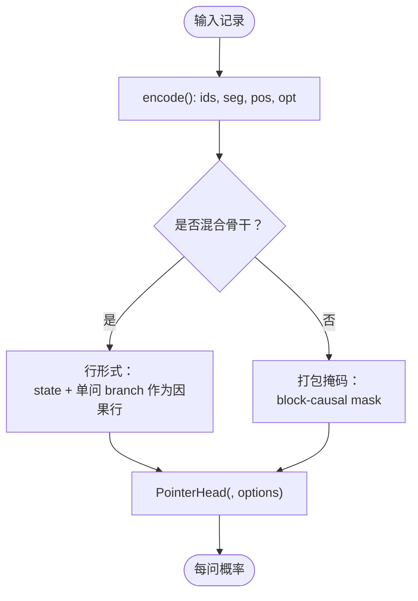
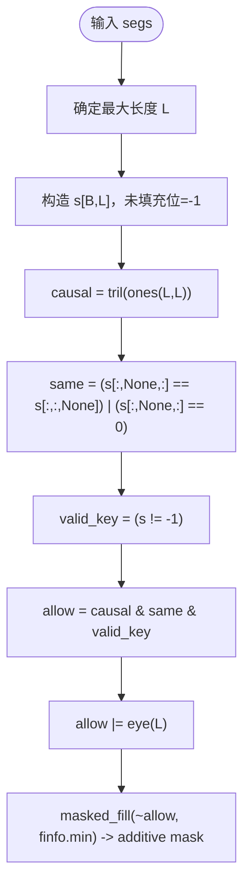
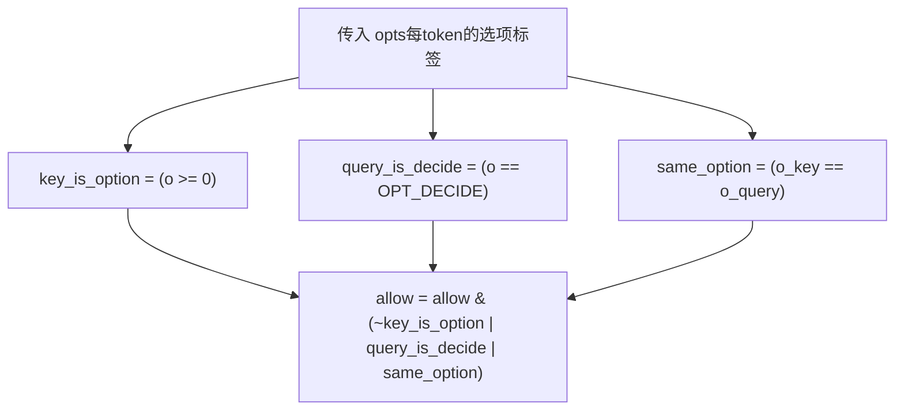
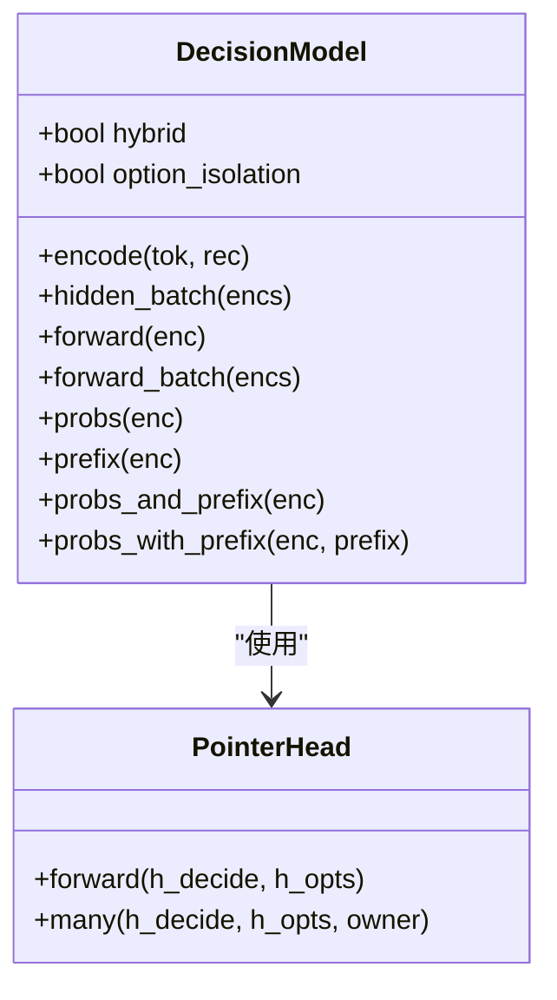
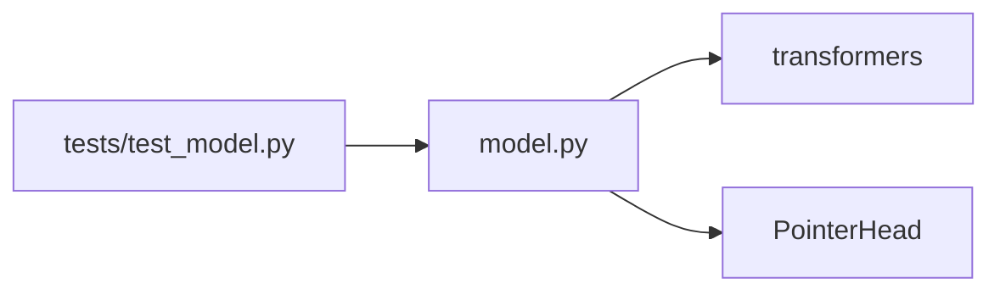
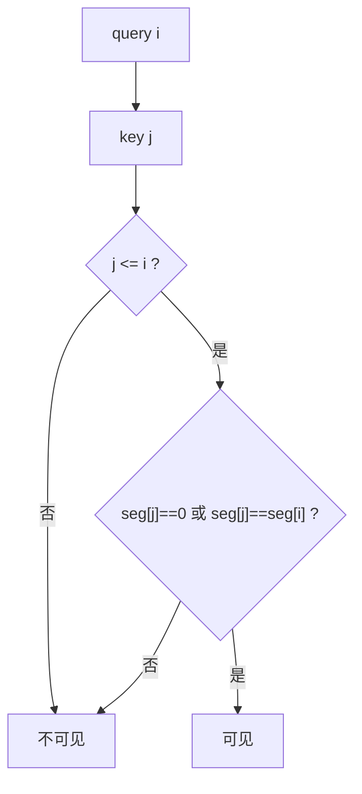
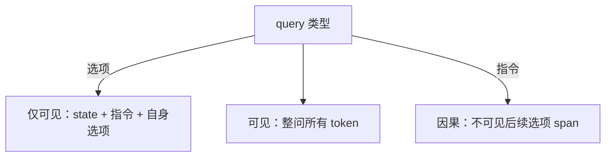
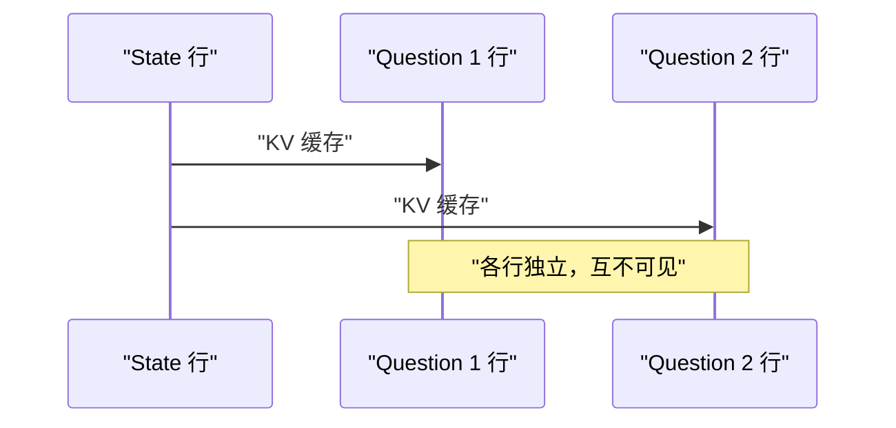

# 注意力机制与掩码设计

<cite>
**本文引用的文件**   
- [model.py](file://kev/model.py)
- [README.md](file://README.md)
- [test_model.py](file://tests/test_model.py)
</cite>

## 目录
1. [引言](#引言)
2. [项目结构](#项目结构)
3. [核心组件](#核心组件)
4. [架构总览](#架构总览)
5. [详细组件分析](#详细组件分析)
6. [依赖关系分析](#依赖关系分析)
7. [性能考量](#性能考量)
8. [故障排查指南](#故障排查指南)
9. [结论](#结论)
10. [附录：注意力矩阵可视化示例](#附录注意力矩阵可视化示例)

## 引言
本文聚焦 Kev 决策模型中的注意力机制与掩码设计，重点解释以下问题：
- 块因果掩码如何确保“每个问题只能关注其对应的选项”，同时允许所有问题共享状态信息。
- 掩码的数学条件 attend(i,j) iff j<=i and (seg[j]==0 or seg[j]==seg[i]) 的实现逻辑。
- option_isolation 模式下的额外约束：选项 token 只能关注状态、指令和自身选项；<decide> token 可关注整个问题的所有 token。
- 混合注意力架构（Qwen3.5）与传统纯注意力架构的区别，以及为什么混合架构不能使用块因果掩码。
- 面向初学者的注意力基础概念，以及面向专家的可扩展掩码设计与性能优化建议。

## 项目结构
Kev 的核心推理与训练代码集中在 kev 包中，其中注意力掩码与模型前向流程由 model.py 提供；README.md 给出高层架构说明；tests/test_model.py 包含掩码与行形式等价性、缓存命中等关键测试。

图示来源
- [model.py:87-127](file://kev/model.py#L87-L127)
- [model.py:154-185](file://kev/model.py#L154-L185)
- [model.py:205-223](file://kev/model.py#L205-L223)

章节来源
- [README.md:260-278](file://README.md#L260-L278)
- [model.py:87-127](file://kev/model.py#L87-L127)
- [model.py:154-185](file://kev/model.py#L154-L185)
- [model.py:205-223](file://kev/model.py#L205-L223)

## 核心组件
- 编码器 encode()：将 state 与多个 question 分支拼接为一条序列，并维护 seg（段号）、pos（位置）、opt（选项标签）。
- 掩码生成 branch_mask()/branch_mask_batch()：实现块因果掩码与可选的 option_isolation 约束。
- 指针头 PointerHead：用 <decide> 与每个 </opt> 的隐藏向量做打分，得到选项概率。
- DecisionModel：封装 backbone（Qwen），在“打包掩码”和“行形式”两种路径间切换，并提供 prefix 缓存。

章节来源
- [model.py:87-127](file://kev/model.py#L87-L127)
- [model.py:154-185](file://kev/model.py#L154-L185)
- [model.py:205-223](file://kev/model.py#L205-L223)
- [model.py:243-394](file://kev/model.py#L243-L394)

## 架构总览
Kev 采用“因果语言模型骨干 + 块因果分支掩码 + 指针读出”的设计。对纯注意力骨干，state 与多问打包成一条序列，通过掩码保证跨问隔离；对 Qwen3.5/3.8 这类混合骨干（含 Gated DeltaNet 层），由于循环层不尊重注意力掩码，必须退化为“行形式”：每条 question 以 state+branch 作为独立因果行运行，并通过 KV 缓存复用 state。

图示来源
- [model.py:69-73](file://kev/model.py#L69-L73)
- [model.py:259-263](file://kev/model.py#L259-L263)
- [model.py:329-333](file://kev/model.py#L329-L333)
- [model.py:364-394](file://kev/model.py#L364-L394)

章节来源
- [README.md:260-278](file://README.md#L260-L278)
- [model.py:69-73](file://kev/model.py#L69-L73)
- [model.py:259-263](file://kev/model.py#L259-L263)
- [model.py:329-333](file://kev/model.py#L329-L333)
- [model.py:364-394](file://kev/model.py#L364-L394)

## 详细组件分析

### 编码器与分段语义
encode() 将输入组织为：
- 一段 state（seg=0）
- 若干 question 分支（seg=k，k>=1），每个分支包含指令、若干选项 span，并以 <decide> 结尾
- 维护 opt：state/instruction 为 OPT_NONE，选项 span 内为选项序号，<decide> 为 OPT_DECIDE

option_isolation=True 时，同一问题内的每个选项 span 被视作独立子分支，且共享相同的位置 id；<decide> 固定放在最长 span 之后，从而保证选项表示与 <decide> 对其的注意力具有排列不变性。

章节来源
- [model.py:87-127](file://kev/model.py#L87-L127)

### 块因果掩码：branch_mask() 与 branch_mask_batch()
- 基本规则：attend(i,j) iff j<=i and (seg[j]==0 or seg[j]==seg[i])
  - j<=i：因果约束，禁止未来信息泄露
  - seg[j]==0：允许关注 state 段
  - seg[j]==seg[i]：仅允许关注同问分支
- 批处理版本支持右填充、对角线保留（避免全掩蔽行）、以及 padding key 的屏蔽。

图示来源
- [model.py:154-185](file://kev/model.py#L154-L185)

章节来源
- [model.py:154-185](file://kev/model.py#L154-L185)

### option_isolation 的额外约束
当 opts 传入时，branch_mask_batch() 增加两条规则：
- 选项键（key）若属于某个选项 span，则查询（query）只有满足下列之一才可关注它：
  - query 是 <decide>（OPT_DECIDE）
  - query 与 key 属于同一选项（same_option）
- 指令 token 天然无法看到后续选项 span（因果约束），因此指令不会看到任何选项 span。

这实现了：
- 选项 token 仅能关注：state、本问指令、自身选项 span
- <decide> 可关注整问所有 token（包括其他选项）

图示来源
- [model.py:176-184](file://kev/model.py#L176-L184)

章节来源
- [model.py:176-184](file://kev/model.py#L176-L184)

### 指针头：从 <decide> 到选项的概率
PointerHead 用 <decide> 的隐藏向量与每个 </opt> 的隐藏向量做点积打分，再经 softmax 得到选项概率。训练时使用温度 T=1；推理时可应用校准温度。

章节来源
- [model.py:205-223](file://kev/model.py#L205-L223)

### 混合架构与行形式
- is_hybrid() 检测是否包含 linear_attention 层（Qwen3.5）。
- DecisionModel.hybrid 标志决定：
  - 非混合：优先使用打包掩码（packed block-causal）
  - 混合：强制使用行形式（rows_form），因为循环层不尊重注意力掩码
- rows_of() 将 packed 编码切分为 state 与 per-question 分支；forward_rows_batch() 将每个 question 作为独立因果行运行，并通过 prefix 缓存复用 state。

图示来源
- [model.py:69-73](file://kev/model.py#L69-L73)
- [model.py:243-394](file://kev/model.py#L243-L394)
- [model.py:205-223](file://kev/model.py#L205-L223)

章节来源
- [model.py:69-73](file://kev/model.py#L69-L73)
- [model.py:243-394](file://kev/model.py#L243-L394)

### 为什么混合架构不能使用块因果掩码
- 混合骨干包含 Gated DeltaNet 等循环层，这些层忽略注意力掩码，因此 packed 掩码无法保证跨问隔离。
- 解决方案：对所有混合骨干统一走行形式，即每条 question 单独作为 state+branch 因果行运行，天然隔离；通过 KV 缓存复用 state，避免重复计算。

章节来源
- [README.md:260-278](file://README.md#L260-L278)
- [model.py:259-263](file://kev/model.py#L259-L263)
- [model.py:329-333](file://kev/model.py#L329-L333)
- [model.py:364-394](file://kev/model.py#L364-L394)

## 依赖关系分析
- model.py 依赖 transformers 的 AutoModel/AutoModelForCausalLM 与 DynamicCache。
- DecisionModel 根据 config.layer_types 判断是否混合骨干。
- tests/test_model.py 验证：
  - 行形式与打包掩码在纯注意力骨干上数值一致
  - 混合骨干的行形式隔离性与 prefix 缓存行为
  - 形状桶对齐与掩码 batched 行为

图示来源
- [model.py:1-8](file://kev/model.py#L1-L8)
- [model.py:69-73](file://kev/model.py#L69-L73)
- [test_model.py:115-132](file://tests/test_model.py#L115-L132)
- [test_model.py:164-195](file://tests/test_model.py#L164-L195)

章节来源
- [model.py:1-8](file://kev/model.py#L1-L8)
- [model.py:69-73](file://kev/model.py#L69-L73)
- [test_model.py:115-132](file://tests/test_model.py#L115-L132)
- [test_model.py:164-195](file://tests/test_model.py#L164-L195)

## 性能考量
- 行形式与打包掩码的选择：
  - 非混合骨干：当 packed 序列超过 ROW_PASS_TOKENS 时自动切换到行形式，避免 L×L 掩码内存增长。
  - 混合骨干：始终使用行形式。
- Prefix 缓存：
  - 非混合骨干：probs_and_prefix/probs_with_prefix 复用 state 的 KV 缓存，减少重复计算。
  - 混合骨干：always 走行形式，但同样复用 KV 缓存。
- MPS 设备上的形状桶对齐：MPS eval 模式下按 SHAPE_BUCKET 对齐序列长度，提升内核预热效果。

章节来源
- [model.py:41-47](file://kev/model.py#L41-L47)
- [model.py:301-314](file://kev/model.py#L301-L314)
- [model.py:329-333](file://kev/model.py#L329-L333)
- [model.py:416-462](file://kev/model.py#L416-L462)

## 故障排查指南
- 上下文溢出：
  - state 过长或单问 branch 过长会触发 ContextOverflow；服务侧可通过 truncate 策略截断 state，但评估不走截断。
- 混合骨干与 option_isolation：
  - option_isolation 需要打包掩码，而混合骨干不支持该掩码，因此会抛出错误。
- 批次一致性：
  - 不能在同一批次中混用 option_isolated 与非 isolated 编码。

章节来源
- [model.py:50-57](file://kev/model.py#L50-L57)
- [model.py:130-142](file://kev/model.py#L130-L142)
- [model.py:263-264](file://kev/model.py#L263-L264)
- [model.py:316-324](file://kev/model.py#L316-L324)

## 结论
Kev 通过“块因果掩码 + 指针头”实现对多问决策的精确隔离与高效共享状态。对于纯注意力骨干，packed 掩码保证跨问隔离；对于 Qwen3.5/3.8 混合骨干，因循环层不尊重掩码，统一退化为行形式并通过 KV 缓存复用 state。option_isolation 进一步限制选项间的可见性，使选项表示与 <decide> 的注意力具备更强的对称性与稳定性。

## 附录：注意力矩阵可视化示例
以下示例展示不同模式下 token 间的可见性关系。横轴为 key（j），纵轴为 query（i）。

- 基础块因果掩码（无 option_isolation）
  - 条件：j<=i 且 (seg[j]==0 或 seg[j]==seg[i])
  - 含义：每个 token 只能看自己所在问题与 state；不同问题之间不可见。

图示来源
- [model.py:154-185](file://kev/model.py#L154-L185)

- option_isolation 模式
  - 选项 token：仅可见 state、指令、自身选项
  - <decide>：可见整问所有 token
  - 指令 token：因果约束下不可见后续选项 span

图示来源
- [model.py:176-184](file://kev/model.py#L176-L184)

- 行形式（混合骨干）
  - 每条 question 作为独立因果行：state + branch
  - 跨问隔离由“行独立性”保证；state 通过 KV 缓存复用

图示来源
- [model.py:329-333](file://kev/model.py#L329-L333)
- [model.py:364-394](file://kev/model.py#L364-L394)