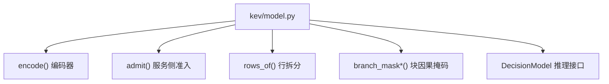
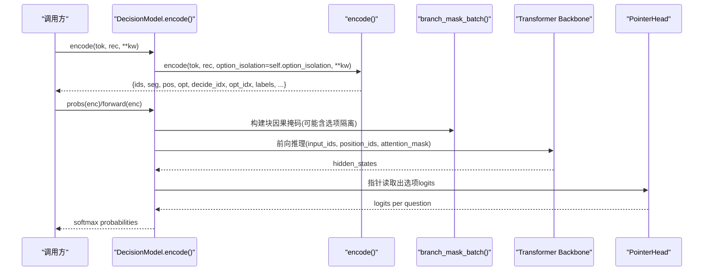
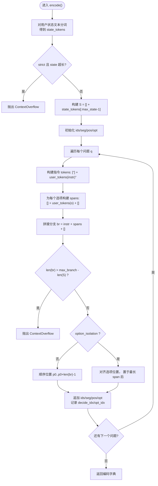
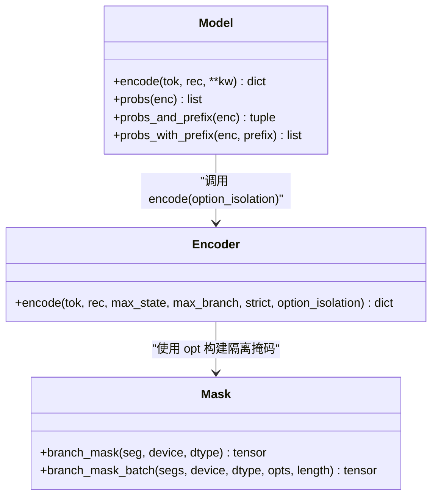
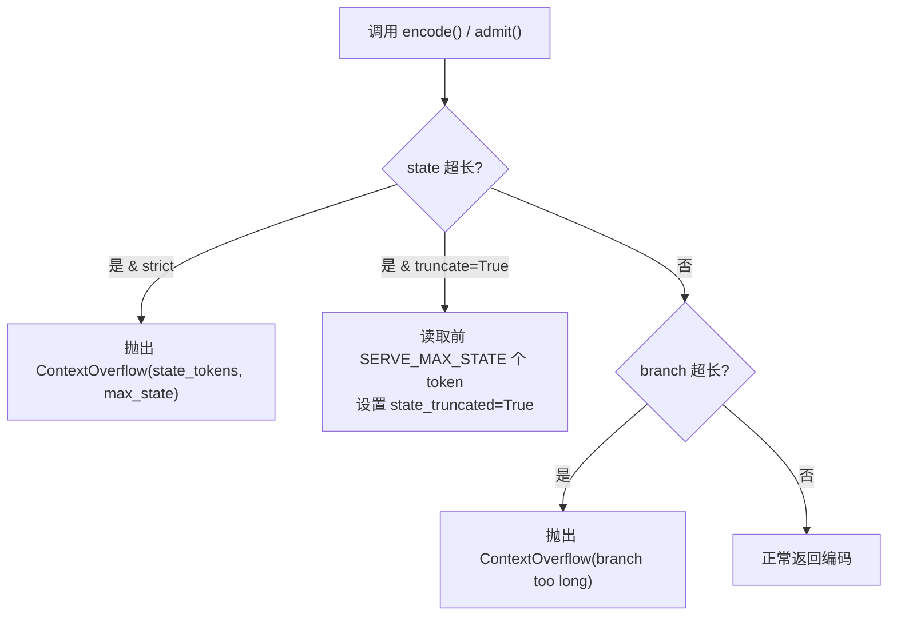
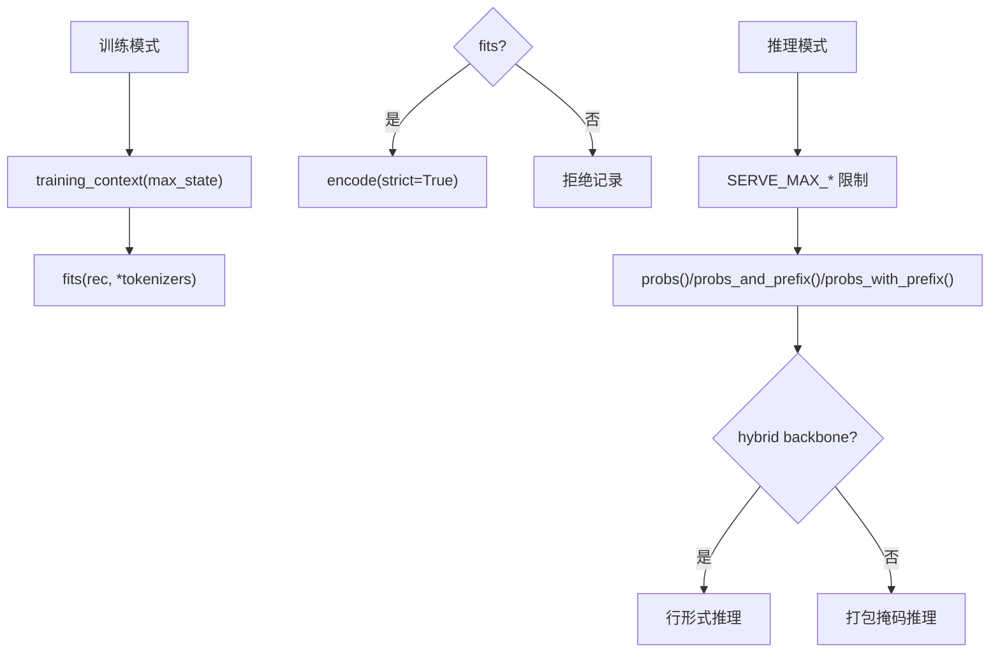
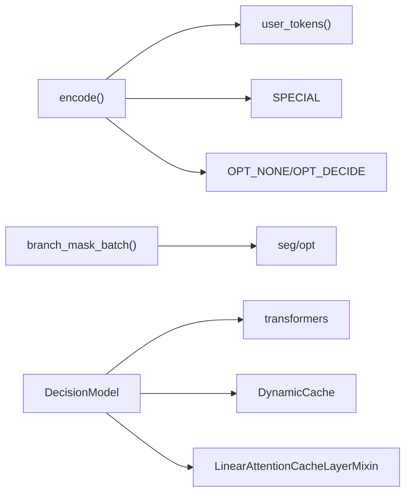

# 编码机制与Token序列构建

<cite>
**本文引用的文件**   
- [model.py](file://kev/model.py)
</cite>

## 目录
1. [引言](#引言)
2. [项目结构](#项目结构)
3. [核心组件](#核心组件)
4. [架构总览](#架构总览)
5. [详细组件分析](#详细组件分析)
6. [依赖关系分析](#依赖关系分析)
7. [性能考量](#性能考量)
8. [故障排查指南](#故障排查指南)
9. [结论](#结论)

## 引言
本文聚焦 Kev 决策模型的编码机制，重点解释 encode() 如何将“状态文本 + 问题指令 + 选项列表”组合成模型可消费的 token 序列。文档涵盖：
- 特殊 token 系统：<state>、<q>、<opt>...</opt>、<decide>
- 分支构建与位置/段/选项索引的生成
- option_isolation（选项隔离）模式及其排列不变性
- ContextOverflow 异常处理与 state_truncated 标志
- 训练模式与推理模式的编码差异
- 面向初学者的概念说明与面向专家的性能优化建议、调试技巧

## 项目结构
本项目的编码逻辑集中在 kev/model.py 中，包含：
- 特殊 token 定义与上下文长度限制常量
- encode() 主编码器
- admit() 服务侧准入检查
- rows_of() 将打包编码拆分为“状态 + 每问分支”的行形式
- branch_mask()/branch_mask_batch() 块因果注意力掩码
- DecisionModel 类封装了编码、前向、概率计算、KV 缓存等推理能力

图表来源
- [model.py:87-127](file://kev/model.py#L87-L127)
- [model.py:130-143](file://kev/model.py#L130-L143)
- [model.py:188-202](file://kev/model.py#L188-L202)
- [model.py:154-185](file://kev/model.py#L154-L185)
- [model.py:243-509](file://kev/model.py#L243-L509)

章节来源
- [model.py:1-509](file://kev/model.py#L1-L509)

## 核心组件
- 特殊 token 与上下文限制
  - 使用 Qwen tokenizer 的特殊 token 作为分隔符：<state>、<q>、<opt>、</opt>、<decide>
  - 训练上下文：MAX_STATE=384、MAX_BRANCH=1024、MAX_PACKED=2048
  - 服务上下文：SERVE_MAX_STATE=65536、SERVE_MAX_BRANCH=SERVE_MAX_STATE+8192、SERVE_MAX_PACKED=SERVE_MAX_STATE+SERVE_MAX_BRANCH
  - ROW_PASS_TOKENS=16384：一次推理 pass 能容纳的最大 token 数

- encode() 编码器
  - 输入：tokenizer、记录 rec（含 state、questions），可选参数 max_state、max_branch、strict、option_isolation
  - 输出：ids、seg、pos、opt、decide_idx、opt_idx、labels、state_tokens、state_truncated、option_isolation

- admit() 服务侧准入
  - 基于 SERVE_MAX_* 限制进行严格或截断式检查
  - 当 state 超长时抛出 ContextOverflow，并携带 state_tokens 与 max_state

- rows_of() 行拆分
  - 将打包编码拆为 (state_ids, state_pos, rows)，其中每个 row 对应一个问题的分支

- branch_mask()/branch_mask_batch() 块因果掩码
  - 保证同一问题内各 token 仅关注自身及之前 token；在 option_isolation 下，选项 token 只能关注其自身 span、指令和状态，<decide> 可关注整条分支

- DecisionModel
  - 封装 encode()、forward/probs、prefix/probs_and_prefix/probs_with_prefix、batched 推理等
  - 支持 hybrid backbones（如 Qwen3.5）与 attention-only backbones 的不同路径

章节来源
- [model.py:9-28](file://kev/model.py#L9-L28)
- [model.py:87-127](file://kev/model.py#L87-L127)
- [model.py:130-143](file://kev/model.py#L130-L143)
- [model.py:154-185](file://kev/model.py#L154-L185)
- [model.py:188-202](file://kev/model.py#L188-L202)
- [model.py:243-509](file://kev/model.py#L243-L509)

## 架构总览
下图展示从输入记录到 token 序列、再到模型推理的关键流程。

图表来源
- [model.py:294-296](file://kev/model.py#L294-L296)
- [model.py:87-127](file://kev/model.py#L87-L127)
- [model.py:159-185](file://kev/model.py#L159-L185)
- [model.py:385-394](file://kev/model.py#L385-L394)
- [model.py:396-402](file://kev/model.py#L396-L402)

## 详细组件分析

### encode() 工作原理
encode() 负责将“状态 + 多问题”打包为一个连续 token 序列，并为每个 token 标注：
- ids：token id 序列
- seg：段编号（0=状态，k=第k个问题）
- pos：位置索引（状态后分支位置从状态长度起重新计数）
- opt：每 token 的选项编号（OPT_NONE/OPT_DECIDE 或选项序号）
- decide_idx：每个问题的 <decide> 在 ids 中的位置
- opt_idx：每个问题的每个选项结束位置的索引列表
- labels：每个问题的标签
- state_tokens：原始状态的 token 数量（含 <state>）
- state_truncated：是否发生状态截断

关键步骤：
1. 对 rec["state"] 进行用户文本分词，得到 state_tokens
2. 若 strict=True 且 len(state_tokens)+1 > max_state，抛出 ContextOverflow
3. 构造 S = [<state>] + state_tokens[:max_state-1]
4. 对每个问题 q：
   - 指令部分：[<q>] + user_tokens(q["instr"])
   - 选项部分：对每个选项 o，构造 [<opt>] + user_tokens(o) + [</opt>]
   - 拼接分支 br = instr + 所有选项span + [<decide>]
   - 校验分支长度：len(br) > max_branch - len(S) 则抛错
   - 根据 option_isolation 决定 pos 策略：
     - 非隔离：顺序位置 p0..p0+len(br)-1
     - 隔离：指令位置固定，每个选项 span 的位置对齐到相同偏移，<decide> 放在最长 span 之后
   - 更新 ids/seg/pos/opt，并记录 decide_idx 与 opt_idx

图表来源
- [model.py:87-127](file://kev/model.py#L87-L127)

章节来源
- [model.py:87-127](file://kev/model.py#L87-L127)

### 特殊 token 系统设计
- <state>：标记状态开始
- <q>：标记问题指令开始
- <opt>...</opt>：包裹每个选项
- <decide>：标记决策位置（每个问题末尾）

这些 token 复用 Qwen tokenizer 的特殊 token，避免新增 embedding 行，LoRA 即可适配其语义。

章节来源
- [model.py:9-11](file://kev/model.py#L9-L11)
- [model.py:87-127](file://kev/model.py#L87-L127)

### option_isolation 模式与排列不变性
- 目标：使每个选项成为独立子分支，实现排列不变性（选项顺序不影响结果）
- 行为：
  - 每个选项 span 共享相同的 position ids（相对指令后的偏移一致）
  - <decide> 位于最长 span 之后的固定位置
  - 掩码层确保选项 token 仅关注自身 span、指令与状态，<decide> 可关注整条分支
- 效果：
  - 每个选项的表示与其在列表中的位置解耦
  - 指针头对选项的注意力具备排列不变性

图表来源
- [model.py:87-127](file://kev/model.py#L87-L127)
- [model.py:159-185](file://kev/model.py#L159-L185)
- [model.py:294-296](file://kev/model.py#L294-L296)

章节来源
- [model.py:87-127](file://kev/model.py#L87-L127)
- [model.py:159-185](file://kev/model.py#L159-L185)
- [model.py:294-296](file://kev/model.py#L294-L296)

### ContextOverflow 异常处理与 state_truncated
- ContextOverflow(ValueError)：当记录无法在上下文限制内编码时抛出
  - 属性：state_tokens（状态 token 数，含 <state>）、max_state（限制）
- 触发场景：
  - strict=True 且 state 超长
  - 分支过长（state + branch > max_branch）
- admit() 服务侧：
  - 默认严格检查（truncate=False）
  - truncate=True 时允许读取前 SERVE_MAX_STATE 个 token，并在编码中标记 state_truncated
- state_truncated：
  - 编码结果中包含该标志，指示状态被截断

图表来源
- [model.py:50-58](file://kev/model.py#L50-L58)
- [model.py:101-113](file://kev/model.py#L101-L113)
- [model.py:130-143](file://kev/model.py#L130-L143)

章节来源
- [model.py:50-58](file://kev/model.py#L50-L58)
- [model.py:101-113](file://kev/model.py#L101-L113)
- [model.py:130-143](file://kev/model.py#L130-L143)

### 训练模式与推理模式的编码差异
- 训练模式：
  - 使用 training_context(max_state) 调整上下文限制，保持 row/packed 预算一致
  - 通过 fits() 检查记录是否在 MAX_STATE/MAX_BRANCH/MAX_PACKED 内严格编码
- 推理模式：
  - 使用 SERVE_MAX_* 限制
  - DecisionModel.probs()/probs_and_prefix()/probs_with_prefix() 支持 KV 缓存与行形式推理
  - 对于 hybrid backbones（如 Qwen3.5），总是以行形式运行（无法尊重打包掩码）

图表来源
- [model.py:31-38](file://kev/model.py#L31-L38)
- [model.py:145-151](file://kev/model.py#L145-L151)
- [model.py:396-402](file://kev/model.py#L396-L402)
- [model.py:416-462](file://kev/model.py#L416-L462)
- [model.py:329-333](file://kev/model.py#L329-L333)

章节来源
- [model.py:31-38](file://kev/model.py#L31-L38)
- [model.py:145-151](file://kev/model.py#L145-L151)
- [model.py:329-333](file://kev/model.py#L329-L333)
- [model.py:396-402](file://kev/model.py#L396-L402)
- [model.py:416-462](file://kev/model.py#L416-L462)

### 代码示例（路径引用）
- 基本编码（无隔离）：
  - 参考路径：[model.py:87-127](file://kev/model.py#L87-L127)
- 选项隔离模式：
  - 参考路径：[model.py:87-127](file://kev/model.py#L87-L127), [model.py:159-185](file://kev/model.py#L159-L185)
- 服务侧准入与截断：
  - 参考路径：[model.py:130-143](file://kev/model.py#L130-L143)
- 行形式拆分：
  - 参考路径：[model.py:188-202](file://kev/model.py#L188-L202)

## 依赖关系分析
- encode() 依赖：
  - user_tokens()：对用户文本安全分词，避免伪造分隔符
  - SPECIAL：特殊 token 列表
  - OPT_NONE/OPT_DECIDE：选项索引占位符
- branch_mask_batch() 依赖：
  - seg/opt：用于构建块因果与选项隔离掩码
- DecisionModel 依赖：
  - transformers.AutoModel/AutoModelForCausalLM：加载 backbone
  - DynamicCache：KV 缓存
  - LinearAttentionCacheLayerMixin：Hybrid 模型状态复制

图表来源
- [model.py:78-81](file://kev/model.py#L78-L81)
- [model.py:84-85](file://kev/model.py#L84-L85)
- [model.py:159-185](file://kev/model.py#L159-L185)
- [model.py:243-278](file://kev/model.py#L243-L278)
- [model.py:345-357](file://kev/model.py#L345-L357)

章节来源
- [model.py:78-81](file://kev/model.py#L78-L81)
- [model.py:84-85](file://kev/model.py#L84-L85)
- [model.py:159-185](file://kev/model.py#L159-L185)
- [model.py:243-278](file://kev/model.py#L243-L278)
- [model.py:345-357](file://kev/model.py#L345-L357)

## 性能考量
- 批处理与行形式：
  - rows_per_pass() 控制一次推理 pass 处理的行数，避免内存峰值过高
  - rows_form() 判断何时使用行形式（hybrid 或 packed 过长）
- KV 缓存：
  - prefix()/probs_and_prefix()/probs_with_prefix() 复用状态 KV，减少重复计算
- 形状桶（MPS）：
  - SHAPE_BUCKET 将序列长度对齐到倍数，预热 kernel，提升 MPS 推理效率
- 混合后端：
  - hybrid backbones 必须使用行形式，注意其状态重算开销

章节来源
- [model.py:41-47](file://kev/model.py#L41-L47)
- [model.py:329-333](file://kev/model.py#L329-L333)
- [model.py:301-314](file://kev/model.py#L301-L314)
- [model.py:416-462](file://kev/model.py#L416-L462)

## 故障排查指南
- ContextOverflow 常见原因：
  - 状态过长：检查 state_tokens 与 max_state，考虑 split 请求或缩短状态
  - 分支过长：检查 questions/options 长度，减少选项数量或缩短选项文本
- state_truncated 标志：
  - 若为 True，说明状态被截断，需评估下游任务对状态长度的敏感性
- 选项隔离模式问题：
  - 确认 option_isolation 与 backbone 类型兼容（hybrid 不支持）
  - 检查掩码是否正确构建（seg/opt 一致性）

章节来源
- [model.py:50-58](file://kev/model.py#L50-L58)
- [model.py:101-113](file://kev/model.py#L101-L113)
- [model.py:130-143](file://kev/model.py#L130-L143)
- [model.py:263-264](file://kev/model.py#L263-L264)

## 结论
Kev 的编码机制通过精心设计的特殊 token 与块因果掩码，实现了状态与问题分支的结构化组织。encode() 提供灵活的选项隔离模式，确保排列不变性与高效推理。ContextOverflow 与 state_truncated 提供了健壮的错误处理与可观测性。结合训练/推理模式的差异化处理，系统在准确性与性能之间取得平衡。