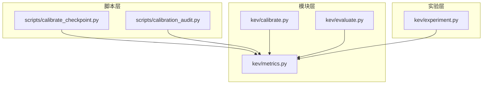
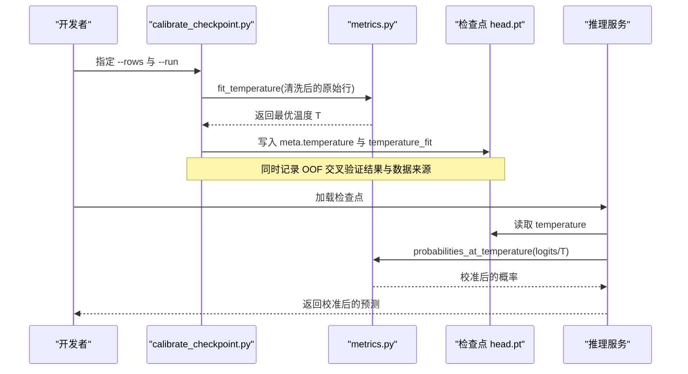
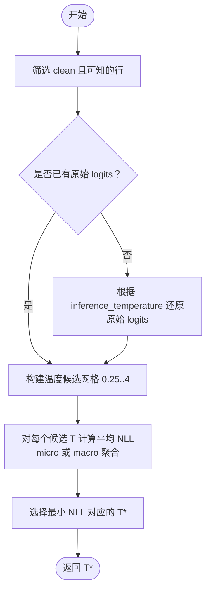
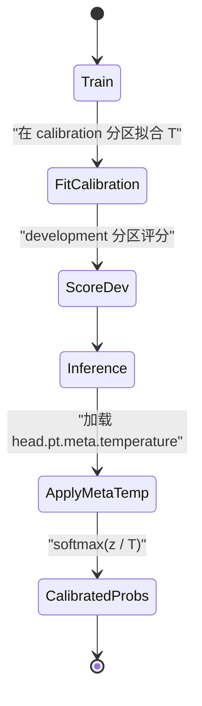
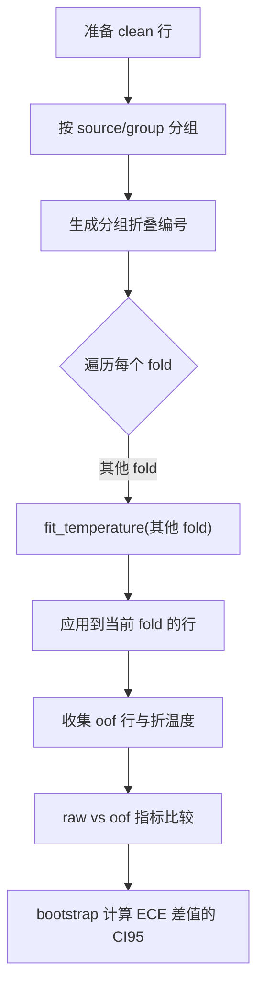
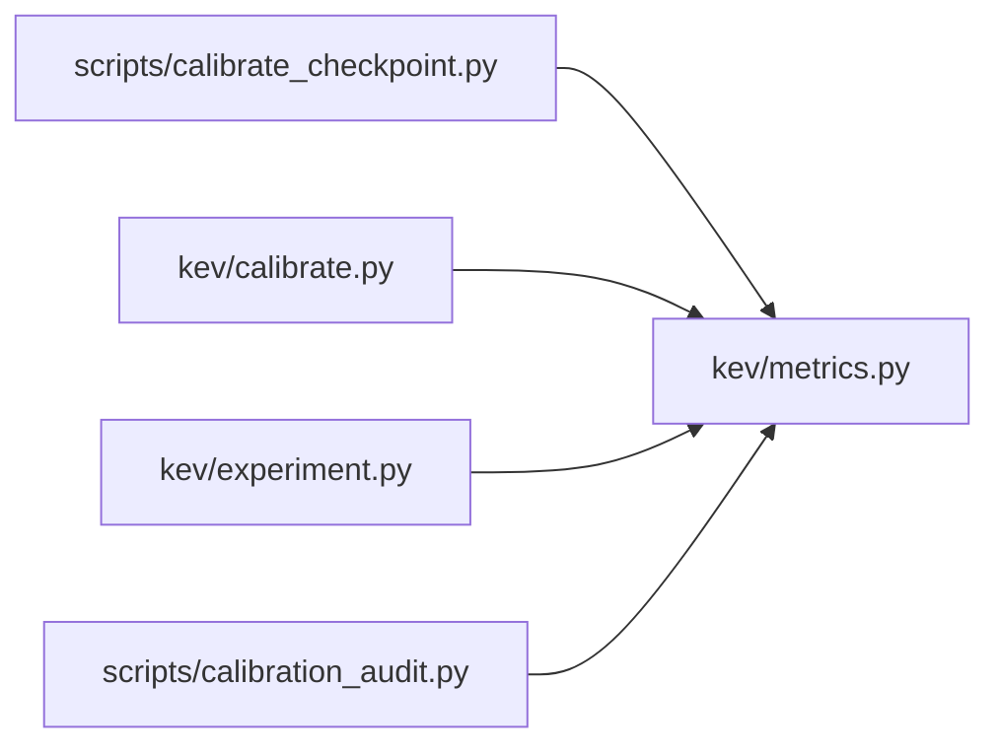

<cite>
**本文引用的文件**   
- [scripts/calibrate_checkpoint.py](file://scripts/calibrate_checkpoint.py)
- [kev/calibrate.py](file://kev/calibrate.py)
- [kev/metrics.py](file://kev/metrics.py)
- [kev/experiment.py](file://kev/experiment.py)
- [kev/evaluate.py](file://kev/evaluate.py)
- [scripts/calibration_audit.py](file://scripts/calibration_audit.py)
</cite>

## 目录
1. [引言](#引言)
2. [项目结构](#项目结构)
3. [核心组件](#核心组件)
4. [架构总览](#架构总览)
5. [详细组件分析](#详细组件分析)
6. [依赖关系分析](#依赖关系分析)
7. [性能与数值特性](#性能与数值特性)
8. [故障排查指南](#故障排查指南)
9. [结论](#结论)
10. [附录：使用示例与最佳实践](#附录使用示例与最佳实践)

## 引言
本文件面向“概率校准”这一主题，围绕温度缩放（Temperature Scaling）在该项目中的实现、训练与推理行为差异、开发集上拟合最优温度、推理时应用温度、以及校准质量评估（尤其是 ECE）进行系统化说明。文档既为初学者解释概率校准的概念与重要性，也为专家提供策略选择与优化建议。

温度缩放的本质是引入一个标量参数 T，对模型输出的 logits 进行缩放后再做 softmax，从而调节输出概率分布的平滑程度，改善置信度估计的准确性。T > 1 会使分布更平滑（降低极端置信），T < 1 则使分布更尖锐（提高极端置信）。

## 项目结构
本项目中与概率校准相关的关键代码分布在以下位置：
- 脚本层：用于为新检查点计算并写入最优温度，或生成校准审计报告
- 模块层：封装了温度拟合、指标计算、交叉验证与配对 bootstrap 等通用能力
- 实验层：在研究流程中按分区训练、校准与评分

图表来源
- [scripts/calibrate_checkpoint.py:1-32](file://scripts/calibrate_checkpoint.py#L1-L32)
- [scripts/calibration_audit.py:1-16](file://scripts/calibration_audit.py#L1-L16)
- [kev/calibrate.py:1-17](file://kev/calibrate.py#L1-L17)
- [kev/metrics.py:1-6](file://kev/metrics.py#L1-L6)
- [kev/evaluate.py:1-9](file://kev/evaluate.py#L1-L9)
- [kev/experiment.py:1-6](file://kev/experiment.py#L1-L6)

章节来源
- [scripts/calibrate_checkpoint.py:1-32](file://scripts/calibrate_checkpoint.py#L1-L32)
- [scripts/calibration_audit.py:1-16](file://scripts/calibration_audit.py#L1-L16)
- [kev/calibrate.py:1-17](file://kev/calibrate.py#L1-L17)
- [kev/metrics.py:1-6](file://kev/metrics.py#L1-L6)
- [kev/evaluate.py:1-9](file://kev/evaluate.py#L1-L9)
- [kev/experiment.py:1-6](file://kev/experiment.py#L1-L6)

## 核心组件
本节聚焦温度缩放的核心实现与调用路径：
- 指标与温度操作：[kev/metrics.py]
- 工作负载校准报告：[kev/calibrate.py]
- 检查点温度拟合与写入：[scripts/calibrate_checkpoint.py]
- 实验流程中的校准与评分：[kev/experiment.py]
- 原型温度缩放测试：[kev/evaluate.py]
- 校准审计与对比：[scripts/calibration_audit.py]

章节来源
- [kev/metrics.py:14-53](file://kev/metrics.py#L14-L53)
- [kev/metrics.py:276-294](file://kev/metrics.py#L276-L294)
- [kev/calibrate.py:28-44](file://kev/calibrate.py#L28-L44)
- [scripts/calibrate_checkpoint.py:115-157](file://scripts/calibrate_checkpoint.py#L115-L157)
- [kev/experiment.py:320-369](file://kev/experiment.py#L320-L369)
- [kev/evaluate.py:164-181](file://kev/evaluate.py#L164-L181)
- [scripts/calibration_audit.py:92-144](file://scripts/calibration_audit.py#L92-L144)

## 架构总览
下图展示了从数据到校准、再到评估与部署的整体流程。

图表来源
- [scripts/calibrate_checkpoint.py:115-157](file://scripts/calibrate_checkpoint.py#L115-L157)
- [kev/metrics.py:276-294](file://kev/metrics.py#L276-L294)
- [kev/metrics.py:39-45](file://kev/metrics.py#L39-L45)

## 详细组件分析

### 温度缩放数学原理与实现要点
- 目标函数：在候选温度集合上最小化平均负对数似然（NLL）。
- 候选温度：在对数空间均匀采样（例如 0.25..4），通过 exp 映射回正实数域。
- 聚合方式：支持 micro 与 macro 两种聚合；macro 会按任务计数加权。
- 输入要求：必须基于“原始 logits”，若行已带 inference_temperature，需先还原为 T=1 的原始 logits。
- 输出：返回最优温度 T。

关键实现要点（对应源码位置）：
- NLL 与概率计算：[kev/metrics.py:48-53], [kev/metrics.py:39-45]
- 温度网格搜索与聚合：[kev/metrics.py:276-294]
- 行级 logits 恢复与温度变换：[kev/metrics.py:232-243], [kev/metrics.py:224-229]

图表来源
- [kev/metrics.py:276-294](file://kev/metrics.py#L276-L294)
- [kev/metrics.py:232-243](file://kev/metrics.py#L232-L243)

章节来源
- [kev/metrics.py:39-53](file://kev/metrics.py#L39-L53)
- [kev/metrics.py:224-243](file://kev/metrics.py#L224-L243)
- [kev/metrics.py:276-294](file://kev/metrics.py#L276-L294)

### 训练模式与推理模式的温度行为
- 训练阶段：
  - 实验流程在 calibration 分区上拟合温度，但用于训练和评分的 predictor 以 temperature=1.0 加载，以保证梯度传播不受温度影响。
  - 在校准分区上得到 in-trial 的温度值，仅作为研究筛选指标，不直接写入检查点。
- 推理阶段：
  - 通过 scripts/calibrate_checkpoint.py 将“来自独立数据集池”的最优温度写入检查点的 meta.temperature。
  - 推理服务加载检查点后，默认使用该温度进行概率校准。

关键实现要点（对应源码位置）：
- 训练侧：[kev/experiment.py:320-369]
- 推理侧写入：[scripts/calibrate_checkpoint.py:141-157]

图表来源
- [kev/experiment.py:320-369](file://kev/experiment.py#L320-L369)
- [scripts/calibrate_checkpoint.py:141-157](file://scripts/calibrate_checkpoint.py#L141-L157)

章节来源
- [kev/experiment.py:320-369](file://kev/experiment.py#L320-L369)
- [scripts/calibrate_checkpoint.py:141-157](file://scripts/calibrate_checkpoint.py#L141-L157)

### 开发集上拟合最优温度与交叉验证
- 单行温度拟合：在清洗后的原始行上执行网格搜索，选择最小 NLL 的温度。
- 交叉验证：按 (source, group) 分组划分 fold，保证同组样本不跨 fold；每折用其余折拟合温度，再应用到该折，得到 out-of-fold 的概率。
- 统计推断：对 ECE 等非线性指标，使用源分层的 paired bootstrap 计算 95% 置信区间，判断 raw vs oof 的差异是否显著。

关键实现要点（对应源码位置）：
- 交叉验证温度：[kev/metrics.py:333-348], [kev/metrics.py:351-369]
- 分组折叠与聚类重采样：[kev/metrics.py:317-330], [kev/metrics.py:308-315]
- 配对 bootstrap：[kev/metrics.py:372-426]

图表来源
- [kev/metrics.py:317-348](file://kev/metrics.py#L317-L348)
- [kev/metrics.py:351-369](file://kev/metrics.py#L351-L369)
- [kev/metrics.py:372-426](file://kev/metrics.py#L372-L426)

章节来源
- [kev/metrics.py:308-369](file://kev/metrics.py#L308-L369)
- [kev/metrics.py:372-426](file://kev/metrics.py#L372-L426)

### 校准效果评估：ECE 与其他指标
- ECE（Expected Calibration Error）：按置信度分箱，衡量期望置信与真实正确率的偏差。
- Brier 分数：概率分布的均方误差。
- NLL：负对数似然，温度拟合的目标函数。
- 选择性预测：coverage at error budget（如 5%）、AURC、高置信错误率等。
- 分组与长度维度：可按任务、状态 token 长度等维度拆分评估。

关键实现要点（对应源码位置）：
- ECE 计算：[kev/metrics.py:15-21]
- 综合指标 metrics：[kev/metrics.py:64-100]
- 选择性预测与风险覆盖曲线：[kev/metrics.py:103-146]
- 按长度分桶校准：[kev/metrics.py:206-221]

章节来源
- [kev/metrics.py:15-21](file://kev/metrics.py#L15-L21)
- [kev/metrics.py:64-100](file://kev/metrics.py#L64-L100)
- [kev/metrics.py:103-146](file://kev/metrics.py#L103-L146)
- [kev/metrics.py:206-221](file://kev/metrics.py#L206-L221)

### 工作负载校准报告与审计
- 工作负载报告：针对单个 rows.json，比较 raw、shipped、workload（在该行集上拟合）与 workload_oof（分组不相交的 OOF）四种臂，并给出 ECE/Brier/cov@5%/AURC 的比较与 bootstrap 区间。
- 校准审计：对不同模型/检查点进行横向对比，包括 raw 与 temperature_replay 的描述性统计、风险覆盖曲线、失败案例盲审等。

关键实现要点（对应源码位置）：
- 工作负载报告：[kev/calibrate.py:28-44], [kev/calibrate.py:59-69]
- 校准审计主流程：[scripts/calibration_audit.py:92-144]

章节来源
- [kev/calibrate.py:28-44](file://kev/calibrate.py#L28-L44)
- [kev/calibrate.py:59-69](file://kev/calibrate.py#L59-L69)
- [scripts/calibration_audit.py:92-144](file://scripts/calibration_audit.py#L92-L144)

### 原型温度缩放测试
- 在旧版 evaluate.py 中，提供一个基于 LBFGS 的端到端温度缩放示例：将一半数据用于拟合，另一半用于评估 NLL/ECE 的变化。
- 注意：该路径主要用于历史原型评估，非发布流程。

关键实现要点（对应源码位置）：
- 温度缩放测试函数：[kev/evaluate.py:164-181]

章节来源
- [kev/evaluate.py:164-181](file://kev/evaluate.py#L164-L181)

## 依赖关系分析
- 脚本 calibrate_checkpoint.py 依赖 metrics.py 的 fit_temperature、cross_validated_temperature、metrics 等工具函数，以及 checkpoint 元数据的读写。
- 模块 calibrate.py 依赖 metrics.py 的 fit_temperature、out_of_fold_rows、paired_bootstrap 等。
- 实验 experiment.py 在训练后使用 LocalPredictor 以 temperature=1.0 加载，并在 calibration 分区上拟合温度，随后在 development/transfer 分区评分。
- 审计脚本 calibration_audit.py 依赖 metrics.py 的 metrics、probabilities_at_temperature 等。

图表来源
- [scripts/calibrate_checkpoint.py:37-40](file://scripts/calibrate_checkpoint.py#L37-L40)
- [kev/calibrate.py:21-22](file://kev/calibrate.py#L21-L22)
- [kev/experiment.py:33-36](file://kev/experiment.py#L33-L36)
- [scripts/calibration_audit.py:13-15](file://scripts/calibration_audit.py#L13-L15)

章节来源
- [scripts/calibrate_checkpoint.py:37-40](file://scripts/calibrate_checkpoint.py#L37-L40)
- [kev/calibrate.py:21-22](file://kev/calibrate.py#L21-L22)
- [kev/experiment.py:33-36](file://kev/experiment.py#L33-L36)
- [scripts/calibration_audit.py:13-15](file://scripts/calibration_audit.py#L13-L15)

## 性能与数值特性
- 数值稳定性：
  - 计算 tempered logits 时会减去最大值以避免指数溢出。
  - 概率归一化前对 logit 进行稳定处理。
- 复杂度：
  - 温度网格大小固定（例如 121 个点），每次评估对所有候选 T 计算平均 NLL，时间复杂度与候选数量线性相关。
- 内存与批处理：
  - 指标计算基于 numpy，避免 torch 依赖，便于离线评估 saved rows.json。
- 选择性预测：
  - coverage at error budget 与 AURC 的计算基于排序与累积错误，适合大规模批量计算。

章节来源
- [kev/metrics.py:29-36](file://kev/metrics.py#L29-L36)
- [kev/metrics.py:64-100](file://kev/metrics.py#L64-L100)
- [kev/metrics.py:103-146](file://kev/metrics.py#L103-L146)

## 故障排查指南
常见问题与定位方法：
- 无法拟合温度：
  - 原因：没有可用的 clean 标签行，或输入不是原始 logits。
  - 定位：[kev/metrics.py:276-294]
- 行中缺少 logits：
  - 原因：某些历史行未记录 logits，无法还原原始 logits。
  - 定位：[kev/metrics.py:232-243]
- 数据泄露风险：
  - 现象：使用与检查点训练数据重叠的行拟合温度。
  - 解决：使用独立的 held-out datasets 池；脚本会拒绝 in-distribution 行，除非显式允许。
  - 定位：[scripts/calibrate_checkpoint.py:1-32], [scripts/calibrate_checkpoint.py:128-135]
- 温度无效：
  - 现象：temperature 非正或非有限。
  - 定位：[kev/metrics.py:24-26]
- 指标异常：
  - 现象：ECE/Brier/NLL 异常或选择性预测覆盖率异常。
  - 定位：[kev/metrics.py:64-100], [kev/metrics.py:103-146]

章节来源
- [kev/metrics.py:24-26](file://kev/metrics.py#L24-L26)
- [kev/metrics.py:232-243](file://kev/metrics.py#L232-L243)
- [kev/metrics.py:276-294](file://kev/metrics.py#L276-L294)
- [scripts/calibrate_checkpoint.py:1-32](file://scripts/calibrate_checkpoint.py#L1-L32)
- [scripts/calibrate_checkpoint.py:128-135](file://scripts/calibrate_checkpoint.py#L128-L135)
- [kev/metrics.py:64-100](file://kev/metrics.py#L64-L100)
- [kev/metrics.py:103-146](file://kev/metrics.py#L103-L146)

## 结论
本项目实现了完整的温度缩放校准管线：
- 在开发集上基于原始 logits 拟合最优温度，采用微/宏聚合的平均 NLL 作为目标。
- 训练阶段保持 T=1.0 以维持梯度传播，推理阶段应用检查点中记录的 meta.temperature。
- 通过交叉验证与配对 bootstrap 提供稳健的校准质量估计（ECE 等）。
- 提供脚本与审计工具，确保新检查点的温度来自独立数据集池，避免数据泄露。

对于初学者，建议优先理解 ECE 与温度缩放的直观意义；对于专家，建议关注：
- 使用独立数据集池拟合温度，避免 in-distribution 泄露。
- 使用分组不相交交叉验证与配对 bootstrap 评估校准增益的显著性。
- 结合选择性预测指标（cov@5%、AURC）与任务/长度维度分析，定位校准薄弱环节。

## 附录：使用示例与最佳实践

### 为新检查点计算最优温度
- 基本用法：
  - 指定 --run 指向检查点目录，--rows 指向独立的 rows.json（或多个 rows.json 拼接）。
  - 可选 --exclude_rows 排除某些行，--transfer 提供域外 rows.json 用于报告。
  - 可选 --folds 与 --seed 控制交叉验证设置。
- 输出：
  - 将最优温度写入检查点 head.pt.meta.temperature，并在 extra.temperature_fit 中记录拟合细节与 OOF 结果。
- 参考路径：
  - [scripts/calibrate_checkpoint.py:115-157](file://scripts/calibrate_checkpoint.py#L115-L157)

### 工作负载校准报告
- 用途：对单个 rows.json 报告 raw/shipped/workload/workload_oof 四臂的指标与 bootstrap 区间。
- 参考路径：
  - [kev/calibrate.py:28-44](file://kev/calibrate.py#L28-L44)
  - [kev/calibrate.py:59-69](file://kev/calibrate.py#L59-L69)

### 校准审计与对比
- 用途：对不同模型/检查点进行横向对比，包含 raw 与 temperature_replay 的描述性统计、风险覆盖曲线、失败案例盲审等。
- 参考路径：
  - [scripts/calibration_audit.py:92-144](file://scripts/calibration_audit.py#L92-L144)

### 最佳实践建议
- 数据隔离：
  - 始终使用独立于训练集的 held-out datasets 池拟合温度。
  - 避免使用训练源的 calibration/development 分区作为拟合集。
- 指标选择：
  - 以 ECE 为主，辅以 Brier、NLL、cov@5%、AURC 与 confident_error_rate。
- 稳健评估：
  - 使用分组不相交交叉验证与配对 bootstrap，报告 95% CI。
- 部署一致性：
  - 推理服务加载检查点后，默认使用 meta.temperature；如需恢复原始 logits，可通过环境变量或配置关闭温度。

章节来源
- [scripts/calibrate_checkpoint.py:115-157](file://scripts/calibrate_checkpoint.py#L115-L157)
- [kev/calibrate.py:28-44](file://kev/calibrate.py#L28-L44)
- [scripts/calibration_audit.py:92-144](file://scripts/calibration_audit.py#L92-L144)