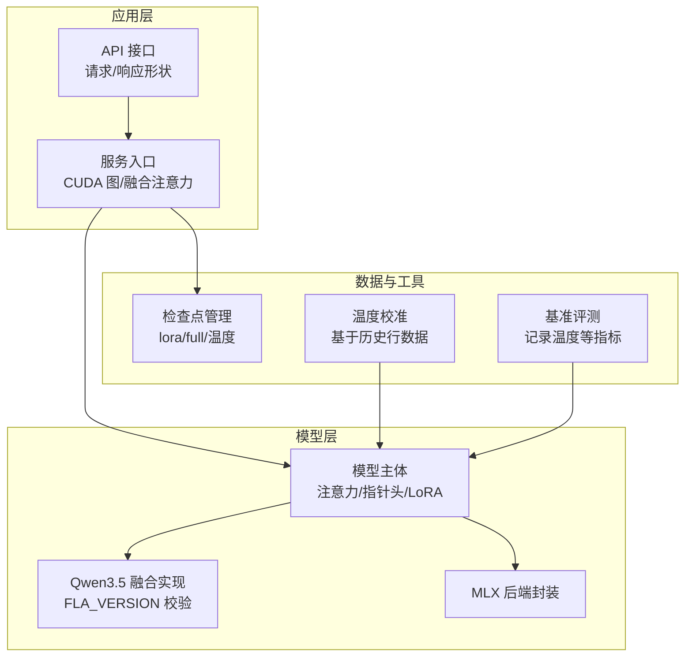
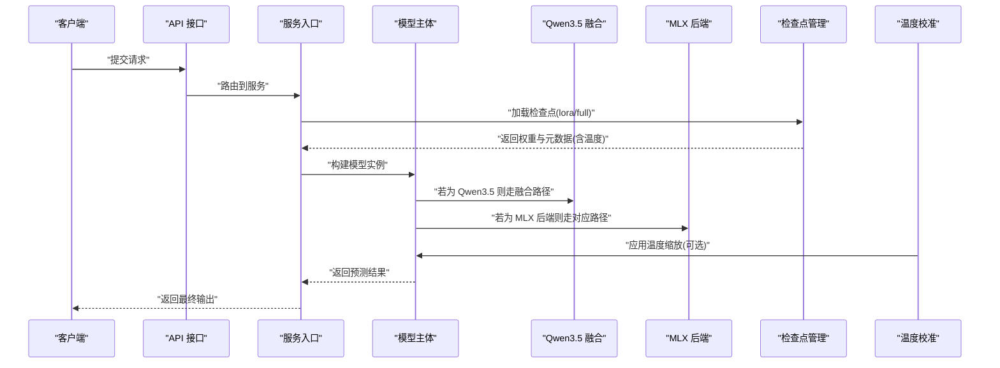
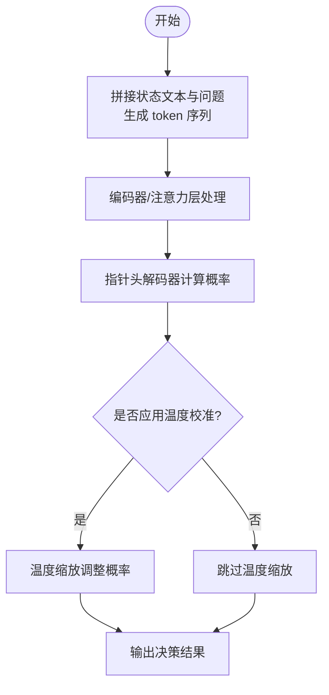
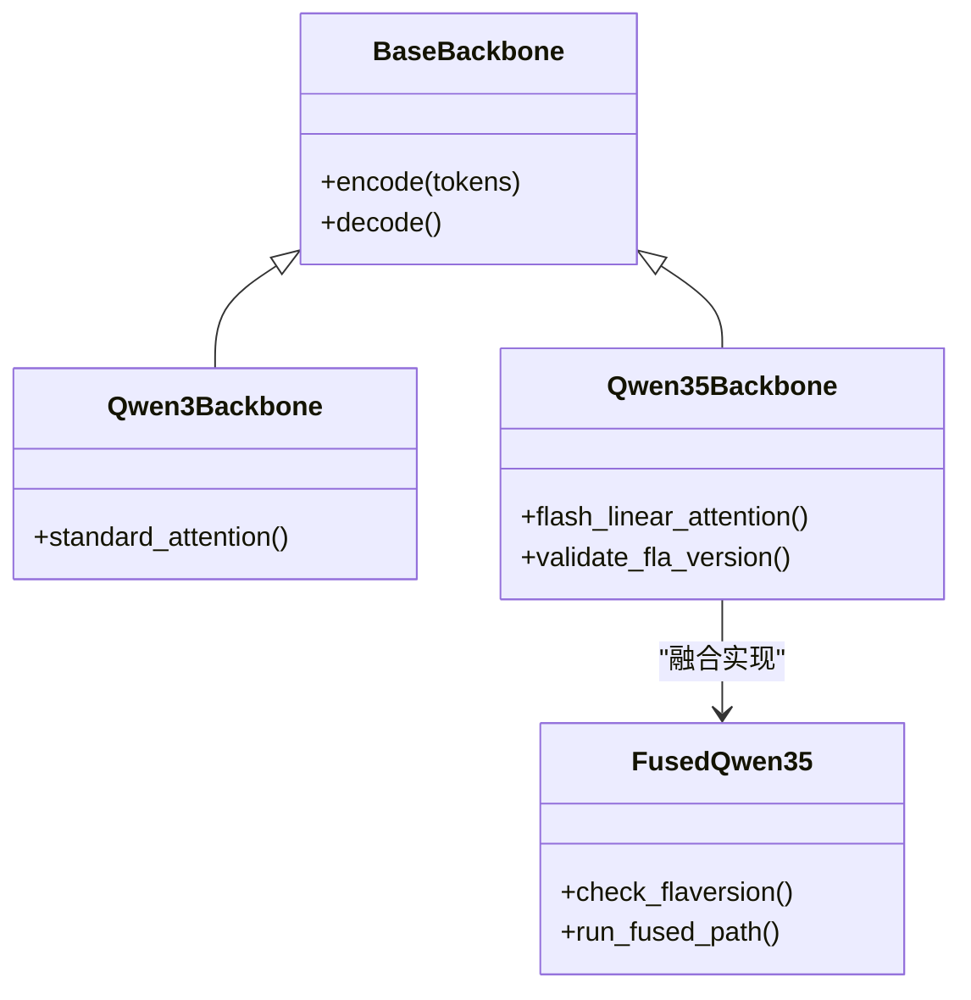
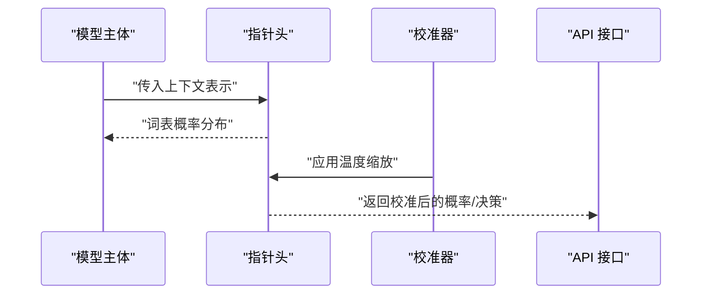
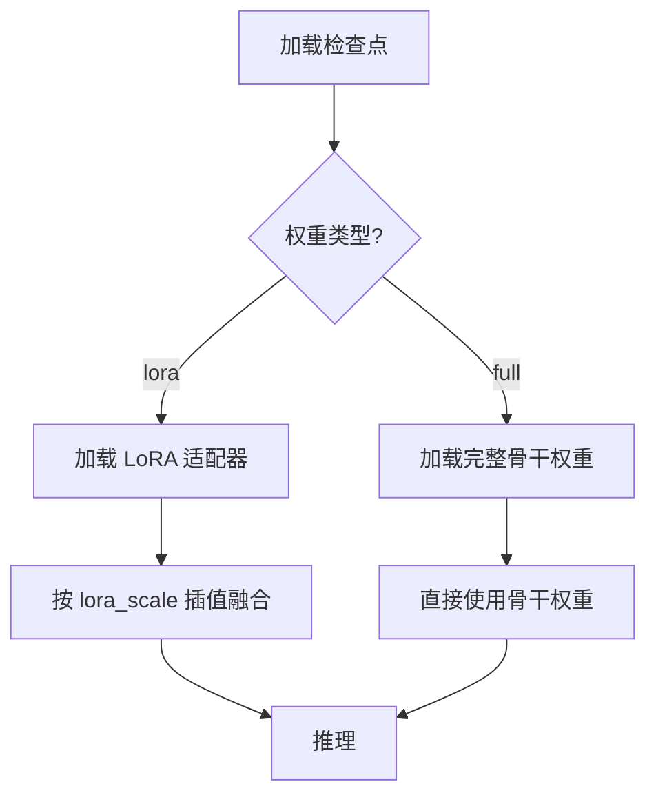
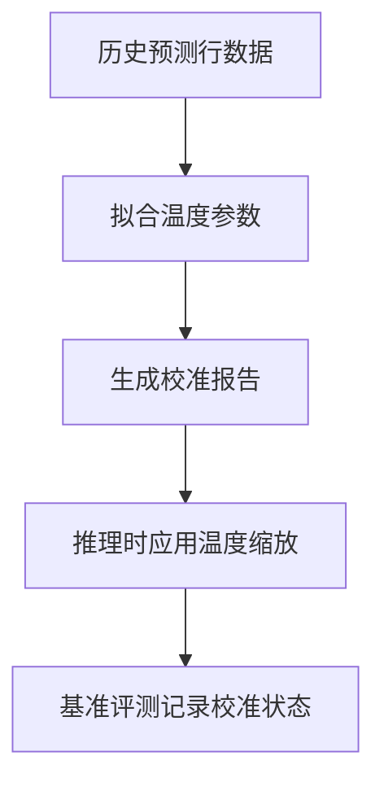
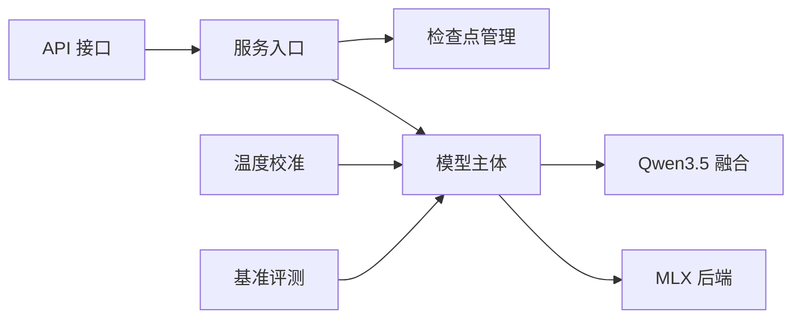

# 模型架构详解

<cite>
**本文引用的文件**   
- [model.py](file://kev/model.py)
- [checkpoint.py](file://kev/checkpoint.py)
- [calibrate.py](file://kev/calibrate.py)
- [api.py](file://kev/api.py)
- [fused_qwen35.py](file://kev/fused_qwen35.py)
- [mlx_model.py](file://kev/mlx_model.py)
- [serve.py](file://kev/serve.py)
- [benchmark.py](file://kev/benchmark.py)
</cite>

## 目录
1. [简介](#简介)
2. [项目结构](#项目结构)
3. [核心组件](#核心组件)
4. [架构总览](#架构总览)
5. [详细组件分析](#详细组件分析)
6. [依赖关系分析](#依赖关系分析)
7. [性能考量](#性能考量)
8. [故障排查指南](#故障排查指南)
9. [结论](#结论)
10. [附录](#附录)

## 简介
本技术文档面向 Kev 决策模型的架构与实现，重点解释以下方面：
- 如何将“状态文本 + 问题”组合为 token 序列并输入模型。
- 注意力机制的实现细节与不同基座模型（Qwen3 vs Qwen3.5/Qwen3.8）的处理差异，包括纯注意力模型与混合注意力/DeltaNet 模型的区别。
- 指针头解码器的工作原理与输出概率校准机制（温度缩放）。
- LoRA 适配器的结构、训练方式与推理优化。
- 从输入到输出的完整数据流，以及关键路径上的性能与可部署性考虑。

## 项目结构
Kev 的核心代码位于 kev 包中，与本架构文档直接相关的模块包括：
- model.py：模型主体、注意力实现、指针头解码器、LoRA 集成等。
- checkpoint.py：检查点元数据、权重加载策略（lora/full）、推理开关（如 flash-linear-attention）。
- calibrate.py：基于历史行数据的温度校准报告生成。
- api.py：面向系统的外部请求/响应形状定义，映射到单一指针原语。
- fused_qwen35.py：针对 Qwen3.5 的融合实现（含 FLA_VERSION 校验）。
- mlx_model.py：MLX 后端相关模型封装。
- serve.py：服务化入口，负责启用 CUDA 图与融合注意力等推理优化。
- benchmark.py：基准评测中对温度等校准信息的记录与统计。

**图表来源**
- [api.py:1-42](file://kev/api.py#L1-L42)
- [serve.py:1-200](file://kev/serve.py#L1-L200)
- [model.py:1-200](file://kev/model.py#L1-L200)
- [fused_qwen35.py:1-200](file://kev/fused_qwen35.py#L1-L200)
- [mlx_model.py:1-200](file://kev/mlx_model.py#L1-L200)
- [checkpoint.py:1-200](file://kev/checkpoint.py#L1-L200)
- [calibrate.py:1-120](file://kev/calibrate.py#L1-L120)
- [benchmark.py:150-210](file://kev/benchmark.py#L150-L210)

**章节来源**
- [api.py:1-42](file://kev/api.py#L1-L42)
- [checkpoint.py:1-200](file://kev/checkpoint.py#L1-L200)
- [calibrate.py:1-120](file://kev/calibrate.py#L1-L120)
- [fused_qwen35.py:1-200](file://kev/fused_qwen35.py#L1-L200)
- [mlx_model.py:1-200](file://kev/mlx_model.py#L1-L200)
- [serve.py:1-200](file://kev/serve.py#L1-L200)
- [benchmark.py:150-210](file://kev/benchmark.py#L150-L210)

## 核心组件
- 模型主体与注意力机制：负责将 token 序列编码为上下文表示，并在解码阶段使用注意力聚合信息。
- 指针头解码器：在词表上计算选择概率，用于决策任务中的“指针式”输出。
- LoRA 适配器：轻量级微调参数，支持在推理时通过插值系数与基座权重融合。
- 检查点管理：区分 lora 与 full 两种权重形态，携带温度等校准元数据。
- 温度校准：根据历史预测行数据拟合温度参数，改善概率校准质量。
- 后端与融合：Qwen3.5 的融合实现（含 FLA_VERSION 校验），MLX 后端封装，服务化时的 CUDA 图与融合注意力开关。

**章节来源**
- [model.py:1-200](file://kev/model.py#L1-L200)
- [checkpoint.py:1-200](file://kev/checkpoint.py#L1-L200)
- [calibrate.py:1-120](file://kev/calibrate.py#L1-L120)
- [fused_qwen35.py:1-200](file://kev/fused_qwen35.py#L1-L200)
- [mlx_model.py:1-200](file://kev/mlx_model.py#L1-L200)
- [serve.py:1-200](file://kev/serve.py#L1-L200)

## 架构总览
下图展示从外部请求到模型推理与输出的端到端流程，涵盖 API 层、服务层、模型层、后端与校准环节。

**图表来源**
- [api.py:1-42](file://kev/api.py#L1-L42)
- [serve.py:1-200](file://kev/serve.py#L1-L200)
- [model.py:1-200](file://kev/model.py#L1-L200)
- [fused_qwen35.py:1-200](file://kev/fused_qwen35.py#L1-L200)
- [mlx_model.py:1-200](file://kev/mlx_model.py#L1-L200)
- [checkpoint.py:1-200](file://kev/checkpoint.py#L1-L200)
- [calibrate.py:1-120](file://kev/calibrate.py#L1-L120)

## 详细组件分析

### 模型主体与注意力机制
- 输入构造：将“状态文本 + 问题”拼接为 token 序列，送入编码器/注意力层。
- 注意力实现：默认使用 SDPA（CUDA）或 eager（其他设备），可通过配置切换；对 Qwen3.5 提供融合实现以加速线性注意力。
- 解码阶段：指针头在词表维度计算概率分布，结合温度缩放进行校准。

**图表来源**
- [model.py:1-200](file://kev/model.py#L1-L200)
- [calibrate.py:1-120](file://kev/calibrate.py#L1-L120)

**章节来源**
- [model.py:1-200](file://kev/model.py#L1-L200)

### 不同类型基座模型的处理差异（Qwen3 vs Qwen3.5/Qwen3.8）
- Qwen3（纯注意力模型）：使用标准注意力实现，推理路径不强制融合。
- Qwen3.5/Qwen3.8（混合注意力/DeltaNet）：通过 fused_qwen35 模块进行融合实现，要求 FLA_VERSION 匹配；否则回退到非融合路径。
- 后端选择：CUDA 下优先 SDPA 或融合线性注意力；MPS 下可能限制某些后端；MLX 后端由 mlx_model 封装。

**图表来源**
- [fused_qwen35.py:1-200](file://kev/fused_qwen35.py#L1-L200)
- [model.py:1-200](file://kev/model.py#L1-L200)

**章节来源**
- [fused_qwen35.py:1-200](file://kev/fused_qwen35.py#L1-L200)
- [model.py:1-200](file://kev/model.py#L1-L200)

### 指针头解码器工作原理
- 在词表维度计算每个 token 的概率，作为决策输出。
- 可与温度缩放结合，使概率更可靠（校准后更接近真实置信度）。
- 在 API 层，外部请求/响应形状被映射到单一指针原语，简化调用方集成。

**图表来源**
- [model.py:1-200](file://kev/model.py#L1-L200)
- [calibrate.py:1-120](file://kev/calibrate.py#L1-L120)
- [api.py:1-42](file://kev/api.py#L1-L42)

**章节来源**
- [model.py:1-200](file://kev/model.py#L1-L200)
- [calibrate.py:1-120](file://kev/calibrate.py#L1-L120)
- [api.py:1-42](file://kev/api.py#L1-L42)

### LoRA 适配器的结构与训练/推理优化
- 检查点元数据包含 lora_scale（WiSE-FT 风格插值系数），在推理时按系数融合基座与微调权重。
- 权重形态分为 lora（仅适配器）与 full（完整骨干），加载策略由检查点管理决定。
- 训练时可仅更新 LoRA 参数，降低显存占用；推理时通过 lora_scale 控制融合程度。

**图表来源**
- [checkpoint.py:1-200](file://kev/checkpoint.py#L1-L200)

**章节来源**
- [checkpoint.py:1-200](file://kev/checkpoint.py#L1-L200)

### 概率校准机制与温度缩放
- 温度缩放通过对 logits 除以温度参数 t 来平滑或锐化概率分布，t > 1 更平滑，t < 1 更锐利。
- calibrate.py 基于历史预测行数据拟合最优温度，生成校准报告。
- 在推理路径中，若检测到 temperature != 1.0，则在基准评测中记录已应用校准。

**图表来源**
- [calibrate.py:1-120](file://kev/calibrate.py#L1-L120)
- [benchmark.py:150-210](file://kev/benchmark.py#L150-L210)

**章节来源**
- [calibrate.py:1-120](file://kev/calibrate.py#L1-L120)
- [benchmark.py:150-210](file://kev/benchmark.py#L150-L210)

## 依赖关系分析
- 服务层依赖检查点管理与模型主体，必要时调用融合实现与后端封装。
- 校准模块独立于推理主路径，但可在推理前注入温度参数。
- 基准评测模块读取模型的温度属性，用于统计与可视化。

**图表来源**
- [api.py:1-42](file://kev/api.py#L1-L42)
- [serve.py:1-200](file://kev/serve.py#L1-L200)
- [checkpoint.py:1-200](file://kev/checkpoint.py#L1-L200)
- [model.py:1-200](file://kev/model.py#L1-L200)
- [fused_qwen35.py:1-200](file://kev/fused_qwen35.py#L1-L200)
- [mlx_model.py:1-200](file://kev/mlx_model.py#L1-L200)
- [calibrate.py:1-120](file://kev/calibrate.py#L1-L120)
- [benchmark.py:150-210](file://kev/benchmark.py#L150-L210)

**章节来源**
- [api.py:1-42](file://kev/api.py#L1-L42)
- [serve.py:1-200](file://kev/serve.py#L1-L200)
- [checkpoint.py:1-200](file://kev/checkpoint.py#L1-L200)
- [model.py:1-200](file://kev/model.py#L1-L200)
- [fused_qwen35.py:1-200](file://kev/fused_qwen35.py#L1-L200)
- [mlx_model.py:1-200](file://kev/mlx_model.py#L1-L200)
- [calibrate.py:1-120](file://kev/calibrate.py#L1-L120)
- [benchmark.py:150-210](file://kev/benchmark.py#L150-L210)

## 性能考量
- 注意力后端：CUDA 下优先 SDPA 或融合线性注意力；MPS 下可能受限，需回退到 eager。
- 融合实现：Qwen3.5 的 fused_qwen35 要求 FLA_VERSION 匹配，否则降级。
- 服务化优化：serve.py 可开启 CUDA 图与融合注意力以提升吞吐。
- LoRA 推理：通过 lora_scale 控制插值，避免全量权重加载带来的内存压力。

[本节为通用性能指导，不直接分析具体文件]

## 故障排查指南
- 检查点加载失败：确认权重类型为 lora 或 full，且路径正确；查看检查点元数据中的 weights 字段。
- 融合实现不可用：核对 FLA_VERSION 是否满足 fused_qwen35 的要求；若不满足，将回退到非融合路径。
- 温度校准未生效：确认 calibrate.py 生成的温度参数已注入模型；在基准评测中检查 calibration_applied 标志。
- 后端异常：根据设备类型（CUDA/MPS/MLX）选择合适的注意力后端；必要时关闭融合或 CUDA 图。

**章节来源**
- [checkpoint.py:1-200](file://kev/checkpoint.py#L1-L200)
- [fused_qwen35.py:1-200](file://kev/fused_qwen35.py#L1-L200)
- [calibrate.py:1-120](file://kev/calibrate.py#L1-L120)
- [serve.py:1-200](file://kev/serve.py#L1-L200)
- [benchmark.py:150-210](file://kev/benchmark.py#L150-L210)

## 结论
Kev 决策模型通过清晰的模块化设计，将输入构造、注意力机制、指针头解码、LoRA 适配与温度校准有机整合。针对不同基座模型（Qwen3 与 Qwen3.5/Qwen3.8），提供了灵活的后端与融合实现，兼顾性能与可部署性。建议在生产环境中启用服务化优化（CUDA 图、融合注意力），并结合历史数据进行温度校准，以获得更可靠的概率输出。

[本节为总结性内容，不直接分析具体文件]

## 附录
- 术语说明：
  - 指针头：在词表维度计算概率的解码头，用于决策任务。
  - 温度缩放：通过温度参数调整 logits 分布，改善概率校准。
  - LoRA：低秩适配器，用于高效微调与推理插值。
  - FLA_VERSION：融合线性注意力的版本约束。

[本节为概念性说明，不直接分析具体文件]