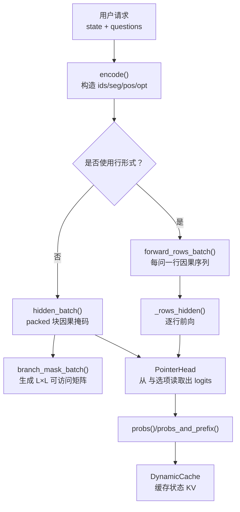
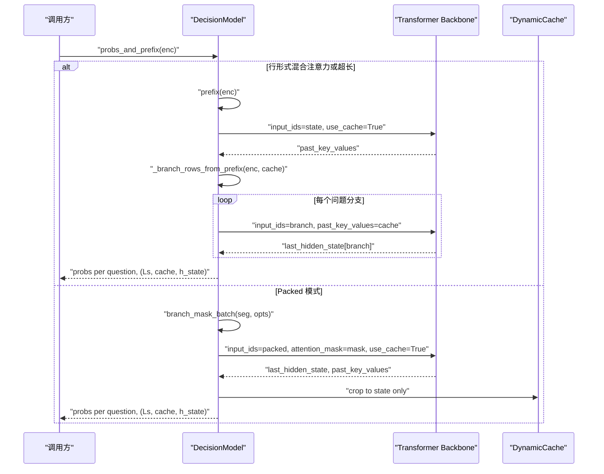
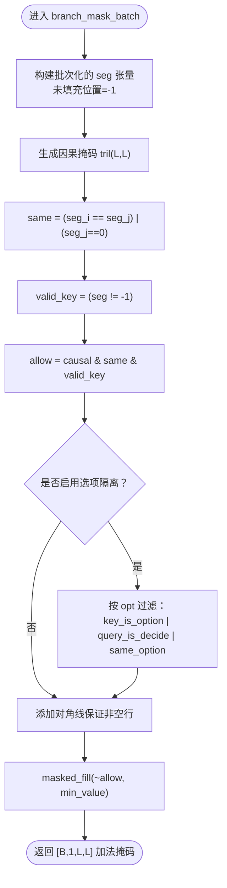
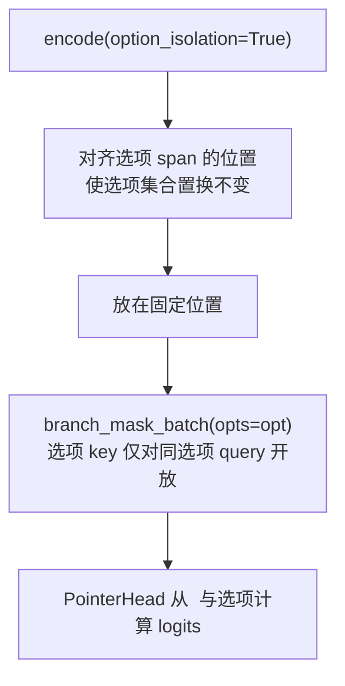
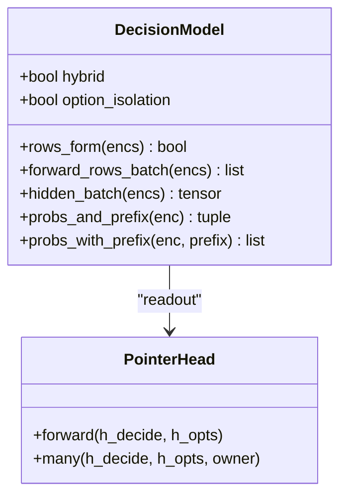
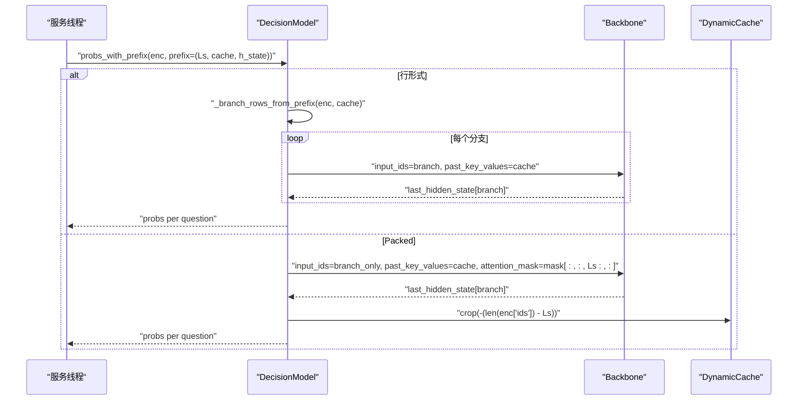
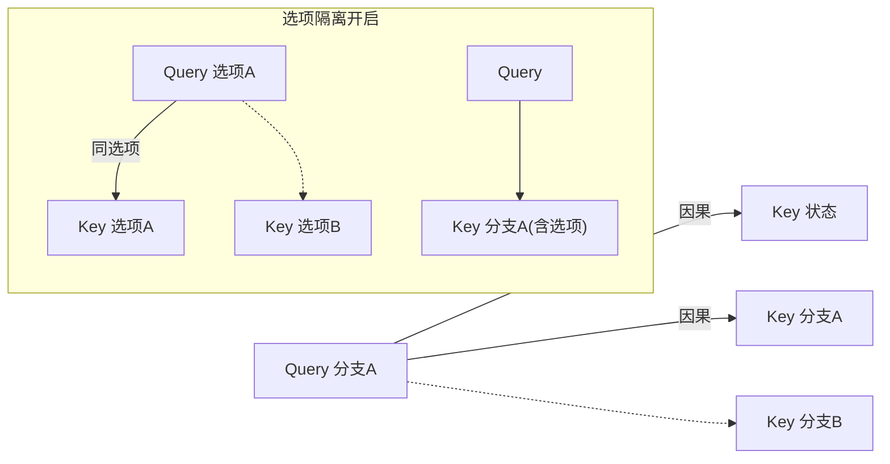
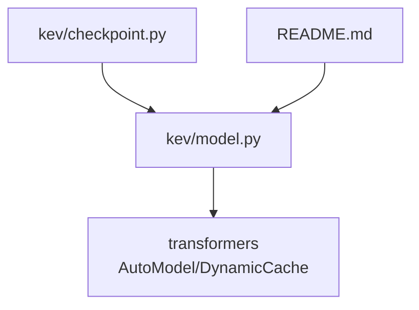

# 注意力机制实现

<cite>
**本文引用的文件**   
- [model.py](file://kev/model.py)
- [README.md](file://README.md)
- [checkpoint.py](file://kev/checkpoint.py)
</cite>

## 目录
1. [简介](#简介)
2. [项目结构](#项目结构)
3. [核心组件](#核心组件)
4. [架构总览](#架构总览)
5. [详细组件分析](#详细组件分析)
6. [依赖关系分析](#依赖关系分析)
7. [性能与优化](#性能与优化)
8. [故障排查指南](#故障排查指南)
9. [结论](#结论)

## 简介
本文聚焦 Kev 决策模型中的注意力机制实现，重点解释以下主题：
- 块因果掩码（block-causal mask）如何保证“状态 tokens”仅被问题分支访问，且不同问题分支相互隔离。
- 选项隔离模式（option_isolation=True）下，每个选项 span 只能看到状态、指令和自身选项。
- 混合注意力模型（Gated DeltaNet）为何不能使用块因果掩码，以及通过“行形式（rows form）”实现等价功能。
- 前缀缓存机制如何通过 DynamicCache 缓存状态 tokens 的 KV 对，减少重复计算。
- 注意力可见性可视化图，帮助初学者理解，同时为专家提供实现细节和优化建议。

## 项目结构
Kev 的核心注意力逻辑集中在模型定义与推理流程中，关键文件如下：
- kev/model.py：定义编码、掩码、模型类、前缀缓存等核心实现。
- README.md：说明混合注意力模型与行形式的行为差异。
- kev/checkpoint.py：加载检查点时传递 option_isolation 等配置。

图表来源
- [model.py:87-127](file://kev/model.py#L87-L127)
- [model.py:154-185](file://kev/model.py#L154-L185)
- [model.py:329-383](file://kev/model.py#L329-L383)
- [model.py:416-462](file://kev/model.py#L416-L462)

章节来源
- [model.py:1-509](file://kev/model.py#L1-L509)

## 核心组件
- 编码器 encode：将 state 与多问题分支打包成统一序列，并记录 segment、位置、选项索引等元信息。
- 块因果掩码 branch_mask / branch_mask_batch：在 packed 模式下生成注意力掩码，确保跨分支不可见、跨选项不可见（除非允许）。
- 行形式 rows_form / forward_rows_batch：当模型为混合注意力或序列过长时，将每个问题作为独立因果行运行。
- 前缀缓存 prefix / probs_and_prefix / probs_with_prefix：用 DynamicCache 缓存状态 tokens 的 KV，避免重复计算。
- PointerHead：从 <decide> token 与选项 token 的表示计算选择概率。

章节来源
- [model.py:87-127](file://kev/model.py#L87-L127)
- [model.py:154-185](file://kev/model.py#L154-L185)
- [model.py:329-383](file://kev/model.py#L329-L383)
- [model.py:416-462](file://kev/model.py#L416-L462)
- [model.py:205-224](file://kev/model.py#L205-L224)

## 架构总览
下图展示 Kev 的端到端注意力处理流程，包括 packed 与 rows 两种路径，以及前缀缓存的使用。

图表来源
- [model.py:416-462](file://kev/model.py#L416-L462)
- [model.py:329-383](file://kev/model.py#L329-L383)
- [model.py:154-185](file://kev/model.py#L154-L185)

## 详细组件分析

### 块因果掩码：branch_mask 与 branch_mask_batch
- 目标：在 packed 输入中，让每个 query 只关注到它“有权访问”的 key。
- 规则：
  - 因果约束：j ≤ i。
  - 同段约束：seg[j] == seg[i]，或 j 属于状态段（seg[j]==0），从而状态可被所有分支访问，但分支之间互不可见。
  - 填充安全：右填充位不参与注意力；对角线强制保留，防止整行被屏蔽。
  - 选项隔离（可选）：当 opts 存在时，选项 span 的 key 仅对同一选项的 query 开放；<decide> 可访问本分支全部 token。

图表来源
- [model.py:154-185](file://kev/model.py#L154-L185)

章节来源
- [model.py:154-185](file://kev/model.py#L154-L185)

### 选项隔离模式：option_isolation=True
- 编码阶段：
  - 每个选项 span 共享相同的相对位置，使选项表示关于顺序置换不变。
  - <decide> 固定在最长选项之后的固定位置。
- 掩码阶段：
  - 选项 token 的 key 仅对同一选项的 query 开放。
  - <decide> 可以访问本分支的所有 token（状态、指令、所有选项）。
  - 指令 token 不会看到选项 span（因果约束）。

图表来源
- [model.py:87-127](file://kev/model.py#L87-L127)
- [model.py:159-185](file://kev/model.py#L159-L185)

章节来源
- [model.py:87-127](file://kev/model.py#L87-L127)
- [model.py:159-185](file://kev/model.py#L159-L185)

### 混合注意力模型（Gated DeltaNet）与行形式
- 为什么不能用块因果掩码：
  - 混合注意力包含 Gated DeltaNet 层，这些层是递归的，不尊重注意力掩码。
  - 因此无法在 packed 模式下正确执行 block-causal 约束。
- 行形式解决方案：
  - 将每个问题视为独立的因果行：state + branch。
  - 行之间完全独立，天然满足隔离；状态只计算一次，KV 缓存复用。
  - 当 packed 序列超过 ROW_PASS_TOKENS 时，也切换到行形式以避免 L×L 掩码过大。

图表来源
- [model.py:243-278](file://kev/model.py#L243-L278)
- [model.py:205-224](file://kev/model.py#L205-L224)
- [model.py:329-383](file://kev/model.py#L329-L383)

章节来源
- [model.py:69-73](file://kev/model.py#L69-L73)
- [model.py:243-278](file://kev/model.py#L243-L278)
- [model.py:329-383](file://kev/model.py#L329-L383)
- [README.md:271](file://README.md#L271)

### 前缀缓存机制：DynamicCache
- 目的：避免重复计算状态 tokens 的隐藏状态与 KV。
- 关键方法：
  - prefix：仅运行状态 tokens，返回 (n_state_tokens, past_key_values, last_hidden_state)。
  - probs_and_prefix：一次性完成完整推理并返回可复用的状态前缀。
  - probs_with_prefix：基于已有前缀仅运行分支，并在结束后裁剪缓存回状态长度。
- 行为差异：
  - 行形式（混合注意力或超长）：miss 路径先计算状态前缀，再逐行运行分支。
  - Packed 模式：直接运行 packed，然后裁剪 past_key_values 至状态长度。

图表来源
- [model.py:416-462](file://kev/model.py#L416-L462)

章节来源
- [model.py:416-462](file://kev/model.py#L416-L462)

### 注意力可见性可视化
- Packed 模式下的可见性矩阵示意（简化）：
  - 行：query 位置；列：key 位置。
  - 状态段（seg=0）对所有分支开放。
  - 同一分支内因果可见（j ≤ i）。
  - 不同分支之间不可见。
  - 选项隔离开启时，选项 key 仅对同选项 query 开放；<decide> 对本分支全开。

图表来源
- [model.py:154-185](file://kev/model.py#L154-L185)
- [model.py:87-127](file://kev/model.py#L87-L127)

## 依赖关系分析
- model.py 依赖 transformers 的 AutoModel/AutoModelForCausalLM 与 DynamicCache。
- checkpoint.py 在加载检查点时透传 option_isolation 等元数据。
- README.md 明确说明混合注意力模型的行为与行形式的等价性。

图表来源
- [model.py:1-10](file://kev/model.py#L1-L10)
- [checkpoint.py:56-64](file://kev/checkpoint.py#L56-L64)
- [checkpoint.py:244-309](file://kev/checkpoint.py#L244-L309)
- [README.md:271](file://README.md#L271)

章节来源
- [model.py:1-10](file://kev/model.py#L1-L10)
- [checkpoint.py:56-64](file://kev/checkpoint.py#L56-L64)
- [checkpoint.py:244-309](file://kev/checkpoint.py#L244-L309)
- [README.md:271](file://README.md#L271)

## 性能与优化
- 行形式批处理：
  - rows_per_pass 控制每次前向处理的行数，避免内存峰值过高。
  - 训练时保持整批以维持计算图；推理时分块以降低显存占用。
- 形状桶化（MPS）：
  - SHAPE_BUCKET 将序列长度对齐到倍数，预热内核以提升 MPS 性能。
- 长行优化：
  - 当 packed 序列超过 ROW_PASS_TOKENS 时自动切换行形式，避免 L×L 掩码过大。
- 前缀缓存：
  - 状态 KV 缓存复用显著降低重复计算成本；服务场景下优先使用 probs_and_prefix/probs_with_prefix。
- 混合注意力的特殊处理：
  - 始终使用行形式，避免掩码无效；通过共享状态前缀减少重复计算。

章节来源
- [model.py:41-48](file://kev/model.py#L41-L48)
- [model.py:301-314](file://kev/model.py#L301-L314)
- [model.py:329-383](file://kev/model.py#L329-L383)
- [model.py:416-462](file://kev/model.py#L416-L462)

## 故障排查指南
- 混合注意力与选项隔离冲突：
  - 若启用 option_isolation=True，但 backbone 为混合注意力（Gated DeltaNet），会抛出错误，因为该模式依赖 packed 掩码。
- 批次混用选项隔离：
  - 不能在同一批次中混合 option_isolated 与 plain 编码。
- 上下文溢出：
  - 状态或分支超出限制时会抛出 ContextOverflow，需缩短输入或拆分请求。
- 前缀不匹配：
  - probs_with_prefix 要求传入的前缀与当前 enc 的状态长度一致，否则报错。

章节来源
- [model.py:243-278](file://kev/model.py#L243-L278)
- [model.py:316-324](file://kev/model.py#L316-L324)
- [model.py:446-462](file://kev/model.py#L446-L462)
- [model.py:50-58](file://kev/model.py#L50-L58)

## 结论
Kev 的注意力机制通过块因果掩码与行形式两种路径，兼顾了精确性与效率：
- 在注意力-only 骨干上，packed 模式配合 block-causal 掩码实现严格的分支与选项隔离。
- 在混合注意力骨干上，行形式天然满足隔离需求，并通过前缀缓存避免重复计算。
- 选项隔离模式通过位置对齐与掩码策略，确保选项表示的置换不变性与安全的可见性。
- 前缀缓存机制显著提升了服务吞吐，尤其在长状态与多问题场景下。