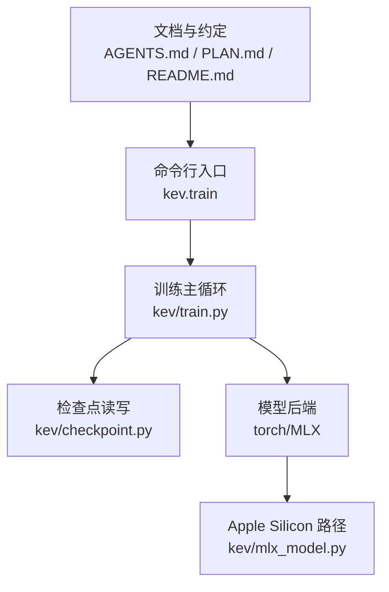
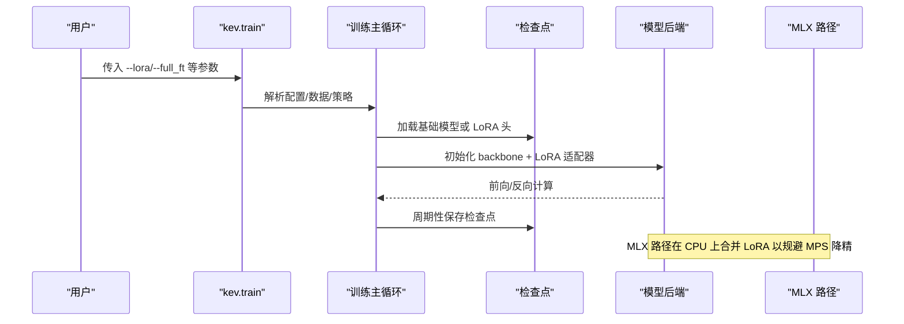
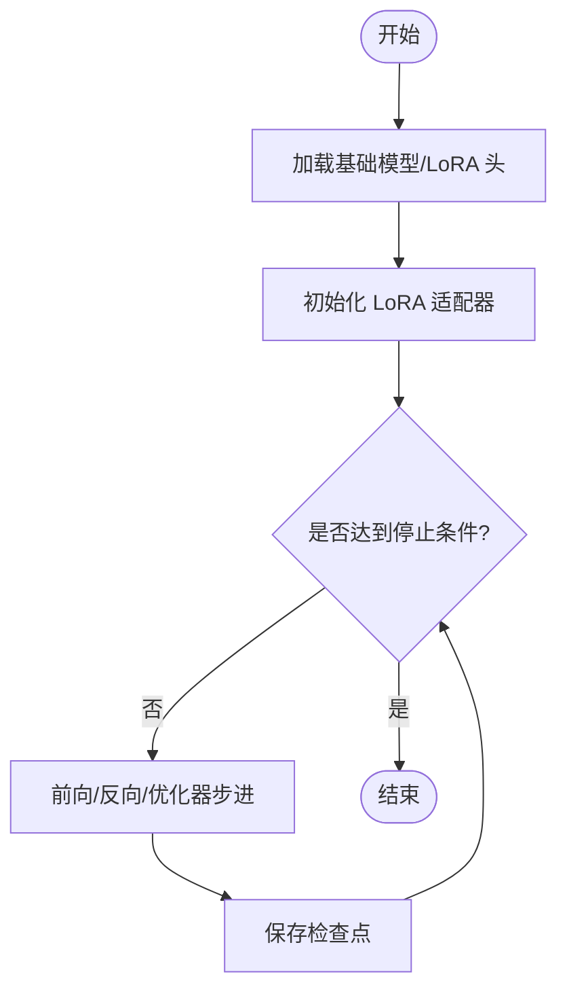
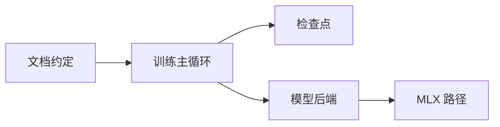

# LoRA 微调

<cite>
**本文引用的文件**   
- [README.md](file://README.md)
- [AGENTS.md](file://AGENTS.md)
- [PLAN.md](file://PLAN.md)
- [train.py](file://kev/train.py)
- [checkpoint.py](file://kev/checkpoint.py)
- [mlx_model.py](file://kev/mlx_model.py)
</cite>

## 目录
1. [简介](#简介)
2. [项目结构](#项目结构)
3. [核心组件](#核心组件)
4. [架构总览](#架构总览)
5. [详细组件分析](#详细组件分析)
6. [依赖关系分析](#依赖关系分析)
7. [性能与优化](#性能与优化)
8. [常见问题与排错](#常见问题与排错)
9. [结论](#结论)
10. [附录：场景化微调示例](#附录场景化微调示例)

## 简介
本指南面向使用 Kev 仓库进行 LoRA 微调的工程师与研究用户，系统说明以下主题：
- LoRA 参数配置：秩大小、目标模块选择（all/dense/attn/qv）、学习率设置
- 微调流程：基础模型加载、适配器初始化、训练循环、检查点保存
- 关键超参调优：学习率调度、批次大小、梯度累积、权重衰减
- 损失函数组合：交叉熵、Brier 分数、焦点损失的权重配置思路
- 性能优化：混合精度、梯度检查点、内存管理
- 常见故障诊断与调试方法

## 项目结构
Kev 仓库围绕“训练/推理/评估/发布”的全链路构建。与 LoRA 微调直接相关的代码集中在 kev 子包中，并通过命令行入口统一编排。

图示来源
- [train.py:1-200](file://kev/train.py#L1-L200)
- [checkpoint.py:1-200](file://kev/checkpoint.py#L1-L200)
- [mlx_model.py:1-200](file://kev/mlx_model.py#L1-L200)
- [AGENTS.md:380-420](file://AGENTS.md#L380-L420)

章节来源
- [AGENTS.md:380-420](file://AGENTS.md#L380-L420)
- [PLAN.md:15-30](file://PLAN.md#L15-L30)

## 核心组件
- 训练入口与数据管线
  - 通过 kev.train 启动，负责解析训练请求、数据集/回放策略、上下文过滤与策略校验等。
- 检查点系统
  - 支持 LoRA 与全量权重的加载/保存；LoRA 头与元信息分离，全量权重按 dtype 一致性校验。
- 模型后端
  - Torch 与 MLX 双后端；MLX 路径在 CPU 上执行 LoRA 合并，避免 MPS 上的 fp32 matmul 降精问题。

章节来源
- [AGENTS.md:380-420](file://AGENTS.md#L380-L420)
- [PLAN.md:15-30](file://PLAN.md#L15-L30)

## 架构总览
下图展示从命令行到训练、检查点与后端的整体交互。

图示来源
- [train.py:1-200](file://kev/train.py#L1-L200)
- [checkpoint.py:1-200](file://kev/checkpoint.py#L1-L200)
- [mlx_model.py:1-200](file://kev/mlx_model.py#L1-L200)

## 详细组件分析

### LoRA 参数配置
- 秩大小（rank）
  - 控制低秩矩阵维度，影响可训练参数量与表达能力。通常从小值起步，根据验证集表现逐步上调。
- 目标模块（target_modules）
  - 支持 all/dense/attn/qv 四种模式，用于决定对哪些子层注入 LoRA。dense 会冻结 DeltaNet 投影，减少不稳定更新。
- 学习率（learning_rate）
  - 建议配合 warmup 与余弦退火；LoRA 通常采用比全量微调更小的学习率，以避免破坏预训练表示。

章节来源
- [AGENTS.md:40-50](file://AGENTS.md#L40-L50)

### 微调流程
- 基础模型加载
  - 支持从本地运行目录或 Hub id[@rev] 加载；LoRA 与全量权重互斥，warm_start 时做兼容性校验。
- 适配器初始化
  - 在 backbone 上按 target_modules 注入 LoRA；若为 MLX 路径，后续在 CPU 上执行 fp32 合并。
- 训练循环
  - 读取训练请求（suite/built/--data+--replay），执行上下文过滤与策略检查，进入标准训练迭代。
- 检查点保存
  - 保存 LoRA 头与 meta；全量权重保存需满足 dtype 一致；支持断点续训。

图示来源
- [train.py:1-200](file://kev/train.py#L1-L200)
- [checkpoint.py:1-200](file://kev/checkpoint.py#L1-L200)

章节来源
- [AGENTS.md:380-420](file://AGENTS.md#L380-L420)

### 关键超参调优
- 学习率调度
  - 推荐 warmup + cosine；LoRA 学习率通常为全量微调的 1/10~1/5。
- 批次大小与梯度累积
  - 在显存受限下优先增大梯度累积步数；保持有效批次规模稳定。
- 权重衰减
  - 对 LoRA 参数可使用较小权重衰减，避免抑制低秩更新。

章节来源
- [AGENTS.md:380-420](file://AGENTS.md#L380-L420)

### 损失函数组合
- 交叉熵（CE）
  - 分类任务的主损失项。
- Brier 分数
  - 校准类任务或概率输出质量评估时可作为辅助正则。
- 焦点损失（Focal Loss）
  - 类别不平衡时提升难样本权重。
- 权重配置建议
  - 以 CE 为主，Brier/Focal 作为辅助项，权重从 0.01~0.1 起步，依据验证集指标调整。

[本节为通用方法论，不直接分析具体文件]

### 性能优化技巧
- 混合精度训练
  - CUDA/MPS 默认 bf16；可通过环境变量切换为 fp32 精确路径。
- 梯度检查点
  - 长上下文或大模型时启用以减少峰值显存。
- 内存管理
  - MLX 路径将 LoRA 合并移至 CPU 流，避免 MPS 上 fp32 matmul 降精导致的峰值占用。

章节来源
- [AGENTS.md:410-420](file://AGENTS.md#L410-L420)
- [mlx_model.py:1-200](file://kev/mlx_model.py#L1-L200)

## 依赖关系分析
- 训练入口依赖检查点与模型后端；MLX 路径仅在 Apple Silicon 且未强制 fp32 时自动选择。
- LoRA 与全量微调互斥；warm_start 需要源哈希一致性检查。

图示来源
- [train.py:1-200](file://kev/train.py#L1-L200)
- [checkpoint.py:1-200](file://kev/checkpoint.py#L1-L200)
- [mlx_model.py:1-200](file://kev/mlx_model.py#L1-L200)
- [AGENTS.md:380-420](file://AGENTS.md#L380-L420)

章节来源
- [AGENTS.md:380-420](file://AGENTS.md#L380-L420)

## 性能与优化
- 设备与环境
  - CUDA/MPS 默认 bf16；如需严格数值路径，设置 fp32。
- 合并策略
  - MLX 路径在 CPU 上执行 LoRA 合并，避免 MPS 上 fp32 matmul 降精带来的偏差与峰值占用。
- 推理与服务
  - 服务路径支持 fused 与 CUDA graphs；LoRA 合并后可选择保留未合并或融合进 backbone。

章节来源
- [AGENTS.md:410-420](file://AGENTS.md#L410-L420)
- [mlx_model.py:1-200](file://kev/mlx_model.py#L1-L200)

## 常见问题与排错
- LoRA 与全量微调混用报错
  - 现象：warm_start 时兼容性检查失败。
  - 处理：确认仅使用 LoRA 或仅使用全量权重，不要混合。
- 检查点 dtype 不一致
  - 现象：全量权重加载时报 dtype 不匹配。
  - 处理：确保 head.pt 的 weights_dtype 与 config.json 的 dtype 一致。
- MLX 路径数值偏差
  - 现象：MPS 上 fp32 matmul 降精导致结果差异。
  - 处理：在 CPU 上执行 LoRA 合并，或切换到 torch 路径。
- 显存不足
  - 处理：启用梯度检查点、降低批次大小、增加梯度累积步数。

章节来源
- [AGENTS.md:380-420](file://AGENTS.md#L380-L420)
- [AGENTS.md:410-420](file://AGENTS.md#L410-L420)

## 结论
Kev 提供了完整的 LoRA 微调与推理链路：从命令行入口、训练主循环、检查点系统到多后端模型实现。通过合理配置 LoRA 秩、目标模块与学习率，并结合混合精度、梯度检查点与内存管理，可在有限资源下高效完成领域适应与技能增强。MLX 路径的 LoRA 合并策略进一步提升了 Apple Silicon 上的可用性与稳定性。

[本节为总结性内容，不直接分析具体文件]

## 附录：场景化微调示例
- 领域适应
  - 目标：让模型快速适配特定行业术语与风格。
  - 建议：small rank（如 4~8），target=all 或 attn，lr 取基线 LoRA 的 1/2~1/5，warmup 短周期。
- 技能增强
  - 目标：强化某类任务（如决策/工具调用）。
  - 建议：target=attn/qv，适度增大 rank（如 8~16），引入 Focal/Brier 辅助损失，小 lr + cosine。
- 多任务学习
  - 目标：同时优化多个下游任务。
  - 建议：target=dense 或 attn，使用 CE 为主、其他损失加权；批次大小受显存限制时以梯度累积补足。

[本节为通用方法论，不直接分析具体文件]