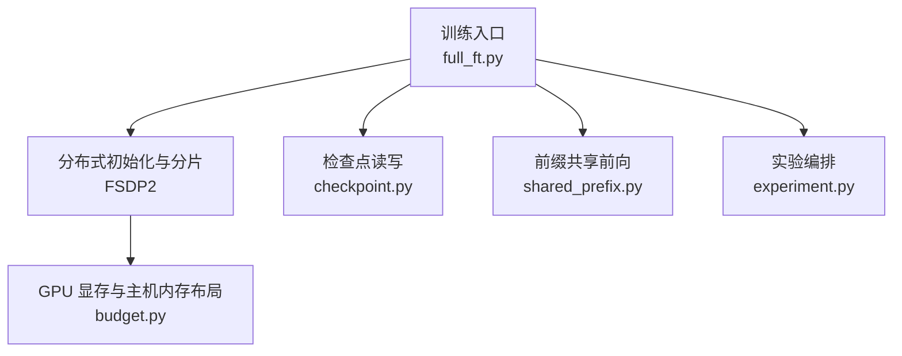
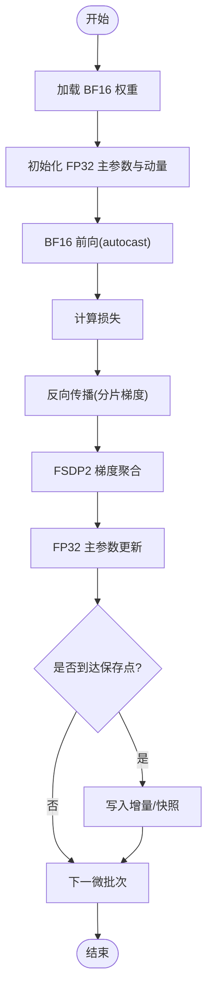
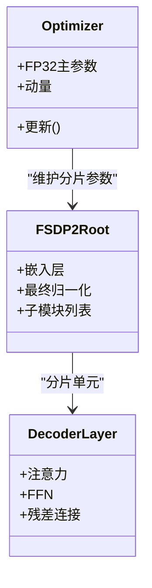
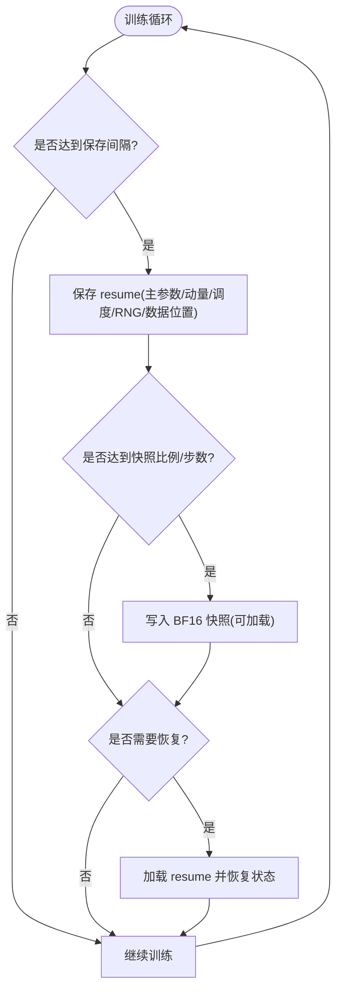
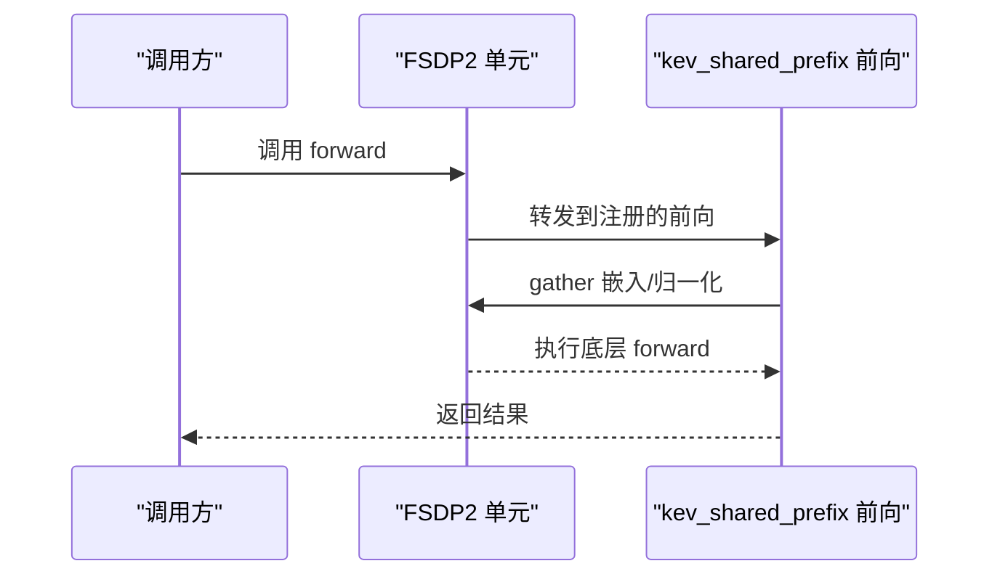
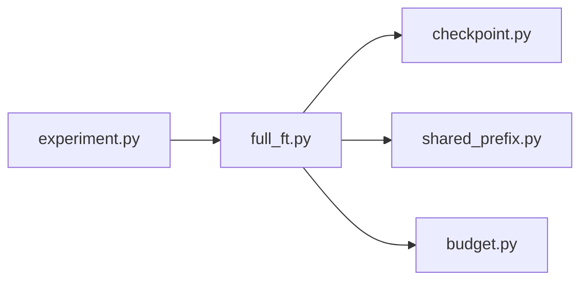

# 全参数微调

<cite>
**本文引用的文件**   
- [full_ft.py](file://kev/full_ft.py)
- [checkpoint.py](file://kev/checkpoint.py)
- [shared_prefix.py](file://kev/shared_prefix.py)
- [budget.py](file://kev/budget.py)
- [experiment.py](file://kev/experiment.py)
- [AGENTS.md](file://AGENTS.md)
- [PLAN.md](file://PLAN.md)
- [docs/model-cards/kev-27b.md](file://docs/model-cards/kev-27b.md)
</cite>

## 目录
1. [简介](#简介)
2. [项目结构](#项目结构)
3. [核心组件](#核心组件)
4. [架构总览](#架构总览)
5. [详细组件分析](#详细组件分析)
6. [依赖关系分析](#依赖关系分析)
7. [性能与资源规划](#性能与资源规划)
8. [检查点与恢复](#检查点与恢复)
9. [监控指标与收敛性](#监控指标与收敛性)
10. [性能调优指南](#性能调优指南)
11. [与 LoRA 微调的区别与选型](#与-lora-微调的区别与选型)
12. [故障排查](#故障排查)
13. [结论](#结论)

## 简介
本文件面向 Kev-27B 等大型模型的全参数微调，系统性说明以下主题：
- 混合精度策略：BF16 权重 + FP32 主参数的训练数值稳定性与收益。
- 分布式训练架构：FSDP2 并行、多 GPU 协调与参数分片机制。
- 训练资源需求：显存估算、GPU 数量建议与网络通信优化。
- 检查点管理：增量保存、快照策略与恢复机制。
- 监控指标：梯度范数、学习率调度与收敛性分析。
- 性能调优：批大小、通信压缩与计算图优化。
- 与 LoRA 微调的差异与适用场景选择。

## 项目结构
围绕全参数微调的关键代码位于 kev 包内，其中 full_ft.py 是核心入口与 FSDP2 配置；checkpoint.py 负责检查点读写；shared_prefix.py 提供前缀共享的 FSDP2 兼容 forward；budget.py 描述状态在 GPU 与主机内存之间的布局；experiment.py 将全参训练与 torchrun/FSDP2 编排关联起来。



**图示来源**
- [full_ft.py:12-54](file://kev/full_ft.py#L12-L54)
- [checkpoint.py](file://kev/checkpoint.py)
- [shared_prefix.py:25-139](file://kev/shared_prefix.py#L25-L139)
- [budget.py:6](file://kev/budget.py#L6)
- [experiment.py:293](file://kev/experiment.py#L293)

**章节来源**
- [full_ft.py:12-54](file://kev/full_ft.py#L12-L54)
- [shared_prefix.py:25-139](file://kev/shared_prefix.py#L25-L139)
- [budget.py:6](file://kev/budget.py#L6)
- [experiment.py:293](file://kev/experiment.py#L293)

## 核心组件
- 全参训练入口与优化器
  - MasterAdamW：FP32 主参数与动量，配合 BF16 主干，提升数值稳定性并降低显存占用。
  - 支持 host/device 两种主参数存放位置，便于不同硬件与规模下的权衡。
- FSDP2 并行
  - 使用 shard/rank_share/save_backbone/init_distributed 等能力进行参数分片与跨卡同步。
  - 对骨干网络按解码层为单位划分单元，根节点包含嵌入与最终归一化。
- 检查点系统
  - 增量保存：每 N 步保存 resume（含各 rank 的 FP32 主参数、动量、调度器、随机种子与数据位置）。
  - 快照策略：按步或比例生成可加载的 BF16 权重快照，用于快速回滚与评估。
  - 恢复机制：从 resume 恢复训练状态，继续训练不丢失进度。
- 前缀共享
  - 通过 register_fsdp_forward_method 在 FSDP2 单元上注册自定义前向，保证嵌入与最终归一化在 gather 后执行，避免重复计算。

**章节来源**
- [AGENTS.md:45-57](file://AGENTS.md#L45-L57)
- [AGENTS.md:380](file://AGENTS.md#L380)
- [full_ft.py:12-54](file://kev/full_ft.py#L12-L54)
- [full_ft.py:171-186](file://kev/full_ft.py#L171-L186)
- [full_ft.py:316-330](file://kev/full_ft.py#L316-L330)
- [shared_prefix.py:25-139](file://kev/shared_prefix.py#L25-L139)

## 架构总览
下图展示一次 FSDP2 全参训练步骤的数据与控制流：数据读取、微批次前向、梯度反向、FSDP2 收集与聚合、优化器更新与检查点写入。

```mermaid
sequenceDiagram
participant Data as "数据加载"
participant Rank as "单卡进程(FSDP2)"
participant Model as "FSDP2 分片模型"
participant Opt as "MasterAdamW(FP32)"
participant CKPT as "检查点系统"
Data->>Rank : 微批次样本
Rank->>Model : 前向(嵌入/归一化已gather)
Model-->>Rank : 损失
Rank->>Model : 反向(梯度分片)
Rank->>Rank : FSDP2 梯度聚合
Rank->>Opt : 参数更新(FP32 主参数)
Opt-->>Rank : 新参数(分片)
Rank->>CKPT : 增量保存/快照(按策略)
```

**图示来源**
- [full_ft.py:171-186](file://kev/full_ft.py#L171-L186)
- [full_ft.py:316-330](file://kev/full_ft.py#L316-L330)
- [shared_prefix.py:91-139](file://kev/shared_prefix.py#L91-L139)

## 详细组件分析

### 混合精度与数值稳定
- 权重存储为 BF16，减少显存占用与带宽压力。
- 优化器维护 FP32 主参数与动量，提高更新稳定性，避免小梯度被截断。
- 训练过程使用 autocast 控制激活与前向计算的精度，兼顾吞吐与精度。



**图示来源**
- [AGENTS.md:45-57](file://AGENTS.md#L45-L57)
- [full_ft.py:171-186](file://kev/full_ft.py#L171-L186)

**章节来源**
- [AGENTS.md:45-57](file://AGENTS.md#L45-L57)
- [docs/model-cards/kev-27b.md:178](file://docs/model-cards/kev-27b.md#L178)

### FSDP2 并行与参数分片
- 分片粒度：以解码层为单位构建 FSDP2 单元，根节点包含嵌入与最终归一化。
- 梯度求和：每个单元的梯度在本地累积并在 collectives 中汇总，确保跨卡一致性。
- 状态分布：参数、梯度与优化器状态按 rank 分片，减少单卡显存峰值。
- 前向优化：嵌入与最终归一化在 gather 后执行，避免重复计算。



**图示来源**
- [full_ft.py:171-186](file://kev/full_ft.py#L171-L186)
- [shared_prefix.py:91-139](file://kev/shared_prefix.py#L91-L139)

**章节来源**
- [full_ft.py:171-186](file://kev/full_ft.py#L171-L186)
- [shared_prefix.py:91-139](file://kev/shared_prefix.py#L91-L139)

### 检查点与恢复流程
- 增量保存：每 N 步保存 resume，包含各 rank 的 FP32 主参数、动量、调度器、随机种子与数据位置。
- 快照策略：按步或比例生成可加载的 BF16 权重快照，便于快速回滚与评估。
- 恢复机制：从 resume 恢复训练状态，继续训练不丢失进度。



**图示来源**
- [AGENTS.md:54-57](file://AGENTS.md#L54-L57)
- [full_ft.py:237-240](file://kev/full_ft.py#L237-L240)
- [full_ft.py:316-330](file://kev/full_ft.py#L316-L330)

**章节来源**
- [AGENTS.md:54-57](file://AGENTS.md#L54-L57)
- [full_ft.py:237-240](file://kev/full_ft.py#L237-L240)
- [full_ft.py:316-330](file://kev/full_ft.py#L316-L330)

### 前缀共享与 FSDP2 兼容
- 通过 register_fsdp_forward_method 在 FSDP2 单元上注册自定义前向方法。
- 保证嵌入与最终归一化在 gather 后执行，避免重复计算与不一致。
- 两个前向路径均调用底层 plain forward，使 FSDP2 单元仅 gather 一次，利于检查点回放。



**图示来源**
- [shared_prefix.py:91-139](file://kev/shared_prefix.py#L91-L139)

**章节来源**
- [shared_prefix.py:91-139](file://kev/shared_prefix.py#L91-L139)

## 依赖关系分析
- full_ft.py 依赖 checkpoint.py 进行持久化，依赖 shared_prefix.py 提供 FSDP2 兼容前向，依赖 budget.py 明确状态在 GPU 与主机内存中的布局。
- experiment.py 将全参训练与 torchrun/FSDP2 编排关联，确保每个容器使用所有 GPU 作为 FSDP2 ranks。



**图示来源**
- [full_ft.py:12-54](file://kev/full_ft.py#L12-L54)
- [experiment.py:293](file://kev/experiment.py#L293)

**章节来源**
- [full_ft.py:12-54](file://kev/full_ft.py#L12-L54)
- [experiment.py:293](file://kev/experiment.py#L293)

## 性能与资源规划
- 显存占用估算
  - BF16 权重显著降低权重显存；FP32 主参数与动量增加少量额外显存，但提升稳定性。
  - FSDP2 将参数、梯度与优化器状态分片到多卡，单卡峰值显存随 rank 数近似线性下降。
  - 激活与 KV 缓存取决于序列长度与批大小，长上下文需关注 KV 缓存增长。
- GPU 数量建议
  - Kev-27B 全参微调建议使用 8×H200/H100/B200 等高端 GPU，参考文档与实践记录。
- 网络通信优化
  - 平衡微批次：确保每个 rank 运行相同数量的微批次，避免 collectives 对齐问题。
  - 前缀共享减少重复 gather，降低通信开销。
  - 合理设置 batch size × accumulation steps，使每步有效批大小一致且充分利用带宽。

**章节来源**
- [PLAN.md:302](file://PLAN.md#L302)
- [PLAN.md:569](file://PLAN.md#L569)
- [PLAN.md:591](file://PLAN.md#L591)
- [docs/model-cards/kev-27b.md:178](file://docs/model-cards/kev-27b.md#L178)
- [full_ft.py:171-186](file://kev/full_ft.py#L171-L186)

## 检查点与恢复
- 增量保存
  - 每 N 步保存 resume，包含各 rank 的 FP32 主参数、动量、调度器、随机种子与数据位置。
- 快照策略
  - 按步或比例生成可加载的 BF16 权重快照，便于快速回滚与评估。
- 恢复机制
  - 从 resume 恢复训练状态，继续训练不丢失进度；必要时可从快照加载权重进行推理或评估。

**章节来源**
- [AGENTS.md:54-57](file://AGENTS.md#L54-L57)
- [full_ft.py:237-240](file://kev/full_ft.py#L237-L240)
- [full_ft.py:316-330](file://kev/full_ft.py#L316-L330)

## 监控指标与收敛性
- 梯度范数
  - 监控梯度范数以检测梯度爆炸或消失；Kev-27B 训练中采用梯度范数裁剪（如 1.0）提升稳定性。
- 学习率调度
  - 使用 OneCycle 调度，包含预热阶段（例如 10%），有助于初期稳定与后期收敛。
- 收敛性分析
  - 观察损失曲线与验证集指标，结合梯度范数与学习率变化判断是否进入稳定收敛区间。
  - 对于长上下文任务，关注 KV 缓存增长对显存与吞吐的影响。

**章节来源**
- [docs/model-cards/kev-27b.md:178](file://docs/model-cards/kev-27b.md#L178)

## 性能调优指南
- 批大小优化
  - 调整 micro-batch 与 accumulation steps，使每步有效批大小一致；确保每个 rank 的微批次数量相同，避免 collectives 对齐问题。
- 通信压缩
  - 利用 FSDP2 的分片与 gather 机制减少冗余通信；前缀共享减少重复 gather。
- 计算图优化
  - 启用 fused kernels 与 CUDA graphs（在可用时），提升吞吐；注意与 bf16 精度的兼容性。
- 数据与 I/O
  - 使用高效数据加载与预取，避免 I/O 成为瓶颈；长上下文任务注意 KV 缓存管理与内存碎片。

**章节来源**
- [AGENTS.md:321](file://AGENTS.md#L321)
- [full_ft.py:171-186](file://kev/full_ft.py#L171-L186)
- [shared_prefix.py:91-139](file://kev/shared_prefix.py#L91-L139)

## 与 LoRA 微调的区别与选型
- 全参数微调
  - 优点：表达能力强，适合领域适配与复杂任务；能充分更新主干知识。
  - 缺点：显存与算力需求高，训练时间长；需要分布式与混合精度支撑。
- LoRA 微调
  - 优点：显存与算力需求低，训练快；易于部署与切换多个适配器。
  - 缺点：表达能力受限，可能不如全参微调在复杂任务上表现。
- 选型建议
  - 若资源充足且任务复杂，优先全参微调；若资源受限或需要快速迭代，选择 LoRA。
  - 可结合两者：先用 LoRA 快速探索，再用全参微调进一步逼近上限。

[本节为概念性内容，不直接分析具体文件]

## 故障排查
- 显存不足
  - 检查是否启用 BF16 权重与 FP32 主参数；确认 FSDP2 分片生效；减小 micro-batch 或序列长度。
- 训练不稳定
  - 检查梯度范数裁剪是否开启；确认学习率调度与预热比例；监控梯度范数与损失曲线。
- 检查点损坏或无法恢复
  - 确认 resume 与快照是否完整；核对 dtype 与设备一致性；必要时从更早的 resume 恢复。
- 通信阻塞或性能低下
  - 确保每个 rank 的微批次数量一致；检查网络拓扑与带宽；减少不必要的 gather。

**章节来源**
- [AGENTS.md:54-57](file://AGENTS.md#L54-L57)
- [docs/model-cards/kev-27b.md:178](file://docs/model-cards/kev-27b.md#L178)
- [full_ft.py:237-240](file://kev/full_ft.py#L237-L240)

## 结论
Kev-27B 的全参数微调通过 BF16 权重与 FP32 主参数的混合精度策略，在保持数值稳定的同时显著降低显存占用；借助 FSDP2 的参数分片与多 GPU 协调，实现可扩展的训练架构。合理的检查点策略保障训练的可恢复性与可回滚性；通过梯度范数、学习率调度与收敛性分析，可有效监控训练健康度。在资源允许的情况下，全参微调能获得更强的表达能力；在资源受限时，LoRA 是更经济的替代方案。实际部署中应结合批大小、通信压缩与计算图优化，最大化吞吐与稳定性。