# 医疗微调控制台编排系统

<cite>
**本文引用的文件**   
- [pyproject.toml](file://pyproject.toml)
- [2026-10-04-medical-finetune-console.md](file://docs/superpowers/plans/2026-10-04-medical-finetune-console.md)
- [__init__.py](file://kev/console/__init__.py)
- [db.py](file://kev/console/db.py)
- [paths.py](file://kev/console/paths.py)
- [events.py](file://kev/console/events.py)
- [executor.py](file://kev/console/executor.py)
- [gates.py](file://kev/console/gates.py)
- [app.py](file://kev/console/app.py)
- [__main__.py](file://kev/console/__main__.py)
- [stages/__init__.py](file://kev/console/stages/__init__.py)
- [stages/base.py](file://kev/console/stages/base.py)
- [stages/data.py](file://kev/console/stages/data.py)
- [stages/train.py](file://kev/console/stages/train.py)
- [stages/deploy.py](file://kev/console/stages/deploy.py)
- [route.ts](file://playground/src/app/api/console/\[...path\]/route.ts)
- [precheck.py](file://kev/console/precheck.py)
- [smoke.py](file://kev/console/smoke.py)
</cite>

## 更新摘要
**已进行的更改**
- 新增完整的基于阶段的编排系统，包含 14 种作业处理器（数据合成、SFT 训练、评测、部署等）
- 实现复杂的进程执行引擎，具备生命周期管理、实时监控和错误恢复能力
- 引入全面的 G1-G7 质量闸门验证系统，确保数据质量和模型性能
- 增强 Docker 部署集成，支持容器化部署和镜像管理
- 完善控制台框架，提供从数据处理到训练、评估和部署的完整流水线编排
- **新增** FastAPI 编排服务层，提供完整的 HTTP API 接口
- **新增** Next.js 代理层，实现前后端通信和 SSE 流式传输
- **新增** React-based UI 界面，包含五个阶段页面：数据处理、训练、评估、镜像管理和部署
- **新增** 预检脚本（precheck.py），用于 token 超限检测和训练上下文完整性验证
- **新增** 冒烟测试脚本（smoke.py），对已部署的 System One 端点进行功能验证
- **增强** 闸门系统功能，提供更详细的失败原因和建议修复措施
- **改进** 工件解析机制，支持非默认数据目录的正确路径处理

## 目录
1. [引言](#引言)
2. [项目结构](#项目结构)
3. [核心组件](#核心组件)
4. [架构总览](#架构总览)
5. [详细组件分析](#详细组件分析)
6. [依赖关系分析](#依赖关系分析)
7. [性能与可扩展性考虑](#性能与可扩展性考虑)
8. [故障排查指南](#故障排查指南)
9. [结论](#结论)
10. [附录](#附录)

## 引言
本文件面向"医疗微调控制台编排系统"，目标是在现有 Playground 前端之上，将 `docs/medical/` 下的 12 步医疗微调管线封装为可编排、可监控、可审计的界面，覆盖数据合成 → SFT 训练 → 评测 → 镜像 → 部署测试五个阶段。控制台以 Python 包 `kev.console` 为核心，提供作业生命周期管理、工件（Artifacts）追踪、SQLite 状态持久化以及路径与工件约定，配合前端实现端到端的可视化编排与结果回溯。

**重大更新** 新增了完整的基于阶段的编排系统，包含 14 种作业处理器，实现了复杂的进程执行引擎和全面的 G1-G7 质量闸门验证系统。控制台现在提供从数据处理到训练、评估和部署的完整流水线编排能力，支持 Docker 容器化部署。同时新增了 FastAPI 编排服务层、Next.js 代理层和 React-based UI 界面。**新增预检脚本和冒烟测试脚本**，增强了质量控制和部署验证能力。

## 项目结构
控制台代码位于 `kev/console` 子包中，采用分层组织：
- 入口与初始化：`kev/console/__init__.py`
- 数据库层（SQLite）：`kev/console/db.py`
- 路径与命名约定：`kev/console/paths.py`
- 训练日志解析模块：`kev/console/events.py`
- 子进程执行器：`kev/console/executor.py`
- **新增** FastAPI 编排服务：`kev/console/app.py`
- **新增** 服务启动入口：`kev/console/__main__.py`
- **新增** 质量闸门验证系统：`kev/console/gates.py`
- 阶段扩展点：`kev/console/stages/__init__.py`
- **新增** 阶段基类定义：`kev/console/stages/base.py`
- **新增** 数据阶段处理器：`kev/console/stages/data.py`
- **新增** 训练阶段处理器：`kev/console/stages/train.py`
- **新增** 部署阶段处理器：`kev/console/stages/deploy.py`
- **新增** Next.js 代理层：`playground/src/app/api/console/[...path]/route.ts`
- **新增** 预检脚本：`kev/console/precheck.py`
- **新增** 冒烟测试脚本：`kev/console/smoke.py`

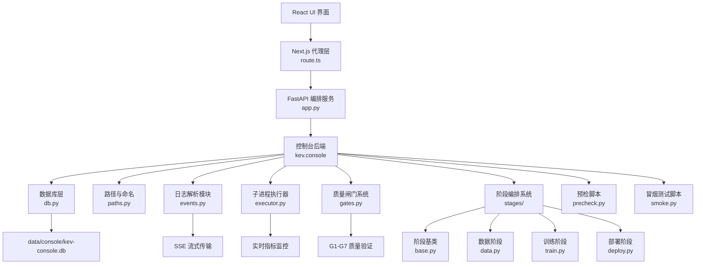

图表来源
- [2026-10-04-medical-finetune-console.md:76-77](file://docs/superpowers/plans/2026-10-04-medical-finetune-console.md#L76-L77)
- [pyproject.toml:60-60](file://pyproject.toml#L60-L60)
- [app.py:1-349](file://kev/console/app.py#L1-L349)
- [route.ts:1-72](file://playground/src/app/api/console/\[...path\]/route.ts#L1-L72)
- [precheck.py:1-58](file://kev/console/precheck.py#L1-L58)
- [smoke.py:1-76](file://kev/console/smoke.py#L1-L76)

章节来源
- [pyproject.toml:60-60](file://pyproject.toml#L60-L60)
- [2026-10-04-medical-finetune-console.md:76-77](file://docs/superpowers/plans/2026-10-04-medical-finetune-console.md#L76-L77)

## 核心组件
- 数据库层（DB）：使用 SQLite 存储作业元数据、工件索引、运行状态与审计事件；作为控制台的"真相源"之一。
- 路径与命名（Paths）：统一约定作业目录、工件目录、日志文件与数据库文件位置，确保前后端一致解析。
- 训练日志解析模块（Events）：解析 kev.train 的输出日志，提取结构化指标和运行事件，支持 SSE 流式传输。
- 子进程执行器（Executor）：管理训练进程的启动、监控、取消和清理，集成实时指标收集和事件批处理。
- **新增** FastAPI 编排服务（App）：提供完整的 HTTP API 接口，处理作业提交、状态查询、SSE 流式传输等功能。
- **新增** Next.js 代理层：实现前后端通信，处理 CORS、SSE 流式传输和断线重连。
- **新增** 质量闸门系统（Gates）：实现 G1-G7 七道质量验证闸门，确保数据质量和模型性能符合标准。
- **新增** 阶段编排系统（Stages）：定义 14 种作业类型的统一接口，支持数据合成、SFT 训练、评测、部署等完整流程。
- **新增** 预检脚本（Precheck）：检测 token 超限问题，确保训练上下文完整性。
- **新增** 冒烟测试脚本（Smoke）：对已部署端点进行功能验证，确保服务正常运行。

**重大更新** 所有核心组件都增强了并发安全性和事务处理能力，特别是在状态转换、工件注册和实时事件处理过程中。新增的质量闸门系统和阶段编排系统提供了完整的流水线管控能力。新增的 FastAPI 服务和 Next.js 代理层提供了现代化的 Web 架构支持。**新增的预检和冒烟测试脚本增强了质量控制和部署验证能力**。

章节来源
- [__init__.py](file://kev/console/__init__.py)
- [db.py](file://kev/console/db.py)
- [paths.py](file://kev/console/paths.py)
- [events.py](file://kev/console/events.py)
- [executor.py](file://kev/console/executor.py)
- [app.py](file://kev/console/app.py)
- [__main__.py](file://kev/console/__main__.py)
- [gates.py](file://kev/console/gates.py)
- [stages/__init__.py](file://kev/console/stages/__init__.py)
- [stages/base.py](file://kev/console/stages/base.py)
- [stages/data.py](file://kev/console/stages/data.py)
- [stages/train.py](file://kev/console/stages/train.py)
- [stages/deploy.py](file://kev/console/stages/deploy.py)
- [route.ts](file://playground/src/app/api/console/\[...path\]/route.ts)
- [precheck.py](file://kev/console/precheck.py)
- [smoke.py](file://kev/console/smoke.py)

## 架构总览
控制台在运行时承担以下职责：
- 接收前端编排请求，创建作业并分配 ID。
- 按阶段调度执行，产出工件并写入日志。
- 将关键状态与工件索引落库，供前端查询与回放。
- 暴露统一的工件与作业查询接口，支持审计与回溯。
- 实时训练监控：通过 SSE 流式传输指标数据和运行事件。
- 自动重试失败作业，维护重试链关系和尝试计数。
- **新增** FastAPI 服务层：提供完整的 RESTful API 接口，支持作业管理、工件查询、闸门检查等功能。
- **新增** Next.js 代理层：处理前后端通信，支持 SSE 流式传输和断线重连。
- **新增** 质量闸门验证：在执行关键阶段前进行 G1-G7 质量检查。
- **新增** 14 种作业类型支持：涵盖数据合成、SFT 训练、评测、部署等完整流程。
- **新增** 预检和冒烟测试：在训练前检测 token 超限，部署后进行功能验证。

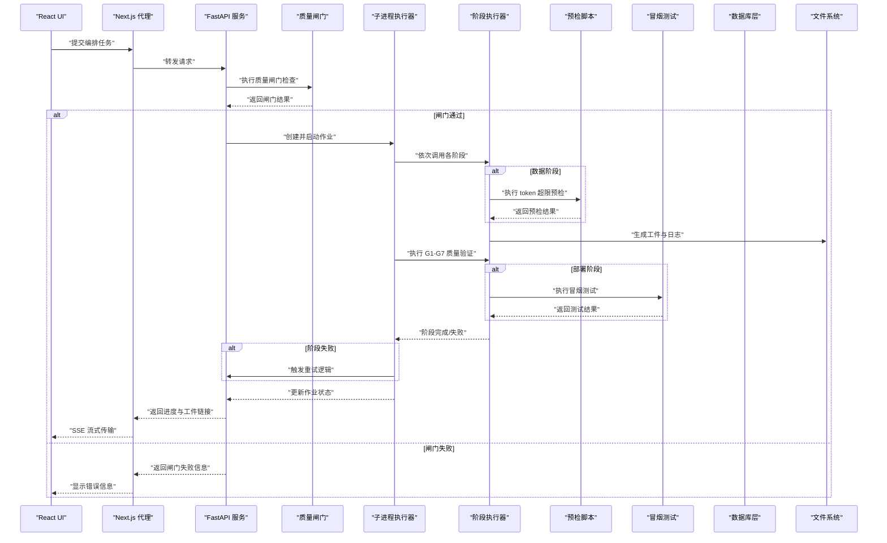

图表来源
- [2026-10-04-medical-finetune-console.md:76-77](file://docs/superpowers/plans/2026-10-04-medical-finetune-console.md#L76-L77)
- [events.py](file://kev/console/events.py)
- [executor.py](file://kev/console/executor.py)
- [db.py](file://kev/console/db.py)
- [gates.py](file://kev/console/gates.py)
- [app.py:93-349](file://kev/console/app.py#L93-L349)
- [route.ts:10-72](file://playground/src/app/api/console/\[...path\]/route.ts#L10-L72)
- [precheck.py:28-53](file://kev/console/precheck.py#L28-L53)
- [smoke.py:41-71](file://kev/console/smoke.py#L41-L71)

## 详细组件分析

### FastAPI 编排服务（App）
职责与行为
- 提供完整的 RESTful API 接口，包括作业管理、工件查询、闸门检查等功能。
- 处理作业提交、预览、取消、重试等操作。
- 实现 SSE 流式传输，支持实时指标监控和断线重连。
- 集成凭据注入机制，安全地传递敏感环境变量给子进程。
- 提供配置查询、场景枚举、数据集管理等辅助功能。

技术特性
- 基于 FastAPI 构建，支持异步处理和类型提示。
- 使用 Uvicorn 作为 ASGI 服务器，绑定 127.0.0.1 端口。
- 支持 Last-Event-ID 断线续传，提高网络稳定性。
- 提供完善的错误处理和状态码管理。

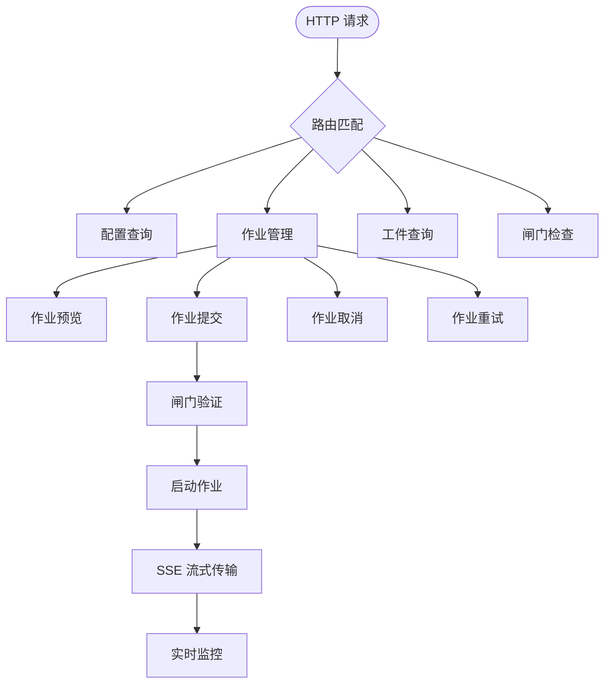

图表来源
- [app.py:93-349](file://kev/console/app.py#L93-L349)

章节来源
- [app.py](file://kev/console/app.py)

### Next.js 代理层（Proxy）
职责与行为
- 实现前后端通信，处理 CORS 问题和鉴权预留。
- 透传 SSE 流式传输，确保 EventSource 正常工作。
- 处理 Last-Event-ID 断线重连机制。
- 提供统一的 API 访问入口，便于后续添加鉴权功能。

技术特性
- 基于 Next.js API Routes 实现。
- 使用 ReadableStream 逐块转发 SSE 数据。
- 支持动态路由和参数传递。
- 配置缓存策略和连接保持。

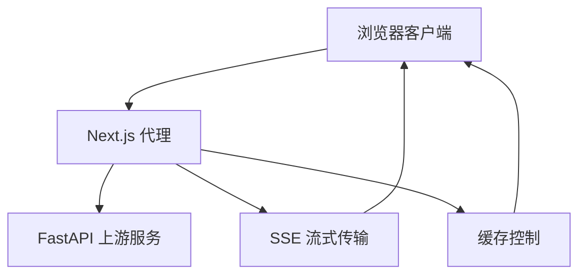

图表来源
- [route.ts:10-72](file://playground/src/app/api/console/\[...path\]/route.ts#L10-L72)

章节来源
- [route.ts](file://playground/src/app/api/console/\[...path\]/route.ts)

### 质量闸门验证系统（Gates）
职责与行为
- 实现 G1-G7 七道质量验证闸门，确保数据质量和模型性能符合医疗领域标准。
- G1：检查训练上下文完整性，确保所有记录都在 token 限制内。
- G2：验证数据划分记录数与计划的一致性。
- G3：检查无效行和标签分布告警。
- G4：验证配对 bootstrap CI 下限大于 0，确保增益真实。
- G5：确保校准优于原始模型，且不会过度自信。
- G6：检查公开数据精度下降不超过 2 点。
- G7：验证 workload_oof 的 ECE 不劣于 shipped 版本。

技术特性
- 纯函数设计：只读产物 dict，输出 Gate 列表，不触碰文件系统。
- 每个闸门都有详细的失败原因和建议修复措施。
- 支持不同阶段的闸门组合：train 前使用 G1-G3，image/deploy 前使用 G4-G7。
- **增强** 更详细的错误信息和诊断建议。

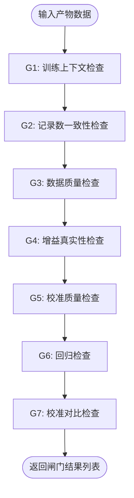

图表来源
- [gates.py:60-206](file://kev/console/gates.py#L60-L206)

章节来源
- [gates.py](file://kev/console/gates.py)

### 阶段编排系统（Stages）
职责与行为
- 定义 14 种作业类型的统一接口，支持数据合成、SFT 训练、评测、部署等完整流程。
- 每种作业类型都有对应的 StageSpec 配置，包含构建函数、持久化策略和结果描述。
- 支持参数校验、冲突检测和错误处理。
- 提供预览功能，允许用户在执行前查看将要执行的命令。

核心特性
- 14 种作业处理器：plan_size、generate、distill、goldset、split、precheck、train、baseline、benchmark、compare、calibrate、image、deploy、smoke 等。
- 参数验证：严格的输入参数校验，防止无效配置。
- 冲突检测：避免覆盖现有工件，确保数据可审计性。
- 血缘关系：自动维护作业间的依赖关系和工件流转。
- **新增** 预检阶段：在训练前检测 token 超限问题。
- **新增** 冒烟测试阶段：在部署后验证端点功能。

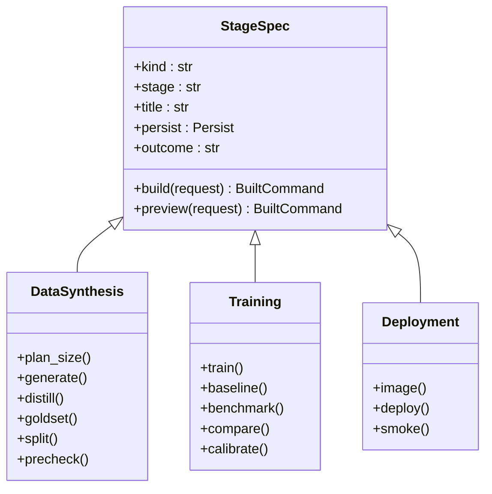

图表来源
- [stages/base.py:72-84](file://kev/console/stages/base.py#L72-L84)
- [stages/data.py:238-243](file://kev/console/stages/data.py#L238-L243)
- [stages/train.py:129-136](file://kev/console/stages/train.py#L129-L136)
- [stages/deploy.py:133-134](file://kev/console/stages/deploy.py#L133-L134)

章节来源
- [stages/__init__.py](file://kev/console/stages/__init__.py)
- [stages/base.py](file://kev/console/stages/base.py)
- [stages/data.py](file://kev/console/stages/data.py)
- [stages/train.py](file://kev/console/stages/train.py)
- [stages/deploy.py](file://kev/console/stages/deploy.py)

### 预检脚本（Precheck）
职责与行为
- 检测训练数据的 token 超限问题，确保所有记录都在训练上下文范围内。
- 使用真实的 tokenizer 进行 token 密度计算，避免字符数估算的误差。
- 生成预检报告，包含超限记录数量和示例。
- 为非零退出码表示有超限记录，编排层据此判 G1 失败。

技术特性
- 基于 kev.data.load_records 和 kev.model.fits 进行精确的 token 检测。
- 支持多种数据分区：train、calibration、development。
- 输出标准化的 JSON 报告格式，便于自动化处理。
- 提供详细的超限记录示例，便于人工审查。

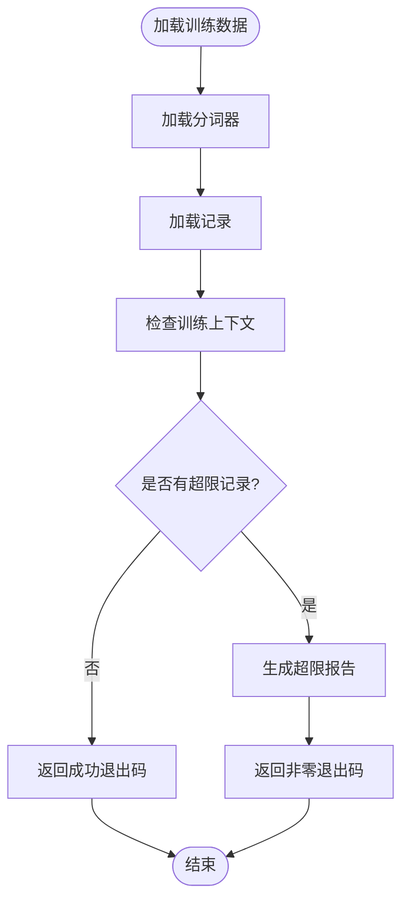

图表来源
- [precheck.py:28-53](file://kev/console/precheck.py#L28-L53)

章节来源
- [precheck.py](file://kev/console/precheck.py)

### 冒烟测试脚本（Smoke）
职责与行为
- 对已部署的 System One 端点进行功能验证，确保服务正常运行。
- 执行 5 个典型医疗场景的测试用例，验证端点的响应正确性。
- 生成冒烟测试报告，包含测试结果和失败详情。
- 支持自定义基础 URL 和输出路径。

技术特性
- 基于 urllib.request 进行 HTTP 请求，无需额外依赖。
- 复用 deploy 阶段的 SMOKE_PROBES 测试用例，确保测试一致性。
- 支持超时处理和错误捕获，提供详细的失败信息。
- 输出标准化的 JSON 报告格式，便于 UI 展示和分析。

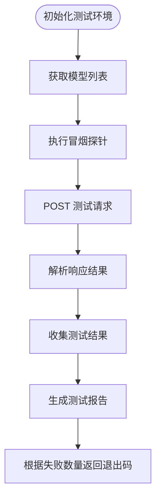

图表来源
- [smoke.py:41-71](file://kev/console/smoke.py#L41-L71)

章节来源
- [smoke.py](file://kev/console/smoke.py)

### 训练日志解析模块（Events）
职责与行为
- 解析 kev.train 的 stdout 输出，提取结构化指标点（epoch、step、loss、kl、anchor、sec）。
- 识别运行期事件：记录丢弃的数据量、保存的检查点路径、非有限损失警告等。
- 生成 SSE 文本帧，支持 metric 事件直接推送到前端进行实时绘图。
- 提供 MetricBuffer 类，维护最近 N 个指标点的内存缓存，溢出时记录丢弃数量。

技术特性
- 使用正则表达式匹配标准训练日志格式，兼容 kev/train.py 的输出规范。
- 异常安全设计：单行解析失败不会导致 reader 线程崩溃，确保作业能正常到达终态。
- NaN 值处理：JSON 序列化时禁止 NaN，避免前端渲染中断。

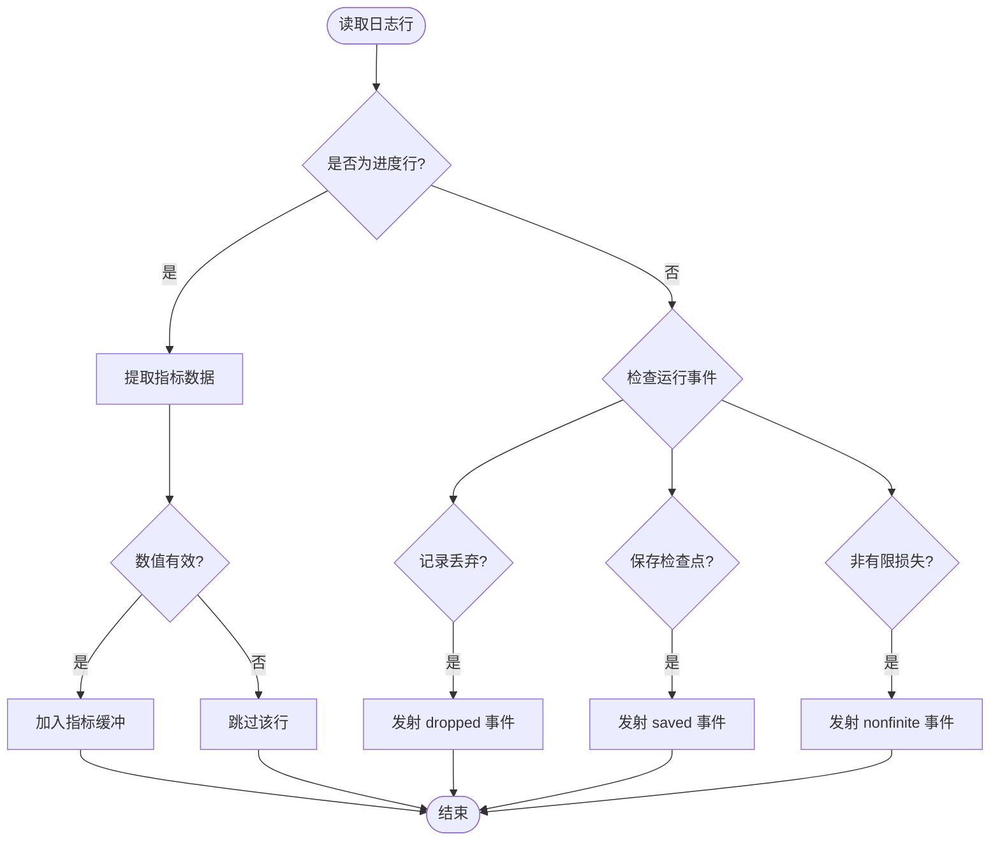

图表来源
- [events.py:38-76](file://kev/console/events.py#L38-L76)

章节来源
- [events.py](file://kev/console/events.py)

### 子进程执行器（Executor）
职责与行为
- 管理训练进程的完整生命周期：启动、监控、取消、清理。
- 实现三线程架构：主线程负责进程管理，reader 线程负责日志解析，flush 线程负责事件批处理。
- 集成凭据注入机制，安全地传递敏感环境变量给子进程。
- 提供进程组终止功能，确保 torchrun 的子进程不会成为孤儿进程。

实时监控特性
- 使用 MetricBuffer 维护每个作业的指标历史，支持前端实时绘图。
- 批量事件写入：每 10 行日志批量写入数据库，减少 I/O 开销。
- 优雅取消：先发送 SIGTERM，等待 5 秒后强制 SIGKILL，确保进程树完整清理。

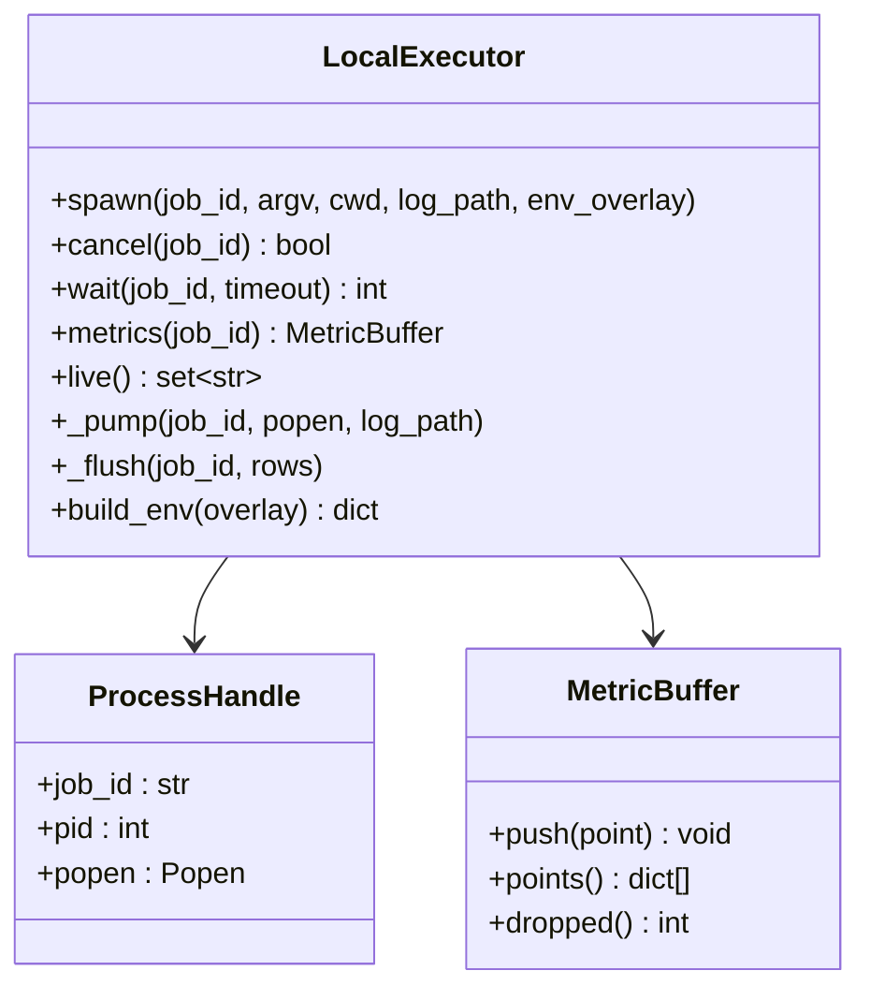

图表来源
- [executor.py:43-68](file://kev/console/executor.py#L43-L68)

章节来源
- [executor.py](file://kev/console/executor.py)

### 数据库层（DB）
职责与行为
- 使用 SQLite 存储作业、工件、审计事件等表结构。
- 提供事务性写入，保证状态一致性。
- 暴露查询接口，供前端展示作业列表、工件详情与审计轨迹。
- 原子性状态机操作，支持并发安全的状态转换。
- 重试链关系存储，维护作业重试历史。

设计要点
- 作业状态机：新建 → 运行中 → 成功/失败 → 归档。
- 工件索引：按作业ID、类型、版本建立索引，加速检索。
- 审计日志：记录关键操作与变更，满足合规要求。
- 重试配置表：存储重试策略、最大尝试次数、退避算法等。

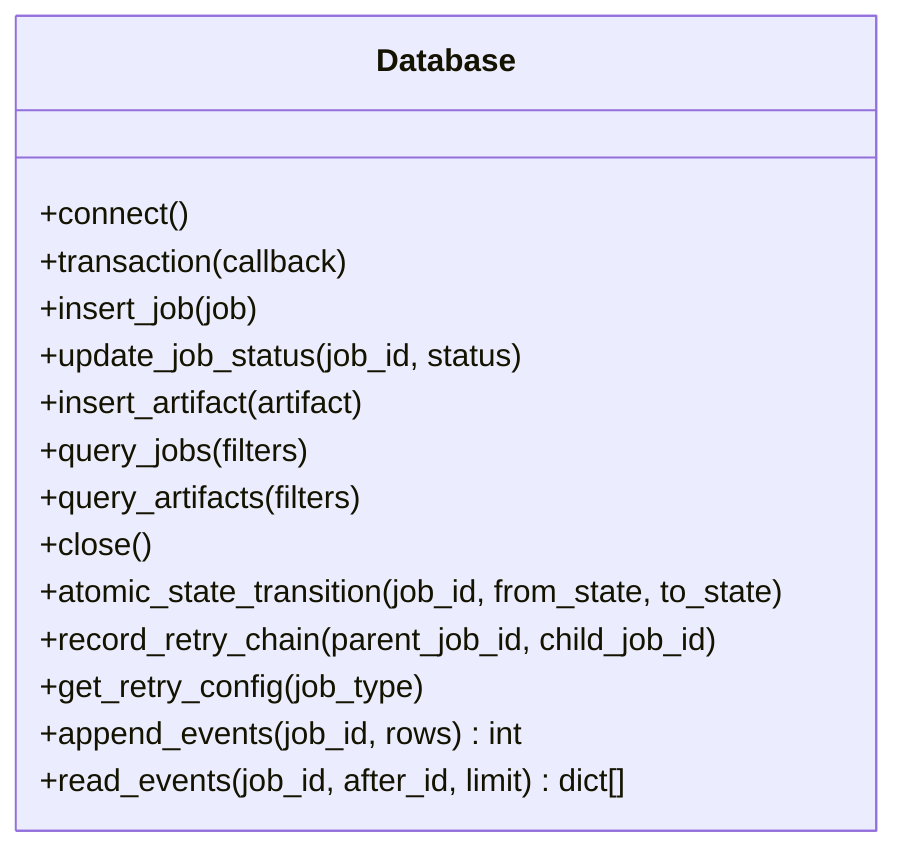

图表来源
- [db.py:132-374](file://kev/console/db.py#L132-L374)

章节来源
- [db.py](file://kev/console/db.py)

### 路径与命名（Paths）
职责与行为
- 统一约定作业根目录、工件子目录、日志文件与数据库文件路径。
- 提供路径构建与校验工具，确保前后端一致解析。
- 支持多环境配置（开发/生产），便于部署迁移。
- **改进** 工件解析机制，支持非默认数据目录的正确路径处理。

约定示例
- 作业日志：`data/console/jobs/<job_id>.log`
- 数据库：`data/console/kev-console.db`

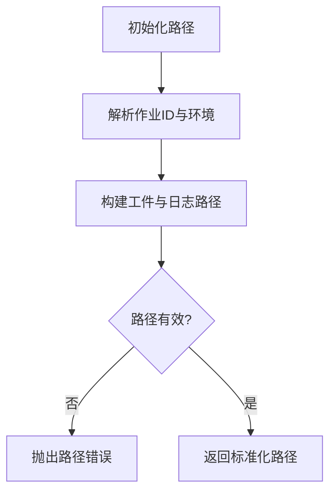

图表来源
- [paths.py:11-26](file://kev/console/paths.py#L11-L26)

章节来源
- [paths.py](file://kev/console/paths.py)

## 依赖关系分析
控制台包依赖关系如下：
- `kev.console` 作为主包，聚合工件、数据库、路径与阶段模块。
- `pyproject.toml` 显式声明 `kev.console` 与 `kev.console.stages` 为可导入子包。
- 前端通过 HTTP 接口访问控制台，读取工件与作业状态。
- **新增** FastAPI 服务依赖 uvicorn 作为 ASGI 服务器。
- **新增** Next.js 代理层依赖 Node.js 运行时环境。
- **新增** 预检脚本依赖 kev.data 和 kev.model 模块。
- **新增** 冒烟测试脚本依赖 kev.suite 和 kev.console.stages.deploy。

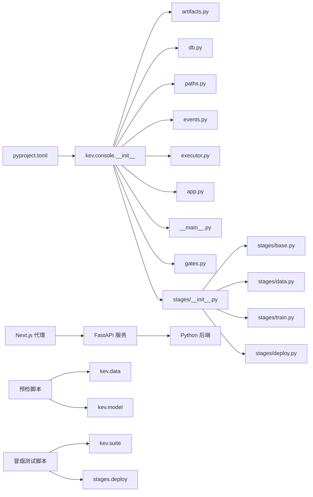

图表来源
- [pyproject.toml:60-60](file://pyproject.toml#L60-L60)
- [app.py:17-28](file://kev/console/app.py#L17-L28)
- [__main__.py:11-23](file://kev/console/__main__.py#L11-L23)
- [route.ts:3-8](file://playground/src/app/api/console/\[...path\]/route.ts#L3-L8)
- [precheck.py:23-25](file://kev/console/precheck.py#L23-L25)
- [smoke.py:21-22](file://kev/console/smoke.py#L21-L22)

章节来源
- [pyproject.toml:60-60](file://pyproject.toml#L60-L60)

## 性能与可扩展性考虑
- 工件写入：建议批量写入与异步落库，减少阻塞。
- 数据库查询：为高频字段（作业ID、工件类型、状态）建立索引。
- 阶段调度：支持并行执行独立阶段，提升吞吐。
- 可扩展性：阶段接口抽象良好，便于接入新算法或外部服务。
- 实时指标监控：MetricBuffer 限制内存使用，支持最近 N 点缓存。
- SSE 流式传输：Last-Event-ID 支持断线续传，提高网络稳定性。
- 原子性操作：确保状态转换和工件注册的事务性。
- 进程组管理：确保训练子进程树完整清理，避免资源泄漏。
- **新增** FastAPI 异步处理：利用异步 IO 提升并发性能。
- **新增** Next.js 流式代理：支持大文件和长连接的优化传输。
- **新增** 质量闸门优化：闸门计算采用纯函数设计，支持单元测试和并行执行。
- **新增** 14 种作业类型：覆盖完整医疗微调流程，支持灵活组合和扩展。
- **新增** 预检和冒烟测试：独立的脚本模块，便于单独测试和调试。
- **改进** 工件解析机制：支持非默认数据目录，提高路径处理的灵活性。

## 故障排查指南
常见问题与建议
- 无法导入 `kev.console`：检查 `pyproject.toml` 是否已包含 `kev.console` 与 `kev.console.stages`。
- 作业日志缺失：确认路径约定与权限设置，确保 `data/console/jobs/<job_id>.log` 可写。
- 数据库损坏：备份 `data/console/kev-console.db`，必要时重建表结构。
- 工件校验失败：核对工件哈希与大小，重新生成或清理无效工件。
- SSE 连接中断：检查 Last-Event-ID 是否正确传递，确认网络代理不修改响应头。
- 指标显示异常：验证日志格式是否符合预期，检查 MetricBuffer 的容量限制。
- 进程无法终止：确认操作系统信号支持，检查进程组权限设置。
- 并发冲突：确认状态机原子性操作是否正常，检查数据库锁机制。
- **新增** FastAPI 服务启动失败：检查端口占用情况，确认 uvicorn 安装正确。
- **新增** Next.js 代理连接失败：确认 KEV_CONSOLE_API 环境变量配置正确。
- **新增** 质量闸门失败：检查对应闸门的输入数据是否完整，查看详细失败原因和建议。
- **新增** 阶段执行错误：确认阶段参数配置正确，检查依赖工件是否存在。
- **新增** 14 种作业类型未找到：检查 REGISTRY 是否正确加载，确认阶段模块导入正常。
- **新增** 预检脚本失败：检查训练数据是否超出 token 限制，查看 precheck 报告中的超限记录。
- **新增** 冒烟测试失败：检查部署端点是否可达，查看 smoke 测试报告中的失败详情。
- **新增** 工件路径错误：确认数据目录路径配置正确，检查 artifacts.resolve 的路径解析逻辑。

章节来源
- [pyproject.toml:60-60](file://pyproject.toml#L60-L60)
- [2026-10-04-medical-finetune-console.md:76-77](file://docs/superpowers/plans/2026-10-04-medical-finetune-console.md#L76-L77)

## 结论
医疗微调控制台编排系统通过工件系统、SQLite 数据库、路径约定与阶段扩展点，构建了稳定、可观测、可扩展的流水线编排底座。结合前端可视化，可实现从数据合成到部署测试的全链路管控，满足医疗领域对可审计性与可追溯性的严格要求。

**重大更新** 新增的完整基于阶段的编排系统包含 14 种作业处理器，实现了复杂的进程执行引擎和全面的 G1-G7 质量闸门验证系统。控制台现在提供从数据处理到训练、评估和部署的完整流水线编排能力，支持 Docker 容器化部署。新增的 FastAPI 编排服务层、Next.js 代理层和 React-based UI 界面提供了现代化的 Web 架构支持，为医疗 AI 模型的微调提供了强大的基础设施支撑。**新增的预检脚本和冒烟测试脚本进一步增强了质量控制和部署验证能力**，确保了训练数据的完整性和部署服务的可靠性。

## 附录
- 计划文档：`docs/superpowers/plans/2026-10-04-medical-finetune-console.md`
- 包配置：`pyproject.toml`
- 预检脚本：`kev/console/precheck.py`
- 冒烟测试脚本：`kev/console/smoke.py`