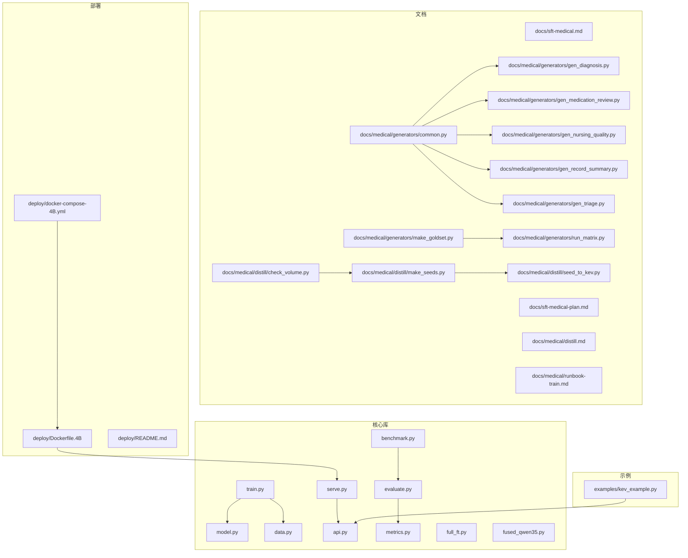
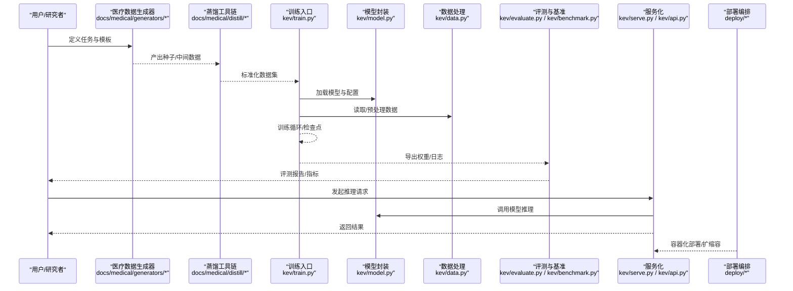
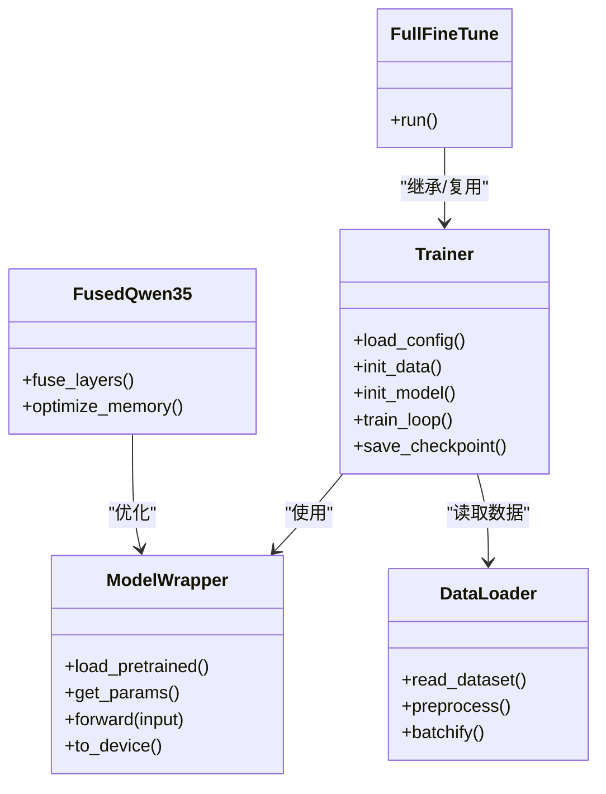
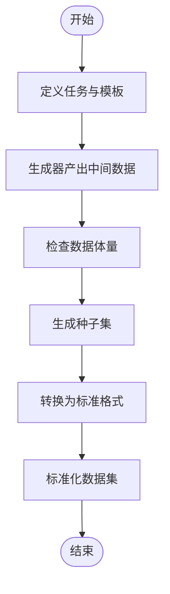
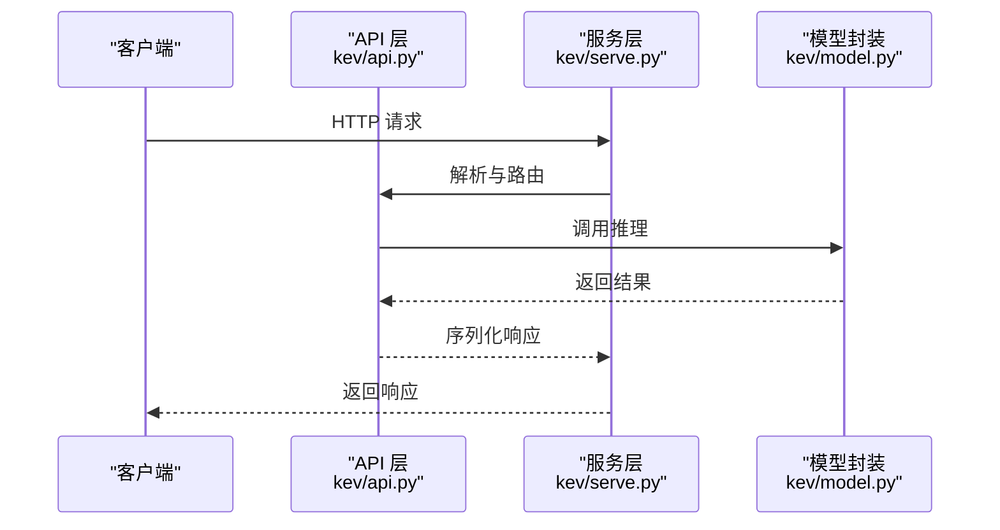
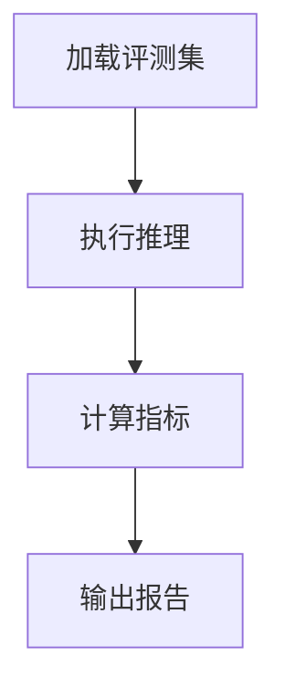
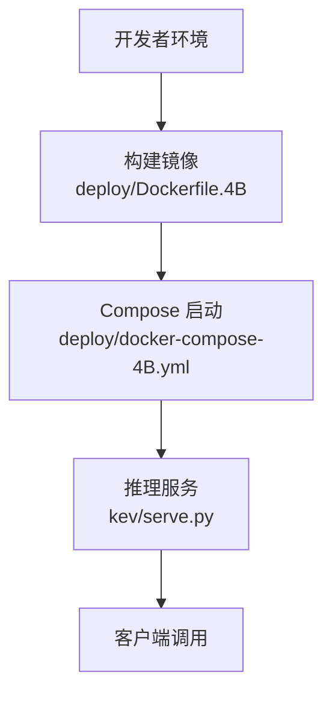
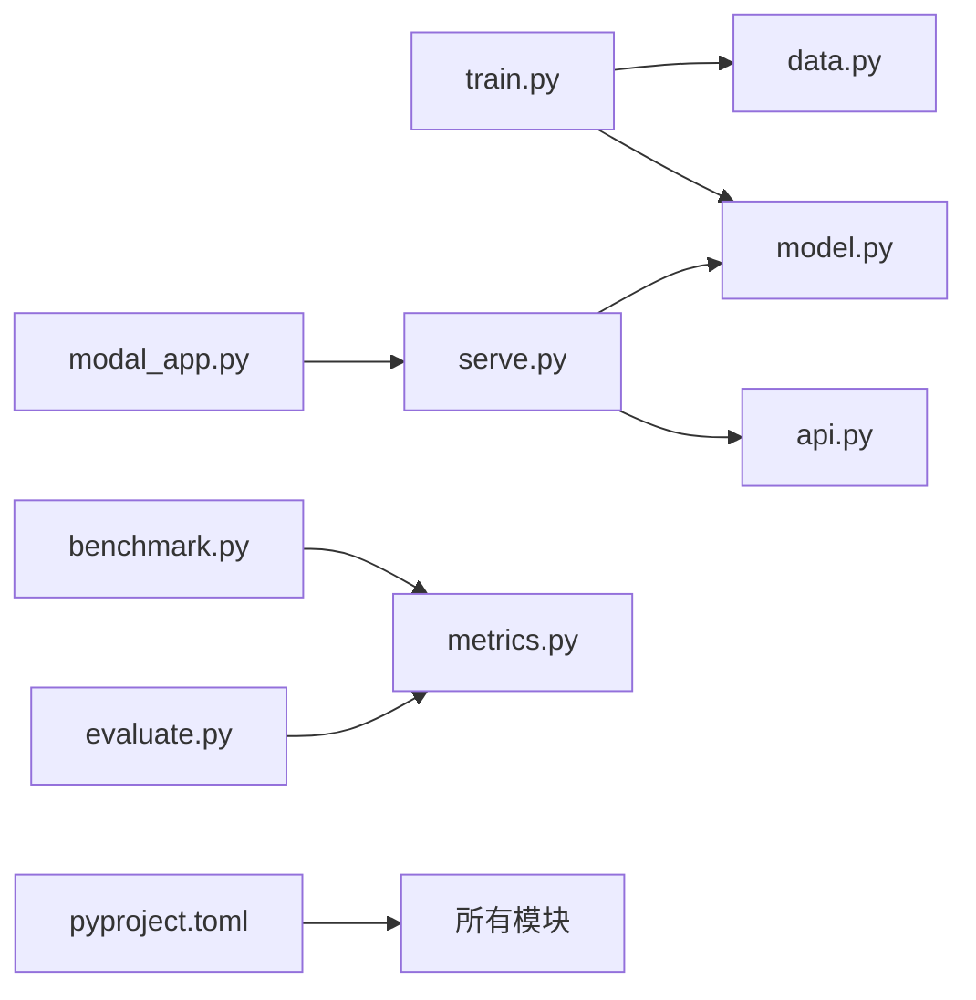

# 医疗领域微调框架

<cite>
**本文引用的文件**   
- [README.md](file://README.md)
- [PLAN_CN.md](file://PLAN_CN.md)
- [pyproject.toml](file://pyproject.toml)
- [modal_app.py](file://modal_app.py)
- [examples/kev_example.py](file://examples/kev_example.py)
- [kev/train.py](file://kev/train.py)
- [kev/model.py](file://kev/model.py)
- [kev/data.py](file://kev/data.py)
- [kev/api.py](file://kev/api.py)
- [kev/serve.py](file://kev/serve.py)
- [kev/benchmark.py](file://kev/benchmark.py)
- [kev/evaluate.py](file://kev/evaluate.py)
- [kev/metrics.py](file://kev/metrics.py)
- [kev/full_ft.py](file://kev/full_ft.py)
- [kev/fused_qwen35.py](file://kev/fused_qwen35.py)
- [deploy/Dockerfile.4B](file://deploy/Dockerfile.4B)
- [deploy/docker-compose-4B.yml](file://deploy/docker-compose-4B.yml)
- [deploy/README.md](file://deploy/README.md)
- [docs/sft-medical.md](file://docs/sft-medical.md)
- [docs/sft-medical-plan.md](file://docs/sft-medical-plan.md)
- [docs/medical/distill.md](file://docs/medical/distill.md)
- [docs/medical/runbook-train.md](file://docs/medical/runbook-train.md)
- [docs/medical/generators/common.py](file://docs/medical/generators/common.py)
- [docs/medical/generators/gen_diagnosis.py](file://docs/medical/generators/gen_diagnosis.py)
- [docs/medical/generators/gen_medication_review.py](file://docs/medical/generators/gen_medication_review.py)
- [docs/medical/generators/gen_nursing_quality.py](file://docs/medical/generators/gen_nursing_quality.py)
- [docs/medical/generators/gen_record_summary.py](file://docs/medical/generators/gen_record_summary.py)
- [docs/medical/generators/gen_triage.py](file://docs/medical/generators/gen_triage.py)
- [docs/medical/generators/make_goldset.py](file://docs/medical/generators/make_goldset.py)
- [docs/medical/generators/run_matrix.py](file://docs/medical/generators/run_matrix.py)
- [docs/medical/distill/check_volume.py](file://docs/medical/distill/check_volume.py)
- [docs/medical/distill/make_seeds.py](file://docs/medical/distill/make_seeds.py)
- [docs/medical/distill/seed_to_kev.py](file://docs/medical/distill/seed_to_kev.py)
</cite>

## 目录
1. [简介](#简介)
2. [项目结构](#项目结构)
3. [核心组件](#核心组件)
4. [架构总览](#架构总览)
5. [详细组件分析](#详细组件分析)
6. [依赖关系分析](#依赖关系分析)
7. [性能与资源规划](#性能与资源规划)
8. [故障排查指南](#故障排查指南)
9. [结论](#结论)
10. [附录](#附录)

## 简介
本仓库是一个面向医疗领域的微调与推理框架，围绕“数据准备—指令微调—评估—部署”的完整链路构建。其特点包括：
- 以可配置的脚本和实验配置驱动的数据蒸馏、合成与评测流程
- 支持多种训练范式（全量微调、融合优化等）与多模型族适配
- 提供从本地到容器化的部署方案，以及在线服务接口
- 内置基准测试与指标体系，便于持续跟踪模型能力演进

该文档聚焦于代码结构与实现细节，帮助读者快速理解并上手在医疗场景下的微调与部署实践。

## 项目结构
仓库采用“核心库 + 示例 + 文档 + 部署 + 实验/运行产物”的分层组织方式：
- 核心库：位于 kev/ 目录，包含训练、模型、数据、评测、服务等关键模块
- 示例：examples/ 提供最小可用示例
- 文档：docs/ 包含使用说明、计划、医疗专项说明与数据规范
- 部署：deploy/ 提供 Docker 与 Compose 编排
- 运行产物：runs/ 保存大量实验与评测结果（不在本文展开）

图表来源
- [kev/train.py:1-200](file://kev/train.py#L1-L200)
- [kev/model.py:1-200](file://kev/model.py#L1-L200)
- [kev/data.py:1-200](file://kev/data.py#L1-L200)
- [kev/api.py:1-200](file://kev/api.py#L1-L200)
- [kev/serve.py:1-200](file://kev/serve.py#L1-L200)
- [kev/benchmark.py:1-200](file://kev/benchmark.py#L1-L200)
- [kev/evaluate.py:1-200](file://kev/evaluate.py#L1-L200)
- [kev/metrics.py:1-200](file://kev/metrics.py#L1-L200)
- [kev/full_ft.py:1-200](file://kev/full_ft.py#L1-L200)
- [kev/fused_qwen35.py:1-200](file://kev/fused_qwen35.py#L1-L200)
- [examples/kev_example.py:1-200](file://examples/kev_example.py#L1-L200)
- [docs/sft-medical.md:1-200](file://docs/sft-medical.md#L1-L200)
- [docs/sft-medical-plan.md:1-200](file://docs/sft-medical-plan.md#L1-L200)
- [docs/medical/distill.md:1-200](file://docs/medical/distill.md#L1-L200)
- [docs/medical/runbook-train.md:1-200](file://docs/medical/runbook-train.md#L1-L200)
- [docs/medical/generators/common.py:1-200](file://docs/medical/generators/common.py#L1-L200)
- [docs/medical/generators/gen_diagnosis.py:1-200](file://docs/medical/generators/gen_diagnosis.py#L1-L200)
- [docs/medical/generators/gen_medication_review.py:1-200](file://docs/medical/generators/gen_medication_review.py#L1-L200)
- [docs/medical/generators/gen_nursing_quality.py:1-200](file://docs/medical/generators/gen_nursing_quality.py#L1-L200)
- [docs/medical/generators/gen_record_summary.py:1-200](file://docs/medical/generators/gen_record_summary.py#L1-L200)
- [docs/medical/generators/gen_triage.py:1-200](file://docs/medical/generators/gen_triage.py#L1-L200)
- [docs/medical/generators/make_goldset.py:1-200](file://docs/medical/generators/make_goldset.py#L1-L200)
- [docs/medical/generators/run_matrix.py:1-200](file://docs/medical/generators/run_matrix.py#L1-L200)
- [docs/medical/distill/check_volume.py:1-200](file://docs/medical/distill/check_volume.py#L1-L200)
- [docs/medical/distill/make_seeds.py:1-200](file://docs/medical/distill/make_seeds.py#L1-L200)
- [docs/medical/distill/seed_to_kev.py:1-200](file://docs/medical/distill/seed_to_kev.py#L1-L200)
- [deploy/Dockerfile.4B:1-200](file://deploy/Dockerfile.4B#L1-L200)
- [deploy/docker-compose-4B.yml:1-200](file://deploy/docker-compose-4B.yml#L1-L200)
- [deploy/README.md:1-200](file://deploy/README.md#L1-L200)

章节来源
- [README.md:1-200](file://README.md#L1-L200)
- [PLAN_CN.md:1-200](file://PLAN_CN.md#L1-L200)
- [pyproject.toml:1-200](file://pyproject.toml#L1-L200)

## 核心组件
- 训练管线：负责加载数据、构建模型、执行训练循环、保存检查点
- 模型封装：统一模型加载、参数配置、设备管理
- 数据处理：数据读取、清洗、格式化、采样策略
- API 与服务：对外暴露推理接口，支持批量与流式请求
- 基准与评测：集成评测集与指标计算，输出对比报告
- 部署：Docker 镜像与 Compose 编排，快速上线服务

章节来源
- [kev/train.py:1-200](file://kev/train.py#L1-L200)
- [kev/model.py:1-200](file://kev/model.py#L1-L200)
- [kev/data.py:1-200](file://kev/data.py#L1-L200)
- [kev/api.py:1-200](file://kev/api.py#L1-L200)
- [kev/serve.py:1-200](file://kev/serve.py#L1-L200)
- [kev/benchmark.py:1-200](file://kev/benchmark.py#L1-L200)
- [kev/evaluate.py:1-200](file://kev/evaluate.py#L1-L200)
- [kev/metrics.py:1-200](file://kev/metrics.py#L1-L200)

## 架构总览
下图展示从数据准备到训练、评测、部署的整体流程，以及与医疗数据生成器的协作关系。

图表来源
- [docs/medical/generators/common.py:1-200](file://docs/medical/generators/common.py#L1-L200)
- [docs/medical/generators/gen_diagnosis.py:1-200](file://docs/medical/generators/gen_diagnosis.py#L1-L200)
- [docs/medical/generators/gen_medication_review.py:1-200](file://docs/medical/generators/gen_medication_review.py#L1-L200)
- [docs/medical/generators/gen_nursing_quality.py:1-200](file://docs/medical/generators/gen_nursing_quality.py#L1-L200)
- [docs/medical/generators/gen_record_summary.py:1-200](file://docs/medical/generators/gen_record_summary.py#L1-L200)
- [docs/medical/generators/gen_triage.py:1-200](file://docs/medical/generators/gen_triage.py#L1-L200)
- [docs/medical/distill/check_volume.py:1-200](file://docs/medical/distill/check_volume.py#L1-L200)
- [docs/medical/distill/make_seeds.py:1-200](file://docs/medical/distill/make_seeds.py#L1-L200)
- [docs/medical/distill/seed_to_kev.py:1-200](file://docs/medical/distill/seed_to_kev.py#L1-L200)
- [kev/train.py:1-200](file://kev/train.py#L1-L200)
- [kev/model.py:1-200](file://kev/model.py#L1-L200)
- [kev/data.py:1-200](file://kev/data.py#L1-L200)
- [kev/evaluate.py:1-200](file://kev/evaluate.py#L1-L200)
- [kev/benchmark.py:1-200](file://kev/benchmark.py#L1-L200)
- [kev/serve.py:1-200](file://kev/serve.py#L1-L200)
- [kev/api.py:1-200](file://kev/api.py#L1-L200)
- [deploy/Dockerfile.4B:1-200](file://deploy/Dockerfile.4B#L1-L200)
- [deploy/docker-compose-4B.yml:1-200](file://deploy/docker-compose-4B.yml#L1-L200)

## 详细组件分析

### 训练与模型组件
- 训练入口：统一解析配置、初始化数据与模型、执行训练循环、保存检查点与日志
- 模型封装：抽象模型加载、参数分组、设备映射、前向逻辑
- 数据处理：支持多种数据格式、分词/对齐、采样与批处理策略
- 全量微调与融合优化：提供全量微调入口与针对特定模型的融合优化脚本

图表来源
- [kev/train.py:1-200](file://kev/train.py#L1-L200)
- [kev/model.py:1-200](file://kev/model.py#L1-L200)
- [kev/data.py:1-200](file://kev/data.py#L1-L200)
- [kev/full_ft.py:1-200](file://kev/full_ft.py#L1-L200)
- [kev/fused_qwen35.py:1-200](file://kev/fused_qwen35.py#L1-L200)

章节来源
- [kev/train.py:1-200](file://kev/train.py#L1-L200)
- [kev/model.py:1-200](file://kev/model.py#L1-L200)
- [kev/data.py:1-200](file://kev/data.py#L1-L200)
- [kev/full_ft.py:1-200](file://kev/full_ft.py#L1-L200)
- [kev/fused_qwen35.py:1-200](file://kev/fused_qwen35.py#L1-L200)

### 数据生成与蒸馏流水线
- 生成器：按医疗子任务（诊断、用药审查、护理质量、病历摘要、分诊等）提供模板与数据构造逻辑
- 黄金集与矩阵运行：用于构建高质量参考集与参数矩阵实验
- 蒸馏工具链：检查数据体量、生成种子、将种子转换为标准 KEV 格式

图表来源
- [docs/medical/generators/common.py:1-200](file://docs/medical/generators/common.py#L1-L200)
- [docs/medical/generators/gen_diagnosis.py:1-200](file://docs/medical/generators/gen_diagnosis.py#L1-L200)
- [docs/medical/generators/gen_medication_review.py:1-200](file://docs/medical/generators/gen_medication_review.py#L1-L200)
- [docs/medical/generators/gen_nursing_quality.py:1-200](file://docs/medical/generators/gen_nursing_quality.py#L1-L200)
- [docs/medical/generators/gen_record_summary.py:1-200](file://docs/medical/generators/gen_record_summary.py#L1-L200)
- [docs/medical/generators/gen_triage.py:1-200](file://docs/medical/generators/gen_triage.py#L1-L200)
- [docs/medical/generators/make_goldset.py:1-200](file://docs/medical/generators/make_goldset.py#L1-L200)
- [docs/medical/generators/run_matrix.py:1-200](file://docs/medical/generators/run_matrix.py#L1-L200)
- [docs/medical/distill/check_volume.py:1-200](file://docs/medical/distill/check_volume.py#L1-L200)
- [docs/medical/distill/make_seeds.py:1-200](file://docs/medical/distill/make_seeds.py#L1-L200)
- [docs/medical/distill/seed_to_kev.py:1-200](file://docs/medical/distill/seed_to_kev.py#L1-L200)

章节来源
- [docs/medical/generators/common.py:1-200](file://docs/medical/generators/common.py#L1-L200)
- [docs/medical/generators/gen_diagnosis.py:1-200](file://docs/medical/generators/gen_diagnosis.py#L1-L200)
- [docs/medical/generators/gen_medication_review.py:1-200](file://docs/medical/generators/gen_medication_review.py#L1-L200)
- [docs/medical/generators/gen_nursing_quality.py:1-200](file://docs/medical/generators/gen_nursing_quality.py#L1-L200)
- [docs/medical/generators/gen_record_summary.py:1-200](file://docs/medical/generators/gen_record_summary.py#L1-L200)
- [docs/medical/generators/gen_triage.py:1-200](file://docs/medical/generators/gen_triage.py#L1-L200)
- [docs/medical/generators/make_goldset.py:1-200](file://docs/medical/generators/make_goldset.py#L1-L200)
- [docs/medical/generators/run_matrix.py:1-200](file://docs/medical/generators/run_matrix.py#L1-L200)
- [docs/medical/distill/check_volume.py:1-200](file://docs/medical/distill/check_volume.py#L1-L200)
- [docs/medical/distill/make_seeds.py:1-200](file://docs/medical/distill/make_seeds.py#L1-L200)
- [docs/medical/distill/seed_to_kev.py:1-200](file://docs/medical/distill/seed_to_kev.py#L1-L200)

### 推理服务与API
- API 层：定义请求/响应结构、校验输入、路由到具体推理逻辑
- 服务层：启动 HTTP 服务、并发处理、健康检查、日志与监控
- 示例：最小可用调用示例，便于快速验证

图表来源
- [kev/api.py:1-200](file://kev/api.py#L1-L200)
- [kev/serve.py:1-200](file://kev/serve.py#L1-L200)
- [kev/model.py:1-200](file://kev/model.py#L1-L200)
- [examples/kev_example.py:1-200](file://examples/kev_example.py#L1-L200)

章节来源
- [kev/api.py:1-200](file://kev/api.py#L1-L200)
- [kev/serve.py:1-200](file://kev/serve.py#L1-L200)
- [examples/kev_example.py:1-200](file://examples/kev_example.py#L1-L200)

### 评测与基准
- 评测入口：加载评测集、执行推理、汇总指标
- 基准工具：统一基准任务调度、结果聚合与对比
- 指标模块：准确率、召回率、F1、BLEU、ROUGE 等常用指标

图表来源
- [kev/evaluate.py:1-200](file://kev/evaluate.py#L1-L200)
- [kev/benchmark.py:1-200](file://kev/benchmark.py#L1-L200)
- [kev/metrics.py:1-200](file://kev/metrics.py#L1-L200)

章节来源
- [kev/evaluate.py:1-200](file://kev/evaluate.py#L1-L200)
- [kev/benchmark.py:1-200](file://kev/benchmark.py#L1-L200)
- [kev/metrics.py:1-200](file://kev/metrics.py#L1-L200)

### 部署与服务化
- Docker 镜像：基于官方基础镜像，安装依赖、复制代码、暴露端口
- Compose 编排：一键拉起服务、挂载数据卷、环境变量注入
- 部署说明：步骤指引、常见问题与最佳实践

图表来源
- [deploy/Dockerfile.4B:1-200](file://deploy/Dockerfile.4B#L1-L200)
- [deploy/docker-compose-4B.yml:1-200](file://deploy/docker-compose-4B.yml#L1-L200)
- [deploy/README.md:1-200](file://deploy/README.md#L1-L200)
- [kev/serve.py:1-200](file://kev/serve.py#L1-L200)

章节来源
- [deploy/Dockerfile.4B:1-200](file://deploy/Dockerfile.4B#L1-L200)
- [deploy/docker-compose-4B.yml:1-200](file://deploy/docker-compose-4B.yml#L1-L200)
- [deploy/README.md:1-200](file://deploy/README.md#L1-L200)

## 依赖关系分析
- 核心库内部耦合：
  - train.py 依赖 model.py 与 data.py
  - serve.py 依赖 api.py 与 model.py
  - evaluate.py 与 benchmark.py 依赖 metrics.py
- 外部依赖：
  - pyproject.toml 声明运行时依赖与开发依赖
  - modal_app.py 提供云端部署入口（可选）

图表来源
- [kev/train.py:1-200](file://kev/train.py#L1-L200)
- [kev/model.py:1-200](file://kev/model.py#L1-L200)
- [kev/data.py:1-200](file://kev/data.py#L1-L200)
- [kev/serve.py:1-200](file://kev/serve.py#L1-L200)
- [kev/api.py:1-200](file://kev/api.py#L1-L200)
- [kev/evaluate.py:1-200](file://kev/evaluate.py#L1-L200)
- [kev/benchmark.py:1-200](file://kev/benchmark.py#L1-L200)
- [kev/metrics.py:1-200](file://kev/metrics.py#L1-L200)
- [pyproject.toml:1-200](file://pyproject.toml#L1-L200)
- [modal_app.py:1-200](file://modal_app.py#L1-L200)

章节来源
- [pyproject.toml:1-200](file://pyproject.toml#L1-L200)
- [modal_app.py:1-200](file://modal_app.py#L1-L200)

## 性能与资源规划
- 训练阶段：
  - 根据模型规模选择合适 GPU 显存与并行策略
  - 使用混合精度与梯度累积降低显存占用
  - 合理设置批次大小与学习率调度
- 推理阶段：
  - 启用批处理与缓存机制提升吞吐
  - 按需开启量化或算子融合以降低延迟
- 部署阶段：
  - 通过 Compose 进行水平扩展与负载均衡
  - 监控资源使用与错误率，动态扩缩容

[本节为通用指导，不直接分析具体文件]

## 故障排查指南
- 训练失败：
  - 检查数据路径与权限、数据格式是否符合预期
  - 核对模型权重是否匹配当前代码版本
  - 查看日志中的 OOM 或 CUDA 错误，调整批次大小或启用内存优化
- 推理异常：
  - 确认 API 请求字段与类型正确
  - 检查服务端口与网络连通性
  - 查看服务日志定位具体错误堆栈
- 部署问题：
  - 镜像构建失败：检查依赖安装与环境变量
  - 容器无法启动：检查端口冲突与卷挂载
  - 服务不可用：检查健康检查与反向代理配置

章节来源
- [docs/medical/runbook-train.md:1-200](file://docs/medical/runbook-train.md#L1-L200)
- [deploy/README.md:1-200](file://deploy/README.md#L1-L200)

## 结论
本框架为医疗领域微调提供了端到端的能力支撑：从数据生成与蒸馏、指令微调、评测到部署服务。通过模块化设计与可配置化流程，用户可在不同规模与资源条件下快速迭代模型，并在生产环境中稳定提供服务。建议结合业务需求选择合适的模型规模、训练策略与部署方案，持续完善数据质量与评测体系。

[本节为总结性内容，不直接分析具体文件]

## 附录
- 医疗专项计划与说明：
  - [docs/sft-medical.md](file://docs/sft-medical.md)
  - [docs/sft-medical-plan.md](file://docs/sft-medical-plan.md)
  - [docs/medical/distill.md](file://docs/medical/distill.md)
- 示例与入门：
  - [examples/kev_example.py](file://examples/kev_example.py)
  - [README.md](file://README.md)
  - [PLAN_CN.md](file://PLAN_CN.md)