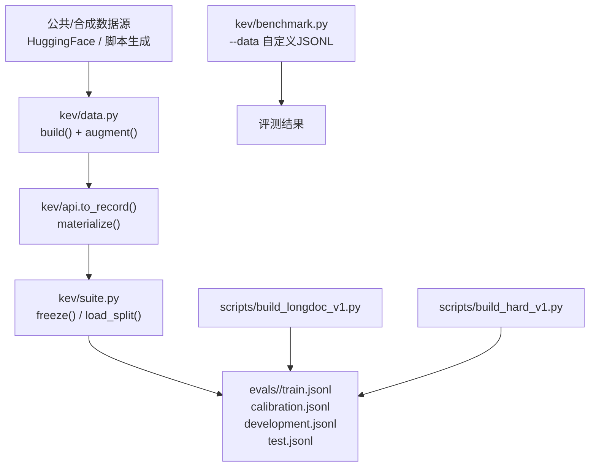
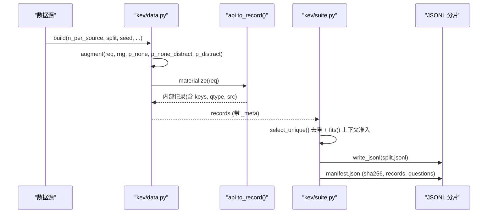
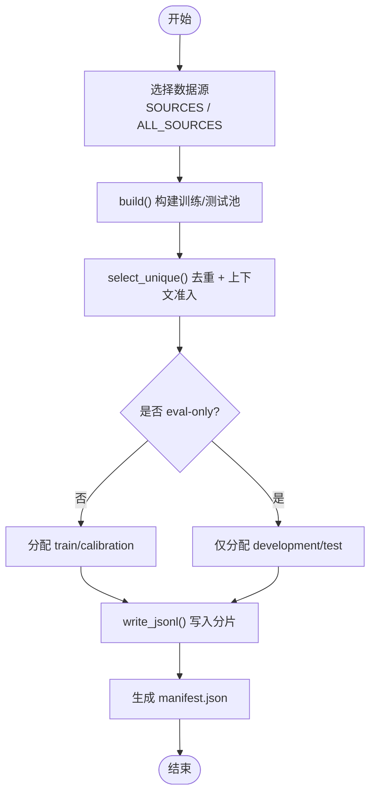
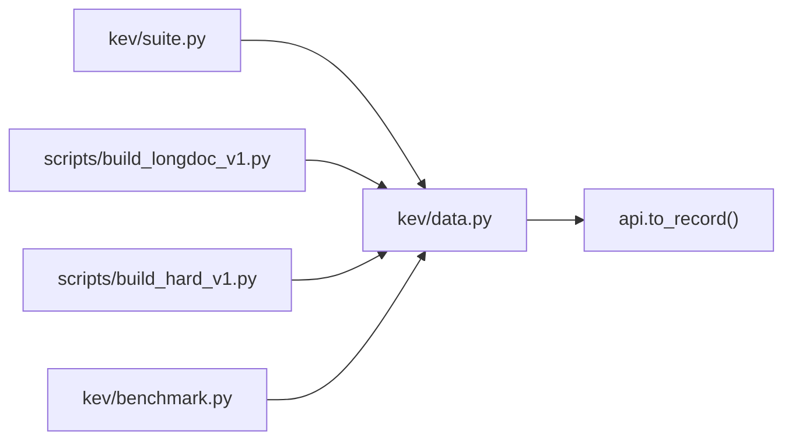

# 数据准备

<cite>
**本文引用的文件**   
- [kev/data.py](file://kev/data.py)
- [kev/suite.py](file://kev/suite.py)
- [scripts/build_longdoc_v1.py](file://scripts/build_longdoc_v1.py)
- [scripts/build_hard_v1.py](file://scripts/build_hard_v1.py)
- [kev/benchmark.py](file://kev/benchmark.py)
</cite>

## 目录
1. [引言](#引言)
2. [项目结构](#项目结构)
3. [核心组件](#核心组件)
4. [架构总览](#架构总览)
5. [详细组件分析](#详细组件分析)
6. [依赖关系分析](#依赖关系分析)
7. [性能与规模特性](#性能与规模特性)
8. [故障排查指南](#故障排查指南)
9. [结论](#结论)
10. [附录：JSONL 规范与字段字典](#附录jsonl-规范与字段字典)

## 引言
本文件面向 Kev 的数据准备流程，目标是帮助读者理解并正确构建、验证和使用 Kev 的训练与评测数据集。文档覆盖以下要点：
- JSONL 文件格式规范：状态字段、问题类型（choice、noul、score）、标签定义、元数据结构。
- 数据集划分机制：训练集、校准集、开发集、测试集的生成与冻结流程。
- 数据增强策略：选项排列、none 选项注入、干扰项添加、最小对构造。
- 公共数据集与合成数据的处理：来源映射、eval_only 限制、过滤规则。
- 自定义数据集构建与验证工具使用方法。
- 数据质量检查、格式校验与常见问题解决方案。

## 项目结构
Kev 的数据准备由“公共/合成数据源 → 统一请求格式 → 内部记录 → 分片冻结”的流水线组成，关键路径如下：
- 公共数据源转换与增强：`kev/data.py`
- 分片冻结、清单与加载校验：`kev/suite.py`
- 长文档评测套件构建：`scripts/build_longdoc_v1.py`
- 决策类评测套件构建：`scripts/build_hard_v1.py`
- 自定义 JSONL 评测入口：`kev/benchmark.py`

**图表来源**
- [kev/data.py:298-343](file://kev/data.py#L298-L343)
- [kev/suite.py:316-410](file://kev/suite.py#L316-L410)
- [scripts/build_longdoc_v1.py:348-404](file://scripts/build_longdoc_v1.py#L348-L404)
- [scripts/build_hard_v1.py:179-216](file://scripts/build_hard_v1.py#L179-L216)
- [kev/benchmark.py:177-191](file://kev/benchmark.py#L177-L191)

**章节来源**
- [kev/data.py:1-7](file://kev/data.py#L1-L7)
- [kev/suite.py:19-45](file://kev/suite.py#L19-L45)

## 核心组件
本节聚焦数据准备的四个核心模块及其职责：
- `kev/data.py`：将外部数据集转换为 Kev 的统一请求形状；提供增强函数；提供自定义 JSONL 读取与 API 请求序列化。
- `kev/suite.py`：负责分片冻结、清单管理、分区下载与完整性校验；提供训练合法性校验。
- `scripts/build_longdoc_v1.py`：构建长文档评测套件（eval-only），按长度桶划分开发与测试集。
- `scripts/build_hard_v1.py`：构建决策类评测套件（可训练或 eval-only），按家族与模板划分三集。

**章节来源**
- [kev/data.py:298-411](file://kev/data.py#L298-L411)
- [kev/suite.py:181-220](file://kev/suite.py#L181-L220)
- [scripts/build_longdoc_v1.py:1-32](file://scripts/build_longdoc_v1.py#L1-L32)
- [scripts/build_hard_v1.py:1-24](file://scripts/build_hard_v1.py#L1-L24)

## 架构总览
下图展示从原始数据到最终 JSONL 分片的端到端流程，包括增强、材料化、去重、上下文准入与分片写入。

**图表来源**
- [kev/data.py:298-343](file://kev/data.py#L298-L343)
- [kev/data.py:397-411](file://kev/data.py#L397-L411)
- [kev/suite.py:286-304](file://kev/suite.py#L286-L304)
- [kev/suite.py:316-410](file://kev/suite.py#L316-L410)

## 详细组件分析

### JSONL 文件格式规范
Kev 使用每行一个 JSON 对象的 JSONL 格式存储“标注请求”。每条记录包含：
- `state`：模型看到的上下文，可以是字符串、结构化对象或对话列表。
- `questions`：键值对的问题集合，每个问题包含：
  - `type`：`choice`（多选一）、`noul`（是非判断）、`score`（等级评分）。
  - `instructions`：问题指令文本。
  - `criteria`：仅 `choice` 需要，为选项名到解释的映射；`score` 可为等级列表；`noul` 通常不需要。
  - `label`：答案标识。`choice` 为选项名；`noul` 为布尔；`score` 为等级索引（从 0 开始）。
  - `src`：数据来源标记（可选，自定义时会自动填充）。
- `_meta`：元数据，包含来源、版本、ID、分组 ID、分割、文本哈希等。

示例结构（以文字描述代替代码）：
- 一条记录有 `state` 和 `questions`，其中 `questions` 至少包含一个问题。
- `choice` 问题的 `label` 必须等于 `criteria` 中的某个键。
- `noul` 问题的 `label` 是布尔值。
- `score` 问题的 `label` 是整数索引，对应 `criteria` 列表的位置。

**章节来源**
- [kev/data.py:362-386](file://kev/data.py#L362-L386)
- [kev/data.py:389-411](file://kev/data.py#L389-L411)

### 状态字段与问题类型
- 状态字段支持多种形态：纯文本、文档对象、工单对象、对话历史等。
- 问题类型：
  - `choice`：多选项选择，需 `criteria` 与 `label`。
  - `noul`：是非题，`label` 为布尔。
  - `score`：等级评分，`criteria` 为有序等级列表，`label` 为索引。

这些类型在 `materialize()` 中会被标准化为内部表示，用于训练与评测。

**章节来源**
- [kev/data.py:397-411](file://kev/data.py#L397-L411)

### 标签定义与元数据结构
- 标签定义：
  - `choice`：选项名称。
  - `noul`：布尔值。
  - `score`：等级索引。
- 元数据 `_meta`：
  - `source`：数据来源（如 `banking77`、`longdoc_cuad`）。
  - `variant`：变体（如 `clean`）。
  - `id`：唯一标识。
  - `group_id`：组标识（用于对比对或成对样本）。
  - `split`：分割（如 `train`、`development`、`test`）。
  - `text_sha256`：归一化后的文本哈希，用于去重。
  - 其他字段依数据来源而定（如 `bucket`、`target_depth`、`family` 等）。

**章节来源**
- [kev/data.py:312-315](file://kev/data.py#L312-L315)
- [scripts/build_longdoc_v1.py:259-263](file://scripts/build_longdoc_v1.py#L259-L263)
- [scripts/build_hard_v1.py:126-131](file://scripts/build_hard_v1.py#L126-L131)

### 数据集划分机制
Kev 的分片冻结流程如下：
1. 从 `SOURCES` 或 `ALL_SOURCES` 中选择数据源。
2. 对每个源调用 `build()` 获取训练或测试池。
3. 通过 `select_unique()` 进行文本去重与上下文准入检查。
4. 分配至 `train`、`calibration`、`development`、`test` 四个分片。
5. 写入 JSONL 并生成 `manifest.json`，包含 sha256、记录数、问题数等。

对于 eval-only 源（如 MMLU、QNLI、PAWS、SciQ），不进入训练集，仅用于开发与测试。

**图表来源**
- [kev/suite.py:316-410](file://kev/suite.py#L316-L410)
- [kev/data.py:298-317](file://kev/data.py#L298-L317)

**章节来源**
- [kev/suite.py:316-410](file://kev/suite.py#L316-L410)
- [kev/data.py:298-317](file://kev/data.py#L298-L317)

### 数据增强技术
Kev 提供多种增强策略，主要用于提升模型的鲁棒性与泛化能力：
- 选项排列：每次增强都会随机打乱 `criteria` 的顺序，避免模型学习选项位置偏差。
- none 选项注入：
  - 作为正确答案：移除原正确选项，插入“以上都不是”类选项。
  - 作为错误选项：保留原正确选项，同时插入 none 选项。
- 干扰项添加：从预定义的干扰项池中随机选择一个加入 `criteria`。
- 最小对构造：为 choice 问题生成两个变体，一个包含 none 选项且答案为 none，另一个移除原正确选项使 none 成为正确答案。

增强参数：
- `p_none`：none 作为正确答案的概率。
- `p_none_distract`：none 作为干扰项的概率。
- `p_distract`：添加无关干扰项的概率。

**章节来源**
- [kev/data.py:320-359](file://kev/data.py#L320-L359)

### 公共数据集与合成数据处理
- 公共数据集：
  - 通过 `REPOS` 与 `ALL_REPOS` 映射到 HuggingFace 数据集。
  - 支持 parquet 分支锁定，确保可复现。
  - 过滤逻辑：跳过 label=-1 的记录，规范化文本并计算哈希。
- 合成数据：
  - `scripts/build_longdoc_v1.py` 生成服务协议、定位、多跳查询等任务。
  - `scripts/build_hard_v1.py` 生成保险政策、权衡决策、概率推理等任务。
  - 所有合成数据均通过程序化求解器生成标签，无需人工标注。

**章节来源**
- [kev/data.py:16-31](file://kev/data.py#L16-L31)
- [scripts/build_longdoc_v1.py:1-32](file://scripts/build_longdoc_v1.py#L1-L32)
- [scripts/build_hard_v1.py:1-24](file://scripts/build_hard_v1.py#L1-L24)

### eval_only 源的限制与数据过滤规则
- eval_only 源（如 MMLU、Emotion、TweetEval、QNLI、PAWS、SciQ）不参与训练，仅用于评估迁移能力。
- 训练合法性校验：`validate_training()` 会拒绝来自 eval_only 或未声明的训练源。
- 数据过滤：
  - 跳过 label=-1 的记录。
  - 文本归一化后计算哈希，用于去重。
  - 上下文准入检查：确保记录在 tokenizer 下不超过最大分支长度。

**章节来源**
- [kev/data.py:283-291](file://kev/data.py#L283-L291)
- [kev/suite.py:181-197](file://kev/suite.py#L181-L197)
- [kev/data.py:85-97](file://kev/data.py#L85-L97)

### 自定义数据集构建指南
用户可通过 `load_records()` 加载自定义 JSONL 文件，格式需符合 Kev 的请求形状：
- 每条记录必须有 `state` 和 `questions`。
- 每个问题必须有 `label`。
- `_meta` 会自动填充，包括 `source`、`variant`、`id`、`group_id`、`split`、`text_sha256`。

使用方式：
- 在 `kev/benchmark.py` 中使用 `--data` 参数指定自定义 JSONL 文件。
- 或通过 `kev.data.load_records(path, source="custom")` 直接加载。

**章节来源**
- [kev/data.py:362-386](file://kev/data.py#L362-L386)
- [kev/benchmark.py:177-191](file://kev/benchmark.py#L177-L191)

## 依赖关系分析
Kev 的数据准备模块之间存在清晰的依赖关系：
- `kev/data.py` 依赖 `api.to_record()` 进行记录材料化。
- `kev/suite.py` 依赖 `kev.data` 中的 `build()`、`materialize()` 等函数。
- 脚本 `scripts/build_longdoc_v1.py` 与 `scripts/build_hard_v1.py` 依赖 `kev.data.materialize()` 与 `kev.suite` 的工具函数。
- `kev/benchmark.py` 依赖 `kev.data.load_records()` 以支持自定义数据评测。

**图表来源**
- [kev/data.py:13](file://kev/data.py#L13)
- [kev/suite.py:15](file://kev/suite.py#L15)
- [scripts/build_longdoc_v1.py:39-42](file://scripts/build_longdoc_v1.py#L39-L42)
- [scripts/build_hard_v1.py:31-36](file://scripts/build_hard_v1.py#L31-L36)
- [kev/benchmark.py:21](file://kev/benchmark.py#L21)

**章节来源**
- [kev/data.py:1-14](file://kev/data.py#L1-L14)
- [kev/suite.py:13-17](file://kev/suite.py#L13-L17)
- [scripts/build_longdoc_v1.py:39-42](file://scripts/build_longdoc_v1.py#L39-L42)
- [scripts/build_hard_v1.py:31-36](file://scripts/build_hard_v1.py#L31-L36)
- [kev/benchmark.py:21](file://kev/benchmark.py#L21)

## 性能与规模特性
- 文本去重：基于归一化文本的 SHA256 哈希，确保跨分片去重。
- 上下文准入：使用 `fits()` 检查记录是否在 tokenizer 的最大分支长度内。
- 分片大小：大分片（超过 10MB）被 gitignore，通过 Hub 镜像拉取并校验。
- 长文档评测：按 4k、8k、16k、32k、64k 桶划分，确保状态与问题行均在预算内。

**章节来源**
- [kev/suite.py:286-304](file://kev/suite.py#L286-L304)
- [scripts/build_longdoc_v1.py:46-58](file://scripts/build_longdoc_v1.py#L46-L58)
- [scripts/build_longdoc_v1.py:296-308](file://scripts/build_longdoc_v1.py#L296-L308)

## 故障排查指南
常见问题与解决方案：
- 记录缺少 `state` 或 `questions`：检查 JSONL 格式是否符合规范。
- 问题缺少 `label`：确保每个问题都有标签。
- eval-only 源误入训练集：检查 `manifest.json` 中的 `trainable_sources` 与 `eval_only_sources`。
- 上下文超限：调整数据增强参数或减少选项数量。
- 重复状态：检查 `_meta.text_sha256` 是否唯一。

**章节来源**
- [kev/data.py:372-386](file://kev/data.py#L372-L386)
- [kev/suite.py:181-197](file://kev/suite.py#L181-L197)

## 结论
Kev 的数据准备流程提供了从公共数据到合成数据、从增强到分片冻结的完整工具链。通过严格的格式规范、去重机制与上下文准入检查，确保了数据的一致性与可复现性。用户可基于此框架扩展自定义数据集，并通过 `benchmark.py` 进行评测。

## 附录：JSONL 规范与字段字典
- `state`：上下文，支持字符串、对象或列表。
- `questions`：问题字典，键为问题 ID，值为问题对象。
- `type`：`choice`、`noul`、`score`。
- `instructions`：问题指令。
- `criteria`：选项映射或等级列表。
- `label`：答案标识，类型依 `type` 而定。
- `_meta`：元数据，包含来源、版本、ID、分组、分割、文本哈希等。

**章节来源**
- [kev/data.py:362-386](file://kev/data.py#L362-L386)