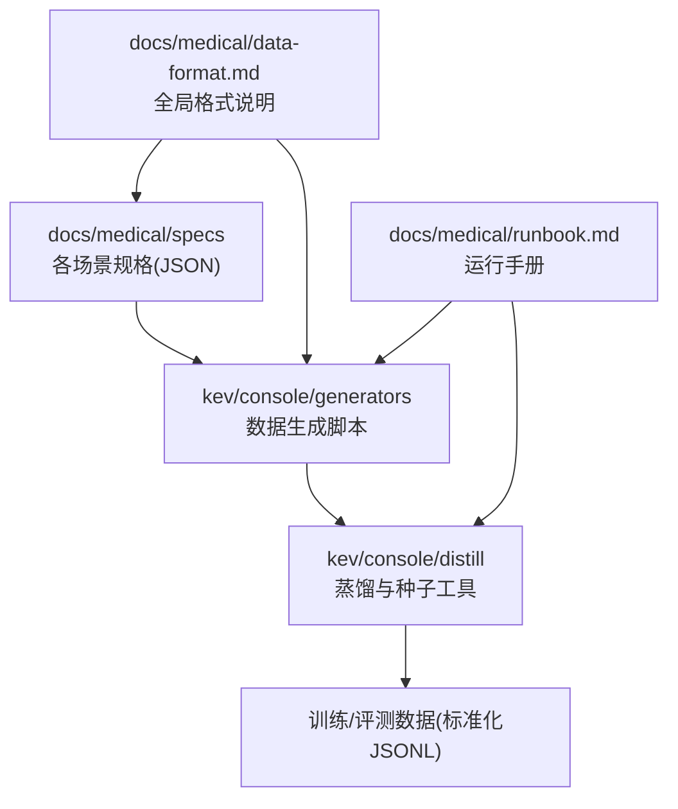
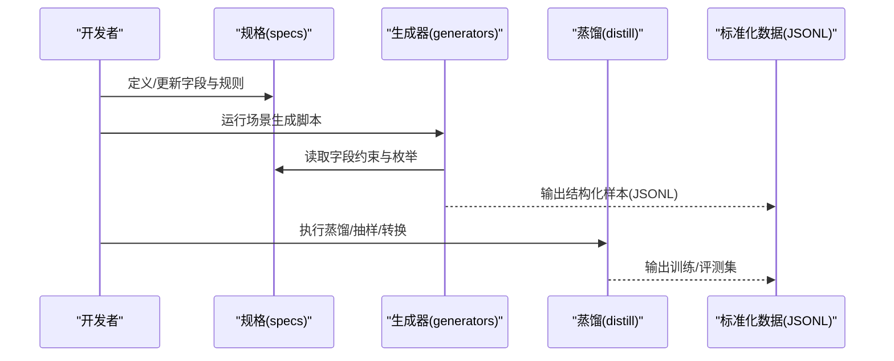
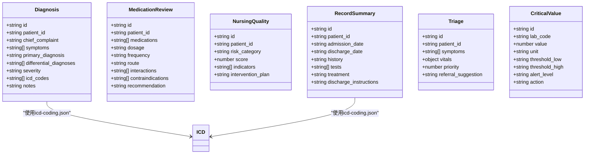
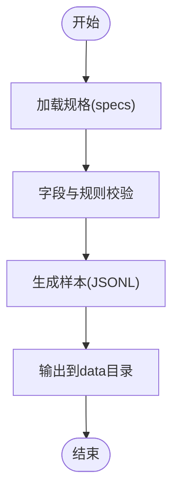
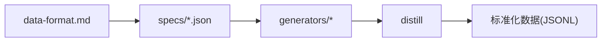

# 医疗数据格式规范

<cite>
**本文引用的文件**   
- [README.md](file://README.md)
- [data-format.md](file://docs/medical/data-format.md)
- [runbook.md](file://docs/medical/runbook.md)
- [distill.md](file://kev/console/distill.md)
- [specs/diagnosis.json](file://docs/medical/specs/diagnosis.json)
- [specs/icd-coding.json](file://docs/medical/specs/icd-coding.json)
- [specs/medication-review.json](file://docs/medical/specs/medication-review.json)
- [specs/nursing-quality.json](file://docs/medical/specs/nursing-quality.json)
- [specs/record-summary.json](file://docs/medical/specs/record-summary.json)
- [specs/triage.json](file://docs/medical/specs/triage.json)
- [specs/critical-value.json](file://docs/medical/specs/critical-value.json)
- [generators/common.py](file://kev/console/generators/common.py)
- [generators/gen_diagnosis.py](file://kev/console/generators/gen_diagnosis.py)
- [generators/gen_medication_review.py](file://kev/console/generators/gen_medication_review.py)
- [generators/gen_nursing_quality.py](file://kev/console/generators/gen_nursing_quality.py)
- [generators/gen_record_summary.py](file://kev/console/generators/gen_record_summary.py)
- [generators/gen_triage.py](file://kev/console/generators/gen_triage.py)
- [generators/make_goldset.py](file://kev/console/generators/make_goldset.py)
</cite>

## 目录
1. [引言](#引言)
2. [项目结构](#项目结构)
3. [核心组件](#核心组件)
4. [架构总览](#架构总览)
5. [详细组件分析](#详细组件分析)
6. [依赖关系分析](#依赖关系分析)
7. [性能与规模考量](#性能与规模考量)
8. [故障排查指南](#故障排查指南)
9. [结论](#结论)
10. [附录：字段与校验清单](#附录字段与校验清单)

## 引言
本规范定义医疗领域数据在生成、蒸馏与评测流程中的统一数据格式、字段语义、约束规则与校验方法，覆盖诊断、用药审查、护理质量、病历摘要、分诊、危急值等场景。目标是为数据生产者、脚本作者与评测人员提供一致的数据契约，确保跨工具链（生成器、蒸馏、评测）的一致性与可复现性。

## 项目结构
医疗相关代码与文档集中在 docs/medical 下，采用“规格驱动”的组织方式：
- specs：各场景的权威数据规格（JSON），定义字段、取值范围、必填项与业务规则。
- generators：基于 specs 的数据生成脚本，输出标准 JSONL 数据。
- distill：数据蒸馏与种子管理工具链，将原始数据转换为训练/评测所需格式。
- data-format.md：全局数据格式说明，约定通用字段、编码与版本策略。
- runbook.md / runbook-train.md：运行手册，指导端到端数据流水线。

图示来源
- [data-format.md:1-200](file://docs/medical/data-format.md#L1-L200)
- [generators/common.py:1-60](file://kev/console/generators/common.py#L1-L60)
- [runbook.md:1-120](file://docs/medical/runbook.md#L1-L120)

章节来源
- [README.md:1-120](file://README.md#L1-L120)
- [data-format.md:1-200](file://docs/medical/data-format.md#L1-L200)
- [runbook.md:1-120](file://docs/medical/runbook.md#L1-L120)

## 核心组件
- 规格层（specs）：以 JSON 描述每个场景的数据模型、字段类型、枚举值、必填项、业务规则与示例。
- 生成器层（generators）：读取 specs，按规则生成结构化样本，输出为 JSONL；包含公共基类与场景脚本。
- 蒸馏层（distill）：对生成数据进行抽样、去重、格式化转换，产出可用于 SFT/评测的标准数据集。
- 全局格式（data-format.md）：定义通用字段、时间/数值单位、编码规范、版本与兼容性策略。
- 运行手册（runbook.md / runbook-train.md）：串联数据准备、生成、蒸馏、训练与评测的端到端步骤。

章节来源
- [data-format.md:1-200](file://docs/medical/data-format.md#L1-L200)
- [generators/common.py:1-60](file://kev/console/generators/common.py#L1-L60)
- [distill.md:1-120](file://kev/console/distill.md#L1-L120)

## 架构总览
下图展示从规格到数据的端到端流程，以及关键输入输出。

图示来源
- [generators/common.py:1-60](file://kev/console/generators/common.py#L1-L60)
- [generators/gen_diagnosis.py:1-40](file://kev/console/generators/gen_diagnosis.py#L1-L40)
- [generators/gen_medication_review.py:1-40](file://kev/console/generators/gen_medication_review.py#L1-L40)
- [generators/gen_nursing_quality.py:1-40](file://kev/console/generators/gen_nursing_quality.py#L1-L40)
- [generators/gen_record_summary.py:1-40](file://kev/console/generators/gen_record_summary.py#L1-L40)
- [generators/gen_triage.py:1-40](file://kev/console/generators/gen_triage.py#L1-L40)
- [distill.md:1-120](file://kev/console/distill.md#L1-L120)

## 详细组件分析

### 全局数据格式（data-format.md）
- 作用：定义所有场景共享的字段命名、数据类型、单位、时间格式、编码、必填/可选规则与版本策略。
- 关键点：
  - 统一字段前缀与命名风格，避免歧义。
  - 时间戳使用标准 ISO 格式，时区明确。
  - 数值字段需标注单位与精度。
  - 文本字段需进行脱敏与规范化处理。
  - 版本化：新增字段保持向后兼容，废弃字段标记 deprecated。

章节来源
- [data-format.md:1-200](file://docs/medical/data-format.md#L1-L200)

### 场景规格（specs/*.json）
- diagnosis.json：诊断任务的数据模型，包括主诊断、鉴别诊断、依据、严重程度、ICD 编码映射等。
- icd-coding.json：ICD 编码表与映射规则，用于诊断与病历摘要的标准化编码。
- medication-review.json：用药审查任务，含药品信息、用法用量、相互作用、禁忌、建议调整等。
- nursing-quality.json：护理质量指标，如压疮风险、跌倒风险、导管相关感染等指标定义与评分规则。
- record-summary.json：病历摘要，含患者基本信息、就诊史、检查检验、治疗过程、出院医嘱等。
- triage.json：分诊任务，含症状、生命体征、优先级、转诊建议等。
- critical-value.json：危急值规则，含阈值、报警级别、处置建议等。

图示来源
- [specs/diagnosis.json:1-200](file://docs/medical/specs/diagnosis.json#L1-L200)
- [specs/icd-coding.json:1-200](file://docs/medical/specs/icd-coding.json#L1-L200)
- [specs/medication-review.json:1-200](file://docs/medical/specs/medication-review.json#L1-L200)
- [specs/nursing-quality.json:1-200](file://docs/medical/specs/nursing-quality.json#L1-L200)
- [specs/record-summary.json:1-200](file://docs/medical/specs/record-summary.json#L1-L200)
- [specs/triage.json:1-200](file://docs/medical/specs/triage.json#L1-L200)
- [specs/critical-value.json:1-200](file://docs/medical/specs/critical-value.json#L1-L200)

章节来源
- [specs/diagnosis.json:1-200](file://docs/medical/specs/diagnosis.json#L1-L200)
- [specs/icd-coding.json:1-200](file://docs/medical/specs/icd-coding.json#L1-L200)
- [specs/medication-review.json:1-200](file://docs/medical/specs/medication-review.json#L1-L200)
- [specs/nursing-quality.json:1-200](file://docs/medical/specs/nursing-quality.json#L1-L200)
- [specs/record-summary.json:1-200](file://docs/medical/specs/record-summary.json#L1-L200)
- [specs/triage.json:1-200](file://docs/medical/specs/triage.json#L1-L200)
- [specs/critical-value.json:1-200](file://docs/medical/specs/critical-value.json#L1-L200)

### 生成器（generators）
- common.py：公共基类与常量，集中加载 specs 路径、通用校验逻辑、随机种子与批量生成模板。
- gen_diagnosis.py：根据 diagnosis.json 生成诊断样本，遵循字段约束与 ICD 映射。
- gen_medication_review.py：根据 medication-review.json 生成用药审查样本，包含药物信息与交互校验。
- gen_nursing_quality.py：根据 nursing-quality.json 生成护理质量样本，计算风险评分与干预计划。
- gen_record_summary.py：根据 record-summary.json 生成病历摘要，支持两级拆分与编码一致性。
- gen_triage.py：根据 triage.json 生成分诊样本，结合症状与生命体征判定优先级。
- make_goldset.py：从已生成数据中抽取黄金集，用于评测或校准。

图示来源
- [generators/common.py:1-60](file://kev/console/generators/common.py#L1-L60)
- [generators/gen_diagnosis.py:1-40](file://kev/console/generators/gen_diagnosis.py#L1-L40)
- [generators/gen_medication_review.py:1-40](file://kev/console/generators/gen_medication_review.py#L1-L40)
- [generators/gen_nursing_quality.py:1-40](file://kev/console/generators/gen_nursing_quality.py#L1-L40)
- [generators/gen_record_summary.py:1-40](file://kev/console/generators/gen_record_summary.py#L1-L40)
- [generators/gen_triage.py:1-40](file://kev/console/generators/gen_triage.py#L1-L40)
- [generators/make_goldset.py:1-40](file://kev/console/generators/make_goldset.py#L1-L40)

章节来源
- [generators/common.py:1-60](file://kev/console/generators/common.py#L1-L60)
- [generators/gen_diagnosis.py:1-40](file://kev/console/generators/gen_diagnosis.py#L1-L40)
- [generators/gen_medication_review.py:1-40](file://kev/console/generators/gen_medication_review.py#L1-L40)
- [generators/gen_nursing_quality.py:1-40](file://kev/console/generators/gen_nursing_quality.py#L1-L40)
- [generators/gen_record_summary.py:1-40](file://kev/console/generators/gen_record_summary.py#L1-L40)
- [generators/gen_triage.py:1-40](file://kev/console/generators/gen_triage.py#L1-L40)
- [generators/make_goldset.py:1-40](file://kev/console/generators/make_goldset.py#L1-L40)

### 蒸馏与种子（distill）
- 作用：对生成数据进行抽样、去重、格式化转换，产出可用于 SFT/评测的标准数据集。
- 关键流程：
  - 从 seeds 目录加载种子数据。
  - 根据场景配置（configs/*.yaml）进行采样与过滤。
  - 将数据转换为 Kev 训练/评测所需的格式。
  - 统计数据量与分布，确保覆盖度与平衡性。

章节来源
- [distill.md:1-120](file://kev/console/distill.md#L1-L120)

## 依赖关系分析
- 生成器依赖 specs：所有场景脚本均通过 common.py 加载对应 specs，保证字段与规则一致性。
- 蒸馏依赖生成器输出：蒸馏流程消费 JSONL 数据，并依据场景配置进行转换。
- 全局格式作为契约：data-format.md 是所有组件共同遵守的契约，任何变更需同步更新 specs 与生成器。

图示来源
- [data-format.md:1-200](file://docs/medical/data-format.md#L1-L200)
- [generators/common.py:1-60](file://kev/console/generators/common.py#L1-L60)
- [distill.md:1-120](file://kev/console/distill.md#L1-L120)

章节来源
- [data-format.md:1-200](file://docs/medical/data-format.md#L1-L200)
- [generators/common.py:1-60](file://kev/console/generators/common.py#L1-L60)
- [distill.md:1-120](file://kev/console/distill.md#L1-L120)

## 性能与规模考量
- 生成阶段：批量生成时注意内存占用，合理设置批次大小与随机种子以保证可复现性。
- 蒸馏阶段：抽样与去重算法需考虑数据分布，避免长尾类别过少或重复样本过多。
- 存储与传输：JSONL 文件建议按场景分片，便于并行处理与增量更新。
- 校验开销：字段校验与规则检查应在生成阶段尽早失败，减少无效数据进入下游。

[本节为通用指导，不直接分析具体文件]

## 故障排查指南
- 字段缺失或类型不符：检查对应 specs 的必填项与类型定义，确认生成器是否遵循约束。
- ICD 编码不一致：核对 icd-coding.json 映射表，确保诊断与病历摘要中的编码有效且一致。
- 数值单位错误：确认数值字段的单位与精度是否符合 data-format.md 规范。
- 蒸馏结果异常：检查种子数据与场景配置，确认采样比例与过滤条件是否合理。
- 生成脚本报错：查看 common.py 中的常量与路径配置，确认 specs 路径正确且可读。

章节来源
- [data-format.md:1-200](file://docs/medical/data-format.md#L1-L200)
- [generators/common.py:1-60](file://kev/console/generators/common.py#L1-L60)
- [specs/icd-coding.json:1-200](file://docs/medical/specs/icd-coding.json#L1-L200)

## 结论
本规范通过“规格驱动”的方式，将医疗数据格式、生成流程与蒸馏流程统一到一致的契约之下。specs 作为权威来源，确保各场景数据的一致性；generators 与 distill 严格遵循契约，保障数据质量与可复现性。建议在每次规格变更后，同步更新生成器与蒸馏配置，并进行端到端验证。

[本节为总结性内容，不直接分析具体文件]

## 附录：字段与校验清单
- 通用字段：id、patient_id、timestamp、source、version。
- 诊断字段：chief_complaint、symptoms、primary_diagnosis、differential_diagnoses、severity、icd_codes。
- 用药审查字段：medications、dosage、frequency、route、interactions、contraindications、recommendation。
- 护理质量字段：risk_category、score、indicators、intervention_plan。
- 病历摘要字段：admission_date、discharge_date、history、tests、treatment、discharge_instructions。
- 分诊字段：symptoms、vitals、priority、referral_suggestion。
- 危急值字段：lab_code、value、unit、threshold_low、threshold_high、alert_level、action。

章节来源
- [specs/diagnosis.json:1-200](file://docs/medical/specs/diagnosis.json#L1-L200)
- [specs/medication-review.json:1-200](file://docs/medical/specs/medication-review.json#L1-L200)
- [specs/nursing-quality.json:1-200](file://docs/medical/specs/nursing-quality.json#L1-L200)
- [specs/record-summary.json:1-200](file://docs/medical/specs/record-summary.json#L1-L200)
- [specs/triage.json:1-200](file://docs/medical/specs/triage.json#L1-L200)
- [specs/critical-value.json:1-200](file://docs/medical/specs/critical-value.json#L1-L200)