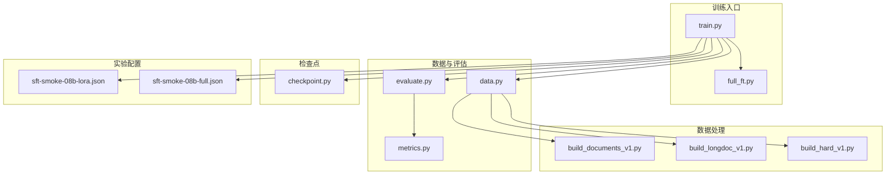
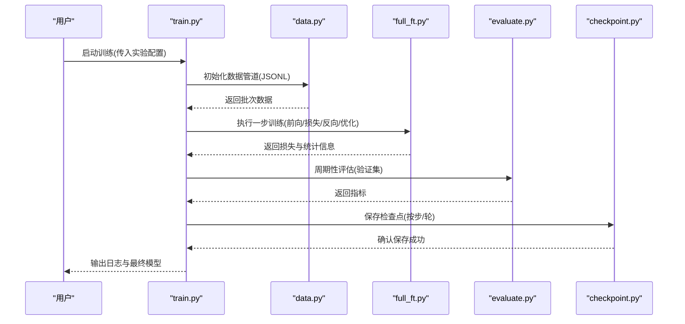
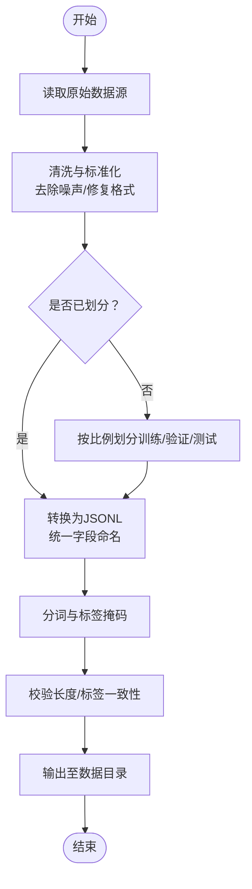
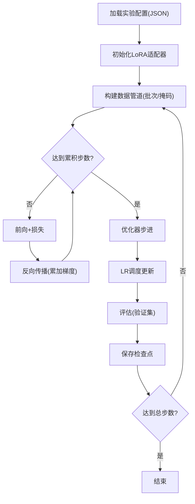
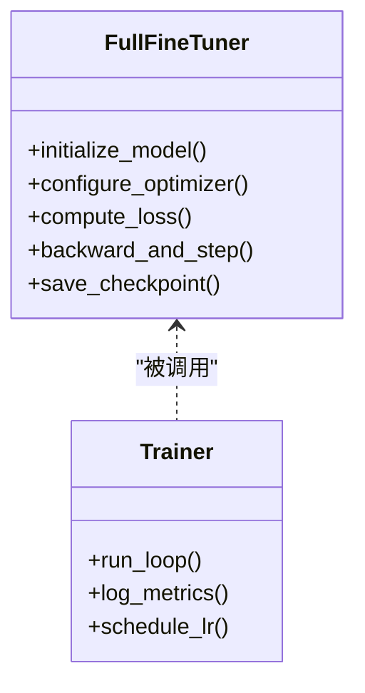
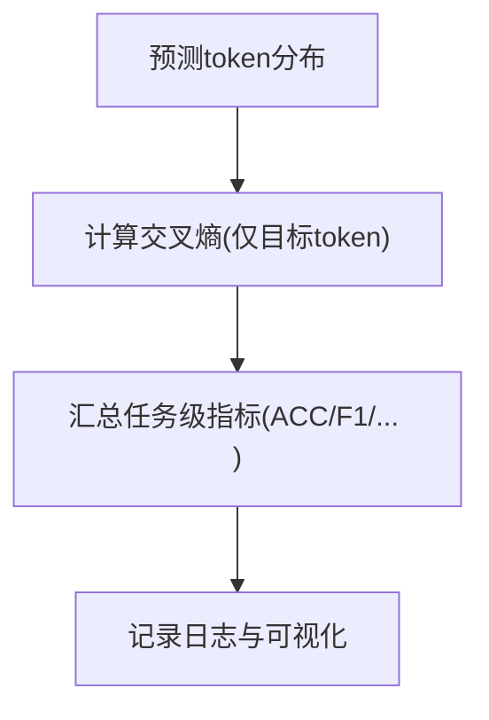
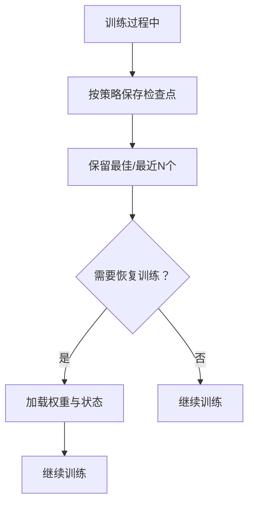
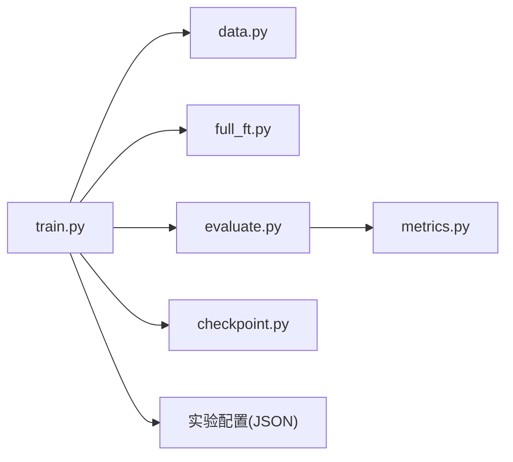

# 训练框架

<cite>
**本文引用的文件**   
- [README.md](file://README.md)
- [pyproject.toml](file://pyproject.toml)
- [kev/train.py](file://kev/train.py)
- [kev/full_ft.py](file://kev/full_ft.py)
- [kev/data.py](file://kev/data.py)
- [kev/evaluate.py](file://kev/evaluate.py)
- [kev/metrics.py](file://kev/metrics.py)
- [kev/checkpoint.py](file://kev/checkpoint.py)
- [experiments/sft-smoke-08b-lora.json](file://experiments/sft-smoke-08b-lora.json)
- [experiments/sft-smoke-08b-full.json](file://experiments/sft-smoke-08b-full.json)
- [scripts/build_documents_v1.py](file://scripts/build_documents_v1.py)
- [scripts/build_longdoc_v1.py](file://scripts/build_longdoc_v1.py)
- [scripts/build_hard_v1.py](file://scripts/build_hard_v1.py)
</cite>

## 目录
1. [简介](#简介)
2. [项目结构](#项目结构)
3. [核心组件](#核心组件)
4. [架构总览](#架构总览)
5. [详细组件分析](#详细组件分析)
6. [依赖关系分析](#依赖关系分析)
7. [性能考量](#性能考量)
8. [故障排查指南](#故障排查指南)
9. [结论](#结论)
10. [附录](#附录)

## 简介
本文件面向 Kev 训练框架，系统性说明数据准备、LoRA 微调与全参数微调流程、损失函数与评估指标、检查点管理、超参数调优策略以及常见问题与优化技巧。文档以仓库中的训练脚本、实验配置与数据处理脚本为依据，帮助读者从零开始完成从数据到模型产出的完整闭环。

## 项目结构
Kev 的训练相关代码集中在 kev 包内，实验配置位于 experiments 目录，数据处理脚本位于 scripts 目录。关键路径如下：
- 训练入口与调度：kev/train.py
- 全参数微调实现：kev/full_ft.py
- 数据加载与预处理：kev/data.py
- 评估与指标：kev/evaluate.py, kev/metrics.py
- 检查点管理：kev/checkpoint.py
- 示例实验配置（LoRA/全参）：experiments/*.json
- 数据构建脚本：scripts/build_*.py

图表来源
- [kev/train.py](file://kev/train.py)
- [kev/full_ft.py](file://kev/full_ft.py)
- [kev/data.py](file://kev/data.py)
- [kev/evaluate.py](file://kev/evaluate.py)
- [kev/metrics.py](file://kev/metrics.py)
- [kev/checkpoint.py](file://kev/checkpoint.py)
- [experiments/sft-smoke-08b-lora.json](file://experiments/sft-smoke-08b-lora.json)
- [experiments/sft-smoke-08b-full.json](file://experiments/sft-smoke-08b-full.json)
- [scripts/build_documents_v1.py](file://scripts/build_documents_v1.py)
- [scripts/build_longdoc_v1.py](file://scripts/build_longdoc_v1.py)
- [scripts/build_hard_v1.py](file://scripts/build_hard_v1.py)

章节来源
- [README.md](file://README.md)
- [pyproject.toml](file://pyproject.toml)

## 核心组件
- 训练编排器：负责解析实验配置、初始化数据管道、构建模型与优化器、执行训练循环、记录日志与保存检查点。
- 全参数微调模块：封装全量参数更新逻辑，包括梯度累积、学习率调度、混合精度等。
- 数据管道：统一读取 JSONL 数据集、进行分词与标签掩码、批次采样与填充。
- 评估与指标：在验证集上计算损失与任务相关指标，输出可比较的评测结果。
- 检查点管理器：按步数或轮次保存权重与状态，支持断点续训与最佳模型选择。

章节来源
- [kev/train.py](file://kev/train.py)
- [kev/full_ft.py](file://kev/full_ft.py)
- [kev/data.py](file://kev/data.py)
- [kev/evaluate.py](file://kev/evaluate.py)
- [kev/metrics.py](file://kev/metrics.py)
- [kev/checkpoint.py](file://kev/checkpoint.py)

## 架构总览
下图展示一次典型训练的端到端流程：从实验配置驱动，到数据加载、模型前向、损失计算、反向传播、优化器步进、评估与检查点保存。

图表来源
- [kev/train.py](file://kev/train.py)
- [kev/data.py](file://kev/data.py)
- [kev/full_ft.py](file://kev/full_ft.py)
- [kev/evaluate.py](file://kev/evaluate.py)
- [kev/checkpoint.py](file://kev/checkpoint.py)

## 详细组件分析

### 数据准备流程（JSONL、标签定义、数据集划分）
- 文件格式：采用 JSONL 每行一条样本，字段通常包含输入文本、目标输出、可选元数据（如来源、难度、领域）。
- 标签定义：对指令式数据，通常将“系统提示+用户问题”作为输入，“助手回答”作为目标；对对话式数据，使用多轮消息序列，并对非目标 token 进行掩码以避免监督信号泄漏。
- 数据集划分：训练/验证/测试集通过配置文件或脚本划分，确保不同任务域（如文档问答、长文档、难题）均衡覆盖。
- 数据构建脚本：提供多个构建脚本用于生成不同评测/训练集，便于复现实验与扩展新数据源。

章节来源
- [scripts/build_documents_v1.py](file://scripts/build_documents_v1.py)
- [scripts/build_longdoc_v1.py](file://scripts/build_longdoc_v1.py)
- [scripts/build_hard_v1.py](file://scripts/build_hard_v1.py)
- [kev/data.py](file://kev/data.py)

### LoRA 微调完整流程（参数配置、学习率调度、批次处理、梯度累积）
- 参数配置：通过实验 JSON 指定基座模型、LoRA 秩/缩放、目标层、学习率、warmup 步数、总步数、批大小、梯度累积步数、随机种子等。
- 学习率调度：常见为线性 warmup + cosine 衰减，配合最小学习率阈值。
- 批次处理：支持微批次（micro-batch）与梯度累积，使显存受限环境下等效大 batch 训练。
- 训练循环：每个 step 执行前向、损失计算、反向、优化器步进与 LR 更新，定期评估并保存检查点。

章节来源
- [experiments/sft-smoke-08b-lora.json](file://experiments/sft-smoke-08b-lora.json)
- [kev/train.py](file://kev/train.py)
- [kev/data.py](file://kev/data.py)

### 全参数微调实现（Kev-27B 训练配置）
- 全参微调要点：冻结部分模块（如嵌入层或特定头）可选；启用混合精度与梯度裁剪；合理设置 batch size 与累积步数以适配显存。
- Kev-27B 配置参考：在 experiments 目录下存在针对大模型的实验配置样例，涵盖学习率、步数、数据配比与评估频率等。
- 训练稳定性：建议开启梯度累积、梯度范数裁剪、EMA（若可用）、早停（基于验证损失或指标）。

图表来源
- [kev/full_ft.py](file://kev/full_ft.py)
- [kev/train.py](file://kev/train.py)

章节来源
- [experiments/sft-smoke-08b-full.json](file://experiments/sft-smoke-08b-full.json)
- [kev/full_ft.py](file://kev/full_ft.py)
- [kev/train.py](file://kev/train.py)

### 损失函数设计与评估指标
- 损失函数：通常采用交叉熵损失，对目标 token 计算损失并对非目标 token 掩码；对于对比学习或多任务场景，可叠加额外损失项。
- 评估指标：除困惑度/损失外，结合任务指标（如准确率、F1、BLEU、ROUGE、自定义评分），并在验证集上监控以防过拟合。
- 指标计算：在 evaluate.py 中聚合各子任务的指标，metrics.py 提供具体计算方法。

图表来源
- [kev/evaluate.py](file://kev/evaluate.py)
- [kev/metrics.py](file://kev/metrics.py)

章节来源
- [kev/evaluate.py](file://kev/evaluate.py)
- [kev/metrics.py](file://kev/metrics.py)

### 模型检查点管理
- 保存策略：按步数或轮次保存，保留最近 N 个检查点与最佳模型（基于验证损失或指标）。
- 恢复训练：从指定检查点恢复优化器状态、LR 状态与数据迭代器位置，保证可中断可恢复。
- 存储优化：压缩权重、分离日志与权重目录、定期清理旧检查点。

图表来源
- [kev/checkpoint.py](file://kev/checkpoint.py)

章节来源
- [kev/checkpoint.py](file://kev/checkpoint.py)

### 超参数调优指南
- 学习率选择：从小值起步（如 1e-5~5e-5），配合 warmup 与 cosine 衰减；大模型全参微调可适当降低学习率。
- 批次大小设置：根据显存上限调整 micro-batch 与累积步数，保持有效 batch 规模稳定。
- 训练轮数确定：以验证集指标为准，观察损失曲线与指标拐点，避免过拟合；必要时引入早停。
- LoRA 秩与缩放：秩越大表达能力越强但易过拟合；缩放因子影响注入强度，需与学习率协同调优。
- 数据配比与质量：优先高质量、多样化数据；对长上下文与难题适当加权。

章节来源
- [experiments/sft-smoke-08b-lora.json](file://experiments/sft-smoke-08b-lora.json)
- [experiments/sft-smoke-08b-full.json](file://experiments/sft-smoke-08b-full.json)
- [kev/train.py](file://kev/train.py)

### 微调脚本使用示例与最佳实践
- 启动 LoRA 微调：使用训练入口传入 LoRA 实验配置，指定数据路径、输出目录与设备。
- 启动全参微调：使用全参实验配置，注意显存与梯度累积设置。
- 最佳实践：
  - 先小规模 smoke 跑通，再扩展到全量数据与大模型。
  - 固定随机种子以保证可复现性。
  - 定期评估并保存最佳模型。
  - 使用分布式/多卡加速时，确保数据并行一致性与通信开销可控。

章节来源
- [kev/train.py](file://kev/train.py)
- [experiments/sft-smoke-08b-lora.json](file://experiments/sft-smoke-08b-lora.json)
- [experiments/sft-smoke-08b-full.json](file://experiments/sft-smoke-08b-full.json)

## 依赖关系分析
训练流程依赖数据管道、评估与检查点模块；实验配置驱动训练行为。下图展示主要依赖关系。

图表来源
- [kev/train.py](file://kev/train.py)
- [kev/data.py](file://kev/data.py)
- [kev/full_ft.py](file://kev/full_ft.py)
- [kev/evaluate.py](file://kev/evaluate.py)
- [kev/metrics.py](file://kev/metrics.py)
- [kev/checkpoint.py](file://kev/checkpoint.py)

章节来源
- [kev/train.py](file://kev/train.py)
- [kev/data.py](file://kev/data.py)
- [kev/full_ft.py](file://kev/full_ft.py)
- [kev/evaluate.py](file://kev/evaluate.py)
- [kev/metrics.py](file://kev/metrics.py)
- [kev/checkpoint.py](file://kev/checkpoint.py)

## 性能考量
- 显存优化：启用混合精度、梯度累积、激活检查点（若可用）、减少不必要的中间张量。
- 吞吐优化：增大有效 batch、使用高效数据加载（预取/缓存）、避免频繁磁盘 IO。
- 数值稳定：梯度裁剪、学习率 warmup、避免过大初始学习率。
- 分布式训练：合理切分数据、控制通信开销、同步策略选择（如异步/同步）。

[本节为通用指导，不直接分析具体文件]

## 故障排查指南
- 训练不收敛：检查学习率是否过大、warmup 是否足够、数据标签是否正确掩码。
- 显存溢出：减小 micro-batch、增加梯度累积、关闭不必要日志或评估频率。
- 评估指标异常：检查评估数据是否与训练数据同分布、指标计算是否包含正确 token 范围。
- 检查点损坏：确认写入权限与磁盘空间，避免中断导致不完整文件；优先恢复最近稳定检查点。

章节来源
- [kev/checkpoint.py](file://kev/checkpoint.py)
- [kev/evaluate.py](file://kev/evaluate.py)
- [kev/train.py](file://kev/train.py)

## 结论
Kev 训练框架通过统一的训练编排、灵活的数据管道、完善的评估与检查点机制，支持从 LoRA 到全参数微调的多种训练范式。借助实验配置与数据处理脚本，用户可以快速复现实验、扩展新数据与新任务，并通过系统的超参数调优与性能优化获得稳定高效的训练效果。

[本节为总结性内容，不直接分析具体文件]

## 附录
- 环境安装与依赖：参考 pyproject.toml 与 README 中的依赖声明与环境要求。
- 更多实验配置：查看 experiments 目录下的其他 JSON 配置，了解不同模型规模与任务域的调参差异。

章节来源
- [pyproject.toml](file://pyproject.toml)
- [README.md](file://README.md)