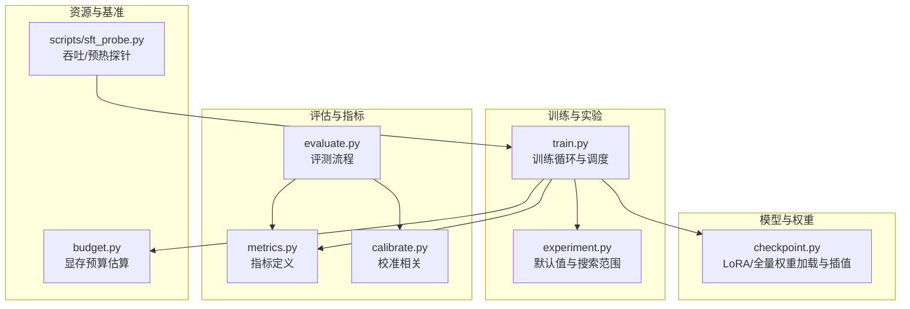
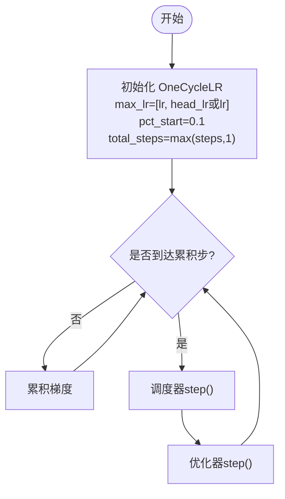
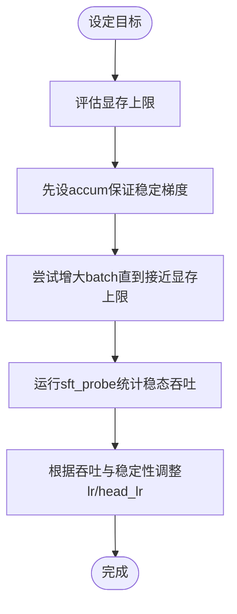
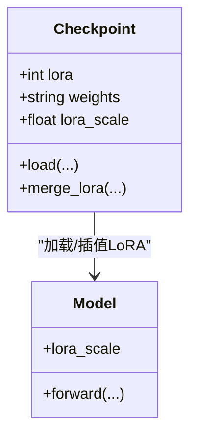
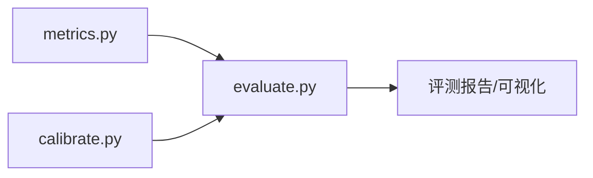
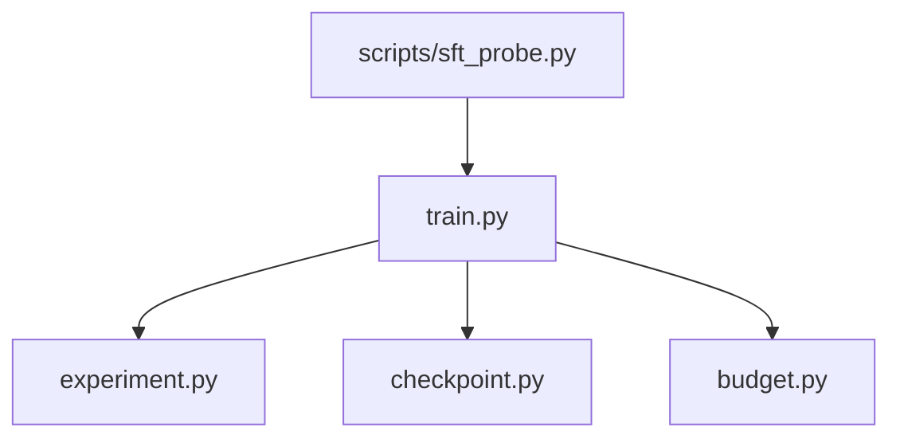

<cite>
**本文引用的文件**   
- [train.py](file://kev/train.py)
- [experiment.py](file://kev/experiment.py)
- [checkpoint.py](file://kev/checkpoint.py)
- [metrics.py](file://kev/metrics.py)
- [evaluate.py](file://kev/evaluate.py)
- [calibrate.py](file://kev/calibrate.py)
- [budget.py](file://kev/budget.py)
- [sft_probe.py](file://scripts/sft_probe.py)
</cite>

## 目录
1. [引言](#引言)
2. [项目结构](#项目结构)
3. [核心组件](#核心组件)
4. [架构总览](#架构总览)
5. [详细组件分析](#详细组件分析)
6. [依赖关系分析](#依赖关系分析)
7. [性能考量](#性能考量)
8. [故障排查指南](#故障排查指南)
9. [结论](#结论)
10. [附录：参考配置与最佳实践](#附录参考配置与最佳实践)

## 引言
本指南面向使用本仓库进行模型微调与实验的工程师与研究员，系统化说明关键超参数的作用机制、学习率调度策略、批次大小选择原则、评估指标体系，以及网格搜索、随机搜索与贝叶斯优化的应用方法。文档同时给出实验跟踪与结果分析工具的使用建议，并总结不同模型规模的最佳实践与参考配置。

## 项目结构
围绕超参数调优的关键代码集中在训练入口、实验默认值与范围、检查点（含 LoRA）管理、指标计算与校准等模块；脚本层提供吞吐与预热相关的基准探针。



**图示来源**
- [train.py:580-590](file://kev/train.py#L580-L590)
- [experiment.py:38-42](file://kev/experiment.py#L38-L42)
- [checkpoint.py:54-64](file://kev/checkpoint.py#L54-L64)
- [metrics.py](file://kev/metrics.py)
- [evaluate.py](file://kev/evaluate.py)
- [calibrate.py](file://kev/calibrate.py)
- [budget.py:7-7](file://kev/budget.py#L7-L7)
- [sft_probe.py:6-6](file://scripts/sft_probe.py#L6-L6)

**章节来源**
- [train.py:580-590](file://kev/train.py#L580-L590)
- [experiment.py:38-42](file://kev/experiment.py#L38-L42)
- [checkpoint.py:54-64](file://kev/checkpoint.py#L54-L64)
- [budget.py:7-7](file://kev/budget.py#L7-L7)
- [sft_probe.py:6-6](file://scripts/sft_probe.py#L6-L6)

## 核心组件
- 学习率与调度
  - 主学习率 lr 与头学习率 head_lr 通过 OneCycleLR 以双峰值数组形式传入，实现“预热+余弦退火”的单周期调度。
  - 预热比例 pct_start=0.1，即前 10% 步数线性上升，随后余弦退火至接近零。
- 批次大小与累积
  - batch 为每步实际批次，accum 为梯度累积步数，有效批次 = batch × accum。
  - 在显存受限场景下，优先增大 accum 以维持稳定梯度估计，再考虑提升 batch。
- LoRA 秩 lora
  - 控制低秩适配矩阵的秩，影响可训练参数量与表达能力；越大越灵活但更易过拟合且显存占用更高。
- 正则化 weight_decay
  - L2 正则项，抑制过拟合；通常与优化器一起设置，需与学习率协同调参。
- 评估指标
  - 准确率、校准误差、分布一致性等由 metrics/evaluate/calibrate 模块支撑，用于衡量分类质量与概率可靠性。

**章节来源**
- [train.py:586-586](file://kev/train.py#L586-L586)
- [experiment.py:38-42](file://kev/experiment.py#L38-L42)
- [checkpoint.py:54-64](file://kev/checkpoint.py#L54-L64)
- [metrics.py](file://kev/metrics.py)
- [evaluate.py](file://kev/evaluate.py)
- [calibrate.py](file://kev/calibrate.py)

## 架构总览
下图展示一次典型训练迭代中，超参数如何驱动调度器、优化器与权重更新，并与 LoRA 适配器交互。

```mermaid
sequenceDiagram
participant Runner as "训练入口(train.py)"
participant Exp as "实验配置(experiment.py)"
participant Opt as "优化器"
participant Sch as "OneCycleLR(调度器)"
participant Model as "模型(含LoRA)"
participant CKPT as "检查点(checkpoint.py)"
Runner->>Exp : 读取默认值/范围(lr, head_lr, batch, accum, lora, weight_decay)
Runner->>Opt : 初始化优化器(weight_decay)
Runner->>Sch : 初始化OneCycleLR(max_lr=[lr, head_lr], pct_start=0.1)
loop 每个训练步
Runner->>Model : 前向/损失
Runner->>Opt : 反向传播(累积grad)
Opt-->>Runner : 梯度
alt 达到accum步
Runner->>Sch : step()
Runner->>Opt : step()
Runner->>CKPT : 可选保存/合并LoRA
end
end
```

**图示来源**
- [train.py:586-586](file://kev/train.py#L586-L586)
- [experiment.py:38-42](file://kev/experiment.py#L38-L42)
- [checkpoint.py:54-64](file://kev/checkpoint.py#L54-L64)

## 详细组件分析

### 学习率调度：OneCycleLR 的配置与行为
- 双学习率
  - max_lr 接收数组 [lr, head_lr or lr]，表示主干网络与头部采用不同最大学习率；若未指定 head_lr，则与 lr 一致。
- 预热与退火
  - pct_start=0.1 表示前 10% 步数为预热阶段，之后进入余弦退火直至结束。
- 步数上限
  - total_steps=max(steps, 1)，确保至少一个调度周期。



**图示来源**
- [train.py:586-586](file://kev/train.py#L586-L586)

**章节来源**
- [train.py:586-586](file://kev/train.py#L586-L586)

### 批次大小选择原则：显存、稳定性与效率的平衡
- 显存限制
  - 大模型或长上下文时，优先增大 accum 以维持有效批次的梯度稳定性；batch 受显存严格约束。
- 梯度稳定性
  - 小 batch 会导致梯度噪声大，可通过增大 accum 平滑梯度；过小 accum 会放大方差。
- 训练效率
  - 在显存允许范围内，适度增大 batch 以提升吞吐；结合 warmup 与调度策略避免初期震荡。
- 基准探针
  - sft_probe.py 提供吞吐测量与 warmup 剔除逻辑，便于在不同 batch/accum 组合下比较稳态吞吐。



**图示来源**
- [budget.py:7-7](file://kev/budget.py#L7-L7)
- [sft_probe.py:6-6](file://scripts/sft_probe.py#L6-L6)

**章节来源**
- [budget.py:7-7](file://kev/budget.py#L7-L7)
- [sft_probe.py:6-6](file://scripts/sft_probe.py#L6-L6)

### LoRA 秩 lora 的作用与权衡
- 表达能力 vs 过拟合
  - 较大 lora 提升表达能力，但更容易过拟合；较小 lora 更稳健但可能欠拟合。
- 显存与速度
  - lora 越大，可训练参数越多，显存与通信开销越高。
- 权重加载与插值
  - checkpoint.py 支持 LoRA 适配器与全量权重的识别与加载，并提供 lora_scale 插值能力（推理时可调节）。



**图示来源**
- [checkpoint.py:54-64](file://kev/checkpoint.py#L54-L64)
- [checkpoint.py:102-102](file://kev/checkpoint.py#L102-L102)
- [checkpoint.py:122-122](file://kev/checkpoint.py#L122-L122)
- [checkpoint.py:247-252](file://kev/checkpoint.py#L247-L252)
- [checkpoint.py:297-304](file://kev/checkpoint.py#L297-L304)

**章节来源**
- [checkpoint.py:54-64](file://kev/checkpoint.py#L54-L64)
- [checkpoint.py:102-102](file://kev/checkpoint.py#L102-L102)
- [checkpoint.py:122-122](file://kev/checkpoint.py#L122-L122)
- [checkpoint.py:247-252](file://kev/checkpoint.py#L247-L252)
- [checkpoint.py:297-304](file://kev/checkpoint.py#L297-L304)

### 正则化 weight_decay 的影响
- 抑制过拟合
  - 与优化器配合，对权重施加 L2 惩罚；过大可能导致欠拟合，过小则易过拟合。
- 与学习率耦合
  - 高学习率下通常需要更强的正则；低学习率可适当降低 weight_decay。
- 经验范围
  - 实验默认值与搜索范围提供了起点，可在其附近做局部搜索。

**章节来源**
- [experiment.py:38-42](file://kev/experiment.py#L38-L42)

### 评估指标：准确率、校准误差、分布一致性
- 准确率
  - 基础分类正确率，反映判别能力。
- 校准误差
  - 衡量预测概率与真实频率的一致性；校准不佳会影响决策可靠性。
- 分布一致性
  - 关注模型在分布偏移或子集上的表现稳定性。
- 工具链
  - metrics.py 定义指标，evaluate.py 组织评测流程，calibrate.py 提供校准相关能力。



**图示来源**
- [metrics.py](file://kev/metrics.py)
- [evaluate.py](file://kev/evaluate.py)
- [calibrate.py](file://kev/calibrate.py)

**章节来源**
- [metrics.py](file://kev/metrics.py)
- [evaluate.py](file://kev/evaluate.py)
- [calibrate.py](file://kev/calibrate.py)

## 依赖关系分析
- train.py 依赖 experiment.py 提供的默认值与搜索范围，并在训练循环中实例化 OneCycleLR。
- checkpoint.py 负责 LoRA 适配器的加载、合并与推理时的尺度插值，供训练与评测复用。
- budget.py 提供显存预算估算，辅助 batch/accum 选择。
- scripts/sft_probe.py 提供吞吐与预热阶段的基准数据，帮助确定 warmup 步数与稳态吞吐。



**图示来源**
- [train.py:586-586](file://kev/train.py#L586-L586)
- [experiment.py:38-42](file://kev/experiment.py#L38-L42)
- [checkpoint.py:54-64](file://kev/checkpoint.py#L54-L64)
- [budget.py:7-7](file://kev/budget.py#L7-L7)
- [sft_probe.py:6-6](file://scripts/sft_probe.py#L6-L6)

**章节来源**
- [train.py:586-586](file://kev/train.py#L586-L586)
- [experiment.py:38-42](file://kev/experiment.py#L38-L42)
- [checkpoint.py:54-64](file://kev/checkpoint.py#L54-L64)
- [budget.py:7-7](file://kev/budget.py#L7-L7)
- [sft_probe.py:6-6](file://scripts/sft_probe.py#L6-L6)

## 性能考量
- 吞吐与延迟
  - 通过 sft_probe.py 统计 warmup 后的稳态 step_seconds，比较不同 batch/accum 组合的效率。
- 显存压力
  - 依据 budget.py 的显存估算，合理分配 batch/accum，避免 OOM。
- 调度与收敛
  - OneCycleLR 的预热与余弦退火有助于快速收敛并减少后期震荡；head_lr 可单独调优以提升头部收敛速度。

[本节为通用指导，不直接分析具体文件]

## 故障排查指南
- 训练不稳定或发散
  - 检查 lr 是否过大；确认 OneCycleLR 的 pct_start 与 total_steps 设置是否符合预期。
- 显存不足
  - 减小 batch，增大 accum；必要时降低 dtype 精度或关闭不必要的日志。
- LoRA 加载失败或不匹配
  - 核对 --lora_targets 与 adapter_config.json 的一致性；检查 lora_scale 是否与权重类型匹配（仅对适配器有效）。
- 校准效果差
  - 使用 calibrate.py 进行后处理校准；观察校准误差变化，必要时调整温度或重采样策略。

**章节来源**
- [train.py:586-586](file://kev/train.py#L586-L586)
- [checkpoint.py:247-252](file://kev/checkpoint.py#L247-L252)
- [checkpoint.py:297-304](file://kev/checkpoint.py#L297-L304)
- [calibrate.py](file://kev/calibrate.py)

## 结论
- 学习率调度采用 OneCycleLR，双学习率支持主干与头部差异化学习；预热与余弦退火保障稳定收敛。
- 批次大小应遵循“先积后扩”的原则：先用 accum 保证梯度稳定，再在显存允许内提升 batch。
- LoRA 秩需在表达能力与过拟合之间权衡，并结合显存与速度综合选择。
- 评估应覆盖准确率、校准误差与分布一致性，形成多维度的质量画像。
- 系统化的调参方法论包括网格搜索、随机搜索与贝叶斯优化，结合实验跟踪与可视化工具，持续迭代找到鲁棒配置。

[本节为总结性内容，不直接分析具体文件]

## 附录：参考配置与最佳实践

### 关键超参数速查
- 学习率
  - lr：主干网络学习率；head_lr：头部学习率（未指定时回退到 lr）。
  - 调度：OneCycleLR，pct_start=0.1，total_steps=max(steps,1)。
- 批次大小
  - batch：每步实际批次；accum：梯度累积步数；有效批次=batch×accum。
- LoRA
  - lora：秩；lora_scale：推理时适配器缩放（仅对适配器有效）。
- 正则化
  - weight_decay：L2 正则强度。

**章节来源**
- [train.py:586-586](file://kev/train.py#L586-L586)
- [experiment.py:38-42](file://kev/experiment.py#L38-L42)
- [checkpoint.py:54-64](file://kev/checkpoint.py#L54-L64)
- [checkpoint.py:102-102](file://kev/checkpoint.py#L102-L102)
- [checkpoint.py:122-122](file://kev/checkpoint.py#L122-L122)

### 不同模型规模的最佳实践
- 小模型（如 <1B）
  - 可使用较大的 lr 与较小的 accum；lora 秩适中即可；weight_decay 中等。
- 中型模型（1B–10B）
  - 优先用 accum 稳定梯度，逐步提升 batch；head_lr 略高于 lr；lora 秩随任务复杂度调整。
- 大型模型（>10B）
  - 严格控制显存，优先 accum；lr 偏保守；lora 秩不宜过大；谨慎设置 weight_decay。

[本节为通用指导，不直接分析具体文件]

### 系统化调参方法论
- 网格搜索
  - 适用于少量关键超参数（如 lr、head_lr、lora），在 experiment.py 的 RANGES 附近做细粒度扫描。
- 随机搜索
  - 在高维空间更高效，适合探索 lr、weight_decay、lora 的组合。
- 贝叶斯优化
  - 以准确率/校准误差为目标函数，自动推荐下一组超参数，适合长期自动化实验。
- 实验跟踪与分析
  - 记录每次运行的超参数、指标与资源消耗；对比不同策略的效果，沉淀可复现的配置。

[本节为通用指导，不直接分析具体文件]