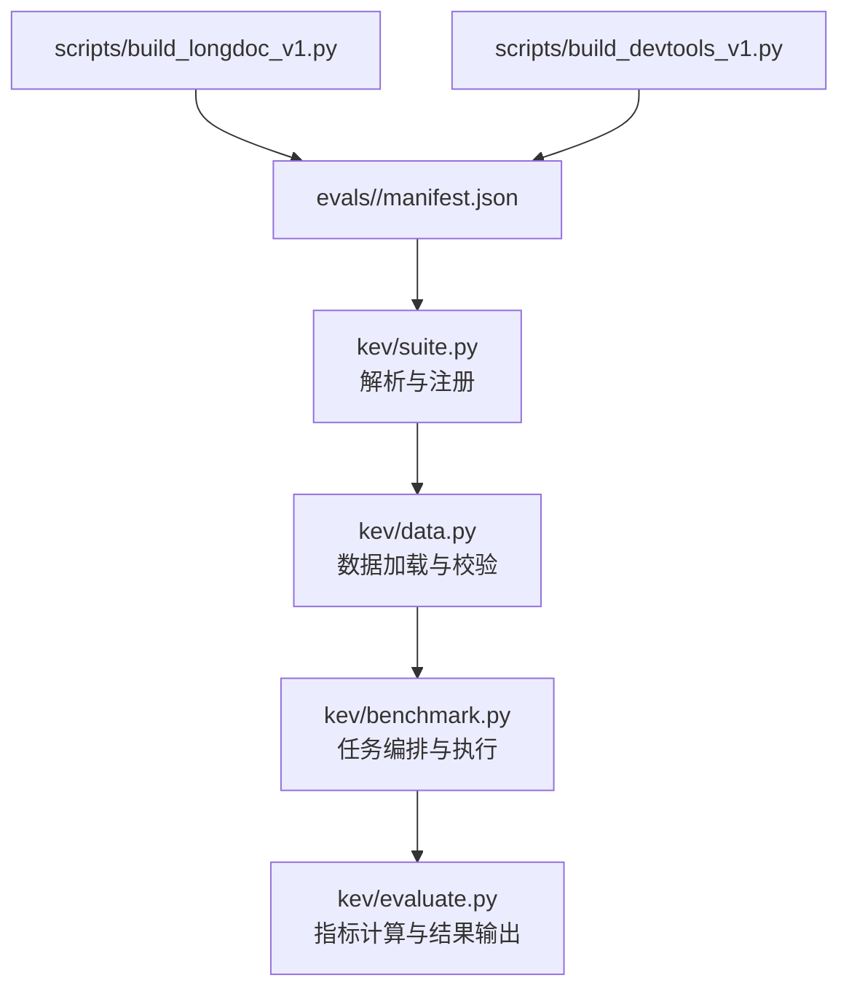
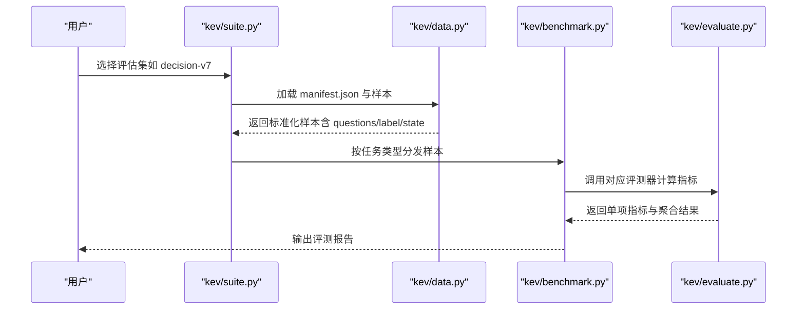
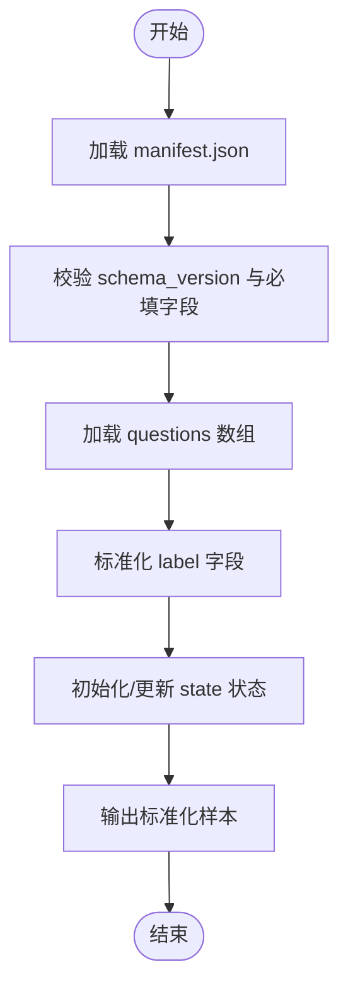
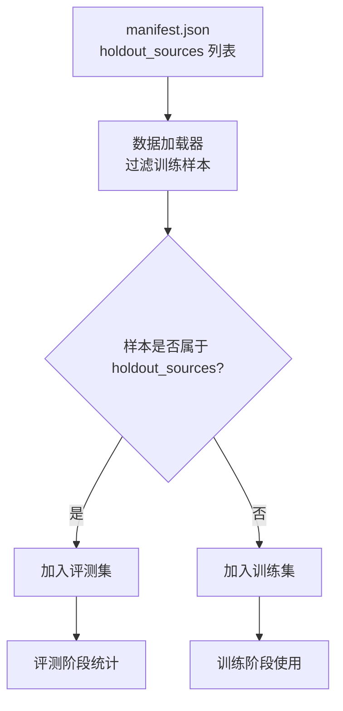
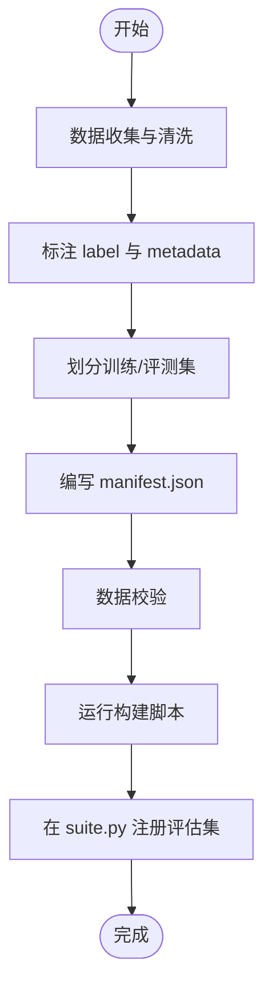
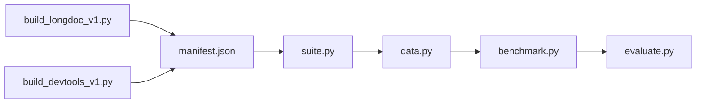

# 基准测试套件

<cite>
**本文引用的文件**   
- [evals/v7/decision-v7/manifest.json](file://evals/v7/decision-v7/manifest.json)
- [evals/v9/transfer-v9/manifest.json](file://evals/v9/transfer-v9/manifest.json)
- [evals/longdoc-v1/manifest.json](file://evals/longdoc-v1/manifest.json)
- [evals/devtools-v1/manifest.json](file://evals/devtools-v1/manifest.json)
- [scripts/build_longdoc_v1.py](file://scripts/build_longdoc_v1.py)
- [scripts/build_devtools_v1.py](file://scripts/build_devtools_v1.py)
- [kev/suite.py](file://kev/suite.py)
- [kev/benchmark.py](file://kev/benchmark.py)
- [kev/data.py](file://kev/data.py)
- [kev/evaluate.py](file://kev/evaluate.py)
</cite>

## 目录
1. [简介](#简介)
2. [项目结构](#项目结构)
3. [核心组件](#核心组件)
4. [架构总览](#架构总览)
5. [详细组件分析](#详细组件分析)
6. [依赖关系分析](#依赖关系分析)
7. [性能考量](#性能考量)
8. [故障排查指南](#故障排查指南)
9. [结论](#结论)
10. [附录](#附录)

## 简介
本文件系统化文档化 Kev 基准测试套件，重点覆盖以下评估集：
- decision-v7（训练源评估）
- transfer-v4 / transfer-v9（新源泛化能力评估）
- longdoc-v1（长文档处理能力）
- devtools-v1（开发工具使用能力）

文档将解释各评估集的设计目的与特点、manifest.json 的结构规范、数据格式约定（questions 数组、label 字段、state 状态）、holdout_sources 机制，以及自定义评估集的创建流程与版本兼容性说明。

## 项目结构
Kev 的基准测试数据位于 evals 目录下，每个评估集以独立子目录组织，并通过 manifest.json 描述元数据与样本来源。构建脚本位于 scripts 目录，评测与加载逻辑位于 kev 目录。

**图示来源**
- [kev/suite.py](file://kev/suite.py)
- [kev/data.py](file://kev/data.py)
- [kev/benchmark.py](file://kev/benchmark.py)
- [kev/evaluate.py](file://kev/evaluate.py)
- [scripts/build_longdoc_v1.py](file://scripts/build_longdoc_v1.py)
- [scripts/build_devtools_v1.py](file://scripts/build_devtools_v1.py)

**章节来源**
- [kev/suite.py](file://kev/suite.py)
- [kev/data.py](file://kev/data.py)
- [kev/benchmark.py](file://kev/benchmark.py)
- [kev/evaluate.py](file://kev/evaluate.py)
- [scripts/build_longdoc_v1.py](file://scripts/build_longdoc_v1.py)
- [scripts/build_devtools_v1.py](file://scripts/build_devtools_v1.py)

## 核心组件
- 评估集清单（manifest.json）：定义数据集来源、样本数量、任务类型分布、版本信息与 holdout_sources 等元数据。
- 数据加载器（data.py）：负责读取 manifest，校验字段，加载 questions 数组并标准化 label 与 state。
- 评测编排（benchmark.py）：根据 manifest 的任务类型分发到相应评测器，控制批处理与资源调度。
- 指标计算（evaluate.py）：对模型输出进行评分、聚合统计与报告生成。
- 构建脚本（build_*）：用于生成或更新特定评估集的数据与清单。

**章节来源**
- [kev/data.py](file://kev/data.py)
- [kev/benchmark.py](file://kev/benchmark.py)
- [kev/evaluate.py](file://kev/evaluate.py)

## 架构总览
下图展示从清单到评测结果的端到端流程，包括数据加载、任务分发、指标计算与结果汇总。

**图示来源**
- [kev/suite.py](file://kev/suite.py)
- [kev/data.py](file://kev/data.py)
- [kev/benchmark.py](file://kev/benchmark.py)
- [kev/evaluate.py](file://kev/evaluate.py)

## 详细组件分析

### 评估集概览与设计目的
- decision-v7（训练源评估）
  - 设计目的：在已知训练源上评估模型的决策能力与稳定性，作为基线对比。
  - 特点：样本来源于训练阶段可见的数据域，便于衡量过拟合与一致性。
  - 关键清单：[evals/v7/decision-v7/manifest.json](file://evals/v7/decision-v7/manifest.json)

- transfer-v4 / transfer-v9（新源泛化能力评估）
  - 设计目的：评估模型在未见过的数据源上的泛化能力，强调跨领域迁移。
  - 特点：通过 holdout_sources 隔离训练源，确保评测严格性；v9 相较 v4 可能包含更多样化的源与任务。
  - 关键清单：
    - [evals/v4/transfer-v4/manifest.json](file://evals/v4/transfer-v4/manifest.json)
    - [evals/v9/transfer-v9/manifest.json](file://evals/v9/transfer-v9/manifest.json)

- longdoc-v1（长文档处理能力）
  - 设计目的：评估模型在长上下文中的信息抽取、推理与总结能力。
  - 特点：样本通常包含较长文本与复杂依赖关系，需要更强的记忆与注意力机制。
  - 构建脚本：[scripts/build_longdoc_v1.py](file://scripts/build_longdoc_v1.py)
  - 关键清单：[evals/longdoc-v1/manifest.json](file://evals/longdoc-v1/manifest.json)

- devtools-v1（开发工具使用能力）
  - 设计目的：评估模型对开发工具链的理解与操作能力（如命令行、调试、代码生成）。
  - 特点：任务多涉及工具调用、命令组合与错误诊断。
  - 构建脚本：[scripts/build_devtools_v1.py](file://scripts/build_devtools_v1.py)
  - 关键清单：[evals/devtools-v1/manifest.json](file://evals/devtools-v1/manifest.json)

**章节来源**
- [evals/v7/decision-v7/manifest.json](file://evals/v7/decision-v7/manifest.json)
- [evals/v9/transfer-v9/manifest.json](file://evals/v9/transfer-v9/manifest.json)
- [evals/longdoc-v1/manifest.json](file://evals/longdoc-v1/manifest.json)
- [evals/devtools-v1/manifest.json](file://evals/devtools-v1/manifest.json)
- [scripts/build_longdoc_v1.py](file://scripts/build_longdoc_v1.py)
- [scripts/build_devtools_v1.py](file://scripts/build_devtools_v1.py)

### manifest.json 结构规范
以下为通用字段说明（具体键名以实际清单为准）：
- 基本信息
  - name：评估集名称（如 decision-v7、transfer-v9、longdoc-v1、devtools-v1）
  - version：清单版本号（用于兼容性与回溯）
  - description：评估集目标与范围说明
- 数据来源
  - sources：数据源列表（仓库、数据集、URL 等）
  - holdout_sources：用于隔离“未见过的数据源”，确保泛化评测不被污染
- 样本统计
  - total_samples：样本总数
  - task_distribution：任务类型分布（如 decision、tool_use、long_context 等）
- 数据路径
  - data_files：questions 或其他输入数据的文件路径
  - labels_file：标签文件路径（若与 questions 分离）
- 质量与校验
  - schema_version：数据模式版本
  - validation_rules：校验规则（必填字段、枚举值等）

示例清单参考：
- [evals/v7/decision-v7/manifest.json](file://evals/v7/decision-v7/manifest.json)
- [evals/v9/transfer-v9/manifest.json](file://evals/v9/transfer-v9/manifest.json)
- [evals/longdoc-v1/manifest.json](file://evals/longdoc-v1/manifest.json)
- [evals/devtools-v1/manifest.json](file://evals/devtools-v1/manifest.json)

**章节来源**
- [evals/v7/decision-v7/manifest.json](file://evals/v7/decision-v7/manifest.json)
- [evals/v9/transfer-v9/manifest.json](file://evals/v9/transfer-v9/manifest.json)
- [evals/longdoc-v1/manifest.json](file://evals/longdoc-v1/manifest.json)
- [evals/devtools-v1/manifest.json](file://evals/devtools-v1/manifest.json)

### 数据格式规范
- questions 数组
  - 每个元素代表一个评测样本，包含问题描述、上下文、选项或指令等字段。
  - 典型字段：id、prompt/context、options（可选）、metadata（可选）。
- label 字段
  - 表示正确答案或期望输出，可能是单选、多选或自由文本。
  - 对于工具调用类任务，label 可能包含命令序列或动作步骤。
- state 状态信息
  - 记录样本的处理状态（如 pending、processed、failed），便于流水线追踪与重试。
  - 可用于质量控制与进度监控。

数据加载与校验流程如下：

**图示来源**
- [kev/data.py](file://kev/data.py)

**章节来源**
- [kev/data.py](file://kev/data.py)

### holdout_sources 机制
- 目的：在 transfer 类评估集中，将某些数据源标记为 holdout，确保模型在训练时不可见这些源，从而真实评估泛化能力。
- 实现要点：
  - manifest.json 中声明 holdout_sources 列表。
  - 数据加载阶段过滤掉属于 holdout_sources 的样本进入训练集，仅保留于评测集。
  - 评测阶段对 holdout_sources 单独统计，便于分析不同源的泛化表现。

**图示来源**
- [evals/v9/transfer-v9/manifest.json](file://evals/v9/transfer-v9/manifest.json)
- [kev/data.py](file://kev/data.py)

**章节来源**
- [evals/v9/transfer-v9/manifest.json](file://evals/v9/transfer-v9/manifest.json)
- [kev/data.py](file://kev/data.py)

### 自定义评估集创建步骤
1. 准备数据
   - 收集原始数据（文本、命令、日志等），确保来源可追溯。
   - 清洗与去重，保证数据质量。
2. 标注与拆分
   - 为每个样本标注 label（答案或期望动作）。
   - 划分训练/评测集，必要时设置 holdout_sources。
3. 编写 manifest.json
   - 填写 name、version、description、sources、total_samples、task_distribution、data_files 等字段。
   - 明确 schema_version 与 validation_rules。
4. 数据校验
   - 运行数据加载器校验 questions、label、state 是否符合规范。
5. 构建与发布
   - 使用构建脚本（如 build_longdoc_v1.py、build_devtools_v1.py）生成或更新清单。
   - 提交至 evals 目录，并在 suite.py 中注册新评估集。

**图示来源**
- [scripts/build_longdoc_v1.py](file://scripts/build_longdoc_v1.py)
- [scripts/build_devtools_v1.py](file://scripts/build_devtools_v1.py)
- [kev/suite.py](file://kev/suite.py)

**章节来源**
- [scripts/build_longdoc_v1.py](file://scripts/build_longdoc_v1.py)
- [scripts/build_devtools_v1.py](file://scripts/build_devtools_v1.py)
- [kev/suite.py](file://kev/suite.py)

### 数据集版本管理与兼容性
- 版本策略
  - manifest.json 的 version 字段标识清单版本，schema_version 标识数据模式版本。
  - 当数据结构变更时，升级 schema_version 并保持向后兼容（如新增可选字段）。
- 兼容性检查
  - 数据加载器应支持多个 schema_version，提供降级或转换逻辑。
  - 评测流程在加载前进行版本校验，避免不兼容数据导致失败。
- 回滚与审计
  - 保留历史 manifest 与数据快照，便于复现实验与审计。
  - 在 release 或重大变更后，更新 README 与实验配置以反映新版本。

**章节来源**
- [kev/data.py](file://kev/data.py)
- [kev/suite.py](file://kev/suite.py)

## 依赖关系分析
评估集清单与评测流程之间的依赖关系如下：

**图示来源**
- [kev/suite.py](file://kev/suite.py)
- [kev/data.py](file://kev/data.py)
- [kev/benchmark.py](file://kev/benchmark.py)
- [kev/evaluate.py](file://kev/evaluate.py)
- [scripts/build_longdoc_v1.py](file://scripts/build_longdoc_v1.py)
- [scripts/build_devtools_v1.py](file://scripts/build_devtools_v1.py)

**章节来源**
- [kev/suite.py](file://kev/suite.py)
- [kev/data.py](file://kev/data.py)
- [kev/benchmark.py](file://kev/benchmark.py)
- [kev/evaluate.py](file://kev/evaluate.py)
- [scripts/build_longdoc_v1.py](file://scripts/build_longdoc_v1.py)
- [scripts/build_devtools_v1.py](file://scripts/build_devtools_v1.py)

## 性能考量
- 数据加载优化
  - 对大体积 questions 数组采用流式读取与分页加载，减少内存峰值。
  - 缓存已校验的 manifest 与索引，避免重复解析。
- 评测并行化
  - 基于 benchmark.py 的任务分发，支持多线程或多进程并行评测。
  - 针对长文档任务（longdoc-v1）启用批处理与早停策略，提升吞吐。
- 指标计算效率
  - evaluate.py 中对常见指标（准确率、F1、工具调用成功率）进行向量化计算。
  - 增量聚合结果，避免全量重算。

[本节为通用指导，不涉及具体文件分析]

## 故障排查指南
- 清单字段缺失或类型错误
  - 现象：数据加载失败，抛出校验异常。
  - 排查：检查 manifest.json 的必填字段与 schema_version，确认 data_files 路径正确。
- label 格式不一致
  - 现象：评测阶段无法匹配答案，得分异常。
  - 排查：统一 label 的枚举值或规范化自由文本（大小写、空白字符）。
- holdout_sources 未生效
  - 现象：泛化评测分数虚高。
  - 排查：确认 holdout_sources 列表与数据源标识一致，数据加载器是否正确过滤。
- 构建脚本报错
  - 现象：生成 manifest 或数据失败。
  - 排查：检查脚本参数与输入数据路径，查看日志定位错误位置。

**章节来源**
- [kev/data.py](file://kev/data.py)
- [scripts/build_longdoc_v1.py](file://scripts/build_longdoc_v1.py)
- [scripts/build_devtools_v1.py](file://scripts/build_devtools_v1.py)

## 结论
Kev 基准测试套件通过结构化的 manifest.json 与清晰的评测流程，提供了对决策能力、泛化能力、长文档处理与开发工具使用的全面评估。借助 holdout_sources 机制与严格的版本管理，确保了评测的严谨性与可复现性。建议在使用时遵循数据格式规范与构建流程，并结合性能优化策略提升评测效率。

[本节为总结性内容，不涉及具体文件分析]

## 附录
- 常用清单字段速查
  - name、version、description、sources、holdout_sources、total_samples、task_distribution、data_files、labels_file、schema_version、validation_rules
- 相关脚本
  - [scripts/build_longdoc_v1.py](file://scripts/build_longdoc_v1.py)
  - [scripts/build_devtools_v1.py](file://scripts/build_devtools_v1.py)
- 评测入口
  - [kev/suite.py](file://kev/suite.py)
  - [kev/benchmark.py](file://kev/benchmark.py)
  - [kev/evaluate.py](file://kev/evaluate.py)

[本节为补充信息，不涉及具体文件分析]