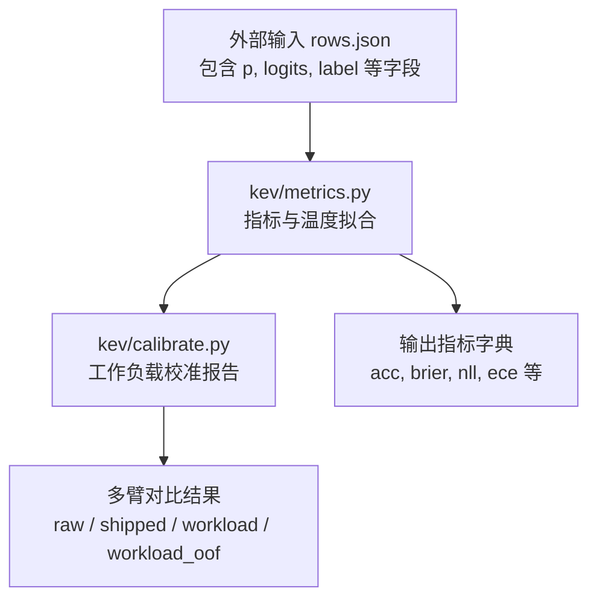
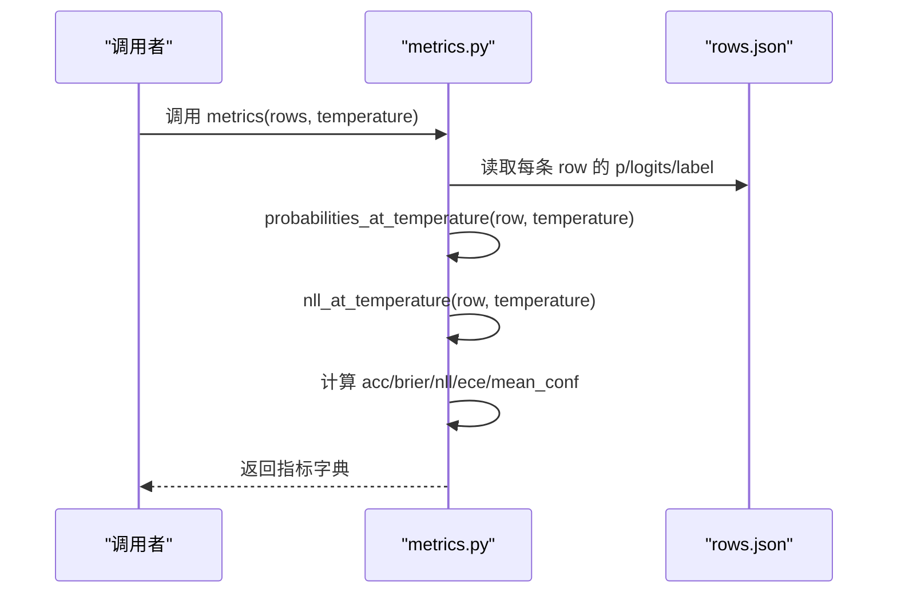
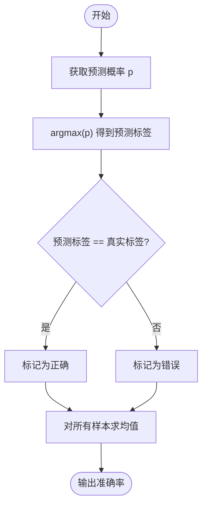
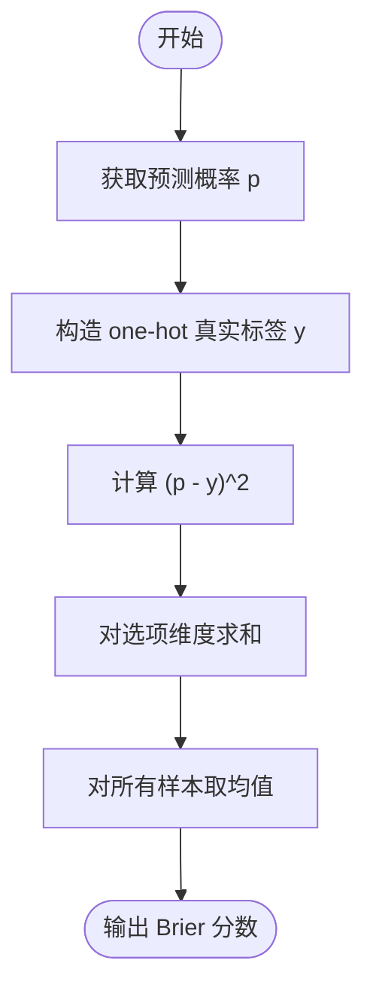
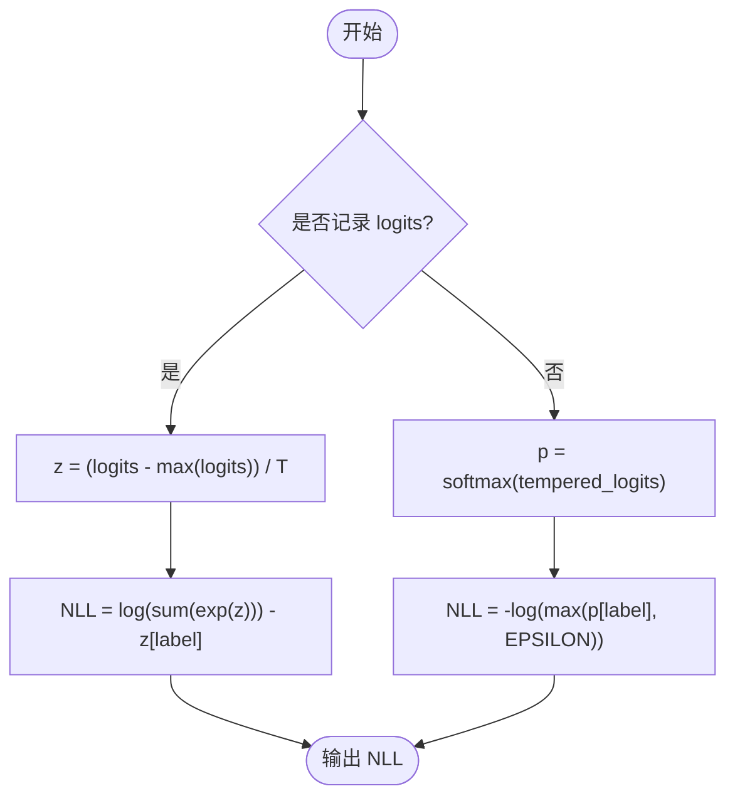
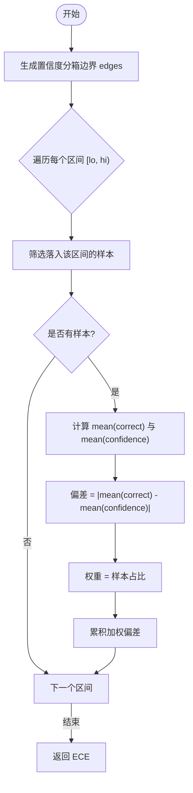
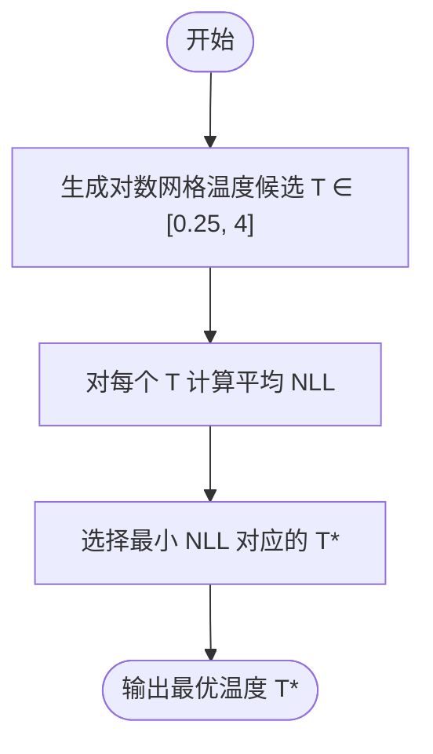
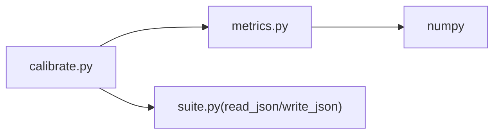

# 准确率与校准指标

<cite>
**本文引用的文件**   
- [metrics.py](file://kev/metrics.py)
- [calibrate.py](file://kev/calibrate.py)
</cite>

## 目录
1. [引言](#引言)
2. [项目结构](#项目结构)
3. [核心组件](#核心组件)
4. [架构总览](#架构总览)
5. [详细组件分析](#详细组件分析)
6. [依赖关系分析](#依赖关系分析)
7. [性能考虑](#性能考虑)
8. [故障排查指南](#故障排查指南)
9. [结论](#结论)
10. [附录：使用示例与最佳实践](#附录使用示例与最佳实践)

## 引言
本文件面向“准确率与概率校准”的评估需求，系统梳理代码库中用于计算准确率、Brier 分数、负对数似然（NLL）、期望校准误差（ECE）以及温度缩放调优的核心实现。重点包括：
- 准确率基于预测标签与真实标签匹配；
- Brier 分数衡量预测概率分布与 one-hot 真实标签之间的均方误差；
- NLL 评估概率模型的对数损失；
- ECE 的分箱计算方法：按置信度分箱，计算每箱内准确率与平均置信度的偏差；
- 温度缩放的数学原理与调参方法；
- 如何使用 metrics()、probabilities_at_temperature()、nll_at_temperature() 等函数进行指标计算；
- 性能优化建议与常见问题排查。

## 项目结构
与本主题直接相关的核心模块位于 kev 包下：
- kev/metrics.py：实现准确率、Brier、NLL、ECE、选择性预测、温度拟合、配对自助抽样等全部指标与工具函数；
- kev/calibrate.py：提供工作负载维度的校准报告生成流程，封装了从原始行到不同温度下的评分对比。

图表来源
- [metrics.py:1-100](file://kev/metrics.py#L1-L100)
- [calibrate.py:1-45](file://kev/calibrate.py#L1-L45)

章节来源
- [metrics.py:1-100](file://kev/metrics.py#L1-L100)
- [calibrate.py:1-45](file://kev/calibrate.py#L1-L45)

## 核心组件
- 概率与温度处理
  - probabilities_at_temperature(row, temperature=1.0)：在给定温度 T 下返回该样本的概率分布；当 T=1 时直接返回记录的概率 p，否则对 logits 做温度缩放后 softmax。
  - _tempered_logits(row, temperature)：将 logits 减去最大值并除以温度，保证数值稳定；若未记录 logits，则用 log(max(p, EPSILON)) 近似。
  - nll_at_temperature(row, temperature=1.0)：在给定温度下计算 NLL；优先使用 logits 精确计算，否则回退到概率形式。
- 指标计算
  - ece(conf, correct, bins=10)：按置信度均匀分箱，计算加权平均的 |准确率 - 平均置信度|。
  - metrics(rows, temperature=1.0)：批量计算 acc、brier、nll、ece、mean_conf、选择性预测指标（如 coverage at error budget、AURC）等。
- 温度拟合
  - fit_temperature(rows, aggregation="macro", points=81)：在 0.25..4 的对数网格上搜索最小化平均 NLL 的温度；支持 micro 或 macro 聚合。
  - TEMPERATURE_FIT：默认配置（aggregation="micro", points=121），用于发布检查点与工作负载校准。
- 数据流与辅助
  - raw_row(row)、tempered_row(row, temperature)、served_at(rows, temperature)：统一处理已记录 inference_temperature 的行，恢复原始 logits 或在指定温度下服务。
  - grouped_metrics(rows, key, temperature=1.0)：按分组键计算指标。
  - calibration_by_length(rows, lengths=None, edges=LENGTH_EDGES)：按状态 token 长度分桶评估校准。
  - paired_bootstrap(...)、cross_validated_temperature(...)：配对自助抽样与交叉验证温度报告。

章节来源
- [metrics.py:24-53](file://kev/metrics.py#L24-L53)
- [metrics.py:64-100](file://kev/metrics.py#L64-L100)
- [metrics.py:276-294](file://kev/metrics.py#L276-L294)
- [metrics.py:224-261](file://kev/metrics.py#L224-L261)

## 架构总览
下图展示从原始预测行到最终指标输出的整体流程，包括温度缩放与指标计算的关键步骤。

图表来源
- [metrics.py:39-53](file://kev/metrics.py#L39-L53)
- [metrics.py:64-100](file://kev/metrics.py#L64-L100)

## 详细组件分析

### 准确率（Accuracy）
- 定义：预测类别为概率最大项对应的索引，与真实标签一致即正确。
- 实现要点：
  - 在 metrics() 中对每个样本计算 argmax(p) == label，取均值作为准确率。
  - 注意：argmax 不随温度变化，因此准确率在不同温度下保持一致。

图表来源
- [metrics.py:68-74](file://kev/metrics.py#L68-L74)

章节来源
- [metrics.py:68-74](file://kev/metrics.py#L68-L74)

### Brier 分数（Brier Score）
- 定义：预测概率分布与 one-hot 真实标签之间的均方误差。
- 实现要点：
  - 对每个样本计算 (p - y_onehot)^2 的和，再对所有样本取均值。
  - 越小表示概率分布越接近真实分布。

图表来源
- [metrics.py:71-74](file://kev/metrics.py#L71-L74)

章节来源
- [metrics.py:71-74](file://kev/metrics.py#L71-L74)

### 负对数似然（NLL）
- 定义：对数损失，衡量概率模型对真实标签的对数似然的负值。
- 实现要点：
  - 若记录有 logits，则在温度缩放后使用数值稳定的公式：log(sum(exp(z))) - z[label]。
  - 若无 logits，则回退到 -log(max(p[label], EPSILON))。

图表来源
- [metrics.py:29-36](file://kev/metrics.py#L29-L36)
- [metrics.py:48-53](file://kev/metrics.py#L48-L53)

章节来源
- [metrics.py:29-36](file://kev/metrics.py#L29-L36)
- [metrics.py:48-53](file://kev/metrics.py#L48-L53)

### 期望校准误差（ECE）
- 定义：按置信度分箱，计算每箱内准确率与平均置信度的绝对偏差，并以样本权重加权求和。
- 分箱策略：
  - 使用 np.linspace(0, 1, bins+1) 生成边界；
  - 对每个区间 [lo, hi)，统计落入区间的样本，计算 mean(correct) 与 mean(confidence) 的差；
  - 以 m.mean() 作为该箱的权重，累加得到 ECE。

图表来源
- [metrics.py:15-21](file://kev/metrics.py#L15-L21)

章节来源
- [metrics.py:15-21](file://kev/metrics.py#L15-L21)

### 温度缩放（Temperature Scaling）
- 数学原理：
  - 对 logits z 进行缩放：z' = (z - max(z)) / T，再进行 softmax 得到概率；
  - T > 1 使分布更平滑（降低置信度），T < 1 使分布更尖锐（提高置信度）。
- 调优方法：
  - 在 0.25..4 的对数网格上枚举候选温度；
  - 对每个候选温度计算平均 NLL（支持 micro 或 macro 聚合）；
  - 选择使平均 NLL 最小的温度作为最优温度。

图表来源
- [metrics.py:276-294](file://kev/metrics.py#L276-L294)

章节来源
- [metrics.py:276-294](file://kev/metrics.py#L276-L294)

### 关键函数说明与用法路径
- probabilities_at_temperature(row, temperature=1.0)
  - 作用：返回给定温度下的概率分布；T=1 时直接返回 p，否则对 logits 做温度缩放后 softmax。
  - 参考路径：[metrics.py:39-45](file://kev/metrics.py#L39-L45)
- nll_at_temperature(row, temperature=1.0)
  - 作用：返回给定温度下的 NLL；优先使用 logits 精确计算，否则回退到概率形式。
  - 参考路径：[metrics.py:48-53](file://kev/metrics.py#L48-L53)
- metrics(rows, temperature=1.0)
  - 作用：批量计算准确率、Brier、NLL、ECE、mean_conf、选择性预测指标等。
  - 参考路径：[metrics.py:64-100](file://kev/metrics.py#L64-L100)

章节来源
- [metrics.py:39-53](file://kev/metrics.py#L39-L53)
- [metrics.py:64-100](file://kev/metrics.py#L64-L100)

## 依赖关系分析
- 模块耦合
  - calibrate.py 依赖 metrics.py 提供的指标与温度拟合函数；
  - metrics.py 内部自包含 numpy 计算逻辑，无外部模型依赖，便于离线评分。
- 数据契约
  - rows 元素需包含 p、label，可选 logits；
  - 若存在 inference_temperature，需在 raw_row()/tempered_row() 中正确处理。

图表来源
- [calibrate.py:18-22](file://kev/calibrate.py#L18-L22)
- [metrics.py:7-11](file://kev/metrics.py#L7-L11)

章节来源
- [calibrate.py:18-22](file://kev/calibrate.py#L18-L22)
- [metrics.py:7-11](file://kev/metrics.py#L7-L11)

## 性能考虑
- 向量化计算
  - 所有指标计算基于 numpy 数组操作，避免 Python 循环开销；
  - 推荐尽量传入批量 rows，让 metrics() 一次性计算。
- 数值稳定性
  - logits 先减去最大值再进行 exp，避免溢出；
  - 概率回退时使用 EPSILON 防止 log(0)。
- 温度网格规模
  - 默认 points=81，发布检查点使用 points=121；可根据数据量与精度需求调整。
- 选择性预测
  - coverage_at_error 与 AURC 的计算通过排序与累积统计完成，复杂度 O(n log n)。

[本节为通用性能指导，不直接分析具体文件]

## 故障排查指南
- 空数据集
  - metrics() 对空 rows 抛出异常，确保至少有一条有效样本。
- 温度参数非法
  - _check_temperature() 要求温度为有限正值；否则抛出 ValueError。
- logits 缺失或不匹配
  - 若使用 logits 计算但形状不匹配或非有限值，会抛出异常；
  - 若行未记录 logits 且需要恢复原始 logits，必须提供 inference_temperature。
- 置信度与正确性向量不一致
  - 选择性预测相关函数要求 confidence 与 correct 等长且类型合法。

章节来源
- [metrics.py:24-27](file://kev/metrics.py#L24-L27)
- [metrics.py:29-36](file://kev/metrics.py#L29-L36)
- [metrics.py:64-66](file://kev/metrics.py#L64-L66)
- [metrics.py:103-122](file://kev/metrics.py#L103-L122)

## 结论
本仓库提供了完整的准确率与概率校准指标实现，涵盖 Brier、NLL、ECE 与温度缩放调优。通过 metrics() 可一次性获得多项指标，配合 probabilities_at_temperature() 与 nll_at_temperature() 可在任意温度下进行评估。calibrate.py 进一步封装了工作负载维度的校准报告流程，便于在实际部署前对模型进行温度校准与效果对比。

[本节为总结性内容，不直接分析具体文件]

## 附录：使用示例与最佳实践

### 使用 metrics() 计算指标
- 输入：rows（列表），每个元素包含 p、label，可选 logits；
- 输出：包含 acc、brier、nll、ece、mean_conf、coverage_at_*error、aurc、selective 等字段的字典；
- 参考路径：[metrics.py:64-100](file://kev/metrics.py#L64-L100)

### 使用 probabilities_at_temperature()
- 目的：在给定温度 T 下获取概率分布；
- 适用场景：比较不同温度下的概率校准效果；
- 参考路径：[metrics.py:39-45](file://kev/metrics.py#L39-L45)

### 使用 nll_at_temperature()
- 目的：在给定温度 T 下计算 NLL；
- 适用场景：温度拟合的目标函数；
- 参考路径：[metrics.py:48-53](file://kev/metrics.py#L48-L53)

### 温度拟合与报告
- 使用 fit_temperature() 在 0.25..4 的对数网格上搜索最小 NLL 的温度；
- 使用 calibrate.py 的工作负载报告流程，对比 raw/shipped/workload/workload_oof 四臂指标；
- 参考路径：
  - [metrics.py:276-294](file://kev/metrics.py#L276-L294)
  - [calibrate.py:28-44](file://kev/calibrate.py#L28-L44)

### 最佳实践
- 始终使用记录的 logits 计算 NLL，以保证数值稳定性；
- 在部署前对工作负载数据进行温度拟合，并使用 out-of-fold 评估避免过拟合；
- 结合 ECE、Brier、NLL 与选择性预测指标综合评估校准质量；
- 对于大规模数据，优先使用向量化接口（metrics()）以减少 Python 层开销。

[本节为使用指导，不直接分析具体文件]