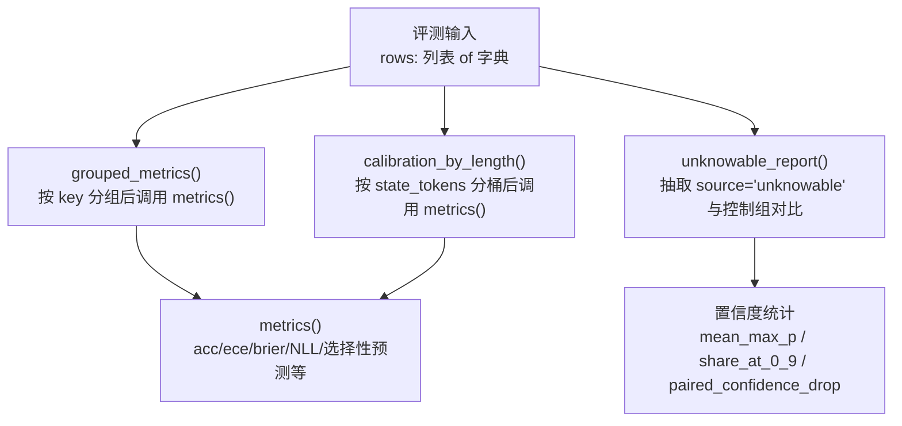
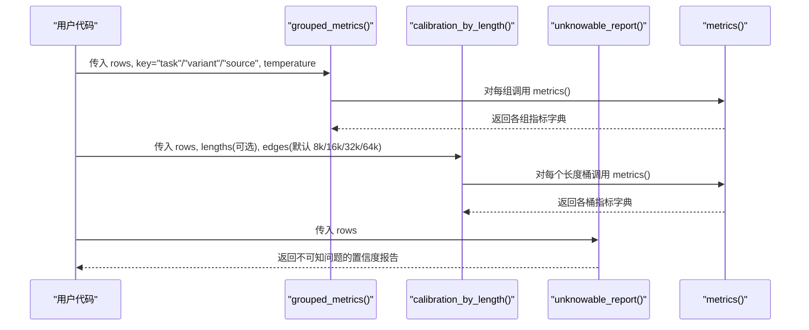
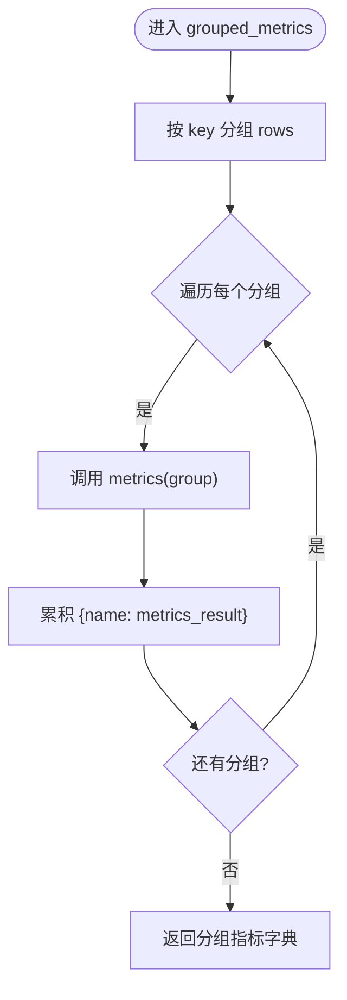
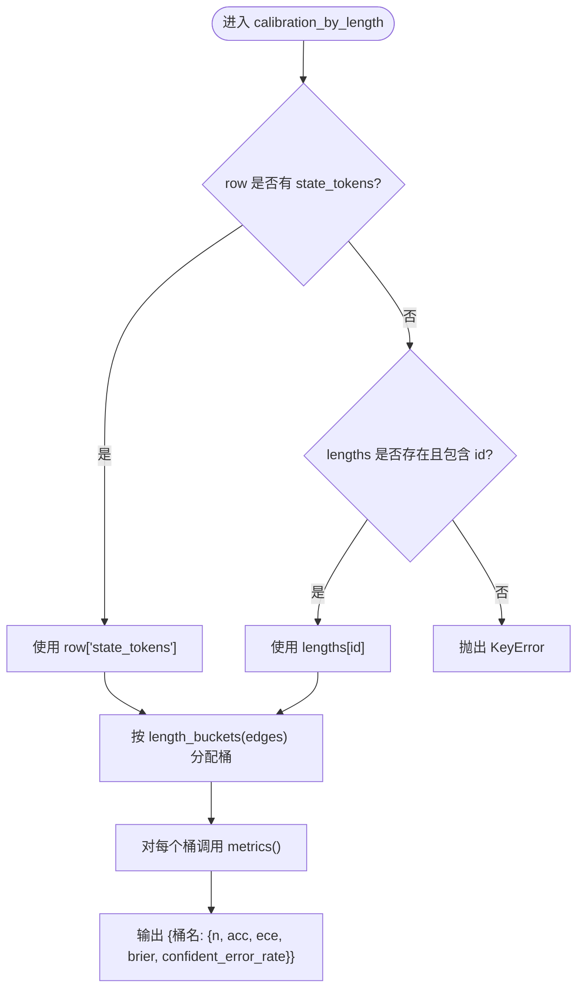
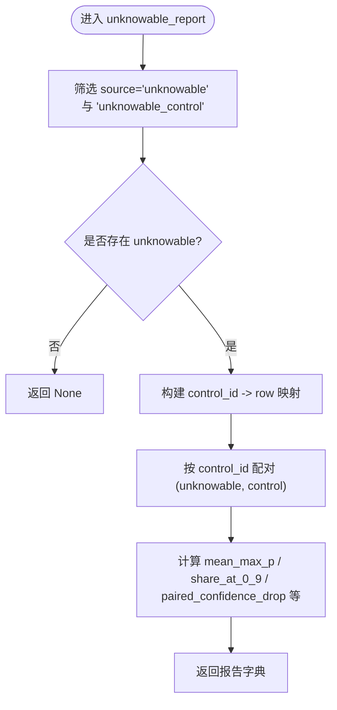
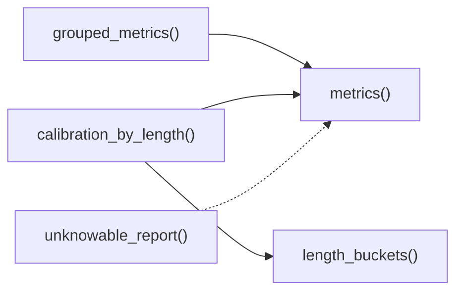

# 分组统计与分析

<cite>
**本文引用的文件**   
- [metrics.py](file://kev/metrics.py)
</cite>

## 目录
1. [引言](#引言)
2. [项目结构](#项目结构)
3. [核心组件](#核心组件)
4. [架构总览](#架构总览)
5. [详细组件分析](#详细组件分析)
6. [依赖关系分析](#依赖关系分析)
7. [性能考量](#性能考量)
8. [故障排查指南](#故障排查指南)
9. [结论](#结论)
10. [附录：使用示例与结果解读](#附录使用示例与结果解读)

## 引言
本文件聚焦于模型评估中的“分组统计与分析”能力，围绕以下关键函数展开：
- grouped_metrics()：按 task、variant、source 等维度对评测样本进行分组并计算各组指标。
- calibration_by_length()：基于状态 token 长度进行分桶的长上下文校准分析，支持 8k/16k/32k/64k 等边界。
- unknowable_report()：针对“不可知问题”的特殊处理，包括证据移除后的置信度分析与配对控制组比较。

这些工具以纯 NumPy 实现，直接作用于 benchmark 产出的行记录（包含 p、label、type、keys、task、source、variant 等字段），无需依赖 torch 或具体模型，便于离线分析已保存的 rows.json。

## 项目结构
本功能位于 kev/metrics.py 中，提供统一的评分、校准、选择性预测、温度拟合与聚类重采样等能力。与分组统计相关的主要入口为：
- grouped_metrics(rows, key, temperature=1.0)
- calibration_by_length(rows, lengths=None, edges=LENGTH_EDGES)
- unknowable_report(rows)

图表来源
- [metrics.py:167-187](file://kev/metrics.py#L167-L187)
- [metrics.py:206-221](file://kev/metrics.py#L206-L221)
- [metrics.py:64-100](file://kev/metrics.py#L64-L100)

章节来源
- [metrics.py:1-10](file://kev/metrics.py#L1-L10)

## 核心组件
本节概述三个核心函数的职责与输入输出约定。

- grouped_metrics(rows, key, temperature=1.0)
  - 作用：将 rows 按指定键（如 "task"、"variant"、"source"）分组，并对每组独立调用 metrics() 计算指标。
  - 输入：rows（行记录列表）、key（分组键名）、temperature（可选，默认 1.0）。
  - 输出：字典，键为分组值，值为 metrics() 返回的结构。

- calibration_by_length(rows, lengths=None, edges=LENGTH_EDGES)
  - 作用：根据每条记录的“状态 token 数量”将其分配到不同长度桶，并在每个桶内计算 acc、ece、brier、confident_error_rate。
  - 输入：rows；可选 lengths（id -> state_tokens 映射）；edges（分桶边界，默认 8192/16384/32768/65536）。
  - 输出：字典，键为桶名（如 under_8k、8k_16k、16k_32k、32k_64k、64k_plus 以及 8k_plus、16k_plus、32k_plus），值为包含 n 与各指标的字典。

- unknowable_report(rows)
  - 作用：针对 source="unknowable" 的记录，评估模型在证据被移除后是否仍能“知道自己不知道”，并与 intact 控制组（source="unknowable_control"）进行配对比较。
  - 输入：rows。
  - 输出：字典，包含 mean_max_p、share_at_0_9、paired_confidence_drop 等置信度相关指标；若无可比数据则部分字段为 None。

章节来源
- [metrics.py:167-187](file://kev/metrics.py#L167-L187)
- [metrics.py:190-221](file://kev/metrics.py#L190-L221)

## 架构总览
下图展示了从原始评测行到分组/长度/不可知报告的完整流程。

图表来源
- [metrics.py:167-187](file://kev/metrics.py#L167-L187)
- [metrics.py:206-221](file://kev/metrics.py#L206-L221)
- [metrics.py:64-100](file://kev/metrics.py#L64-L100)

## 详细组件分析

### grouped_metrics()：多维度分组统计
- 分组逻辑
  - 使用 defaultdict(list) 将 rows 按 row[key] 聚合。
  - 对每个分组调用 metrics()，并以排序后的分组键生成最终字典。
- 适用维度
  - task：不同任务类别的性能差异。
  - variant：不同变体（如 clean、adversarial 等）的表现。
  - source：数据来源（如 unknowable、unknowable_control 等）。
- 复杂度
  - 时间 O(N)，空间 O(N)（分组存储）。
- 错误处理
  - 当某组为空时，由 metrics() 内部抛出异常（空集不能评分）。

图表来源
- [metrics.py:183-187](file://kev/metrics.py#L183-L187)
- [metrics.py:64-100](file://kev/metrics.py#L64-L100)

章节来源
- [metrics.py:183-187](file://kev/metrics.py#L183-L187)
- [metrics.py:64-100](file://kev/metrics.py#L64-L100)

### calibration_by_length()：长度分桶与长上下文校准
- 分桶策略
  - 默认边界 LENGTH_EDGES = (8192, 16384, 32768, 65536)。
  - length_buckets() 生成不相交桶：under_8k、8k_16k、16k_32k、32k_64k、64k_plus，以及尾部桶 8k_plus、16k_plus、32k_plus。
  - 所有边界均为 1024 的倍数，命名以 k 为单位（如 8k、16k）。
- 状态 token 计数来源
  - 优先使用 row["state_tokens"]；否则通过 lengths[row["id"]] 获取。
  - 若两者均缺失，抛出 KeyError。
- 指标计算
  - 在每个桶内调用 metrics()，仅保留 LENGTH_METRICS = ("acc", "ece", "brier", "confident_error_rate")。
  - 空桶返回 n=0 且指标为 None。
- 长上下文校准的重要性
  - 长上下文场景下，模型可能因注意力分散或记忆衰减导致概率校准退化。
  - 通过长度分桶可识别特定长度区间的校准偏差（ECE、Brier、高置信错误率上升），指导针对性优化（如更长上下文训练、提示工程、检索增强等）。

图表来源
- [metrics.py:194-221](file://kev/metrics.py#L194-L221)
- [metrics.py:64-100](file://kev/metrics.py#L64-L100)

章节来源
- [metrics.py:190-221](file://kev/metrics.py#L190-L221)

### unknowable_report()：不可知问题与配对控制组
- 设计动机
  - “不可知问题”刻意移除了决策所需的关键证据，用于检验模型是否能正确表达不确定性。
  - 准确性在此类问题上无意义，重点在于模型是否给出低置信度，以及是否显著低于其 intact 控制组。
- 数据处理
  - 筛选 source="unknowable" 与 source="unknowable_control" 的记录。
  - 若无 unknowable 记录，返回 None。
  - 通过 control_id 将不可知记录与其控制组配对。
- 指标含义
  - mean_max_p：不可知组的平均最大概率（越低越好）。
  - share_at_0_9：不可知组中置信度 ≥0.9 的比例（越低越好）。
  - control_mean_max_p / control_share_at_0_9：控制组的对应指标。
  - paired_confidence_drop：配对样本中（控制置信度 - 不可知置信度）的平均差值（越高说明移除证据后置信度下降越多，越能“自知无知”）。
  - share_less_confident_than_control：配对样本中不可知置信度低于控制的比例。
- 典型用法
  - 结合 grouped_metrics(rows, key="source") 观察 unknowable 与 unknowable_control 的差异。
  - 与 calibration_by_length() 结合，检查长上下文下不可知问题的置信度表现。

图表来源
- [metrics.py:167-180](file://kev/metrics.py#L167-L180)

章节来源
- [metrics.py:167-180](file://kev/metrics.py#L167-L180)

## 依赖关系分析
- grouped_metrics() 依赖 metrics() 计算每组的准确率、ECE、Brier、NLL、选择性预测等指标。
- calibration_by_length() 依赖 length_buckets() 生成分桶，再调用 metrics()。
- unknowable_report() 不依赖 metrics()，直接对置信度进行统计与配对比较。
- 三者共同依赖底层数据结构：rows 为字典列表，包含 p、label、type、keys、task、source、variant、id、control_id、state_tokens 等字段。

图表来源
- [metrics.py:64-100](file://kev/metrics.py#L64-L100)
- [metrics.py:183-187](file://kev/metrics.py#L183-L187)
- [metrics.py:194-221](file://kev/metrics.py#L194-L221)
- [metrics.py:167-180](file://kev/metrics.py#L167-L180)

章节来源
- [metrics.py:64-100](file://kev/metrics.py#L64-L100)
- [metrics.py:167-180](file://kev/metrics.py#L167-L180)
- [metrics.py:183-187](file://kev/metrics.py#L183-L187)
- [metrics.py:194-221](file://kev/metrics.py#L194-L221)

## 性能考量
- 时间复杂度
  - grouped_metrics(): O(N) 分组 + 每组 metrics() 线性扫描，总体 O(N)。
  - calibration_by_length(): O(N) 分配桶 + 每桶 metrics()，总体 O(N)。
  - unknowable_report(): O(N) 过滤与配对，总体 O(N)。
- 空间复杂度
  - 分组与桶化需要额外存储，O(N)。
- 数值稳定性
  - metrics() 内部对 logits 与概率进行裁剪与归一化处理，避免 NaN/Inf。
- 可扩展性
  - 可通过自定义 edges 调整长度分桶粒度，适配不同上下文长度分布。

[本节为通用性能讨论，不直接分析具体代码片段]

## 故障排查指南
- grouped_metrics()
  - 现象：某分组为空时报错。
  - 原因：metrics() 不接受空输入。
  - 处理：确保分组键存在有效数据，或在调用前过滤空组。
- calibration_by_length()
  - 现象：抛出 KeyError，提示缺少 state-token 计数。
  - 原因：row 未记录 state_tokens 且 lengths 未提供或不含该 id。
  - 处理：补充 lengths 映射或确保 row 包含 state_tokens。
- unknowable_report()
  - 现象：返回 None。
  - 原因：不存在 source="unknowable" 的记录。
  - 处理：确认数据集中包含不可知问题及其控制组。

章节来源
- [metrics.py:64-100](file://kev/metrics.py#L64-L100)
- [metrics.py:167-180](file://kev/metrics.py#L167-L180)
- [metrics.py:206-221](file://kev/metrics.py#L206-L221)

## 结论
- grouped_metrics() 提供了灵活的多维分组统计能力，便于发现模型在不同任务、变体或数据源上的性能差异。
- calibration_by_length() 通过状态 token 长度的分桶分析，帮助定位长上下文场景下的校准退化问题，支持 8k/16k/32k/64k 等边界划分。
- unknowable_report() 专注于“不可知问题”的置信度分析，通过与控制组的配对比较，评估模型是否能正确表达不确定性。
- 三者结合可形成完整的分组统计与长上下文校准分析体系，辅助模型诊断与优化。

[本节为总结性内容，不直接分析具体代码片段]

## 附录：使用示例与结果解读

- 示例一：按 task 分组统计
  - 调用 grouped_metrics(rows, key="task")。
  - 解读：比较不同任务的准确率、ECE、Brier、高置信错误率等，识别薄弱任务。
- 示例二：按 variant 分组统计
  - 调用 grouped_metrics(rows, key="variant")。
  - 解读：对比 clean 与 adversarial 等变体的表现，评估鲁棒性。
- 示例三：按 source 分组统计
  - 调用 grouped_metrics(rows, key="source")。
  - 解读：观察 unknowable 与 unknowable_control 的差异，结合 unknowable_report() 深入分析。
- 示例四：长度分桶分析
  - 调用 calibration_by_length(rows, lengths=lengths_map) 或 calibration_by_length(rows)（若 row 含 state_tokens）。
  - 解读：关注 8k_16k、16k_32k、32k_64k、64k_plus 等桶的 ECE 与 Brier，识别长上下文校准退化区间。
- 示例五：不可知问题置信度分析
  - 调用 unknowable_report(rows)。
  - 解读：mean_max_p 越低、share_at_0_9 越低、paired_confidence_drop 越高，表明模型在证据移除后更倾向于表达不确定性。

[本节为概念性示例，不直接引用具体代码片段]