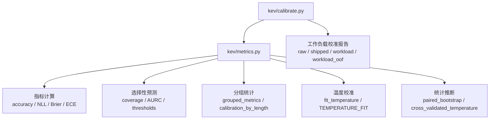
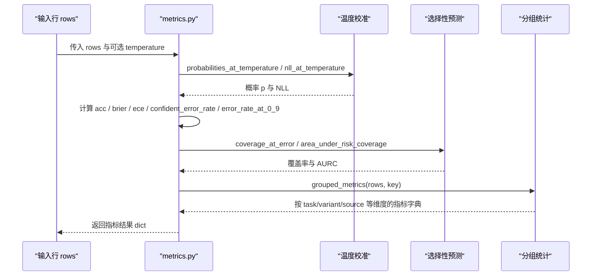
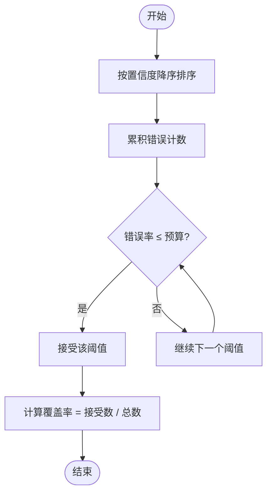
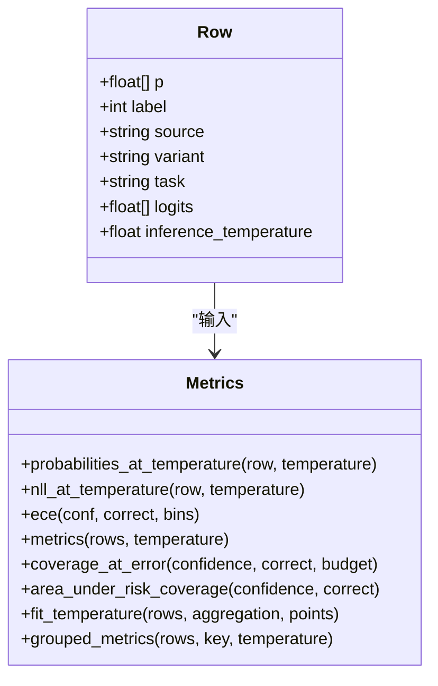
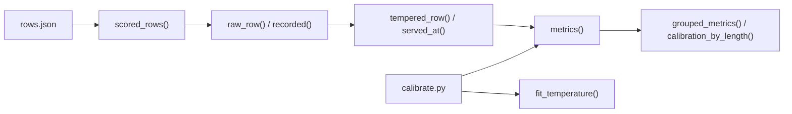

<cite>
**本文引用的文件**   
- [metrics.py](file://kev/metrics.py)
- [calibrate.py](file://kev/calibrate.py)
</cite>

## 目录
1. [简介](#简介)
2. [项目结构](#项目结构)
3. [核心组件](#核心组件)
4. [架构总览](#架构总览)
5. [详细组件分析](#详细组件分析)
6. [依赖关系分析](#依赖关系分析)
7. [性能与优化建议](#性能与优化建议)
8. [故障排查指南](#故障排查指南)
9. [结论](#结论)
10. [附录：指标速查表](#附录指标速查表)

## 简介
本文件系统化梳理 Kev 项目的性能指标计算实现，覆盖以下目标：
- 核心指标计算方法：准确率（accuracy）、Brier 分数、负对数似然（NLL）、校准误差（ECE）。
- 置信度相关指标：confident_error_rate（高置信度错误率）、error_rate_at_0_9（阈值 0.9 下的错误率）、AURC（风险-覆盖曲线下的面积）。
- 分组统计 grouped_metrics：按 task、variant、source 等维度进行性能分析。
- unknowable 问题的特殊处理逻辑。
- 概率校准的数学原理与温度参数 T 的影响。
- 指标计算的性能考虑与优化建议。
- 如何使用 metrics() 函数进行自定义指标计算。

## 项目结构
与性能指标直接相关的代码集中在两个模块：
- kev/metrics.py：指标定义、温度校准、选择性预测、分组统计、配对自助法与交叉验证等。
- kev/calibrate.py：面向工作负载的温度校准报告生成器，调用 metrics 中的工具函数输出多臂对比结果。

图表来源
- [metrics.py:15-100](file://kev/metrics.py#L15-L100)
- [metrics.py:183-221](file://kev/metrics.py#L183-L221)
- [metrics.py:276-294](file://kev/metrics.py#L276-L294)
- [metrics.py:308-370](file://kev/metrics.py#L308-L370)
- [calibrate.py:28-44](file://kev/calibrate.py#L28-L44)

章节来源
- [metrics.py:1-10](file://kev/metrics.py#L1-L10)
- [calibrate.py:1-17](file://kev/calibrate.py#L1-L17)

## 核心组件
本节聚焦 metrics.py 中用于指标计算的核心函数与数据结构。

- ece(conf, correct, bins=10)：等宽分箱的期望校准误差。
- probabilities_at_temperature(row, temperature)：在给定温度下计算概率分布。
- nll_at_temperature(row, temperature)：在给定温度下计算负对数似然。
- _row_scores(row)：单条样本的可加性指标向量，供配对自助法使用。
- metrics(rows, temperature=1.0)：批量指标汇总，包含 accuracy、NLL、Brier、ECE、置信度指标、选择性预测指标等。
- coverage_at_error(confidence, correct, budget)：固定错误预算下的覆盖率。
- area_under_risk_coverage(confidence, correct)：AURC。
- select_threshold(confidence, correct, budget, min_accepted=1)：选择满足错误预算的阈值。
- evaluate_threshold(confidence, correct, threshold)：评估指定阈值的覆盖率与风险。
- unknowable_report(rows)：针对 unknowable 问题的置信度报告。
- grouped_metrics(rows, key, temperature=1.0)：按任意键分组计算指标。
- length_buckets(edges) 与 calibration_by_length(rows, lengths=None, edges=LENGTH_EDGES)：按状态长度分桶的校准分析。
- tempered_row(row, temperature)、raw_row(row)、recorded(row)、served_at(rows, temperature)、served(fit_rows, eval_rows, **fit_kwargs)：温度变换与行数据标准化。
- fit_temperature(rows, aggregation="macro", points=81)：基于网格搜索的最优温度拟合。
- cluster_resamples(rows, samples, seed)、grouped_folds(rows, folds, seed)、out_of_fold_rows(rows, folds=5, seed=0, **fit_kwargs)、cross_validated_temperature(rows, folds=5, seed=0, samples=1000, **fit_kwargs)：聚类重采样、分组折划分与交叉验证温度报告。
- paired_bootstrap(candidate, reference, samples=1000, seed=0, metric="nll", aggregation="macro")：配对自助法比较候选与参考模型。

章节来源
- [metrics.py:15-21](file://kev/metrics.py#L15-L21)
- [metrics.py:29-53](file://kev/metrics.py#L29-L53)
- [metrics.py:56-100](file://kev/metrics.py#L56-L100)
- [metrics.py:103-164](file://kev/metrics.py#L103-L164)
- [metrics.py:167-180](file://kev/metrics.py#L167-L180)
- [metrics.py:183-221](file://kev/metrics.py#L183-L221)
- [metrics.py:224-267](file://kev/metrics.py#L224-L267)
- [metrics.py:276-294](file://kev/metrics.py#L276-L294)
- [metrics.py:297-370](file://kev/metrics.py#L297-L370)
- [metrics.py:372-427](file://kev/metrics.py#L372-L427)

## 架构总览
下图展示从原始行数据到最终指标输出的关键流程，包括温度校准、指标聚合、选择性预测与分组统计。

图表来源
- [metrics.py:39-53](file://kev/metrics.py#L39-L53)
- [metrics.py:64-100](file://kev/metrics.py#L64-L100)
- [metrics.py:103-147](file://kev/metrics.py#L103-L147)
- [metrics.py:183-187](file://kev/metrics.py#L183-L187)

## 详细组件分析

### 核心指标计算方法

#### 准确率（accuracy）
- 定义：预测类别等于真实标签的比例。
- 实现要点：取概率最大值对应的类别作为预测，与 label 比较得到布尔正确性，再求均值。
- 复杂度：O(n)，n 为样本数。

章节来源
- [metrics.py:56-61](file://kev/metrics.py#L56-L61)
- [metrics.py:68-74](file://kev/metrics.py#L68-L74)

#### Brier 分数
- 定义：预测概率分布与 one-hot 真实标签之间的均方误差。
- 实现要点：对每个样本计算 (p - y_onehot)^2 的和，再对所有样本求平均。
- 复杂度：O(n·k)，k 为选项数。

章节来源
- [metrics.py:71-74](file://kev/metrics.py#L71-L74)

#### 负对数似然（NLL）
- 定义：在给定温度 T 下，真实标签对应 logit 的对数似然的负值。
- 实现要点：若记录 logits，则先做温度缩放并归一化；否则从概率恢复近似 logit 后计算。
- 数值稳定：使用 EPSILON 防止 log(0)。
- 复杂度：O(k) 每样本。

章节来源
- [metrics.py:29-36](file://kev/metrics.py#L29-L36)
- [metrics.py:48-53](file://kev/metrics.py#L48-L53)

#### 校准误差（ECE）
- 定义：将置信度等宽分箱，计算各箱内准确率与平均置信度的偏差加权平均。
- 实现要点：bins=10 默认等宽区间，边界处理保证闭区间一致性。
- 复杂度：O(n + bins)。

章节来源
- [metrics.py:15-21](file://kev/metrics.py#L15-L21)

#### 置信度相关指标
- confident_error_rate：置信度 ≥ 0.9 且错误的比例。
- error_rate_at_0_9：置信度 ≥ 0.9 的子集上的错误率。
- coverage_at_0_9：置信度 ≥ 0.9 的覆盖率。
- confidence_bias：平均置信度减去准确率，诊断过自信或欠自信。
- top_bins：在多个阈值（0.9/0.95/0.99）上统计数量、错误数与错误率。

章节来源
- [metrics.py:56-61](file://kev/metrics.py#L56-L61)
- [metrics.py:80-91](file://kev/metrics.py#L80-L91)

#### 选择性预测与 AURC
- coverage_at_error(confidence, correct, budget)：按置信度降序接受决策，使经验错误率不超过预算的最大覆盖率。
- risk_coverage_curve(confidence, correct)：风险-覆盖曲线离散点。
- area_under_risk_coverage(confidence, correct)：AURC，通过风险-覆盖曲线的梯形积分近似。
- select_threshold(confidence, correct, budget, min_accepted=1)：选择满足错误预算的最小阈值。
- evaluate_threshold(confidence, correct, threshold)：评估指定阈值的覆盖率与风险。

图表来源
- [metrics.py:103-111](file://kev/metrics.py#L103-L111)
- [metrics.py:125-132](file://kev/metrics.py#L125-L132)
- [metrics.py:142-147](file://kev/metrics.py#L142-L147)

章节来源
- [metrics.py:103-164](file://kev/metrics.py#L103-L164)

### 分组统计 grouped_metrics
- 功能：按任意键（如 task、variant、source）对 rows 分组，分别调用 metrics() 计算指标。
- 用途：多维度性能分析，便于比较不同任务、变体或数据来源的表现。
- 注意：key 必须存在于每条 row 中，否则会引发 KeyError。

章节来源
- [metrics.py:183-187](file://kev/metrics.py#L183-L187)

### unknowable 问题的特殊处理
- 背景：某些问题被设计为“不可知”（source='unknowable'），其准确性无意义；重点在于模型是否“知道自己不知道”。
- 处理逻辑：
  - 仅统计 mean_max_p（最大概率均值）与 share_at_0_9（≥0.9 的比例）。
  - 与 intact control（source='unknowable_control'）配对比较置信度下降与低于控制的比例。
  - 控制组的准确率也一并报告，但不可知组本身的准确率不具解释力。
- 过滤：metrics() 默认只计算 knowable 且 clean 的记录，unknowable 由专用报告函数处理。

章节来源
- [metrics.py:167-180](file://kev/metrics.py#L167-L180)
- [metrics.py:264-267](file://kev/metrics.py#L264-L267)

### 概率校准与温度参数 T
- 温度缩放：logits 经 (z - max(z)) / T 缩放后再 softmax，T > 1 更平滑（降低置信度），T < 1 更尖锐（提高置信度）。
- 概率恢复：当未记录 logits 时，从 p 恢复近似 logit（log(max(p, EPSILON))）。
- 温度拟合：在 0.25..4 的对数网格上搜索最小化（微或宏）平均 NLL 的 T。
- 服务温度：served_at() 将行数据标准化为“以某温度服务”的形式，确保跨来源一致可比。

图表来源
- [metrics.py:29-53](file://kev/metrics.py#L29-L53)
- [metrics.py:64-100](file://kev/metrics.py#L64-L100)
- [metrics.py:276-294](file://kev/metrics.py#L276-L294)

章节来源
- [metrics.py:29-53](file://kev/metrics.py#L29-L53)
- [metrics.py:224-267](file://kev/metrics.py#L224-L267)
- [metrics.py:276-294](file://kev/metrics.py#L276-L294)

### 使用 metrics() 进行自定义指标计算
- 输入：rows 列表，每条 row 至少包含 p、label，可选 logits、inference_temperature、task、variant、source 等元数据。
- 输出：包含 n、nll、acc、ece、brier、mean_conf、confident_error_rate、coverage_at_0_9、accuracy_at_0_9、coverage_at_5pct_error、coverage_at_1pct_error、aurc、error_rate_at_0_9、confidence_bias、top_bins、selective 等字段的字典。
- 扩展：可结合 grouped_metrics(rows, key) 按 task/variant/source 等维度拆分计算，或使用 calibration_by_length(rows, lengths, edges) 按状态长度分桶分析。

章节来源
- [metrics.py:64-100](file://kev/metrics.py#L64-L100)
- [metrics.py:183-187](file://kev/metrics.py#L183-L187)
- [metrics.py:206-221](file://kev/metrics.py#L206-L221)

## 依赖关系分析
- metrics.py 内部自包含：所有指标与统计方法均在同一文件中实现，避免外部依赖 torch/tensorflow。
- calibrate.py 依赖 metrics.py：导入 fit_temperature、metrics、out_of_fold_rows、paired_bootstrap、raw_row、tempered_row、scored_rows 等工具函数，构建工作负载校准报告。
- 数据流：
  - 输入 rows.json → scored_rows() 过滤干净可知样本 → raw_row()/tempered_row() 标准化温度 → metrics() 聚合指标 → grouped_metrics()/calibration_by_length() 多维分析。
  - 温度拟合：fit_temperature() 在网格上搜索最优 T → served_at()/served() 应用温度。

图表来源
- [metrics.py:224-267](file://kev/metrics.py#L224-L267)
- [metrics.py:276-294](file://kev/metrics.py#L276-L294)
- [calibrate.py:28-44](file://kev/calibrate.py#L28-L44)

章节来源
- [metrics.py:224-267](file://kev/metrics.py#L224-L267)
- [calibrate.py:28-44](file://kev/calibrate.py#L28-L44)

## 性能与优化建议
- 向量化计算：
  - 使用 numpy 数组操作替代 Python 循环，减少解释开销。
  - 对大 k（选项数）场景，优先使用矩阵运算计算 Brier 与 NLL。
- 内存管理：
  - 对大规模 rows，分批处理 metrics() 或改用流式聚合，避免一次性加载全部中间数组。
- 数值稳定性：
  - 保持 EPSILON 防溢出；在 log/exp 前裁剪 logits 或概率。
- 温度拟合优化：
  - 网格点数 points 越大越精确但越慢；可根据任务规模调整。
  - 使用 micro/macro 聚合权衡任务权重；macro 对长尾任务更敏感。
- 选择性预测：
  - 预排序 confidence 数组，复用 cumsum 结果以减少重复计算。
- I/O 与序列化：
  - 保存 rows.json 时附带 logits 与 inference_temperature，避免后续还原损失精度。

[本节为通用指导，无需特定文件引用]

## 故障排查指南
- 空数据集：metrics() 对空 rows 抛出 ValueError。
- 温度非法：temperature 非正或非有限值会触发 ValueError。
- logits 形状不一致：logits 形状需与 p 一致且全有限。
- 错误预算非法：coverage_at_error 要求 budget ∈ [0,1]。
- 置信度与正确性维度不匹配：selective 相关函数要求等长向量且类型合法。
- 未知字段缺失：grouped_metrics() 与 calibration_by_length() 需要 row 中存在相应键。
- 配对比较不一致：paired_bootstrap() 要求候选与参考具有相同的 id/question 与标签顺序。

章节来源
- [metrics.py:24-27](file://kev/metrics.py#L24-L27)
- [metrics.py:29-36](file://kev/metrics.py#L29-L36)
- [metrics.py:103-122](file://kev/metrics.py#L103-L122)
- [metrics.py:372-397](file://kev/metrics.py#L372-L397)

## 结论
Kev 的性能指标体系围绕准确、校准与选择性预测三大维度展开，提供从基础指标到高级统计推断的完整工具链。通过温度校准与分组统计，用户可以在不同任务、变体与数据源上进行细致分析；unknowable 的特殊处理帮助识别模型的自我认知能力。在实际工程中，建议结合向量化计算、数值稳定与批处理策略，以获得高效可靠的指标评估。

[本节为总结性内容，无需特定文件引用]

## 附录：指标速查表
- accuracy：预测类别与真实标签一致的比例。
- Brier：预测概率与 one-hot 标签的均方误差。
- NLL：真实标签对应 logit 的负对数似然。
- ECE：置信度分箱后的校准误差。
- confident_error_rate：置信度 ≥ 0.9 的错误比例。
- error_rate_at_0_9：置信度 ≥ 0.9 子集的错误率。
- coverage_at_0_9：置信度 ≥ 0.9 的覆盖率。
- coverage_at_5pct_error / coverage_at_1pct_error：固定错误预算下的覆盖率。
- AURC：风险-覆盖曲线下的面积。
- confidence_bias：平均置信度减准确率。
- selective：在不同置信度分位（0.5/0.8）下的覆盖率与准确率。

章节来源
- [metrics.py:64-100](file://kev/metrics.py#L64-L100)