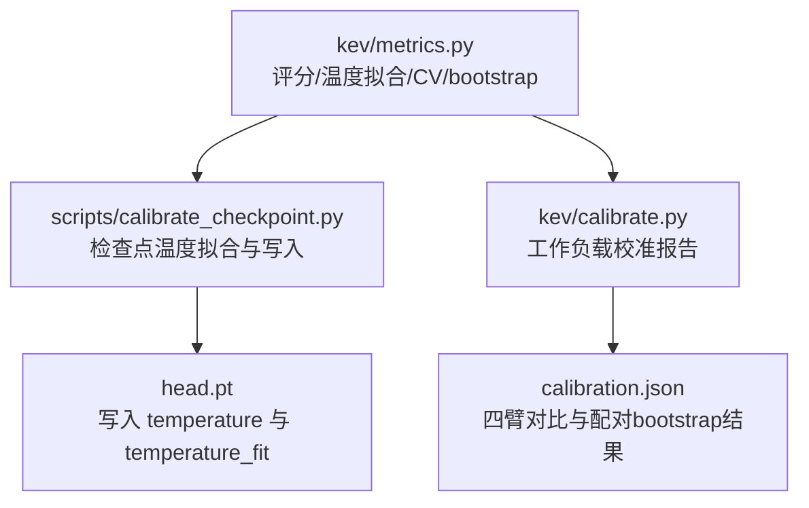
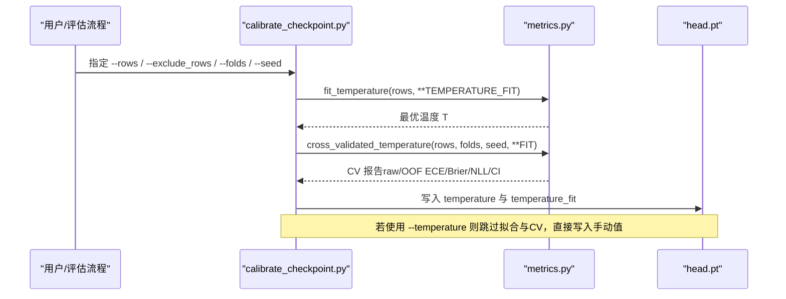
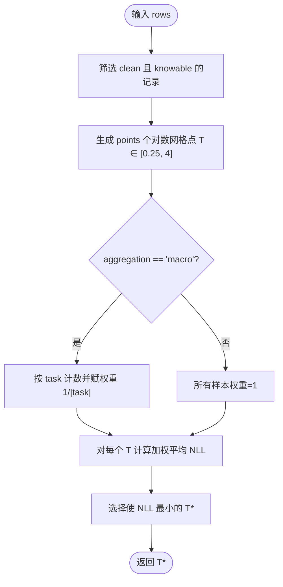
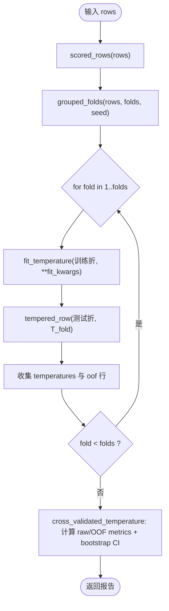
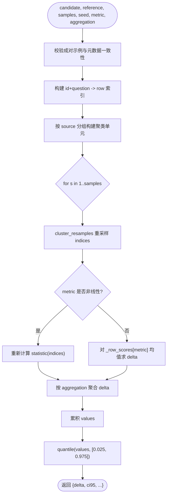
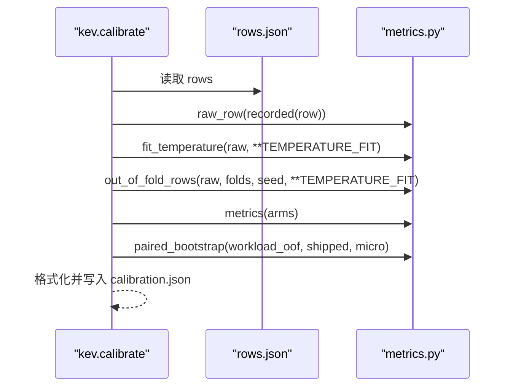
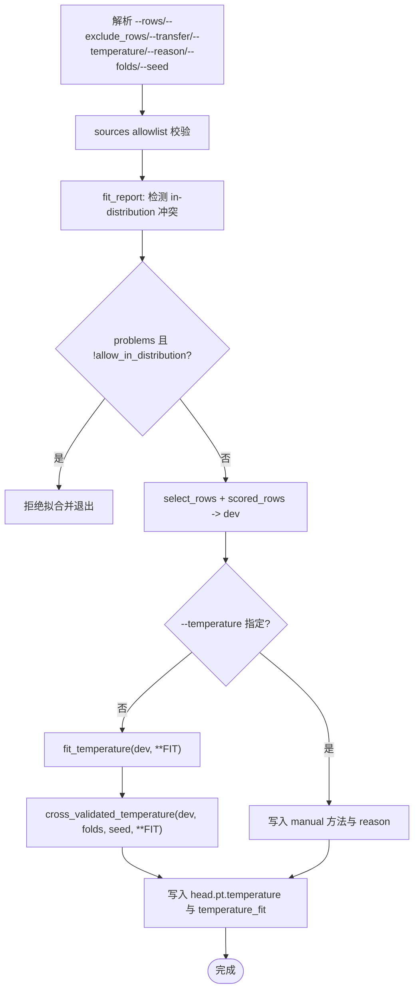
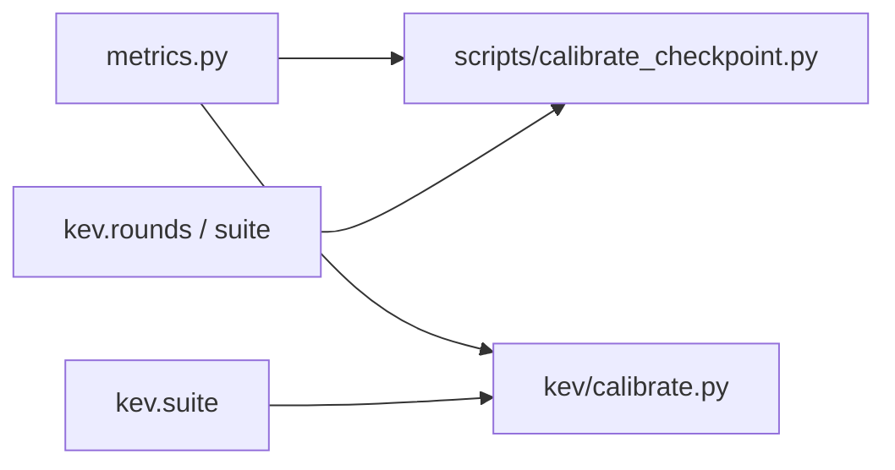

<cite>
**本文引用的文件**   
- [metrics.py](file://kev/metrics.py)
- [calibrate_checkpoint.py](file://scripts/calibrate_checkpoint.py)
- [calibrate.py](file://kev/calibrate.py)
</cite>

## 目录
1. [引言](#引言)
2. [项目结构](#项目结构)
3. [核心组件](#核心组件)
4. [架构总览](#架构总览)
5. [详细组件分析](#详细组件分析)
6. [依赖关系分析](#依赖关系分析)
7. [性能与复杂度](#性能与复杂度)
8. [故障排查指南](#故障排查指南)
9. [结论](#结论)
10. [附录：配置与最佳实践](#附录配置与最佳实践)

## 引言
本文件系统化说明温度校准（temperature calibration）在该项目中的数学原理、实现细节与验证流程，重点覆盖：
- 温度参数拟合的数学目标：在 0.25 到 4 的对数网格上最小化负对数似然（NLL）。
- 聚合策略 micro 与 macro 的区别、任务权重分配方式及适用场景。
- 交叉验证温度拟合流程：out_of_fold_rows() 的分组互斥折划分，以及 cross_validated_temperature() 的完整报告生成。
- 配对 bootstrap 统计检验 paired_bootstrap()：源分层聚类重采样、置信区间与显著性判断。
- temperature_fitting 配置选项 TEMPERATURE_FIT 的含义与调整建议。
- 实际部署中的应用案例与最佳实践。

## 项目结构
围绕温度拟合与验证的核心代码集中在以下三个模块：
- kev/metrics.py：纯 NumPy 实现的评分、温度拟合、交叉验证与配对 bootstrap。
- scripts/calibrate_checkpoint.py：面向发布检查点的温度拟合脚本，写入 head.pt 并输出 OOF 报告。
- kev/calibrate.py：面向单份 rows.json 的工作负载校准报告工具。

图表来源
- [metrics.py:257-294](file://kev/metrics.py#L257-L294)
- [calibrate_checkpoint.py:36-39](file://scripts/calibrate_checkpoint.py#L36-L39)
- [calibrate.py:21-22](file://kev/calibrate.py#L21-L22)

章节来源
- [metrics.py:1-427](file://kev/metrics.py#L1-L427)
- [calibrate_checkpoint.py:1-162](file://scripts/calibrate_checkpoint.py#L1-L162)
- [calibrate.py:1-74](file://kev/calibrate.py#L1-L74)

## 核心组件
- 温度变换与概率计算：将 logits 按温度缩放后做 softmax，得到校准后的概率。
- NLL 计算：基于 logits 或概率精确计算负对数似然。
- 温度拟合 fit_temperature：在对数网格上搜索最小化平均 NLL 的温度。
- 交叉验证 out_of_fold_rows：按 (source, group) 分组的 5 折互斥划分，每折独立拟合温度并应用到测试折。
- 交叉验证报告 cross_validated_temperature：汇总 raw vs OOF 指标，并以源分层聚类 bootstrap 给出 ECE 差值的 95% CI。
- 配对 bootstrap paired_bootstrap：对候选与参考在同一记录上的指标差异进行聚类重采样，支持 micro/macro 聚合。
- 工作负载校准 calibrate.py：raw/shipped/workload/workload_oof 四臂对比，并输出 workload_oof vs shipped 的配对 bootstrap。
- 检查点校准脚本 calibrate_checkpoint.py：读取 held-out 数据集 rows，执行温度拟合与 OOF 报告，写入 head.pt。

章节来源
- [metrics.py:24-53](file://kev/metrics.py#L24-L53)
- [metrics.py:276-294](file://kev/metrics.py#L276-L294)
- [metrics.py:333-369](file://kev/metrics.py#L333-L369)
- [metrics.py:372-426](file://kev/metrics.py#L372-L426)
- [calibrate.py:28-44](file://kev/calibrate.py#L28-L44)
- [calibrate_checkpoint.py:97-157](file://scripts/calibrate_checkpoint.py#L97-L157)

## 架构总览
温度拟合与验证的整体流程如下：

图表来源
- [calibrate_checkpoint.py:115-157](file://scripts/calibrate_checkpoint.py#L115-L157)
- [metrics.py:276-294](file://kev/metrics.py#L276-L294)
- [metrics.py:351-369](file://kev/metrics.py#L351-L369)

## 详细组件分析

### 温度拟合的数学原理与实现
- 温度变换：对每条记录的 logits z 执行 (z - max(z)) / T，再 softmax 得到概率 p；当未记录 logits 时，从概率反推 log-probabilities。
- NLL：若存在 logits，则用数值稳定的形式计算；否则从概率取对数。
- 网格搜索：在 0.25..4 范围内生成 points 个对数等距点，计算每个 T 的平均 NLL，选择最小者。
- 聚合策略：
  - micro：所有问题等权平均 NLL。
  - macro：先按 task 分组，组内平均 NLL，再对所有 task 求平均，等价于为每个样本赋予 1/|task| 的权重。

图表来源
- [metrics.py:24-53](file://kev/metrics.py#L24-L53)
- [metrics.py:276-294](file://kev/metrics.py#L276-L294)

章节来源
- [metrics.py:24-53](file://kev/metrics.py#L24-L53)
- [metrics.py:276-294](file://kev/metrics.py#L276-L294)

### 聚合策略 micro vs macro 与任务权重
- micro：适用于整体校准目标，强调总体 NLL 最小化，适合数据分布相对均匀的任务集合。
- macro：对每个任务一视同仁，避免大任务主导优化，适合多任务异构场景，尤其当某些任务样本量远大于其他任务时。
- 权重分配：
  - micro：w_i = 1。
  - macro：w_i = 1 / |{j : row_j.task == row_i.task}|。

章节来源
- [metrics.py:276-294](file://kev/metrics.py#L276-L294)

### 交叉验证温度拟合：out_of_fold_rows 与 cross_validated_temperature
- out_of_fold_rows：
  - 使用 grouped_folds 按 (source, group) 单位进行互斥折划分，确保同一源内的兄弟问题和变体不会跨折。
  - 对每折训练集拟合温度，并将该温度应用于对应测试折，返回 OOF 行序列与每折温度。
- cross_validated_temperature：
  - 计算 raw 与 OOF 的 metrics 摘要（n/ece/brier/nll/confident_error_rate/coverage_at_5pct_error）。
  - 以 source-stratified (source, group) 为单位进行 cluster_resamples 重采样，分别计算 raw 与 OOF 的 ECE，得到 delta 的 95% CI。
  - separated 指示 delta 的 CI 是否包含 0，用于判断 OOF 与 raw 是否存在显著差异。

图表来源
- [metrics.py:317-348](file://kev/metrics.py#L317-L348)
- [metrics.py:351-369](file://kev/metrics.py#L351-L369)

章节来源
- [metrics.py:317-348](file://kev/metrics.py#L317-L348)
- [metrics.py:351-369](file://kev/metrics.py#L351-L369)

### 配对 bootstrap 统计检验：paired_bootstrap
- 目的：比较 candidate 与 reference 在同一记录集合上的指标差异，提供稳健的置信区间与显著性判断。
- 关键步骤：
  - 校验成对示例：id+question 必须一致，label 与 keys 顺序一致，source/group/task/type 元数据一致。
  - 统计量：
    - 可加指标（如 nll、acc、brier）：对 _row_scores 的均值进行重采样。
    - 非线性指标（ece、aurc、coverage_at_*）：每次重采样重新计算指标。
  - 聚合：micro 对全部样本；macro 按 task 分组分别计算 delta 再平均。
  - 重采样单元：cluster_resamples 按 (source, group) 聚类重采样，保证兄弟问题与变体同进同出。
  - 输出：delta 点估计、95% CI、样本数、分组数、unit 与方法说明。

图表来源
- [metrics.py:372-426](file://kev/metrics.py#L372-L426)
- [metrics.py:308-314](file://kev/metrics.py#L308-L314)

章节来源
- [metrics.py:308-314](file://kev/metrics.py#L308-L314)
- [metrics.py:372-426](file://kev/metrics.py#L372-L426)

### 工作负载校准报告：kev.calibrate
- 四臂对比：
  - raw：恢复 checkpoint 原始 logits（T=1）。
  - shipped：checkpoint 已服务的温度下的概率。
  - workload：在当前 rows 上拟合的温度下服务。
  - workload_oof：对当前 rows 进行分组互斥 CV 得到的 OOF 预测。
- 输出：
  - 各臂的 n/acc/ece/brier/nll/mean_conf/confident_error_rate/coverage_at_5pct_error/aurc。
  - workload_oof vs shipped 的配对 bootstrap（micro），针对 ece/brier/coverage_at_5pct_error/aurc。
  - 记录 fitted 配置、folds、seed、note。

图表来源
- [calibrate.py:28-44](file://kev/calibrate.py#L28-L44)
- [metrics.py:224-261](file://kev/metrics.py#L224-L261)

章节来源
- [calibrate.py:28-44](file://kev/calibrate.py#L28-L44)

### 检查点温度拟合与写入：scripts/calibrate_checkpoint.py
- 输入约束：
  - rows 必须是 held-out 数据集，不能与 checkpoint 的训练数据共享（通过 pool_conflicts 检测）。
  - 允许 --allow-in-distribution 强制拟合，但会记录 in_distribution 原因。
- 流程：
  - 解析 --rows 与 --exclude_rows，过滤 clean 记录。
  - 若未指定 --temperature，调用 fit_temperature(dev, **FIT) 得到 T。
  - 打印 fit rows 与可选 transfer 的 raw/calibrated 指标。
  - 若为自动拟合，调用 cross_validated_temperature(dev, folds, seed, **FIT)，打印 OOF ECE 与 CI。
  - 写入 head.pt 的 temperature 与 temperature_fit（含方法、CV 报告、fit_rows、training_suites、in_distribution 标记）。

图表来源
- [calibrate_checkpoint.py:48-64](file://scripts/calibrate_checkpoint.py#L48-L64)
- [calibrate_checkpoint.py:97-112](file://scripts/calibrate_checkpoint.py#L97-L112)
- [calibrate_checkpoint.py:115-157](file://scripts/calibrate_checkpoint.py#L115-L157)

章节来源
- [calibrate_checkpoint.py:48-64](file://scripts/calibrate_checkpoint.py#L48-L64)
- [calibrate_checkpoint.py:97-112](file://scripts/calibrate_checkpoint.py#L97-L112)
- [calibrate_checkpoint.py:115-157](file://scripts/calibrate_checkpoint.py#L115-L157)

## 依赖关系分析
- metrics.py 被 calibrate_checkpoint.py 与 calibrate.py 共同依赖，提供统一的温度拟合、评分与统计检验能力。
- calibrate_checkpoint.py 还依赖 rounds.suite 与 suite.manifest 进行数据泄露检测与来源校验。
- calibrate.py 依赖 suite.read_json/write_json 进行报告读写。

图表来源
- [calibrate_checkpoint.py:36-40](file://scripts/calibrate_checkpoint.py#L36-L40)
- [calibrate.py:21-22](file://kev/calibrate.py#L21-L22)

章节来源
- [calibrate_checkpoint.py:36-40](file://scripts/calibrate_checkpoint.py#L36-L40)
- [calibrate.py:21-22](file://kev/calibrate.py#L21-L22)

## 性能与复杂度
- 温度拟合：
  - 时间复杂度：O(points × N)，其中 N 为有效样本数，points 为网格点数（默认 121）。
  - 空间复杂度：O(N) 存储 losses 与 weights。
- 交叉验证：
  - 时间复杂度：O(folds × points × N)，folds 通常为 5。
  - 空间复杂度：O(N) 存储 OOF 行与每折温度。
- 配对 bootstrap：
  - 时间复杂度：O(samples × N) 或 O(samples × G)（G 为分组数），取决于指标是否可加。
  - 空间复杂度：O(samples) 存储统计值数组。

章节来源
- [metrics.py:276-294](file://kev/metrics.py#L276-L294)
- [metrics.py:333-348](file://kev/metrics.py#L333-L348)
- [metrics.py:372-426](file://kev/metrics.py#L372-L426)

## 故障排查指南
- 无效温度：
  - 非有限或非正温度会触发 ValueError。
- 输入校验：
  - 空 rows 无法评分。
  - 需要 clean 且 knowable 的记录。
  - 温度拟合要求 raw logits，不接受已校准的输出。
- 交叉验证：
  - folds 必须 ≥ 2。
  - 分组数量少于 folds 时会报错。
- 配对 bootstrap：
  - 成对示例必须完全匹配（id+question、label、keys、source/group/task/type）。
  - 不支持的 metric 或 aggregation 会报错。
- 检查点脚本：
  - sources allowlist 拼写错误会被拒绝。
  - 检测到 in-distribution 数据泄露会拒绝拟合，除非显式 --allow-in-distribution。

章节来源
- [metrics.py:24-27](file://kev/metrics.py#L24-L27)
- [metrics.py:64-67](file://kev/metrics.py#L64-L67)
- [metrics.py:276-285](file://kev/metrics.py#L276-L285)
- [metrics.py:333-348](file://kev/metrics.py#L333-L348)
- [metrics.py:372-396](file://kev/metrics.py#L372-L396)
- [calibrate_checkpoint.py:127-135](file://scripts/calibrate_checkpoint.py#L127-L135)

## 结论
本项目实现了严谨的温度校准与验证管线：
- 在 0.25..4 的对数网格上最小化 NLL，支持 micro/macro 两种聚合策略，灵活适配不同任务分布。
- 通过分组互斥的 5 折交叉验证，获得无偏的 OOF 校准估计，并以源分层聚类 bootstrap 给出 ECE 差值的置信区间。
- 配对 bootstrap 提供稳健的模型间差异检验，支持多种指标与聚合方式。
- 检查点脚本与工作负载报告工具将上述能力工程化，便于部署与审计。

## 附录：配置与最佳实践

### TEMPERATURE_FIT 配置项
- 默认值：
  - aggregation: "micro"
  - points: 121
- 含义：
  - aggregation：决定 NLL 聚合方式，micro 对所有问题等权，macro 对每个任务一视同仁。
  - points：对数网格点数，越大搜索越细，计算成本越高。
- 调整建议：
  - 多任务异构且任务规模差异大：优先尝试 macro，避免大任务主导。
  - 资源受限或快速筛查：减少 points（例如 81）以降低计算量。
  - 部署前最终拟合：保持默认 micro 与 121 点网格，确保稳定与可比性。

章节来源
- [metrics.py:269-273](file://kev/metrics.py#L269-L273)
- [metrics.py:276-294](file://kev/metrics.py#L276-L294)

### 实际部署应用案例与最佳实践
- 发布检查点：
  - 使用 scripts/calibrate_checkpoint.py 在 held-out 数据集上拟合温度，并写入 head.pt。
  - 启用 cross_validated_temperature 输出 OOF ECE 与 CI，确保 in-sample 拟合不泄漏。
  - 若需手动温度，必须提供 --reason 并记录在 head.pt。
- 工作负载校准：
  - 使用 kev.calibrate 对本地 rows.json 生成四臂报告，评估 workload_oof vs shipped 的差异。
  - 关注 coverage_at_5pct_error 与 AURC，结合 ECE/Brier 综合判断校准质量。
- 数据泄露防护：
  - 严格使用 held-out 数据集作为拟合集，避免与训练数据共享。
  - 使用 --exclude_rows 排除重复或敏感记录。
- 统计检验：
  - 使用 paired_bootstrap 对候选与参考进行配对比较，关注 micro/macro 两种聚合下的 CI 是否包含 0。
  - 对于非线性指标（ECE/AURC），每次重采样重新计算统计量，确保估计稳健。

章节来源
- [calibrate_checkpoint.py:1-32](file://scripts/calibrate_checkpoint.py#L1-L32)
- [calibrate_checkpoint.py:115-157](file://scripts/calibrate_checkpoint.py#L115-L157)
- [calibrate.py:1-17](file://kev/calibrate.py#L1-L17)
- [calibrate.py:28-44](file://kev/calibrate.py#L28-L44)