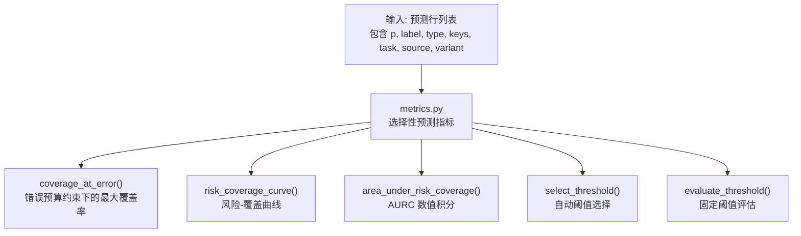
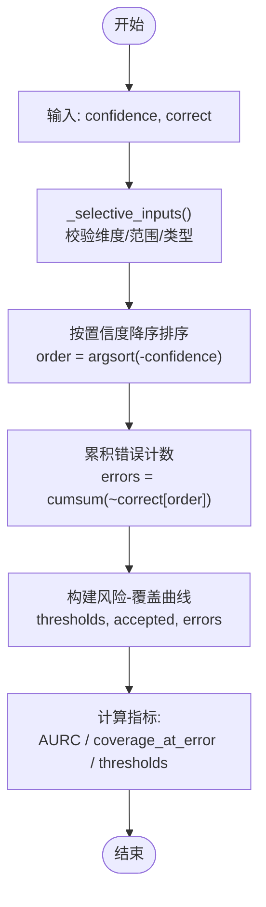
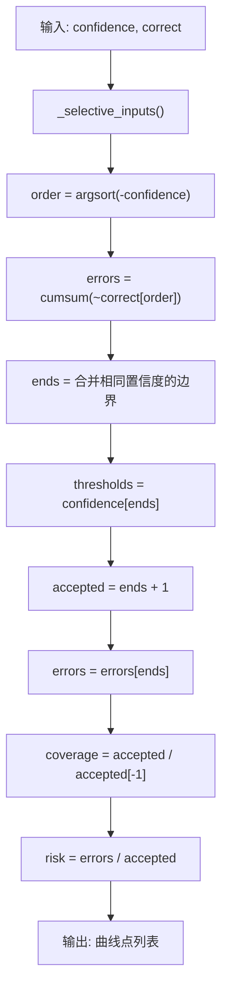
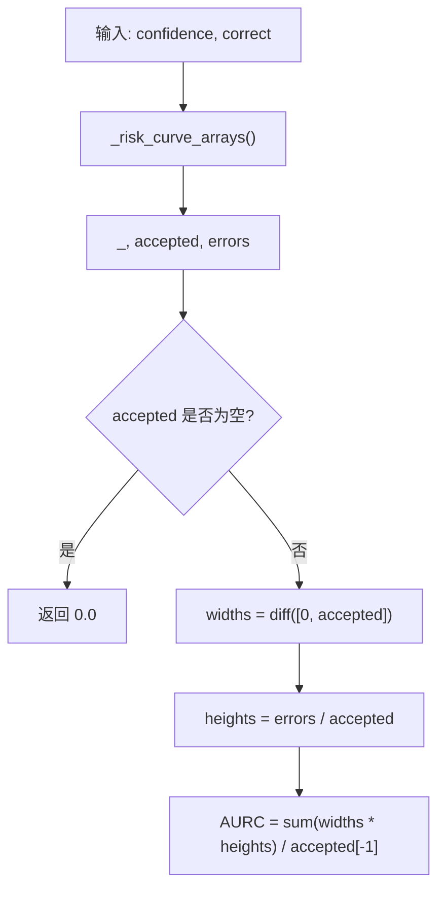
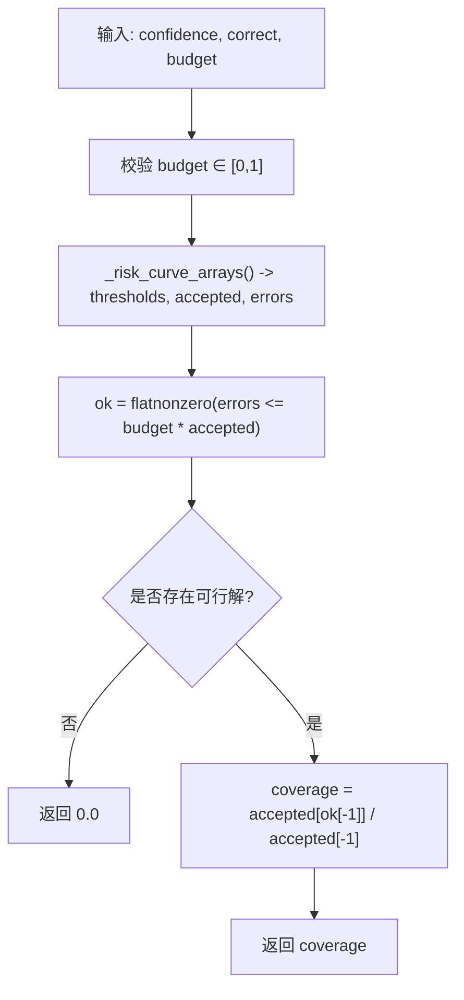
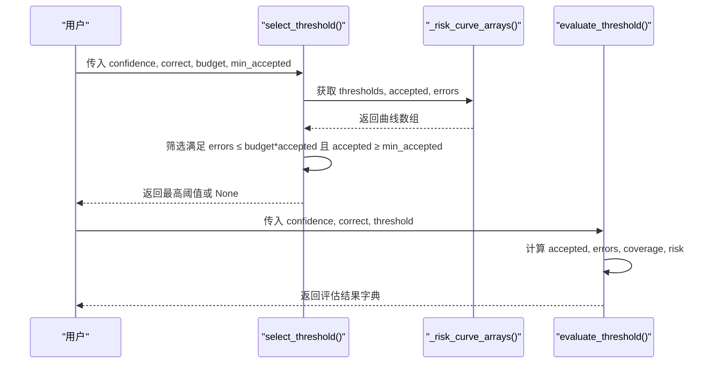
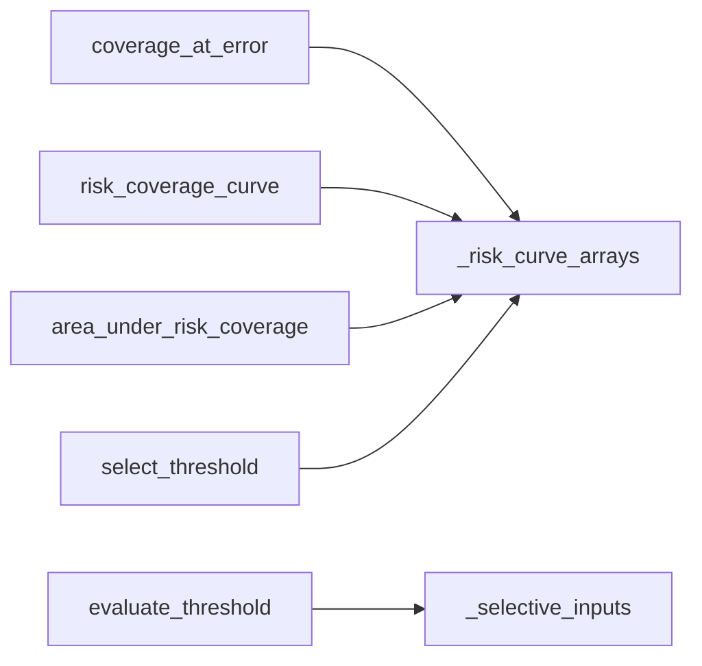

<cite>
**本文引用的文件**   
- [metrics.py](file://kev/metrics.py)
</cite>

## 目录
1. [简介](#简介)
2. [项目结构](#项目结构)
3. [核心组件](#核心组件)
4. [架构总览](#架构总览)
5. [详细组件分析](#详细组件分析)
6. [依赖关系分析](#依赖关系分析)
7. [性能考量](#性能考量)
8. [故障排查指南](#故障排查指南)
9. [结论](#结论)
10. [附录：使用示例与最佳实践](#附录使用示例与最佳实践)

## 简介
本文件面向“选择性预测”（Selective Prediction）评估体系，聚焦以下目标：
- 解释高置信度错误率 confident_error_rate 与 0.9 阈值下的错误率 error_rate_at_0_9 的计算方法与业务含义。
- 详解风险-覆盖曲线 risk_coverage_curve 的构建过程：按置信度排序、累积错误计数、覆盖率计算。
- 说明曲线下面积 AURC 的数值积分计算方法及其在模型可靠性评估中的作用。
- 文档化 coverage_at_error() 的选择性自动化逻辑：在错误预算约束下寻找最大覆盖率。
- 提供 select_threshold() 与 evaluate_threshold() 的使用思路，帮助根据业务需求选择置信度阈值。
- 总结选择性预测在实际应用中的最佳实践。

## 项目结构
本仓库中与选择性预测相关的实现集中在 metrics.py 中，该模块以纯 NumPy 对“行级预测结果”进行评分，不依赖具体模型或框架，便于离线评估与对比。

图表来源
- [metrics.py:103-164](file://kev/metrics.py#L103-L164)

章节来源
- [metrics.py:1-10](file://kev/metrics.py#L1-L10)

## 核心组件
本节概述关键函数与其职责：
- coverage_at_error(confidence, correct, budget): 在给定错误预算下，按置信度从高到低接受样本，使经验错误率不超过预算的前提下最大化覆盖率。
- risk_coverage_curve(confidence, correct): 生成风险-覆盖曲线数据点，包括阈值、接受数量、错误数、覆盖率与风险。
- area_under_risk_coverage(confidence, correct): 基于风险-覆盖曲线的数值积分计算 AURC。
- select_threshold(confidence, correct, budget, min_accepted=1): 在满足错误预算与最小接受数量的前提下，返回最高置信度阈值。
- evaluate_threshold(confidence, correct, threshold): 对指定阈值进行评估，输出接受数量、错误数、覆盖率与风险等指标。

章节来源
- [metrics.py:103-164](file://kev/metrics.py#L103-L164)

## 架构总览
选择性预测评估的核心流程如下：
- 输入为每条样本的置信度 confidence 与正确性 correct。
- 通过 _risk_curve_arrays 将样本按置信度降序排列，并计算累积错误数。
- 基于上述数组，分别构建风险-覆盖曲线、计算 AURC、求解满足预算的最大覆盖率与阈值。
- 对外暴露 coverage_at_error、risk_coverage_curve、area_under_risk_coverage、select_threshold、evaluate_threshold 等接口。

图表来源
- [metrics.py:114-146](file://kev/metrics.py#L114-L146)

## 详细组件分析

### 高置信度错误率 confident_error_rate 与 0.9 阈值下的错误率 error_rate_at_0_9
- confident_error_rate: 在整体样本中，筛选出置信度大于等于 0.9 的子集，计算其中错误的比例。用于衡量“高置信但错误”的风险面。
- error_rate_at_0_9: 同样针对置信度 ≥ 0.9 的子集，计算其错误率；当不存在置信度 ≥ 0.9 的样本时返回空值。

这两个指标常用于快速诊断模型是否出现“过度自信的错误”，尤其在安全敏感场景中需要严格控制高置信错误。

章节来源
- [metrics.py:56-62](file://kev/metrics.py#L56-L62)
- [metrics.py:78-91](file://kev/metrics.py#L78-L91)

### 风险-覆盖曲线 risk_coverage_curve
构建步骤：
1. 输入 confidence 与 correct，并进行有效性校验。
2. 按置信度降序排序，得到 order。
3. 计算累积错误数 errors = cumsum(~correct[order])。
4. 合并相同置信度的边界点，得到 thresholds、accepted、errors。
5. 对每个阈值点计算覆盖率 coverage = n / N 与风险 risk = e / n。

图表来源
- [metrics.py:114-139](file://kev/metrics.py#L114-L139)

章节来源
- [metrics.py:114-139](file://kev/metrics.py#L114-L139)

### 曲线下面积 AURC 的数值积分
AURC 是对风险-覆盖曲线进行数值积分得到的标量指标，用于综合评估模型在“不同覆盖率下的平均风险”。实现要点：
- 使用已计算的 accepted 与 errors 序列。
- 通过 np.diff(accepted) 获取相邻区间的宽度。
- 在每个区间内用 errors / accepted 作为高度近似风险。
- 对所有区间求和并除以总接受数 accepted[-1]，得到归一化的曲线下面积。

图表来源
- [metrics.py:142-146](file://kev/metrics.py#L142-L146)

章节来源
- [metrics.py:142-146](file://kev/metrics.py#L142-L146)

### coverage_at_error() 的选择性自动化逻辑
目标：在错误预算 budget 约束下，找到按置信度从高到低接受的样本集合，使得经验错误率不超过 budget，同时最大化覆盖率。

算法流程：
1. 校验 budget ∈ [0, 1]。
2. 调用 _risk_curve_arrays 得到 thresholds、accepted、errors。
3. 筛选满足 errors ≤ budget × accepted 的索引 ok。
4. 若存在可行解，取最后一个可行点的覆盖率 accepted[ok[-1]] / accepted[-1]；否则返回 0.0。

图表来源
- [metrics.py:103-111](file://kev/metrics.py#L103-L111)
- [metrics.py:125-132](file://kev/metrics.py#L125-L132)

章节来源
- [metrics.py:103-111](file://kev/metrics.py#L103-L111)
- [metrics.py:125-132](file://kev/metrics.py#L125-L132)

### select_threshold() 与 evaluate_threshold()
- select_threshold(confidence, correct, budget, min_accepted=1):
  - 在满足错误预算与最小接受数量约束的前提下，返回最高的置信度阈值。
  - 若无可行解，返回 None。
- evaluate_threshold(confidence, correct, threshold):
  - 对给定的阈值进行评估，输出接受数量、错误数、覆盖率与风险。
  - 支持 threshold=None 表示全部拒绝（abstain-all）。

图表来源
- [metrics.py:149-164](file://kev/metrics.py#L149-L164)
- [metrics.py:125-132](file://kev/metrics.py#L125-L132)

章节来源
- [metrics.py:149-164](file://kev/metrics.py#L149-L164)
- [metrics.py:125-132](file://kev/metrics.py#L125-L132)

## 依赖关系分析
选择性预测相关函数的依赖关系如下：
- coverage_at_error 依赖 _risk_curve_arrays。
- risk_coverage_curve 依赖 _risk_curve_arrays。
- area_under_risk_coverage 依赖 _risk_curve_arrays。
- select_threshold 依赖 _risk_curve_arrays。
- evaluate_threshold 依赖 _selective_inputs。

图表来源
- [metrics.py:103-164](file://kev/metrics.py#L103-L164)

章节来源
- [metrics.py:103-164](file://kev/metrics.py#L103-L164)

## 性能考量
- 时间复杂度：主要操作为排序与累积求和，复杂度约为 O(N log N)，适用于中等规模数据集。
- 空间复杂度：辅助数组（order、errors、thresholds、accepted）占用 O(N)。
- 数值稳定性：置信度需为有限值且在 [0, 1]；布尔正确性需严格校验。
- 向量化优化：NumPy 的 argsort、cumsum、diff 等操作高效，避免显式循环。

## 故障排查指南
常见问题与处理建议：
- 错误预算不在 [0, 1]：coverage_at_error 会抛出 ValueError。请检查预算设置。
- 置信度非有限或越界：_selective_inputs 会抛出 ValueError。请确保 confidence ∈ [0, 1] 且无 NaN/Inf。
- 正确性非布尔：_selective_inputs 会抛出 ValueError。请确保 correct 为布尔数组。
- 阈值无效：evaluate_threshold 会抛出 ValueError。请确保 threshold ∈ [0, 1] 或为 None。
- 空输入：area_under_risk_coverage 在空输入时返回 0.0；coverage_at_error 在无可行解时返回 0.0。

章节来源
- [metrics.py:103-164](file://kev/metrics.py#L103-L164)

## 结论
选择性预测通过置信度阈值控制模型的“接受/拒绝”行为，从而在准确率与覆盖率之间取得平衡。confident_error_rate 与 error_rate_at_0_9 用于识别高置信错误风险；risk_coverage_curve 与 AURC 提供全局视角的可靠性评估；coverage_at_error 与 select_threshold 则提供在业务约束下的自动化决策能力。结合 evaluate_threshold，可在实际系统中灵活配置阈值以满足合规与性能要求。

## 附录：使用示例与最佳实践

### 使用示例
- 计算 0.9 阈值下的错误率与覆盖率：
  - 使用 metrics(rows) 返回的 error_rate_at_0_9 与 coverage_at_0_9。
- 在错误预算 0.05 下计算最大覆盖率：
  - 调用 coverage_at_error(confidence, correct, 0.05)。
- 自动生成满足预算与最小接受数量的阈值：
  - 调用 select_threshold(confidence, correct, budget=0.05, min_accepted=10)。
- 评估固定阈值的接受情况：
  - 调用 evaluate_threshold(confidence, correct, threshold=0.9)。

### 最佳实践
- 校准优先：在使用选择性预测前，先进行温度校准（temperature fitting），以提升概率的可靠性。
- 多阈值策略：对不同业务场景设置不同的阈值或预算，例如高风险任务采用更严格的阈值。
- 监控高置信错误：定期跟踪 confident_error_rate，发现模型退化或分布漂移。
- 可视化风险-覆盖曲线：通过 risk_coverage_curve 绘制曲线，直观理解不同阈值下的风险与覆盖率权衡。
- 结合 AURC：在模型对比中，AURC 可作为综合指标，反映整体可靠性。
- 自动化阈值选择：在生产环境中，使用 select_threshold 动态调整阈值，满足实时业务约束。

章节来源
- [metrics.py:64-100](file://kev/metrics.py#L64-L100)
- [metrics.py:103-164](file://kev/metrics.py#L103-L164)