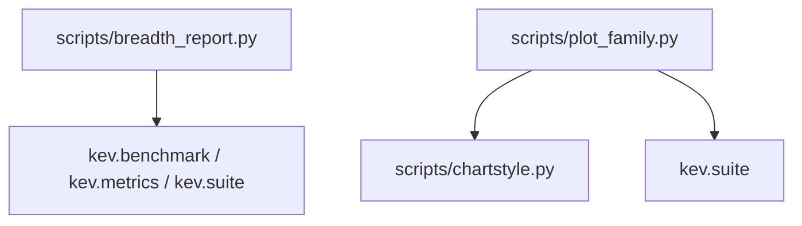
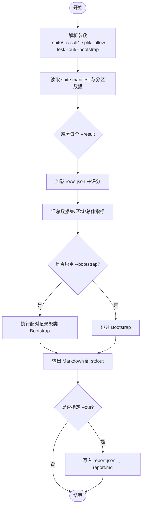
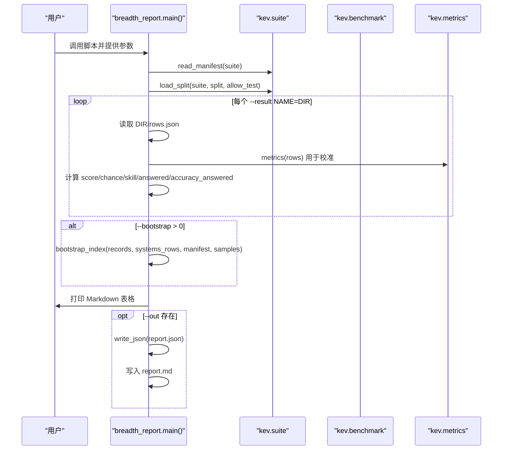
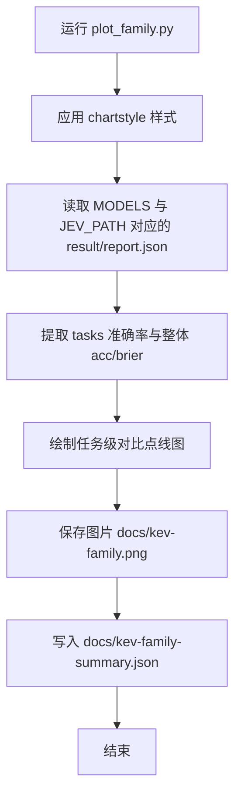
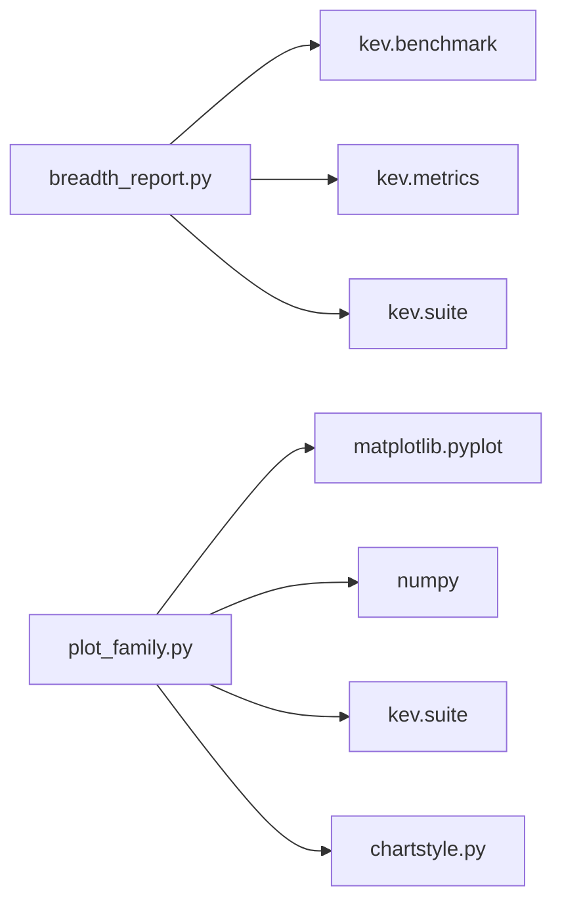

<cite>
**本文引用的文件**   
- [breadth_report.py](file://scripts/breadth_report.py)
- [plot_family.py](file://scripts/plot_family.py)
- [chartstyle.py](file://scripts/chartstyle.py)
</cite>

## 目录
1. [简介](#简介)
2. [项目结构](#项目结构)
3. [核心组件](#核心组件)
4. [架构总览](#架构总览)
5. [详细组件分析](#详细组件分析)
6. [依赖关系分析](#依赖关系分析)
7. [性能与最佳实践](#性能与最佳实践)
8. [故障排查与调试](#故障排查与调试)
9. [结论](#结论)
10. [附录：常用命令与输出解读](#附录常用命令与输出解读)

## 简介
本文件面向 Kev 评估与分析工作流，聚焦两个关键脚本：
- breadth_report.py：对 breadth-v1 套件进行评分、校准与不确定性估计，并生成报告。
- plot_family.py：绘制模型家族（Kev 系列）与 Jev 在域外任务上的对比图，并输出摘要 JSON。

文档将详细说明命令行参数、典型用法、输出含义、批量处理模式、错误处理与性能优化建议。

## 项目结构
与本次文档直接相关的脚本位于 scripts 目录：
- scripts/breadth_report.py：广度评测报告生成器。
- scripts/plot_family.py：模型家族对比绘图器。
- scripts/chartstyle.py：绘图样式与辅助函数（被 plot_family.py 引用）。

图表来源
- [breadth_report.py:14-23](file://scripts/breadth_report.py#L14-L23)
- [plot_family.py:7-14](file://scripts/plot_family.py#L7-L14)

章节来源
- [breadth_report.py:1-23](file://scripts/breadth_report.py#L1-L23)
- [plot_family.py:1-14](file://scripts/plot_family.py#L1-L14)

## 核心组件
- breadth_report.py
  - 功能：读取 suite 清单与分区数据，加载各系统结果 rows.json，计算准确率、覆盖率调整后的得分、随机水平、技能指数、校准指标（ECE/Brier/NLL），支持配对记录聚类引导的 Bootstrap 置信区间，输出 report.json 与 report.md。
  - 关键参数：--suite、--result、--split、--allow-test、--out、--bootstrap。
- plot_family.py
  - 功能：从已保存的结果文件中提取 transfer 指标，按固定任务列表绘制 Kev 系列与 Jev 的对比点线图，并输出图片与摘要 JSON。
  - 输入：硬编码的 MODELS 路径与 JEV_PATH；无命令行参数。
  - 输出：docs/kev-family.png 与 docs/kev-family-summary.json。

章节来源
- [breadth_report.py:1-23](file://scripts/breadth_report.py#L1-L23)
- [plot_family.py:1-22](file://scripts/plot_family.py#L1-L22)

## 架构总览
breadth_report.py 的工作流：
- 解析命令行参数。
- 读取 suite manifest 与分区数据。
- 遍历 --result 指定的多个系统目录，加载 rows.json 并评分。
- 可选执行 Bootstrap 以估计指数置信区间。
- 打印 Markdown 表格，并将 report.json 与 report.md 写入 --out。

图表来源
- [breadth_report.py:160-199](file://scripts/breadth_report.py#L160-L199)

章节来源
- [breadth_report.py:160-199](file://scripts/breadth_report.py#L160-L199)

## 详细组件分析

### breadth_report.py 详解
- 参数说明
  - --suite：必填。套件目录，包含 manifest.json 等清单。
  - --result：必填，可重复。NAME=DIR 形式，NAME 为系统名，DIR 为包含 rows.json（及可选 report.json）的结果目录。
  - --split：development 或 test，默认 development。
  - --allow-test：允许使用测试分区（当分区仅在私有镜像时可能受限）。
  - --out：可选。报告输出目录，会写入 report.json 与 report.md。
  - --bootstrap：整数，默认 0。非零时执行配对记录聚类 Bootstrap，估计指数及其差值的 95% 置信区间。

- 评分与校准
  - 数据集级别：覆盖率调整后得分、随机水平、技能指数、回答比例、回答样本准确率。
  - 区域级别：若干数据集的平均 skill/score，以及池化行的校准指标。
  - 总体级别：raw_index、Decision-Index 风格 index、回答问题的准确率、问题总数、校准指标、平均数据集 ECE。
  - 校准指标：ECE、Brier、NLL、mean_conf。

- Bootstrap
  - 在每个数据集内对记录进行有放回抽样，跨系统保持相同抽样序列，重算数据集 skill、区域均值与总指数，得到 95% 区间与相对首个系统的差值区间。

- 输出
  - 控制台：Markdown 表格（区域与数据集维度）。
  - 若指定 --out：report.json（含 suite、manifest sha256、split、formula、sources、systems、uncertainty）、report.md。

图表来源
- [breadth_report.py:160-199](file://scripts/breadth_report.py#L160-L199)
- [breadth_report.py:106-136](file://scripts/breadth_report.py#L106-L136)
- [breadth_report.py:79-103](file://scripts/breadth_report.py#L79-L103)

章节来源
- [breadth_report.py:28-103](file://scripts/breadth_report.py#L28-L103)
- [breadth_report.py:112-157](file://scripts/breadth_report.py#L112-L157)
- [breadth_report.py:160-199](file://scripts/breadth_report.py#L160-L199)

### plot_family.py 详解
- 功能
  - 从硬编码的路径中读取 Kev 系列与 Jev 的结果文件，提取 transfer.tasks 与各任务的准确率，绘制横向点线图，标注最佳 Kev 与 Jev 的值，并在底部列出各模型整体准确率。
  - 输出图片 docs/kev-family.png 与摘要 docs/kev-family-summary.json。

- 输入与样式
  - 依赖 scripts/chartstyle.py 提供绘图样式与文本排版辅助。
  - 不接收命令行参数；通过 MODELS 与 JEV_PATH 常量配置数据来源。

图表来源
- [plot_family.py:25-28](file://scripts/plot_family.py#L25-L28)
- [plot_family.py:31-70](file://scripts/plot_family.py#L31-L70)

章节来源
- [plot_family.py:1-22](file://scripts/plot_family.py#L1-L22)
- [plot_family.py:25-70](file://scripts/plot_family.py#L25-L70)

## 依赖关系分析
- breadth_report.py
  - 依赖 kev.benchmark.labels（标签映射）、kev.metrics.metrics（校准指标）、kev.suite.digest/load_split/read_json/read_manifest/write_json（套件与 I/O）。
- plot_family.py
  - 依赖 matplotlib.pyplot、numpy、kev.suite.read_json/write_json、scripts.chartstyle（样式与排版）。

图表来源
- [breadth_report.py:14-23](file://scripts/breadth_report.py#L14-L23)
- [plot_family.py:7-14](file://scripts/plot_family.py#L7-L14)

章节来源
- [breadth_report.py:14-23](file://scripts/breadth_report.py#L14-L23)
- [plot_family.py:7-14](file://scripts/plot_family.py#L7-L14)

## 性能与最佳实践
- breadth_report.py
  - 大数据集场景下，建议先使用 --split development 快速验证，再切换到 test（需 --allow-test）做最终评估。
  - 仅当需要统计显著性时才开启 --bootstrap；较大的 samples 会显著增加运行时间。
  - 多系统比较时，确保每个 --result 目录中的 rows.json 结构与 suite 一致，避免重复计算。
  - 将 --out 指向独立目录，便于版本化管理与 CI 归档。
- plot_family.py
  - 修改 MODELS 或 JEV_PATH 以纳入新模型或不同轮次结果。
  - 如需更新任务列表，请同步修改 TASKS 常量。
  - 建议在虚拟环境中安装 matplotlib 与 numpy，避免环境冲突。

[本节为通用指导，无需具体文件引用]

## 故障排查与调试
- breadth_report.py
  - 权限错误：当 suite 的分区仅在私有镜像时，未授权访问会抛出 PermissionError。此时应检查环境变量或凭据，或使用 --allow-test 配合可用的测试分区。
  - 标签不一致：如果 rows.json 中标签与 suite 定义不一致，会报错提示“错误的 suite 或分区”。请核对 suite 版本与 rows.json 来源。
  - 参数格式错误：--result 必须为 NAME=DIR 形式，否则报参数错误。
  - 缺失输出：未指定 --out 时不会写入文件，仅打印 Markdown。
- plot_family.py
  - 缺少依赖：未安装 matplotlib/numpy 会导致导入失败。
  - 路径错误：MODELS 或 JEV_PATH 指向的文件不存在，将导致读取失败。请确认 runs 目录结构与文件名。
  - 样式模块缺失：chartstyle.py 不可用会导致绘图样式相关错误。

章节来源
- [breadth_report.py:170-178](file://scripts/breadth_report.py#L170-L178)
- [breadth_report.py:182-195](file://scripts/breadth_report.py#L182-L195)
- [plot_family.py:31-70](file://scripts/plot_family.py#L31-L70)

## 结论
- breadth_report.py 提供了完整的 breadth-v1 评估流水线，支持多系统对比、覆盖率调整、校准与 Bootstrap 不确定性估计，适合自动化报告生成。
- plot_family.py 专注于可视化 Kev 系列与 Jev 的域外能力对比，便于对外展示与内部复盘。
- 合理组合参数与批处理策略，可在保证质量的同时提升效率。

[本节为总结性内容，无需具体文件引用]

## 附录：常用命令与输出解读

- 基本用法（单系统）
  - 示例：python scripts/breadth_report.py --suite evals/breadth-v1 --result MyModel=runs/my-model --out runs/my-report
  - 作用：对单个系统进行评分，输出 Markdown 到控制台，并写入 report.json 与 report.md。

- 多系统对比
  - 示例：python scripts/breadth_report.py --suite evals/breadth-v1 --result A=runs/a --result B=runs/b --out runs/compare
  - 作用：同时评估 A 与 B，并在报告中并列呈现。

- 使用测试分区
  - 示例：python scripts/breadth_report.py --suite evals/breadth-v1 --result A=runs/a --split test --allow-test --out runs/test-report
  - 作用：启用测试分区进行评估（需具备相应权限）。

- 加入 Bootstrap 不确定性估计
  - 示例：python scripts/breadth_report.py --suite evals/breadth-v1 --result A=runs/a --result B=runs/b --bootstrap 2000 --out runs/bootstrap-report
  - 作用：执行 2000 次配对记录聚类 Bootstrap，输出指数及其差值的 95% 置信区间。

- 模型家族对比绘图
  - 示例：python scripts/plot_family.py
  - 作用：生成 docs/kev-family.png 与 docs/kev-family-summary.json，展示 Kev 系列与 Jev 在冻结域外套件上的表现。

- 输出解读要点
  - 区域表：每行一个区域，列显示各系统的准确率/指数/ECE。
  - 数据集详情：每个数据集的 score/skill/answered/ECE，以及 chance 水平。
  - 总体指标：raw_index、Decision-Index 风格 index、pooled ECE、平均数据集 ECE。
  - Bootstrap 结果：指数与相对于首个系统的差值的 95% 区间。

章节来源
- [breadth_report.py:160-199](file://scripts/breadth_report.py#L160-L199)
- [plot_family.py:31-70](file://scripts/plot_family.py#L31-L70)