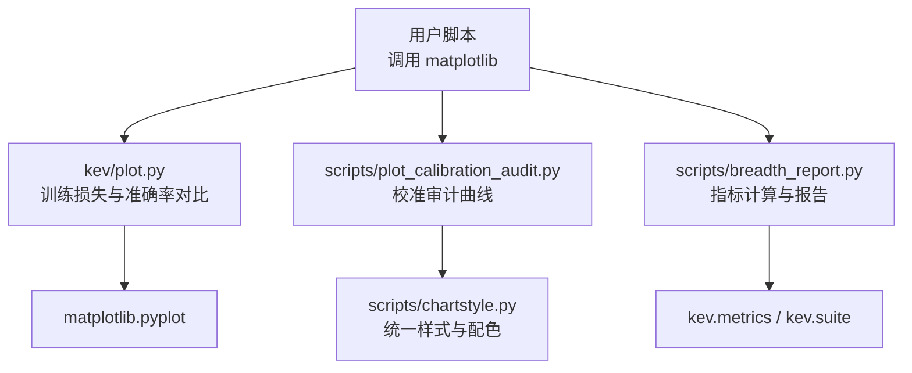
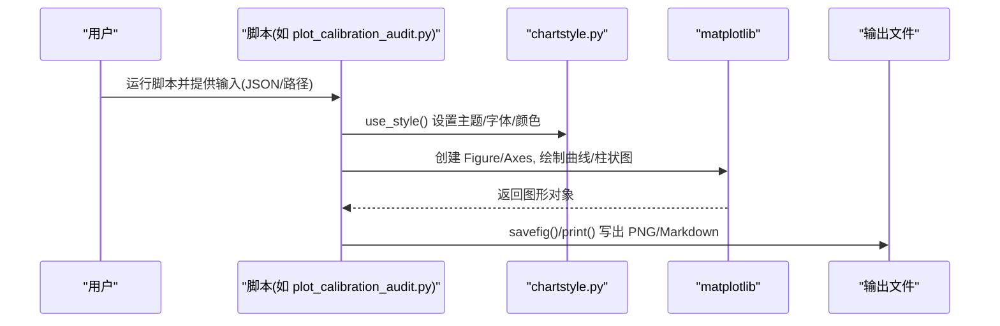
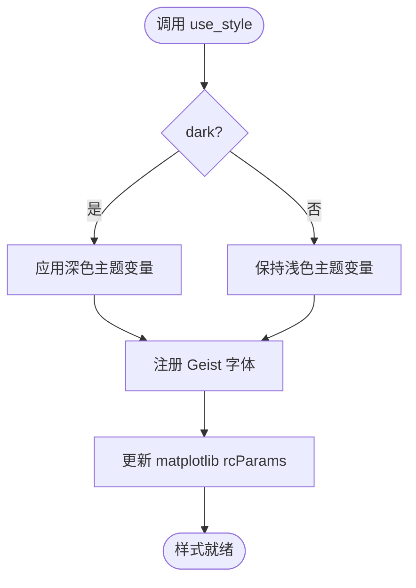
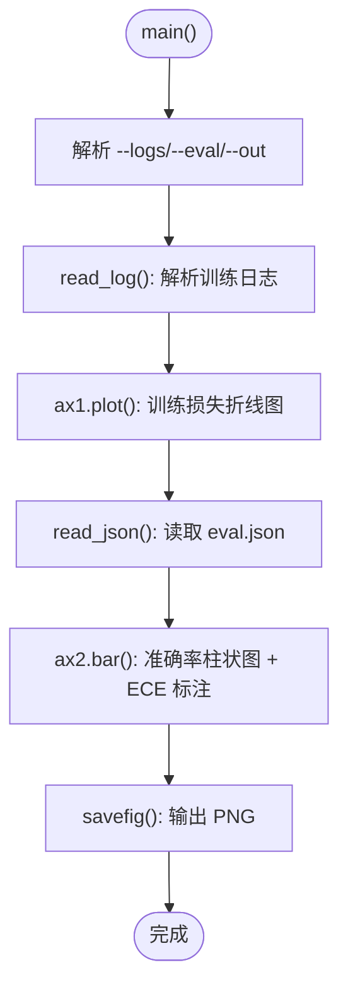
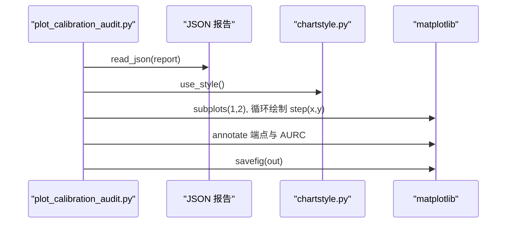
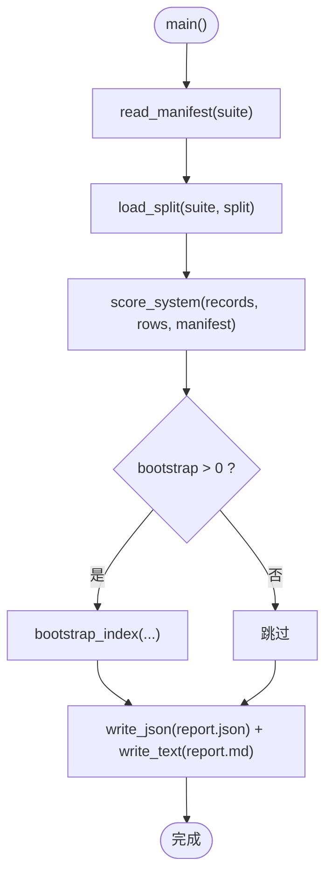
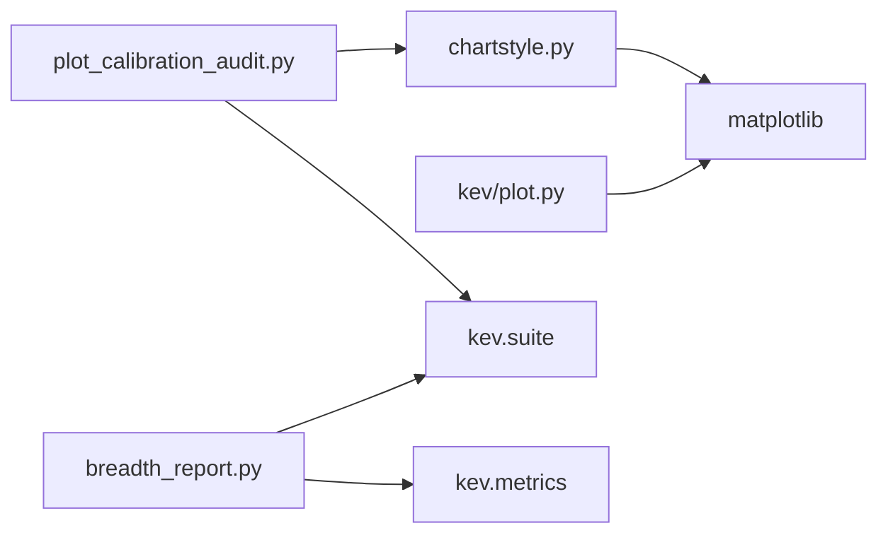
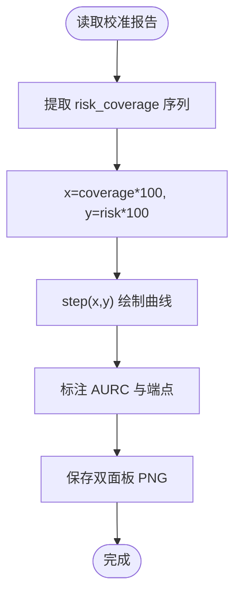

# 可视化指南

<cite>
**本文引用的文件**   
- [chartstyle.py](file://scripts/chartstyle.py)
- [plot.py](file://kev/plot.py)
- [plot_calibration_audit.py](file://scripts/plot_calibration_audit.py)
- [breadth_report.py](file://scripts/breadth_report.py)
</cite>

## 目录
1. [引言](#引言)
2. [项目结构](#项目结构)
3. [核心组件](#核心组件)
4. [架构总览](#架构总览)
5. [详细组件分析](#详细组件分析)
6. [依赖关系分析](#依赖关系分析)
7. [性能与导出](#性能与导出)
8. [交互式可视化方案](#交互式可视化方案)
9. [校准曲线绘制与分析](#校准曲线绘制与分析)
10. [图表样式与自定义开发](#图表样式与自定义开发)
11. [不同数据类型的可视化策略](#不同数据类型的可视化策略)
12. [结果解读指南](#结果解读指南)
13. [故障排查](#故障排查)
14. [结论](#结论)

## 引言
本指南面向评估结果的可视化需求，聚焦仓库中已有的绘图能力与样式体系，说明如何生成柱状图、折线图、散点图等常用图表；解释 chartstyle.py 的样式配置；文档化校准曲线的绘制与分析方法；给出交互式可视化的实现思路；提供自定义样式的扩展建议；并总结不同数据类型的最佳可视化策略、导出分享方式以及结果解读要点。

## 项目结构
与可视化直接相关的代码主要分布在以下位置：
- scripts/chartstyle.py：统一的图表样式、配色、字体与排版工具函数
- kev/plot.py：训练损失与基准对比的示例绘图脚本
- scripts/plot_calibration_audit.py：校准审计（风险-覆盖率）曲线绘图脚本
- scripts/breadth_report.py：广度评测报告生成（含指标计算与 Markdown 输出）

**图示来源**
- [plot.py:1-60](file://kev/plot.py#L1-L60)
- [plot_calibration_audit.py:1-75](file://scripts/plot_calibration_audit.py#L1-L75)
- [breadth_report.py:1-200](file://scripts/breadth_report.py#L1-L200)
- [chartstyle.py:1-137](file://scripts/chartstyle.py#L1-L137)

**章节来源**
- [plot.py:1-60](file://kev/plot.py#L1-L60)
- [plot_calibration_audit.py:1-75](file://scripts/plot_calibration_audit.py#L1-L75)
- [breadth_report.py:1-200](file://scripts/breadth_report.py#L1-L200)
- [chartstyle.py:1-137](file://scripts/chartstyle.py#L1-L137)

## 核心组件
- 样式系统（chartstyle.py）
  - 提供全局 rcParams 设置、字体加载、明暗主题切换、坐标轴边框清理、标题/正文/分隔线/统计值等排版工具
  - 内置 Vercel 品牌色转换与 Kev/JEV/中性色系列映射
- 训练损失与准确率对比（kev/plot.py）
  - 解析训练日志，绘制对数尺度的训练损失折线图
  - 读取 eval.json，绘制多模型准确率柱状图，标注 ECE
- 校准审计曲线（scripts/plot_calibration_audit.py）
  - 从校准审计报告 JSON 中读取 risk_coverage 序列，绘制“低误差区”和“全范围”双面板曲线
  - 使用 chartstyle 统一风格，输出 AURC 与端点标注
- 广度评测报告（scripts/breadth_report.py）
  - 计算覆盖率调整后的准确率、机会水平、技能指数、校准指标（ECE/Brier/NLL）
  - 输出 report.json 与 report.md，支持配对记录聚类 Bootstrap 置信区间

**章节来源**
- [chartstyle.py:1-137](file://scripts/chartstyle.py#L1-L137)
- [plot.py:1-60](file://kev/plot.py#L1-L60)
- [plot_calibration_audit.py:1-75](file://scripts/plot_calibration_audit.py#L1-L75)
- [breadth_report.py:1-200](file://scripts/breadth_report.py#L1-L200)

## 架构总览
可视化流程通常由用户脚本驱动，通过 matplotlib 渲染静态图像；样式层由 chartstyle.py 统一管理，确保跨脚本一致的视觉语言。

**图示来源**
- [plot_calibration_audit.py:14-70](file://scripts/plot_calibration_audit.py#L14-L70)
- [chartstyle.py:65-87](file://scripts/chartstyle.py#L65-L87)

## 详细组件分析

### 样式系统（chartstyle.py）
- 主题与配色
  - oklch_to_hex 将设计令牌转换为 sRGB hex
  - GRAY/BLUE/AMBER/GREEN/RED 调色板；KEV 系列按模型大小区分亮度
  - DARK 主题反转灰度与 KEV 亮度顺序，保证黑底可读性
- 全局样式
  - use_style(dark=False) 设置字体族、文本/网格/轴线颜色、刻度、无边框图例等
  - strip(ax) 清理坐标轴边框，仅保留必要边
- 排版工具
  - heading/body/rule/stat 在 figure 坐标系下添加标题、正文、分隔线与统计值
  - hbars 绘制带零基线、单标签列、右侧数值列的水平条形图，支持强调行与子标签

**图示来源**
- [chartstyle.py:65-87](file://scripts/chartstyle.py#L65-L87)

**章节来源**
- [chartstyle.py:17-55](file://scripts/chartstyle.py#L17-L55)
- [chartstyle.py:65-137](file://scripts/chartstyle.py#L65-L137)

### 训练损失与准确率对比（kev/plot.py）
- 训练损失折线图
  - 正则表达式解析日志中的 epoch/step/loss
  - 以优化器步数为横轴、交叉熵损失为纵轴（对数尺度），标记 epoch 边界虚线
- 准确率柱状图
  - 读取 eval.json，比较 zero-shot base/instruct 与 kev-0.5b
  - 在每个任务上标注 ECE，整体标题汇总 ALL 准确率与 ECE

**图示来源**
- [plot.py:26-55](file://kev/plot.py#L26-L55)

**章节来源**
- [plot.py:17-55](file://kev/plot.py#L17-L55)

### 校准审计曲线（scripts/plot_calibration_audit.py）
- 输入：校准审计报告 JSON（包含 models[].risk_coverage 序列）
- 处理：
  - 校验所有曲线基于相同样本量
  - 遍历模型，将 coverage*100 与 risk*100 作为 x/y 绘制阶梯折线
  - 右侧面板标注各曲线终点与 AURC
- 输出：双面板 PNG（低误差区与全范围），统一样式

**图示来源**
- [plot_calibration_audit.py:14-69](file://scripts/plot_calibration_audit.py#L14-L69)
- [chartstyle.py:65-87](file://scripts/chartstyle.py#L65-L87)

**章节来源**
- [plot_calibration_audit.py:14-69](file://scripts/plot_calibration_audit.py#L14-L69)

### 广度评测报告（scripts/breadth_report.py）
- 指标计算
  - dataset_score：覆盖率调整准确率、机会水平、技能指数、已回答比例
  - bootstrap_index：配对记录聚类 Bootstrap，得到指数与差值的 95% 区间
  - calibration：ECE/Brier/NLL/mean_conf
- 输出
  - report.json：完整结构化结果
  - report.md：表格与文字说明

**图示来源**
- [breadth_report.py:160-195](file://scripts/breadth_report.py#L160-L195)

**章节来源**
- [breadth_report.py:28-136](file://scripts/breadth_report.py#L28-L136)
- [breadth_report.py:160-195](file://scripts/breadth_report.py#L160-L195)

## 依赖关系分析
- 外部依赖
  - matplotlib（绘图后端 Agg，适合无 GUI 环境）
  - numpy（数值计算）
  - json/pathlib（I/O）
- 内部依赖
  - kev.suite：JSON 读写、数据集清单与分区加载
  - kev.metrics：校准指标（ECE/Brier/NLL）
  - kev.benchmark.labels：标签映射

**图示来源**
- [chartstyle.py:11-14](file://scripts/chartstyle.py#L11-L14)
- [plot.py:6-9](file://kev/plot.py#L6-L9)
- [plot_calibration_audit.py:9-11](file://scripts/plot_calibration_audit.py#L9-L11)
- [breadth_report.py:21-23](file://scripts/breadth_report.py#L21-L23)

**章节来源**
- [chartstyle.py:11-14](file://scripts/chartstyle.py#L11-L14)
- [plot.py:6-9](file://kev/plot.py#L6-L9)
- [plot_calibration_audit.py:9-11](file://scripts/plot_calibration_audit.py#L9-L11)
- [breadth_report.py:21-23](file://scripts/breadth_report.py#L21-L23)

## 性能与导出
- 渲染后端
  - 使用 matplotlib.use("Agg")，避免 GUI 依赖，适合服务器与批处理
- 分辨率与尺寸
  - plot.py 默认 dpi=160，plot_calibration_audit.py 默认 dpi=150
  - 可通过修改 figsize/dpi 平衡清晰度与文件大小
- 输出格式
  - PNG：适合报告与论文插图
  - Markdown：breadth_report.py 输出可读性强的表格与说明
- 批量处理建议
  - 复用 chartstyle.use_style() 减少重复初始化
  - 合并多个子图为一个 Figure，减少 I/O 开销

**章节来源**
- [plot.py:33-55](file://kev/plot.py#L33-L55)
- [plot_calibration_audit.py:23-69](file://scripts/plot_calibration_audit.py#L23-L69)
- [breadth_report.py:191-195](file://scripts/breadth_report.py#L191-L195)

## 交互式可视化方案
当前仓库以静态绘图为主。若需交互能力，可考虑以下方案：
- 基于 Bokeh/Holoviews
  - 将现有 pandas/numpy 数据转换为 Bokeh ColumnDataSource
  - 使用 hv.Curve/hv.Bar 构建交互式曲线/柱状图
- 基于 Streamlit/Gradio
  - 封装 chartstyle 与绘图函数为页面组件
  - 提供参数控件（主题、颜色、阈值）实时刷新图表
- 基于 Plotly
  - 将 risk_coverage 与准确率数据转为 Plotly traces
  - 增加缩放、悬停提示、导出 PNG/SVG

注意：以上为概念性方案，未直接对应仓库具体实现文件。

## 校准曲线绘制与分析
- 风险-覆盖率曲线（Risk-Coverage Curve）
  - x 轴：接受问题百分比（coverage*100）
  - y 轴：被接受问题中的错误率（risk*100）
  - 曲线越靠近左下角表示“在更高接受率下保持更低错误率”，AURC 越小越好
- 绘制步骤
  - 从报告中提取 risk_coverage 序列
  - 使用 step(x, y, where="pre") 绘制阶梯曲线
  - 双面板展示：左侧聚焦低误差区，右侧展示全范围
  - 标注每条曲线的 AURC 与终点
- 分析要点
  - 比较不同模型/变体在相同 coverage 下的 risk
  - 关注曲线拐点与平台段，识别“高置信但高风险”区域
  - 结合 ECE/Brier/NLL 综合评估校准质量

**图示来源**
- [plot_calibration_audit.py:27-69](file://scripts/plot_calibration_audit.py#L27-L69)

**章节来源**
- [plot_calibration_audit.py:27-69](file://scripts/plot_calibration_audit.py#L27-L69)

## 图表样式与自定义开发
- 使用 chartstyle 的统一 API
  - use_style(dark=True/False) 切换主题
  - strip(ax) 清理边框
  - heading/body/rule/stat 快速排版
  - hbars 绘制标准化水平条形图
- 自定义颜色与系列
  - 在 KEV/NEUTRAL/JEV 字典中添加新键，或在 DARK 中同步映射
  - 使用 oklch_to_hex 生成与设计令牌一致的颜色
- 字体与布局
  - 自动注册 Geist 字体，回退到 DejaVu Sans
  - 通过 rcParams 控制网格、刻度、图例等细节
- 扩展建议
  - 新增 plot_type 函数（如 scatter/heatmap）遵循 hbars 的参数约定
  - 将常用组合封装为 compose(fig, axes, title, body, stats)

**章节来源**
- [chartstyle.py:17-55](file://scripts/chartstyle.py#L17-L55)
- [chartstyle.py:65-137](file://scripts/chartstyle.py#L65-L137)

## 不同数据类型的可视化策略
- 分类准确率/覆盖率
  - 使用 hbars 或 bar 展示多模型对比，零基线，右侧数值列
  - 强调关键行（emphasize），添加子标签说明
- 时间序列/训练过程
  - 使用 plot 绘制折线，必要时对数尺度
  - 用 axvline 标记重要节点（如 epoch 结束）
- 校准曲线
  - 使用 step 绘制阶梯曲线，双面板聚焦不同区间
  - 标注 AURC 与端点，便于横向比较
- 分布/散点
  - 可使用 scatter 展示预测概率与真实标签的关系
  - 结合分箱直方图观察校准偏差

[本节为通用指导，不直接分析具体文件]

## 结果解读指南
- 训练损失折线图
  - 观察下降趋势与收敛速度，epoch 边界处可能出现波动
  - 最终 loss 越低且稳定，通常表示拟合更好
- 准确率柱状图
  - 对比 baseline 与目标模型，关注提升幅度与稳定性
  - ECE 越低表示校准越好，结合准确率判断“准确且可信”
- 风险-覆盖率曲线
  - 曲线左下方向更优；AURC 越小表示“接受更多问题时仍保持较低错误率”
  - 结合 ECE/Brier/NLL 综合评估校准质量
- 广度评测报告
  - Skill 指数（机会校正）更能反映真实能力
  - 关注 answered 比例与 chance 水平，避免误判拒绝样本的影响

[本节为通用指导，不直接分析具体文件]

## 故障排查
- 字体缺失
  - 现象：标题/正文显示异常
  - 处理：确认 Geist 字体存在；use_style 会尝试注册，失败时回退到 DejaVu Sans
- 主题颜色不一致
  - 现象：图表颜色不符合预期
  - 处理：检查是否调用 use_style(dark=True)，并在调用后通过模块级常量读取 BG/TEXT 等
- 校准曲线报错
  - 现象：ValueError: curves must describe equal-size populations
  - 处理：确保所有模型的 risk_coverage 基于相同样本量
- 输出文件冲突
  - 现象：FileExistsError
  - 处理：确保输出路径不存在或先删除旧文件

**章节来源**
- [chartstyle.py:65-87](file://scripts/chartstyle.py#L65-L87)
- [plot_calibration_audit.py:21-29](file://scripts/plot_calibration_audit.py#L21-L29)

## 结论
本指南梳理了仓库中与评估结果可视化相关的关键组件与用法：以 chartstyle.py 为核心的统一样式体系，配合 kev/plot.py 与 scripts/plot_calibration_audit.py 提供的典型图表模板，能够快速生成高质量的静态可视化。对于交互式需求，可在现有数据管线基础上引入 Bokeh/Streamlit/Plotly 等生态。通过风险-覆盖率曲线与校准指标的综合分析，能够更全面地评估模型的准确性与可靠性。