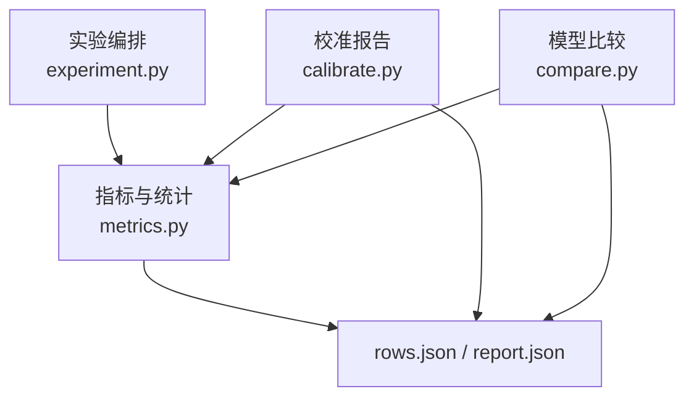
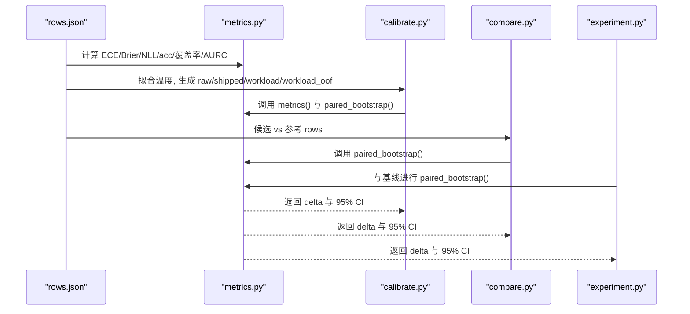
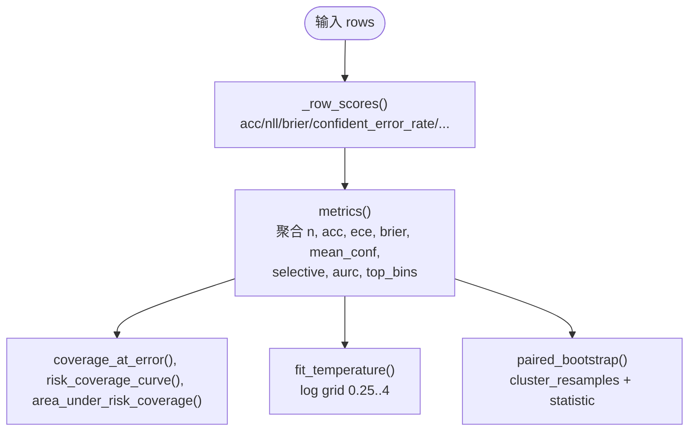
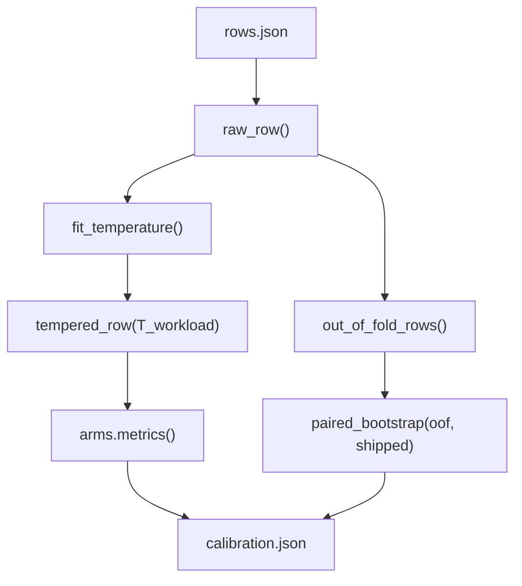
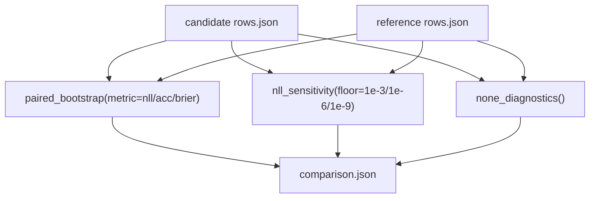
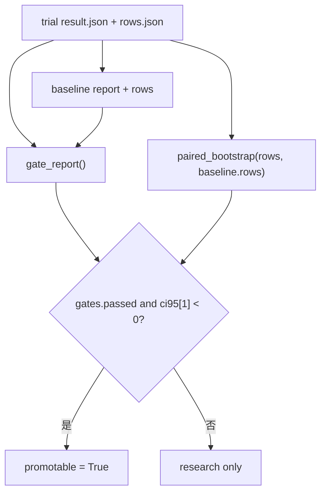
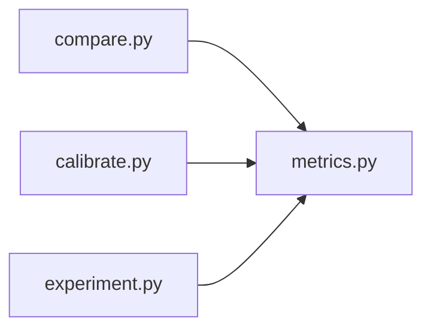
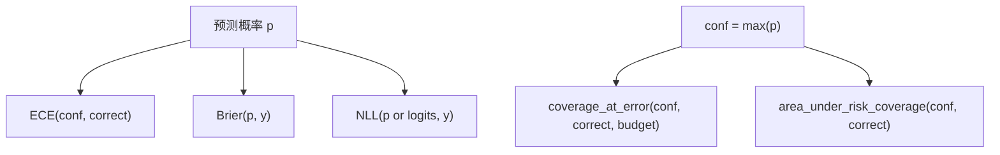
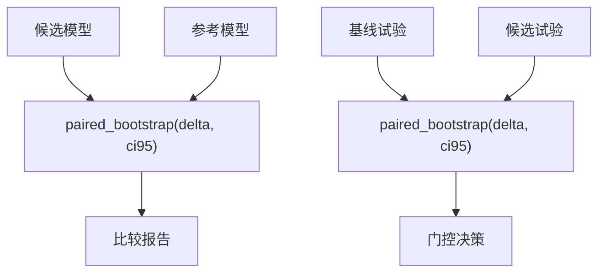
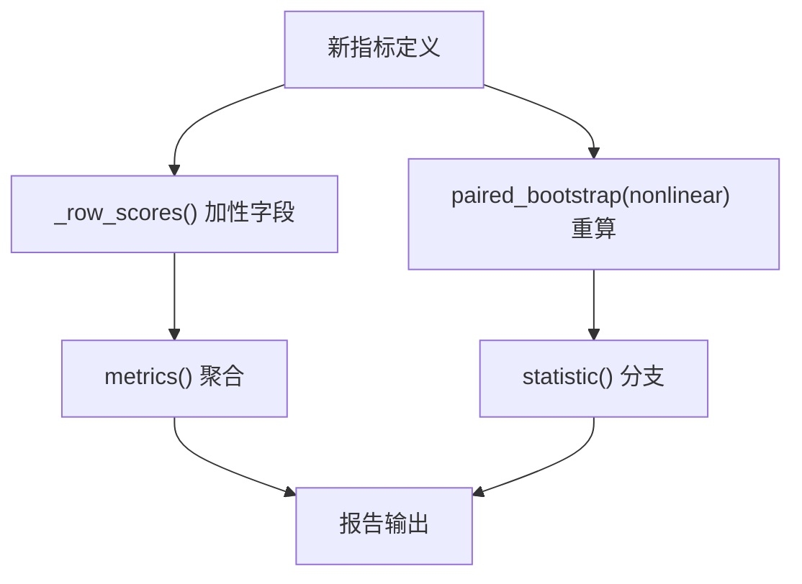

<cite>
**本文引用的文件**   
- [metrics.py](file://kev/metrics.py)
- [compare.py](file://kev/compare.py)
- [calibrate.py](file://kev/calibrate.py)
- [experiment.py](file://kev/experiment.py)
</cite>

## 目录
1. [引言](#引言)
2. [项目结构](#项目结构)
3. [核心组件](#核心组件)
4. [架构总览](#架构总览)
5. [详细组件分析](#详细组件分析)
6. [依赖关系分析](#依赖关系分析)
7. [性能与统计特性](#性能与统计特性)
8. [校准指标比较方法](#校准指标比较方法)
9. [多模型对比与分析模式](#多模型对比与分析模式)
10. [可视化建议](#可视化建议)
11. [自定义扩展指南](#自定义扩展指南)
12. [实际案例分析](#实际案例分析)
13. [问题诊断与排错](#问题诊断与排错)
14. [结论](#结论)

## 引言
本文件面向“模型性能比较分析”，聚焦以下目标：
- 使用 bootstrap 方法进行统计显著性检验，给出置信区间与假设检验思路。
- 解释 skill score、chance level、coverage-adjusted score 的计算方法与适用场景。
- 说明置信区间计算和假设检验的实现原理。
- 提供多模型对比的分析模式与可视化方法。
- 解释校准指标（ECE、Brier、NLL）的比较方法。
- 给出自定义比较指标的扩展指南。
- 包含实际案例分析和问题诊断方法。

本项目在 `kev/metrics.py` 中实现了评分、选择性预测、温度校准与记录聚类配对 bootstrap；在 `kev/calibrate.py` 中实现工作负载校准报告；在 `kev/compare.py` 中实现候选与参考模型的成对比较；在 `kev/experiment.py` 中实现研究试验的评估与基线比较流程。

## 项目结构
围绕性能比较的核心代码集中在以下模块：
- `kev/metrics.py`：指标计算、选择性预测、温度拟合、bootstrap 与交叉验证。
- `kev/calibrate.py`：基于保存的 rows.json 生成校准报告，并做 OOF vs shipped 的 bootstrap 比较。
- `kev/compare.py`：候选与参考两个模型结果的成对比较，输出 paired bootstrap 结果与 NLL floor 敏感性。
- `kev/experiment.py`：试验运行、机制检查、门控策略、与基线的 paired bootstrap 比较。

**图表来源**
- [experiment.py:314-379](file://kev/experiment.py#L314-L379)
- [calibrate.py:28-44](file://kev/calibrate.py#L28-L44)
- [compare.py:31-58](file://kev/compare.py#L31-L58)
- [metrics.py:64-100](file://kev/metrics.py#L64-L100)

**章节来源**
- [experiment.py:1-12](file://kev/experiment.py#L1-L12)
- [metrics.py:1-6](file://kev/metrics.py#L1-L6)
- [calibrate.py:1-17](file://kev/calibrate.py#L1-L17)
- [compare.py:1-11](file://kev/compare.py#L1-L11)

## 核心组件
- 指标与评分：准确率、ECE、Brier、NLL、选择性预测覆盖率、AURC、阈值选择等。
- 温度校准：按 micro/macro 平均 NLL 搜索最优温度，支持 out-of-fold 校准。
- Bootstrap 与配对比较：记录聚类的配对 bootstrap，输出 delta 与 95% CI。
- 校准报告：raw/shipped/workload/workload_oof 四臂对比，OOF vs shipped 的 bootstrap。
- 模型比较：候选 vs 参考的 paired bootstrap，NLL floor 敏感性，none_of_the_above 诊断。
- 试验编排：机制检查、门控策略、与基线的 paired bootstrap 比较。

**章节来源**
- [metrics.py:15-100](file://kev/metrics.py#L15-L100)
- [metrics.py:269-294](file://kev/metrics.py#L269-L294)
- [metrics.py:308-427](file://kev/metrics.py#L308-L427)
- [calibrate.py:28-44](file://kev/calibrate.py#L28-L44)
- [compare.py:31-58](file://kev/compare.py#L31-L58)
- [experiment.py:372-379](file://kev/experiment.py#L372-L379)

## 架构总览
下图展示从数据到报告的端到端流程：原始行数据经指标计算、温度校准、bootstrap 统计，最终形成可比较的报告。

**图表来源**
- [metrics.py:64-100](file://kev/metrics.py#L64-L100)
- [metrics.py:372-427](file://kev/metrics.py#L372-L427)
- [calibrate.py:28-44](file://kev/calibrate.py#L28-L44)
- [compare.py:31-58](file://kev/compare.py#L31-L58)
- [experiment.py:372-379](file://kev/experiment.py#L372-L379)

## 详细组件分析

### 指标与评分（metrics.py）
- ECE：按置信度分箱，加权绝对误差之和。
- Brier：概率分布与 one-hot 目标的平方误差和。
- NLL：从 logits 或概率计算负对数似然，支持温度缩放。
- 选择性预测：覆盖率、风险-覆盖曲线、AURC、阈值选择。
- 温度拟合：在 log 网格上最小化微/宏平均 NLL。
- Bootstrap：记录聚类配对 bootstrap，支持非线性指标重算。

**图表来源**
- [metrics.py:56-100](file://kev/metrics.py#L56-L100)
- [metrics.py:103-164](file://kev/metrics.py#L103-L164)
- [metrics.py:276-294](file://kev/metrics.py#L276-L294)
- [metrics.py:308-427](file://kev/metrics.py#L308-L427)

**章节来源**
- [metrics.py:15-100](file://kev/metrics.py#L15-L100)
- [metrics.py:103-164](file://kev/metrics.py#L103-L164)
- [metrics.py:269-294](file://kev/metrics.py#L269-L294)
- [metrics.py:308-427](file://kev/metrics.py#L308-L427)

### 校准报告（calibrate.py）
- 四臂对比：raw、shipped、workload、workload_oof。
- workload_oof vs shipped 的 paired bootstrap，指标包括 ECE、Brier、覆盖率（错误预算 5%）、AURC。
- 输出格式化报告，便于快速审阅。

**图表来源**
- [calibrate.py:28-44](file://kev/calibrate.py#L28-L44)
- [metrics.py:224-261](file://kev/metrics.py#L224-L261)
- [metrics.py:333-369](file://kev/metrics.py#L333-L369)

**章节来源**
- [calibrate.py:1-17](file://kev/calibrate.py#L1-L17)
- [calibrate.py:28-44](file://kev/calibrate.py#L28-L44)
- [calibrate.py:47-56](file://kev/calibrate.py#L47-L56)

### 模型比较（compare.py）
- 候选 vs 参考的 paired bootstrap，指标为 NLL、acc、Brier。
- NLL floor 敏感性：对不同 floor 值下的宏平均 NLL 进行对比。
- none_of_the_above 诊断：统计 none_present/none_absent 子集的 none 概率均值与超过 0.5 的比例。

**图表来源**
- [compare.py:13-28](file://kev/compare.py#L13-L28)
- [compare.py:31-58](file://kev/compare.py#L31-L58)
- [metrics.py:372-427](file://kev/metrics.py#L372-L427)

**章节来源**
- [compare.py:13-28](file://kev/compare.py#L13-L28)
- [compare.py:31-58](file://kev/compare.py#L31-L58)

### 试验编排与基线比较（experiment.py）
- 机制检查与门控策略：隔离性、任务准确率回归、变体准确率、置换翻转、保留集对正确率、转移 confident errors、转移准确率/Brier 不恶化。
- 与基线的 paired bootstrap：添加 gates 与 paired_comparison，决定 candidate_for_locked_test。
- 聚合阶段：以首个非 legacy trial 为基线，逐条比较并写入 results.jsonl。

**图表来源**
- [experiment.py:188-214](file://kev/experiment.py#L188-L214)
- [experiment.py:372-379](file://kev/experiment.py#L372-L379)
- [experiment.py:392-414](file://kev/experiment.py#L392-L414)

**章节来源**
- [experiment.py:161-214](file://kev/experiment.py#L161-L214)
- [experiment.py:372-379](file://kev/experiment.py#L372-L379)
- [experiment.py:392-414](file://kev/experiment.py#L392-L414)

## 依赖关系分析
- `compare.py` 依赖 `metrics.paired_bootstrap`。
- `calibrate.py` 依赖 `metrics.fit_temperature`、`metrics.out_of_fold_rows`、`metrics.paired_bootstrap`、`metrics.raw_row`、`metrics.tempered_row`、`metrics.scored_rows`。
- `experiment.py` 依赖 `metrics.fit_temperature`、`metrics.paired_bootstrap`。
- `metrics.py` 是纯 numpy 实现，无外部模型依赖，可直接对 rows.json 评分。

**图表来源**
- [compare.py:9-10](file://kev/compare.py#L9-L10)
- [calibrate.py:21-22](file://kev/calibrate.py#L21-L22)
- [experiment.py:33-36](file://kev/experiment.py#L33-L36)
- [metrics.py:1-6](file://kev/metrics.py#L1-L6)

**章节来源**
- [compare.py:1-11](file://kev/compare.py#L1-L11)
- [calibrate.py:18-23](file://kev/calibrate.py#L18-L23)
- [experiment.py:29-36](file://kev/experiment.py#L29-L36)
- [metrics.py:1-6](file://kev/metrics.py#L1-L6)

## 性能与统计特性
- 时间复杂度：
  - 指标聚合：线性于样本数。
  - 风险-覆盖曲线：排序 O(n log n)，后续线性扫描。
  - Bootstrap：每次 resample 重新计算统计量，总体复杂度约 O(samples * n)。
- 空间复杂度：
  - 主要存储 rows 与中间数组，内存占用与样本规模线性相关。
- 数值稳定性：
  - 概率裁剪 EPSILON，避免 log(0)。
  - logits 校验有限性与维度一致性。
- 分组与聚类：
  - 按 (source, group) 聚类，保证同记录兄弟题与变体一起抽样，减少方差。

**章节来源**
- [metrics.py:103-164](file://kev/metrics.py#L103-L164)
- [metrics.py:297-315](file://kev/metrics.py#L297-L315)
- [metrics.py:372-427](file://kev/metrics.py#L372-L427)

## 校准指标比较方法
- ECE（期望校准误差）：按置信度分箱，衡量预测置信度与实际准确率的偏差。
- Brier：概率分布与真实标签的均方误差，越小越好。
- NLL（负对数似然）：衡量概率质量分配，越小越好。
- 选择性预测：
  - coverage_at_error：在错误预算内最大化接受比例。
  - AURC：风险-覆盖曲线下面积，越小越稳健。
- 温度校准：
  - fit_temperature：在 log 网格上最小化微/宏平均 NLL。
  - out_of_fold_rows：组不相交折外校准，避免过拟合。

**图表来源**
- [metrics.py:15-21](file://kev/metrics.py#L15-L21)
- [metrics.py:48-53](file://kev/metrics.py#L48-L53)
- [metrics.py:64-100](file://kev/metrics.py#L64-L100)
- [metrics.py:103-146](file://kev/metrics.py#L103-L146)
- [metrics.py:276-294](file://kev/metrics.py#L276-L294)

**章节来源**
- [metrics.py:15-21](file://kev/metrics.py#L15-L21)
- [metrics.py:48-53](file://kev/metrics.py#L48-L53)
- [metrics.py:64-100](file://kev/metrics.py#L64-L100)
- [metrics.py:103-146](file://kev/metrics.py#L103-L146)
- [metrics.py:276-294](file://kev/metrics.py#L276-L294)

## 多模型对比与分析模式
- 成对比较：
  - 候选 vs 参考：使用 `paired_bootstrap` 计算 delta 与 95% CI。
  - 指标支持：nll、acc、brier，以及非线性指标如 ece、aurc、覆盖率。
- 基线比较：
  - 研究试验中，首个非 legacy trial 作为基线，其余与之比较。
  - 结合门控策略判断是否可进入锁定测试。
- 工作负载校准：
  - workload_oof vs shipped：评估部署温度与本地拟合温度的差异。

**图表来源**
- [compare.py:42-47](file://kev/compare.py#L42-L47)
- [experiment.py:372-379](file://kev/experiment.py#L372-L379)
- [metrics.py:372-427](file://kev/metrics.py#L372-L427)

**章节来源**
- [compare.py:31-58](file://kev/compare.py#L31-L58)
- [experiment.py:372-379](file://kev/experiment.py#L372-L379)
- [metrics.py:372-427](file://kev/metrics.py#L372-L427)

## 可视化建议
- 柱状图：各模型的 acc、ece、brier、nll 对比。
- 误差棒：bootstrap 的 95% CI 显示在 delta 上。
- 风险-覆盖曲线：不同模型的 AURC 与曲线形态。
- 热力图：不同长度桶的 calibration_by_length 指标。
- 散点图：confidence vs accuracy，观察 over/under-confidence。

（本节为概念性建议，不直接分析具体文件）

## 自定义扩展指南
- 新增指标：
  - 若指标可分解为 per-question 加性项，可在 `_row_scores` 中添加字段，并在 `metrics()` 中聚合。
  - 若为非线性指标，需在 `paired_bootstrap` 的 nonlinear 集合中添加，以便在每次 resample 中重算。
- 自定义聚合：
  - 支持 micro/macro 两种聚合方式，macro 会按 task 分组后取均值。
- 自定义 bootstrap 统计：
  - 在 `statistic` 函数中添加分支，处理新的非线性指标。
- 自定义阈值与选择性预测：
  - 使用 `select_threshold` 与 `evaluate_threshold` 定制阈值策略。

**图表来源**
- [metrics.py:56-100](file://kev/metrics.py#L56-L100)
- [metrics.py:372-427](file://kev/metrics.py#L372-L427)

**章节来源**
- [metrics.py:56-100](file://kev/metrics.py#L56-L100)
- [metrics.py:372-427](file://kev/metrics.py#L372-L427)

## 实际案例分析
- 案例一：工作负载校准
  - 输入：某模型的 rows.json。
  - 步骤：raw → fit_temperature → workload → workload_oof → paired_bootstrap(oof vs shipped)。
  - 输出：calibration.json，包含四臂指标与 OOF vs shipped 的 delta 与 CI。
- 案例二：候选 vs 参考比较
  - 输入：候选与参考的 rows.json。
  - 步骤：paired_bootstrap(nll/acc/brier)、nll floor 敏感性、none_of_the_above 诊断。
  - 输出：comparison.json，含 paired 结果与诊断信息。
- 案例三：研究试验与基线比较
  - 输入：试验 result.json 与 rows.json。
  - 步骤：机制检查、门控策略、paired_bootstrap(rows, baseline.rows)。
  - 输出：comparison.json，含 gates 与 paired_comparison。

**章节来源**
- [calibrate.py:28-44](file://kev/calibrate.py#L28-L44)
- [compare.py:31-58](file://kev/compare.py#L31-L58)
- [experiment.py:372-379](file://kev/experiment.py#L372-L379)

## 问题诊断与排错
- 常见错误：
  - 空 population：无法对空 rows 评分。
  - 无效温度：温度必须为正且有限。
  - logits 不一致：logits 维度与选项数不一致。
  - 配对比较键不一致：候选与参考的 id/question 必须完全一致。
  - 配对比较元数据不一致：source/group/task/type 必须一致。
- 排查建议：
  - 检查 rows.json 的 variant 与 source 过滤逻辑。
  - 确认 logits 与 inference_temperature 的记录完整性。
  - 核对候选与参考的 suite_sha256 是否匹配。

**章节来源**
- [metrics.py:64-66](file://kev/metrics.py#L64-L66)
- [metrics.py:24-36](file://kev/metrics.py#L24-L36)
- [metrics.py:378-397](file://kev/metrics.py#L378-L397)
- [compare.py:39-40](file://kev/compare.py#L39-L40)

## 结论
本项目提供了完整的模型性能比较分析工具链：
- 指标计算与选择性预测。
- 温度校准与 OOF 评估。
- 记录聚类配对 bootstrap，提供稳健的置信区间与显著性检验。
- 多模型对比与工作负载校准报告。
- 可扩展的指标与统计框架，支持自定义分析与可视化。

通过合理运用这些工具，可以在严格的统计基础上进行模型比较，确保结论的可靠性与可复现性。