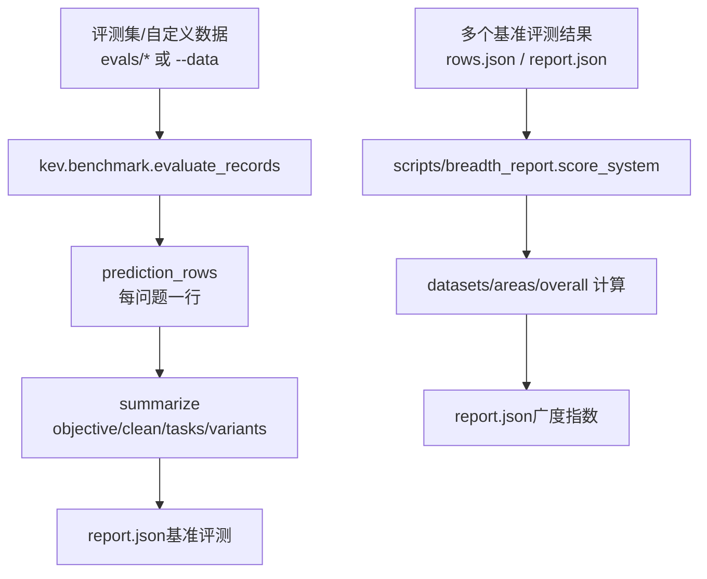
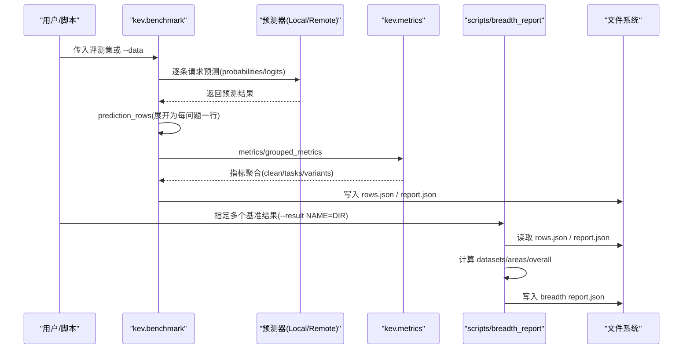
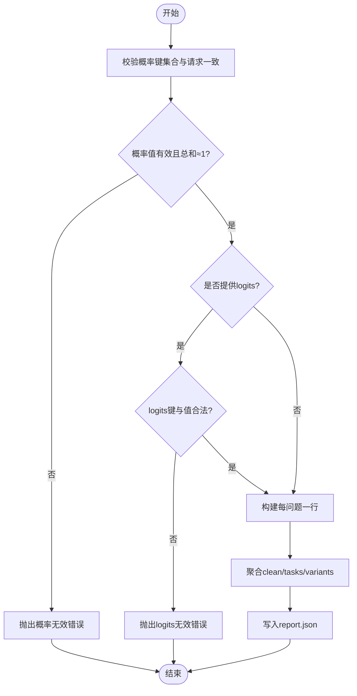
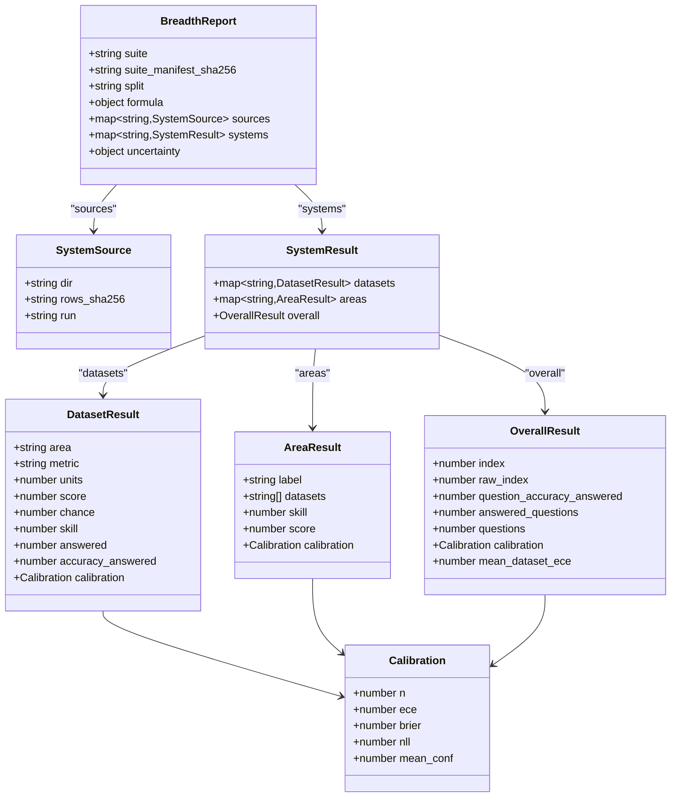

<cite>
**本文引用的文件**   
- [kev/benchmark.py](file://kev/benchmark.py)
- [scripts/breadth_report.py](file://scripts/breadth_report.py)
- [runs/breadth-v1-report/report.json](file://runs/breadth-v1-report/report.json)
- [runs/calibration-audit-v1/report.json](file://runs/calibration-audit-v1/report.json)
</cite>

## 目录
1. [引言](#引言)
2. [项目结构](#项目结构)
3. [核心组件](#核心组件)
4. [架构总览](#架构总览)
5. [详细组件分析](#详细组件分析)
6. [依赖关系分析](#依赖关系分析)
7. [性能与约束](#性能与约束)
8. [故障排查指南](#故障排查指南)
9. [结论](#结论)
10. [附录：JSON Schema](#附录json-schema)

## 引言
本文件系统化说明 Kev 评估产出的两类报告数据结构：
- 基准评测报告（由 kev.benchmark 生成）：用于对模型在任务级、变体级和整体层面的准确率、校准度、覆盖率和延迟进行度量，并输出 objective、clean、tasks、variants、calibration 等关键字段。
- 广度指数报告（由 scripts/breadth_report.py 生成）：基于多个系统在各数据集上的表现，计算技能得分、区域聚合与总体指数，包含 datasets、areas、overall 等嵌套结构。

文档将给出字段类型、含义、约束、数据流向、不同场景下的结构差异，并提供完整的 JSON Schema 定义，便于校验与对接下游工具。

## 项目结构
Kev 的评测与报告涉及两条主要路径：
- 基准评测路径：读取评测集或自定义数据，调用预测器得到概率/日志概率，按问题粒度展开为行，汇总为 report.json。
- 广度指数路径：读取多个基准评测结果（rows.json 与可选 report.json），结合 manifest 中的数据集/区域定义，计算技能、区域与总体指标，输出新的 report.json。



图表来源
- [kev/benchmark.py:124-167](file://kev/benchmark.py#L124-L167)
- [scripts/breadth_report.py:112-136](file://scripts/breadth_report.py#L112-L136)

章节来源
- [kev/benchmark.py:1-215](file://kev/benchmark.py#L1-L215)
- [scripts/breadth_report.py:1-200](file://scripts/breadth_report.py#L1-L200)

## 核心组件
- 基准评测报告（benchmark.report.json）
  - 顶层关键字段：objective、clean、tasks、variants、coverage、latency_ms、calibration、metric_policy、permutation、heldout_tasks、long_rows、suite_sha256、split、run、remote、environment、date_facts、rotations、calibration_applied 等。
  - 关键子对象：
    - clean：针对“clean”变体的整体指标（acc、nll、ece、brier、mean_conf、confident_error_rate、coverage_at_*、aurc、error_rate_at_0_9、confidence_bias、top_bins、selective、score_mae、ranked_probability_score）。
    - tasks：按 task 维度分组的指标字典。
    - variants：按 variant 维度分组的指标字典。
    - calibration：校准相关元信息（inference_temperature、additional_temperature、logits_recorded）。
    - metric_policy：指标版本与计算约定（version=2）。
- 广度指数报告（breadth report.json）
  - 顶层关键字段：suite、suite_manifest_sha256、split、formula、sources、systems、uncertainty。
  - systems 下每个系统包含：datasets、areas、overall。
  - datasets 中每个数据集包含：area、metric、units、score、chance、skill、answered、accuracy_answered、calibration。
  - areas 中每个区域包含：label、datasets、skill、score、calibration。
  - overall 包含：index、raw_index、question_accuracy_answered、answered_questions、questions、calibration、mean_dataset_ece。

章节来源
- [kev/benchmark.py:73-103](file://kev/benchmark.py#L73-L103)
- [scripts/breadth_report.py:112-136](file://scripts/breadth_report.py#L112-L136)
- [runs/breadth-v1-report/report.json:1-380](file://runs/breadth-v1-report/report.json#L1-L380)
- [runs/calibration-audit-v1/report.json:1-120](file://runs/calibration-audit-v1/report.json#L1-L120)

## 架构总览
下图展示从输入到报告的端到端流程，以及两类报告之间的数据依赖。



图表来源
- [kev/benchmark.py:106-167](file://kev/benchmark.py#L106-L167)
- [scripts/breadth_report.py:160-195](file://scripts/breadth_report.py#L160-L195)

## 详细组件分析

### 基准评测报告（benchmark.report.json）
- 顶层字段
  - objective：标量，负平均 NLL（排除 unknowable 控制项），用于优化目标。
  - coverage：记录请求/评估/拒绝/截断数量，保障可解释性。
  - latency_ms：中位数与 P95 延迟。
  - calibration：校准元信息（推理温度、附加温度、是否记录 logits）。
  - metric_policy：指标版本与计算约定（version=2）。
  - permutation：选项顺序扰动统计（翻转率、最大差均值）。
  - heldout_tasks：未训练源的任务指标（可选）。
  - long_rows：长行使用高效核的统计（可选）。
  - suite_sha256/split/run/remote/environment/date_facts/rotations/calibration_applied：运行与环境元数据。
- clean/tasks/variants
  - 均包含 n、acc、nll、ece、brier、mean_conf、confident_error_rate、coverage_at_0_9、accuracy_at_0_9、coverage_at_5pct_error、coverage_at_1pct_error、aurc、error_rate_at_0_9、confidence_bias、top_bins、selective、score_mae、ranked_probability_score。
  - tasks 以 task 键索引；variants 以 variant 键索引。
- 约束与验证
  - 概率分布必须匹配请求选项键集合，值需有限且在 [0,1]，总和接近 1（允许微小误差）。
  - 若提供 logits，键集合与值合法性同样被检查。
  - 答案 ID 集合必须与请求一致。



图表来源
- [kev/benchmark.py:36-70](file://kev/benchmark.py#L36-L70)
- [kev/benchmark.py:73-103](file://kev/benchmark.py#L73-L103)

章节来源
- [kev/benchmark.py:36-103](file://kev/benchmark.py#L36-L103)
- [runs/calibration-audit-v1/report.json:1-120](file://runs/calibration-audit-v1/report.json#L1-L120)

### 广度指数报告（breadth report.json）
- 顶层字段
  - suite：评测套件路径。
  - suite_manifest_sha256：manifest 摘要。
  - split：分区（development/test）。
  - formula：评分公式说明（helper、metrics、chance、skill、calibration）。
  - sources：各系统的来源目录、rows_sha256、run 标识。
  - systems：每个系统的 datasets/areas/overall。
  - uncertainty：可选的配对记录聚类 Bootstrap 置信区间。
- datasets（每个数据集）
  - area：所属区域。
  - metric：指标类型（accuracy 或 case_exact）。
  - units：单位数（问题数或记录数）。
  - score：覆盖率调整后的得分。
  - chance：随机期望得分。
  - skill：机会校正技能得分（clip((score-chance)/(1-chance))）。
  - answered：已回答比例。
  - accuracy_answered：已回答样本的正确率。
  - calibration：ECE/Brier/NLL/mean_conf/n。
- areas（每个区域）
  - label：人类可读标签。
  - datasets：该区域包含的数据集名列表。
  - skill：区域内数据集技能的算术平均。
  - score：区域内数据集得分的算术平均。
  - calibration：区域池化行的校准指标。
- overall（总体）
  - index：100 × 五区域技能均值（Decision Index 风格）。
  - raw_index：100 × 五区域原始得分均值。
  - question_accuracy_answered：所有已回答问题的正确率。
  - answered_questions/questions：已回答问题数与总问题数。
  - calibration：总体池化行的校准指标。
  - mean_dataset_ece：数据集 ECE 的平均值。



图表来源
- [scripts/breadth_report.py:112-136](file://scripts/breadth_report.py#L112-L136)
- [runs/breadth-v1-report/report.json:1-380](file://runs/breadth-v1-report/report.json#L1-L380)

章节来源
- [scripts/breadth_report.py:112-136](file://scripts/breadth_report.py#L112-L136)
- [runs/breadth-v1-report/report.json:1-380](file://runs/breadth-v1-report/report.json#L1-L380)

### 不同评估场景下的报告结构差异
- 基准评测报告（decision/hard/devtools/longdoc 等）
  - 关注任务级与变体级指标，强调校准与选择性覆盖（top_bins/selective）、风险-覆盖曲线（aurc/confident_error_rate）。
  - 典型字段：objective、clean、tasks、variants、coverage、latency_ms、calibration、metric_policy、permutation、heldout_tasks、long_rows。
- 广度指数报告（breadth-v1）
  - 关注跨数据集的技能与区域聚合，输出 index/raw_index 与 mean_dataset_ece。
  - 典型字段：suite、formula、sources、systems.datasets/areas/overall、uncertainty。
- 校准审计报告（calibration-audit-v1）
  - 侧重模型级校准与选择性指标，包含 temperature、raw.temperature_replay、micro/tasks 等多层级指标。
  - 典型字段：metric_version、suite_sha256、models.<name>.temperature、raw、temperature_replay。

章节来源
- [runs/calibration-audit-v1/report.json:1-120](file://runs/calibration-audit-v1/report.json#L1-L120)
- [runs/breadth-v1-report/report.json:1-380](file://runs/breadth-v1-report/report.json#L1-L380)

## 依赖关系分析
- 数据流向
  - 基准评测：records → prediction_rows → summarize → report.json。
  - 广度指数：多个 benchmark 结果的 rows.json → score_system → datasets/areas/overall → report.json。
- 组件耦合
  - benchmark.py 依赖 kev.metrics 与 kev.suite；breadth_report.py 复用 benchmark.labels 与 metrics。
  - 两者通过 rows.json 解耦，便于多系统横向比较。
- 外部依赖
  - 预测器可为本地或远程；远程模式会附带 remote 元信息（base_url、requested_model、served_model、concurrency）。


图表来源
- [kev/benchmark.py:124-167](file://kev/benchmark.py#L124-L167)
- [scripts/breadth_report.py:160-195](file://scripts/breadth_report.py#L160-L195)

章节来源
- [kev/benchmark.py:124-167](file://kev/benchmark.py#L124-L167)
- [scripts/breadth_report.py:160-195](file://scripts/breadth_report.py#L160-L195)

## 性能与约束
- 概率与分布约束
  - 概率键集合必须与请求选项完全一致。
  - 概率值需有限且在 [0,1]，总和需在容差范围内等于 1。
  - 若提供 logits，键集合与值合法性同样受检。
- 覆盖率与拒绝
  - 上下文溢出或异常时，记录 rejected/truncated 数量，必要时写入 failure.json。
- 长行处理
  - 当单行超过阈值时，可能走高效注意力核，并在 report.json 中记录 long_rows（count/records/kernels/threshold）。
- 延迟统计
  - 报告包含中位数与 P95 延迟，便于性能对比。

章节来源
- [kev/benchmark.py:36-70](file://kev/benchmark.py#L36-L70)
- [kev/benchmark.py:124-167](file://kev/benchmark.py#L124-L167)

## 故障排查指南
- 概率键不匹配
  - 现象：报错提示概率键与请求不一致。
  - 排查：确认预测器返回的概率键与评测问题选项键一致。
- 概率值非法或总和不等于 1
  - 现象：报错提示非有限值、越界或总和异常。
  - 排查：检查数值范围与归一化逻辑；注意浮点容差。
- 答案 ID 不一致
  - 现象：报错提示答案 ID 与请求不一致。
  - 排查：确保 prediction["probabilities"] 的键集合与 record["questions"] 一致。
- 上下文溢出
  - 现象：记录被拒绝，failure.json 出现 ContextOverflow。
  - 排查：缩短输入或使用 skip_overlong（仅适用于外部数据）。
- 远程调用失败
  - 现象：remote 模式下连接或模型名称错误。
  - 排查：核对 base_url、requested_model、served_model 与并发参数。

章节来源
- [kev/benchmark.py:36-70](file://kev/benchmark.py#L36-L70)
- [kev/benchmark.py:124-167](file://kev/benchmark.py#L124-L167)

## 结论
- 基准评测报告提供任务级与变体级的全面指标，强调校准与选择性覆盖，适合模型能力与可靠性诊断。
- 广度指数报告聚焦跨数据集的技能与区域聚合，提供 Decision Index 风格的综合排名与不确定性估计。
- 两类报告通过 rows.json 解耦，既支持独立评测，也支持横向比较与二次加工。
- 建议在消费端严格校验概率分布与键集合，并结合 coverage/long_rows 等元信息进行结果解读。

## 附录：JSON Schema
以下 Schema 描述两类报告的核心结构，供校验与集成使用。

### 基准评测报告 Schema
```json
{
  "$schema": "http://json-schema.org/draft-07/schema#",
  "type": "object",
  "required": ["objective", "clean", "tasks", "variants", "coverage", "latency_ms", "calibration", "metric_policy"],
  "properties": {
    "objective": {"type": "number"},
    "clean": {
      "type": "object",
      "required": ["n", "acc", "nll", "ece", "brier", "mean_conf", "confident_error_rate", "coverage_at_0_9", "accuracy_at_0_9", "coverage_at_5pct_error", "coverage_at_1pct_error", "aurc", "error_rate_at_0_9", "confidence_bias", "top_bins", "selective"],
      "properties": {
        "n": {"type": "number"},
        "acc": {"type": "number"},
        "nll": {"type": "number"},
        "ece": {"type": "number"},
        "brier": {"type": "number"},
        "mean_conf": {"type": "number"},
        "confident_error_rate": {"type": "number"},
        "coverage_at_0_9": {"type": "number"},
        "accuracy_at_0_9": {"type": "number"},
        "coverage_at_5pct_error": {"type": "number"},
        "coverage_at_1pct_error": {"type": "number"},
        "aurc": {"type": "number"},
        "error_rate_at_0_9": {"type": "number"},
        "confidence_bias": {"type": "number"},
        "top_bins": {
          "type": "object",
          "patternProperties": {"^[0-9.]+$": {"type": "object", "required": ["n", "errors", "error_rate"], "properties": {"n": {"type": "number"}, "errors": {"type": "number"}, "error_rate": {"type": "number"}}}}
        },
        "selective": {
          "type": "object",
          "patternProperties": {"^[0-9.]+$": {"type": "object", "required": ["coverage", "accuracy", "confidence_cutoff"], "properties": {"coverage": {"type": "number"}, "accuracy": {"type": "number"}, "confidence_cutoff": {"type": "number"}}}}
        },
        "score_mae": {"type": "number"},
        "ranked_probability_score": {"type": "number"}
      }
    },
    "tasks": {"type": "object", "additionalProperties": true},
    "variants": {"type": "object", "additionalProperties": true},
    "coverage": {
      "type": "object",
      "required": ["requested_records", "requested_questions", "evaluated_records", "evaluated_questions", "rejected_records", "truncated_records"],
      "properties": {
        "requested_records": {"type": "number"},
        "requested_questions": {"type": "number"},
        "evaluated_records": {"type": "number"},
        "evaluated_questions": {"type": "number"},
        "rejected_records": {"type": "number"},
        "truncated_records": {"type": "number"}
      }
    },
    "latency_ms": {
      "type": "object",
      "required": ["median", "p95"],
      "properties": {"median": {"type": "number"}, "p95": {"type": "number"}}
    },
    "calibration": {
      "type": "object",
      "properties": {
        "inference_temperature": {"type": ["number", "null"]},
        "additional_temperature": {"type": "number"},
        "logits_recorded": {"type": "boolean"}
      }
    },
    "metric_policy": {
      "type": "object",
      "required": ["version"],
      "properties": {
        "version": {"type": "number"},
        "selective_ties": {"type": "string"},
        "coverage_at_error": {"type": "string"},
        "aurc": {"type": "string"},
        "confident_error_rate": {"type": "string"},
        "error_rate_at_0_9": {"type": "string"},
        "nll": {"type": "string"},
        "nll_floor": {"type": "number"},
        "renormalize_returned_probabilities": {"type": "boolean"},
        "raw_sums_outside_1e_5": {"type": "number"},
        "returned_zeros": {"type": "number"}
      }
    },
    "permutation": {
      "type": "object",
      "properties": {
        "n": {"type": "number"},
        "mean_max_delta": {"type": ["number", "null"]},
        "flip_rate": {"type": ["number", "null"]}
      }
    },
    "heldout_tasks": {"type": "object"},
    "long_rows": {
      "type": "object",
      "properties": {
        "count": {"type": "number"},
        "records": {"type": "number"},
        "kernels": {"type": "array", "items": {"type": "string"}},
        "threshold": {"type": "number"}
      }
    },
    "suite_sha256": {"type": "string"},
    "split": {"type": "string"},
    "run": {"type": "string"},
    "remote": {
      "type": ["object", "null"],
      "properties": {
        "base_url": {"type": "string"},
        "requested_model": {"type": "string"},
        "served_model": {"type": "string"},
        "concurrency": {"type": "number"}
      }
    },
    "environment": {"type": ["string", "null"]},
    "date_facts": {"type": "boolean"},
    "rotations": {"type": "number"},
    "calibration_applied": {"type": ["boolean", "null"]}
  }
}
```

### 广度指数报告 Schema
```json
{
  "$schema": "http://json-schema.org/draft-07/schema#",
  "type": "object",
  "required": ["suite", "suite_manifest_sha256", "split", "formula", "sources", "systems"],
  "properties": {
    "suite": {"type": "string"},
    "suite_manifest_sha256": {"type": "string"},
    "split": {"type": "string"},
    "formula": {
      "type": "object",
      "properties": {
        "helper": {"type": "string"},
        "metrics": {"type": "object"},
        "chance": {"type": "string"},
        "skill": {"type": "string"},
        "calibration": {"type": "string"}
      }
    },
    "sources": {
      "type": "object",
      "additionalProperties": {
        "type": "object",
        "required": ["dir", "rows_sha256"],
        "properties": {
          "dir": {"type": "string"},
          "rows_sha256": {"type": "string"},
          "run": {"type": ["string", "null"]}
        }
      }
    },
    "systems": {
      "type": "object",
      "additionalProperties": {
        "type": "object",
        "required": ["datasets", "areas", "overall"],
        "properties": {
          "datasets": {
            "type": "object",
            "additionalProperties": {
              "type": "object",
              "required": ["area", "metric", "units", "score", "chance", "skill", "answered", "accuracy_answered", "calibration"],
              "properties": {
                "area": {"type": "string"},
                "metric": {"type": "string"},
                "units": {"type": "number"},
                "score": {"type": "number"},
                "chance": {"type": "number"},
                "skill": {"type": "number"},
                "answered": {"type": "number"},
                "accuracy_answered": {"type": ["number", "null"]},
                "calibration": {
                  "type": "object",
                  "required": ["n", "ece", "brier", "nll", "mean_conf"],
                  "properties": {
                    "n": {"type": "number"},
                    "ece": {"type": "number"},
                    "brier": {"type": "number"},
                    "nll": {"type": "number"},
                    "mean_conf": {"type": "number"}
                  }
                }
              }
            }
          },
          "areas": {
            "type": "object",
            "additionalProperties": {
              "type": "object",
              "required": ["label", "datasets", "skill", "score", "calibration"],
              "properties": {
                "label": {"type": "string"},
                "datasets": {"type": "array", "items": {"type": "string"}},
                "skill": {"type": "number"},
                "score": {"type": "number"},
                "calibration": {
                  "type": "object",
                  "required": ["n", "ece", "brier", "nll", "mean_conf"],
                  "properties": {
                    "n": {"type": "number"},
                    "ece": {"type": "number"},
                    "brier": {"type": "number"},
                    "nll": {"type": "number"},
                    "mean_conf": {"type": "number"}
                  }
                }
              }
            }
          },
          "overall": {
            "type": "object",
            "required": ["index", "raw_index", "question_accuracy_answered", "answered_questions", "questions", "calibration", "mean_dataset_ece"],
            "properties": {
              "index": {"type": "number"},
              "raw_index": {"type": "number"},
              "question_accuracy_answered": {"type": ["number", "null"]},
              "answered_questions": {"type": "number"},
              "questions": {"type": "number"},
              "calibration": {
                "type": "object",
                "required": ["n", "ece", "brier", "nll", "mean_conf"],
                "properties": {
                  "n": {"type": "number"},
                  "ece": {"type": "number"},
                  "brier": {"type": "number"},
                  "nll": {"type": "number"},
                  "mean_conf": {"type": "number"}
                }
              },
              "mean_dataset_ece": {"type": ["number", "null"]}
            }
          }
        }
      }
    },
    "uncertainty": {
      "type": ["object", "null"],
      "properties": {
        "samples": {"type": "number"},
        "seed": {"type": "number"},
        "unit": {"type": "string"},
        "index": {"type": "object"},
        "difference_from": {"type": "string"},
        "difference": {"type": "object"}
      }
    }
  }
}
```