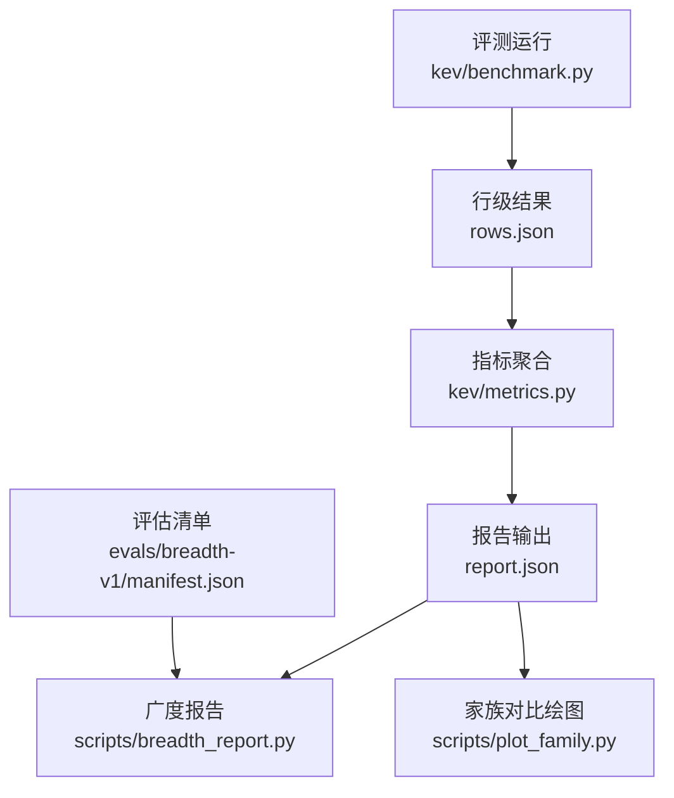
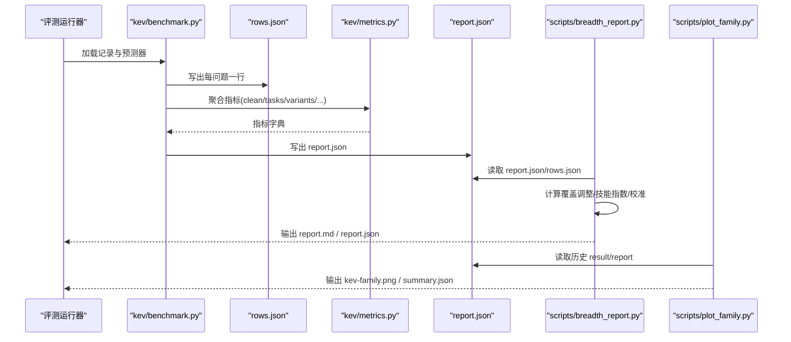
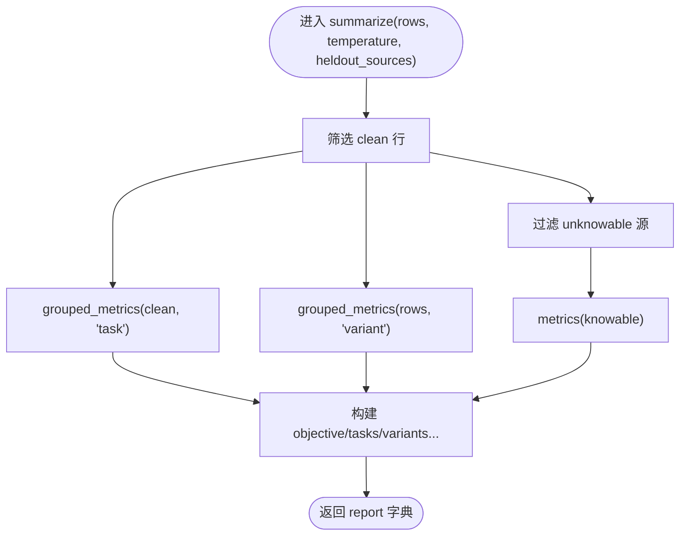
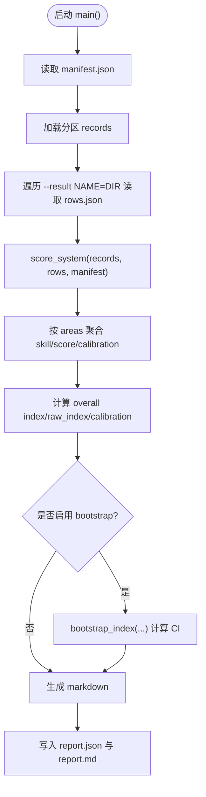
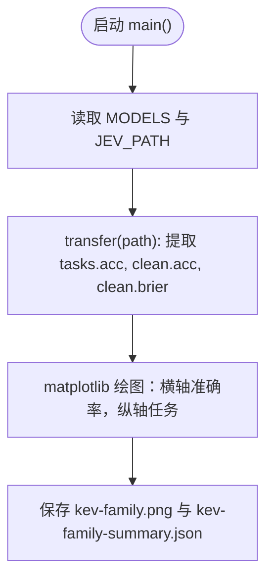
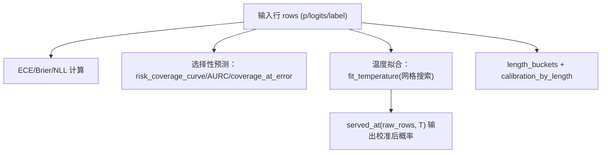
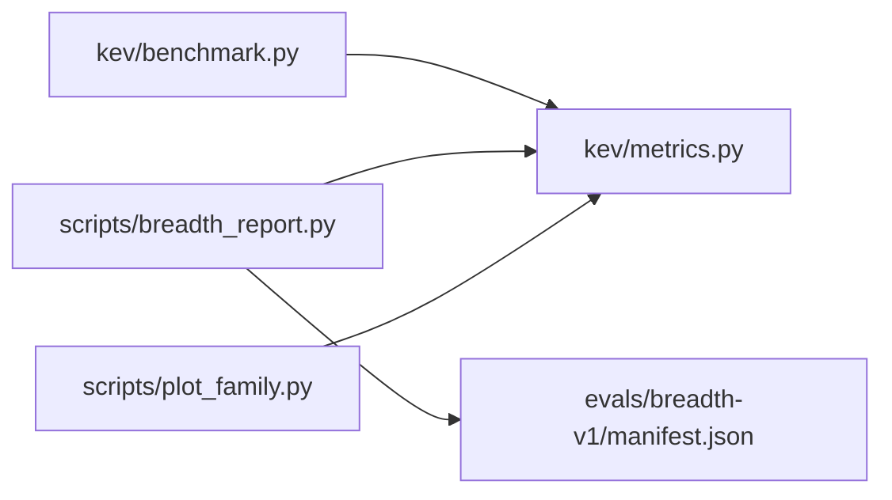

<cite>
**本文引用的文件**   
- [breadth_report.py](file://scripts/breadth_report.py)
- [plot_family.py](file://scripts/plot_family.py)
- [benchmark.py](file://kev/benchmark.py)
- [metrics.py](file://kev/metrics.py)
- [manifest.json](file://evals/breadth-v1/manifest.json)
</cite>

## 目录
1. [简介](#简介)
2. [项目结构](#项目结构)
3. [核心组件](#核心组件)
4. [架构总览](#架构总览)
5. [详细组件分析](#详细组件分析)
6. [依赖关系分析](#依赖关系分析)
7. [性能与可解释性考量](#性能与可解释性考量)
8. [故障排查指南](#故障排查指南)
9. [结论](#结论)
10. [附录](#附录)

## 简介
本文件面向 Kev 评估结果的“分析与可视化”工作流，聚焦以下目标：
- 解读 report.json 的完整结构（objective、clean、tasks、variants、calibration 等关键字段）
- 使用脚本工具进行结果分析：breadth_report.py 用于广度评估报告；plot_family.py 用于模型家族对比
- 模型比较方法：性能差异统计、显著性检验（配对聚类重抽样）
- 校准曲线绘制与分析方法（ECE、Brier、NLL、选择性预测）
- 常见分析模式：按任务类型分解、按置信度区间分析、时间序列趋势分析
- 自定义分析脚本开发指南与 Jupyter Notebook 交互式分析实践
- 结果解读最佳实践与常见陷阱

## 项目结构
Kev 的结果分析与可视化围绕“评测运行 → 行级结果 → 指标聚合 → 报告与图表”展开。关键路径如下：
- 评测运行：kev.benchmark 将预测转换为 rows.json，并生成 report.json
- 指标计算：kev.metrics 提供准确率、校准（ECE/Brier/NLL）、选择性预测、温度拟合、Bootstrap 等
- 广度报告：scripts/breadth_report.py 基于 evals/breadth-v1/manifest.json 计算覆盖调整后的技能指数、区域汇总与整体 ECE
- 家族对比：scripts/plot_family.py 读取历史 result/report 文件，绘制 Kev 家族与 Jev 在 OOD 任务上的对比图

**图示来源**
- [benchmark.py:124-168](file://kev/benchmark.py#L124-L168)
- [metrics.py:64-100](file://kev/metrics.py#L64-L100)
- [breadth_report.py:160-195](file://scripts/breadth_report.py#L160-L195)
- [plot_family.py:31-70](file://scripts/plot_family.py#L31-L70)
- [manifest.json:83-123](file://evals/breadth-v1/manifest.json#L83-L123)

**章节来源**
- [benchmark.py:124-168](file://kev/benchmark.py#L124-L168)
- [metrics.py:64-100](file://kev/metrics.py#L64-L100)
- [breadth_report.py:160-195](file://scripts/breadth_report.py#L160-L195)
- [plot_family.py:31-70](file://scripts/plot_family.py#L31-L70)
- [manifest.json:83-123](file://evals/breadth-v1/manifest.json#L83-L123)

## 核心组件
- 评测与报告生成（kev/benchmark.py）
  - 将每条预测展开为“问题级行”，写入 rows.json
  - 汇总 clean/tasks/variants/heldout_tasks/permutation 等指标，写入 report.json
- 指标与校准（kev/metrics.py）
  - 准确率、ECE、Brier、NLL、选择性预测（覆盖率-风险曲线、AURC、阈值选择）
  - 温度拟合、交叉验证温度、配对 Bootstrap、长度分桶校准
- 广度评估报告（scripts/breadth_report.py）
  - 基于 manifest.json 的区域划分与数据集指标
  - 覆盖调整得分、机会水平、技能指数（clip((score-chance)/(1-chance))）
  - 整体决策指数（Decision Index 0.2 风格），以及 ECE/Brier/NLL 校准
  - 可选配对记录聚类 Bootstrap 给出指数置信区间
- 模型家族对比（scripts/plot_family.py）
  - 从历史 result/report 中抽取任务准确率与整体 Brier
  - 绘制 Kev 家族 vs Jev 在冻结 OOD 套件上的横向对比图

**章节来源**
- [benchmark.py:73-103](file://kev/benchmark.py#L73-L103)
- [metrics.py:64-100](file://kev/metrics.py#L64-L100)
- [breadth_report.py:28-34](file://scripts/breadth_report.py#L28-L34)
- [breadth_report.py:112-136](file://scripts/breadth_report.py#L112-L136)
- [plot_family.py:25-29](file://scripts/plot_family.py#L25-L29)

## 架构总览
下图展示从原始预测到最终报告与可视化的端到端流程，包括关键数据结构与处理逻辑。

**图示来源**
- [benchmark.py:124-168](file://kev/benchmark.py#L124-L168)
- [metrics.py:64-100](file://kev/metrics.py#L64-L100)
- [breadth_report.py:160-195](file://scripts/breadth_report.py#L160-L195)
- [plot_family.py:31-70](file://scripts/plot_family.py#L31-L70)

## 详细组件分析

### report.json 结构详解（基于 benchmark.py）
- objective: 负宏平均 clean 开发集 NLL（按任务等权），反映总体对数损失
- clean: 已知样本（source≠unknowable）的 metrics 聚合（acc、ece、brier、nll、mean_conf、选择性预测指标等）
- tasks: 按 task 字段分组的 metrics（如 mmlu、paws、qnli 等）
- variants: 按 variant 字段分组（clean、permuted 等）的 metrics
- heldout_tasks: 未训练源的任务子集指标（由 manifest.holdout_sources 决定）
- permutation: 选项轮换扰动下的最大概率差均值与翻转率
- temperature: 评分时使用的温度（默认 1.0）
- calibrated_clean: 应用额外温度后的 clean 指标
- metric_policy: 指标策略说明（含 NLL 地板值、是否重归一化返回概率等）
- coverage/latency_ms/calibration: 覆盖率、延迟分布、校准元信息（inference_temperature、logits_recorded 等）

**图示来源**
- [benchmark.py:73-103](file://kev/benchmark.py#L73-L103)

**章节来源**
- [benchmark.py:73-103](file://kev/benchmark.py#L73-L103)

### breadth_report.py：广度评估报告
- 输入：suite 清单（evals/breadth-v1/manifest.json）、系统结果目录（rows.json + 可选 report.json）
- 关键步骤：
  - 按数据集计算 score/chance/skill/answered/accuracy_answered
  - 按 area 汇总 skill/score 与 pooled calibration（ECE/Brier/NLL/mean_conf）
  - 整体 index = 100 × 各 area skill 均值；raw_index = 100 × 各 area score 均值
  - 支持配对记录聚类 Bootstrap 计算 index 的 95% CI 与相对差 CI
- 输出：report.json（含 suite、sources、systems、uncertainty）与 report.md

**图示来源**
- [breadth_report.py:160-195](file://scripts/breadth_report.py#L160-L195)
- [breadth_report.py:112-136](file://scripts/breadth_report.py#L112-L136)
- [breadth_report.py:79-103](file://scripts/breadth_report.py#L79-L103)

**章节来源**
- [breadth_report.py:28-34](file://scripts/breadth_report.py#L28-L34)
- [breadth_report.py:41-64](file://scripts/breadth_report.py#L41-L64)
- [breadth_report.py:79-103](file://scripts/breadth_report.py#L79-L103)
- [breadth_report.py:112-136](file://scripts/breadth_report.py#L112-L136)
- [breadth_report.py:160-195](file://scripts/breadth_report.py#L160-L195)

### plot_family.py：模型家族对比
- 读取历史 result/report 文件（development 分区），提取每个任务的准确率与整体 acc/brier
- 绘制横向条形/散点图，标注 Kev 各版本与 Jev 的差距与接近点
- 输出图片与摘要 JSON（models/jev 的任务准确率与整体指标）

**图示来源**
- [plot_family.py:25-29](file://scripts/plot_family.py#L25-L29)
- [plot_family.py:31-70](file://scripts/plot_family.py#L31-L70)

**章节来源**
- [plot_family.py:25-29](file://scripts/plot_family.py#L25-L29)
- [plot_family.py:31-70](file://scripts/plot_family.py#L31-L70)

### 模型比较方法与显著性检验
- 性能差异统计：
  - 直接比较 clean.tasks 或 breadth_report 的 dataset/area/overall skill/index
  - 选择性预测视角：coverage_at_5pct_error、aurc、error_rate_at_0_9
- 显著性检验（配对 Bootstrap）：
  - metrics.paired_bootstrap：以“源-组”为单位的重抽样，计算指标差值的 95% CI
  - breadth_report.bootstrap_index：按数据集内记录聚类的配对重抽样，估计 index 及其差值的 CI
- 建议：
  - 优先报告带 CI 的差异，避免仅凭点估计下结论
  - 对非线性指标（ECE、AURC、覆盖率）必须重算统计量而非简单差分

**章节来源**
- [metrics.py:372-426](file://kev/metrics.py#L372-L426)
- [breadth_report.py:79-103](file://scripts/breadth_report.py#L79-L103)

### 校准曲线绘制与分析
- 指标基础：
  - ECE：置信度分箱后误差加权绝对偏差
  - Brier：概率向量与 one-hot 目标的均方误差
  - NLL：基于 logits 或地板概率的对数损失
- 选择性预测：
  - risk_coverage_curve：按置信度降序累积错误，得到覆盖率-风险曲线
  - area_under_risk_coverage：曲线下面积（AURC）
  - coverage_at_error：在固定错误预算下的最大覆盖率
- 温度拟合与校准：
  - fit_temperature：在 0.25..4 网格上最小化微/宏平均 NLL
  - served_at/raw_row/tempered_row：统一不同温度下的行表示
- 长上下文校准：
  - calibration_by_length：按 state_tokens 分桶计算 acc/ece/brier/confident_error_rate

**图示来源**
- [metrics.py:15-21](file://kev/metrics.py#L15-L21)
- [metrics.py:64-100](file://kev/metrics.py#L64-L100)
- [metrics.py:135-146](file://kev/metrics.py#L135-L146)
- [metrics.py:276-294](file://kev/metrics.py#L276-L294)
- [metrics.py:206-221](file://kev/metrics.py#L206-L221)

**章节来源**
- [metrics.py:15-21](file://kev/metrics.py#L15-L21)
- [metrics.py:64-100](file://kev/metrics.py#L64-L100)
- [metrics.py:135-146](file://kev/metrics.py#L135-L146)
- [metrics.py:276-294](file://kev/metrics.py#L276-L294)
- [metrics.py:206-221](file://kev/metrics.py#L206-L221)

### 常见分析模式
- 按任务类型分解
  - 使用 grouped_metrics(rows, "task") 或 report.clean.tasks 查看各任务准确率/ECE/Brier/NLL
  - 关注知识型（MMLU）、语言理解（QNLI）、检索分类（PAWS/TweetEval）、规则/策略类任务
- 按置信度区间分析
  - 使用 top_bins（0.9/0.95/0.99）查看高置信度错误率与覆盖率
  - 结合 selective 指标（fraction=0.5/0.8）观察“只答高信”时的准确率提升
- 时间序列趋势分析
  - 收集多轮 readout 或 runs/*/report.json，按 round/trial 绘制 clean.acc、ECE、Brier 的趋势线
  - 配合 paired_bootstrap 判断相邻轮次差异是否显著

**章节来源**
- [metrics.py:183-187](file://kev/metrics.py#L183-L187)
- [metrics.py:64-100](file://kev/metrics.py#L64-L100)

### 自定义分析脚本开发指南
- 输入数据
  - rows.json：每问题一行，包含 p/logits/label/task/source/variant 等
  - report.json：已聚合的 clean/tasks/variants/heldout_tasks 等
- 常用函数
  - metrics(metrics.py)：计算 acc/ece/brier/nll/selective 等
  - grouped_metrics(metrics.py)：按 task/source/variant 分组聚合
  - risk_coverage_curve/area_under_risk_coverage/coverage_at_error：选择性预测
  - fit_temperature/served_at/raw_row/tempered_row：温度拟合与校准
  - paired_bootstrap：配对 Bootstrap 显著性检验
- 推荐步骤
  - 加载 rows.json，过滤 clean 且 source≠unknowable
  - 调用 metrics(rows) 获取总体指标
  - 调用 grouped_metrics(rows, "task") 做任务维度拆解
  - 如需比较两个系统，使用 paired_bootstrap(candidate, reference)
  - 输出表格与图表（matplotlib/pandas），并附带 CI 与样本量

**章节来源**
- [metrics.py:64-100](file://kev/metrics.py#L64-L100)
- [metrics.py:183-187](file://kev/metrics.py#L183-L187)
- [metrics.py:135-146](file://kev/metrics.py#L135-L146)
- [metrics.py:276-294](file://kev/metrics.py#L276-L294)
- [metrics.py:372-426](file://kev/metrics.py#L372-L426)

### Jupyter Notebook 交互式数据分析
- 环境准备
  - 安装依赖（numpy、matplotlib、pandas）
  - 将 scripts 与 kev 加入 Python 路径
- 典型流程
  - 加载 rows.json 与 report.json
  - 使用 metrics.grouped_metrics 按任务/源分组
  - 使用 matplotlib 绘制 ECE/Brier/NLL 随任务的变化
  - 使用 paired_bootstrap 对两个系统的指标差异做显著性检验
  - 导出图表与表格为 PNG/CSV

[本节为概念性指导，不直接分析具体文件]

## 依赖关系分析
- 模块耦合
  - benchmark.py 依赖 metrics.py 进行指标聚合
  - breadth_report.py 依赖 manifest.json 定义区域与数据集，依赖 metrics.py 计算校准
  - plot_family.py 依赖历史 result/report 文件，独立于运行时模型
- 外部依赖
  - numpy 用于数值计算
  - matplotlib 用于绘图（plot_family.py）
  - 评估清单（manifest.json）定义数据集、区域、度量与机会水平

**图示来源**
- [benchmark.py:124-168](file://kev/benchmark.py#L124-L168)
- [breadth_report.py:160-195](file://scripts/breadth_report.py#L160-L195)
- [plot_family.py:31-70](file://scripts/plot_family.py#L31-L70)
- [manifest.json:83-123](file://evals/breadth-v1/manifest.json#L83-L123)

**章节来源**
- [benchmark.py:124-168](file://kev/benchmark.py#L124-L168)
- [breadth_report.py:160-195](file://scripts/breadth_report.py#L160-L195)
- [plot_family.py:31-70](file://scripts/plot_family.py#L31-L70)
- [manifest.json:83-123](file://evals/breadth-v1/manifest.json#L83-L123)

## 性能与可解释性考量
- 性能
  - 并行预测：RemotePredictor 支持并发请求；LocalPredictor 单 GPU 顺序执行
  - 长上下文：long_rows 记录是否触发长行内核路径
  - 延迟统计：median/p95 延迟
- 可解释性
  - confidence_bias：正偏提示未训练读头，接近零或负提示经过优化
  - unknowable_report：衡量模型对自身不确定性的感知能力
  - length_buckets：长上下文中校准退化情况

**章节来源**
- [benchmark.py:106-122](file://kev/benchmark.py#L106-L122)
- [benchmark.py:160-168](file://kev/benchmark.py#L160-L168)
- [metrics.py:167-180](file://kev/metrics.py#L167-L180)
- [metrics.py:190-221](file://kev/metrics.py#L190-L221)

## 故障排查指南
- 概率校验失败
  - 键不匹配或概率和不为 1：检查 predictor 输出 keys 与 sum(p)
- 上下文溢出
  - ContextOverflow：记录 failure.json，必要时启用 skip_overlong 并检查 rejected.json
- 空集合报错
  - metrics(rows) 要求非空；确保过滤条件正确（clean 且 source≠unknowable）
- 温度拟合错误
  - 需要 raw logits；若行已校准过，先用 raw_row 还原再拟合
- 配对比较不一致
  - paired_bootstrap 要求候选与参考具有完全相同的 clean 示例与选项顺序

**章节来源**
- [benchmark.py:36-45](file://kev/benchmark.py#L36-L45)
- [benchmark.py:139-148](file://kev/benchmark.py#L139-L148)
- [metrics.py:64-66](file://kev/metrics.py#L64-L66)
- [metrics.py:232-243](file://kev/metrics.py#L232-L243)
- [metrics.py:372-396](file://kev/metrics.py#L372-L396)

## 结论
- report.json 提供了从总体到任务级的全面指标与校准信息
- breadth_report.py 将覆盖调整、机会水平与技能指数整合为可读的决策指数
- plot_family.py 直观呈现 Kev 家族与 Jev 在 OOD 任务上的表现差异
- 通过 metrics.py 提供的选择性预测、温度拟合与 Bootstrap，可进行严谨的比较与解释
- 建议在报告中始终附带置信区间与样本量，避免误判微小差异

[本节为总结性内容，不直接分析具体文件]

## 附录
- 快速命令参考
  - 广度报告：uv run python scripts/breadth_report.py --suite evals/breadth-v1 --result NAME=DIR --out out_dir
  - 家族对比：uv run python scripts/plot_family.py
- 关键路径
  - 评测运行：kev/benchmark.py
  - 指标库：kev/metrics.py
  - 广度清单：evals/breadth-v1/manifest.json

[本节为补充信息，不直接分析具体文件]