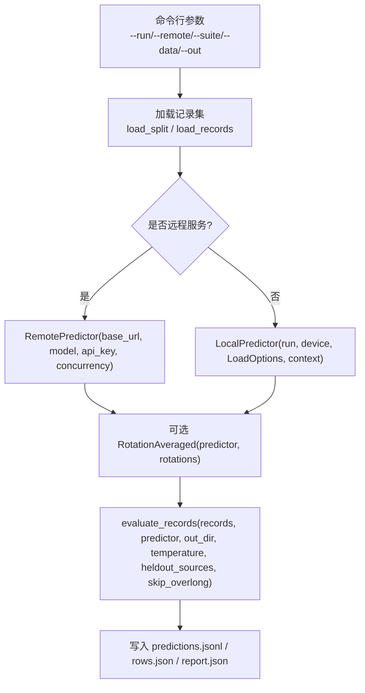
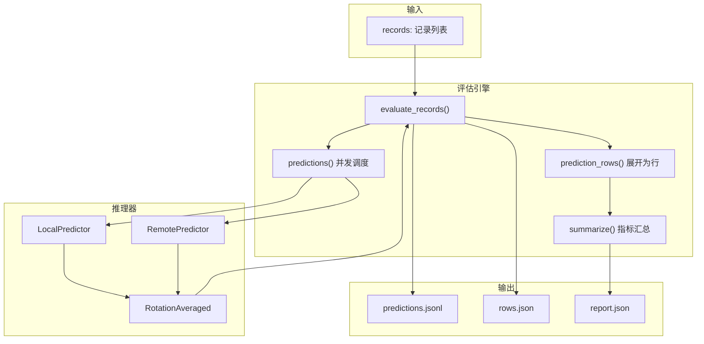
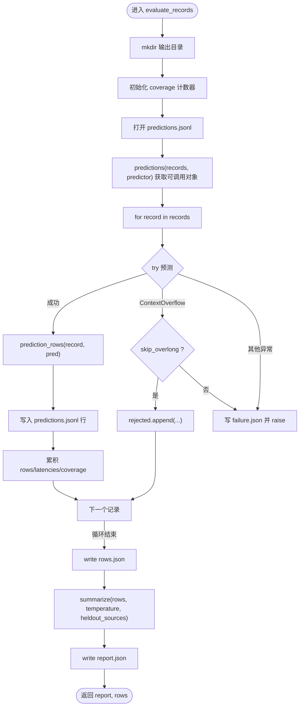
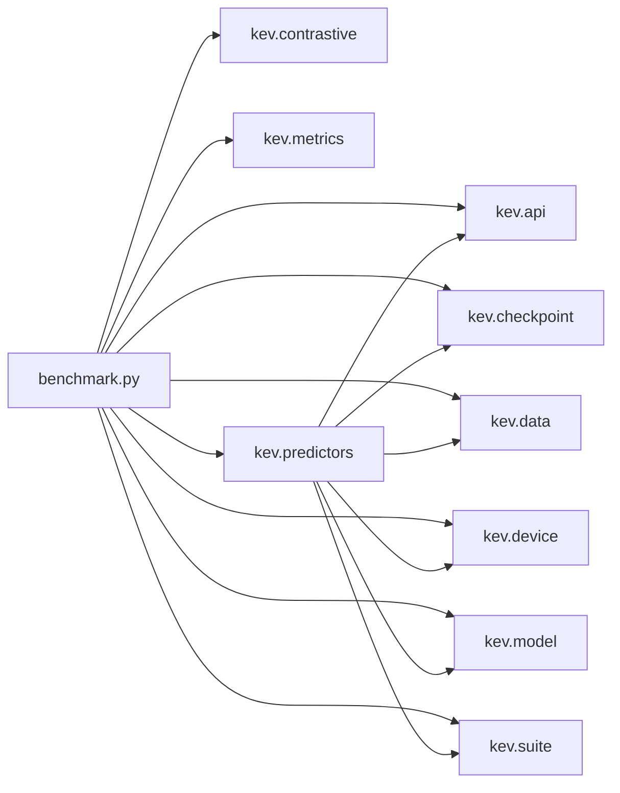

# 评估工作流程

<cite>
**本文引用的文件**   
- [benchmark.py](file://kev/benchmark.py)
- [predictors.py](file://kev/predictors.py)
</cite>

## 目录
1. [引言](#引言)
2. [项目结构](#项目结构)
3. [核心组件](#核心组件)
4. [架构总览](#架构总览)
5. [详细组件分析](#详细组件分析)
6. [依赖关系分析](#依赖关系分析)
7. [性能与稳定性考量](#性能与稳定性考量)
8. [故障排查指南](#故障排查指南)
9. [结论](#结论)
10. [附录：输出文件格式](#附录输出文件格式)

## 引言
本文件系统化说明 Kev 的评估工作流程，覆盖从数据加载、模型推理、结果计算到报告生成的完整链路。重点解释以下能力：
- `evaluate_records()` 的核心职责：并发调度、错误处理、覆盖率统计、延迟统计、长上下文溢出处理。
- `LocalPredictor` 与 `RemotePredictor` 的使用场景、配置项与行为差异。
- `RotationAveraged` 预测器的选项轮换机制及其对稳定性的提升。
- 上下文溢出处理与 `skip_overlong` 参数的使用方式。
- 批量评估与分布式评估的最佳实践。
- 进度监控与异常处理策略。
- 评估产物 `predictions.jsonl`、`rows.json`、`report.json` 的结构说明。

## 项目结构
Kev 的评估入口位于模块 `kev.benchmark`，推理器实现位于 `kev.predictors`。整体流程如下：
- 命令行参数解析与数据集/套件加载。
- 根据是否远程服务选择 `LocalPredictor` 或 `RemotePredictor`。
- 可选通过 `RotationAveraged` 包装预测器以进行选项轮换平均。
- 调用 `evaluate_records()` 执行评估并写入产物。
- 汇总指标并生成报告。

图表来源
- [benchmark.py:171-210](file://kev/benchmark.py#L171-L210)
- [predictors.py:93-147](file://kev/predictors.py#L93-L147)
- [predictors.py:162-207](file://kev/predictors.py#L162-L207)

章节来源
- [benchmark.py:1-28](file://kev/benchmark.py#L1-L28)
- [predictors.py:1-35](file://kev/predictors.py#L1-L35)

## 核心组件
本节聚焦评估主流程与关键函数：
- `evaluate_records()`: 评估编排、并发调度、覆盖率统计、错误处理、延迟统计、报告汇总。
- `prediction_rows()`: 将预测结果展开为每问一行（question-level）的行记录。
- `summarize()`: 基于行记录计算指标、校准指标、变体分组、任务分组等。
- `predictions()`: 按顺序产出可调用对象，内部使用线程池控制并发。

章节来源
- [benchmark.py:48-103](file://kev/benchmark.py#L48-L103)
- [benchmark.py:106-168](file://kev/benchmark.py#L106-L168)

## 架构总览
下图展示评估端到端的数据流与控制流，包括本地推理与远程推理两条路径，以及旋转平均包装层。

图表来源
- [benchmark.py:106-168](file://kev/benchmark.py#L106-L168)
- [predictors.py:93-147](file://kev/predictors.py#L93-L147)
- [predictors.py:162-207](file://kev/predictors.py#L162-L207)
- [predictors.py:213-251](file://kev/predictors.py#L213-L251)

## 详细组件分析

### evaluate_records(): 评估编排与覆盖率统计
职责要点：
- 创建输出目录，初始化覆盖率计数器：请求记录数、请求问题数、已评估记录数、已评估问题数、被拒绝记录数、截断记录数。
- 打开 `predictions.jsonl` 流式写入每条记录的请求摘要、ID、预测结果与展开后的行。
- 通过 `predictions()` 获取按序的可调用对象，内部支持并发。
- 捕获 `ContextOverflow` 与其他异常：
  - 若启用 `skip_overlong`，将被拒绝记录追加到 `rejected.json` 并继续；否则写入 `failure.json` 后抛出异常中断。
- 累积延迟并统计中位数与 P95。
- 写出 `rows.json` 与 `report.json`，并在报告中包含覆盖率、延迟、温度、是否记录 logits、长行统计等。

图表来源
- [benchmark.py:124-168](file://kev/benchmark.py#L124-L168)

章节来源
- [benchmark.py:124-168](file://kev/benchmark.py#L124-L168)

### LocalPredictor: 本地推理器
使用场景：
- 在本地加载检查点并进行推理，适合离线评测、复现实验、精确性要求高的场景。

关键特性：
- FP32 精确推理：关闭 TF32 与 SDPA 融合内核，保证可重复性。
- 长上下文优化：当最长行超过阈值时，切换到高效注意力内核以降低显存占用。
- 环境指纹：记录后端、设备、包版本、注意力实现、DeltaNet 前向实现等，用于跨运行可比性。
- 返回字段：probabilities、logits、inference_temperature、latency_ms、input_tokens，必要时附加 kernels 标记。

配置项：
- run: 检查点路径或 Hub ID。
- device: cpu/mps/cuda。
- opts: LoadOptions，含 temperature 等。
- context: 最大状态长度、分支数、打包限制，来自套件清单或默认常量。

章节来源
- [predictors.py:93-147](file://kev/predictors.py#L93-L147)
- [predictors.py:67-90](file://kev/predictors.py#L67-L90)

### RemotePredictor: 远程推理器
使用场景：
- 对接任意 TypeSafe System One 兼容端点，适合在线评测、多实例并行、服务端集中部署。

关键特性：
- 并发控制：`concurrency` 表示同时保持的请求数，由 `predictions()` 通过线程池管理。
- 重试与退避：对 408、429、5xx 及连接/超时错误进行指数退避重试；客户端错误立即失败。
- 拒绝语义：特定 HTTP 状态码映射为 `ContextOverflow`，便于上层按“拒绝”处理。
- 返回字段：probabilities、latency_ms、input_tokens，并记录服务端模型标识。

配置项：
- base_url: 服务基地址。
- model: 请求模型名。
- api_key: 鉴权令牌。
- timeout: 单次请求超时。
- retries: 最大重试次数。
- concurrency: 并发度。

章节来源
- [predictors.py:162-207](file://kev/predictors.py#L162-L207)

### RotationAveraged: 选项轮换平均
动机：
- 降低选择题选项顺序对概率分布的影响，提高稳定性与鲁棒性。

机制：
- 对每个 Choice 问题的选项进行循环移位，分别调用底层预测器。
- 若所有轮次都返回 logits，则在 logit 空间求均值；否则在 log-probability 空间求几何平均。
- 最终概率通过 softmax 归一化，确保与 logits 一致。
- 成本：每条记录需要多次前向（等于轮换次数）。

配置项：
- predictor: 被包装的预测器（LocalPredictor 或 RemotePredictor）。
- rotations: 轮换次数，至少为 2。

章节来源
- [predictors.py:213-251](file://kev/predictors.py#L213-L251)

### 上下文溢出处理与 skip_overlong
- 当记录无法编码进上下文时，会抛出 `ContextOverflow`。
- `skip_overlong=True`：记录被拒绝但不中断评估，写入 `rejected.json`，覆盖率中的 rejected_records 增加。
- `skip_overlong=False`：首次遇到溢出即写入 `failure.json` 并抛出异常，评估终止。
- 外部数据（通过 `--data` 传入）默认开启 `skip_overlong`；冻结套件则依据清单的 `eval_only` 标志决定。

章节来源
- [benchmark.py:124-168](file://kev/benchmark.py#L124-L168)
- [benchmark.py:191-204](file://kev/benchmark.py#L191-L204)

### 并发处理与顺序一致性
- `predictions()` 根据预测器的 `concurrency` 属性决定是否使用线程池。
- 无论并发如何，外层循环按原始记录顺序产出结果，保证输出顺序稳定。
- 对于远程预测器，每个请求独立且可并发；对于本地预测器，通常串行执行。

章节来源
- [benchmark.py:106-122](file://kev/benchmark.py#L106-L122)
- [predictors.py:162-175](file://kev/predictors.py#L162-L175)

## 依赖关系分析
- `benchmark.py` 依赖：
  - `kev.api`：问题键生成、日期事实注入。
  - `kev.checkpoint`：检查点加载选项。
  - `kev.contrastive`：配对翻转统计。
  - `kev.data`：API 请求构造、记录加载。
  - `kev.device`：设备同步。
  - `kev.metrics`：指标计算、NLL、校准等。
  - `kev.model`：上下文溢出异常、行拆分、阈值。
  - `kev.predictors`：预测器实现。
  - `kev.suite`：套件加载、清单读取、编码常量、JSON 写入。
- `predictors.py` 依赖：
  - `torch`、`transformers.integrations.sdpa_attention`：注意力内核切换。
  - `kev.api`、`kev.checkpoint`、`kev.data`、`kev.device`、`kev.model`、`kev.suite`：推理所需工具。

图表来源
- [benchmark.py:19-27](file://kev/benchmark.py#L19-L27)
- [predictors.py:23-28](file://kev/predictors.py#L23-L28)

章节来源
- [benchmark.py:19-27](file://kev/benchmark.py#L19-L27)
- [predictors.py:23-28](file://kev/predictors.py#L23-L28)

## 性能与稳定性考量
- 本地推理精度：
  - 关闭 TF32 与 SDPA 融合内核，保证 FP32 精确性与可重复性。
  - 长上下文路径下使用高效注意力内核以避免显存爆炸，代价是不同内核集合可能带来微小数值差异。
- 远程推理可靠性：
  - 对网络抖动与服务端瞬时错误进行指数退避重试。
  - 明确区分“服务端拒绝”与“临时错误”，前者直接作为上下文溢出处理。
- 稳定性增强：
  - `RotationAveraged` 通过选项轮换平均减少顺序偏差，提高鲁棒性。
- 吞吐与延迟：
  - 远程推理可通过 `concurrency` 提升吞吐；本地推理受 GPU/CPU 资源限制。
  - 报告包含延迟的中位数与 P95，便于性能分析。

章节来源
- [predictors.py:93-147](file://kev/predictors.py#L93-L147)
- [predictors.py:162-207](file://kev/predictors.py#L162-L207)
- [predictors.py:213-251](file://kev/predictors.py#L213-L251)
- [benchmark.py:158-167](file://kev/benchmark.py#L158-L167)

## 故障排查指南
常见问题与处理建议：
- 上下文溢出：
  - 现象：抛出 `ContextOverflow`。
  - 处理：设置 `skip_overlong=True` 以跳过过长记录；或调整 `context` 限制。
  - 产物：`rejected.json` 列出被拒绝记录；若未启用跳过，则写入 `failure.json` 并中断。
- 远程端点拒绝：
  - 现象：HTTP 400/413/422 等状态码。
  - 处理：视为上下文溢出；检查服务端上下文限制与请求大小。
- 网络错误与服务端错误：
  - 现象：408、429、5xx、连接/超时错误。
  - 处理：自动重试与指数退避；若持续失败，检查服务端健康与网络连通性。
- 客户端错误：
  - 现象：401、403、404 等。
  - 处理：立即失败，检查鉴权、URL、模型名等配置。
- 概率校验失败：
  - 现象：概率键不匹配、非有限值、越界、总和不为 1。
  - 处理：检查预测器输出格式与数值范围。

章节来源
- [benchmark.py:124-168](file://kev/benchmark.py#L124-L168)
- [predictors.py:150-207](file://kev/predictors.py#L150-L207)

## 结论
Kev 的评估工作流通过清晰的模块化设计，实现了从数据加载、推理、结果展开到指标汇总与报告生成的全链路自动化。`evaluate_records()` 提供稳健的错误处理与覆盖率统计；`LocalPredictor` 与 `RemotePredictor` 分别满足离线精确与在线可扩展需求；`RotationAveraged` 通过选项轮换平均提升稳定性。结合并发调度、重试机制与长上下文优化，该流程既保证了结果的可靠性，也兼顾了效率与可维护性。

## 附录：输出文件格式

### predictions.jsonl
- 每行一个 JSON 对象，对应一条记录。
- 字段：
  - request_sha256: 请求摘要哈希。
  - id: 记录 ID。
  - prediction: 预测结果对象（包含 probabilities、logits、latency_ms、input_tokens 等）。
  - rows: 展开后的问题级行列表。

章节来源
- [benchmark.py:149-150](file://kev/benchmark.py#L149-L150)

### rows.json
- 数组，每个元素为一行（一个问题），包含：
  - id、group、question、source、task、type、variant、keys、label、control_id、pair_id、sibling、parent。
  - p: 概率向量（按 keys 顺序）。
  - raw_probability_sum: 原始概率和。
  - zero_count: 零概率数量。
  - logits: 可选，原始 logits（按 keys 顺序）。
  - inference_temperature: 可选，推理温度。
  - kernels: 可选，标记使用了长行高效内核。

章节来源
- [benchmark.py:48-70](file://kev/benchmark.py#L48-L70)
- [benchmark.py:158-158](file://kev/benchmark.py#L158-L158)

### report.json
- 顶层字段：
  - objective: 目标值（负平均 NLL）。
  - paired_flip: 配对翻转统计。
  - unknowable: 不可知样本报告。
  - clean: 干净样本指标。
  - tasks: 按任务分组的指标。
  - variants: 按变体分组的指标。
  - heldout_tasks: 保留任务组指标（如有）。
  - permutation: 排列扰动统计（n、mean_max_delta、flip_rate）。
  - temperature: 评估温度。
  - calibrated_clean: 校准后的干净样本指标。
  - metric_policy: 指标策略元信息（版本、选择性平局、覆盖率定义、AURC、置信错误率等）。
  - coverage: 覆盖率统计（requested_records、requested_questions、evaluated_records、evaluated_questions、rejected_records、truncated_records）。
  - latency_ms: 延迟统计（median、p95）。
  - calibration: 校准信息（inference_temperature、additional_temperature、logits_recorded）。
  - long_rows: 长行统计（count、records、kernels、threshold）。
  - suite_sha256、data、date_facts、rotations、run、split、calibration_applied、environment、remote: 环境与运行元数据。

章节来源
- [benchmark.py:73-103](file://kev/benchmark.py#L73-L103)
- [benchmark.py:160-167](file://kev/benchmark.py#L160-L167)
- [benchmark.py:205-209](file://kev/benchmark.py#L205-L209)