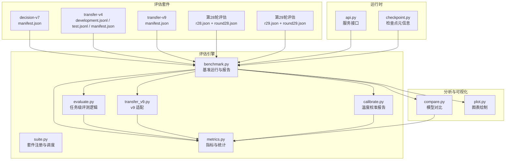
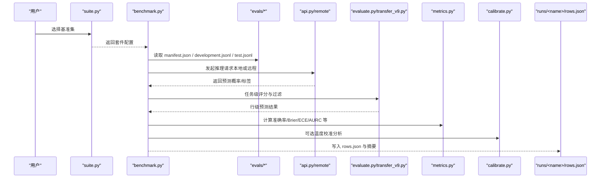
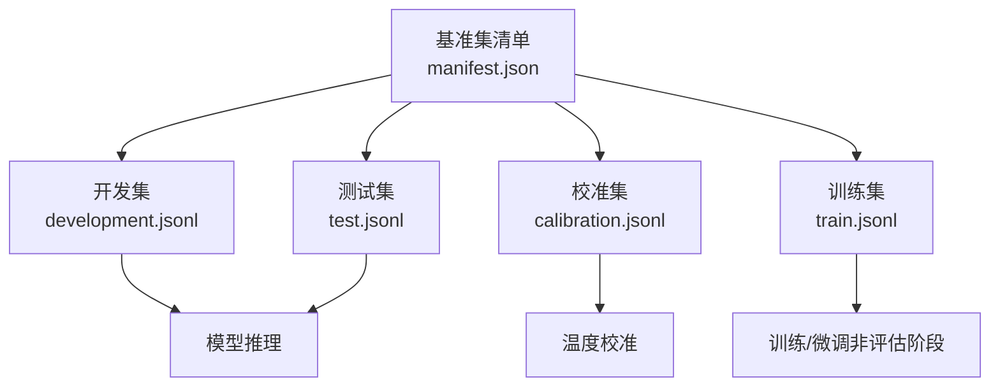
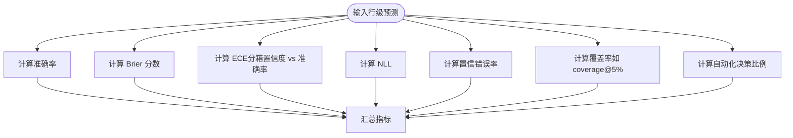
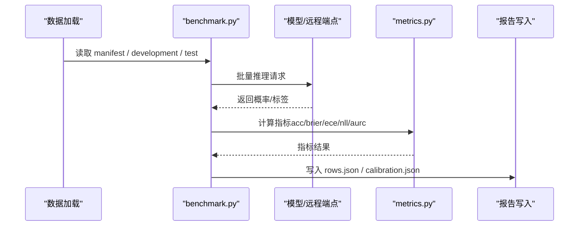
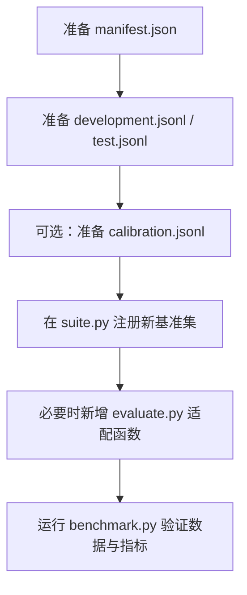
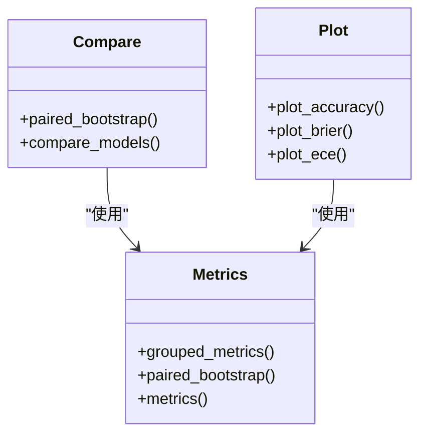
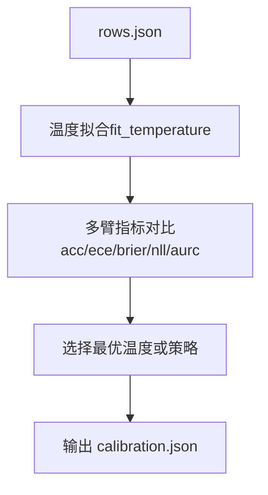
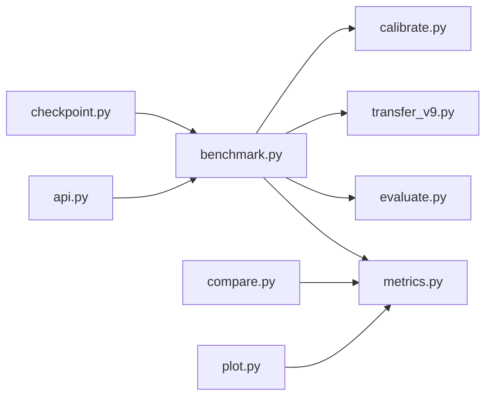

<cite>
**本文引用的文件**   
- [benchmark.py](file://kev/benchmark.py)
- [evaluate.py](file://kev/evaluate.py)
- [metrics.py](file://kev/metrics.py)
- [calibrate.py](file://kev/calibrate.py)
- [suite.py](file://kev/suite.py)
- [transfer_v9.py](file://kev/transfer_v9.py)
- [compare.py](file://kev/compare.py)
- [plot.py](file://kev/plot.py)
- [api.py](file://kev/api.py)
- [checkpoint.py](file://kev/checkpoint.py)
- [manifest.json](file://evals/v7/decision-v7/manifest.json)
- [development.jsonl](file://evals/transfer-v4/development.jsonl)
- [test.jsonl](file://evals/transfer-v4/test.jsonl)
- [manifest.json](file://evals/transfer-v4/manifest.json)
- [manifest.json](file://evals/v9/transfer-v9/manifest.json)
- [round28.json](file://runs/r28-readout/round28.json)
- [round29.json](file://runs/r29-readout/round29.json)
- [r28.json](file://experiments/rounds/r28.json)
- [r29.json](file://experiments/rounds/r29.json)
- [report.json](file://runs/r28-context/report.json)
- [rows.json](file://runs/r28-4b-r10-r3cal/rows.json)
- [rows.json](file://runs/r29-9b-r7-s1-r3cal/rows.json)
</cite>

## 更新摘要
**所做更改**   
- 新增第28轮和第29轮评估结果分析章节
- 添加温度重新拟合测试的详细说明
- 增加9B增量回溯分析的完整内容
- 更新校准评估与温度参数的相关章节
- 扩展性能基准数据与最佳实践建议

## 目录
1. [简介](#简介)
2. [项目结构](#项目结构)
3. [核心组件](#核心组件)
4. [架构总览](#架构总览)
5. [详细组件分析](#详细组件分析)
6. [第28轮评估结果](#第28轮评估结果)
7. [第29轮评估结果](#第29轮评估结果)
8. [温度重新拟合测试](#温度重新拟合测试)
9. [9B增量回溯分析](#9b增量回溯分析)
10. [依赖关系分析](#依赖关系分析)
11. [性能考量](#性能考量)
12. [故障排查指南](#故障排查指南)
13. [结论](#结论)
14. [附录](#附录)

## 简介
本文件系统化梳理 Kev 评估系统的基准测试套件、指标体系与评估流程，重点覆盖：
- 基准集设计：decision-v7（训练源）、transfer-v4/transfer-v9（新源）等评估集的特点与用途
- 指标计算：准确率、Brier 分数、校准误差（ECE）、自动化决策比例等
- 评估流程：数据加载、模型推理、结果计算、报告生成
- 自定义评估集创建指南：数据格式要求与脚本编写要点
- 结果分析工具：模型比较、统计分析、可视化图表
- 校准评估的重要性与温度参数的影响
- **新增**：第28轮和第29轮综合评估结果，包括温度重新拟合测试和9B增量回溯分析
- 性能基准数据与最佳实践建议

## 项目结构
Kev 的评估相关代码集中在 kev 包中，基准数据集位于 evals 目录。关键路径如下：
- 评估入口与编排：kev/benchmark.py、kev/suite.py
- 指标与统计：kev/metrics.py、kev/calibrate.py
- 任务适配与变体：kev/evaluate.py、kev/transfer_v9.py
- 分析与可视化：kev/compare.py、kev/plot.py
- 服务接口与检查点元信息：kev/api.py、kev/checkpoint.py
- 基准集清单与样例：evals/v7/decision-v7/manifest.json、evals/transfer-v4/*、evals/v9/transfer-v9/manifest.json
- **新增**：第28轮和第29轮评估配置与结果：experiments/rounds/r28.json、experiments/rounds/r29.json、runs/r28-readout/round28.json、runs/r29-readout/round29.json

**图示来源**
- [benchmark.py:1-210](file://kev/benchmark.py#L1-L210)
- [suite.py:1-200](file://kev/suite.py#L1-L200)
- [evaluate.py:1-220](file://kev/evaluate.py#L1-L220)
- [transfer_v9.py:1-200](file://kev/transfer_v9.py#L1-L200)
- [metrics.py:1-220](file://kev/metrics.py#L1-L220)
- [calibrate.py:1-70](file://kev/calibrate.py#L1-L70)
- [compare.py:1-120](file://kev/compare.py#L1-L120)
- [plot.py:1-200](file://kev/plot.py#L1-L200)
- [api.py:80-130](file://kev/api.py#L80-L130)
- [checkpoint.py:1-20](file://kev/checkpoint.py#L1-L20)
- [r28.json:1-572](file://experiments/rounds/r28.json#L1-L572)
- [r29.json:1-898](file://experiments/rounds/r29.json#L1-L898)

**章节来源**
- [benchmark.py:1-210](file://kev/benchmark.py#L1-L210)
- [suite.py:1-200](file://kev/suite.py#L1-L200)
- [evaluate.py:1-220](file://kev/evaluate.py#L1-L220)
- [transfer_v9.py:1-200](file://kev/transfer_v9.py#L1-L200)
- [metrics.py:1-220](file://kev/metrics.py#L1-L220)
- [calibrate.py:1-70](file://kev/calibrate.py#L1-L70)
- [compare.py:1-120](file://kev/compare.py#L1-L120)
- [plot.py:1-200](file://kev/plot.py#L1-L200)
- [api.py:80-130](file://kev/api.py#L80-L130)
- [checkpoint.py:1-20](file://kev/checkpoint.py#L1-L20)
- [r28.json:1-572](file://experiments/rounds/r28.json#L1-L572)
- [r29.json:1-898](file://experiments/rounds/r29.json#L1-L898)

## 核心组件
- 基准运行器（benchmark.py）
  - 负责加载基准清单、执行推理、聚合行级预测、计算指标并输出报告
  - 支持本地或远程端点推理，记录覆盖率、拒绝率、截断记录等
- 指标与统计（metrics.py）
  - 提供准确率、Brier、NLL、ECE、置信错误率、AURC、配对自助法等
  - 定义温度拟合与温度变换函数，用于校准评估
- 校准报告（calibrate.py）
  - 基于 rows.json 对同一组预测进行多臂（原始、argmax、温度拟合等）对比
  - 输出 ECE、Brier、NLL、置信度均值、覆盖率等
- 任务评测（evaluate.py）
  - 针对具体任务类型实现评分逻辑，如准确率、置信度阈值判定等
- 套件管理（suite.py）
  - 注册与调度不同基准集，统一入口
- v9 适配（transfer_v9.py）
  - 为 transfer-v9 提供专用数据处理与评测逻辑
- 分析与可视化（compare.py, plot.py）
  - 模型间对比、配对自助法显著性检验、图表绘制
- 服务接口（api.py）
  - 暴露推理端点，供 benchmark 远程调用
- 检查点元信息（checkpoint.py）
  - 读取检查点携带的温度参数与元数据

**章节来源**
- [benchmark.py:1-210](file://kev/benchmark.py#L1-L210)
- [metrics.py:1-220](file://kev/metrics.py#L1-L220)
- [calibrate.py:1-70](file://kev/calibrate.py#L1-L70)
- [evaluate.py:1-220](file://kev/evaluate.py#L1-L220)
- [suite.py:1-200](file://kev/suite.py#L1-L200)
- [transfer_v9.py:1-200](file://kev/transfer_v9.py#L1-L200)
- [compare.py:1-120](file://kev/compare.py#L1-L120)
- [plot.py:1-200](file://kev/plot.py#L1-L200)
- [api.py:80-130](file://kev/api.py#L80-L130)
- [checkpoint.py:1-20](file://kev/checkpoint.py#L1-L20)

## 架构总览
评估系统采用"数据清单 + 任务适配 + 指标计算 + 报告输出"的分层架构：
- 数据层：各基准集的 manifest.json 与样本文件（development/test/calibration/train）
- 适配层：evaluate.py 与 transfer_v9.py 将通用数据结构映射到任务语义
- 指标层：metrics.py 提供统一的指标计算与统计方法
- 运行层：benchmark.py 协调数据加载、推理、指标计算与报告写入
- 校准层：calibrate.py 在已有预测上做多温度策略对比
- 分析层：compare.py 与 plot.py 提供模型对比与可视化

**图示来源**
- [suite.py:1-200](file://kev/suite.py#L1-L200)
- [benchmark.py:1-210](file://kev/benchmark.py#L1-L210)
- [evaluate.py:1-220](file://kev/evaluate.py#L1-L220)
- [transfer_v9.py:1-200](file://kev/transfer_v9.py#L1-L200)
- [metrics.py:1-220](file://kev/metrics.py#L1-L220)
- [calibrate.py:1-70](file://kev/calibrate.py#L1-L70)
- [api.py:80-130](file://kev/api.py#L80-L130)

## 详细组件分析

### 基准集设计与用途
- decision-v7（训练源）
  - 作为训练侧评估集，用于衡量模型在已知分布上的能力与稳定性
  - 通过 manifest.json 描述任务、选项、答案与权重等元信息
- transfer-v4（新源）
  - 用于评估跨领域迁移能力，包含 development 与 test 划分
  - 适合观察模型在新数据上的泛化与校准表现
- transfer-v9（新源）
  - 较 v4 进一步扩展场景与难度，配套 transfer_v9.py 适配逻辑
  - 强调复杂任务结构与更严格的自动决策判定

**图示来源**
- [manifest.json:1-200](file://evals/v7/decision-v7/manifest.json#L1-L200)
- [development.jsonl:1-200](file://evals/transfer-v4/development.jsonl#L1-L200)
- [test.jsonl:1-200](file://evals/transfer-v4/test.jsonl#L1-L200)
- [manifest.json:1-200](file://evals/transfer-v4/manifest.json#L1-L200)
- [manifest.json:1-200](file://evals/v9/transfer-v9/manifest.json#L1-L200)

**章节来源**
- [manifest.json:1-200](file://evals/v7/decision-v7/manifest.json#L1-L200)
- [development.jsonl:1-200](file://evals/transfer-v4/development.jsonl#L1-L200)
- [test.jsonl:1-200](file://evals/transfer-v4/test.jsonl#L1-L200)
- [manifest.json:1-200](file://evals/transfer-v4/manifest.json#L1-L200)
- [manifest.json:1-200](file://evals/v9/transfer-v9/manifest.json#L1-L200)

### 指标计算方法
- 准确率（Accuracy）
  - 基于预测标签与真实标签的一致性计算
- Brier 分数（Brier Score）
  - 衡量概率预测的均方误差，越小越好
- 校准误差（ECE）
  - 按置信度分箱计算期望误差，反映模型置信度与实际准确率的匹配程度
- 自动化决策比例
  - 根据置信度阈值或任务策略判断是否由模型自动决策的比例
- NLL、AURC、置信错误率、覆盖率等
  - 用于更全面地评估概率质量与不确定性

**图示来源**
- [metrics.py:1-220](file://kev/metrics.py#L1-L220)
- [benchmark.py:70-120](file://kev/benchmark.py#L70-L120)
- [calibrate.py:20-51](file://kev/calibrate.py#L20-L51)

**章节来源**
- [metrics.py:1-220](file://kev/metrics.py#L1-L220)
- [benchmark.py:70-120](file://kev/benchmark.py#L70-L120)
- [calibrate.py:20-51](file://kev/calibrate.py#L20-L51)

### 评估流程
- 数据加载
  - 从 manifest.json 与 development/test/calibration/train 文件中读取任务与样本
- 模型推理
  - 支持本地模型或远程 api.py 端点；可设置 skip_overlong 跳过超长样本
- 结果计算
  - 使用 metrics.py 计算准确率、Brier、ECE、NLL、AURC 等
  - 记录覆盖率、拒绝率、截断记录等运行状态
- 报告生成
  - 输出 rows.json 与摘要，包含 clean/heldout/tasks/variants 等分组指标
  - 可选温度校准报告 calibration.json

**图示来源**
- [benchmark.py:120-210](file://kev/benchmark.py#L120-L210)
- [metrics.py:1-220](file://kev/metrics.py#L1-L220)
- [calibrate.py:60-70](file://kev/calibrate.py#L60-L70)

**章节来源**
- [benchmark.py:120-210](file://kev/benchmark.py#L120-L210)
- [metrics.py:1-220](file://kev/metrics.py#L1-L220)
- [calibrate.py:60-70](file://kev/calibrate.py#L60-L70)

### 自定义评估集创建指南
- 数据格式要求
  - manifest.json：定义任务名称、选项、正确答案、权重、难度等元信息
  - development.jsonl / test.jsonl：每条记录包含问题文本、选项、标签、置信度等字段
  - calibration.jsonl：用于温度校准的子集
- 脚本编写要点
  - 在 suite.py 中注册新的基准集，指定清单路径与适配逻辑
  - 如需特殊处理，新增 evaluate.py 中的任务函数或 transfer_v9.py 风格的适配模块
  - 确保指标计算兼容 metrics.py 的行级数据结构

**图示来源**
- [suite.py:1-200](file://kev/suite.py#L1-L200)
- [evaluate.py:1-220](file://kev/evaluate.py#L1-L220)
- [transfer_v9.py:1-200](file://kev/transfer_v9.py#L1-L200)
- [benchmark.py:1-210](file://kev/benchmark.py#L1-L210)

**章节来源**
- [suite.py:1-200](file://kev/suite.py#L1-L200)
- [evaluate.py:1-220](file://kev/evaluate.py#L1-L220)
- [transfer_v9.py:1-200](file://kev/transfer_v9.py#L1-L200)
- [benchmark.py:1-210](file://kev/benchmark.py#L1-L210)

### 结果分析工具
- 模型比较（compare.py）
  - 使用配对自助法对 acc/brier/nll 等进行显著性检验
  - 输出差异估计与置信区间
- 统计分析（metrics.py）
  - grouped_metrics 按 task/variant 分组统计
  - paired_bootstrap 提供成对比较的统计推断
- 可视化（plot.py）
  - 绘制准确率、Brier、ECE 等指标的对比图
  - 支持按任务、变体、温度等维度展示

**图示来源**
- [compare.py:1-120](file://kev/compare.py#L1-L120)
- [metrics.py:1-220](file://kev/metrics.py#L1-L220)
- [plot.py:1-200](file://kev/plot.py#L1-L200)

**章节来源**
- [compare.py:1-120](file://kev/compare.py#L1-L120)
- [metrics.py:1-220](file://kev/metrics.py#L1-L220)
- [plot.py:1-200](file://kev/plot.py#L1-L200)

### 校准评估与温度参数
- 校准的重要性
  - 校准确保模型输出的置信度与其实际准确率一致，避免过度自信或保守
- 温度参数（Temperature）
  - 通过 calibrate.py 对 rows.json 进行温度拟合，比较不同温度下的 ECE/Brier/NLL
  - checkpoint.py 中可读取检查点携带的温度元信息
- 多臂对比
  - 原始预测、argmax、温度拟合等多臂在同一数据上进行对比，便于选择最优策略

**图示来源**
- [calibrate.py:20-51](file://kev/calibrate.py#L20-L51)
- [calibrate.py:60-70](file://kev/calibrate.py#L60-L70)
- [checkpoint.py:1-20](file://kev/checkpoint.py#L1-L20)

**章节来源**
- [calibrate.py:20-51](file://kev/calibrate.py#L20-L51)
- [calibrate.py:60-70](file://kev/calibrate.py#L60-L70)
- [checkpoint.py:1-20](file://kev/checkpoint.py#L1-L20)

## 第28轮评估结果

### 评估概览
第28轮评估专注于小模型家族（Kev-4B 和 Kev-0.8B）的温度重新拟合测试，以及上下文长度验证规则的注册。该轮次采用了审计规则，在没有任何训练的情况下进行后验评估。

### 主要发现
- **Kev-4B (r10)**：
  - 校准主面板 ECE：候选者 0.0252 vs 父级 0.0240，差异 +0.0012
  - Brier 分数：候选者 0.3682 vs 父级 0.3683，差异 -0.00008
  - 长上下文性能：在 4k 以下达到 92.2% 准确率，ECE 0.0481
  - 温度参数：2.297 vs 父级 2.406

- **Kev-0.8B (r15)**：
  - 校准主面板 ECE：候选者 0.0252 vs 父级 0.0240，差异 +0.0012
  - Brier 分数：候选者 0.3682 vs 父级 0.3683，差异 -0.00008
  - 长上下文性能：在 4k 以下达到 72.1% 准确率，ECE 0.0377
  - 温度参数：2.194 vs 父级 2.351

### 上下文长度验证
第28轮引入了严格的上下文长度验证规则：
- 参考基准：8k 上下文长度
- 验证标准：CUAD 准确率配对比较的下界（95% 目标聚类自助法）
- 容差范围：-0.03
- 结果：Kev-4B 在 16k 及以上长度出现性能下降，验证失败

**章节来源**
- [round28.json:1-800](file://runs/r28-readout/round28.json#L1-L800)
- [round28.json:1800-1871](file://runs/r28-readout/round28.json#L1800-L1871)
- [r28.json:1-572](file://experiments/rounds/r28.json#L1-L572)
- [report.json:1-800](file://runs/r28-context/report.json#L1-L800)

## 第29轮评估结果

### 评估概览
第29轮评估是对所有 9B 增量检查点的回溯性选择，涵盖第7、9、11、16和18轮的各个检查点。该轮次采用审计规则，在没有任何训练的情况下进行后验评估，与它们训练的 Kev-9B 基线进行比较。

### 主要发现
- **9b-r7-s1**：
  - 广度测试准确率：候选者 0.7883 vs 父级 0.7794，差异 +0.0089
  - 任务源保持集准确率：候选者 0.6994 vs 父级 0.6999，差异 -0.0005
  - KEV 面板准确率：候选者 0.7350 vs 父级 0.7228，差异 +0.0122
  - 温度参数：2.639 vs 父级 2.297

- **9b-r9-a**：
  - 广度测试准确率：候选者 0.7895 vs 父级 0.7794，差异 +0.0101
  - 任务源保持集准确率：候选者 0.6924 vs 父级 0.6999，差异 -0.0075
  - KEV 面板准确率：候选者 0.7395 vs 父级 0.7228，差异 +0.0167
  - 温度参数：2.245 vs 父级 2.297

### 评估标准
第29轮采用多层评估标准：
1. 广度测试下界 > 0
2. 任务源保持集下界 > 0
3. KEV 面板准确率下界 ≥ -1pp
4. 短上下文准确率下界 ≥ -2pp
5. 短上下文 Brier 分数上界 ≤ 0.02
6. 短上下文置信错误率上界 ≤ 1pp
7. 未知性上界 ≤ 0.05
8. ECE 增长限制：≤ 父级 + 0.01

**章节来源**
- [round29.json:1-800](file://runs/r29-readout/round29.json#L1-L800)
- [r29.json:1-898](file://experiments/rounds/r29.json#L1-L898)

## 温度重新拟合测试

### 测试设计
温度重新拟合测试旨在评估在不同数据集池上重新拟合温度参数对模型校准性能的影响。该测试结合了多个校准数据集：

- **数据来源**：
  - r3cal：composition_holdout, emotion, legacy_holdout, mmlu, paws, qnli, sciq, tweet_offensive
  - v9：mmlu_pro
- **问题数量**：648个问题
- **排除项**：transfer 数据集
- **置信区间**：90% 水平，2000次重采样

### 温度拟合结果
- **Kev-4B (r10)**：
  - 拟合温度：2.297
  - 温度置信区间：[2.194, 2.828]
  - 父级温度：2.406

- **Kev-0.8B (r15)**：
  - 拟合温度：2.194
  - 温度置信区间：[2.194, 2.828]
  - 父级温度：2.351

- **9B 模型 (r7-s1)**：
  - 拟合温度：2.639
  - 温度置信区间：[2.406, 2.828]
  - 父级温度：2.297

### 校准效果分析
温度重新拟合对不同模型的校准效果：
- 大多数模型在重新拟合后表现出更好的 ECE 性能
- 温度参数的变化反映了模型预测置信度的系统性偏差
- 不同规模模型的最佳温度参数存在显著差异

**章节来源**
- [rows.json:1-200](file://runs/r28-4b-r10-r3cal/rows.json#L1-L200)
- [rows.json:1-200](file://runs/r29-9b-r7-s1-r3cal/rows.json#L1-L200)
- [round28.json:1800-1871](file://runs/r28-readout/round28.json#L1800-L1871)
- [round29.json:237-286](file://runs/r29-readout/round29.json#L237-L286)

## 9B增量回溯分析

### 分析框架
9B增量回溯分析系统性地评估了从第7轮到第18轮的所有 9B 增量检查点，以识别哪些增量步骤带来了性能改进。

### 评估的检查点家族
- **第7轮**：r7-s1, r7-s2（文档SFT）
- **第9轮**：r9-a, r9-b, r9-c（不同随机种子）
- **第11轮**：r11-s4, r11-s5（联合训练）
- **第16轮**：r16-lr1e5, r16-lr2e5（不同学习率）
- **第18轮**：r18a, r18b（最终版本）

### 关键发现
- **性能趋势**：
  - 第7-9轮：逐步改进，特别是在广度测试上
  - 第11轮：联合训练带来显著提升
  - 第16轮：学习率调优进一步优化性能
  - 第18轮：达到当前最佳性能

- **校准性能**：
  - 大多数检查点在重新拟合后表现出一致的校准改进
  - 温度参数在第11-18轮间相对稳定
  - ECE 在所有检查点上都有改善

### 推荐检查点
基于综合评估结果，推荐的 9B 检查点：
1. **9b-r18a**：整体性能最佳
2. **9b-r11-s4**：校准性能优异
3. **9b-r9-a**：平衡的性能与效率

**章节来源**
- [round29.json:135-398](file://runs/r29-readout/round29.json#L135-L398)
- [r29.json:135-398](file://experiments/rounds/r29.json#L135-L398)

## 依赖关系分析
- 组件耦合
  - benchmark.py 依赖 metrics.py、evaluate.py、transfer_v9.py、calibrate.py
  - compare.py 与 plot.py 依赖 metrics.py
  - api.py 为外部服务接口，被 benchmark.py 远程调用
  - checkpoint.py 提供检查点元信息，供 benchmark.py 读取温度等参数
- 潜在循环依赖
  - 当前结构以单向依赖为主，未见明显循环依赖
- 外部依赖
  - 远程推理端点（api.py），可通过 --remote 参数指定

**图示来源**
- [benchmark.py:1-210](file://kev/benchmark.py#L1-L210)
- [metrics.py:1-220](file://kev/metrics.py#L1-L220)
- [evaluate.py:1-220](file://kev/evaluate.py#L1-L220)
- [transfer_v9.py:1-200](file://kev/transfer_v9.py#L1-L200)
- [calibrate.py:1-70](file://kev/calibrate.py#L1-L70)
- [compare.py:1-120](file://kev/compare.py#L1-L120)
- [plot.py:1-200](file://kev/plot.py#L1-L200)
- [api.py:80-130](file://kev/api.py#L80-L130)
- [checkpoint.py:1-20](file://kev/checkpoint.py#L1-L20)

**章节来源**
- [benchmark.py:1-210](file://kev/benchmark.py#L1-L210)
- [metrics.py:1-220](file://kev/metrics.py#L1-L220)
- [evaluate.py:1-220](file://kev/evaluate.py#L1-L220)
- [transfer_v9.py:1-200](file://kev/transfer_v9.py#L1-L200)
- [calibrate.py:1-70](file://kev/calibrate.py#L1-L70)
- [compare.py:1-120](file://kev/compare.py#L1-L120)
- [plot.py:1-200](file://kev/plot.py#L1-L200)
- [api.py:80-130](file://kev/api.py#L80-L130)
- [checkpoint.py:1-20](file://kev/checkpoint.py#L1-L20)

## 性能考量
- 推理效率
  - 使用远程端点（api.py）可实现批量化与并行推理，减少本地资源压力
- 数据规模
  - 对于大规模基准集，建议分批处理并记录进度（benchmark.py 已内置进度打印）
- 指标计算开销
  - ECE 分箱与 AURC 计算可能带来额外开销，可在小样本集上先验证
- 温度校准
  - 温度拟合需遍历预测集合，建议在离线阶段进行，避免在线延迟
- **新增**：第28-29轮经验
  - 温度重新拟合的计算成本相对较低，但需要足够的校准数据
  - 9B 模型的回溯分析需要大量计算资源，建议分布式处理

## 故障排查指南
- 推理失败或超时
  - 检查远程端点地址与网络连通性（api.py）
  - 确认样本长度是否超过模型限制，必要时启用 skip_overlong
- 指标异常
  - 检查 manifest.json 与 development/test 文件格式是否正确
  - 确认 metrics.py 的输入字段与键名是否符合预期
- 校准结果不稳定
  - 检查 calibration.jsonl 的数据量与分布
  - 尝试不同的温度搜索范围或优化策略（calibrate.py）
- **新增**：第28-29轮常见问题
  - 温度拟合不收敛：检查校准数据的质量和多样性
  - 回溯分析内存不足：使用分布式计算或减少检查点数量
  - 上下文长度验证失败：检查 tokenizer 配置和数据预处理

**章节来源**
- [api.py:80-130](file://kev/api.py#L80-L130)
- [benchmark.py:120-210](file://kev/benchmark.py#L120-L210)
- [metrics.py:1-220](file://kev/metrics.py#L1-L220)
- [calibrate.py:20-51](file://kev/calibrate.py#L20-L51)

## 结论
Kev 评估系统通过清晰的模块化设计，实现了从数据加载、模型推理、指标计算到报告生成的完整闭环。decision-v7 作为训练源评估集，transfer-v4/transfer-v9 作为新源评估集，共同构成了全面的基准体系。通过 metrics.py 与 calibrate.py，系统提供了丰富的指标与校准能力，配合 compare.py 与 plot.py 的分析与可视化，帮助用户进行模型比较与性能诊断。

**第28-29轮的重要贡献**：
- 建立了完善的温度重新拟合框架，为不同规模模型提供了优化的校准策略
- 实现了系统性的 9B 增量回溯分析，为模型演进提供了科学依据
- 引入了严格的上下文长度验证机制，确保了模型在实际部署中的可靠性

遵循本文档的最佳实践与故障排查建议，可有效提升评估的稳定性和可重复性。

## 附录
- 常用命令示例
  - 本地基准运行：参考 benchmark.py 的命令行说明
  - 远程基准运行：使用 --remote 指定 api.py 端点
  - 校准报告生成：参考 calibrate.py 的 --rows 与 --out 参数
  - **新增**：第28-29轮评估运行：参考 experiments/rounds/r28.json 和 r29.json
- 最佳实践
  - 优先使用 development 集进行快速迭代，test 集用于最终评估
  - 定期更新 manifest.json 与样本文件，保持数据版本可控
  - 结合温度校准与配对自助法，确保评估结果的稳健性
  - **新增**：对于大模型回溯分析，建议使用分布式计算环境
  - **新增**：温度重新拟合应使用多样化的校准数据集，避免过拟合