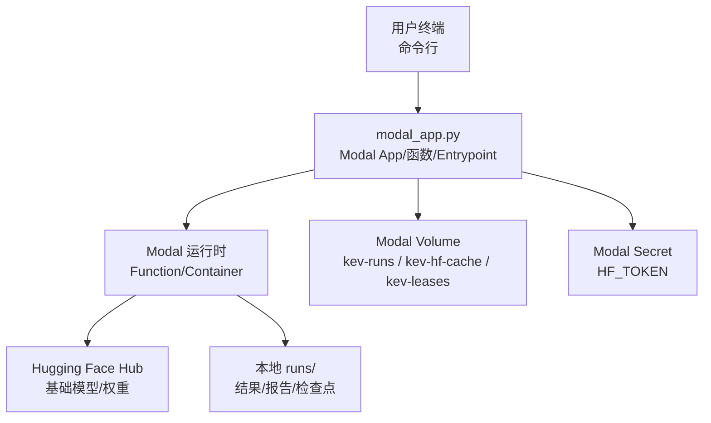
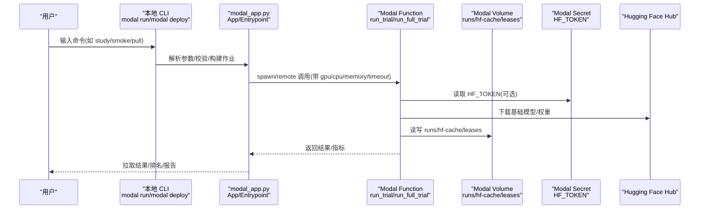
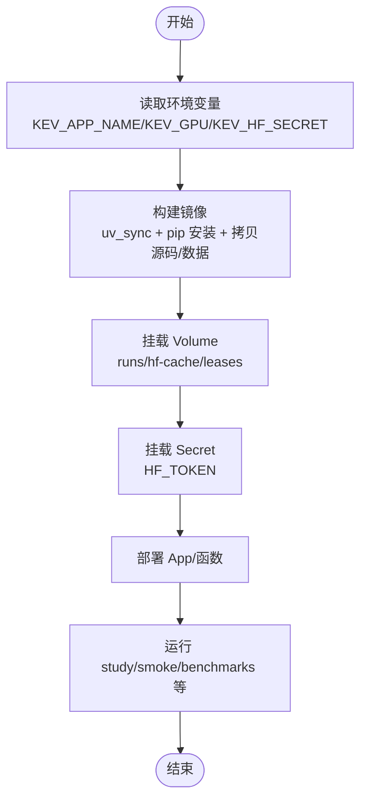
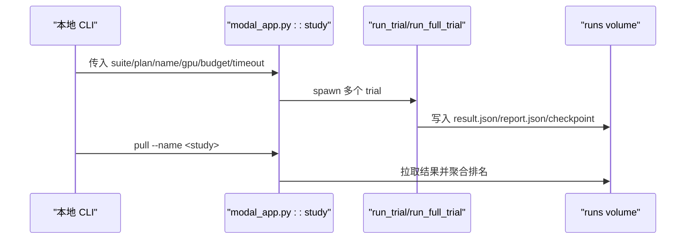
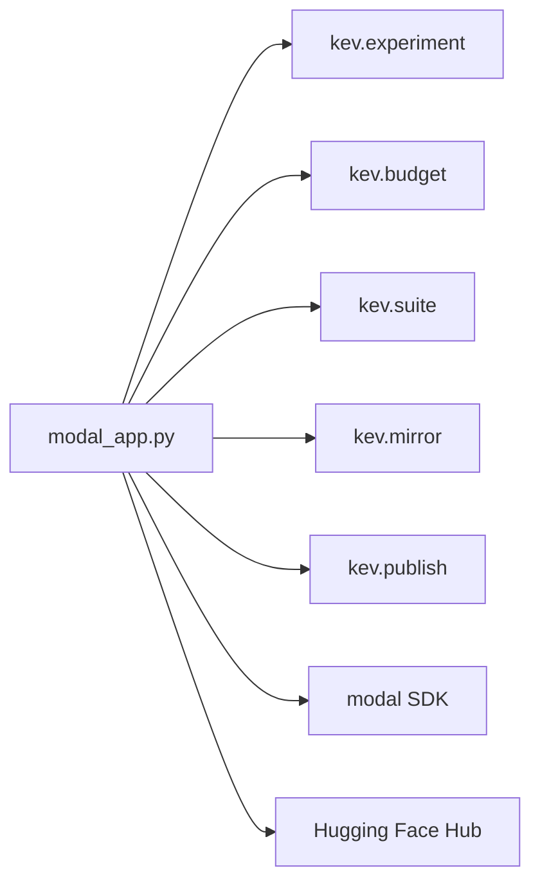

# Modal 云端部署

<cite>
**本文引用的文件**   
- [modal_app.py](file://modal_app.py)
- [README.md](file://README.md)
- [pyproject.toml](file://pyproject.toml)
</cite>

## 目录
1. [简介](#简介)
2. [项目结构](#项目结构)
3. [核心组件](#核心组件)
4. [架构总览](#架构总览)
5. [详细组件分析](#详细组件分析)
6. [依赖关系分析](#依赖关系分析)
7. [性能与成本优化](#性能与成本优化)
8. [监控、日志与排错](#监控日志与排错)
9. [生产环境最佳实践](#生产环境最佳实践)
10. [结论](#结论)
11. [附录：命令与配置模板](#附录命令与配置模板)

## 简介
本指南面向希望在 Modal 上训练、评估和部署 Kev 决策模型的工程师。内容覆盖：
- Modal 账户注册、API 密钥与工作区配置
- 计费与预算控制
- 应用部署流程：`modal_app.py` 的配置项、GPU 选择（T4、H100、H200）、容器镜像构建
- 成本优化策略：GPU 类型选择、自动扩缩容、空闲实例清理
- 监控与日志：运行状态查看、错误追踪、性能指标收集
- 生产环境最佳实践：高可用、备份与灾难恢复
- 具体命令示例与配置模板

## 项目结构
仓库中与 Modal 部署直接相关的核心入口是 `modal_app.py`，它定义了 Modal App、函数、Volume、Secret、镜像构建以及本地 CLI entrypoint；`README.md` 提供了快速开始、部署与服务端说明；`pyproject.toml` 声明了 Python 版本、依赖与 dev 依赖（包含 `modal==1.5.5`）。



**图示来源**
- [modal_app.py:38-83](file://modal_app.py#L38-L83)
- [modal_app.py:96-115](file://modal_app.py#L96-L115)
- [modal_app.py:53-75](file://modal_app.py#L53-L75)

**章节来源**
- [modal_app.py:38-83](file://modal_app.py#L38-L83)
- [modal_app.py:53-75](file://modal_app.py#L53-L75)
- [README.md:172-184](file://README.md#L172-L184)
- [pyproject.toml:1-62](file://pyproject.toml#L1-L62)

## 核心组件
- Modal App 与镜像
  - App 名称通过环境变量 `KEV_APP_NAME` 设置，默认 `kev-research`。
  - 镜像基于 Debian Slim + Python 3.13，使用 `uv_sync` 安装精确锁定的依赖，并额外安装推理与测试所需包。
  - 将本地源码 `kev`、`evals`、`scripts`、`tests` 等目录打包进镜像，便于在容器内执行脚本与评测。
- 持久化存储
  - `kev-runs`：保存每次 trial 的结果、检查点、快照与中间产物。
  - `kev-hf-cache`：缓存 Hugging Face 基础模型与 Triton kernel 编译产物。
  - `kev-leases`：用于全量微调尝试的分布式租约，避免并发冲突。
- 密钥与访问
  - 通过 `KEV_HF_SECRET` 注入 HF_TOKEN，以访问 gated base 模型或私有 Hub 仓库。
- GPU 与资源
  - 默认 GPU 由 `KEV_GPU` 决定，默认 `H100`；免费额度可使用 `T4`。
  - 不同函数根据任务分配 CPU、内存、超时与临时磁盘。

**章节来源**
- [modal_app.py:38-83](file://modal_app.py#L38-L83)
- [modal_app.py:96-115](file://modal_app.py#L96-L115)
- [modal_app.py:53-75](file://modal_app.py#L53-L75)

## 架构总览
下图展示了从本地 CLI 到 Modal 函数、Volume、Secret 与 Hugging Face Hub 的整体交互。



**图示来源**
- [modal_app.py:96-115](file://modal_app.py#L96-L115)
- [modal_app.py:118-176](file://modal_app.py#L118-L176)
- [modal_app.py:53-83](file://modal_app.py#L53-L83)

## 详细组件分析

### 1) Modal 账户注册与配置
- 安装与初始化
  - 安装 Modal CLI 并执行初始化，打开浏览器完成认证。
- API 密钥与工作区
  - 使用 `modal token new` 生成令牌；工作区在 Modal 控制台管理。
- 密钥挂载
  - 为 Hugging Face 访问创建 Secret（例如命名为 `huggingface-secret`），并通过环境变量 `KEV_HF_SECRET` 指定其名称。
- 计费与预算
  - 每个 study 有 admission bound（计算费用上限）；支持按 timeout 与 trial 数量估算。
  - 全量微调（full_ft）有更长的超时与更高的预算上限。

**章节来源**
- [README.md:172-184](file://README.md#L172-L184)
- [modal_app.py:948-976](file://modal_app.py#L948-L976)

### 2) 应用部署流程与 `modal_app.py` 配置
- 部署 App
  - `modal deploy modal_app.py` 将 App 与所有函数部署到 Modal，后续 `modal run` 可在已部署 App 上执行。
- 关键环境变量
  - `KEV_APP_NAME`：App 名称（默认 `kev-research`）。
  - `KEV_GPU`：GPU 类型（默认 `H100`；免费额度用 `T4`）。
  - `KEV_HF_SECRET`：HF_TOKEN 对应的 Secret 名称。
- 镜像构建要点
  - 使用 `uv_sync` 安装锁定依赖，确保可复现。
  - 安装 `flash-linear-attention` 与兼容版本的 `triton`，以启用 Qwen3.5 混合骨干的高效内核。
  - 预编译 causal-conv1d wheel，避免依赖冲突。
  - 将本地源码与评测数据打入镜像，保证远程执行一致性。



**图示来源**
- [modal_app.py:38-83](file://modal_app.py#L38-L83)
- [modal_app.py:53-75](file://modal_app.py#L53-L75)

**章节来源**
- [modal_app.py:38-83](file://modal_app.py#L38-L83)
- [modal_app.py:53-75](file://modal_app.py#L53-L75)

### 3) GPU 资源选择（T4、H100、H200）
- T4
  - 适合 smoke 测试与轻量任务；免费额度可用。
- H100
  - 默认 GPU，适合大多数训练与评测任务。
- H200
  - 适合大模型（如 Kev-27B）训练与评测；对内存带宽与显存容量要求更高。
- 选择方式
  - 通过 `KEV_GPU` 环境变量或在 entrypoint 中传入 `gpu=` 参数。

**章节来源**
- [modal_app.py:42-47](file://modal_app.py#L42-L47)
- [modal_app.py:1074-1078](file://modal_app.py#L1074-L1078)

### 4) 容器镜像构建与依赖
- Python 与系统依赖
  - Debian Slim + Python 3.13；安装 git 等系统工具。
- Python 依赖
  - 使用 `uv_sync` 安装 pyproject 中的依赖，确保可复现。
  - 额外安装 `pytest` 用于 GPU 测试。
- 第三方库
  - `flash-linear-attention==0.5.2` 与 `triton>=3.7.1` 以适配 Qwen3.5 混合骨干。
  - 预编译 `causal-conv1d` wheel，避免 torch/triton 版本冲突。
- 源码与数据
  - 将 `kev`、`evals`、`scripts`、`tests` 与部分实验配置文件打入镜像。

**章节来源**
- [modal_app.py:53-75](file://modal_app.py#L53-L75)
- [pyproject.toml:21-30](file://pyproject.toml#L21-L30)

### 5) 训练与评测流程
- 单 trial 运行
  - `run_trial`：一次 trial 在一个容器中执行，挂载 runs 与 hf-cache。
- 全量微调
  - `run_full_trial`：为 full_ft 增加临时磁盘与 leases volume，支持断点续训与快照上传。
- 评测与基准
  - `run_bench`：对 checkpoint 进行 benchmark，输出到 `/runs/bench/<name>`。
  - `run_locked_test`：对候选 trial 进行一次性的 locked test 读取。
- 结果拉取
  - `pull`：从 runs volume 拉取 study 结果到本地 `runs/<study>`，并按结果排名。



**图示来源**
- [modal_app.py:96-115](file://modal_app.py#L96-L115)
- [modal_app.py:245-266](file://modal_app.py#L245-L266)
- [modal_app.py:1074-1078](file://modal_app.py#L1074-L1078)
- [modal_app.py:1232-1238](file://modal_app.py#L1232-L1238)

**章节来源**
- [modal_app.py:96-115](file://modal_app.py#L96-L115)
- [modal_app.py:245-266](file://modal_app.py#L245-L266)
- [modal_app.py:1074-1078](file://modal_app.py#L1074-L1078)
- [modal_app.py:1232-1238](file://modal_app.py#L1232-L1238)

## 依赖关系分析
- 外部依赖
  - Modal SDK：用于 App/Function/Volume/Secret 管理与运行。
  - Hugging Face Hub：基础模型与权重下载。
- 内部模块
  - `kev.experiment`：试验执行、继续与聚合。
  - `kev.budget`：预算、资源与租约相关逻辑。
  - `kev.suite`：评测套件加载与结果写入。
  - `kev.mirror`：将检查点镜像到私有 Hub 仓库。
  - `kev.publish`：发布检查点到 Hub。



**图示来源**
- [modal_app.py:35-36](file://modal_app.py#L35-L36)
- [modal_app.py:272-284](file://modal_app.py#L272-L284)
- [modal_app.py:688-706](file://modal_app.py#L688-L706)

**章节来源**
- [modal_app.py:35-36](file://modal_app.py#L35-L36)
- [modal_app.py:272-284](file://modal_app.py#L272-L284)
- [modal_app.py:688-706](file://modal_app.py#L688-L706)

## 性能与成本优化

### GPU 类型选择
- T4：适合 smoke 与轻量任务，成本低。
- H100：默认 GPU，兼顾性能与成本。
- H200：适合大模型（Kev-27B）训练与评测，带宽与显存更充足。
- 选择依据
  - 模型大小与任务复杂度。
  - 预算上限与超时限制。

**章节来源**
- [modal_app.py:42-47](file://modal_app.py#L42-L47)
- [modal_app.py:948-976](file://modal_app.py#L948-L976)

### 自动扩缩容与空闲实例清理
- 自动扩缩容
  - Modal Function 支持 `max_containers` 控制最大并行容器数。
  - 训练与评测函数设置了合理的并发上限，避免资源争用。
- 空闲实例清理
  - 使用 detached 模式运行 study，本地 CLI 退出后仍在云端运行。
  - 完成后通过 `pull` 拉取结果，无需保持本地连接。
  - 对于服务类 endpoint，Modal 会按需启动容器，空闲时缩容至零。

**章节来源**
- [modal_app.py:103-115](file://modal_app.py#L103-L115)
- [README.md:172-184](file://README.md#L172-L184)

### 成本优化策略
- 合理设置 budget 与 timeout
  - 通过 admission bound 控制计算费用上限。
  - 全量微调允许更长超时与更高预算。
- 选择合适的 GPU
  - 小模型用 T4/L4，中等模型用 H100，大模型用 H200/B200。
- 利用缓存与 Volume
  - `kev-hf-cache` 缓存基础模型与 Triton kernel，减少重复下载。
  - `kev-runs` 持久化结果，避免重复计算。

**章节来源**
- [modal_app.py:948-976](file://modal_app.py#L948-L976)
- [modal_app.py:76-83](file://modal_app.py#L76-L83)

## 监控、日志与排错

### 运行状态查看
- 查看 study 状态
  - 使用 `modal run modal_app.py::study` 的 detached 模式，本地 CLI 退出后仍可运行。
  - 通过 `pull --name <study>` 拉取结果并查看排名。
- 查看单个 trial 状态
  - 通过 `run_resume` 或 `continue_full_trial` 查看与继续中断的 trial。

**章节来源**
- [modal_app.py:1074-1078](file://modal_app.py#L1074-L1078)
- [modal_app.py:1202-1230](file://modal_app.py#L1202-L1230)

### 错误追踪
- 常见错误
  - 代码不一致：deployed app 与本地 checkout 的 `kev/*.py` 哈希不一致。
  - 资源不足：GPU/CPU/内存不足导致容器启动失败。
  - 权限问题：HF_TOKEN 未正确挂载或 Secret 名称错误。
- 排查方法
  - 检查 `KEV_APP_NAME`、`KEV_GPU`、`KEV_HF_SECRET` 环境变量。
  - 确认 `modal deploy modal_app.py` 已成功部署。
  - 查看 Modal 控制台中的函数日志与 Volume 状态。

**章节来源**
- [modal_app.py:979-990](file://modal_app.py#L979-L990)
- [modal_app.py:118-176](file://modal_app.py#L118-L176)

### 性能指标收集
- 内置指标
  - `result.json` 包含 objective、clean_acc、wall_seconds 等。
  - `report.json` 包含准确率、Brier 分数、校准误差等。
- 自定义指标
  - 通过 `scripts/serving_bench.py` 收集延迟与吞吐指标。
  - 通过 `scripts/base_mmlu_probe.py` 收集基线模型的性能指标。

**章节来源**
- [modal_app.py:175-176](file://modal_app.py#L175-L176)
- [modal_app.py:245-266](file://modal_app.py#L245-L266)

## 生产环境最佳实践

### 高可用性配置
- 多区域部署
  - 通过 `KEV_REGION` 指定 Modal 区域，提升就近访问性能。
- 冗余与故障转移
  - 使用 `run_mirror` 将检查点镜像到私有 Hub 仓库，作为备份。
  - 使用 `run_release_publish` 发布检查点到 Hub，确保可恢复性。

**章节来源**
- [modal_app.py:272-284](file://modal_app.py#L272-L284)
- [modal_app.py:688-706](file://modal_app.py#L688-L706)

### 备份策略
- 定期镜像检查点
  - 使用 `mirror_snapshots` 将 runs volume 中的检查点镜像到私有 Hub。
- 版本化管理
  - 使用 `release_copy` 与 `release_publish` 管理发布版本，确保可追溯。

**章节来源**
- [modal_app.py:645-662](file://modal_app.py#L645-L662)
- [modal_app.py:679-716](file://modal_app.py#L679-L716)

### 灾难恢复
- 恢复中断的训练
  - 使用 `resume` 继续中断的 trial，支持断点续训。
- 恢复检查结果
  - 使用 `pull` 重新拉取 study 结果，确保数据一致性。

**章节来源**
- [modal_app.py:1202-1230](file://modal_app.py#L1202-L1230)
- [modal_app.py:1232-1238](file://modal_app.py#L1232-L1238)

## 结论
通过 `modal_app.py`，Kev 项目在 Modal 上实现了完整的训练、评测与部署流水线。结合环境变量、Volume、Secret 与 GPU 资源选择，用户可以灵活地控制成本与性能。在生产环境中，建议采用高可用配置、定期备份与灾难恢复策略，确保服务的稳定性与可恢复性。

## 附录：命令与配置模板

### 账户与密钥配置
- 安装与初始化
  ```bash
  pip install modal && modal setup
  uv run modal token new
  ```
- 设置 HF_TOKEN
  ```bash
  export KEV_HF_SECRET=huggingface-secret
  ```

**章节来源**
- [README.md:172-184](file://README.md#L172-L184)

### 部署与应用运行
- 部署 App
  ```bash
  uv run modal deploy modal_app.py
  ```
- 运行 smoke 测试
  ```bash
  KEV_GPU=T4 uv run modal run modal_app.py::smoke
  ```
- 运行 study
  ```bash
  uv run modal run modal_app.py::study \
      --suite evals/v7/decision-v7 \
      --plan experiments/v7-final.json \
      --name my-study \
      --transfer evals/v4/transfer-v4 \
      --budget 30 \
      --timeout 7200
  ```
- 拉取结果
  ```bash
  uv run modal run modal_app.py::pull --name my-study
  ```

**章节来源**
- [README.md:303-322](file://README.md#L303-L322)
- [modal_app.py:1074-1078](file://modal_app.py#L1074-L1078)
- [modal_app.py:1232-1238](file://modal_app.py#L1232-L1238)

### GPU 资源选择
- 选择 T4（免费额度）
  ```bash
  KEV_GPU=T4 uv run modal run modal_app.py::smoke
  ```
- 选择 H100（默认）
  ```bash
  KEV_GPU=H100 uv run modal run modal_app.py::study ...
  ```
- 选择 H200（大模型）
  ```bash
  KEV_GPU=H200 uv run modal run modal_app.py::study ...
  ```

**章节来源**
- [modal_app.py:42-47](file://modal_app.py#L42-L47)

### 成本优化配置
- 设置预算与超时
  ```bash
  uv run modal run modal_app.py::study \
      --budget 20.0 \
      --timeout 1800
  ```
- 使用缓存与 Volume
  - 确保 `kev-hf-cache` 与 `kev-runs` 已创建并挂载。

**章节来源**
- [modal_app.py:948-976](file://modal_app.py#L948-L976)
- [modal_app.py:76-83](file://modal_app.py#L76-L83)