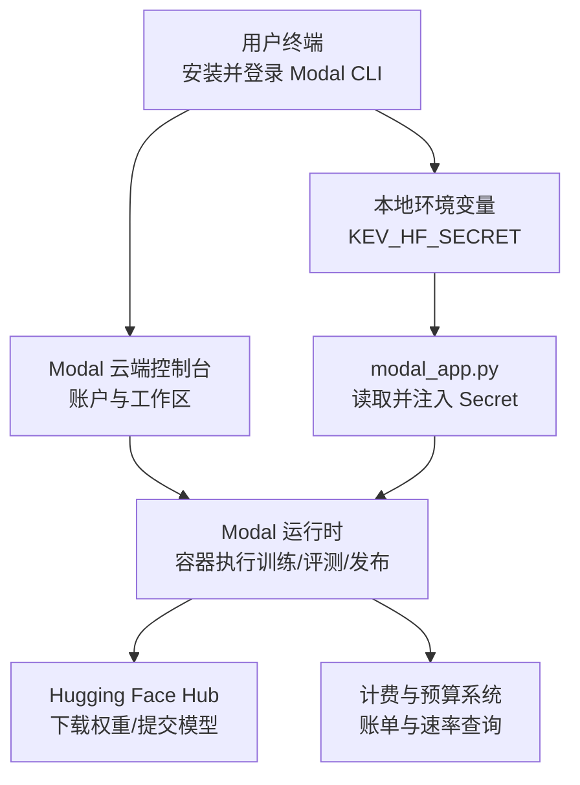
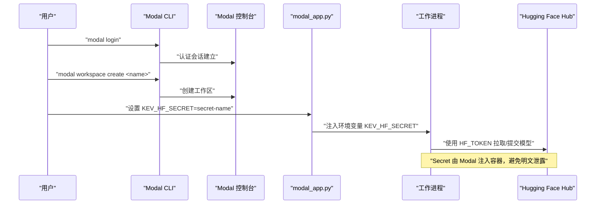
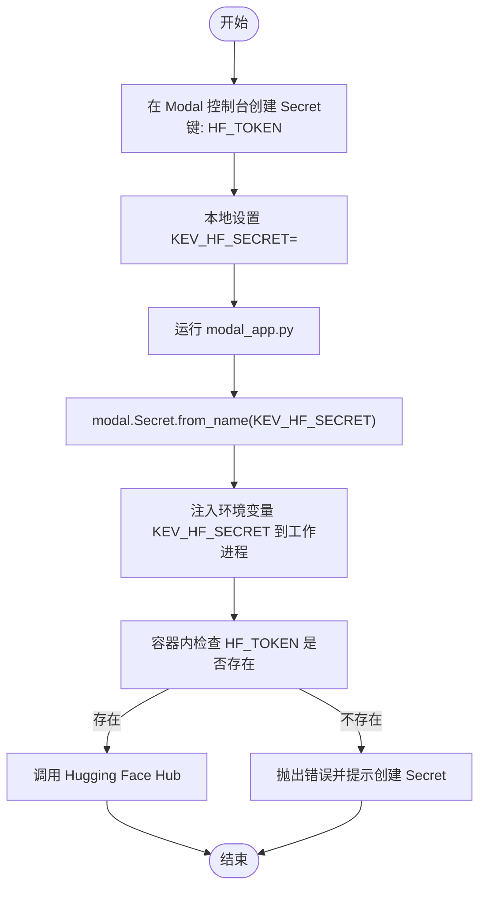
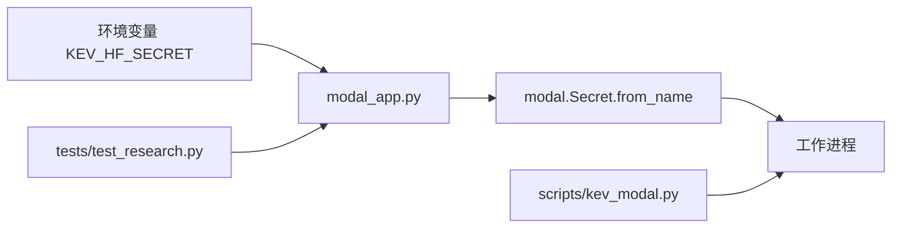

# Modal 账户配置

<cite>
**本文引用的文件**   
- [modal_app.py](file://modal_app.py)
- [AGENTS.md](file://AGENTS.md)
- [PLAN.md](file://PLAN.md)
- [README.md](file://README.md)
- [test_research.py](file://tests/test_research.py)
- [report.json](file://runs/calibration-screen-startup/report.json)
- [deploy.md](file://skills/kev-finetune/references/deploy.md)
- [kev_modal.py](file://skills/kev-finetune/scripts/kev_modal.py)
</cite>

## 目录
1. [简介](#简介)
2. [项目结构](#项目结构)
3. [核心组件](#核心组件)
4. [架构总览](#架构总览)
5. [详细组件分析](#详细组件分析)
6. [依赖关系分析](#依赖关系分析)
7. [性能与计费考量](#性能与计费考量)
8. [故障排除指南](#故障排除指南)
9. [结论](#结论)
10. [附录](#附录)

## 简介
本指南面向首次或需要重新配置 Modal 平台账户的用户，覆盖以下关键主题：
- 账户注册与工作区创建流程（访问 modal.com、邮箱验证、工作区创建）
- API 密钥与环境变量配置（Modal CLI 登录、KEV_HF_SECRET 环境变量、Hugging Face Token 集成）
- 计费与预算监控（免费层限制、付费升级、账单查看）
- 常用命令示例（modal login、modal workspace create、环境变量模板）
- 常见错误排查（认证失败、网络问题、权限配置错误）

说明：
- 本项目通过 Modal 运行训练、评测与发布任务，使用 KEV_HF_SECRET 将 Hugging Face Token 注入容器。
- 计费与预算策略在项目文档中有明确约束与监控方式。

## 项目结构
与 Modal 账户与密钥配置直接相关的代码与文档集中在以下位置：
- modal_app.py：定义 Modal 应用、Secret 挂载、环境变量注入逻辑
- AGENTS.md / PLAN.md：计费、预算、限额与监控相关说明
- README.md：项目概览与外部服务引用
- tests/test_research.py：对 KEV_HF_SECRET 传播的测试断言
- runs/calibration-screen-startup/report.json：记录因 Secret 未传播导致的失败信息
- skills/kev-finetune/references/deploy.md 与 scripts/kev_modal.py：部署脚本中对 KEV_HF_SECRET 的使用与校验

图示来源
- [modal_app.py:15-17](file://modal_app.py#L15-L17)
- [modal_app.py:48-82](file://modal_app.py#L48-L82)
- [AGENTS.md:94-117](file://AGENTS.md#L94-L117)
- [AGENTS.md:447](file://AGENTS.md#L447)

章节来源
- [modal_app.py:15-17](file://modal_app.py#L15-L17)
- [modal_app.py:48-82](file://modal_app.py#L48-L82)
- [AGENTS.md:94-117](file://AGENTS.md#L94-L117)
- [AGENTS.md:447](file://AGENTS.md#L447)

## 核心组件
- Modal 账户与工作区
  - 在 modal.com 完成注册与邮箱验证后，创建工作区以隔离资源与计费。
- Modal CLI 登录
  - 使用 modal login 完成本地到 Modal 的认证。
- Secret 与 Hugging Face Token
  - 通过 Modal Secret 管理 HF_TOKEN，并以 KEV_HF_SECRET 指向该 Secret 名称。
  - 容器内通过环境变量 KEV_HF_SECRET 获取 Secret 名，再由 modal.Secret.from_name 加载。
- 环境变量注入
  - modal_app.py 将 KEV_HF_SECRET 注入到工作进程的环境变量中，确保下游脚本可访问。

章节来源
- [modal_app.py:15-17](file://modal_app.py#L15-L17)
- [modal_app.py:48-82](file://modal_app.py#L48-L82)
- [kev_modal.py:386](file://skills/kev-finetune/scripts/kev_modal.py#L386)
- [kev_modal.py:563](file://skills/kev-finetune/scripts/kev_modal.py#L563)

## 架构总览
下图展示从本地终端到云端容器的完整链路，包括 Secret 传递与 Hugging Face 集成。

图示来源
- [modal_app.py:48-82](file://modal_app.py#L48-L82)
- [kev_modal.py:386](file://skills/kev-finetune/scripts/kev_modal.py#L386)

## 详细组件分析

### 账户注册与工作区创建
- 访问 modal.com 完成注册，确认邮箱验证。
- 使用 modal workspace create 创建新工作区，用于隔离资源与计费。
- 建议在团队环境中为不同项目创建独立工作区，便于成本分摊与权限控制。

章节来源
- [README.md:70](file://README.md#L70)

### API 密钥与 Hugging Face Token 集成
- 在 Modal 控制台创建 Secret，包含键 HF_TOKEN，值为你的 Hugging Face Token。
- 设置本地环境变量 KEV_HF_SECRET 指向该 Secret 名称。
- modal_app.py 会读取 KEV_HF_SECRET，并通过 modal.Secret.from_name 加载 Secret，将其注入工作进程环境变量。
- 部署脚本 kev_modal.py 会在容器内检查 HF_TOKEN 是否存在，若缺失则报错，提示通过 Modal Secret 提供。

图示来源
- [modal_app.py:81-82](file://modal_app.py#L81-L82)
- [kev_modal.py:386](file://skills/kev-finetune/scripts/kev_modal.py#L386)
- [kev_modal.py:563](file://skills/kev-finetune/scripts/kev_modal.py#L563)

章节来源
- [modal_app.py:15-17](file://modal_app.py#L15-L17)
- [modal_app.py:48-82](file://modal_app.py#L48-L82)
- [kev_modal.py:386](file://skills/kev-finetune/scripts/kev_modal.py#L386)
- [kev_modal.py:563](file://skills/kev-finetune/scripts/kev_modal.py#L563)

### 计费设置与预算监控
- 免费层限制：默认 GPU 类型为 T4（受限于免费额度），如需更高算力需升级到付费计划。
- 付费升级：在 Modal 控制台升级账户计划以获得更强大的 GPU 与更高的并发配额。
- 预算监控：
  - 使用 modal billing summary --json 查看累计费用与用量。
  - 使用 modal billing rates --json 查看当前费率。
  - 项目内部预算模块（kev.budget）对训练与插值等任务进行限额与估算，并在日志中记录。

章节来源
- [AGENTS.md:94-117](file://AGENTS.md#L94-L117)
- [AGENTS.md:447](file://AGENTS.md#L447)
- [PLAN.md:382](file://PLAN.md#L382)

### 常用命令示例
- 登录 Modal CLI
  - modal login
- 创建工作区
  - modal workspace create <workspace-name>
- 设置环境变量模板
  - export KEV_HF_SECRET=huggingface-secret
  - uv run modal run modal_app.py::release_publish --run /runs/release/kev-27b-r23/checkpoint --repo jaredpalmer/kev-27b --card docs/model-cards/kev-27b.md --message '...' --public --confirm-public jaredpalmer/kev-27b --replace
- 部署脚本参考
  - KEV_HF_SECRET=huggingface-secret modal run scripts/kev_modal.py::publish --name x-v1 --repo you/kev-4b-x

章节来源
- [modal_app.py:15-17](file://modal_app.py#L15-L17)
- [deploy.md:84](file://skills/kev-finetune/references/deploy.md#L84)
- [kev_modal.py:8](file://skills/kev-finetune/scripts/kev_modal.py#L8)

## 依赖关系分析
- modal_app.py 依赖：
  - 环境变量 KEV_HF_SECRET
  - Modal Secret 机制（modal.Secret.from_name）
  - 工作进程环境注入（env 字典写入）
- 测试用例依赖：
  - tests/test_research.py 断言 KEV_HF_SECRET 是否被正确传播到 worker_environment
- 部署脚本依赖：
  - skills/kev-finetune/scripts/kev_modal.py 在容器内检查 HF_TOKEN 是否存在，否则退出

图示来源
- [modal_app.py:48-82](file://modal_app.py#L48-L82)
- [test_research.py:577-579](file://tests/test_research.py#L577-L579)
- [kev_modal.py:386](file://skills/kev-finetune/scripts/kev_modal.py#L386)

章节来源
- [modal_app.py:48-82](file://modal_app.py#L48-L82)
- [test_research.py:577-579](file://tests/test_research.py#L577-L579)
- [kev_modal.py:386](file://skills/kev-finetune/scripts/kev_modal.py#L386)

## 性能与计费考量
- 免费层通常限制为 T4 GPU；如需更大显存或更高吞吐，请升级到付费计划。
- 训练与评测任务的资源与超时由项目预算模块（kev.budget）约束，避免超支。
- 建议定期通过 modal billing summary/rates 监控实际花费与费率变化。
- 在大规模实验时，优先使用缓存卷（如 kev-hf-cache）减少重复下载，降低 I/O 与时间成本。

章节来源
- [AGENTS.md:94-117](file://AGENTS.md#L94-L117)
- [AGENTS.md:447](file://AGENTS.md#L447)
- [PLAN.md:382](file://PLAN.md#L382)

## 故障排除指南
- 认证失败
  - 现象：modal login 失败或容器无法访问 Hugging Face Hub。
  - 排查：
    - 确认已在 Modal 控制台创建 Secret，且键名为 HF_TOKEN。
    - 确认本地已设置 KEV_HF_SECRET 指向该 Secret。
    - 检查 modal_app.py 是否正确注入 KEV_HF_SECRET 到工作进程。
  - 参考：
    - [modal_app.py:48-82](file://modal_app.py#L48-L82)
    - [kev_modal.py:386](file://skills/kev-finetune/scripts/kev_modal.py#L386)

- 网络连接问题
  - 现象：容器内无法连接 Hugging Face Hub。
  - 排查：
    - 检查网络代理与防火墙设置。
    - 确认 Secret 名称与值正确无误。
    - 尝试在本地通过 curl 或 huggingface-cli 验证连通性。

- 权限配置错误
  - 现象：容器内缺少 HF_TOKEN，导致训练或发布失败。
  - 排查：
    - 确认 KEV_HF_SECRET 已传入并生效。
    - 检查测试用例是否通过（tests/test_research.py）。
    - 查看 runs/calibration-screen-startup/report.json 中的失败原因。
  - 参考：
    - [test_research.py:577-579](file://tests/test_research.py#L577-L579)
    - [report.json:4](file://runs/calibration-screen-startup/report.json#L4)

章节来源
- [modal_app.py:48-82](file://modal_app.py#L48-L82)
- [test_research.py:577-579](file://tests/test_research.py#L577-L579)
- [report.json:4](file://runs/calibration-screen-startup/report.json#L4)
- [kev_modal.py:386](file://skills/kev-finetune/scripts/kev_modal.py#L386)

## 结论
通过本文档，您可以完成 Modal 账户注册、工作区创建、API 密钥与环境变量配置，并了解计费与预算监控方法。遇到认证、网络或权限问题时，可依据故障排除指南逐步定位与解决。建议在团队环境中统一 Secret 命名规范与预算策略，确保资源使用可控、成本透明。

## 附录
- 环境变量模板
  - export KEV_HF_SECRET=huggingface-secret
- 常用命令
  - modal login
  - modal workspace create <workspace-name>
  - uv run modal billing summary --json
  - uv run modal billing rates --json