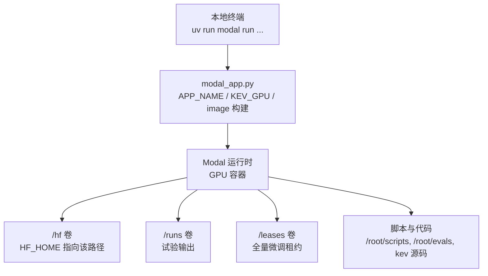
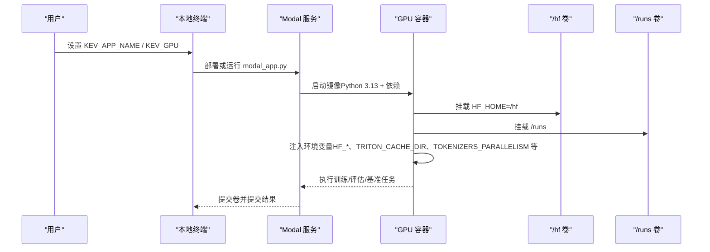
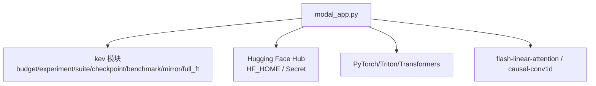

<cite>
**本文引用的文件**   
- [modal_app.py](file://modal_app.py)
- [pyproject.toml](file://pyproject.toml)
- [README.md](file://README.md)
</cite>

## 目录
1. [简介](#简介)
2. [项目结构](#项目结构)
3. [核心组件](#核心组件)
4. [架构总览](#架构总览)
5. [详细组件分析](#详细组件分析)
6. [依赖关系分析](#依赖关系分析)
7. [性能与成本考量](#性能与成本考量)
8. [故障排查指南](#故障排查指南)
9. [结论](#结论)
10. [附录：环境变量清单与最佳实践](#附录环境变量清单与最佳实践)

## 简介
本文面向在 Modal 上运行 Kev 研究任务的开发者，聚焦以下目标：
- 说明 APP_NAME 环境变量设置（默认 `kev-research`）及其对 Modal App 隔离的影响。
- 解释 GPU 类型选择 `KEV_GPU=T4/H100/H200` 的行为、限制与成本影响。
- 文档化容器镜像构建参数：Python 3.13、依赖安装顺序、自定义包配置。
- 梳理关键环境变量：`HF_HOME`、`TRITON_CACHE_DIR`、`TOKENIZERS_PARALLELISM` 等的作用与推荐值。
- 提供可直接复用的配置示例与最佳实践建议。

## 项目结构
Modal 应用的入口位于仓库根目录的 `modal_app.py`，它负责：
- 定义 Modal App 名称与 GPU 类型。
- 构建可复现的容器镜像（基于 Debian Slim + Python 3.13）。
- 挂载持久化卷（Hugging Face 权重缓存、训练输出、租约目录）。
- 暴露训练、评估、基准测试、发布、镜像同步等远程函数。
- 通过本地入口点编排任务并拉取结果。

图表来源
- [modal_app.py:38-75](file://modal_app.py#L38-L75)
- [modal_app.py:76-83](file://modal_app.py#L76-L83)

章节来源
- [modal_app.py:1-83](file://modal_app.py#L1-L83)

## 核心组件
本节聚焦与“应用配置”直接相关的核心内容：App 名称、GPU 类型、镜像构建与环境变量注入。

- APP_NAME（应用名）
  - 由环境变量 `KEV_APP_NAME` 决定；若未设置，则使用默认值 `kev-research`。
  - 该名称用于创建 Modal App，实现不同研究部署之间的隔离。
  - 参考位置：[modal_app.py:38](file://modal_app.py#L38)、[modal_app.py:52](file://modal_app.py#L52)。

- GPU 类型（KEV_GPU）
  - 由环境变量 `KEV_GPU` 决定；默认值为 `H100`。
  - 免费层可使用 `T4`；H100/H200 等高端卡通常需要工作区绑定支付方式。
  - 所有带 GPU 的函数都使用该变量作为默认 GPU 资源。
  - 参考位置：[modal_app.py:42](file://modal_app.py#L42)、[modal_app.py:103-115](file://modal_app.py#L103-L115)。

- 镜像构建（Python 3.13、依赖顺序、自定义包）
  - 基础镜像：Debian Slim + Python 3.13。
  - 系统工具：安装 git。
  - 依赖安装：
    - 使用 uv 同步项目依赖（锁定版本），并额外启用 serve 可选依赖。
    - 安装 flash-linear-attention 与 triton>=3.7.1（解决 Hopper 平台上的内核兼容问题）。
    - 预编译 causal-conv1d wheel（匹配 torch 2.8/CUDA 12/Python 3.13），以 --no-deps 避免覆盖 triton 版本。
    - 安装 pytest（用于 GPU 测试）。
  - 将本地源码、evals、scripts、tests、部分实验配置文件打入镜像。
  - 参考位置：[modal_app.py:54-75](file://modal_app.py#L54-L75)、[pyproject.toml:21-46](file://pyproject.toml#L21-L46)。

- 环境变量注入
  - worker_environment 统一注入 HF_HOME、HF_HUB_DISABLE_PROGRESS_BARS、TOKENIZERS_PARALLELISM、PYTHONUNBUFFERED、TRITON_CACHE_DIR、KEV_APP_NAME、KEV_GPU，以及可选的 KEV_HF_SECRET。
  - 这些环境变量会写入镜像环境，并在各函数执行时生效。
  - 参考位置：[modal_app.py:44-50](file://modal_app.py#L44-L50)、[modal_app.py:67](file://modal_app.py#L67)。

章节来源
- [modal_app.py:38-75](file://modal_app.py#L38-L75)
- [pyproject.toml:21-46](file://pyproject.toml#L21-L46)

## 架构总览
下图展示 Modal 应用从本地到容器的关键流程，以及卷与环境变量的作用范围。

图表来源
- [modal_app.py:44-50](file://modal_app.py#L44-L50)
- [modal_app.py:76-83](file://modal_app.py#L76-L83)
- [modal_app.py:103-115](file://modal_app.py#L103-L115)

## 详细组件分析

### APP_NAME 与 Modal App 隔离
- 行为
  - 当未显式设置 `KEV_APP_NAME` 时，默认使用 `kev-research`。
  - 该名称用于创建 Modal App，从而隔离不同研究部署的资源与状态。
  - 建议在多团队或多项目场景下为每个研究分配独立的应用名，避免依赖计数和启动失败。
- 相关代码
  - 读取与应用创建：[modal_app.py:38](file://modal_app.py#L38)、[modal_app.py:52](file://modal_app.py#L52)。
  - 文档中关于隔离的建议：[README.md:172-184](file://README.md#L172-L184)。

章节来源
- [modal_app.py:38-52](file://modal_app.py#L38-L52)
- [README.md:172-184](file://README.md#L172-L184)

### GPU 类型选择与成本影响
- 行为
  - 默认 GPU 为 `H100`；免费层建议使用 `T4`。
  - 所有需要 GPU 的函数（如训练、评估、基准测试）均继承该默认值，也可通过 local_entrypoint 的参数覆盖。
  - 高算力 GPU（H100/H200/B200）通常涉及更高的每小时费用，且可能需要工作区绑定支付方式。
- 成本与性能参考
  - README 中的“Serving Performance”表格提供了不同模型与 GPU 的延迟与吞吐对比，可用于估算推理成本。
  - 训练与评估的成本还取决于任务时长、并发度与磁盘 I/O。
- 相关代码
  - 默认 GPU 与注释：[modal_app.py:42](file://modal_app.py#L42)。
  - 训练/评估函数的 GPU 使用：[modal_app.py:103-115](file://modal_app.py#L103-L115)、[modal_app.py:179-180](file://modal_app.py#L179-L180)、[modal_app.py:245-246](file://modal_app.py#L245-L246)。
  - 性能表参考：[README.md:355-383](file://README.md#L355-L383)。

章节来源
- [modal_app.py:42-115](file://modal_app.py#L42-L115)
- [README.md:355-383](file://README.md#L355-L383)

### 容器镜像构建参数与依赖顺序
- Python 版本
  - 镜像使用 Python 3.13；项目要求 Python >=3.12,<3.14。
  - 参考位置：[modal_app.py:56](file://modal_app.py#L56)、[pyproject.toml:13](file://pyproject.toml#L13)。
- 依赖安装顺序
  1. apt_install("git")。
  2. uv_sync(uv_project_dir=ROOT, groups=[], extras=["serve"])：使用锁定的依赖安装，并包含 serve 可选依赖。
  3. uv_pip_install("flash-linear-attention==0.5.2", "triton>=3.7.1")：解决 Hopper 平台 Triton 兼容性问题。
  4. uv_pip_install(CAUSAL_CONV1D, extra_options="--no-deps")：预编译 CUDA kernel，避免覆盖 triton。
  5. uv_pip_install("pytest")：支持 GPU 测试。
- 自定义包配置
  - CAUSAL_CONV1D 使用固定 URL 的 wheel，匹配 torch 2.8/CUDA 12/Python 3.13。
  - 通过 --no-deps 防止 pip 解析其依赖时回退到旧版 triton。
- 参考位置
  - 镜像构建与依赖顺序：[modal_app.py:54-75](file://modal_app.py#L54-L75)。
  - 项目依赖声明：[pyproject.toml:21-46](file://pyproject.toml#L21-L46)。

章节来源
- [modal_app.py:54-75](file://modal_app.py#L54-L75)
- [pyproject.toml:21-46](file://pyproject.toml#L21-L46)

### 环境变量配置与作用
- HF_HOME
  - 指向 `/hf`，用于存放 Hugging Face 权重与数据集缓存。
  - 通过 Volume 持久化，避免重复下载。
  - 参考位置：[modal_app.py:41](file://modal_app.py#L41)、[modal_app.py:45](file://modal_app.py#L45)、[modal_app.py:76](file://modal_app.py#L76)。
- TRITON_CACHE_DIR
  - 指向 `/hf/triton-cache`，用于缓存 DeltaNet 内核编译与 autotuning 结果，跨容器复用。
  - 参考位置：[modal_app.py:45-46](file://modal_app.py#L45-L46)。
- TOKENIZERS_PARALLELISM
  - 设置为 false，避免 tokenizer 并行导致的线程竞争与性能抖动。
  - 参考位置：[modal_app.py:45](file://modal_app.py#L45)。
- PYTHONUNBUFFERED
  - 设置为 true，确保日志实时输出，便于调试。
  - 参考位置：[modal_app.py:45](file://modal_app.py#L45)。
- HF_HUB_DISABLE_PROGRESS_BARS
  - 禁用进度条，减少日志噪音。
  - 参考位置：[modal_app.py:45](file://modal_app.py#L45)。
- KEV_APP_NAME / KEV_GPU
  - 在容器内再次注入，保证子进程与脚本能读取到当前应用名与 GPU 类型。
  - 参考位置：[modal_app.py:47](file://modal_app.py#L47)。
- KEV_HF_SECRET
  - 可选，用于挂载 Hugging Face Secret，提供访问 gated 模型的 token。
  - 参考位置：[modal_app.py:48-49](file://modal_app.py#L48-L49)、[modal_app.py:82-83](file://modal_app.py#L82-L83)。

章节来源
- [modal_app.py:41-50](file://modal_app.py#L41-L50)
- [modal_app.py:76-83](file://modal_app.py#L76-L83)

## 依赖关系分析
- 应用层依赖
  - modal_app.py 依赖 modal SDK、kev 模块（budget、experiment、suite、checkpoint、predictors、benchmark、mirror、full_ft 等）。
  - 镜像中通过 add_local_python_source("kev") 将本地 kev 源码打入容器。
- 外部依赖
  - Hugging Face Hub：权重与数据集下载（受 HF_HOME 与 Secret 控制）。
  - PyTorch/Triton/Transformers：模型加载与计算。
  - flash-linear-attention/causal-conv1d：加速 Qwen3.5 混合骨干的内核。
- 潜在循环依赖
  - 镜像构建阶段不导入运行时逻辑，避免循环依赖。
  - 运行时通过延迟 import（如在函数体内 from kev.*）降低冷启动开销。

图表来源
- [modal_app.py:33-36](file://modal_app.py#L33-L36)
- [modal_app.py:54-75](file://modal_app.py#L54-L75)

章节来源
- [modal_app.py:33-36](file://modal_app.py#L33-L36)
- [modal_app.py:54-75](file://modal_app.py#L54-L75)

## 性能与成本考量
- GPU 选择
  - T4：适合轻量 smoke 测试与低成本验证。
  - H100/H200/B200：适合大规模训练与高性能推理，但成本更高。
- 缓存优化
  - HF_HOME 与 TRITON_CACHE_DIR 共享于 /hf 卷，显著减少重复下载与内核编译时间。
- 并发与超时
  - 训练函数设置最大容器数与超时，避免长时间占用资源。
  - 评估与基准测试按 suite 设置超时，避免慢任务阻塞整体流程。
- 体积与 I/O
  - 大权重（如 27B 模型）在加载与合并过程中会产生大量 I/O，建议使用持久卷与合理的 ephemeral_disk 配置。

章节来源
- [modal_app.py:103-115](file://modal_app.py#L103-L115)
- [modal_app.py:179-180](file://modal_app.py#L179-L180)
- [modal_app.py:245-246](file://modal_app.py#L245-L246)
- [README.md:355-383](file://README.md#L355-L383)

## 故障排查指南
- 依赖冲突
  - 若 Triton 版本与 flash-linear-attention 不兼容，检查镜像构建步骤是否按顺序安装 triton>=3.7.1 与 causal-conv1d（--no-deps）。
  - 参考位置：[modal_app.py:60-65](file://modal_app.py#L60-L65)。
- 权限与 Secret
  - 若无法访问 gated 模型，确认已设置 KEV_HF_SECRET 并正确挂载 Secret。
  - 参考位置：[modal_app.py:48-49](file://modal_app.py#L48-L49)、[modal_app.py:82-83](file://modal_app.py#L82-L83)。
- 日志缓冲
  - 若日志输出延迟，确认 PYTHONUNBUFFERED=1 已设置。
  - 参考位置：[modal_app.py:45](file://modal_app.py#L45)。
- 缓存路径
  - 若 Triton 内核未命中缓存，检查 TRITON_CACHE_DIR 是否指向 /hf/triton-cache 且卷已挂载。
  - 参考位置：[modal_app.py:45-46](file://modal_app.py#L45-L46)、[modal_app.py:76](file://modal_app.py#L76)。

章节来源
- [modal_app.py:45-50](file://modal_app.py#L45-L50)
- [modal_app.py:60-65](file://modal_app.py#L60-L65)
- [modal_app.py:76-83](file://modal_app.py#L76-L83)

## 结论
- APP_NAME 通过 `KEV_APP_NAME` 控制 Modal App 隔离，默认 `kev-research`。
- GPU 类型通过 `KEV_GPU` 控制，默认 `H100`；免费层建议使用 `T4`。
- 镜像构建基于 Python 3.13，依赖安装顺序严格，确保 Triton 与 causal-conv1d 兼容性。
- 关键环境变量（HF_HOME、TRITON_CACHE_DIR、TOKENIZERS_PARALLELISM 等）在 worker_environment 中统一注入，提升可重复性与性能。
- 建议在生产环境中为每个研究分配独立 APP_NAME，并根据任务需求选择合适的 GPU 与缓存策略。

## 附录：环境变量清单与最佳实践

- 环境变量清单
  - KEV_APP_NAME：Modal App 名称，默认 `kev-research`。
  - KEV_GPU：GPU 类型，默认 `H100`；免费层使用 `T4`。
  - HF_HOME：Hugging Face 缓存目录，默认 `/hf`。
  - TRITON_CACHE_DIR：Triton 内核缓存目录，默认 `/hf/triton-cache`。
  - TOKENIZERS_PARALLELISM：tokenizer 并行开关，默认 `false`。
  - PYTHONUNBUFFERED：日志缓冲开关，默认 `true`。
  - HF_HUB_DISABLE_PROGRESS_BARS：禁用进度条，默认 `1`。
  - KEV_HF_SECRET：Hugging Face Secret 名称（可选）。

- 最佳实践
  - 为每个研究设置独立的 KEV_APP_NAME，避免部署冲突。
  - 在免费层使用 KEV_GPU=T4 进行快速验证，再切换到 H100/H200 进行正式训练。
  - 保持 HF_HOME 与 TRITON_CACHE_DIR 一致，充分利用持久卷缓存。
  - 在 CI 或自动化流程中显式设置所有环境变量，提高可重复性。
  - 对于 gated 模型，务必配置 KEV_HF_SECRET 并验证 Secret 挂载成功。

章节来源
- [modal_app.py:38-50](file://modal_app.py#L38-L50)
- [modal_app.py:76-83](file://modal_app.py#L76-L83)