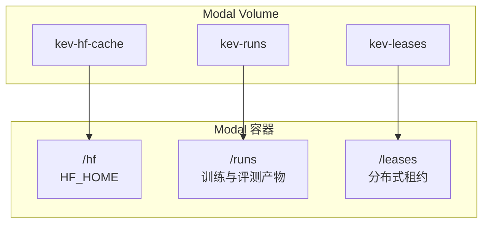
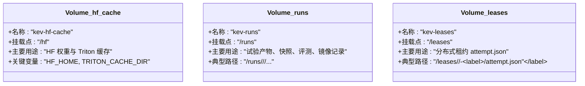
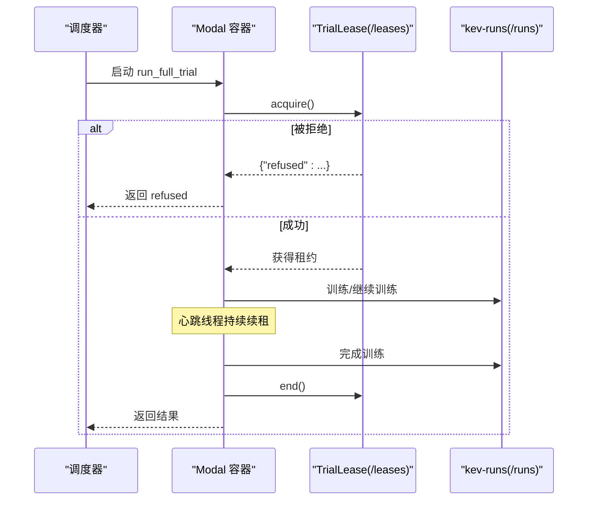
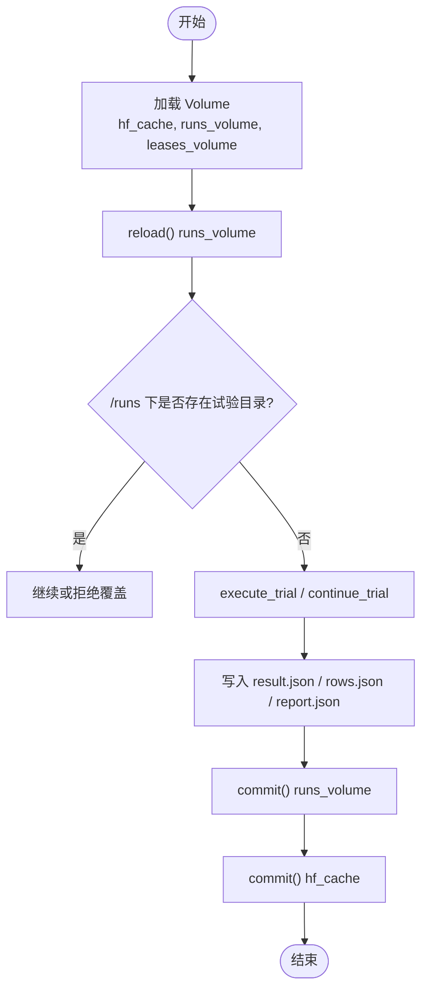
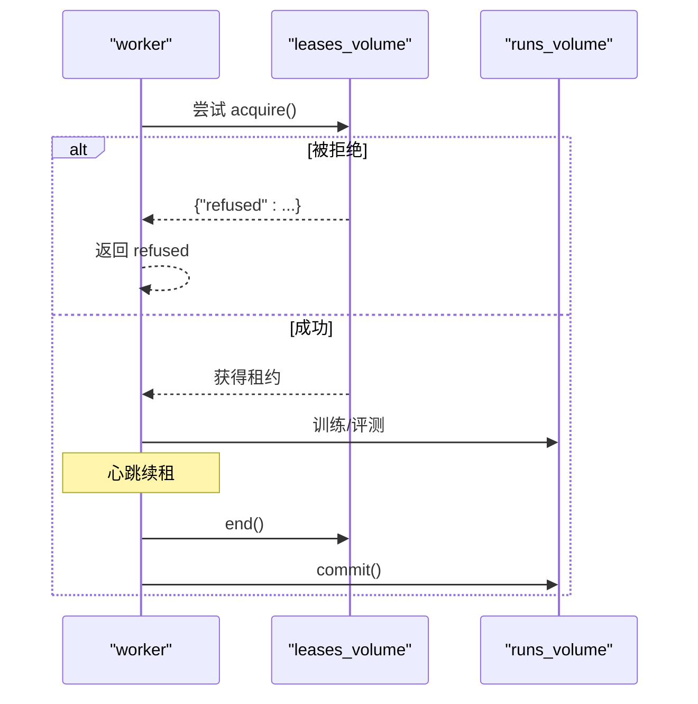
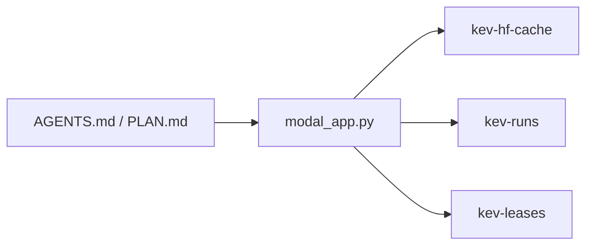

<cite>
**本文引用的文件**   
- [modal_app.py](file://modal_app.py)
- [AGENTS.md](file://AGENTS.md)
- [PLAN.md](file://PLAN.md)
</cite>

## 目录
1. [引言](#引言)
2. [项目结构与 Volume 总览](#项目结构与-volume-总览)
3. [核心 Volume 定义与用途](#核心-volume-定义与用途)
4. [Volume 生命周期管理](#volume-生命周期管理)
5. [权限管理与数据持久化策略](#权限管理与数据持久化策略)
6. [监控、清理与故障恢复最佳实践](#监控清理与故障恢复最佳实践)
7. [架构与调用时序图](#架构与调用时序图)
8. [依赖关系分析](#依赖关系分析)
9. [性能注意事项](#性能注意事项)
10. [结论](#结论)

## 引言
本文面向 Kev 在 Modal 上的训练、评估与发布流程，聚焦三个核心 Volume：
- kev-hf-cache：Hugging Face 模型权重缓存，容器内路径为 /hf。
- kev-runs：训练结果、快照、评测输出等实验产物，容器内路径为 /runs。
- kev-leases：分布式锁（尝试级租约），用于全量微调任务的多实例互斥，容器内路径为 /leases。

文档说明每个 Volume 的职责、生命周期、读写模式、权限与持久化策略，并给出监控、清理与故障恢复的最佳实践。

## 项目结构与 Volume 总览
Kev 的 Modal 应用通过 modal_app.py 声明并挂载三个 Volume；训练与评测函数在容器内以固定路径访问这些 Volume：
- /hf：HF_HOME，用于缓存基础模型权重与 Triton 编译缓存。
- /runs：所有研究试验、快照、评测结果、镜像记录等持久化位置。
- /leases：全量微调尝试的分布式租约文件 attempt.json 所在目录。

**图示来源**
- [modal_app.py:40-81](file://modal_app.py#L40-L81)

**章节来源**
- [modal_app.py:40-81](file://modal_app.py#L40-L81)

## 核心 Volume 定义与用途
- kev-hf-cache
  - 挂载点：/hf
  - 作用：缓存 Hugging Face 基础模型权重、tokenizer、Triton 编译缓存等。
  - 关键环境变量：HF_HOME=/hf；TRITON_CACHE_DIR=/hf/triton-cache。
  - 典型写入者：加载基础模型的训练、评测、基准测试、探针等函数。
- kev-runs
  - 挂载点：/runs
  - 作用：保存试验目录、checkpoint、snapshots、评测 rows/report、locked test 结果、镜像记录等。
  - 典型写入者：run_trial、run_full_trial、run_locked_test、run_mirror、run_interpolate、run_merge_adapter 等。
- kev-leases
  - 挂载点：/leases
  - 作用：存放每个全量微调尝试的 attempt.json，实现多实例互斥与心跳续租。
  - 典型写入者：run_full_trial 中的 TrialLease。

**图示来源**
- [modal_app.py:40-81](file://modal_app.py#L40-L81)

**章节来源**
- [modal_app.py:40-81](file://modal_app.py#L40-L81)

## Volume 生命周期管理
### create_if_missing=True 的作用
- 三个 Volume 均以 create_if_missing=True 创建或获取：
  - hf_cache = modal.Volume.from_name("kev-hf-cache", create_if_missing=True)
  - runs_volume = modal.Volume.from_name("kev-runs", create_if_missing=True)
  - leases_volume = modal.Volume.from_name("kev-leases", create_if_missing=True)
- 含义：若 Volume 不存在则自动创建，避免首次运行因缺失 Volume 而失败；同时确保多个函数共享同一命名 Volume。

**章节来源**
- [modal_app.py:75-81](file://modal_app.py#L75-L81)

### reload() 的使用时机
- 在每次进入需要读取 Volume 数据的函数时先执行 reload()，以确保本地容器看到最新提交的数据：
  - run_attempt：runs_volume.reload()
  - run_locked_test：runs_volume.reload()
  - run_mirror：runs_volume.reload()
  - run_interpolate：runs_volume.reload()
  - run_merge_adapter：runs_volume.reload()
  - run_release_copy：runs_volume.reload()
  - run_release_publish：runs_volume.reload()
- 目的：防止容器启动后对 Volume 的旧视图导致“找不到已提交文件”的问题。

**章节来源**
- [modal_app.py:144-176](file://modal_app.py#L144-L176)
- [modal_app.py:180-227](file://modal_app.py#L180-L227)
- [modal_app.py:272-284](file://modal_app.py#L272-L284)
- [modal_app.py:418-431](file://modal_app.py#L418-L431)
- [modal_app.py:467-480](file://modal_app.py#L467-L480)
- [modal_app.py:667-676](file://modal_app.py#L667-L676)
- [modal_app.py:688-706](file://modal_app.py#L688-L706)

### commit() 的使用时机
- 在写入完成后统一提交 Volume，保证数据一致性：
  - run_attempt：finally 中 runs_volume.commit() 与 hf_cache.commit()
  - run_locked_test：完成 suite 评测后 runs_volume.commit()
  - run_tool：子脚本结束后 runs_volume.commit() 与 hf_cache.commit()
  - run_mirror：上传镜像记录后 runs_volume.commit()
  - run_interpolate：回调 on_done 以及 finally 中 runs_volume.commit()
  - run_merge_adapter：合并完成后 runs_volume.commit()
  - run_release_copy：复制完成后 runs_volume.commit()
  - run_gpu_tests：GPU 测试完成后 hf_cache.commit()
- 注意：全量微调训练中，resume 点与 snapshot 由 VolumeWatcher 与后台线程触发提交，避免在半写状态提交整个 runs volume。

**章节来源**
- [modal_app.py:144-176](file://modal_app.py#L144-L176)
- [modal_app.py:180-227](file://modal_app.py#L180-L227)
- [modal_app.py:230-242](file://modal_app.py#L230-L242)
- [modal_app.py:272-284](file://modal_app.py#L272-L284)
- [modal_app.py:418-431](file://modal_app.py#L418-L431)
- [modal_app.py:467-480](file://modal_app.py#L467-L480)
- [modal_app.py:667-676](file://modal_app.py#L667-L676)
- [modal_app.py:383-389](file://modal_app.py#L383-L389)

### 分布式租约与心跳
- 全量微调尝试使用 /leases/<study>/<index>-<label>/attempt.json 作为分布式锁。
- 每个尝试持有 lease，并在独立线程中周期性心跳续租；正常退出时结束 lease。
- 如果另一个尝试的 lease 仍然新鲜，新尝试会返回 refused，不覆盖已有 trial。
- 超时中断后，下一次 continue_full_trial 会等待旧 lease 结束或过期，再启动新的尝试。

**图示来源**
- [modal_app.py:118-142](file://modal_app.py#L118-L142)

**章节来源**
- [modal_app.py:118-142](file://modal_app.py#L118-L142)
- [AGENTS.md:99-100](file://AGENTS.md#L99-L100)

## 权限管理与数据持久化策略
### 权限与 Secret
- HF_TOKEN 通过 Modal Secret 注入：
  - 运行时通过 os.environ["KEV_HF_SECRET"] 指定 Secret 名称。
  - 镜像环境变量 KEV_HF_SECRET 在 worker_environment 中传播。
  - run_mirror 与 release_publish 使用 MIRROR_SECRET（默认 huggingface-secret）。
- 公开验证路径（release_verify）在无 Secret、无 kev-hf-cache Volume 的情况下，使用临时 HF_HOME 与匿名方式验证公开 checkpoint。

**章节来源**
- [modal_app.py:44-50](file://modal_app.py#L44-L50)
- [modal_app.py:82-83](file://modal_app.py#L82-L83)
- [modal_app.py:722-746](file://modal_app.py#L722-L746)

### 数据持久化策略
- kev-hf-cache
  - 持久化基础模型权重与 Triton 编译缓存，减少重复下载与编译成本。
  - 在训练、评测、基准测试、GPU 测试等函数结束时提交 hf_cache.commit()。
- kev-runs
  - 试验产物、快照、评测结果、镜像记录均持久化到 /runs。
  - 大权重文件（model*.safetensors）与 resume 点通常留在 Volume 上，本地 pull 默认跳过，除非显式 --weights。
  - 快照与最终 checkpoint 由 VolumeWatcher 与后台线程在关键点提交，避免半写状态。
- kev-leases
  - 仅存储轻量 attempt.json 与心跳信息，不与 runs volume 一起提交，避免提交半写 checkpoint。

**章节来源**
- [modal_app.py:40-81](file://modal_app.py#L40-L81)
- [modal_app.py:144-176](file://modal_app.py#L144-L176)
- [modal_app.py:529-562](file://modal_app.py#L529-L562)
- [modal_app.py:795-800](file://modal_app.py#L795-L800)

## 监控、清理与故障恢复最佳实践
### 监控
- 观察 /runs/<study>/<trial>/result.json、failed.json、snapshot.json、training_metrics.json。
- 观察 /leases/<study>/<index>-<label>/attempt.json 的心跳与状态。
- 使用 modal_app.py::pull 拉取试验结果；默认跳过大权重与 resume 点，避免本地磁盘压力。

### 清理
- 不要随意删除 /runs 下的 checkpoint 或 snapshots，除非明确知道其影响。
- 大权重与 resume 点建议保留在 Volume 上，本地只拉取必要文件。
- 如需清理，应评估其对后续 resume、snapshot 选择与 Hub mirror 的影响。

### 故障恢复
- 训练异常：
  - 非超时错误会写入 failed.json，不再继续训练。
  - 超时中断后，下一次 continue_full_trial 从最近提交的 resume 点继续。
- 分布式锁冲突：
  - 若发现 attempt.json 仍活跃，等待旧尝试结束或过期后再启动新尝试。
- 数据不一致：
  - 每次进入函数前调用 reload()，确保看到最新提交数据。
  - 写入完成后统一 commit()，避免部分提交。

**章节来源**
- [modal_app.py:144-176](file://modal_app.py#L144-L176)
- [modal_app.py:529-562](file://modal_app.py#L529-L562)
- [AGENTS.md:99-115](file://AGENTS.md#L99-L115)

## 架构与调用时序图
### 训练与评测主流程

**图示来源**
- [modal_app.py:144-176](file://modal_app.py#L144-L176)

**章节来源**
- [modal_app.py:144-176](file://modal_app.py#L144-L176)

### 分布式锁流程

**图示来源**
- [modal_app.py:118-142](file://modal_app.py#L118-L142)

**章节来源**
- [modal_app.py:118-142](file://modal_app.py#L118-L142)

## 依赖关系分析
- modal_app.py 是 Volume 挂载与使用的中心：
  - 声明 hf_cache、runs_volume、leases_volume。
  - 在训练、评测、镜像、插值、合并、发布等函数中读写 Volume。
- AGENTS.md 与 PLAN.md 提供背景与约束：
  - AGENTS.md 描述 Volume 用途、Secret 配置、pull 行为、分布式锁机制。
  - PLAN.md 强调 checkpoints 与 snapshots 的持久化与镜像策略。

**图示来源**
- [modal_app.py:75-81](file://modal_app.py#L75-L81)
- [AGENTS.md:245-253](file://AGENTS.md#L245-L253)
- [PLAN.md:363-365](file://PLAN.md#L363-L365)

**章节来源**
- [modal_app.py:75-81](file://modal_app.py#L75-L81)
- [AGENTS.md:245-253](file://AGENTS.md#L245-L253)
- [PLAN.md:363-365](file://PLAN.md#L363-L365)

## 性能注意事项
- 大权重与 resume 点：
  - model*.safetensors 与 resume 点通常留在 Volume 上，本地 pull 默认跳过，避免本地磁盘与网络压力。
  - 如需本地复现完整 checkpoint，使用 --weights 拉取全部文件。
- 提交频率：
  - 频繁 commit() 会增加 I/O 开销；建议在关键节点提交，如训练步骤完成、snapshot 完成、评测完成。
- 并发与锁：
  - 全量微调尝试通过 /leases 实现互斥，避免多实例同时写入同一试验目录。
- 缓存命中：
  - kev-hf-cache 可显著减少基础模型下载与 Triton 编译时间，建议复用同一 Volume。

**章节来源**
- [modal_app.py:529-562](file://modal_app.py#L529-L562)
- [modal_app.py:144-176](file://modal_app.py#L144-L176)
- [modal_app.py:118-142](file://modal_app.py#L118-L142)

## 结论
- kev-hf-cache、kev-runs、kev-leases 分别承担权重缓存、试验产物与分布式锁职责。
- create_if_missing=True 确保 Volume 首次可用；reload() 与 commit() 保证数据一致性与可见性。
- 权限通过 Modal Secret 管理，数据持久化遵循“大文件留 Volume、小文件可本地拉取”的策略。
- 监控与故障恢复围绕 result.json、failed.json、attempt.json 与 VolumeWatcher 展开。
- 最佳实践包括：谨慎清理、合理提交、利用缓存、避免并发冲突。