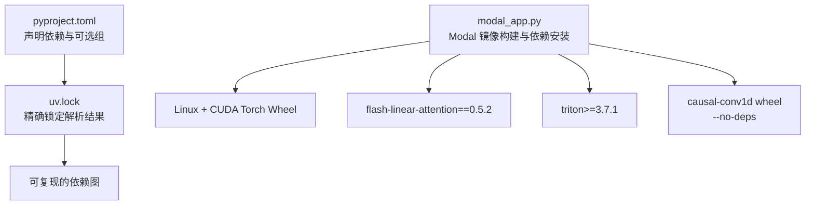
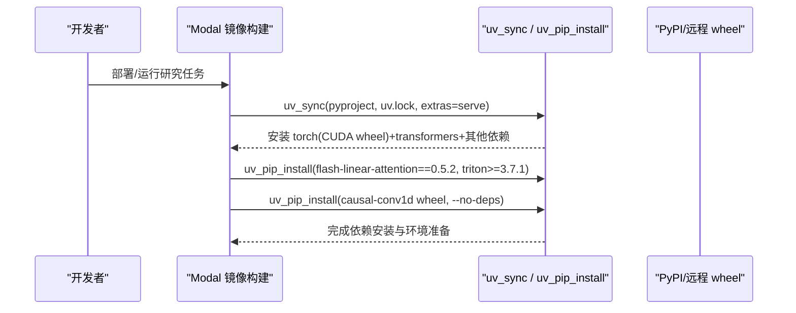
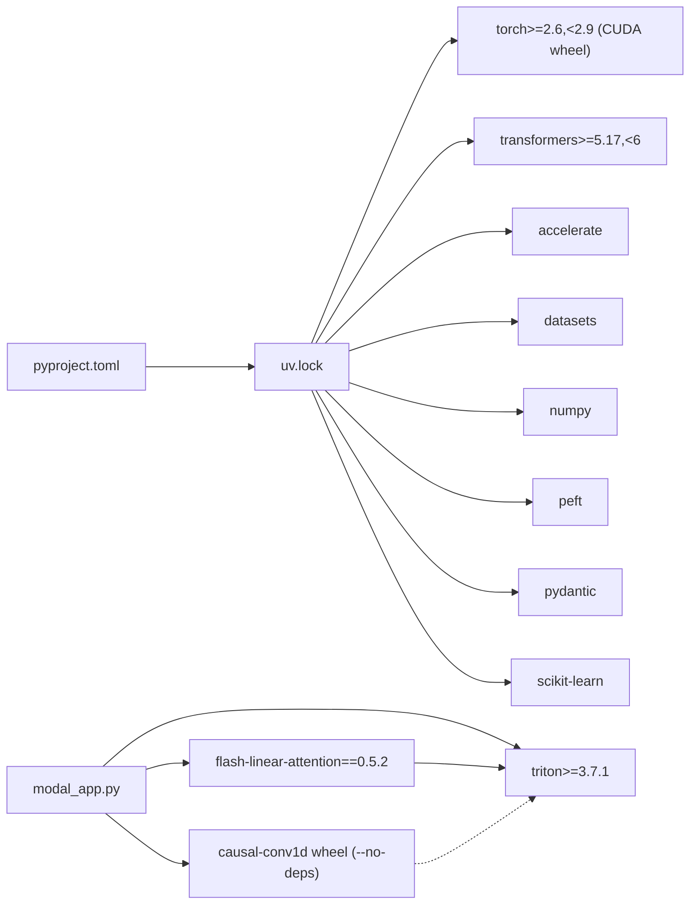

# 依赖管理

<cite>
**本文引用的文件**   
- [pyproject.toml](file://pyproject.toml)
- [uv.lock](file://uv.lock)
- [modal_app.py](file://modal_app.py)
- [AGENTS.md](file://AGENTS.md)
</cite>

## 目录
1. [简介](#简介)
2. [项目结构](#项目结构)
3. [核心组件](#核心组件)
4. [架构总览](#架构总览)
5. [详细组件分析](#详细组件分析)
6. [依赖关系分析](#依赖关系分析)
7. [性能考虑](#性能考虑)
8. [故障排查指南](#故障排查指南)
9. [结论](#结论)

## 简介
本文面向 Kev 项目的依赖管理，聚焦以下目标：
- Python 3.12/3.13 环境要求与约束。
- PyTorch 与 CUDA 构建选择、版本区间。
- transformers 库版本要求。
- uv_sync 与 uv_pip_install 的使用方式：精确锁定依赖、CUDA 构建选择、flash-linear-attention 与 triton 的特殊处理。
- 自定义包安装：causal-conv1d wheel 的预构建版本、--no-deps 的作用。
- 依赖冲突解决方案与性能优化建议。

## 项目结构
Kev 使用基于 pyproject.toml 的声明式依赖，并通过 uv.lock 进行精确锁定；在 Modal 云端 GPU 环境中通过 modal_app.py 定义镜像构建流程，统一安装依赖并注入环境变量。

图表来源
- [pyproject.toml:5-30](file://pyproject.toml#L5-L30)
- [modal_app.py:54-75](file://modal_app.py#L54-L75)

章节来源
- [pyproject.toml:5-30](file://pyproject.toml#L5-L30)
- [modal_app.py:54-75](file://modal_app.py#L54-L75)

## 核心组件
- Python 版本要求：requires-python = ">=3.12,<3.14"，本地开发推荐 3.13（受 torch wheel 支持限制）。
- 核心依赖：torch>=2.6,<2.9；transformers>=5.17,<6；accelerate、datasets、numpy、peft、pydantic、scikit-learn。
- 可选依赖：serve（FastAPI、typesafe-sdk、uvicorn、darwin arm64 下的 mlx-lm）；mlx（darwin arm64 下的 mlx-lm）。
- 开发依赖：httpx、matplotlib、modal==1.5.5、pytest。

章节来源
- [pyproject.toml:5-30](file://pyproject.toml#L5-L30)
- [pyproject.toml:37-54](file://pyproject.toml#L37-L54)
- [AGENTS.md:14-17](file://AGENTS.md#L14-L17)

## 架构总览
Modal 镜像构建流程将“精确锁定的依赖”与“GPU 加速内核”组合在一起：
- uv_sync 从 pyproject.toml 与 uv.lock 同步依赖，Linux 下自动选择 CUDA 版本的 torch wheel。
- uv_pip_install 安装 flash-linear-attention 与 triton，确保 fused Qwen3.5 内核可用。
- 单独安装 causal-conv1d 的预构建 wheel，并使用 --no-deps 避免覆盖已安装的 triton。

图表来源
- [modal_app.py:54-75](file://modal_app.py#L54-L75)

章节来源
- [modal_app.py:54-75](file://modal_app.py#L54-L75)

## 详细组件分析

### Python 与 PyTorch/CUDA 版本约束
- Python：>=3.12,<3.14；本地 .python-version 与文档建议使用 3.13。
- PyTorch：>=2.6,<2.9；Linux 上通过 uv_sync 选择 CUDA 构建的 wheel。
- transformers：>=5.17,<6；与 peft>=0.21 配合用于 LoRA/全量微调路径。

章节来源
- [pyproject.toml:13-30](file://pyproject.toml#L13-L30)
- [AGENTS.md:14-17](file://AGENTS.md#L14-L17)
- [modal_app.py:58-61](file://modal_app.py#L58-L61)

### uv_sync：精确锁定依赖与 CUDA 构建选择
- uv_sync 读取 pyproject.toml 与 uv.lock，按 extras=["serve"] 安装服务相关依赖。
- Linux 环境下，torch wheel 为 CUDA 构建，便于后续 CUDA 训练与推理。
- uv.lock 提供确定性解析结果，保证不同机器/时间点的依赖一致。

章节来源
- [modal_app.py:58-70](file://modal_app.py#L58-L70)
- [uv.lock:1-8](file://uv.lock#L1-L8)

### uv_pip_install：flash-linear-attention 与 triton 的特殊处理
- flash-linear-attention==0.5.2：fused Qwen3.5 内核需要该固定版本；kev.fused_qwen35 会修补 fla 的 kernel launch。
- triton>=3.7.1：Hopper 架构上旧版 triton 存在不正确结果问题；torch 2.8 默认 pin 到 triton 3.4，因此必须显式升级 triton。
- 顺序很重要：先安装 fla 与 triton，再安装 causal-conv1d，避免其依赖解析重新引入旧 triton。

章节来源
- [modal_app.py:59-65](file://modal_app.py#L59-L65)
- [AGENTS.md:242-246](file://AGENTS.md#L242-L246)

### 自定义包安装：causal-conv1d wheel 与 --no-deps
- 使用预构建 wheel：https://github.com/Dao-AILab/causal-conv1d/releases/download/v1.7.0/causal_conv1d-1.7.0%2Bcu12torch2.8cxx11abiTRUE-cp313-cp313-linux_x86_64.whl
- 匹配条件：CUDA 12、torch 2.8、Python 3.13、Linux x86_64。
- --no-deps：阻止 pip 解析并安装 causal-conv1d 对 torch/triton 的依赖，从而避免回退到 torch 绑定的 triton 3.4，导致 fla 在 Hopper 上失败。

章节来源
- [modal_app.py:54-65](file://modal_app.py#L54-L65)

### 依赖冲突解决方案
- 冲突点：causal-conv1d 的依赖可能拉入 torch 绑定的 triton 3.4，与 fla 在 Hopper 上的兼容性冲突。
- 解决策略：
  - 先安装 flash-linear-attention==0.5.2 与 triton>=3.7.1。
  - 再安装 causal-conv1d wheel，并加 --no-deps。
- 验证要点：
  - 确认 triton 版本 >=3.7.1。
  - 确认 torch 版本在 >=2.6,<2.9 范围内。
  - 确认 CUDA 驱动与 torch CUDA build 兼容。

章节来源
- [modal_app.py:59-65](file://modal_app.py#L59-L65)
- [AGENTS.md:242-246](file://AGENTS.md#L242-L246)

### 性能优化建议
- 启用 CUDA 与 fused kernels：
  - 通过 serve extra 安装 FastAPI 等依赖，并在 GPU 容器中使用 CUDA wheel。
  - 保持 flash-linear-attention==0.5.2 与 triton>=3.7.1，以启用 DeltaNet 融合内核。
- Triton 缓存：
  - 设置 TRITON_CACHE_DIR 到持久卷，复用编译后的 kernel 与 autotuning 结果，减少冷启动开销。
- 长上下文路径：
  - 注意 long-row 路径可能走 memory-efficient kernel，影响精度与内存占用；对比测试时保持内核集合一致。

章节来源
- [modal_app.py:45-47](file://modal_app.py#L45-L47)
- [modal_app.py:58-65](file://modal_app.py#L58-L65)
- [AGENTS.md:425-438](file://AGENTS.md#L425-L438)

## 依赖关系分析
下图展示关键依赖之间的耦合关系与安装顺序。

图表来源
- [pyproject.toml:21-30](file://pyproject.toml#L21-L30)
- [modal_app.py:58-65](file://modal_app.py#L58-L65)

章节来源
- [pyproject.toml:21-30](file://pyproject.toml#L21-L30)
- [modal_app.py:58-65](file://modal_app.py#L58-L65)

## 性能考虑
- 依赖层面：
  - 使用 CUDA wheel 的 torch，避免 CPU-only 路径。
  - 固定 flash-linear-attention 与 triton 版本，确保 fused kernels 可用且行为稳定。
- 运行时层面：
  - 预热 Triton kernel（首次 step 或首次 pass），利用 TRITON_CACHE_DIR 提升后续性能。
  - 长上下文场景注意 kernel 切换带来的精度差异，比较时需对齐内核集合。

[本节为通用指导，不直接分析具体文件]

## 故障排查指南
- 症状：Hopper 上 fla 返回错误结果或导入失败。
  - 检查 triton 版本是否 >=3.7.1。
  - 确认未因 causal-conv1d 的依赖解析被替换为 triton 3.4。
- 症状：torch CUDA 不可用或版本不符。
  - 确认 torch 版本在 >=2.6,<2.9。
  - 确认 Linux 上安装的是 CUDA wheel。
- 症状：causal-conv1d 导入失败或性能退化。
  - 确认安装了匹配的 wheel（cu12/torch2.8/cp313/linux_x86_64）。
  - 确认使用了 --no-deps。

章节来源
- [modal_app.py:59-65](file://modal_app.py#L59-L65)
- [AGENTS.md:242-246](file://AGENTS.md#L242-L246)

## 结论
Kev 的依赖管理以 pyproject.toml 与 uv.lock 为核心，结合 modal_app.py 的镜像构建流程，实现：
- 精确锁定依赖，保证跨环境一致性。
- 在 Linux 上自动选择 CUDA 版本的 torch wheel。
- 通过 flash-linear-attention==0.5.2 与 triton>=3.7.1 启用 fused Qwen3.5 内核。
- 使用 causal-conv1d 预构建 wheel 并配合 --no-deps，避免 triton 版本冲突。
遵循上述约束与步骤，可在本地与 Modal GPU 环境中获得稳定、高性能的依赖与运行环境。