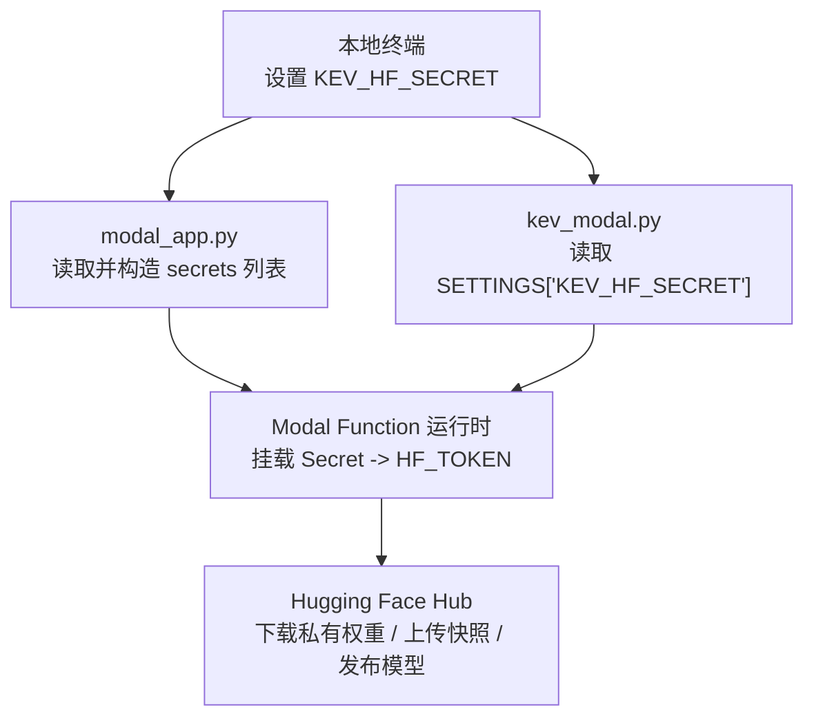
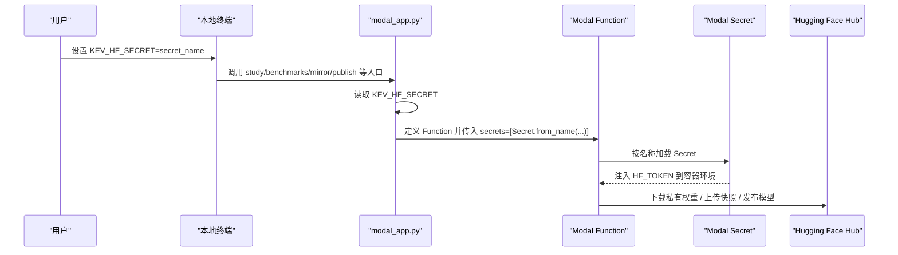
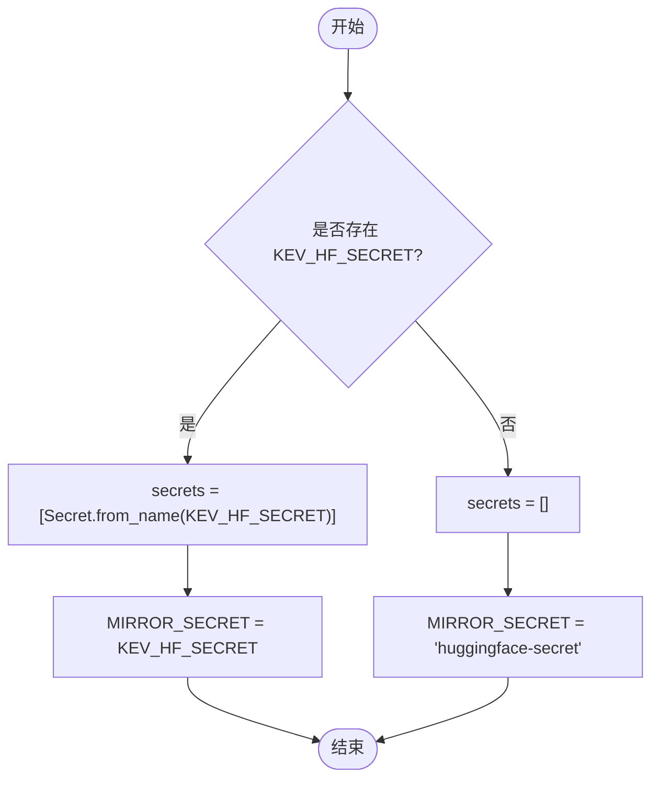
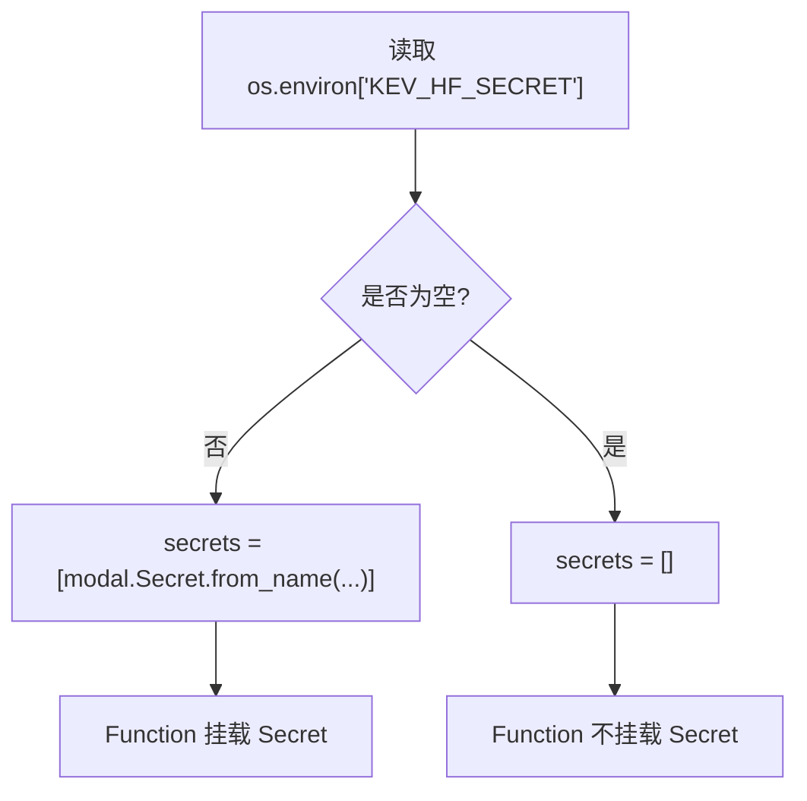
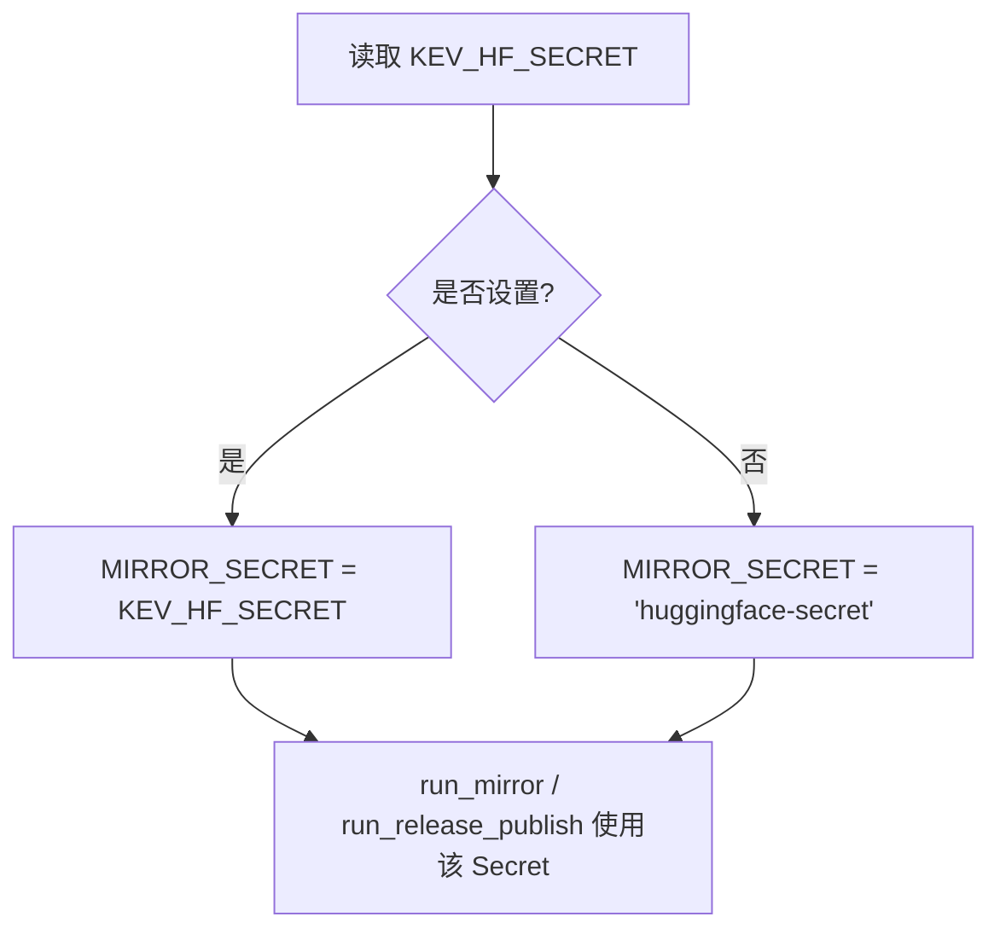
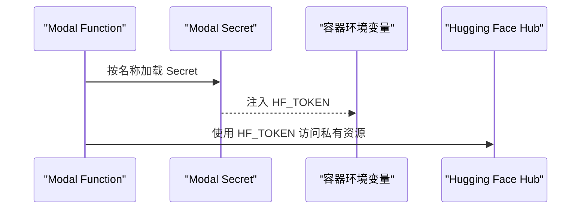
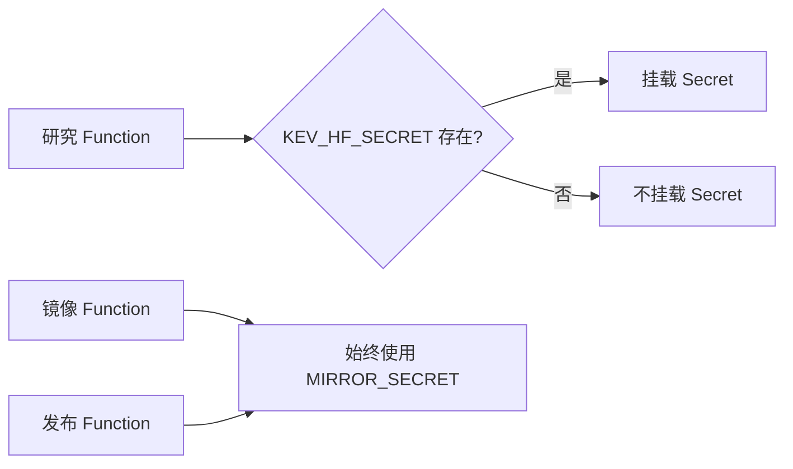
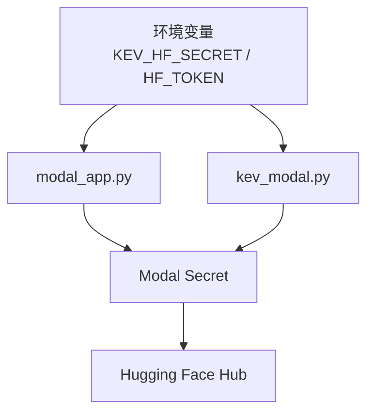

# 密钥与安全

<cite>
**本文引用的文件**   
- [modal_app.py](file://modal_app.py)
- [kev_modal.py](file://skills/kev-finetune/scripts/kev_modal.py)
- [AGENTS.md](file://AGENTS.md)
</cite>

## 目录
1. [引言](#引言)
2. [项目结构与密钥边界](#项目结构与密钥边界)
3. [核心组件与职责](#核心组件与职责)
4. [架构总览](#架构总览)
5. [详细组件分析](#详细组件分析)
6. [依赖关系分析](#依赖关系分析)
7. [性能与可靠性考量](#性能与可靠性考量)
8. [故障排查指南](#故障排查指南)
9. [结论](#结论)
10. [附录：配置清单与最佳实践](#附录配置清单与最佳实践)

## 引言
本文聚焦 KEV 在 Modal 环境中的密钥与安全机制，重点说明以下目标：
- KEV_HF_SECRET 环境变量的含义、来源与传播路径。
- Hugging Face Token（HF_TOKEN）的管理方式与 Secret 名称映射。
- secrets 列表的构建逻辑：条件性 Secret 注入与 MIRROR_SECRET 的默认值处理。
- 安全最佳实践：Token 轮换策略、访问控制、审计日志。
- 常见问题与解决方案：Token 过期、权限不足等错误排查。

本仓库通过 Modal 运行训练、评测、镜像与发布流程；Hugging Face Token 以 Modal Secret 的形式注入容器，避免将敏感值写入代码或镜像。

## 项目结构与密钥边界
- 研究编排入口：modal_app.py
  - 负责研究任务、评测、基准、镜像上传、发布等 Modal Function 的定义与调度。
  - 使用环境变量 KEV_HF_SECRET 决定是否需要挂载一个携带 HF_TOKEN 的 Modal Secret。
- 微调技能脚本：skills/kev-finetune/scripts/kev_modal.py
  - 面向用户的微调工作流，同样通过 KEV_HF_SECRET 决定是否挂载 Secret，并在 publish 时校验 HF_TOKEN。
- 文档与约定：AGENTS.md
  - 描述研究流程、Modal 使用方式、Secret 的使用场景与注意事项。

图示来源
- [modal_app.py:44-50](file://modal_app.py#L44-L50)
- [modal_app.py:82-83](file://modal_app.py#L82-L83)
- [modal_app.py:272-273](file://modal_app.py#L272-L273)
- [modal_app.py:688-693](file://modal_app.py#L688-L693)
- [kev_modal.py:29-33](file://skills/kev-finetune/scripts/kev_modal.py#L29-L33)
- [kev_modal.py:62-64](file://skills/kev-finetune/scripts/kev_modal.py#L62-L64)
- [kev_modal.py:384-403](file://skills/kev-finetune/scripts/kev_modal.py#L384-L403)

章节来源
- [modal_app.py:1-18](file://modal_app.py#L1-L18)
- [modal_app.py:44-50](file://modal_app.py#L44-L50)
- [modal_app.py:82-83](file://modal_app.py#L82-L83)
- [modal_app.py:272-273](file://modal_app.py#L272-L273)
- [modal_app.py:688-693](file://modal_app.py#L688-L693)
- [kev_modal.py:29-33](file://skills/kev-finetune/scripts/kev_modal.py#L29-L33)
- [kev_modal.py:62-64](file://skills/kev-finetune/scripts/kev_modal.py#L62-L64)
- [kev_modal.py:384-403](file://skills/kev-finetune/scripts/kev_modal.py#L384-L403)
- [AGENTS.md:107-109](file://AGENTS.md#L107-L109)

## 核心组件与职责
- modal_app.py
  - worker_environment：向容器注入应用名、GPU、以及可选的 KEV_HF_SECRET。
  - secrets 列表：当存在 KEV_HF_SECRET 时，构造包含该 Secret 的列表，供需要访问 Hugging Face 的 Function 挂载。
  - MIRROR_SECRET：用于 run_mirror 与 run_release_publish 的 Secret 名称；若未显式设置 KEV_HF_SECRET，则回退到默认名称 huggingface-secret。
  - run_mirror：CPU 任务，将完整检查点目录镜像到私有 Hub 仓库，使用 MIRROR_SECRET 提供的 HF_TOKEN。
  - run_release_publish：发布已暂存检查点到 Hub，同样使用 MIRROR_SECRET。
- skills/kev-finetune/scripts/kev_modal.py
  - SETTINGS：记录启动期配置，包括 KEV_HF_SECRET（仅名称，不携带值）。
  - hf_secret：根据 SETTINGS["KEV_HF_SECRET"] 是否非空，决定是否挂载 Secret。
  - run_publish：在容器内要求 HF_TOKEN 存在，否则抛出错误；通过 kev.publish 上传模型。

章节来源
- [modal_app.py:44-50](file://modal_app.py#L44-L50)
- [modal_app.py:82-83](file://modal_app.py#L82-L83)
- [modal_app.py:272-273](file://modal_app.py#L272-L273)
- [modal_app.py:688-693](file://modal_app.py#L688-L693)
- [kev_modal.py:29-33](file://skills/kev-finetune/scripts/kev_modal.py#L29-L33)
- [kev_modal.py:62-64](file://skills/kev-finetune/scripts/kev_modal.py#L62-L64)
- [kev_modal.py:384-403](file://skills/kev-finetune/scripts/kev_modal.py#L384-L403)

## 架构总览
下图展示从本地设置 KEV_HF_SECRET，到容器内使用 HF_TOKEN 访问 Hugging Face 的关键路径。

图示来源
- [modal_app.py:44-50](file://modal_app.py#L44-L50)
- [modal_app.py:82-83](file://modal_app.py#L82-L83)
- [modal_app.py:272-273](file://modal_app.py#L272-L273)
- [modal_app.py:688-693](file://modal_app.py#L688-L693)

## 详细组件分析

### KEV_HF_SECRET 环境变量与 Secret 名称映射
- 作用
  - 指定 Modal Secret 的名称，该 Secret 中应包含键 HF_TOKEN。
  - 仅在需要访问 Hugging Face 的 Function 上挂载该 Secret。
- 传播路径
  - worker_environment：当传入 secret_name 时，将 KEV_HF_SECRET 写入容器环境变量。
  - 镜像构建阶段：image.env 会读取当前环境的 KEV_HF_SECRET，以便后续 Function 可复用。
  - secrets 列表：若存在 KEV_HF_SECRET，则构造 secrets=[modal.Secret.from_name(os.environ["KEV_HF_SECRET"])]。
- 默认行为
  - 对于 run_mirror 与 run_release_publish，MIRROR_SECRET 优先使用 KEV_HF_SECRET；若未设置，则回退为 huggingface-secret。

图示来源
- [modal_app.py:44-50](file://modal_app.py#L44-L50)
- [modal_app.py:82-83](file://modal_app.py#L82-L83)

章节来源
- [modal_app.py:44-50](file://modal_app.py#L44-L50)
- [modal_app.py:82-83](file://modal_app.py#L82-L83)

### secrets 列表的构建逻辑
- 条件性注入
  - 当 os.environ.get("KEV_HF_SECRET") 非空时，secrets 列表包含对应 Secret。
  - 否则 secrets 为空列表，Function 不会挂载任何 Secret。
- 影响范围
  - 所有需要访问 Hugging Face 的 Function（如 run_trial、run_bench、run_base_probe、run_mirror、run_release_publish 等）均使用 secrets 列表或显式 from_name(MIRROR_SECRET)。
- 风险点
  - 如果本地设置了 KEV_HF_SECRET，但未正确传播到 Worker 镜像，可能导致依赖数量不一致的错误。

图示来源
- [modal_app.py:82-83](file://modal_app.py#L82-L83)

章节来源
- [modal_app.py:82-83](file://modal_app.py#L82-L83)

### MIRROR_SECRET 的默认值处理
- 用途
  - run_mirror 与 run_release_publish 始终使用 MIRROR_SECRET 指定的 Secret。
- 默认值
  - 若 KEV_HF_SECRET 未设置，则 MIRROR_SECRET 默认为 huggingface-secret。
- 原因
  - 这些 CPU 任务需要 HF_TOKEN 来上传快照或发布模型；即使研究 Function 不需要 Secret，镜像相关任务仍需要。

图示来源
- [modal_app.py:82-83](file://modal_app.py#L82-L83)
- [modal_app.py:272-273](file://modal_app.py#L272-L273)
- [modal_app.py:688-693](file://modal_app.py#L688-L693)

章节来源
- [modal_app.py:82-83](file://modal_app.py#L82-L83)
- [modal_app.py:272-273](file://modal_app.py#L272-L273)
- [modal_app.py:688-693](file://modal_app.py#L688-L693)

### Hugging Face Token 管理
- 存储位置
  - HF_TOKEN 存储在 Modal Secret 的值中，Secret 名称由 KEV_HF_SECRET 指定。
- 注入方式
  - Modal Function 启动时，按 Secret 名称加载并注入 HF_TOKEN 到容器环境变量。
- 校验
  - kev_modal.py 的 run_publish 会在容器内检查 HF_TOKEN 是否存在，不存在则抛出错误。
- 使用场景
  - 下载私有基础权重。
  - 上传快照到私有 Hub 仓库。
  - 发布模型到 Hub。

图示来源
- [modal_app.py:82-83](file://modal_app.py#L82-L83)
- [modal_app.py:272-273](file://modal_app.py#L272-L273)
- [modal_app.py:688-693](file://modal_app.py#L688-L693)
- [kev_modal.py:384-403](file://skills/kev-finetune/scripts/kev_modal.py#L384-L403)

章节来源
- [modal_app.py:82-83](file://modal_app.py#L82-L83)
- [modal_app.py:272-273](file://modal_app.py#L272-L273)
- [modal_app.py:688-693](file://modal_app.py#L688-L693)
- [kev_modal.py:384-403](file://skills/kev-finetune/scripts/kev_modal.py#L384-L403)

### 条件性 Secret 注入与镜像任务
- 研究 Function
  - 仅在存在 KEV_HF_SECRET 时挂载 Secret。
- 镜像与发布 Function
  - 始终使用 MIRROR_SECRET，确保即使研究 Function 不需要 Secret，镜像与发布仍可正常工作。

图示来源
- [modal_app.py:82-83](file://modal_app.py#L82-L83)
- [modal_app.py:272-273](file://modal_app.py#L272-L273)
- [modal_app.py:688-693](file://modal_app.py#L688-L693)

章节来源
- [modal_app.py:82-83](file://modal_app.py#L82-L83)
- [modal_app.py:272-273](file://modal_app.py#L272-L273)
- [modal_app.py:688-693](file://modal_app.py#L688-L693)

## 依赖关系分析
- 环境变量依赖
  - KEV_HF_SECRET：决定是否需要挂载 Secret。
  - HF_TOKEN：由 Modal Secret 注入，被 Hugging Face SDK 使用。
- 模块依赖
  - modal_app.py 依赖 modal.Secret.from_name 加载 Secret。
  - kev_modal.py 依赖 SETTINGS["KEV_HF_SECRET"] 和 os.environ["HF_TOKEN"]。
- 外部依赖
  - Hugging Face Hub：用于下载私有权重、上传快照、发布模型。

图示来源
- [modal_app.py:82-83](file://modal_app.py#L82-L83)
- [modal_app.py:272-273](file://modal_app.py#L272-L273)
- [modal_app.py:688-693](file://modal_app.py#L688-L693)
- [kev_modal.py:29-33](file://skills/kev-finetune/scripts/kev_modal.py#L29-L33)
- [kev_modal.py:62-64](file://skills/kev-finetune/scripts/kev_modal.py#L62-L64)
- [kev_modal.py:384-403](file://skills/kev-finetune/scripts/kev_modal.py#L384-L403)

章节来源
- [modal_app.py:82-83](file://modal_app.py#L82-L83)
- [modal_app.py:272-273](file://modal_app.py#L272-L273)
- [modal_app.py:688-693](file://modal_app.py#L688-L693)
- [kev_modal.py:29-33](file://skills/kev-finetune/scripts/kev_modal.py#L29-L33)
- [kev_modal.py:62-64](file://skills/kev-finetune/scripts/kev_modal.py#L62-L64)
- [kev_modal.py:384-403](file://skills/kev-finetune/scripts/kev_modal.py#L384-L403)

## 性能与可靠性考量
- 镜像任务超时
  - run_mirror 设置较长超时，以支持大权重上传。
- 重试策略
  - mirror 逻辑对上传失败进行有限重试，但不让训练因镜像失败而中断。
- 体积与缓存
  - HF_HOME 指向共享缓存卷，减少重复下载成本。
- 容器隔离
  - 每个 Function 独立运行，Secret 仅按需挂载，降低泄露面。

章节来源
- [modal_app.py:269-284](file://modal_app.py#L269-L284)
- [modal_app.py:688-706](file://modal_app.py#L688-L706)

## 故障排查指南
- 常见错误：Worker 依赖数量不一致
  - 现象：提示 Worker 依赖图收到的对象 ID 数量与环境变量不一致。
  - 原因：本地设置了 KEV_HF_SECRET，但未传播到 Worker 镜像。
  - 解决：确保 KEV_HF_SECRET 在镜像构建时被写入 image.env，或通过 worker_environment 正确传播。
- 常见错误：容器内缺少 HF_TOKEN
  - 现象：publish 时报错，提示容器中没有 HF_TOKEN。
  - 原因：未设置 KEV_HF_SECRET，或 Secret 名称不正确。
  - 解决：创建 Modal Secret，包含 HF_TOKEN，并通过 KEV_HF_SECRET 指定其名称。
- 常见错误：权限不足
  - 现象：无法下载私有权重或上传到私有仓库。
  - 原因：HF_TOKEN 权限不足或 Secret 名称错误。
  - 解决：检查 Secret 中的 HF_TOKEN 是否具有相应仓库的读写权限。
- 常见错误：Token 过期
  - 现象：之前可用的请求突然失败。
  - 原因：HF_TOKEN 已过期。
  - 解决：更新 Modal Secret 中的 HF_TOKEN，并确保 KEV_HF_SECRET 指向正确的 Secret 名称。

章节来源
- [runs\calibration-screen-startup\report.json:4](file://runs/calibration-screen-startup/report.json#L4)
- [modal_app.py:82-83](file://modal_app.py#L82-L83)
- [modal_app.py:272-273](file://modal_app.py#L272-L273)
- [modal_app.py:688-693](file://modal_app.py#L688-L693)
- [kev_modal.py:384-403](file://skills/kev-finetune/scripts/kev_modal.py#L384-L403)

## 结论
- KEV_HF_SECRET 是连接本地环境与 Modal Secret 的桥梁，决定是否需要挂载 Secret。
- secrets 列表采用条件性注入，仅在需要时挂载 Secret，降低泄露面。
- MIRROR_SECRET 确保镜像与发布任务始终可用，即使研究 Function 不需要 Secret。
- 建议遵循最小权限原则，定期轮换 Token，并记录关键操作日志。

## 附录：配置清单与最佳实践

### 配置清单
- KEV_HF_SECRET
  - 类型：字符串
  - 必填：视功能而定
  - 默认值：无
  - 说明：Modal Secret 的名称，该 Secret 中包含 HF_TOKEN。
- HF_TOKEN
  - 类型：字符串
  - 来源：Modal Secret 的值
  - 说明：Hugging Face 访问令牌。

### 安全最佳实践
- Token 轮换策略
  - 定期轮换 HF_TOKEN，避免长期有效 Token。
  - 轮换后更新 Modal Secret，并确保 KEV_HF_SECRET 指向新 Secret。
- 访问控制
  - 为不同环境（开发、测试、生产）使用不同的 Secret。
  - 限制 Secret 的可见性与访问权限。
- 审计日志
  - 记录 Secret 的创建、更新、删除操作。
  - 记录关键 API 调用（下载、上传、发布）的时间与结果。

章节来源
- [modal_app.py:82-83](file://modal_app.py#L82-L83)
- [modal_app.py:272-273](file://modal_app.py#L272-L273)
- [modal_app.py:688-693](file://modal_app.py#L688-L693)
- [kev_modal.py:29-33](file://skills/kev-finetune/scripts/kev_modal.py#L29-L33)
- [kev_modal.py:62-64](file://skills/kev-finetune/scripts/kev_modal.py#L62-L64)
- [kev_modal.py:384-403](file://skills/kev-finetune/scripts/kev_modal.py#L384-L403)
- [AGENTS.md:107-109](file://AGENTS.md#L107-L109)