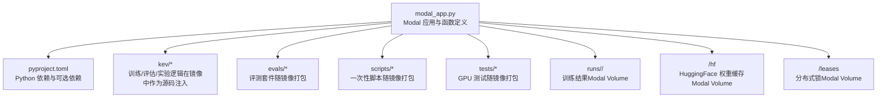
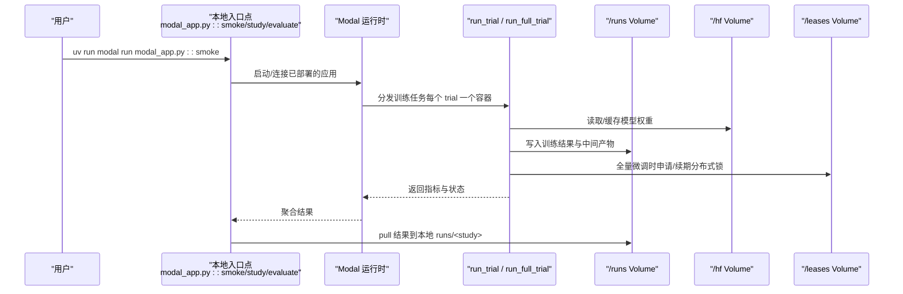
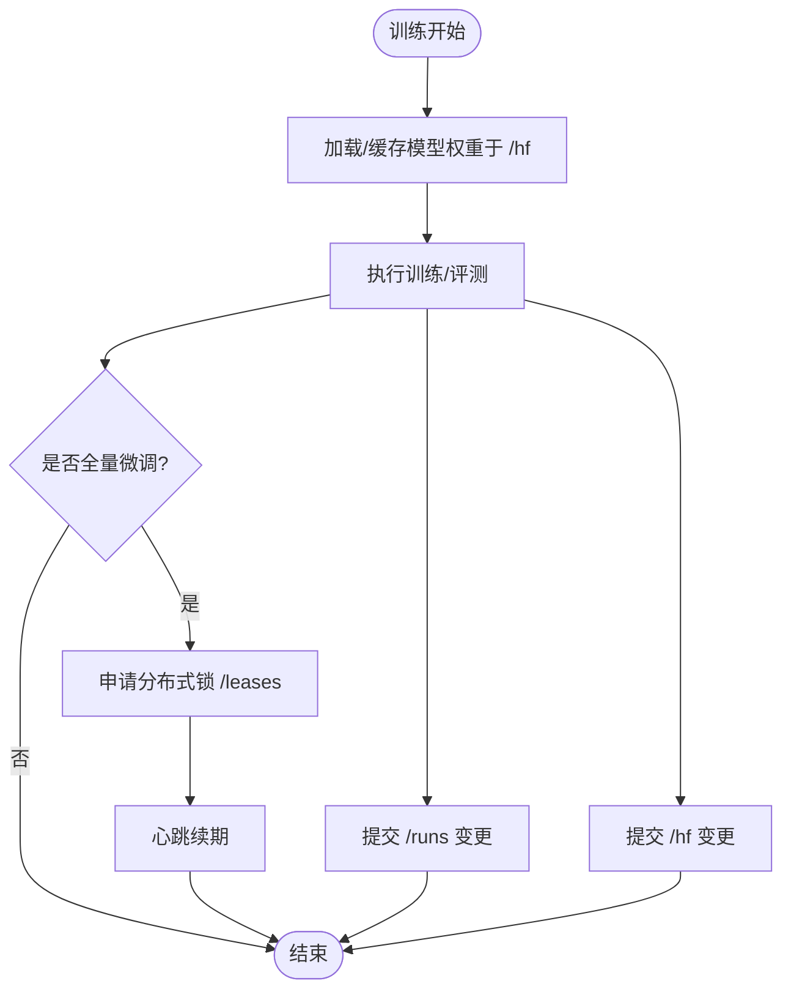
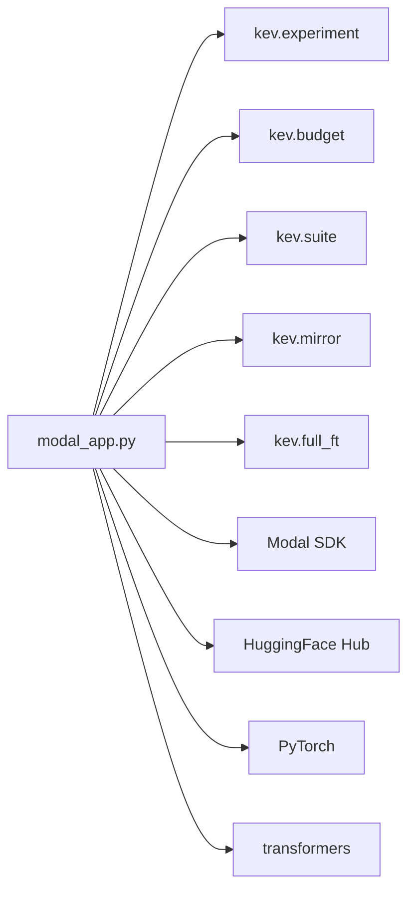

<cite>
**本文引用的文件**   
- [modal_app.py](file://modal_app.py)
- [pyproject.toml](file://pyproject.toml)
</cite>

## 目录
1. [简介](#简介)
2. [项目结构](#项目结构)
3. [核心组件](#核心组件)
4. [架构总览](#架构总览)
5. [详细组件分析](#详细组件分析)
6. [依赖关系分析](#依赖关系分析)
7. [性能与资源优化建议](#性能与资源优化建议)
8. [故障排查指南](#故障排查指南)
9. [结论](#结论)
10. [附录：常用部署命令速查](#附录常用部署命令速查)

## 简介
本文面向使用 Modal 运行 Kev 训练、评估与发布流程的研究与工程人员，聚焦以下目标：
- 解释 `modal_app.py` 的关键配置项：应用名称、GPU 类型选择、容器镜像构建参数。
- 说明依赖管理策略：Python 版本、PyTorch/CUDA 版本、transformers 库以及自定义包安装方式。
- 文档化 Volume 挂载：模型权重缓存、训练结果存储、分布式锁。
- 给出具体部署命令：冒烟测试、并行训练启动、资源分配配置。
- 提供性能优化建议：容器数量限制、超时设置、内存配置调优。

## 项目结构
Modal 应用入口位于仓库根目录的 `modal_app.py`，它通过 Modal App/Function 组织训练、评估、镜像构建、Volume 挂载与本地入口点；依赖声明位于 `pyproject.toml`。

**图示来源**
- [modal_app.py:38-83](file://modal_app.py#L38-L83)
- [modal_app.py:53-75](file://modal_app.py#L53-L75)
- [modal_app.py:76-83](file://modal_app.py#L76-L83)

**章节来源**
- [modal_app.py:1-19](file://modal_app.py#L1-L19)
- [modal_app.py:38-83](file://modal_app.py#L38-L83)
- [pyproject.toml:1-62](file://pyproject.toml#L1-L62)

## 核心组件
- 应用与镜像
  - 应用名由环境变量控制，默认值为 `kev-research`。
  - 镜像基于 Debian Slim + Python 3.13，使用 uv 同步锁定依赖，并额外安装 flash-linear-attention、triton、causal-conv1d 等 CUDA 相关包。
- GPU 与资源
  - 默认 GPU 为 `H100`，可通过 `KEV_GPU` 切换为 `T4`（免费层）或 `H200`。
  - 训练函数最大并发容器数为 24，超时可达数小时，内存按任务动态调整。
- Volume 挂载
  - `/hf`：HuggingFace 权重与 Triton 编译缓存。
  - `/runs`：训练结果、评测输出、快照与最终检查点。
  - `/leases`：全量微调尝试的分布式锁。
- 本地入口点
  - `smoke`、`study`、`evaluate`、`base_probe`、`benchmarks`、`serving`、`gpu_tests`、`pull`、`locked_test`、`resume` 等。

**章节来源**
- [modal_app.py:38-83](file://modal_app.py#L38-L83)
- [modal_app.py:96-116](file://modal_app.py#L96-L116)
- [modal_app.py:179-180](file://modal_app.py#L179-L180)
- [modal_app.py:245-266](file://modal_app.py#L245-L266)
- [modal_app.py:287-292](file://modal_app.py#L287-L292)
- [modal_app.py:318-320](file://modal_app.py#L318-L320)
- [modal_app.py:383-389](file://modal_app.py#L383-L389)
- [modal_app.py:565-578](file://modal_app.py#L565-L578)
- [modal_app.py:612-629](file://modal_app.py#L612-L629)
- [modal_app.py:1073-1078](file://modal_app.py#L1073-L1078)
- [modal_app.py:1232-1266](file://modal_app.py#L1232-L1266)

## 架构总览
下图展示从本地 CLI 到 Modal 容器的关键调用路径，包括训练、评测、结果拉取与分布式锁。

**图示来源**
- [modal_app.py:96-116](file://modal_app.py#L96-L116)
- [modal_app.py:118-176](file://modal_app.py#L118-L176)
- [modal_app.py:1258-1266](file://modal_app.py#L1258-L1266)
- [modal_app.py:1041-1063](file://modal_app.py#L1041-L1063)

## 详细组件分析

### 配置选项与环境变量
- APP_NAME
  - 通过 `KEV_APP_NAME` 覆盖，默认 `kev-research`。
  - 用于隔离不同研究环境的 Modal App。
- GPU 类型
  - 通过 `KEV_GPU` 指定，默认 `H100`；免费层可用 `T4`；大型任务可用 `H200`。
  - 所有 Function 的 `gpu=` 参数均使用该值。
- 工作区与挂载
  - `RUNS_MOUNT="/runs"`，`HF_MOUNT="/hf"`，`LEASES_MOUNT="/leases"`。
  - 三个 Volume 分别对应训练结果、HF 权重缓存、分布式锁。
- Secret
  - 若设置 `KEV_HF_SECRET`，则镜像环境注入该 Secret 名称，并在需要访问 gated 模型时挂载 Secret。

**章节来源**
- [modal_app.py:38-50](file://modal_app.py#L38-L50)
- [modal_app.py:53-83](file://modal_app.py#L53-L83)

### 容器镜像构建参数
- 基础镜像
  - `modal.Image.debian_slim(python_version="3.13")`。
- 系统依赖
  - 安装 git。
- Python 依赖
  - 使用 `uv_sync(uv_project_dir=ROOT, groups=[], extras=["serve"])` 同步锁定依赖，包含 serve 可选依赖。
  - 额外安装：
    - `flash-linear-attention==0.5.2`
    - `triton>=3.7.1`
    - `causal-conv1d` 预编译 wheel（匹配 torch 2.8 / CUDA 12 / Python 3.13），以 `--no-deps` 避免回退 triton 版本。
    - `pytest`（用于 GPU 测试）。
- 源码与数据
  - 注入本地 `kev` 源码、`uv.lock`、`pyproject.toml`、`evals`、`scripts`、`tests` 以及特定实验配置文件。
- 环境变量
  - `HF_HOME`、`HF_HUB_DISABLE_PROGRESS_BARS`、`TOKENIZERS_PARALLELISM=false`、`PYTHONUNBUFFERED=1`、`TRITON_CACHE_DIR`、`KEV_APP_NAME`、`KEV_GPU`。

**章节来源**
- [modal_app.py:53-75](file://modal_app.py#L53-L75)
- [modal_app.py:44-50](file://modal_app.py#L44-L50)
- [pyproject.toml:21-30](file://pyproject.toml#L21-L30)
- [pyproject.toml:37-54](file://pyproject.toml#L37-L54)

### 依赖管理
- Python 版本
  - 镜像固定为 Python 3.13；项目要求 `>=3.12,<3.14`。
- PyTorch 与 CUDA
  - 项目约束 `torch>=2.6,<2.9`；镜像注释指出 Linux torch wheels 是 CUDA 构建，且 triton 被 pin 到 3.4（但镜像又要求 triton>=3.7.1 以兼容 Hopper）。
- transformers
  - 项目约束 `transformers>=5.17,<6`。
- 自定义包
  - `flash-linear-attention`、`triton`、`causal-conv1d` 通过 `uv_pip_install` 安装。
  - causal-conv1d 使用预编译 wheel，避免依赖解析引入不兼容 triton。

**章节来源**
- [modal_app.py:53-75](file://modal_app.py#L53-L75)
- [pyproject.toml:13-30](file://pyproject.toml#L13-L30)

### Volume 挂载与持久化
- kev-hf-cache（/hf）
  - 挂载为 HF 权重缓存与 Triton 编译缓存目录。
  - 训练结束后 commit，减少重复下载与编译。
- kev-runs（/runs）
  - 训练结果、评测输出、快照与最终检查点。
  - 支持增量提交与拉取；大权重分片与 resume 点默认不拉取本地，除非显式请求。
- kev-leases（/leases）
  - 全量微调尝试的分布式锁文件，防止多个尝试同时写同一 trial。
  - 心跳线程定期刷新，失败时记录日志并等待下一次重试。

**图示来源**
- [modal_app.py:118-176](file://modal_app.py#L118-L176)
- [modal_app.py:855-930](file://modal_app.py#L855-L930)

**章节来源**
- [modal_app.py:76-83](file://modal_app.py#L76-L83)
- [modal_app.py:118-176](file://modal_app.py#L118-L176)
- [modal_app.py:855-930](file://modal_app.py#L855-L930)

### 部署命令与并行训练
- 冒烟测试
  - `uv run modal run modal_app.py::smoke`
  - 默认使用 `KEV_GPU` 指定的 GPU；可在环境变量中设置为 `T4` 以走免费层。
- 并行训练
  - `uv run modal run modal_app.py::study --suite evals/decision-v1 --plan experiments/mbp-comparison.json --name mbp-comparison-v1`
  - 每个 trial 独立容器；最大并发容器数 24。
  - 支持 detached 模式（默认）与 attached 模式。
- 资源分配
  - CPU、内存、超时、重试次数由各 Function 的装饰器参数决定；全量微调任务有更大磁盘与更长超时。
- 结果拉取
  - `uv run modal run modal_app.py::pull --name <study>`
  - 默认不拉取大权重分片与 resume 点；可加 `--weights` 强制拉取。

**章节来源**
- [modal_app.py:1073-1078](file://modal_app.py#L1073-L1078)
- [modal_app.py:1258-1266](file://modal_app.py#L1258-L1266)
- [modal_app.py:1016-1031](file://modal_app.py#L1016-L1031)
- [modal_app.py:1041-1063](file://modal_app.py#L1041-L1063)

## 依赖关系分析
- 应用内依赖
  - `modal_app.py` 依赖 `kev.experiment`、`kev.budget`、`kev.suite`、`kev.mirror`、`kev.full_ft` 等模块。
  - 这些模块在镜像中以源码形式注入，确保容器内行为与本地一致。
- 外部依赖
  - Modal SDK（开发依赖）、HuggingFace Hub（权重下载与上传）、PyTorch/Transformers（模型推理与训练）。
- 耦合与内聚
  - 训练与评测逻辑集中在 `kev/*`，Modal 层仅负责编排、资源与持久化，耦合度低。
  - Volume 抽象将持久化细节与业务逻辑解耦。

**图示来源**
- [modal_app.py:35-36](file://modal_app.py#L35-L36)
- [modal_app.py:96-116](file://modal_app.py#L96-L116)
- [modal_app.py:179-180](file://modal_app.py#L179-L180)

**章节来源**
- [modal_app.py:35-36](file://modal_app.py#L35-L36)
- [modal_app.py:96-116](file://modal_app.py#L96-L116)
- [modal_app.py:179-180](file://modal_app.py#L179-L180)

## 性能与资源优化建议
- 容器数量限制
  - 训练函数设置 `max_containers=24`，避免同时拉起过多容器导致平台配额不足。
  - 对于大规模并行训练，建议分批提交 study，或使用 detached 模式配合 `pull` 异步收集结果。
- 超时设置
  - 普通训练超时较短，全量微调超时更长（例如 8 小时或 24 小时），应根据模型规模与数据集大小调整。
  - 评测任务可按 suite 设置超时（如 longstate、documents、transfer-v9、longdoc）。
- 内存配置
  - 全量微调任务内存上限更高，部分场景需显式提升 memory 上限以避免 OOM。
  - 加载大权重时会经过主机内存，必要时提高内存配置。
- 缓存与 IO
  - 启用 HF 缓存与 Triton 编译缓存，减少重复下载与编译时间。
  - 使用 Volume 增量提交，避免每次训练都重新拉取全部结果。

**章节来源**
- [modal_app.py:103-116](file://modal_app.py#L103-L116)
- [modal_app.py:179-180](file://modal_app.py#L179-L180)
- [modal_app.py:245-266](file://modal_app.py#L245-L266)
- [modal_app.py:580-587](file://modal_app.py#L580-L587)

## 故障排查指南
- 代码不一致
  - 如果容器内 `kev/*.py` 哈希与本地不一致，会抛出错误并要求先部署最新应用。
- 分布式锁冲突
  - 全量微调尝试通过 `/leases` 上的 lease 文件协调；若心跳过期或锁被其他尝试持有，会拒绝新尝试。
- 结果未拉取
  - 默认不拉取大权重分片与 resume 点；如需本地查看完整检查点，请显式使用 `--weights`。
- 权限与 Secret
  - 访问 gated 模型需正确设置 `KEV_HF_SECRET`，并确保 Secret 名称与容器内环境变量一致。

**章节来源**
- [modal_app.py:124-129](file://modal_app.py#L124-L129)
- [modal_app.py:855-930](file://modal_app.py#L855-L930)
- [modal_app.py:529-563](file://modal_app.py#L529-L563)
- [modal_app.py:44-50](file://modal_app.py#L44-L50)

## 结论
本文件系统化梳理了 Kev 在 Modal 上的部署流程，涵盖配置项、依赖管理、Volume 挂载、部署命令与性能优化建议。通过合理设置 `KEV_APP_NAME`、`KEV_GPU` 与 Volume 挂载，并结合容器数量、超时与内存调优，可以在保证稳定性的前提下高效完成训练与评测任务。

## 附录：常用部署命令速查
- 冒烟测试
  - `uv run modal run modal_app.py::smoke`
- 并行训练
  - `uv run modal run modal_app.py::study --suite evals/decision-v1 --plan experiments/mbp-comparison.json --name mbp-comparison-v1`
- 评测现有检查点
  - `uv run modal run modal_app.py::evaluate --run jaredpalmer/kev-0.5b --suite evals/transfer-v1 --name transfer-kev-v01-h100`
- 拉取结果
  - `uv run modal run modal_app.py::pull --name <study>`
- 服务基准测试
  - `uv run modal run modal_app.py::serving --run <hub id> --gpu <GPU> --name <name>`

**章节来源**
- [modal_app.py:1258-1266](file://modal_app.py#L1258-L1266)
- [modal_app.py:1073-1078](file://modal_app.py#L1073-L1078)
- [modal_app.py:287-292](file://modal_app.py#L287-L292)